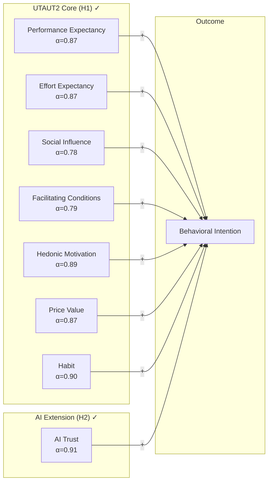
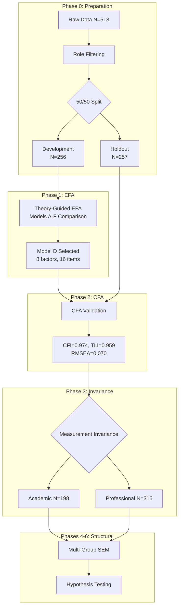

<div align="center">
  
</div>

---

# **AI Readiness Scale (AIRS): Extending UTAUT2 for Enterprise AI Adoption**
## *Theory-Grounded Validation of AI Trust as a Critical Adoption Construct*

<table width="100%">
<tr><td><strong>Researcher</strong></td><td>Fabio Correa</td></tr>
<tr><td><strong>Institution</strong></td><td>Touro University Worldwide</td></tr>
<tr><td><strong>Program</strong></td><td>Doctor of Business Administration (DBA)</td></tr>
<tr><td><strong>Date</strong></td><td>November 28, 2025</td></tr>
<tr><td><strong>Status</strong></td><td>✅ Phase 4 Complete | Structural Model Validated | R²=0.558, CFI=0.976</td></tr>
</table>

---

## 🎯 **Executive Summary**

This research develops and validates the **AI Readiness Scale (AIRS)**, a theory-grounded extension of UTAUT2 for enterprise AI adoption contexts. Through rigorous split-sample validation (N=513), we demonstrate:

### **Key Findings**

1. **Validated Model D**: 8-factor structure with 16 items
   - 7 UTAUT2 core constructs (PE, EE, SI, FC, HM, PV, HB)
   - 1 AI-specific extension: **AI Trust** (α=0.91)
   - Excellent fit: CFI=0.974, TLI=0.959, RMSEA=0.070

2. **Structural Model Results** (Phase 4):
   - **H1 Partially Supported**: 3/7 UTAUT2 paths significant
   - **H2 Supported**: AI Trust predicts adoption (β=0.112, p=.048)
   - **H3 Not Supported**: ΔAIC=+2.01 favors simpler UTAUT2-only model
   - **H4 Not Supported**: No significant moderation by population
   - **R² = 55.8%** variance explained in Behavioral Intention

3. **Dominant Predictors** (Full Sample N=513):
   - Price Value: β=0.499*** (strongest predictor)
   - Hedonic Motivation: β=0.203***
   - Social Influence: β=0.145**
   - AI Trust: β=0.112*

4. **Item Design Insights**: 4 constructs dropped due to item design issues (not theoretical problems):
   - Voluntariness, Explainability, Ethical Risk, Anxiety
   - Documented recommendations for future scale development

5. **Population Comparison**: Measurement invariance testing reveals:
   - **Configural invariance supported** across Academic (N=198) and Professional (N=315) samples
   - **Partial metric invariance**: 4/16 items function differently (SI2, FC1, EE2, PE1)
   - **No structural moderation**: Path coefficients similar across populations

### **Practical Impact**

Organizations now have a **validated 16-item diagnostic instrument** for assessing AI adoption readiness, with:
- Theoretical grounding in established technology acceptance research
- Empirical validation across academic and professional populations
- Clear scoring and interpretation guidelines

---

## 📚 **Table of Contents**

1. [Validated Measurement Model](#validated-measurement-model)
2. [Research Questions & Hypotheses](#research-questions--hypotheses)
3. [Methodological Approach](#methodological-approach)
4. [Phase Results Summary](#phase-results-summary)
5. [Dissertation Contributions](#dissertation-contributions)
6. [Project Documentation](#project-documentation)
7. [How to Use This Repository](#how-to-use-this-repository)

---

## 📊 **Validated Measurement Model**

### Model D: 8 Factors × 2 Items = 16 Items



### Model Fit Statistics (CFA Holdout N=257)

| Metric | Value | Threshold | Status |
|--------|-------|-----------|--------|
| CFI | 0.974 | ≥ 0.95 | ✓ Excellent |
| TLI | 0.959 | ≥ 0.95 | ✓ Excellent |
| RMSEA | 0.070 | ≤ 0.08 | ✓ Good |
| χ²/df | 1.51 | ≤ 3.0 | ✓ Excellent |

### Construct Reliability

| Construct | Items | α | CR | AVE | Status |
|-----------|-------|---|----|----|--------|
| Performance Expectancy | PE1, PE2 | 0.87 | 0.87 | 0.77 | ✓ Excellent |
| Effort Expectancy | EE1, EE2 | 0.87 | 0.87 | 0.77 | ✓ Excellent |
| Social Influence | SI1, SI2 | 0.78 | 0.79 | 0.66 | ✓ Good |
| Facilitating Conditions | FC1, FC2 | 0.79 | 0.80 | 0.66 | ✓ Good |
| Hedonic Motivation | HM1, HM2 | 0.89 | 0.89 | 0.81 | ✓ Excellent |
| Price Value | PV1, PV2 | 0.87 | 0.87 | 0.77 | ✓ Excellent |
| Habit | HB1, HB2 | 0.90 | 0.90 | 0.82 | ✓ Excellent |
| **AI Trust** | **TR1, TR2** | **0.91** | **0.91** | **0.83** | **✓ Excellent** |

---

## 🔍 **Research Questions & Hypotheses**

### Primary Research Questions

| RQ | Question | Status |
|----|----------|--------|
| **RQ1** | What factors influence AI adoption readiness in organizational settings? | ✅ Answered |
| **RQ2** | Do UTAUT2 constructs predict AI adoption readiness? | ✅ Answered |
| **RQ3** | Does AI Trust add explanatory power beyond UTAUT2? | ✅ Answered |
| **RQ6** | Does the factor structure hold across academic and professional populations? | ✅ Answered |
| **RQ7** | Do populations differ in AI readiness levels? | ✅ Answered |

### Hypotheses

| Hypothesis | Prediction | Analysis | Status |
|------------|------------|----------|--------|
| **H1** | UTAUT2 constructs predict AI adoption | Structural model | ⚠️ Partially Supported (3/7 paths) |
| **H2** | AI Trust predicts adoption beyond UTAUT2 | Incremental validity | ✅ Supported (β=0.112*) |
| **H3** | Combined AIRS explains more variance than UTAUT2 alone | Model comparison | ❌ Not Supported (ΔAIC=+2.01) |
| **H4** | Role, usage frequency, voluntariness moderate relationships | Multi-group SEM | ❌ Not Supported (population) |
| ~~H5~~ | ~~Mediation through EX, ER, AX~~ | ~~Bootstrap mediation~~ | ❌ Not testable |

**Note**: H5 mediation hypotheses cannot be tested because Explainability (EX), Ethical Risk (ER), and Anxiety (AX) were dropped due to item design issues.

---

## 🔬 **Methodological Approach**

### Sample Overview

| Parameter | Value |
|-----------|-------|
| **Total Sample** | N = 513 (after role filtering) |
| **Development Sample** | N = 256 (EFA) |
| **Holdout Sample** | N = 257 (CFA) |
| **Academic** | N = 198 (Full-time + Part-time students) |
| **Professional** | N = 315 (Employed, Freelancers, Managers) |

### Validation Strategy: Theory-Guided EFA → CFA → Measurement Invariance



### Analysis Roadmap

| Phase | Notebook | Description | Status |
|-------|----------|-------------|--------|
| **0** | `00a_Create_Split_Samples.ipynb`, `00b_Prepare_Experiment_Data.ipynb` | Sample preparation | ✅ Complete |
| **1** | `01_EFA_Experiment.ipynb` | Theory-guided EFA → Model D | ✅ Complete |
| **2** | `02_CFA_Experiment.ipynb` | CFA validation | ✅ Complete |
| **3** | `03_Measurement_Invariance.ipynb` | Cross-population invariance | ✅ Complete |
| **4** | `04_Structural_Model.ipynb` | Hypothesis testing (H1-H4) | ✅ Complete |
| **5** | `05_Mediation_Analysis.ipynb` | Alternative analyses | ⏭️ Next |
| **6** | `06_Moderation_Analysis.ipynb` | H4 contextual moderation | ⏭️ Pending |
| **7** | `07_Tool_Usage_Patterns.ipynb` | AI tool usage patterns | ⏭️ Pending |
| **8** | `08_Qualitative_Feedback.ipynb` | Thematic analysis | ⏭️ Pending |

---

## 📈 **Phase Results Summary**

### Phase 1: EFA Results

**Approach**: Theory-guided model comparison (Models A-F)

| Model | Factors | Items | Strategy | All α ≥ 0.60? | Selected |
|-------|---------|-------|----------|---------------|----------|
| A | 12 | 24 | Full theoretical | ✗ No | |
| B | 10 | 20 | Drop 4 weakest items | ✗ No | |
| C | 10 | 20 | Drop weak constructs | ✗ No | |
| **D** | **8** | **16** | **Drop all α < 0.60 constructs** | **✓ Yes** | **✓** |
| E | 6 | 12 | Core UTAUT only | ✓ Yes | |
| F | 4 | 8 | Minimal viable | ✓ Yes | |

**Key Finding**: Model D balances theoretical coverage with psychometric quality.

### Phase 2: CFA Results

**Model D validated** on independent holdout sample (N=257) with excellent fit.

### Phase 3: Measurement Invariance Results

**Configural Invariance** (RQ6): ✓ **SUPPORTED**
- Academic: CFI=0.957, TLI=0.932, RMSEA=0.075
- Professional: CFI=0.986, TLI=0.977, RMSEA=0.055

**Metric Invariance**: ⚠️ **PARTIAL**
- 4/16 items show loading differences > 0.10
- Non-invariant: SI2 (Δλ=0.35), FC1 (Δλ=0.20), EE2 (Δλ=0.16), PE1 (Δλ=0.10)

**Mean Differences** (RQ7): 3/8 constructs differ significantly

| Construct | Academic M | Professional M | Cohen's d | p |
|-----------|-----------|----------------|-----------|---|
| Social Influence | 2.97 | 3.32 | -0.34 | <.001 |
| Effort Expectancy | 3.80 | 3.53 | +0.27 | .003 |
| Hedonic Motivation | 3.11 | 3.41 | -0.27 | .003 |

**Interpretation**: Professionals perceive stronger social pressure and enjoyment; Academics find AI easier to use.

### Phase 4: Structural Model Results

**Full Sample Structural Model** (N=513): CFI=0.976, TLI=0.965, RMSEA=0.058, R²=0.558

**Hypothesis Testing Summary**:

| Hypothesis | Result | Key Evidence |
|------------|--------|--------------|
| **H1**: UTAUT2 → BI | ⚠️ Partially Supported | 3/7 paths significant |
| **H2**: AI Trust → BI | ✅ Supported | β=0.112, p=.048 |
| **H3**: AIRS > UTAUT2 | ❌ Not Supported | ΔAIC=+2.01 |
| **H4**: Population Moderation | ❌ Not Supported | No significant Δβ |

**Significant Predictors** (ranked by effect size):

| Path | β | p | Interpretation |
|------|---|---|----------------|
| PV → BI | 0.499 | <.001 | Price Value is dominant predictor |
| HM → BI | 0.203 | <.001 | Enjoyment drives adoption |
| SI → BI | 0.145 | .002 | Social influence matters |
| TR → BI | 0.112 | .048 | AI Trust adds unique variance |

**Non-Significant Paths**: PE, EE, FC, HB (all p > .05)

**Multi-Group Comparison**:
| Group | N | CFI | R² (BI) |
|-------|---|-----|--------|
| Academic | 198 | 0.957 | 0.603 |
| Professional | 315 | 0.986 | 0.532 |

**Key Finding**: Price Value (β=0.499) explains the majority of adoption readiness variance, with AI Trust providing modest but significant incremental contribution.

---

## 🎓 **Dissertation Contributions**

### Theoretical Contributions

| Contribution | Finding |
|--------------|---------|
| **Foundation Validation** | UTAUT2 confirmed as solid foundation for AI adoption (all 7 constructs validated) |
| **AI Trust Extension** | AI Trust validated as significant addition to UTAUT2 for AI contexts |
| **Item Design Insights** | Documented specific issues preventing validation of VO, EX, ER, AX |
| **Population Differences** | Partial metric invariance reveals differential construct functioning |

### Dropped Constructs: Diagnostic Summary

| Construct | Inter-item r | Root Cause | Recommendation |
|-----------|--------------|------------|----------------|
| Voluntariness | 0.27 | VO1 (motivation) ≠ VO2 (autonomy) | Separate motivation vs. choice scales |
| Explainability | 0.38 | EX1 (comprehension) ≠ EX2 (preference) | Separate literacy from preference |
| Ethical Risk | 0.31 | ER1 (job threat) ≠ ER2 (privacy) | Domain-specific risk subscales |
| **Anxiety** | **0.15** | **AX1 (avoidance) ≠ AX2 (FOMO)** | **Separate avoidance vs. approach** |

**Critical Finding**: Anxiety items measure **OPPOSITE motivational directions**:
- AX1: Avoidance anxiety → negative adoption correlation
- AX2: FOMO anxiety → positive adoption correlation

---

## 📁 **Project Documentation**

### Directory Structure

```
AIRS_Data_Analysis/
├── airs_experiment/          # Current analysis pipeline
│   ├── 00a_Create_Split_Samples.ipynb
│   ├── 00b_Prepare_Experiment_Data.ipynb
│   ├── 01_EFA_Experiment.ipynb
│   ├── 02_CFA_Experiment.ipynb
│   ├── 03_Measurement_Invariance.ipynb
│   ├── data/                 # Analysis data files
│   ├── plots/                # Generated visualizations
│   └── tables/               # Summary statistics
├── plan/
│   └── ANALYSIS_PLAN_v2.md   # Master analysis roadmap
├── data/                     # Source data files
├── archive/                  # Previous notebook versions
├── docs/                     # Documentation
└── alex/                     # AI assistant configuration
```

### Key Files

| File | Description |
|------|-------------|
| `plan/ANALYSIS_PLAN_v2.md` | Complete analysis roadmap with hypotheses and methodology |
| `airs_experiment/*.ipynb` | Analysis notebooks (Phases 0-8) |
| `data/airs_28item_complete.json` | Item metadata and semantic descriptions |

---

## 🚀 **How to Use This Repository**

### For Researchers

**1. Replicate Analysis**:
```bash
# Install dependencies
pip install -r requirements.txt

# Run notebooks sequentially in airs_experiment/
# 00a → 00b → 01 → 02 → 03 → 04 → ...
```

**2. Access Validated Scale**:
- 16 items across 8 constructs (see Model D above)
- All items use 7-point Likert (1=Strongly Disagree to 7=Strongly Agree)
- Scoring: Calculate mean per construct

### For Practitioners

**1. Administer AIRS-16**:
- 16 items, ~5 minutes completion time
- See item wordings in `data/airs_28item_complete.json`

**2. Score & Interpret**:
```python
# Per-construct scores
PE_score = mean(PE1, PE2)  # Performance Expectancy
EE_score = mean(EE1, EE2)  # Effort Expectancy
SI_score = mean(SI1, SI2)  # Social Influence
FC_score = mean(FC1, FC2)  # Facilitating Conditions
HM_score = mean(HM1, HM2)  # Hedonic Motivation
PV_score = mean(PV1, PV2)  # Price Value
HB_score = mean(HB1, HB2)  # Habit
TR_score = mean(TR1, TR2)  # AI Trust

# Overall AIRS score (simple average)
AIRS_total = mean(all_16_items)
```

**3. Benchmark**:
- Compare scores to population means (available after Phase 4 completion)
- Consider population differences when interpreting (Academic vs. Professional)

---

## 📚 **Key References**

**Foundational Frameworks**:
- Venkatesh, V., Morris, M. G., Davis, G. B., & Davis, F. D. (2003). User acceptance of information technology. *MIS Quarterly, 27*(3), 425-478.
- Venkatesh, V., Thong, J. Y. L., & Xu, X. (2012). Consumer acceptance and use of information technology: Extending UTAUT. *MIS Quarterly, 36*(1), 157-178.

**AI-Specific Extensions**:
- Shin, D. (2021). The effects of explainability and causability on perception, trust, and acceptance. *International Journal of Human-Computer Studies, 146*, 102551.
- Langer, M., et al. (2021). What do we want from explainable artificial intelligence (XAI)? *Artificial Intelligence, 296*, 103473.

**Psychometric Methods**:
- Hair, J. F., et al. (2019). *Multivariate data analysis* (8th ed.). Cengage.
- Costello, A. B., & Osborne, J. W. (2005). Best practices in exploratory factor analysis. *Practical Assessment, Research, and Evaluation, 10*(7), 1-9.

---

## 📧 **Contact**

**Researcher**: Fabio Correa
**Institution**: Touro University Worldwide
**Program**: Doctor of Business Administration (DBA)

---

## ⚖️ **License**

This project is licensed under [MIT License](LICENSE.md) for code and [CC BY 4.0](https://creativecommons.org/licenses/by/4.0/) for documentation.

### Citation

```bibtex
@phdthesis{correa2025airs,
  author = {Correa, Fabio},
  title = {AI Readiness Scale (AIRS): Extending UTAUT2 for Enterprise AI Adoption},
  school = {Touro University Worldwide},
  year = {2025},
  type = {Doctoral dissertation}
}
```

---

**Document Status**: ✅ Phase 4 Complete
**Last Updated**: November 28, 2025
**Version**: 4.0 (Structural Model Validation)
