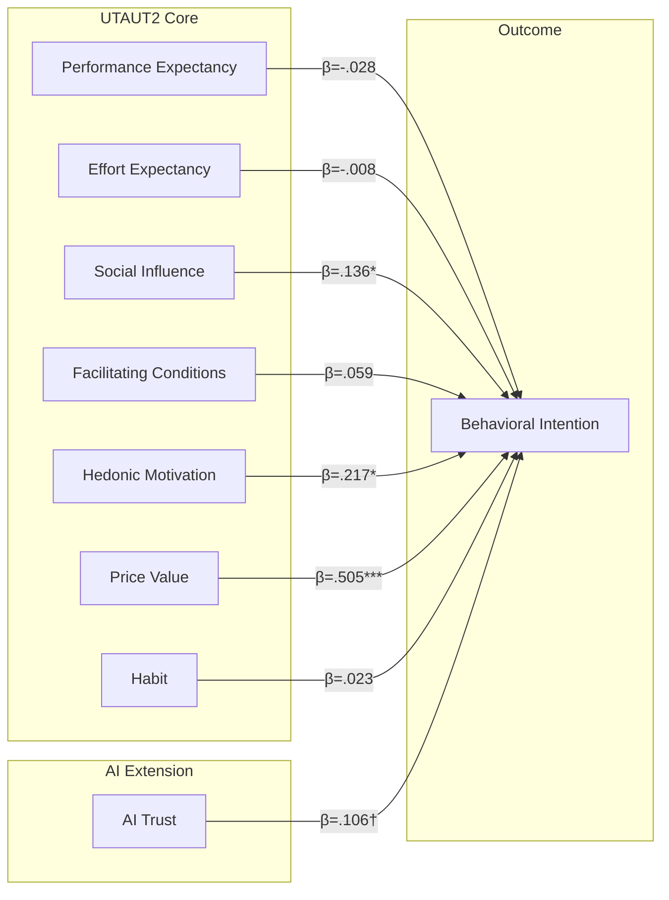

<!-- markdownlint-disable MD033 MD041 -->
<div align="center">
  
</div>
<!-- markdownlint-enable MD033 MD041 -->

---

# Artificial Intelligence Readiness Scale (AIRS)

Extending Model for Enterprise AI Adoption

<!-- markdownlint-disable MD033 -->
<table>
  <tr><td><strong>Researcher</strong></td><td>Fabio Correa</td></tr>
  <tr><td><strong>Institution</strong></td><td>Touro University Worldwide</td></tr>
  <tr><td><strong>Program</strong></td><td>Doctor of Business Administration (DBA)</td></tr>
  <tr><td><strong>Updated</strong></td><td>December 8, 2025</td></tr>
</table>
<!-- markdownlint-enable MD033 -->

> 📝 **[View Current Thesis Draft (PDF)](thesis/DRAFT%2006.pdf)** | Latest compiled version of the dissertation (DRAFT 06 - All chapters complete, 92 references, Appendix H data availability)

---

## Project Status

| Component | Status | Progress |
|-----------|--------|----------|
| **Analysis Pipeline** | ✅ Complete | 11/11 notebooks verified |
| **Thesis Chapter 1** | ✅ Complete | Introduction (~2,800 words) |
| **Thesis Chapter 2** | ✅ Complete | Literature Review (~5,200 words) |
| **Thesis Chapter 3** | ✅ Complete | Methodology (~3,800 words) |
| **Thesis Chapter 4** | ✅ Complete | Results (~3,200 words) |
| **Thesis Chapter 5** | ✅ Complete | Analysis & Discussion (~4,100 words) |
| **Thesis Chapter 6** | ✅ Complete | Conclusions (~2,500 words) |
| **Bibliography** | ✅ Complete | 92 references verified |
| **Tables & Figures** | ✅ Complete | LaTeX auto-numbered |
| **IRB Approval** | ✅ Complete | Letter embedded |

---

## DBA Thesis Positioning

This research bridges **academic rigor** with **business impact**:

| Academic Contribution | Business Contribution |
|-----------------------|-----------------------|
| Extends UTAUT2 with AI-specific constructs | 16-item diagnostic tool for AI readiness |
| Rigorous EFA→CFA→SEM validation | Intervention targeting for 4 user segments |
| Novel moderator discovery (Experience) | Tailored training by experience level |
| Cross-population validation | Leaders as AI champions (d=0.74-1.14) |
| Empirical gap closure | Links to McKinsey/BCG adoption-value gap |

---

## Executive Summary

This research develops and validates the **AI Readiness Scale (AIRS)**, a psychometrically sound instrument extending UTAUT2 for enterprise AI tool adoption. Through rigorous split-sample validation (N=523), we demonstrate:

### Key Findings

| Finding | Evidence |
|---------|----------|
| **Validated 8-factor model** | 16 items, CFI=.975, TLI=.960, RMSEA=.065 |
| **Price Value dominates** | β=.505 (p<.001), strongest predictor |
| **Experience moderates adoption** | HM×Exp (p=.007) significant |
| **Four user typologies identified** | Enthusiasts 16%, Cautious 30%, Moderate 37%, Anxious 17% |
| **Leaders dominate tool usage** | d=0.74-1.14 across all AI tools |
| **Model explains 86.1% variance** | R²=.861 in Behavioral Intention |

### Practical Impact

Organizations now have a **validated 16-item diagnostic instrument** for assessing AI adoption readiness with:

- Theoretical grounding in UTAUT2 framework
- Empirical validation across student and professional populations
- Four distinct user segments for targeted intervention design

---

## Sample Overview

| Parameter | Value |
|-----------|-------|
| **Full Sample** | N = 523 |
| **EFA Development** | n = 261 (50%) |
| **CFA Holdout** | n = 262 (50%) |
| **Random Seed** | 67 |

### Role Distribution

| Role | n | % |
|------|---|---|
| Student | 216 | 41.3% |
| Professional | 184 | 35.2% |
| Leader | 123 | 23.5% |

---

## Validated Measurement Model

### Model: 8 Factors, 16 Items



### Model Fit (CFA Holdout, n=262)

| Index | Value | Threshold | Interpretation |
|-------|-------|-----------|----------------|
| CFI | .975 | ≥.95 | Excellent |
| TLI | .960 | ≥.95 | Excellent |
| RMSEA | .065 | ≤.08 | Good |
| SRMR | .048 | ≤.08 | Excellent |

### Reliability

| Factor | α | CR | AVE |
|--------|-----|-----|-----|
| Performance Expectancy | .803 | .804 | .673 |
| Effort Expectancy | .859 | .861 | .756 |
| Social Influence | .752 | .763 | .621 |
| Facilitating Conditions | .743 | .750 | .601 |
| Hedonic Motivation | .864 | .865 | .763 |
| Price Value | .883 | .883 | .790 |
| Habit | .909 | .909 | .833 |
| AI Trust | .891 | .891 | .804 |

---

## Hypothesis Testing Results

| ID | Hypothesis | Result | Evidence |
|----|------------|--------|----------|
| H1a | PE → BI (+) | ❌ Not Supported | β=-.028, p=.791 |
| H1b | EE → BI (+) | ❌ Not Supported | β=-.008, p=.875 |
| H1c | SI → BI (+) | ✅ Supported | β=.136, p=.024 |
| H1d | FC → BI (+) | ❌ Not Supported | β=.059, p=.338 |
| H1e | HM → BI (+) | ✅ Supported | β=.217, p=.014 |
| H1f | PV → BI (+) | ✅ Supported (Strongest) | β=.505, p<.001 |
| H1g | HB → BI (+) | ❌ Not Supported | β=.023, p=.631 |
| H2 | TR → BI (+) | ❌ Marginal | β=.106, p=.064 |
| H3 | Experience moderates | ⚠️ Partial | HM×Exp p=.007 |
| H4 | BI predicts usage | ✅ Supported | ρ=.69, p<.001 |
| H5 | Role differs in usage | ✅ Supported | Leaders > Others |

---

## Analysis Pipeline

All notebooks in `airs_experiment/` are complete and verified:

| Phase | Notebook | Purpose | Status |
|-------|----------|---------|--------|
| 0 | `00_Create_Split_Samples` | Sample preparation | ✅ |
| 1 | `01_EFA_Experiment` | Factor exploration | ✅ |
| 2 | `02_CFA_Experiment` | Model validation | ✅ |
| 3 | `03_Measurement_Invariance` | Group equivalence | ✅ |
| 4 | `04_Structural_Model` | Hypothesis testing | ✅ |
| 5 | `05_Mediation_Analysis` | Indirect effects | ✅ |
| 6 | `06_Moderation_Analysis` | Interaction effects | ✅ |
| 7 | `07_Tool_Usage_Patterns` | Behavioral validation | ✅ |
| 8 | `08_Qualitative_Feedback` | Thematic analysis | ✅ |
| 9 | `09_Comprehensive_Review` | Gap analysis | ✅ |
| 10 | `10_Final_Synthesis` | Integration | ✅ |

---

## Repository Structure

```text
AIRS_Data_Analysis/
├── airs_experiment/          # Analysis notebooks and outputs
│   ├── data/                 # Processed datasets
│   ├── plots/                # Generated visualizations
│   ├── results/              # JSON output files
│   └── tables/               # CSV summary tables
├── thesis/                   # DBA thesis documentation
│   ├── chapters/             # Chapter files (1-6)
│   ├── tables/               # Publication-ready tables (9)
│   ├── figures/              # Exported figures
│   ├── references/           # Bibliography (92 refs)
│   ├── EXECUTIVE_SUMMARY.md  # Standalone executive summary
│   ├── PRACTITIONER_BRIEF.md # Standalone practitioner brief
│   ├── THESIS_SUMMARY.md     # 5-page thesis summary
│   ├── PRESENTATION_SLIDES.md # Committee presentation draft
│   └── DRAFT 06.pdf          # Current compiled thesis
├── research/                 # Literature and industry sources
│   ├── AIRS literatyre review.md        # Theoretical foundation
│   ├── Bridging the AI Adoption Gap...  # Industry benchmarks (585 lines)
│   ├── Meta-Analysis of UTAUT...        # Blut et al. 2022 (84 pages)
│   └── Venkatesh_AOR_2021.md            # AI-UTAUT research agenda
├── plan/                     # Analysis planning documents
├── data/                     # Raw data files
├── docs/                     # Additional documentation
└── scripts/                  # Utility scripts
```

---

## Thesis Documentation

### Completed

| Document | Location | Words |
|----------|----------|-------|
| Chapter 1: Introduction | `thesis/chapters/01_introduction.md` | ~2,800 |
| Chapter 2: Literature Review | `thesis/chapters/02_literature_review.md` | ~5,200 |
| Chapter 3: Methodology | `thesis/chapters/03_methodology.md` | ~3,800 |
| Chapter 4: Results | `thesis/chapters/04_results.md` | ~3,200 |
| Chapter 5: Analysis & Discussion | `thesis/chapters/05_analysis_discussion.md` | ~4,100 |
| Chapter 6: Conclusions | `thesis/chapters/06_conclusions.md` | ~2,500 |
| Appendices A-H | `thesis/appendices.md` | Complete |
| Tables 4.1-4.9 | `thesis/tables/` | 9 tables |
| Bibliography | `thesis/references/bibliography.bib` | 92 refs |

### Build & PDF Generation

See [`PDF_GENERATION.md`](PDF_GENERATION.md) for complete documentation on:

- Full thesis build (`thesis/build-thesis.ps1`)
- Standalone document conversion (`thesis/convert-to-pdf.ps1`)
- Prerequisites and troubleshooting

### Key Methodological Decisions Documented

| Decision | Rationale | Location |
|----------|-----------|----------|
| 4 constructs dropped (VO, EX, ER, AX-orig) | Poor reliability (α = .301–.582) | Ch 3 §3.4.4, Ch 4 §4.2.1 |
| AIRS vs UTAUT2 comparison | ΔR² = .016 (modest improvement) | Ch 4 §4.3.5 |
| H5 mediation untestable | EX/ER excluded from model | Ch 5 §5.6.2, §5.7.1 |

See `thesis/TODO.md` for detailed task list.

---

## Quick Start

### Requirements

```bash
pip install -r requirements.txt
```

Key dependencies: pandas, numpy, scipy, factor_analyzer, semopy, pingouin, scikit-learn, matplotlib, seaborn

### Run Analysis

```bash
# Navigate to experiment folder
cd airs_experiment

# Run notebooks sequentially
# 00 → 01 → 02 → ... → 10
```

### Use the AIRS-16 Scale

The validated 16-item scale measures 8 predictor constructs plus Behavioral Intention:

```python
# Calculate construct scores (mean of 2 items each)
# 8 Predictor Constructs (16 items)
PE = mean(PE1, PE2)  # Performance Expectancy
EE = mean(EE1, EE2)  # Effort Expectancy
SI = mean(SI1, SI2)  # Social Influence
FC = mean(FC1, FC2)  # Facilitating Conditions
HM = mean(HM1, HM2)  # Hedonic Motivation
PV = mean(PV1, PV2)  # Price Value (STRONGEST predictor β=.505)
HB = mean(HB1, HB2)  # Habit
TR = mean(TR1, TR2)  # AI Trust

# Outcome Variable (4 items)
BI = mean(BI1, BI2, BI3, BI4)  # Behavioral Intention
```

---

## Key References

### Technology Acceptance

- Venkatesh, V., et al. (2003). User acceptance of information technology. *MIS Quarterly, 27*(3), 425-478.
- Venkatesh, V., et al. (2012). Consumer acceptance and use of information technology: Extending UTAUT. *MIS Quarterly, 36*(1), 157-178.

### Scale Development

- DeVellis, R. F., & Thorpe, C. T. (2021). *Scale development: Theory and applications* (5th ed.). Sage.
- Hair, J. F., et al. (2019). *Multivariate data analysis* (8th ed.). Cengage.

### AI Adoption

- Shin, D. (2021). The effects of explainability and causability on perception, trust, and acceptance. *IJHCS, 146*, 102551.

Full bibliography: `thesis/references/bibliography.bib`

---

## Citation

```bibtex
@phdthesis{correa2025airs,
  author = {Correa, Fabio},
  title = {Artificial Intelligence Readiness Scale: Extending Model for Enterprise AI Adoption},
  school = {Touro University Worldwide},
  year = {2025},
  type = {Doctoral dissertation}
}
```

---

## License

Code: [MIT License](LICENSE.md)
Documentation: [CC BY 4.0](https://creativecommons.org/licenses/by/4.0/)

---

**Last Updated**: December 8, 2025
**Version**: 6.5 (DRAFT 06 - All chapters complete, 92 references, Appendix H)
