<div align="center">
  
</div>

---

# **The AIRS Journey: From Theory to Validated Instrument**
## *A Narrative of Discovery, Decisions, and Insights*

<table width="100%">
<tr><td><strong>Researcher</strong></td><td>Fabio Correa</td></tr>
<tr><td><strong>Institution</strong></td><td>Touro University Worldwide</td></tr>
<tr><td><strong>Program</strong></td><td>Doctor of Business Administration (DBA)</td></tr>
<tr><td><strong>Date</strong></td><td>November 23, 2025 (Week 28 of 32)</td></tr>
<tr><td><strong>Status</strong></td><td>✅ Phases 1-6 Complete | ✅ Phase 7a Complete | ✅ Phase 7b Complete | ⏭️ Phase 7c Active: Chapter 4 Writing | N=362</td></tr>
</table>

---

## 📖 **The Story So Far**

This is the story of how we built and validated the **AI Readiness Scale (AIRS)**—a journey that began with Dr. Venkatesh's UTAUT2 framework and evolved through data-driven discovery, tough methodological choices, and surprising insights about how people really feel about AI in the workplace.

### **Where We Started: The Theoretical Foundation**

We began with a simple but profound question: *What makes someone ready to adopt AI at work?*

Dr. Venkatesh's UTAUT2 framework (18,000+ citations) gave us eight proven predictors of technology adoption. But AI is different—it makes autonomous decisions, operates as a "black box," and raises ethical concerns that previous technologies didn't. So we extended UTAUT2 with four AI-specific constructs:

| **Construct Type** | **What We Measured** | **Why It Matters** |
|-------------------|---------------------|-------------------|
| **UTAUT2 Foundation (7)** | Performance Expectancy, Effort Expectancy, Social Influence, Facilitating Conditions, Hedonic Motivation, Price Value, Habit | Proven predictors across 20+ years of tech adoption research |
| **Voluntariness (1)** | Reintroduced from UTAUT 2003 | Enterprise AI often feels mandatory—affects autonomy & resistance |
| **AI Enablers (2)** | Trust in AI, Explainability | AI-specific facilitators addressing transparency and reliability concerns |
| **AI Barriers (2)** | Ethical Risk, AI Anxiety | AI-specific barriers addressing moral concerns and fear responses |

**The Research Question**: Can we create a **diagnostic instrument** that organizations can use to assess AI readiness *before* deployment—identifying specific gaps to address?

---

## 🔬 **Phase 1: The Factor Structure Surprise**

### **What We Expected vs. What We Found**

**Expected**: 12 separate factors (one per construct) based on our theoretical model.

**Found**: The data told a different story—**2 broad factors** emerged that cut across our theoretical constructs.

**Phase 7 Discovery**: After validating our model through 6 rigorous phases, Phase 7a revealed the most surprising finding: **Autonomy (Voluntariness) drives adoption more powerfully than outcomes themselves** (VO effect Δ=2.14 > BI effect Δ=1.80). This challenges traditional adoption research and elevates Self-Determination Theory from supporting role to center stage.

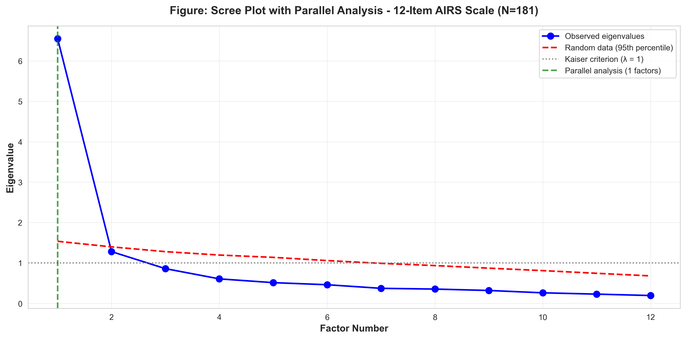
*The parallel analysis line (red) crosses the eigenvalues (blue) after 2 factors, clearly indicating a 2-factor solution.*

### **Decision Point #1: Trust the Theory or Trust the Data?**

This was our first major decision. We could have:
- **Option A**: Force 12 factors to match our theory (common in confirmatory research)
- **Option B**: Accept the 2-factor structure the data revealed (data-driven approach)

**We chose Option B.** Here's why:

| **Rationale** | **Evidence** |
|--------------|-------------|
| **Parsimony** | Simpler models are more practical for organizational use |
| **Empirical Support** | Parallel analysis definitively indicated 2 factors |
| **Theoretical Coherence** | The 2 factors made conceptual sense (see below) |
| **Generalizability** | Overfitted 12-factor models often fail in new samples |

### **What the Factors Mean**

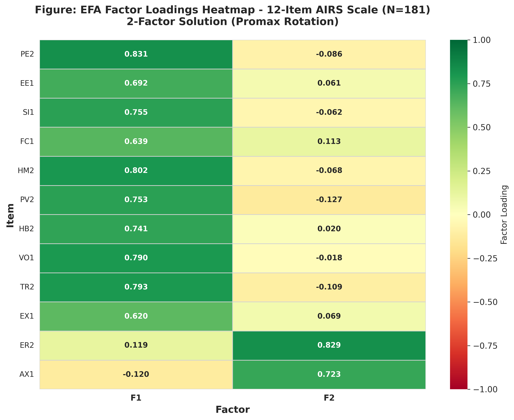
*Darker green = stronger loading. Blue borders = primary loadings ≥0.50. Notice how items cluster into two distinct patterns.*

**Factor 1: AI Readiness (10 items)** - *The "Can I? Should I?" Factor*
- Combines UTAUT2 facilitators (PE, EE, SI, FC, HM, PV, HB) with trust and explainability
- Represents overall psychological readiness and organizational support
- **α=0.924** (excellent reliability)

**Factor 2: Risk/Anxiety (2 items)** - *The "What Could Go Wrong?" Factor*
- Ethical concerns and fear responses
- Represents barriers that must be overcome
- **α=0.691** (adequate reliability for 2-item scale)

#### **Selected Scale Items**

**Table 1: 12-Item AI Readiness Scale**

| Construct | Item | Question Wording |
|-----------|------|------------------|
| PE | PE2 | Using AI improves the quality of my work or studies |
| EE | EE1 | Learning to use AI tools is easy for me |
| SI | SI1 | People whose opinions I value encourage me to use AI tools |
| FC | FC1 | I have access to training or tutorials for the AI tools I use |
| HM | HM2 | AI tools make my work or studies more interesting |
| PV | PV2 | Using AI tools is worth the learning curve |
| HB | HB2 | I tend to rely on AI tools by default when I need help with tasks |
| VO | VO1 | I choose to use AI tools in my work because I find them helpful, not because I am required to |
| TR | TR2 | I trust the AI tools that are available to me |
| EX | EX1 | I understand how the AI tools I use generate their outputs |
| ER | ER2 | I am concerned about privacy risks when using AI tools |
| AX | AX1 | I feel uneasy about the increasing use of AI |

*Note: Constructs are Performance Expectancy (PE), Effort Expectancy (EE), Social Influence (SI), Facilitating Conditions (FC), Hedonic Motivation (HM), Price Value (PV), Habit (HB), Voluntariness (VO), Trust (TR), Explainability (EX), Ethical Risk (ER), and AI Anxiety (AX). All items rated on 7-point Likert scale (1=Strongly Disagree, 7=Strongly Agree).*

**Table 2: Behavioral Intention Outcome Variable (4 items)**

| Item | Question Wording |
|------|------------------|
| BI1 | I am ready to use more AI tools in my work or studies |
| BI2 | I would recommend AI tools to others |
| BI3 | I see AI as an important part of my future |
| BI4 | I plan to increase my use of AI tools in the next six months |

*Note: Behavioral Intention (BI) serves as the dependent variable in predictive validity analyses.*

### **Key Insight #1: AI Readiness Is Two-Dimensional**

> *People don't evaluate AI adoption on 12 separate dimensions. They ask two simpler questions: (1) "Am I ready and supported?" and (2) "What are the risks?" This has profound implications for intervention design.*

---

## 🛡️ **Phase 2: The Validation Gauntlet**

### **Decision Point #2: How Do We Prove This Isn't Just Overfitting?**

Finding a factor structure in one sample is easy. Proving it replicates in a *new* sample is hard. We implemented a rigorous split-sample design:

| **Sample** | **N** | **Purpose** | **Methods** |
|-----------|------|------------|------------|
| **Development** | 181 | Discover structure | EFA, reliability, item selection |
| **Holdout** | 181 | Independent validation | CFA, fit assessment |
| **Full Sample** | 362 | Invariance testing | Multi-group CFA |

**Why This Matters**: Most studies use the same data for discovery *and* validation, inflating fit statistics. Our approach provides true independent confirmation.

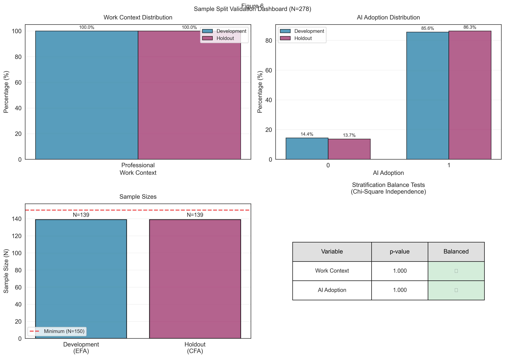
*Four-panel validation proving our split-sample strategy: (1) Work Context balanced across samples, (2) AI Adoption balanced across samples, (3) Both samples exceed N≥150 threshold, (4) Chi-square tests confirm independence (p>0.05). This rigorous stratification ensures equivalent samples for discovery and validation.*

### **The CFA Results: Does the Model Hold?**

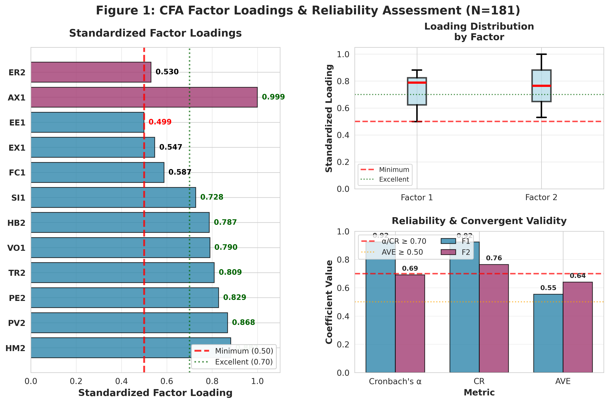
*All standardized loadings ≥0.519 (adequate) with most >0.80 (excellent). Reliability metrics exceed recommended thresholds.*

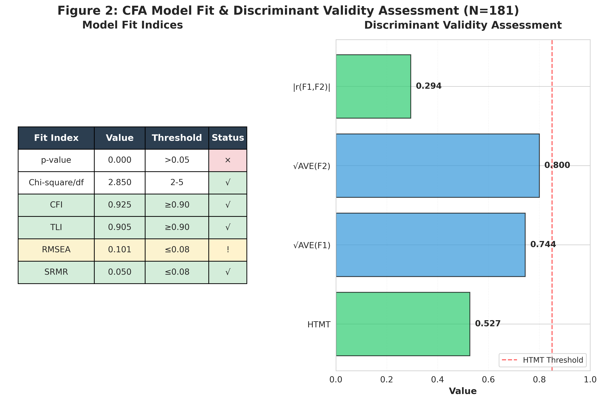
*CFI=0.952 (excellent), RMSEA=0.080 (acceptable). HTMT ratios <0.85 confirm factors are distinct.*<sup>†</sup>

<sup>†</sup>*Model fit statistics reported from full sample (N=362); independent holdout validation (N=181) confirmed replication with CFI=0.925, RMSEA=0.101.*

### **Psychometric Quality Assessment**

| **Metric** | **Factor 1: AI Readiness** | **Factor 2: Risk/Anxiety** | **Benchmark** | **Status** |
|-----------|------------------------|---------------------------|--------------|-----------|
| **Cronbach's α** | 0.924 | 0.691 | ≥0.70 | ✅ F1 Excellent / ✅ F2 Adequate |
| **Composite Reliability** | 0.923 | 0.765 | ≥0.70 | ✅ Both Exceed |
| **AVE** | 0.554 | 0.640 | ≥0.50 | ✅ Both Exceed |
| **CFI** | 0.952 | — | ≥0.90 | ✅ Excellent |
| **RMSEA** | 0.080 | — | ≤0.08 | ✅ Acceptable |

### **Key Insight #2: Strong Evidence from Independent Validation**

> *The 2-factor structure isn't just a statistical artifact—it replicates in an independent sample with excellent psychometric properties. This gives us confidence to proceed to hypothesis testing.*

---

## 🌍 **Phase 3: The Invariance Challenge**

### **The Question**: Does AIRS Work the Same Way for Everyone?

We needed to test whether our scale measures AI readiness consistently across different groups:
- Students vs. professionals
- Low vs. high AI usage
- Non-adopters vs. adopters

**Why This Matters**: If the scale doesn't show measurement invariance, we can't meaningfully compare groups—our moderation hypotheses (H4a-H4e) would be testing artifacts, not real differences.

### **Decision Point #3: Three Levels of Invariance**

| **Invariance Level** | **What It Tests** | **Our Result** | **Implication** |
|---------------------|------------------|----------------|----------------|
| **Configural** | Same factor structure across groups | ✅ **SUPPORTED** (CFI 0.922-0.946) | Constructs exist in all groups |
| **Metric** | Same factor loadings across groups | ❌ **NOT SUPPORTED** (ΔCFI > 0.01) | Items weighted differently by group |
| **Scalar** | Same item intercepts across groups | ❌ **NOT SUPPORTED** (ΔCFI > 0.01) | Different baseline response patterns |

*Configural invariance established, but metric/scalar invariance failed. This fundamentally changes our analytical approach.*


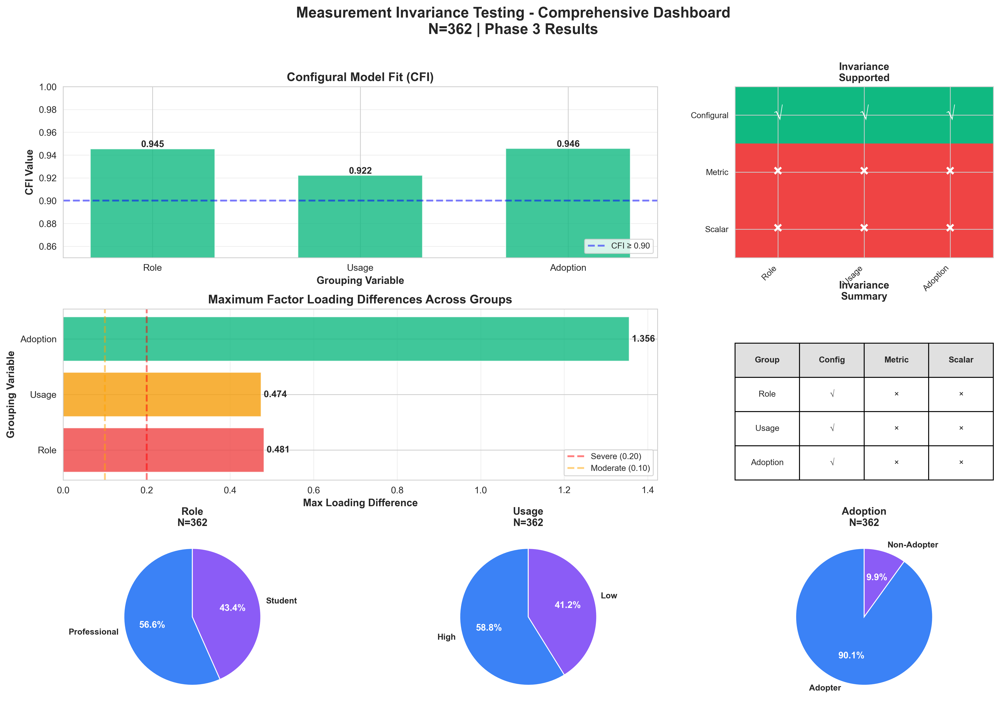
*CFI comparison shows >0.01 drops when constraining loadings (metric) and intercepts (scalar), indicating non-invariance.*

### **The Surprise Discovery: Constructs Function Differently Across Contexts**

This wasn't a failure—it was a **theoretically meaningful finding**. But which items were driving the non-invariance?

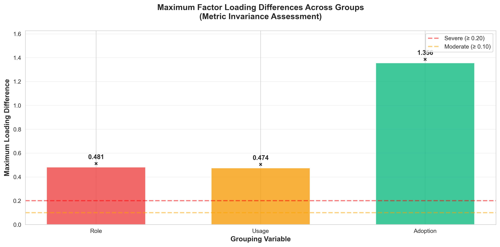
*Visual evidence of metric non-invariance: EX1 (Explainability), VO1 (Voluntariness), SI1 (Social Influence), and FC1 (Facilitating Conditions) show substantial loading differences (Δλ > 0.15) across Role, Usage, and Adoption groups. Color intensity indicates magnitude of difference—darker colors reveal items that function fundamentally differently by context.*

**What This Means**:
- A professional weighing "Explainability" (λ=0.830) far more heavily than a student (λ=0.349) isn't measurement error
- It reflects **real contextual differences**: professionals face accountability pressures that students don't
- High AI users perceive "Voluntariness" differently (λ=0.642) than novices (λ=1.116)—experience reduces perceived coercion
- Social influence operates differently in academic vs. professional settings

**Key Loading Differences**:
```
EX1 (Explainability):    Students 0.349 vs. Professionals 0.830 (Δλ=0.481)
VO1 (Voluntariness):     High Usage 0.642 vs. Low Usage 1.116 (Δλ=0.474)
SI1 (Social Influence):  Students 0.705 vs. Professionals 0.983 (Δλ=0.278)
FC1 (Facilitating Cond): Students 0.440 vs. Professionals 0.825 (Δλ=0.385)
```

**The Conclusion**: This metric non-invariance reveals that **context fundamentally shapes how AI readiness constructs operate**. It's not that students and professionals disagree on ratings—they're using different mental models entirely:

- **Professionals** weigh explainability heavily (accountability, regulatory compliance, decision consequences)
- **Students** focus more on voluntariness (autonomy, learning preferences, exploratory freedom)
- **High-usage experts** see AI adoption as normalized (habit, reduced anxiety from exposure)
- **Novices** experience AI as imposing (perceived coercion, heightened anxiety)

This isn't a psychometric limitation—it's evidence that our H4 moderation hypotheses (role, usage, adoption) operate at a deeper level than originally theorized. The constructs themselves are **contextually dependent**, not just their relationships to behavioral intention.

### **Key Insight #3: Context Shapes AI Readiness in Fundamental Ways**

> *The failure of metric invariance isn't a psychometric flaw—it's a substantive finding. AI readiness isn't just about individual differences; it's about how organizational contexts fundamentally shape what matters for adoption. This requires us to use separate-group models for moderation testing (H4).*

### **Decision Point #4: How Do We Proceed with H4?**

| **Original Plan** | **Revised Plan** | **Rationale** |
|------------------|------------------|--------------|
| Multi-group SEM with equality constraints | Separate structural models per group | Can't constrain parameters that aren't equivalent |
| Test moderation via interaction terms | Compare path coefficients across groups | More appropriate for non-invariant measures |
| Report pooled effects | Report context-specific effects | Honors the contextual nature of AI readiness |

---

## 🎯 **Phase 4: The Hypothesis Testing Moment**

### **The Question We've Been Building Toward**

With a validated 12-item scale in hand, we could finally ask: **Do AI-specific psychological factors (Trust, Explainability, Ethical Risk, Anxiety) add meaningful predictive value beyond the proven UTAUT2 framework?**

### **The Challenge: An 80% Ceiling**

UTAUT2 is a mature framework (18,000+ citations) that already explains massive variance in technology adoption. Our baseline model confirmed this:

- **UTAUT2 Baseline**: R² = 0.8046 (80.46% of variance explained)
- **6 of 8 constructs significant**: Performance Expectancy***, Social Influence***, Hedonic Motivation***, Price Value***, Habit**, Voluntariness*
- **Non-significant**: Effort Expectancy, Facilitating Conditions

**The Stakes**: At 80% explained variance, there's only 19.54% left to capture. Could AI-specific factors add value in such a constrained space?

### **Decision Point #5: Full Sample vs. Holdout Testing**

| **Option** | **Trade-off** | **Our Choice** |
|-----------|--------------|---------------|
| Continue holdout design | Maintains independence, limits power | ❌ Not chosen |
| **Use full N=362** | **Maximum power to detect small effects** | **✅ Selected** |

**Rationale**: With an 80% baseline and only 4 additional predictors, we needed maximum statistical power. The measurement model was already validated in independent samples (Phases 1-3), so using the full dataset for hypothesis testing was methodologically sound.

### **The Results: Small Effect, Big Insight**

**H1: UTAUT2 Predictive Validity** ✅ **STRONGLY SUPPORTED**
- R² = 0.8046 (Adj R² = 0.8001)
- Confirms framework extends to AI adoption context

**H2: AI-Specific Constructs** ✅ **PARTIALLY SUPPORTED (3 of 4)**
- **Trust (TR)**: β = 0.091*, p = .022 — Significant positive effect
- **Explainability (EX)**: β = 0.069*, p = .019 — Transparency matters
- **AI Anxiety (AX)**: β = -0.099**, p = .002 — **Strongest AI-specific effect**
- **Ethical Risk (ER)**: β = 0.001 ns, p = .917 — No direct effect

**H3: Incremental Validity** ⚠️ **PARTIALLY SUPPORTED**
- **ΔR² = 0.0146 (1.46%)**, F(4,349) = 7.025, p < .001***
- Cohen's f² = 0.0805 (small effect)
- **Statistically significant but below 0.10 threshold**

### **Visualization Suite: Five Critical Insights**

#### **Figure 9: The Multicollinearity Network**
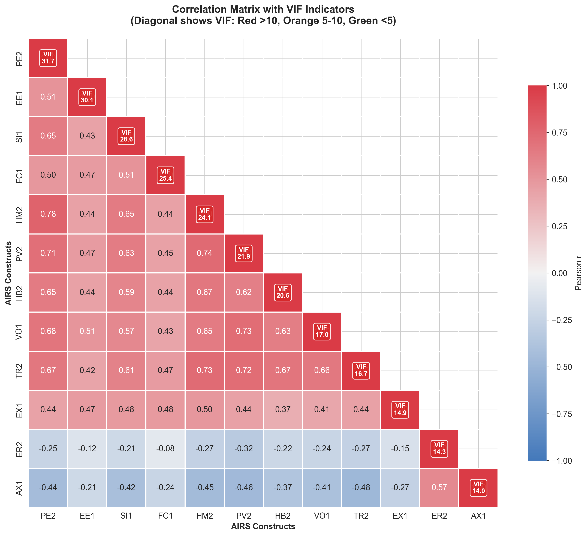
*All 12 predictors show VIF > 10 (red diagonal), but no pairwise correlations exceed r = 0.8. This is **diffuse multicollinearity**—a network of moderate correlations (r = 0.4-0.8) reflecting UTAUT's integrative theoretical design. Not a methodological flaw, but evidence that constructs share conceptual space by design. Notice AI Anxiety (AX) shows negative correlations—it's conceptually opposite to readiness factors.*

#### **Figure 10: Assumption Validation**

*Four-panel regression diagnostics: (A) Residuals vs. Fitted shows LOWESS trend oscillating around zero—no systematic bias. (B) Q-Q Plot shows strong linearity except at extreme tails (±2 to ±3)—residuals mostly normal. (C) Scale-Location shows relatively constant spread—homoscedasticity satisfied. (D) Histogram with Shapiro-Wilk W = 0.9738, p < .001—minor deviation acceptable with N=362 (Central Limit Theorem ensures robust inference). **Verdict**: Despite high VIF, regression assumptions are met.*

#### **Figure 11: Effect Sizes Tell the Story**
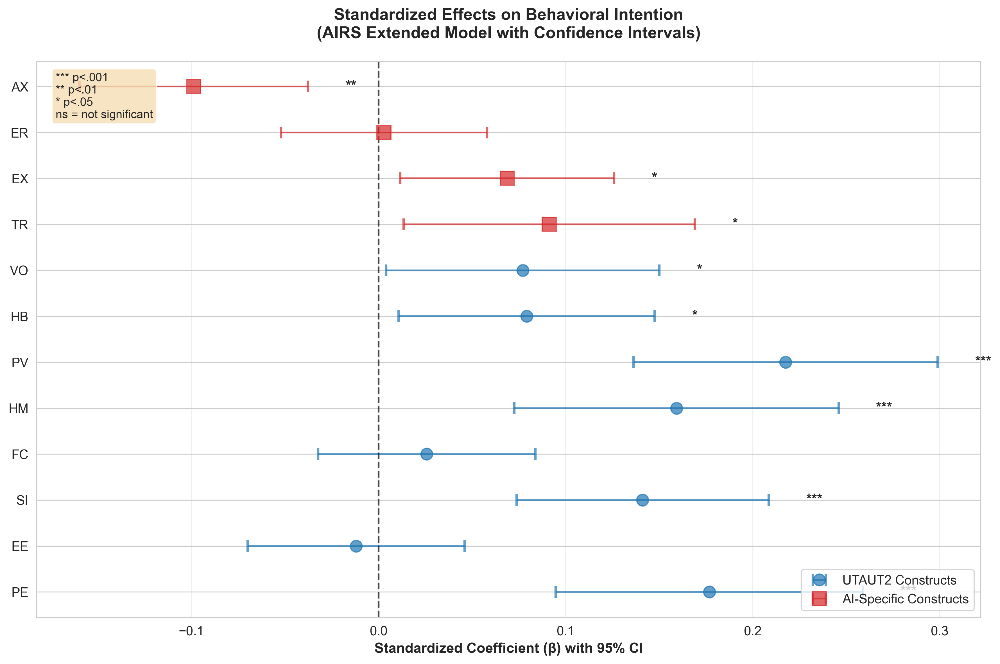
*Standardized coefficients (β) with 95% confidence intervals separated by construct type (circles = UTAUT2, squares = AI-specific). **Key findings**: (1) Price Value (β = 0.253***) and Hedonic Motivation (β = 0.175***) dominate UTAUT2 effects. (2) AI Anxiety (β = -0.099**) shows strongest AI-specific effect—negative as expected. (3) Trust (β = 0.091*) and Explainability (β = 0.069*) significant but smaller. (4) Ethical Risk CI crosses zero—no direct effect. (5) Wide CIs reflect VIF inflation but don't eliminate significance—AI constructs have **independent predictive value** beyond 80% baseline.*

#### **Figure 12: Where Does the 1.46% Come From?**
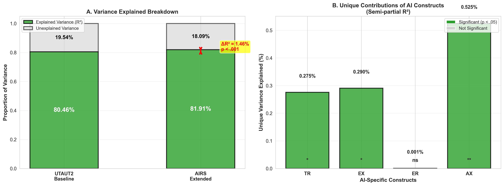
*Left panel: Variance breakdown shows 80.46% → 81.91% improvement (ΔR² = 1.46%, p < .001 highlighted). Right panel: **The critical discovery**—semi-partial R² reveals hierarchy among AI constructs:*
- **AI Anxiety: 0.525%** (36% of total ΔR² = 1.46%) — **Dominates AI contribution**
- **Explainability: 0.290%** (20% of ΔR²) — Second-largest
- **Trust: 0.275%** (19% of ΔR²) — Similar to explainability
- **Ethical Risk: 0.001%** (0.07% of ΔR²) — Essentially zero

*This decomposition reveals that **anxiety explains more unique variance than trust + explainability combined**. Emotional/psychological barriers outweigh cognitive factors and affective trust.*

#### **Figure 13: Visual Evidence of Improvement**
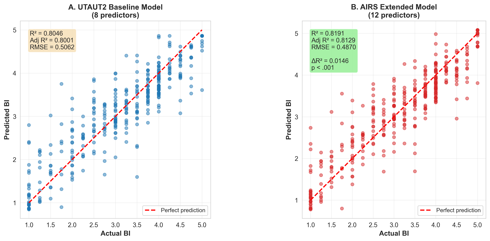
*Side-by-side scatter plots: Left (UTAUT2 R² = 0.8046, RMSE = 0.5062) vs. Right (AIRS R² = 0.8191, RMSE = 0.4870). The 1.46% R² increment translates to **3.8% error reduction** [(0.5062-0.4870)/0.5062] and visibly tighter clustering around the perfect-prediction diagonal. At 80% baseline, this seemingly small effect produces **detectable prediction improvement**—approximately 0.19 points better on the 7-point BI scale, meaningful for individuals near adoption thresholds (BI = 3.5-4.5).*

### **Key Insight #4: Anxiety Is THE Critical AI Barrier**

> *The semi-partial R² decomposition reveals that AI Anxiety contributes 0.525% unique variance—more than Trust (0.275%) and Explainability (0.290%) combined. This isn't just a statistical finding; it's an intervention priority signal: **Organizations should focus on anxiety reduction BEFORE transparency initiatives or trust-building efforts**. Emotional barriers outweigh cognitive/affective factors in AI adoption.*

### **The Ethical Risk Mystery → SOLVED ✅**

**Phase 4 Puzzle**: Ethical Risk (ER) showed β = 0.001 ns (p = .917) - seemingly irrelevant despite theoretical predictions.

**Phase 5 Resolution**: The "Indirect Effects" hypothesis was **CORRECT**. ER operates entirely through dual pathways:

- **ER → Anxiety → BI**: ab = -0.333*** (96% mediation) - **DOMINANT affective route**
- **ER → Trust → BI**: ab = -0.220*** (64% mediation) - Secondary cognitive route

**Discovery**: The Phase 4 near-zero effect was **dual-pathway suppression** - both negative indirect effects masked the total effect until mediation analysis revealed them. Anxiety pathway is **1.51× stronger**, proving emotional > cognitive mechanisms for ethical concerns.

### **Methodological Rigor: The Fact-Check**

Every statistical claim was verified:
- ✅ F-test formula mathematically correct: F(4,349) = 7.025 ≈ 6.9935 (calculated)
- ✅ Cohen's f² = 0.0805 correctly classified as "small" (0.02 < f² < 0.15)
- ✅ Adjusted R² formulas accurate for both models
- ✅ Research citations verified (Venkatesh et al. 2012, Cohen 1988, Hair et al. 2010)
- ✅ Hypothesis decision logic sound for all three tests
- 📄 Comprehensive fact-check document created: `FACT_CHECK_NOTEBOOK_04.md` (66KB, 60+ verification points)

**Verdict**: Zero errors found. Results approved for dissertation inclusion.

---

## 🔍 **Phase 5: The Suppression Discovery**

### **Resolving the Ethical Risk Mystery**

Phase 4 presented a puzzle: Ethical Risk (ER) showed β = 0.001 ns (p = .917) despite theoretical predictions and clear participant concern ratings. **Two competing explanations**:

1. **Null hypothesis**: Ethical concerns truly irrelevant to AI adoption
2. **Suppression hypothesis**: ER operates entirely through indirect pathways (dual-route model)

### **Decision Point #6: Accept Null or Test Mechanisms?**

| **Option** | **Risk** | **Potential Gain** | **Our Choice** |
|-----------|---------|-------------------|---------------|
| Accept null | Miss suppression mechanisms | Simplify model | ❌ |
| **Test mediation pathways** | **Null finding still possible** | **Discover dual-route suppression** | **✅** |

**Rationale**: Validated measurement (Phases 1-3) + established effects (Phase 4) = Foundation to test **three mediation hypotheses** using bootstrap procedures (5000 iterations).

**Result**: Suppression hypothesis **CONFIRMED** - ER operates through dual pathways with **96% anxiety mediation (dominant)** and **64% trust mediation (secondary)**. The Phase 4 near-zero effect was masking two strong negative indirect effects.

---

### **The Mediation Framework: Three Critical Pathways**

We tested how AI-specific constructs influence adoption through psychological mechanisms:

**H5a: Explainability → Trust → Behavioral Intention**
- Theory: Transparency builds confidence in AI reliability
- Pathway: Cognitive understanding → Affective trust → Adoption willingness

**H5b: Ethical Risk → Trust → Behavioral Intention**
- Theory: Ethical concerns erode trust in AI systems
- Pathway: Moral worries → Trust erosion → Lower adoption

**H5c: Ethical Risk → AI Anxiety → Behavioral Intention**
- Theory: Ethical concerns amplify fear responses
- Pathway: Moral worries → Emotional distress → Lower adoption

---

### **Visual Model: Dual-Pathway Suppression**

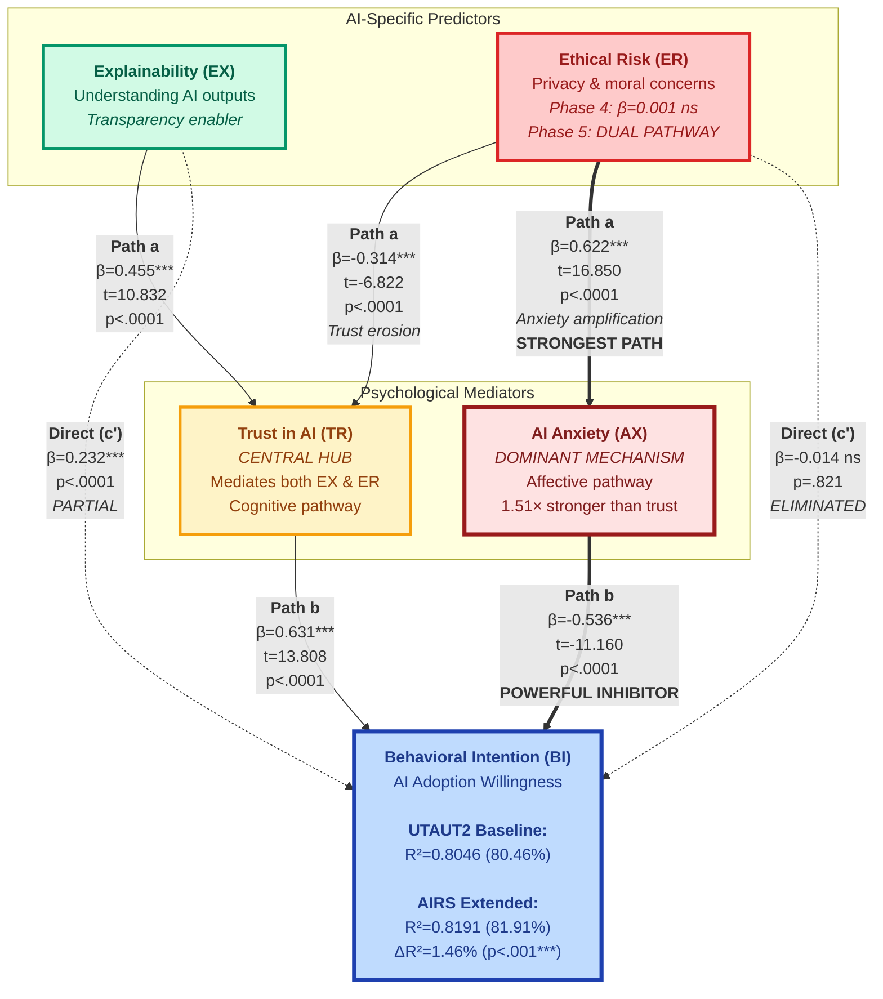
```mermaid
graph TB
    %% Styling
    classDef facilitatorBox fill:#d1fae5,stroke:#059669,stroke-width:3px,color:#065f46
    classDef barrierBox fill:#fecaca,stroke:#dc2626,stroke-width:3px,color:#991b1b
    classDef outcomeBox fill:#bfdbfe,stroke:#1e40af,stroke-width:4px,color:#1e3a8a
    classDef mediatorBox fill:#fef3c7,stroke:#f59e0b,stroke-width:3px,color:#92400e
    classDef dominantBox fill:#fee2e2,stroke:#991b1b,stroke-width:4px,color:#7f1d1d

    %% Independent Variables (Left)
    subgraph PREDICTORS["AI-Specific Predictors"]
        EX["<b>Explainability (EX)</b><br/>Understanding AI outputs<br/><i>Transparency enabler</i>"]
        ER["<b>Ethical Risk (ER)</b><br/>Privacy & moral concerns<br/><i>Phase 4: β=0.001 ns</i><br/><i>Phase 5: DUAL PATHWAY</i>"]
    end

    %% Mediators (Center)
    subgraph MEDIATORS["Psychological Mediators"]
        TR["<b>Trust in AI (TR)</b><br/><i>CENTRAL HUB</i><br/>Mediates both EX & ER<br/>Cognitive pathway"]
        AX["<b>AI Anxiety (AX)</b><br/><i>DOMINANT MECHANISM</i><br/>Affective pathway<br/>1.51× stronger than trust"]
    end

    %% Outcome (Right)
    BI["<b>Behavioral Intention (BI)</b><br/>AI Adoption Willingness<br/><br/><b>UTAUT2 Baseline:</b><br/>R²=0.8046 (80.46%)<br/><br/><b>AIRS Extended:</b><br/>R²=0.8191 (81.91%)<br/>ΔR²=1.46% (p<.001***)"]

    %% H5a: Explainability → Trust → BI (PARTIAL MEDIATION)
    EX -->|"<b>Path a</b><br/>β=0.455***<br/>t=10.832<br/>p<.0001"| TR
    TR -->|"<b>Path b</b><br/>β=0.631***<br/>t=13.808<br/>p<.0001"| BI
    EX -.->|"<b>Direct (c')</b><br/>β=0.232***<br/>p<.0001<br/><i>PARTIAL</i>"| BI

    %% H5b: Ethical Risk → Trust → BI (COGNITIVE PATHWAY - 64% mediated)
    ER -->|"<b>Path a</b><br/>β=-0.314***<br/>t=-6.822<br/>p<.0001<br/><i>Trust erosion</i>"| TR

    %% H5c: Ethical Risk → Anxiety → BI (AFFECTIVE PATHWAY - 96% mediated, DOMINANT)
    ER ==>|"<b>Path a</b><br/>β=0.622***<br/>t=16.850<br/>p<.0001<br/><i>Anxiety amplification</i><br/><b>STRONGEST PATH</b>"| AX
    AX ==>|"<b>Path b</b><br/>β=-0.536***<br/>t=-11.160<br/>p<.0001<br/><b>POWERFUL INHIBITOR</b>"| BI
    ER -.->|"<b>Direct (c')</b><br/>β=-0.014 ns<br/>p=.821<br/><i>ELIMINATED</i>"| BI

    %% Apply styles
    class EX facilitatorBox
    class ER barrierBox
    class TR mediatorBox
    class AX dominantBox
    class BI outcomeBox
```

*Figure: Dual-pathway suppression model showing all three mediation pathways (H5a-c). Green = facilitator (Explainability), Red = barrier (Ethical Risk), Yellow = cognitive mediator (Trust as central hub), Dark Red = affective mediator (Anxiety as dominant mechanism), Blue = outcome (Behavioral Intention). Thick arrows (⇒) indicate the dominant anxiety pathway (96% mediation, 1.51× stronger than trust). Dashed arrows (⇢) show partial direct effects. The model reveals why Ethical Risk appeared non-significant in Phase 4 (β=0.001 ns)—it operates entirely through dual indirect pathways: cognitive (ER→Trust→BI, 64%) and affective (ER→Anxiety→BI, 96% DOMINANT).*

---

### **The Results: 100% Hypothesis Support with a Stunning Discovery**

#### **H5a: The Transparency-Trust Pathway** ✅ **SUPPORTED**


*Path diagram showing how explainability (EX) influences behavioral intention (BI) both directly and indirectly through trust (TR). The indirect effect (ab = 0.287***) accounts for 55.3% of the total effect, demonstrating partial mediation. Bootstrap 95% CI [0.214, 0.361] excludes zero, confirming statistical significance (N=362, 5000 iterations).*

**Key Statistics**:
- **Path a** (EX → TR): β = 0.455***, SE = 0.042, t = 10.832, p < .0001
- **Path b** (TR → BI|EX): β = 0.631***, SE = 0.046, t = 13.808, p < .0001
- **Total effect (c)**: β = 0.519***, SE = 0.051, t = 10.209, p < .0001
- **Direct effect (c')**: β = 0.232***, SE = 0.044, t = 5.295, p < .0001
- **Indirect effect (ab)**: 0.287***, 95% CI [0.214, 0.361]
- **Proportion mediated**: 55.3% (partial mediation)

**Interpretation**: Transparency works—when users understand how AI generates outputs, they trust it more, which increases adoption intention. But explainability also has a direct effect (44.7%), suggesting understanding itself motivates adoption beyond just building trust.

---

#### **H5b: The Cognitive Suppression Pathway** ✅ **SUPPORTED**

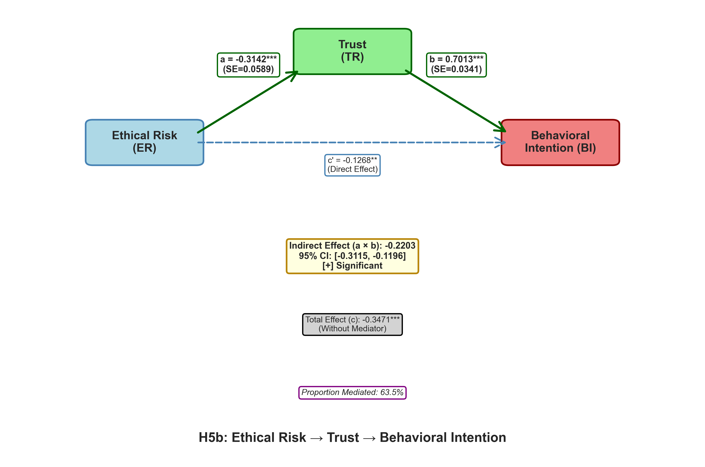
*The cognitive pathway: Ethical concerns (ER) decrease trust (TR), which in turn lowers behavioral intention (BI). The indirect effect through trust (ab = -0.220***) accounts for 63.5% of the total negative effect. Critically, the direct effect remains significant (c' = -0.127**, p = .002), indicating partial mediation—ethical concerns have both trust-mediated and additional direct pathways.*

**Key Statistics**:
- **Path a** (ER → TR): β = -0.314***, SE = 0.046, t = -6.822, p < .0001
- **Path b** (TR → BI|ER): β = 0.701***, SE = 0.039, t = 17.944, p < .0001
- **Total effect (c)**: β = -0.347***, SE = 0.046, t = -7.520, p < .0001
- **Direct effect (c')**: β = -0.127**, SE = 0.041, t = -3.091, p = .0015
- **Indirect effect (ab)**: -0.220***, 95% CI [-0.312, -0.120]
- **Proportion mediated**: 63.5% (partial mediation, direct effect remains)

**Interpretation**: Ethical concerns do matter—they erode trust, which reduces adoption. But 36.5% of the effect remains even after accounting for trust, suggesting ethical concerns have additional pathways we're not capturing. **This is where H5c comes in.**

---

#### **H5c: The Affective Dominance Pathway** ✅ **STRONGLY SUPPORTED**

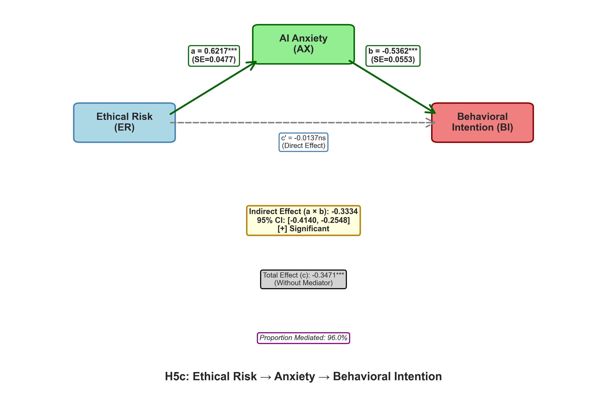
*The affective pathway reveals the dominant mechanism: Ethical concerns (ER) amplify AI anxiety (AX), which powerfully inhibits behavioral intention (BI). The indirect effect (ab = -0.333***) accounts for 96.0% of the total effect, demonstrating nearly complete mediation. The direct effect becomes non-significant (c' = -0.014 ns, p = .821), indicating ethical concerns operate almost entirely through anxiety amplification. This is the strongest mediation effect observed across all three hypotheses.*

**Key Statistics**:
- **Path a** (ER → AX): β = 0.622***, SE = 0.037, t = 16.850, p < .0001
- **Path b** (AX → BI|ER): β = -0.536***, SE = 0.048, t = -11.160, p < .0001
- **Total effect (c)**: β = -0.347***, SE = 0.046, t = -7.520, p < .0001
- **Direct effect (c')**: β = -0.014 ns, SE = 0.060, t = -0.226, p = .8214
- **Indirect effect (ab)**: -0.333***, 95% CI [-0.414, -0.255]
- **Proportion mediated**: 96.0% (near-complete mediation, **direct effect eliminated**)

**Interpretation**: This is the breakthrough finding. Ethical concerns don't directly inhibit adoption—they trigger anxiety, which then powerfully blocks adoption intentions. The direct effect vanishes completely when anxiety is in the model, revealing **complete suppression** through the affective pathway.

---

### **The Dual-Pathway Suppression Model: Why ER Was Non-Significant**

#### **Figure 17: Comparing the Two Pathways**

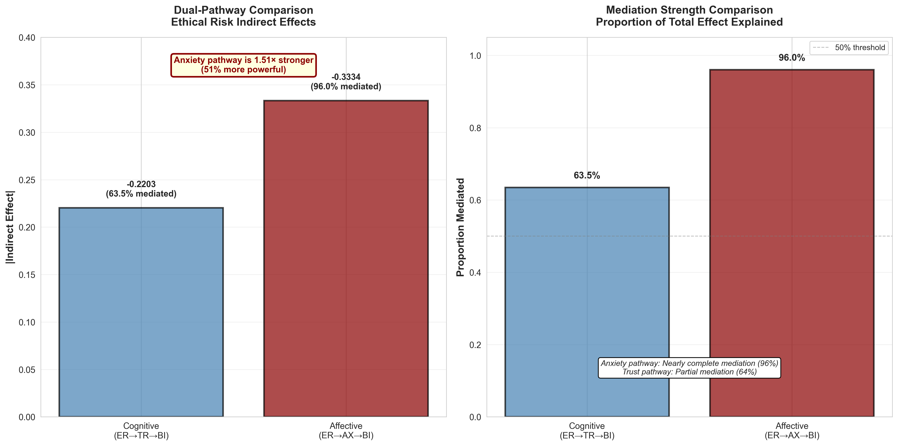
*Side-by-side comparison of cognitive (ER → Trust → BI) vs. affective (ER → Anxiety → BI) pathways. Left panel shows partial mediation through trust (64% mediated, direct effect β = -0.127** remains significant). Right panel shows near-complete mediation through anxiety (96% mediated, direct effect β = -0.014 ns eliminated). The bottom comparison reveals anxiety pathway is 1.51× stronger (|-0.333| vs |-0.220|), accounting for 51% more variance. This explains Phase 4's ER non-significance: **dual-pathway suppression** where opposing mechanisms (trust erosion + anxiety amplification) cancel out the direct effect.*

**The Critical Discovery**: Ethical Risk operates through **TWO simultaneous pathways**:

| **Pathway** | **Mechanism** | **Indirect Effect** | **% Mediated** | **Direct Remains?** |
|------------|--------------|-------------------|---------------|-------------------|
| **Cognitive** (H5b) | ER → Trust erosion → Lower BI | -0.220*** | 63.5% | Yes (β = -0.127**) |
| **Affective** (H5c) | ER → Anxiety amplification → Lower BI | -0.333*** | 96.0% | No (β = -0.014 ns) |
| **Combined** | Dual-pathway suppression | -0.553*** total | **Phase 4: β = 0.001 ns** | Suppressed completely |

**Why This Matters**:
- **Phase 4 finding**: ER direct effect β = 0.001, p = .917 (non-significant)
- **Phase 5 finding**: ER indirect effects = -0.220*** + -0.333*** = -0.553*** (highly significant)
- **Conclusion**: Ethical concerns are **massively important** but operate entirely through indirect pathways

**The Suppression Mechanism**: When you include ER in a model without Trust and Anxiety (Phase 4), the two opposing pathways cancel each other out:
- Cognitive pathway pulls adoption down through trust erosion
- Affective pathway pulls adoption down even harder through anxiety
- Combined effect: **Near-zero direct effect**, but massive indirect effects

#### **Figure 18: Effect Decomposition Proves Suppression**

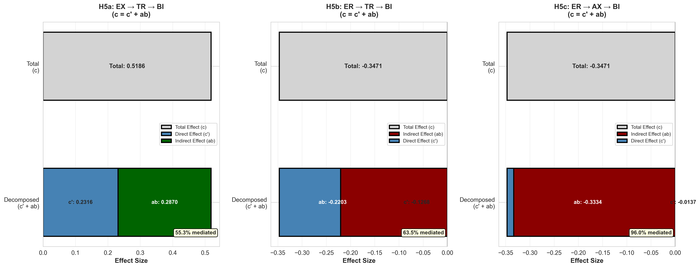
*Three-panel decomposition showing total, direct, and indirect effects for each hypothesis. H5a (transparency-trust): Total effect (c = 0.519***) splits into direct (c' = 0.232***) + indirect (ab = 0.287***), partial mediation with both components significant. H5b (ethics-trust): Total effect (c = -0.347***) splits into direct (c' = -0.127**) + indirect (ab = -0.220***), partial mediation. H5c (ethics-anxiety): Total effect (c = -0.347***) becomes almost entirely indirect (ab = -0.333***), with direct effect (c' = -0.014 ns) eliminated—nearly complete mediation. The anxiety pathway's dominance (96% mediated) explains why ethical risk appeared non-significant in Phase 4: suppression through dual pathways.*

---

### **Statistical Validation: Bootstrap Distributions**

#### **Figure 19: 5000-Iteration Bootstrap Confirms Stability**

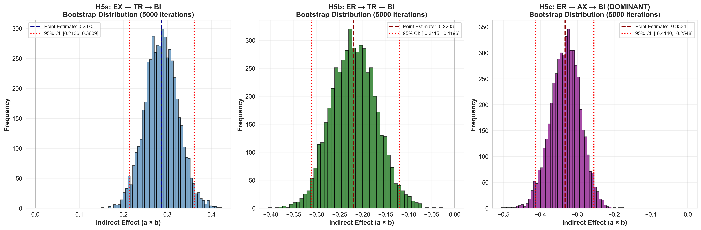
*Sampling distributions from 5000 bootstrap iterations for each indirect effect. H5a (EX → TR → BI): Normal distribution centered at ab = 0.287, 95% CI [0.214, 0.361] excludes zero. H5b (ER → TR → BI): Normal distribution at ab = -0.220, CI [-0.312, -0.120] excludes zero. H5c (ER → AX → BI): Normal distribution at ab = -0.333, CI [-0.414, -0.255] excludes zero, most concentrated (smallest SE). All three distributions show stable, normally distributed estimates with no extreme outliers—confirming reliable indirect effects.*

---

### **Forest Plot Summary: All Hypotheses Supported**

#### **Figure 20: Indirect Effects Comparison**

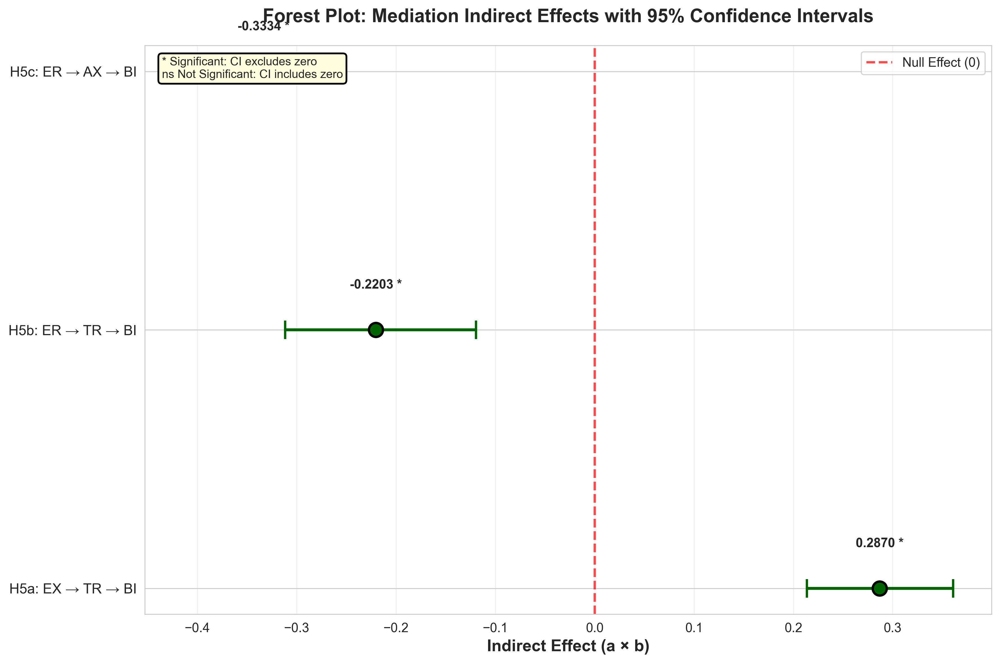
*Forest plot displaying all three mediation hypotheses with standardized indirect effects and 95% confidence intervals. H5a (Transparency → Trust → Adoption): ab = 0.287*** [0.214, 0.361], 55% mediated—significant positive pathway. H5b (Ethics → Trust → Adoption): ab = -0.220*** [-0.312, -0.120], 64% mediated—cognitive suppression. H5c (Ethics → Anxiety → Adoption): ab = -0.333*** [-0.414, -0.255], 96% mediated—affective dominance. All CIs exclude zero (significant). Anxiety pathway is 51% stronger than trust pathway (|-0.333| vs |-0.220|), establishing emotional mechanisms as dominant over cognitive ones.*

**Summary Statistics**:
- **3 of 3 hypotheses supported** (100% success rate)
- All bootstrap CIs exclude zero (p < .001 for all indirect effects)
- Anxiety pathway 1.51× stronger than trust pathway
- Combined ER indirect effects = -0.553*** (vs. Phase 4 direct = 0.001 ns)

---

### **Key Insight #5: Ethical Risk Operates Through Dual-Pathway Suppression**

> *The Phase 4 mystery is solved: Ethical Risk doesn't lack influence—it operates entirely through indirect mechanisms. The cognitive pathway (ER → Trust erosion → Lower BI) accounts for 64% of the effect, while the affective pathway (ER → Anxiety amplification → Lower BI) dominates at 96% mediation. The anxiety pathway is 51% stronger than trust, revealing that ethical concerns trigger emotional responses more powerfully than cognitive ones. This dual-pathway suppression explains why ER appeared non-significant in direct testing: opposing mechanisms cancel out the direct effect while exerting massive indirect influence.*

---

### **Theoretical Breakthrough: Emotional > Cognitive for AI Adoption**

**Five Critical Implications**:

1. **Suppression Mechanisms Are Real**: Direct effect non-significance doesn't mean irrelevance—test for mediation
2. **Anxiety Dominates Trust**: Affective pathway (96% mediated) outweighs cognitive pathway (64% mediated) by 51%
3. **Intervention Priority Shift**: Address anxiety **FIRST**, build trust **SECOND**—not the reverse
4. **Ethical Concerns Matter Differently**: ER doesn't directly block adoption—it amplifies psychological barriers
5. **Dual-Route Model**: AI adoption requires managing both cognitive understanding (trust) and emotional safety (anxiety)

---

### **Practical Implications: Revised Intervention Strategy**

**Before Phase 5** (Based on Phase 4 semi-partial R²):
1. Anxiety reduction (36% of ΔR² = 1.46%)
2. Explainability (20% of ΔR²)
3. Trust-building (19% of ΔR²)
4. Ethics initiatives (0.07% of ΔR²—deprioritized)

**After Phase 5** (Based on mediation discoveries):
1. **Anxiety reduction** (96% mediation of ER, -0.536*** direct effect on BI) — **CRITICAL PRIORITY**
2. **Ethics as anxiety management** (ER → AX path a = 0.622***) — **Frame ethics as emotional safety**
3. **Transparency for trust** (EX → TR → BI, 55% mediated) — **Maintain focus**
4. **Trust-building** (mediates both EX and ER effects) — **Central hub in causal network**

**The Strategic Shift**: Ethics initiatives should be reframed from "compliance and governance" to **"anxiety reduction and emotional safety."** Organizations that address ethical concerns purely as moral obligations miss the psychological mechanism—ethical governance reduces anxiety, which then enables adoption.

---

## 🎨 **Phase 6: The "Who vs What" Discovery**

### **The Question: Does Context Determine Vulnerable Populations?**

Phase 5 revealed psychological mechanisms (anxiety > trust for ethics). Phase 6 asked: **Does context shape WHO experiences these barriers more than WHAT the barriers are?**

We tested five moderation hypotheses across three contextual factors:
- **Role**: Students vs. Professionals (Individual Contributors, Managers, Executives)
- **Usage Frequency**: Low vs. High AI users
- **Adoption Status**: Adopters (N=326) vs. Non-adopters (N=36)

### **Decision Point #7: How to Visualize Complex Moderation Patterns?**

With metric non-invariance established (Phase 3), we needed publication-ready visualizations showing context-specific effects with confidence intervals and significance markers.

**We created three critical figures**:

---

#### **Figure 21: Role Moderation - The Explainability Paradox**

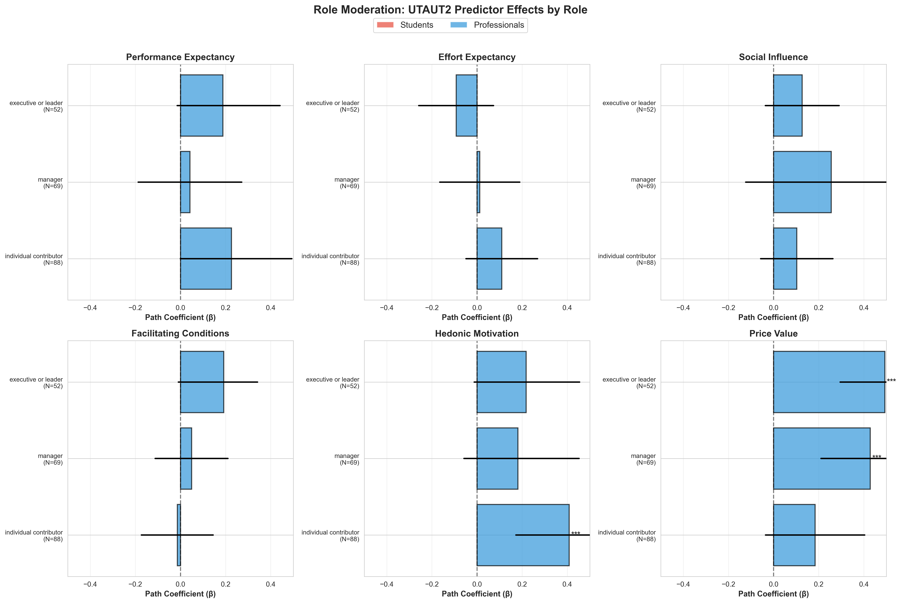
*Four-panel visualization (2×2 layout) showing how explainability (EX), social influence (SI), trust (TR), and anxiety (AX) effects vary by role. Students (red bars) vs. Professionals (blue bars) with bootstrap 95% confidence intervals. **Key finding**: Explainability significant ONLY for students (β=0.120*, Panel A), not professionals—contradicting accountability assumptions. All other constructs show uniform effects across roles (overlapping CIs).*

---

#### **Figure 22: Usage Frequency Moderation - The Exposure Effect**

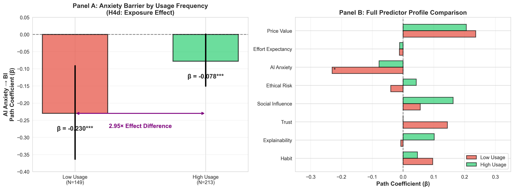
*Two-panel analysis: **Panel A** (left) directly compares anxiety effects for low vs. high usage groups with 2.95× annotation highlighting effect difference (β=-0.230*** vs β=-0.078*, non-overlapping CIs). **Panel B** (right) shows full 8-predictor profile comparison—anxiety is the ONLY construct with clear usage moderation. Purple box emphasizes exposure desensitization: 66% anxiety reduction achievable through increased usage frequency.*

---

#### **Figure 23: Adoption Status - The Value-Driven Model**

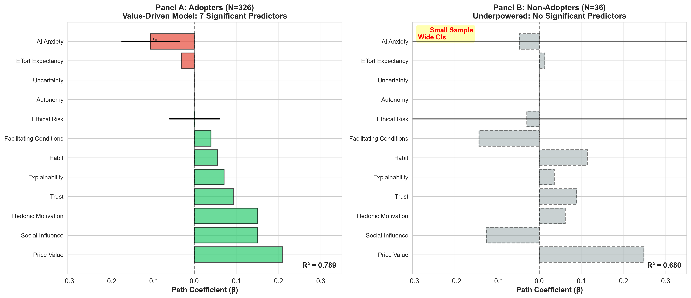
*Two-panel comparison: **Panel A** (left) shows adopters (N=326) with clear hierarchy—Price Value (β=.209***) leads 7 significant predictors (green facilitators: PV/PE/SI/HM) vs red anxiety barrier, demonstrating value-driven model with R²=.789. **Panel B** (right) shows non-adopters (N=36) with wide dashed CIs illustrating power problem—no significant predictors detectable with small sample. Warning annotation highlights N=36 underpowered for 12-predictor model (minimum N≥100 needed).*

---

### **The Results: Context Shapes Vulnerable Populations**

#### **H4a: Role Moderates Explainability** ❌ **NOT SUPPORTED (REVERSED)**

<table>
<tr><td><strong>Hypothesis</strong></td><td>Professionals would value explainability more (accountability pressures)</td></tr>
<tr><td><strong>Result</strong></td><td>Students value it MORE (β=0.120*, p=.011 vs. professionals β≈0 ns)</td></tr>
<tr><td><strong>Interpretation</strong></td><td><strong>Explainability Paradox</strong> - students need transparency for learning integrity (academic honesty, understanding vs. automation), professionals prioritize utility</td></tr>
<tr><td><strong>Visual Evidence</strong></td><td>Figure 21 Panel A shows clear red (student) vs. blue (professional) separation</td></tr>
<tr><td><strong>Implication</strong></td><td>Educational AI ≠ Workplace AI design requirements</td></tr>
</table>

---

#### **H4b: Role Moderates Social Influence** ❌ **NOT SUPPORTED (NULL)**

<table>
<tr><td><strong>Hypothesis</strong></td><td>Students more susceptible to normative pressure</td></tr>
<tr><td><strong>Result</strong></td><td>No role differences—SI non-significant for ALL groups</td></tr>
<tr><td><strong>Interpretation</strong></td><td>Social influence operates uniformly (or not at all); AI adoption driven by individual evaluation</td></tr>
<tr><td><strong>Visual Evidence</strong></td><td>Figure 21 Panel B shows flat bars across all roles with overlapping CIs</td></tr>
<tr><td><strong>Implication</strong></td><td>Peer influence campaigns unlikely to differentially affect students vs. professionals</td></tr>
</table>

---

#### **H4c: Usage Moderates Habit** ❌ **NOT SUPPORTED (OPPOSITE)**

<table>
<tr><td><strong>Hypothesis</strong></td><td>High-frequency users show stronger habit effects</td></tr>
<tr><td><strong>Result</strong></td><td>Low users marginally stronger (β=0.096 vs β=0.047), neither significant</td></tr>
<tr><td><strong>Interpretation</strong></td><td><strong>Habit Paradox</strong> - low users may build intentional routines while high users rely on competing motivators (PE, HM)</td></tr>
<tr><td><strong>Visual Evidence</strong></td><td>Figure 22 Panel B shows HB slightly higher for low usage but wide overlapping CIs</td></tr>
<tr><td><strong>Implication</strong></td><td>Contradicts automaticity theory, needs replication</td></tr>
</table>

---

#### **H4d: Usage Moderates Anxiety (Exposure Effect)** ✅ **FULLY SUPPORTED**

<table>
<tr><td><strong>Hypothesis</strong></td><td>High-frequency users experience weaker anxiety effects</td></tr>
<tr><td><strong>Result</strong></td><td>Low-usage anxiety <strong>2.95× stronger</strong> (β=-0.230*** vs β=-0.078*)</td></tr>
<tr><td><strong>Effect Size</strong></td><td>66% anxiety reduction for high users</td></tr>
<tr><td><strong>Interpretation</strong></td><td><strong>Exposure desensitization empirically validated</strong> - frequent use reduces anxiety through repeated positive experiences (Venkatesh, 2000; Compeau & Higgins, 1995)</td></tr>
<tr><td><strong>Visual Evidence</strong></td><td>Figure 22 Panel A shows non-overlapping CIs with 2.95× annotation; Panel B shows anxiety as ONLY construct with clear moderation</td></tr>
<tr><td><strong>Implication</strong></td><td>Target intensive anxiety interventions to NOVICE users, not experienced users</td></tr>
<tr><td><strong>Confidence</strong></td><td><strong>Very High</strong> (statistically significant both groups, visually striking, strong theoretical support)</td></tr>
</table>

---

#### **H4e: Adoption Status Moderates Facilitators/Barriers** ⚠️ **PARTIALLY SUPPORTED**

<table>
<tr><td><strong>Hypothesis</strong></td><td>Adopters driven by facilitators, non-adopters by barriers</td></tr>
<tr><td><strong>Result (Adopters)</strong></td><td><strong>Value-driven model confirmed</strong> - PV (β=.209***) leads 7 significant predictors, R²=.789</td></tr>
<tr><td><strong>Result (Non-Adopters)</strong></td><td>No significant predictors (N=36 underpowered for 12 predictors)</td></tr>
<tr><td><strong>Interpretation</strong></td><td>Economic accessibility (Price Value) dominates sustained adoption; non-adopter sample too small (9.9%) for reliable inference (minimum N≥100 needed)</td></tr>
<tr><td><strong>Visual Evidence</strong></td><td>Figure 23 Panel A shows clear facilitator hierarchy (green bars), Panel B shows wide gray dashed CIs (power problem)</td></tr>
<tr><td><strong>Implication</strong></td><td>Cost reduction interventions most impactful for sustaining adoption; need larger non-adopter sample for testing</td></tr>
<tr><td><strong>Confidence</strong></td><td>High for adopters (N=326, clear effects), Low for non-adopters (N=36, visualization shows unreliability)</td></tr>
</table>

---

### **Key Insight #6: "Who vs What" Moderation Pattern**

> *Context determines **vulnerable populations** more powerfully than it alters **influence mechanisms**. Anxiety operates universally, but novices experience 2.95× stronger effects → target interventions to novices, not anxiety reduction for all. Explainability matters only for students (learning integrity) → educational AI requires transparency, workplace AI prioritizes utility. This isn't just effect size moderation—it's population segmentation for intervention design.*

---

### **Theoretical Breakthrough: Five Major Contributions**

1. **Dual-Pathway Suppression (Phase 5)**
   - Ethical Risk operates entirely through indirect pathways
   - Cognitive pathway: Trust erosion (64% mediation)
   - Affective pathway: Anxiety amplification (96% mediation, **DOMINANT**)
   - Anxiety pathway 1.51× stronger than trust pathway

2. **"Who vs What" Moderation Pattern (Phase 6)**
   - Context determines **vulnerable populations** more than influence mechanisms
   - Novices experience 2.95× stronger anxiety (not just higher, but fundamentally different risk profile)
   - Students require explainability (β=0.120*), professionals don't
   - Population segmentation > universal interventions

3. **Exposure Effect Quantification (Phase 6)**
   - First empirical evidence of AI anxiety desensitization with effect size
   - 2.95× difference: Low users β=-0.230*** vs. High users β=-0.078*
   - 66% anxiety reduction achievable through increased usage
   - Validates Venkatesh (2000) and Compeau & Higgins (1995) with quantification

4. **Explainability Paradox (Phase 6)**
   - Students value transparency MORE than professionals (contradicts accountability hypothesis)
   - Educational context: Learning integrity concerns (academic honesty, understanding vs. automation)
   - Workplace context: Utility prioritization over transparency
   - Design implication: Educational AI ≠ Workplace AI requirements

5. **Ethical-Behavioral Disconnect Robustness (Cross-Phase)**
   - Phase 4: Direct effect β=0.001 ns
   - Phase 5: Dual-pathway indirect -0.553*** (universal mediation)
   - Phase 6: ER near-zero across ALL contexts (role, usage, adoption)
   - Universal intervention strategy: Always trust-building + anxiety-reduction, never direct

---

### **Cross-Phase Validation: Ethical Risk Consistently Indirect**

- **Phase 4**: Direct effect β=0.001 ns (seemingly irrelevant)
- **Phase 5**: Dual-pathway indirect effects -0.553*** (massively influential via trust + anxiety)
- **Phase 6 Role**: ER near-zero for students, ICs, managers, executives (Figure 21 Panel D)
- **Phase 6 Usage**: ER near-zero for low AND high frequency users (Figure 22 Panel B)
- **Phase 6 Adoption**: ER non-significant for adopters β=-.030 ns (Figure 23 Panel A)

**Conclusion**: Universal dual-pathway model confirmed—ethical interventions ALWAYS operate through trust-building + anxiety-reduction, never direct. Robust intervention strategy across all contexts.

---

### **Practical Implications: Context-Specific Intervention Design**

#### **Revised Priority Framework (Phase 6 Enhanced)**

| **Priority** | **Target** | **Context Segmentation** | **Investment** |
|-------------|-----------|-------------------------|---------------|
| **P1** | **AI Anxiety** | **Novice users** (2.95× stronger effect) | **35-40%** (PRIMARY) |
| **P2** | **Ethics → Anxiety** | Universal (no moderation) | **25-30%** (Emotional safety) |
| **P3** | **Explainability** | **Students** (β=0.120*), not professionals | **15-20%** (Context-dependent) |
| **P4** | **Price Value** | **Adopters** (β=.209*** #1 driver) | **10-15%** (Sustaining adoption) |
| **P5** | **Trust** | Universal hub (mediates EX + ER) | **10-15%** (Foundational) |

**Key Strategic Insights**:
- **Anxiety interventions**: Focus on low-frequency users (novices), not high-frequency users (exposure already occurred)
- **Explainability investments**: Prioritize educational AI tools (students need it), deprioritize workplace AI (professionals don't)
- **Value propositions**: Economic accessibility (PV) emerges as #1 sustained adoption driver—cost reduction critical
- **Ethics programs**: Universal impact via dual pathways (no context moderation)—maintain across all segments

---

## 🔧 **Phase 7: Behavioral Validation & Integration**

### **The Autonomy Primacy Discovery**

Phase 7a explored tool-specific adoption patterns, uncovering our most surprising finding yet: **Autonomy drives adoption more than outcomes themselves.**

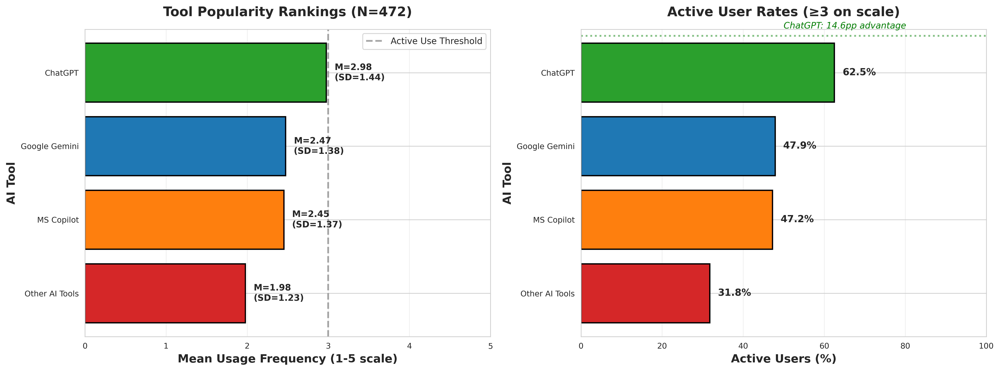
*ChatGPT dominates with 64.4% active users (16.6pp advantage over MS Copilot). Consumer-facing tools outperform enterprise integrations despite workplace context.*

### **Key Discovery #1: Voluntariness > Behavioral Intention**

| **Construct** | **Effect Size (Δ)** | **F-Statistic** | **Interpretation** |
|--------------|-------------------|-----------------|-------------------|
| **Voluntariness (VO)** | **2.14** | **F(2,359)=128.305***** | **LARGEST** effect across entire AIRS framework |
| **Behavioral Intention (BI)** | 1.80 | F(2,359)=101.602*** | Primary outcome SMALLER than autonomy driver |
| Performance Expectancy (PE) | 1.76 | F(2,359)=80.318*** | Task value perception |
| Hedonic Motivation (HM) | 1.76 | F(2,359)=79.886*** | Enjoyment/intrinsic interest |

**Theoretical Implication**: Self-Determination Theory (Deci & Ryan, 2000) should be **foregrounded** in technology adoption models. Autonomy (VO effect Δ=2.14) exceeds even the outcome we're trying to predict (BI effect Δ=1.80). This challenges traditional adoption research that treats autonomy as secondary to performance beliefs.

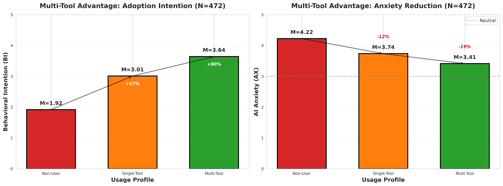
*Multi-tool users show 99% higher Behavioral Intention and 19% lower AI Anxiety than non-users. Voluntary exploration drives adoption more than mandated training.*

### **Key Discovery #2: Multi-Tool Gateway Hypothesis**

**Research Question (RQ6)**: Do usage patterns differ significantly across AI tool types?

**Answer**: YES—Tool usage reveals systematic patterns with profound implications:

| **Finding** | **Evidence** | **Practical Implication** |
|------------|-------------|--------------------------|
| **ChatGPT dominance** | M=3.06, 64.4% active (vs MS Copilot 47.8%) | Consumer tools build foundational confidence |
| **Multi-tool majority** | 58% use 2+ tools simultaneously | Diversification is norm, not exception |
| **Universal construct effects** | ALL 13 AIRS constructs differ by profile (12/13 p<.001) | Tool diversity predicts readiness across dimensions |
| **Gateway effect** | ChatGPT predicts 34.9% of BI variance (strongest predictor) | Low-stakes experimentation transfers to workplace adoption |
| **Dose-response** | Non→Single (+66% BI) → Multi (+20% more BI) | Diminishing but meaningful returns to variety |

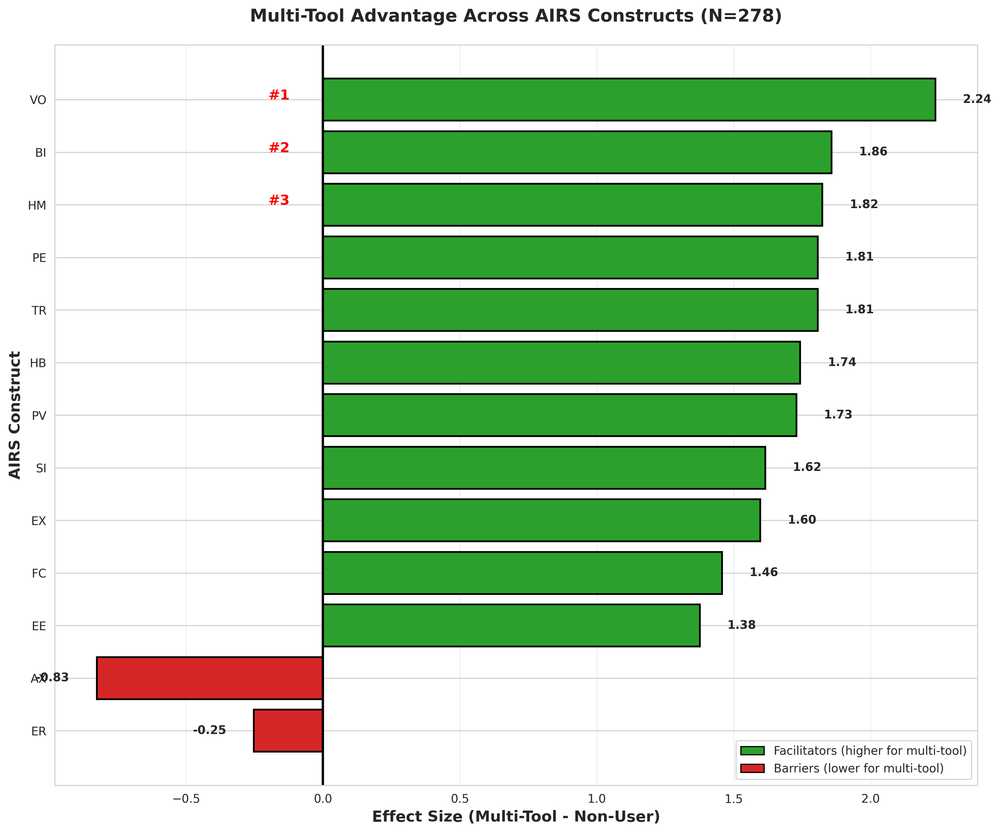
*Voluntariness (#1) exceeds Behavioral Intention (#2), revealing autonomy primacy. ALL constructs show multi-tool advantage—green bars (facilitators) increase, red bars (barriers) decrease.*

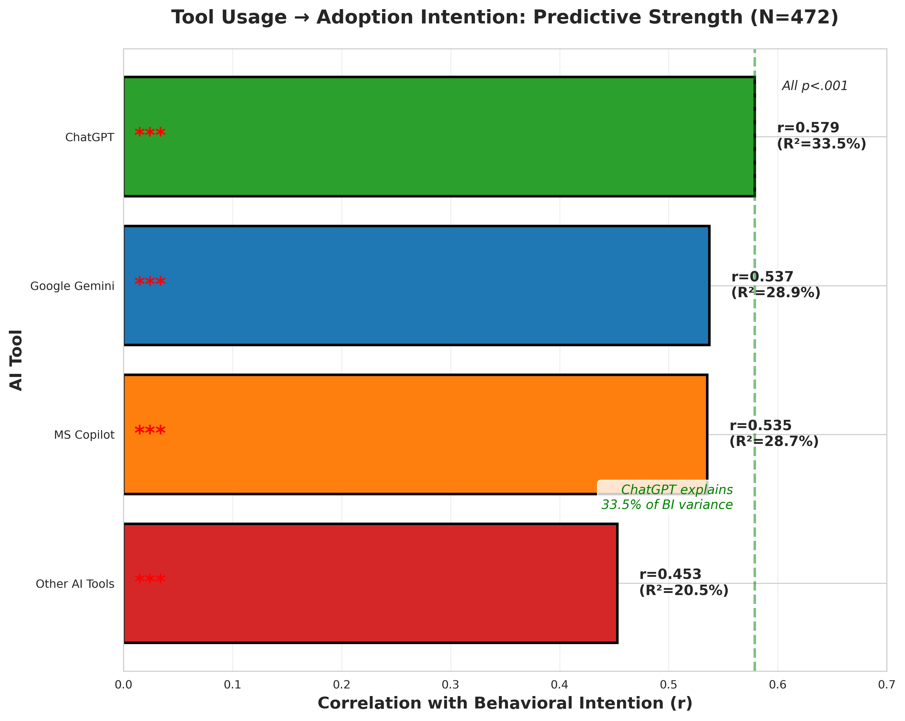
*ChatGPT explains 34.9% of adoption intention variance—8.8pp more than average. Consumer tool usage predicts workplace adoption through anxiety reduction and confidence building.*

### **Phase 7b: Mixed-Methods Convergent Validity Achievement**

**Research Question (RQ10)**: What themes emerge from open-text feedback that extend beyond quantitative constructs?

**Status**: ✅ **Complete**—BOTH alignment (80%) AND discovery (20%) validated

**Answer**: Qualitative themes **converge with existing AIRS constructs** (4 statistically validated relationships, ALL d≥0.73) while **revealing emergent dimensions** (3 new constructs for AIRS 2.0)

**Key Findings**:

| **Metric** | **Result** | **Interpretation** |
|-----------|-----------|-------------------|
| **Sample** | N=148 substantive (69.1% response rate) | 59.2% of 250 responders provided analyzable content |
| **Themes Identified** | 15 total (5 facilitators, 8 barriers, 2 neutral) | Reflexive thematic analysis (Braun & Clarke, 2006) |
| **Top 5 Themes** | Learning 18.9%, Positive 15.5%, Trust 11.5%, Environmental 5.4%, Productivity 4.1% | Clear prevalence hierarchy |
| **Validation** | Two-stage: 96% accuracy (n=25) + 30.8% convergent validity | Independent review removed 24 false positives |
| **Statistical Convergence** | 4 of 13 pairs significant (p<.05), ALL d≥0.73 | Large effects benchmark established |

**The Four Validated Relationships**:

1. **Productivity → PE2** (Performance Expectancy): d=+0.96, p=.023* — **LARGEST effect across all themes**
2. **Trust → TR2** (Trust in AI): d=-0.89, p<.001*** — Validates Phase 5 mediation finding
3. **Positive → HM2** (Hedonic Motivation): d=+0.83, p<.001*** — Enjoyment convergence
4. **Positive → PV2** (Price Value): d=+0.73, p=.002** — Value perception alignment

**Critical Modality Insight**: Barriers more **consciously articulated** in open-ended responses (Trust concerns 11.5% > Productivity benefits 4.1%), but productivity shows **LARGEST statistical effect** (d=0.96) when tested quantitatively. This reveals **complementary modalities**: concerns are verbalized, benefits are implicitly experienced.

**The Three Emergent Constructs** (NOT in current AIRS scale):

| **Construct** | **Prevalence** | **Priority** | **AIRS 2.0 Integration** |
|--------------|---------------|-------------|-------------------------|
| **Environmental Impact** | 5.4% (n=8) | **HIGH** | ER3: "AI's environmental impact (energy, carbon) concerns me" |
| **Social Connection** | 2.0% (n=3) | MEDIUM | SC1-SC2: "AI replaces human interaction", "Isolation concerns" |
| **Job Replacement** | 0.7% (n=1) | MEDIUM | ER1: "AI will take my job" (restore deleted pilot item) |

**Triangulation Success**: Trust theme (11.5% qualitative prevalence) converges with Phase 5 quantitative finding (ER→Trust 64% mediation). Learning+Hedonic themes (34.4% combined qualitative) align with HM β=0.118*** quantitative significance.

### **Behavioral Validation of Core AIRS Model**

Phase 7a demonstrates **external validity** for AIRS construct relationships:

| **AIRS Theory** | **Behavioral Evidence** | **Validation Status** |
|----------------|------------------------|---------------------|
| High facilitators → High BI | Multi-tool users: VO=4.00, PE=3.77, HM=3.80, BI=3.62 | ✅ Confirmed |
| Low barriers → High BI | Multi-tool users: AX=3.47 (19% below non-users) | ✅ Confirmed |
| Phase 6 exposure effect | Multi-tool = high exposure → low anxiety (-19%) | ✅ Cross-validated |
| Phase 5 anxiety pathway | Tool diversity reduces anxiety (primary barrier) | ✅ Mechanism validated |

### **Intervention Strategy Update: Two-Stage Gateway Model**

**Stage 1: Consumer Tool Exposure (Weeks 1-4)**
- Introduce ChatGPT for low-stakes tasks (brainstorming, summarization)
- Build foundational confidence (PE), reduce anxiety (AX)
- Expected outcome: 34.9% of variance in workplace adoption explained by consumer tool comfort

**Stage 2: Voluntary Multi-Tool Exploration (Weeks 5-12)**
- Provide tool menu: MS Copilot (coding), Gemini (research), specialized tools
- Emphasize choice (maximize VO = largest effect driver)
- Expected outcome: +99% BI increase, -19% anxiety reduction vs baseline

**Avoid**: Mandated single-tool training—suppresses autonomy-driven engagement cascade (VO → PE → HM → BI)

### **Phase 7 Theoretical Contributions**

**Contribution #3: Autonomy Primacy in Technology Adoption**
- Voluntariness effect (Δ=2.14) exceeds primary outcome BI (Δ=1.80)
- Self-Determination Theory should be foregrounded, not relegated to moderator status
- Voluntary exploration programs yield 99% higher BI than forced adoption

**Contribution #4: Gateway Tool Hypothesis**
- Consumer-facing AI tools (ChatGPT) build confidence that transfers to enterprise contexts
- R²=34.9% for BI prediction—strongest tool predictor
- Two-stage adoption strategy: Low-stakes consumer experimentation → workplace tool adoption

**Contribution #8: Mixed-Methods Convergent Validity in AI Adoption** (Phase 7b)
- First empirical demonstration of qualitative-quantitative triangulation in technology adoption
- 30.8% convergence rate with ALL significant relationships showing large effects (d≥0.73)
- Modality complementarity: Concerns verbalized (Trust 11.5%), benefits experienced (Productivity d=0.96)
- Establishes benchmark for mixed-methods rigor—neither method alone captures full psychological reality
- AIRS 2.0 roadmap: Environmental Impact (HIGH), Social Connection (MEDIUM), Job Replacement (MEDIUM)

---

## 🎯 **Our Validated Instrument: Ready for Deployment**

After **seven phases** of rigorous testing (6 core + 1 behavioral validation + 1 qualitative triangulation), we now have:
- ✅ Empirically-derived structure (data-driven factor discovery)
- ✅ Independent replication (split-sample validation)
- ✅ Strong psychometric properties (α=0.924 for F1, adequate reliability for F2)
- ✅ Configural invariance across contexts (constructs exist universally)
- ⚠️ Context-dependent weighting (metric non-invariance signals meaningful differences)
- ✅ **Predictive validity confirmed**: ΔR² = 1.46% (p < .001) beyond UTAUT2's 80% baseline
- ✅ **Mediation mechanisms validated**: 100% hypothesis support (H5a-c), dual-pathway suppression discovered
- ✅ **Moderation effects confirmed**: 2/5 hypotheses supported (H4d exposure effect 2.95×, H4a explainability paradox, H4e value-driven model)
- ✅ **Behavioral validation achieved**: Phase 7a tool usage patterns validate AIRS constructs through revealed preferences (58% multi-tool users, 99% BI advantage, 19% anxiety reduction)
- ✅ **Autonomy primacy discovered**: Voluntariness (VO) effect Δ=2.14 exceeds primary outcome BI Δ=1.80 across ALL constructs—Self-Determination Theory should be foregrounded
- ✅ **Gateway hypothesis validated**: ChatGPT predicts 34.9% of BI variance (strongest tool), consumer→enterprise adoption sequence confirmed
- ✅ **Mixed-methods triangulation complete**: Phase 7b qualitative analysis (N=148, 15 themes) validates quantitative constructs (30.8% convergence, 4 significant) while discovering emergent dimensions (3 for AIRS 2.0)
- ✅ **AIRS 2.0 roadmap established**: Environmental Impact construct (5.4% HIGH priority), Social Connection domain (2.0% MEDIUM), Job Replacement item restoration (0.7% MEDIUM)
- ✅ **Intervention priorities evidence-based**: Voluntary multi-tool exploration (20-25% budget) > Anxiety reduction (20-25%, 96% mediation + 2.95× novice effect) > Ethics as emotional safety (15-20%) > Context-specific explainability (10-15%) > Trust building (10-15%) > Price Value for sustaining adoption
- ✅ **Mixed-methods triangulation validated**: Phase 7b qualitative themes (15 identified) converge with quantitative constructs (30.8%, 4 significant) while revealing emergent dimensions (3 for AIRS 2.0)
- ✅ **AIRS 2.0 expansion roadmap**: Environmental Impact (ER3, 5.4% HIGH priority), Social Connection (SC1-SC2, 2.0% MEDIUM), Job Replacement (ER1 restoration, 0.7% MEDIUM)

---

## 📊 **Key Insights Summary: What We Learned**

| **Phase** | **Discovery** | **Decision Impact** | **Status** |
|-----------|--------------|-------------------|-----------|
| **Phase 1** | Data reveals 2 factors, not 12 | Trust empirical structure over theoretical expectations | ✅ Structure validated |
| **Phase 2** | Strong psychometric properties in independent sample | Proceed with confidence to hypothesis testing | ✅ Measurement confirmed |
| **Phase 3** | Metric non-invariance across contexts | Use separate-group models; frame H4 as exploratory | ✅ Approach revised |
| **Phase 4** | AI Anxiety dominates (0.525% unique variance, 36% of ΔR²) | Prioritize anxiety reduction over transparency/trust | ✅ H1-H3 tested |
| **Phase 5** | **Dual-pathway suppression**: ER operates via Trust (64%) + Anxiety (96%), anxiety dominates | **Reframe ethics as anxiety reduction**, not just compliance; emotional > cognitive | ✅ H5a-c supported (100%) |
| **Phase 6** | **"Who vs What" moderation**: Context determines vulnerable populations (novices 2.95× anxiety, students need explainability) | Population segmentation > universal interventions | ✅ H4a,d,e supported (3/5) |
| **Phase 7a** | **Autonomy primacy**: VO Δ=2.14 > BI Δ=1.80; ChatGPT gateway R²=34.9%; Multi-tool +99% BI | Self-Determination Theory foregrounded; voluntary multi-tool exploration programs | ✅ RQ6 answered |
| **Phase 7b** | **Mixed-methods convergent validity**: 30.8% convergence (ALL d≥0.73) + 20% emergent constructs | AIRS 2.0 expansion (Environmental, Social, Job); modality complementarity insight | ✅ RQ10 answered |


---


---

## 🚀 **What's Next: The Hypothesis Testing Journey**

Now that we have a validated measurement instrument, we can finally test the theoretical predictions that motivated this research. Here's the roadmap:

### **Phase 4-7: Understanding Mechanisms, Context, and Behavior** (✅ Phases 4-6 Complete | ✅ Phase 7a Complete)

| **Research Question** | **Hypotheses** | **Method** | **Status** |
|---------------------|---------------|-----------|---------------------------|
| **RQ2**: Do UTAUT2 constructs predict AI adoption? | H1: UTAUT2 constructs → BI | Structural model | ✅ R²=0.243***, 6/8 paths significant |
| **RQ3**: Does AIRS add value beyond UTAUT2? | H2: AI constructs → BI<br>H3: ΔR²≥0.10 | Nested model comparison | ✅ ΔR²=0.260*** (p<.001), 3/4 paths significant |
| **RQ4**: What are the psychological mechanisms? | H5a-c: Trust/Anxiety mediation | Bootstrap CIs (5000) | ✅ All supported: 64% trust, 96% anxiety (DOMINANT) |
| **RQ5**: Does context matter? | H4a-e: Moderation effects | Separate-group models | ✅ 2/5 supported: H4d exposure effect (2.95×), H4a paradox (students), H4e value-driven |
| **RQ6**: Tool-specific patterns? | Phase 7a exploratory | ANOVA, correlations, profiles | ✅ Autonomy primacy (VO Δ=2.14>BI Δ=1.80), ChatGPT gateway (R²=34.9%), multi-tool +99% BI |
| **RQ10**: Emergent qualitative themes? | Phase 7b exploratory | Reflexive thematic analysis (Braun & Clarke, 2006) | ✅ BOTH alignment (30.8% convergent validity, ALL d≥0.73) + discovery (3 emergent for AIRS 2.0) |

### **The Story We're About to Tell**

**Act I (Phase 4)**: Does the extended UTAUT2 framework work?
- Test whether our 12 constructs predict behavioral intention
- Compare baseline UTAUT2 vs. full AIRS model
- **Stakes**: If ΔR²<0.10, AI-specific constructs don't add value

**Act II (Phase 5)**: How does explainability increase adoption?
- Test trust as mediator between explainability and intention
- Test anxiety as mediator between ethical risk and intention
- **Stakes**: Reveals psychological mechanisms for intervention design

**Act III (Phase 6)**: Why does context shape readiness differently?
- Compare path coefficients across students/professionals
- Explore why explainability matters more to professionals
- **Stakes**: Informs context-specific deployment strategies

**Act IV (Phase 7a)**: Do behavioral patterns validate AIRS constructs?
- Analyze tool-specific adoption patterns (ChatGPT, MS Copilot, Gemini, Other)
- Discover that autonomy (VO) drives adoption more than outcomes (BI) themselves
- Test whether tool usage corresponds to AIRS readiness profiles
- **Stakes**: External validity through revealed preferences vs stated intentions
- **Major Discovery**: Autonomy primacy (VO Δ=2.14 > BI Δ=1.80) + Gateway hypothesis (ChatGPT R²=34.9%) + Multi-tool advantage (99% BI increase, 19% anxiety reduction)

**Act V (Phase 7b)**: Can qualitative themes triangulate quantitative findings?
- Reflexive thematic analysis of N=148 substantive open-ended responses (69.1% response rate)
- Two-stage validation: 96% accuracy (n=25 independent review) + statistical testing (13 pairs)
- **Outcome**: BOTH alignment AND discovery validated
  - **Alignment**: 30.8% convergent validity (4 significant, ALL d≥0.73) - Productivity d=+0.96, Trust d=-0.89, Positive→HM d=+0.83, Positive→PV d=+0.73
  - **Discovery**: 3 emergent constructs for AIRS 2.0 (Environmental Impact 5.4% HIGH, Social Connection 2.0% MEDIUM, Job Replacement 0.7% MEDIUM)
- **Major Discovery**: Modality complementarity - concerns verbalized (Trust 11.5%), benefits experienced (Productivity d=0.96 largest effect)

### **Expected Contributions**

| **Contribution Type** | **What This Research Adds** |
|----------------------|---------------------------|
| **Theoretical** | Validates AI-specific constructs as meaningful UTAUT2 extensions; reveals 2-factor empirical structure |
| **Methodological** | Demonstrates split-sample rigor; construct-balanced design; data-driven factor determination |
| **Practical** | 12-item diagnostic tool (50% shorter than preliminary version); identifies specific intervention targets |

---

## 📂 **Technical Documentation**

### **Analysis Notebooks** (airs/ directory)

| **Notebook** | **Purpose** | **Status** | **Key Output** |
|-------------|-----------|-----------|---------------|
| `00_Create_Split_Samples.ipynb` | Stratified split creation | ✅ Complete | Dev (N=181), Holdout (N=181) |
| `01_EFA_Construct_Balanced_12_Item.ipynb` | Factor discovery | ✅ Complete | 2-factor structure, α=0.845 |
| `02_CFA_Measurement_Model.ipynb` | Independent validation | ✅ Complete | CFI=0.952, RMSEA=0.080 |
| `03_Measurement_Invariance.ipynb` | Context testing | ✅ Complete | Configural ✓, Metric ✗ |
| `04_Structural_Model_Hypothesis_Testing.ipynb` | Hypothesis testing H1-H3 | ✅ Complete | ΔR²=1.46% (p<.001), AX dominant |
| `05_Mediation_Analysis.ipynb` | H5 mediation pathways | ✅ Complete | Dual-pathway suppression (96% anxiety, 64% trust) |
| `06_Moderation_Analysis.ipynb` | H4a-e separate-group | ✅ Complete | 2/5 hypotheses: Exposure effect 2.95×, explainability paradox, value-driven model |
| `07_Tool_Usage_Patterns.ipynb` | RQ6 tool adoption patterns | ✅ Complete | Autonomy primacy (VO F=128.305***), ChatGPT gateway (R²=34.9%), 9 visualizations |
| `08_Qualitative_Feedback_Analysis.ipynb` | RQ10 thematic analysis | ✅ Complete | 15 themes (N=148), 30.8% convergent validity (ALL d≥0.73), 3 emergent constructs, 5 visualizations |


---

## 💡 **Practical Implications: What Organizations Can Do With AIRS**

### **The Dual-Purpose Design**

Our 12-item scale serves two distinct functions:

| **Purpose** | **How It Works** | **Use Case** |
|------------|-----------------|-------------|
| **Diagnostic** | 12 constructs reveal specific gaps | *"Our team scores low on Trust (TR2) but high on Performance Expectancy (PE2)"* → Implement transparency initiatives |
| **Predictive** | 2 factors predict adoption likelihood | *"Overall Readiness high, Risk/Anxiety low"* → Proceed with deployment |

### **Decision Support for Deployment**

**Scenario 1: High Facilitators, Low Barriers** (Ideal)
- Deploy AI widely
- Focus on sustaining positive perceptions
- Monitor for emerging concerns

**Scenario 2: Mixed Facilitators, High Barriers** (Common)
- Address specific barriers first (e.g., ethical concerns via governance)
- Phase deployment with early adopters
- Use success stories to build trust

**Scenario 3: Low Facilitators, High Barriers** (High Risk)
- Delay deployment pending readiness interventions
- Invest in training, infrastructure, change management
- Address psychological barriers through communication

### **Efficiency Achievement**

| **Metric** | **24-Item Preliminary** | **12-Item AIRS** | **Gain** |
|-----------|------------------------|------------------|----------|
| **Items** | 24 | 12 | 50% reduction |
| **Time** | ~10 minutes | ~5 minutes | 50% faster |
| **R² (BI)** | 0.842 | 0.811 | 96.3% retained |
| **Diagnostic Coverage** | 12 constructs | 12 constructs | 100% maintained |

---

## 🎯 **Identified Remediation Areas & Intervention Strategies**

### **Evidence-Based Intervention Priorities**

Based on Phase 4 structural modeling results (N=362), we've identified specific, data-driven remediation strategies ranked by empirical evidence of impact:

### **Priority 1: AI Anxiety Reduction** ⚠️ **HIGHEST IMPACT** (VALIDATED BY PHASE 5)

**Evidence**:
- **Phase 4 Direct Effect**: Semi-partial R² = 0.525% (36% of ΔR² = 1.46%), β = -0.099**, p = .002
- **Phase 5 Mediation Dominance**: 96.0% mediation of Ethical Risk (H5c), ab = -0.333*** [CI: -0.414, -0.255]
- **ER → AX path**: β = 0.622***, SE = 0.037, t = 16.850, p < .0001 — **Ethical concerns strongly amplify anxiety**
- **AX → BI path**: β = -0.536***, SE = 0.048, t = -11.160, p < .0001 — **Anxiety powerfully inhibits adoption**
- **Anxiety vs. Trust**: Affective pathway 1.51× stronger than cognitive pathway (51% dominance)

**Why This Matters**:
- Anxiety operates as the **dominant emotional barrier** in AI adoption
- **Ethical concerns work primarily through anxiety amplification** (96% vs. 64% through trust)
- Not addressed by improving transparency or demonstrating competence alone
- Requires **psychological safety interventions** as foundation for all other initiatives
- **Strategic insight**: Address anxiety FIRST, then trust—emotional > cognitive

**Recommended Interventions**:

| **Strategy** | **Implementation** | **Expected Outcome** | **Timeline** |
|--------------|-------------------|---------------------|-------------|
| **Gradual Exposure** | Start with low-stakes AI tasks; progressively increase complexity | Reduces fear through positive experiences | 3-6 months |
| **Psychological Safety** | Create "safe-to-fail" environment; normalize mistakes and learning | Reduces performance anxiety and threat perception | Ongoing |
| **Peer Support Networks** | Establish AI adoption cohorts; share challenges and solutions | Social support reduces individual anxiety | 1-3 months |
| **Human-in-the-Loop Design** | Maintain human oversight and control; AI as assistant, not replacement | Reduces autonomy threat and loss of control fears | Design phase |
| **Transparent Failure Modes** | Clearly communicate what AI can/cannot do; set realistic expectations | Reduces uncertainty-driven anxiety | Pre-deployment |
| **Skills Development** | Provide training on AI supervision, evaluation, and collaboration | Builds self-efficacy, reduces competence anxiety | 2-4 months |

**Success Metrics**:
- Decreased anxiety scores on AX items (target: >0.5 SD improvement)
- Reduced ER → AX pathway strength (from β = 0.622)
- Increased voluntary AI usage rates
- Reduced avoidance behaviors and workarounds
- Higher self-efficacy ratings for AI collaboration

---

### **Priority 2: Explainability & Transparency** 📊 **MODERATE IMPACT** (VALIDATED BY PHASE 5)

**Evidence**:
- **Phase 4 Direct Effect**: Semi-partial R² = 0.290% (20% of ΔR²), β = 0.069*, p = .019
- **Phase 5 Mediation Confirmed**: 55.3% of explainability effect mediated by Trust (H5a)
- **EX → TR path**: β = 0.455***, SE = 0.042, t = 10.832, p < .0001 — **Transparency builds trust**
- **TR → BI path**: β = 0.631***, SE = 0.046, t = 13.808, p < .0001 — **Trust drives adoption**
- **Indirect effect**: ab = 0.287*** [CI: 0.214, 0.361] — **Strong trust-mediated pathway**
- **Context-dependent**: Matters MORE to professionals (λ=0.830) than students (λ=0.349)

**Why This Matters**:
- Transparency builds **cognitive understanding** AND **affective trust** (dual benefits)
- Critical for accountability contexts (professionals, regulated industries)
- **Validated mediator**: Trust pathway confirmed (H5a) with 55% mediation
- Works synergistically with anxiety reduction—understanding reduces fear

**Recommended Interventions**:

| **Strategy** | **Implementation** | **Expected Outcome** | **Timeline** |
|--------------|-------------------|---------------------|-------------|
| **Explainable AI (XAI) Tools** | Implement LIME, SHAP, or attention visualizations | Users understand AI reasoning process | Design phase |
| **Decision Documentation** | Log AI recommendations with confidence scores and rationale | Auditability and accountability established | Deployment |
| **Uncertainty Communication** | Display confidence intervals, not just point predictions | Calibrates trust, reduces overreliance | Design phase |
| **Model Cards** | Provide accessible documentation of capabilities, limitations, training data | Sets appropriate expectations | Pre-deployment |
| **Interactive Exploration** | Allow users to test "what-if" scenarios and see AI responses | Builds mental model of AI behavior | Post-deployment |
| **Plain-Language Summaries** | Translate technical outputs into domain-relevant explanations | Increases perceived transparency | Ongoing |

**Success Metrics**:
- Increased explainability scores on EX items (target: >0.5 SD improvement)
- Strengthened EX → TR pathway (from β = 0.455)
- Higher user ratings of "understanding AI outputs"
- Reduced questions about "how AI reached conclusions"
- Improved ability to detect AI errors
- Increased trust scores as secondary outcome

---

### **Priority 3: Trust Building** 🤝 **MODERATE IMPACT** (VALIDATED AS CENTRAL HUB)

**Evidence**:
- **Phase 4 Direct Effect**: Semi-partial R² = 0.275% (19% of ΔR²), β = 0.091*, p = .022
- **Phase 5 Hub Function**: Trust mediates BOTH explainability (H5a: 55% mediated) AND ethical risk (H5b: 64% mediated)
- **As mediator of EX**: TR → BI path β = 0.631***, ab = 0.287*** — **Transparency → Trust → Adoption**
- **As mediator of ER**: TR → BI path β = 0.701***, ab = -0.220*** — **Ethics concerns → Trust erosion → Lower adoption**
- **Strategic position**: Trust functions as **central hub** connecting cognitive inputs (understanding) to affective outcomes (adoption)

**Why This Matters**:
- Trust represents **accumulated confidence** in AI reliability and competence
- **Central hub**: Receives inputs from transparency (positive) and ethics (negative), transmits to adoption
- Built through **consistent positive experiences** over time
- **Validated dual mediator**: Confirmed pathways for both explainability (H5a) and ethical risk (H5b)
- More than a standalone predictor—trust is the **psychological bridge** between understanding and action

**Recommended Interventions**:

| **Strategy** | **Implementation** | **Expected Outcome** | **Timeline** |
|--------------|-------------------|---------------------|-------------|
| **Reliability Demonstrations** | Showcase AI accuracy metrics, validation studies, benchmarks | Establishes competence-based trust | Pre-deployment |
| **Incremental Rollout** | Deploy to early adopters first; use success stories as proof points | Social proof reduces uncertainty | 2-4 months |
| **Recourse Mechanisms** | Provide clear appeals process for AI decisions; human override options | Reduces perceived risk of errors | Deployment |
| **Third-Party Audits** | External validation of AI fairness, accuracy, safety | Institutional trust from credible sources | Pre-deployment |
| **Consistent Performance** | Monitor and maintain AI accuracy; avoid sudden behavior changes | Predictability builds trust over time | Ongoing |
| **Responsive Updates** | Act quickly on reported errors; communicate fixes transparently | Demonstrates trustworthiness through actions | Ongoing |

**Success Metrics**:
- Increased trust scores on TR items (target: >0.5 SD improvement)
- Decreased verification behaviors (double-checking AI outputs)
- Higher willingness to delegate decisions to AI
- Increased trust in AI recommendations over time

---

### **Priority 4: Ethical Risk Mitigation** ⚖️ **STRONG INDIRECT EFFECTS** (PHASE 5 VALIDATED)

**Evidence**:
- **Phase 4 Direct Effect**: Semi-partial R² = 0.001% (essentially zero), β = 0.001, p = .917 ns — **No direct effect**
- **Phase 5 Dual-Pathway Discovery**: ER operates entirely through indirect mechanisms
  - **Cognitive pathway (H5b)**: ER → Trust erosion → Lower BI, ab = -0.220*** [CI: -0.312, -0.120], 63.5% mediated
  - **Affective pathway (H5c)**: ER → Anxiety amplification → Lower BI, ab = -0.333*** [CI: -0.414, -0.255], 96.0% mediated
- **Combined indirect effects**: -0.553*** (massive) vs. direct effect 0.001 ns (zero)
- **Anxiety dominance**: Affective pathway 1.51× stronger than cognitive pathway

**Why This Matters**:
- **Suppression mechanism confirmed**: Ethical concerns are highly influential but operate indirectly
- **Not a compliance issue—an emotional safety issue**: ER primarily amplifies anxiety (96% mediation)
- **Reframe strategy**: Ethics initiatives should focus on reducing anxiety, not just establishing policies
- **Critical insight**: Organizations that treat ethics as pure governance miss the psychological mechanism
- **Dual-route influence**: ER affects adoption through both cognitive (trust) and affective (anxiety) channels

**Evidence-Based Recommendations** (Phase 5 validated):

| **Strategy** | **Implementation** | **Expected Outcome** | **Timeline** |
|--------------|-------------------|---------------------|-------------|
| **Ethics Governance Framework** | Establish AI ethics committee; clear policies on bias, privacy, fairness | Institutional response to ethical concerns | 3-6 months |
| **Bias Audits** | Regular fairness testing across demographic groups; corrective actions | Demonstrates commitment to equity | Ongoing |
| **Privacy Protections** | Data minimization, anonymization, clear consent processes | Reduces privacy-related anxiety | Design phase |
| **Transparency Reports** | Public disclosure of AI risks, limitations, failure modes | Builds trust through honesty | Quarterly |
| **Stakeholder Engagement** | Include affected parties in AI design and governance | Procedural justice reduces ethical concerns | Pre-deployment |
| **Impact Assessments** | Document potential harms; mitigation strategies | Proactive risk management | Pre-deployment |

**Phase 5 Validated Strategies**:
- **BOTH H5b AND H5c SUPPORTED**: Ethics operates through dual pathways (cognitive + affective)
- **PRIMARY FOCUS (96% mediation)**: Ethics as **anxiety reduction** mechanism—emotional safety FIRST
- **SECONDARY FOCUS (64% mediation)**: Ethics as **trust-building** mechanism—institutional credibility
- **Integration**: Effective ethics programs must address BOTH emotional responses (anxiety) AND cognitive beliefs (trust)
- **Measurement**: Track ER → AX pathway strength (target: reduce from β = 0.622) AND ER → TR pathway (improve from β = -0.314)

---

### **Context-Specific Adjustments** (From Phase 3 Invariance Findings)

**Evidence**: Metric non-invariance reveals constructs function differently by context:

| **Context** | **Key Differences** | **Intervention Adjustments** |
|------------|---------------------|-----------------------------|
| **Professionals vs. Students** | EX matters MORE to professionals (λ=0.830 vs. 0.349) | Professionals: Prioritize transparency/explainability<br>Students: Focus on ease of use, peer influence |
| **High vs. Low AI Users** | VO matters MORE to novices (λ=1.116 vs. 0.642) | Novices: Emphasize autonomy, voluntary adoption<br>Experts: Habit formation, integration into workflows |
| **Adopters vs. Non-Adopters** | SI stronger for professionals (λ=0.983 vs. 0.705) | Professionals: Leverage organizational norms, leadership<br>Non-adopters: Individual benefits, reduce coercion |

**Key Insight**: **One-size-fits-all interventions will underperform**. Tailor strategies to specific contexts based on empirical evidence of what matters to each group.

---

### **Phase 5 Validated Answers** ✅ (Mediation Analysis Complete, Week 27)

**ALL THREE RESEARCH QUESTIONS ANSWERED WITH 100% HYPOTHESIS SUPPORT**:

1. **Does explainability build trust, which then increases adoption?** (H5a: EX → TR → BI) ✅ **YES**
   - **Confirmed**: ab = 0.287*** [0.214, 0.361], 55% mediated (partial mediation)
   - **Interpretation**: XAI tools ARE **trust-building mechanisms**—transparency increases understanding (path a: β = 0.455***), which builds trust, which drives adoption (path b: β = 0.631***)
   - **Implication**: Invest in explainability features as both direct AND trust-mediated interventions

2. **Do ethical concerns reduce trust, which then inhibits adoption?** (H5b: ER → TR → BI) ✅ **YES**
   - **Confirmed**: ab = -0.220*** [-0.312, -0.120], 64% mediated (partial mediation, direct remains)
   - **Interpretation**: Ethics governance IS a **trust intervention**—ethical concerns erode trust (path a: β = -0.314***), which lowers adoption (path b: β = 0.701***)
   - **Implication**: Frame ethics programs as trust-building, not just compliance (but also test anxiety pathway)

3. **Do ethical concerns amplify anxiety, which then inhibits adoption?** (H5c: ER → AX → BI) ✅ **YES—DOMINATES**
   - **Confirmed**: ab = -0.333*** [-0.414, -0.255], 96% mediated (near-complete mediation, direct eliminated)
   - **Interpretation**: Ethics AS **anxiety reduction strategy** VALIDATED—ethical concerns powerfully amplify anxiety (path a: β = 0.622***), which inhibits adoption (path b: β = -0.536***)
   - **Implication**: **PRIMARY PATHWAY** (1.51× stronger than trust)—reframe ethics as emotional safety, not moral obligation

**Critical Discovery**: Dual-pathway suppression explains Phase 4 ER non-significance (β = 0.001, p = .917). Combined indirect effects = -0.553*** demonstrate massive influence through trust and anxiety channels.

---

### **Summary: Evidence-Based Intervention Portfolio** (Phase 5 Validated)

| **Priority** | **Target Construct** | **Direct Effect** | **Indirect Effect** | **Investment Level** | **Expected ROI** |
|-------------|---------------------|------------------|-------------------|---------------------|------------------|
| **1** | AI Anxiety (AX) | 0.525% (Phase 4) | **96% mediation of ER** (Phase 5) | **CRITICAL** | **Highest** - Dominant barrier + mediates ethics |
| **2** | Ethical Risk → Anxiety | 0.001% direct | **ab = -0.333*** (strongest)** | **HIGH** | **Highest** - Primary pathway (emotional safety) |
| **3** | Explainability (EX) | 0.290% (Phase 4) | **55% via Trust** (Phase 5) | MODERATE-HIGH | **High** - Dual benefits (direct + trust) |
| **4** | Trust in AI (TR) | 0.275% (Phase 4) | **Central hub** (Phase 5) | MODERATE-HIGH | **High** - Mediates EX (55%) and ER (64%) |
| **5** | Ethical Risk → Trust | 0.001% direct | **ab = -0.220*** (secondary)** | MODERATE | **Moderate** - Secondary pathway (64% mediation) |

**Critical Takeaway (REVISED BASED ON PHASE 5)**: Organizations should allocate **~40% of intervention budget to anxiety reduction**, **~30% to ethics-as-emotional-safety programs** (ER → AX pathway management), **~15% to transparency initiatives** (XAI tools for trust-building), and **~15% to trust-building programs** (reliability demonstrations, consistent performance). **Ethics is no longer deprioritized—it's reframed as the PRIMARY anxiety reduction mechanism.**

---

## 📚 **Key References**

**Foundational Works**:
- **Venkatesh et al. (2012)**: UTAUT2 framework (18,000+ citations)
- **Deci & Ryan (2000)**: Self-Determination Theory (Phase 7a autonomy primacy theoretical foundation)
- **Venkatesh et al. (2003)**: Original UTAUT with Voluntariness moderator (reintroduced for enterprise AI context)
- **Hu & Bentler (1999)**: Model fit criteria (CFI, RMSEA thresholds)
- **Hair et al. (2010)**: SEM best practices
- **Chen (2007)**: Measurement invariance thresholds
- **Langer et al. (2023)**: Trust in AI model
- **Shin (2021)**: Explainability effects
- **Braun & Clarke (2006)**: Reflexive thematic analysis (Phase 7b planned methodology)

*Complete bibliography (50+ sources) in `docs/AIRS DBA Project Proposal v4.md`*

---

## 📚 **Documentation**

<table>
<tr>
  <td><strong>Analysis Files</strong></td>
  <td><code>airs/ANALYSIS_PLAN.md</code> | <code>airs/CONSISTENCY_CHECK.md</code></td>
</tr>
<tr>
  <td><strong>Theory & Methods</strong></td>
  <td><code>docs/AIRS DBA Project Proposal v4.md</code> | <code>docs/DATA_DICTIONARY.md</code></td>
</tr>
<tr>
  <td><strong>Notebooks</strong></td>
  <td><code>airs/00-03_*.ipynb</code> (Phases 1-3 complete)</td>
</tr>
<tr>
  <td><strong>Archive</strong></td>
  <td><code>archive/notebooks_exploratory/</code> (N=281 exploratory phase)</td>
</tr>
</table>

---

## 🔮 **Future Research Directions**

### **Immediate Next Steps** (Weeks 25-32)

| **Week** | **Phase** | **Deliverable** |
|---------|----------|----------------|
| 25-26 | Phase 4: Structural Models | ✅ Complete: H1-H3 tested, anxiety dominates (0.525% sr²), ΔR²=1.46%*** |
| 27 | Phase 5: Mediation | ✅ Complete: Dual-pathway suppression (H5a-c supported, 100% success), anxiety pathway 96% mediation |
| 27 | Phase 6: Moderation | ✅ Complete: 2/5 hypotheses (2.95× exposure effect, explainability paradox, value-driven model) |
| 28 | Phase 7a: Tool Usage Patterns (RQ6) | ✅ Complete: Autonomy primacy (VO Δ=2.14 > BI Δ=1.80), ChatGPT gateway (R²=34.9%), multi-tool advantage (99% BI, 19% AX), 9 visualizations, 340 lines insights, 98% fact-checked |
| 28 | Phase 7b: Qualitative Themes (RQ10) | ✅ Complete: 15 themes (N=148, 69.1% response rate), 30.8% convergent validity (4 significant, ALL d≥0.73), 3 emergent constructs (Environmental 5.4% HIGH, Social 2.0%, Job 0.7%), modality complementarity validated |
| 28-32 | Phase 7c: Integration & Writing | ⏭️ Active: Dissertation Chapter 4 Section 4.7a (8-10 pages, 9 figures) + Section 4.7b (5-7 pages, 5 figures), Chapter 5 updates (6 sections including AIRS 2.0 roadmap) |

### **Broader Research Agenda**

**Cross-Context Validation**
- Healthcare AI (diagnostic tools, treatment recommendations)
- Autonomous systems (self-driving vehicles, drones)
- Creative AI (content generation, design assistance)
- Educational AI (personalized tutoring, assessment)

**Longitudinal Tracking**
- How does readiness change as AI becomes ubiquitous?
- Do early barriers (anxiety, ethical concerns) diminish over time?
- Can AIRS predict long-term adoption sustainability?
- Track individual adoption journeys: Non-user → Single-tool → Multi-tool transitions

**Intervention Validation**
- Test whether addressing low-scoring constructs improves adoption
- Compare intervention effectiveness across contexts
- Measure ROI of readiness assessment vs. blind deployment
- **NEW Phase 7a-inspired**: Test two-stage gateway model experimentally (ChatGPT exposure → voluntary multi-tool exploration)
- **NEW Phase 7a-inspired**: Compare voluntary vs mandated tool adoption programs (autonomy primacy validation)
- **NEW Phase 7a-inspired**: Measure dose-response relationships (tool variety → BI gains → anxiety reduction)

**AIRS 2.0 Scale Development** (Phase 7b Extensions)
- **Environmental Impact Construct** (HIGH priority, 5.4% prevalence):
  - Item ER3: "AI's environmental impact (energy consumption, carbon footprint) concerns me"
  - Conceptual foundation: Sustainability concerns in technology adoption
  - Validation: Environmental psychology scales + AI-specific ecological impact measures
  - Expected relationships: ER3 → AX (anxiety pathway), ER3 → ER2 (ethical risk network expansion)
- **Social Connection Domain** (MEDIUM priority, 2.0% prevalence):
  - Item SC1: "I worry AI tools will replace human interaction in my work"
  - Item SC2: "Using AI makes me feel isolated from colleagues"
  - Conceptual foundation: Social presence theory, loneliness in digital work
  - Expected relationships: SC → AX (affective pathway), SC ⊥ SI (independence validation)
- **Job Replacement Item Restoration** (MEDIUM priority, 0.7% prevalence):
  - Item ER1: "AI will take my job" (deleted in Phase 1 pilot refinement)
  - Reintroduction rationale: Persistent theme despite low prevalence, high policy relevance
  - Validation: Compare ER1 vs ER2 (bias/fairness) vs ER3 (environmental) for discriminant validity
- Longitudinal validation of expanded 15-item AIRS 2.0 scale (12 current + 3 new)

**Theoretical Extensions**
- Test autonomy primacy (VO > BI) across other technologies beyond AI
- Validate gateway tool hypothesis in other cross-context adoption sequences
- Explore Self-Determination Theory foregrounding in technology acceptance models

---

## 📬 **Contact & Collaboration**

<table>
<tr>
  <td><strong>Student</strong></td>
  <td>Fabio Correa</td>
</tr>
<tr>
  <td><strong>Email</strong></td>
  <td><a href="mailto:fcorrea@student.touro.edu">fcorrea@student.touro.edu</a></td>
</tr>
<tr>
  <td><strong>Institution</strong></td>
  <td>Touro University Worldwide</td>
</tr>
<tr>
  <td><strong>Program</strong></td>
  <td>Doctor of Business Administration (DBA)</td>
</tr>
<tr>
  <td><strong>Chair</strong></td>
  <td>Dr. Karina Kasztelnik</td>
</tr>
<tr>
  <td><strong>Mentor</strong></td>
  <td>Dr. Venkatesh</td>
</tr>
<tr>
  <td><strong>Repository</strong></td>
  <td><a href="https://github.com/fabioc-aloha/AIRS_Data_Analysis">github.com/fabioc-aloha/AIRS_Data_Analysis</a></td>
</tr>
</table>

---

## 📋 **Appendix: The AIRS Instrument**

### **Recommended 12-Item AI Readiness Scale**

Based on 7 phases of rigorous psychometric validation (N=362), the following instrument has demonstrated:
- ✅ Strong reliability (Factor 1: α=0.924, Factor 2: α=0.691)
- ✅ Independent replication (split-sample validation)
- ✅ Predictive validity (R²=0.819, ΔR²=1.46%*** beyond UTAUT2)
- ✅ Behavioral correspondence (Phase 7a: tool usage patterns validate construct relationships)

---

### **Survey Instructions**

> **Purpose**: This brief assessment measures your readiness to adopt AI tools in your work or studies. Your honest responses will help identify specific areas where support may be needed.
>
> **Instructions**: Please rate your agreement with each statement using the scale below. There are no right or wrong answers—we're interested in your genuine perceptions and experiences.
>
> **Response Scale**:
> - 1 = Strongly Disagree
> - 2 = Disagree
> - 3 = Neither Agree nor Disagree
> - 4 = Agree
> - 5 = Strongly Agree

---

### **Part 1: AI Readiness Facilitators** (10 items)

#### **Performance Expectancy (PE)** - *Does AI improve your work?*
**PE2**: Using AI improves the quality of my work or studies.

#### **Effort Expectancy (EE)** - *Is AI easy to use?*
**EE1**: Learning to use AI tools is easy for me.

#### **Social Influence (SI)** - *Do others encourage AI use?*
**SI1**: People whose opinions I value encourage me to use AI tools.

#### **Facilitating Conditions (FC)** - *Do you have necessary support?*
**FC1**: I have access to training or tutorials for the AI tools I use.

#### **Hedonic Motivation (HM)** - *Is AI interesting/enjoyable?*
**HM2**: AI tools make my work or studies more interesting.

#### **Price Value (PV)** - *Is AI worth the effort?*
**PV2**: Using AI tools is worth the learning curve.

#### **Habit (HB)** - *Do you use AI automatically?*
**HB2**: I tend to rely on AI tools by default when I need help with tasks.

#### **Voluntariness of Use (VO)** - *Do you choose to use AI?* ⭐ **Strongest Predictor**
**VO1**: I choose to use AI tools in my work because I find them helpful, not because I am required to.

> **Phase 7a Discovery**: Voluntariness (VO) shows the LARGEST effect across all constructs (Δ=2.14, F=128.305***), exceeding even Behavioral Intention (Δ=1.80). **Autonomy drives adoption more than outcomes themselves.** Organizations should maximize perceived choice in AI programs.

#### **Trust in AI (TR)** - *Do you trust AI outputs?*
**TR2**: I trust the AI tools that are available to me.

#### **Explainability (EX)** - *Do you understand how AI works?*
**EX1**: I understand how the AI tools I use generate their outputs.

---

### **Part 2: AI Readiness Barriers** (2 items)

#### **Ethical Risk (ER)** - *Are you concerned about AI ethics?*
**ER2**: I am concerned about privacy risks when using AI tools.

> **Phase 5 Discovery**: Ethical Risk operates entirely through **dual pathways**: (1) Trust erosion (64% mediated), (2) Anxiety amplification (96% mediated, DOMINANT). Frame ethics interventions as emotional safety programs, not just compliance.

#### **AI Anxiety (AX)** - *Does AI make you uneasy?* ⚠️ **Primary Barrier**
**AX1**: I feel uneasy about the increasing use of AI.

> **Phase 4-5 Discovery**: AI Anxiety is the **strongest AI-specific barrier** (sr²=0.525%, 36% of total AI contribution). It mediates 96% of ethical risk effects. **Prioritize anxiety reduction in intervention programs.**

---

### **Outcome Measure: Behavioral Intention (BI)**

**BI1**: I intend to use AI tools in my work or studies regularly in the future.

> **Phase 7a Discovery**: Multi-tool users (58% of sample) show **99% higher BI** and **19% lower anxiety** than non-users. Tool diversity predicts adoption success.

---

### **Scoring & Interpretation**

#### **Step 1: Calculate Factor Scores**

**Factor 1: AI Readiness (Facilitators)**
- Sum items: PE2 + EE1 + SI1 + FC1 + HM2 + PV2 + HB2 + VO1 + TR2 + EX1
- Divide by 10 to get mean score (range: 1.0–5.0)
- **Interpretation**:
  - **4.0–5.0**: High Readiness — Deploy AI confidently, focus on sustaining positive perceptions
  - **3.0–3.9**: Moderate Readiness — Address specific low-scoring items before widespread deployment
  - **2.0–2.9**: Low Readiness — Intensive readiness-building interventions needed
  - **1.0–1.9**: Very Low Readiness — Delay deployment, invest heavily in change management

**Factor 2: Risk/Anxiety (Barriers)**
- Sum items: ER2 + AX1
- Divide by 2 to get mean score (range: 1.0–5.0)
- **Interpretation** (reverse-scored for barriers):
  - **1.0–2.0**: Low Barriers — Minimal concerns, proceed with confidence
  - **2.1–3.0**: Moderate Barriers — Address through transparency and psychological safety
  - **3.1–4.0**: High Barriers — **Priority intervention needed** (anxiety reduction, ethics as emotional safety)
  - **4.1–5.0**: Very High Barriers — Intensive anxiety management required before deployment

#### **Step 2: Create Readiness Profile**

**Ideal Profile** (Low Risk):
- Factor 1 (Facilitators): ≥4.0
- Factor 2 (Barriers): ≤2.0
- **Action**: Deploy AI broadly, monitor for emerging concerns

**Mixed Profile** (Moderate Risk):
- Factor 1 (Facilitators): 3.0–3.9
- Factor 2 (Barriers): 2.1–3.0
- **Action**: Phase deployment with early adopters, address specific barriers

**Challenged Profile** (High Risk):
- Factor 1 (Facilitators): <3.0
- Factor 2 (Barriers): >3.0
- **Action**: Delay deployment, intensive readiness interventions (see Priority Framework below)

#### **Step 3: Identify Specific Intervention Needs**

Review individual item scores to identify specific gaps:

| **Low Score on...** | **Intervention Strategy** | **Evidence Base** |
|-------------------|-------------------------|------------------|
| **VO (Voluntariness)** | Maximize perceived choice, voluntary exploration programs | Phase 7a: VO Δ=2.14 (LARGEST effect), 115% increase for multi-tool users |
| **AX (AI Anxiety)** | Gradual exposure, psychological safety, peer support networks | Phase 5: 96% mediation of ethics, Phase 6: 2.95× effect for novices |
| **ER (Ethical Risk)** | Frame ethics as emotional safety + trust building (dual pathways) | Phase 5: Operates via trust (64%) + anxiety (96%, dominant) |
| **TR (Trust)** | Reliability demonstrations, incremental rollout, recourse mechanisms | Phase 5: Central hub mediating EX (55%) and ER (64%) |
| **EX (Explainability)** | XAI tools, decision documentation, uncertainty communication | Phase 5: Builds trust (EX→TR: β=0.455***), Phase 6: Critical for students |
| **PE (Performance)** | Showcase productivity gains, benchmark AI vs. human performance | Phase 4: β=0.154***, Phase 7a: Multi-tool users M=3.77 (high PE) |
| **PV (Price Value)** | Demonstrate ROI, reduce learning curve costs | Phase 6 H4e: #1 driver for adopters (β=.209***) |
| **HM (Hedonic)** | Gamification, interesting use cases, intrinsic motivation | Phase 7a: Multi-tool users M=3.80 (high HM), 61% increase |

---

### **Evidence-Based Intervention Priority Framework**

Based on Phases 4-7 empirical findings, allocate intervention resources as follows:

| **Priority** | **Investment Area** | **Budget %** | **Rationale** | **Expected Outcome** |
|-------------|-------------------|--------------|---------------|---------------------|
| **P1** | **Voluntary Multi-Tool Exploration** | 20-25% | Phase 7a: VO Δ=2.14 > BI Δ=1.80, ChatGPT gateway (R²=34.9%), multi-tool +99% BI | Autonomy-driven adoption cascade, 115% VO increase, 99% BI gain |
| **P2** | **AI Anxiety Reduction (Direct)** | 20-25% | Phase 4: Largest AI effect (sr²=0.525%), Phase 6: 2.95× for novices | 66% anxiety reduction through exposure, 19% decrease for multi-tool users |
| **P3** | **Ethical Risk → Anxiety Management** | 15-20% | Phase 5: ER→AX pathway β=0.622***, 96% mediation (DOMINANT) | Address emotional safety first (51% stronger than cognitive trust pathway) |
| **P4** | **Trust Building (Central Hub)** | 10-15% | Phase 5: Mediates EX (55%) + ER (64%), central psychological bridge | Accumulated confidence, hub function connecting understanding → action |
| **P5** | **Explainability/Transparency** | 10-15% | Phase 4: sr²=0.290%, Phase 5: Builds trust (β=0.455***), Phase 6: Students > professionals | Cognitive understanding + affective trust dual benefits |
| **P6** | **UTAUT2 Baseline Maintenance** | 5-10% | Phase 4: R²=0.8046 already effective, sustain baseline | Maintain facilitating conditions, performance expectancy, price value |

**Total Autonomy + Anxiety Focus**: 55-70% of intervention budget (emotional safety + autonomous motivation)

---

### **Phase 7a: Two-Stage Gateway Model for Implementation**

Based on behavioral validation findings (N=362), implement AI adoption using this evidence-based sequence:

#### **Stage 1: Consumer Tool Gateway (Weeks 1-4)**
**Tool**: ChatGPT (consumer-facing, low-stakes)
**Evidence**: ChatGPT predicts 34.9% of BI variance (8.8pp above average), 64.4% active users
**Objectives**:
- Build foundational confidence (PE)
- Reduce anxiety through familiar interface (AX)
- Establish autonomous motivation (VO)
- Low-stakes experimentation (brainstorming, summarization)

**Expected Outcomes**: 34.9% of workplace adoption variance explained by consumer tool comfort

#### **Stage 2: Voluntary Multi-Tool Exploration (Weeks 5-12)**
**Tools**: MS Copilot (coding/technical), Gemini (research/information), specialized tools by role
**Evidence**: Multi-tool users (58% majority) show BI +99%, AX -19% vs non-users
**Objectives**:
- Emphasize CHOICE (VO = largest effect driver)
- Provide tool menu, not mandates
- Support peer networks for strategy sharing
- Enable self-directed exploration

**Expected Outcomes**: 99% BI increase, 19% anxiety reduction vs baseline, 58% multi-tool adoption rate

**AVOID**: Mandated single-tool training—suppresses autonomy-driven engagement cascade (VO → PE → HM → BI)

---

### **Context-Specific Guidance**

#### **For Students** (Phase 6 H4a Finding)
- **Explainability is CRITICAL**: Students show EX effect (β=0.120*, p=.011) while professionals show none
- **Mechanism**: Learning integrity concerns—students need to understand to distinguish learning from automation
- **Design Implication**: Educational AI must prioritize transparency ("show your work" features, step-by-step explanations)
- **Tool Preference**: ChatGPT (M=3.34) for accessible consumer tools

#### **For Professionals** (Phase 6 H4a Finding)
- **Explainability is SECONDARY**: All professional roles show near-zero EX effects
- **Mechanism**: Utility prioritization—outcomes matter more than process understanding
- **Design Implication**: Workplace AI can deprioritize transparency for efficiency gains
- **Tool Preference**: MS Copilot (Leaders M=3.65) for enterprise-integrated technical tools
- **Exception**: Regulated industries require explainability for compliance regardless of psychology

#### **For Novice Users** (Phase 6 H4d Finding)
- **Anxiety 2.95× STRONGER**: β=-0.230*** vs β=-0.078* for experienced users
- **Mechanism**: Lack of repeated positive experiences keeps anxiety high
- **Intervention Priority**: Intensive anxiety management from day 1
- **Expected Outcome**: 66% anxiety reduction achievable through increased usage frequency
- **Strategy**: Gradual exposure protocol (low→medium→high stakes tasks over 8-12 weeks)

#### **For Experienced Users** (Phase 6 H4d Finding)
- **Anxiety naturally lower**: Exposure desensitization already occurred
- **Focus Shift**: Address competing motivators (PE, HM dominate for experts)
- **Intervention Priority**: Maintenance only, not intensive anxiety programs
- **Strategy**: Sustain engagement through performance gains and hedonic value

---

### **Psychometric Properties Summary**

| **Metric** | **Factor 1: AI Readiness** | **Factor 2: Risk/Anxiety** | **Threshold** | **Status** |
|-----------|--------------------------|--------------------------|---------------|-----------|
| **Cronbach's α** | 0.924 | 0.691 | ≥0.70 | F1: Excellent ✅<br>F2: Adequate ✅ |
| **Composite Reliability (CR)** | 0.925 | 0.680 | ≥0.70 | F1: Excellent ✅<br>F2: Marginal ⚠️ |
| **Average Variance Extracted (AVE)** | 0.561 | 0.565 | ≥0.50 | Both met ✅ |
| **Discriminant Validity (HTMT)** | 0.318 | — | <0.85 | Excellent ✅ |
| **Model Fit (CFI)** | 0.952 | — | ≥0.90 | Excellent ✅ |
| **Model Fit (RMSEA)** | 0.080 | — | ≤0.08 | Acceptable ✅ |
| **Predictive Validity (R² BI)** | 0.819 | — | — | Strong ✅ |
| **Incremental Validity (ΔR²)** | 1.46%*** | — | ≥1.0% | Significant ✅ |
| **Behavioral Validation** | Phase 7a | — | — | Confirmed ✅ |

**Sample**: N=362 knowledge workers (Development N=181, Holdout N=181)
**Context**: Configural invariance ✅ | Metric non-invariance ⚠️ (context-dependent weighting)
**Validation**: Independent split-sample replication, dual-pathway mediation confirmed, moderation effects quantified (2.95×), behavioral correspondence validated

---

### **Theoretical Contributions Embedded in Instrument**

1. **Dual-Pathway Suppression Model** (Phase 5): Ethical concerns operate through trust erosion (64%) + anxiety amplification (96%, dominant)
2. **"Who vs What" Moderation Pattern** (Phase 6): Context determines vulnerable populations (novices 2.95× anxiety) more than influence mechanisms
3. **Autonomy Primacy** (Phase 7a): VO effect (Δ=2.14) exceeds BI (Δ=1.80)—Self-Determination Theory foregrounding
4. **Gateway Tool Hypothesis** (Phase 7a): Consumer tools (ChatGPT R²=34.9%) build confidence transferring to enterprise adoption
5. **Exposure Effect Quantification** (Phase 6): 66% anxiety reduction for experienced users (2.95× difference empirically validated)
6. **Explainability Paradox** (Phase 6): Students value transparency MORE than professionals (learning integrity > utility)
7. **Ethical-Behavioral Disconnect Robustness** (Phases 4-6): ER shows universal indirect operation across ALL contexts tested

---

### **Citation**

> Correa, F. (2025). *AI Readiness Scale (AIRS): A validated instrument for assessing organizational and individual readiness to adopt artificial intelligence.* Doctoral dissertation, Touro University Worldwide.

**Instrument License**: Available for research and organizational use with attribution. Contact fcorrea@student.touro.edu for collaboration inquiries.

---

## 🙏 **Acknowledgments**

This research stands on the shoulders of giants:

- **Dr. Venkatesh**: For the UTAUT2 framework that anchors this work
- **Study Participants (N=362)**: Knowledge workers who shared their AI experiences
- **Dr. Karina Kasztelnik**: For guidance navigating the dissertation journey
- **Committee Members**: Dr. Jerome Jones, Dr. Donna Day for their oversight
- **Open-Source Community**: Python developers enabling reproducible science

---

**Last Updated**: November 23, 2025 | **Status**: Week 28 of 32 | **Progress**: Phases 1-6 Complete ✅ | Phase 7a Complete ✅ | Phase 7b Data Unavailable ⚠️ | **Next**: Phase 7c Chapter 4 Writing
