<div align="center">
  
</div>

---

# **Dissertation Progress Report**

- **To**: Dr. Karina Kasztelnik (Dissertation Chair), Dr. Venkatesh (Research Mentor)
- **CC**: Dr. Jerome Jones (Committee Member), Dr. Donna Day (Committee Member)
- **From**: Fabio Correa
- **Date**: November 22, 2025 (Week 24 of 32)
- **Institution**: Touro University Worldwide
- **Program**: Doctor of Business Administration (DBA)

---


## 📋 Executive Summary

**⚠️ Data Collection Status**: This study is currently in the **data collection phase**. All results reported below are **preliminary** based on the initial sample (N=325). The target sample size is **N=500**, and data collection is ongoing. Final results and conclusions will be based on the complete dataset.

I am pleased to report progress on **Phase 1 & 2: Scale Development and CFA Validation** for the Artificial Intelligence Readiness Score (AIRS) dissertation study. The project remains on schedule and analyses have validated the 2-factor measurement model with adequate fit.

**Phase 1 & 2 Accomplishments** (✅ Complete):

- Developed 12-item construct-balanced scale with excellent internal consistency (Cronbach's α = 0.892)
- Implemented rigorous split-sample design (Development N=162, Holdout N=163) to prevent overfitting
- Identified 2-factor empirical structure (Mixed Readiness, Risk/Anxiety) via parallel analysis
- Validated measurement model with adequate fit (CFI=0.926, TLI=0.907, RMSEA=0.096)
- Factor 1 (Mixed Readiness): EXCELLENT reliability (α=0.924, CR=0.925, AVE=0.557)
- Factor 2 (Risk/Anxiety): Documented limitations (α=0.545, CR=0.688, ER1 loading=0.376)
- Established discriminant validity (HTMT=0.337 < 0.85)

**Research Foundation**: This study extends **Dr. Venkatesh's UTAUT2 framework** (Venkatesh et al., 2012) by integrating four AI-specific constructs with the eight established UTAUT2 predictors. The goal is to develop both a **diagnostic instrument** for organizational assessment and contribute **theoretical insights** on AI-specific adoption mechanisms.

**Data Collection Status**: Currently at N=325 of target N=500. Data collection ongoing through academic networks and professional associations. All analyses below represent preliminary results and will be finalized upon reaching target sample size.

**Next Phase**: Phase 2 (CFA) complete with adequate fit. Next priority is Phase 3 (Measurement Invariance) to test measurement equivalence across groups, followed by structural modeling and hypothesis testing (Phases 4-6).

### 🎯 Dissertation Committee: Key Takeaways

**For Dr. Kasztelnik (Chair)**:

- ✅ **Progress**: On schedule (Week 24/32), Phase 1 & 2 complete; data collection ongoing (N=325/500)
- ✅ **Quality**: Rigorous split-sample validation, CFA confirmed 2-factor structure with adequate fit
- ✅ **Achievement**: Measurement model validated - Factor 1 excellent, Factor 2 documented limitations
- ✅ **Next Steps**: Continue data collection to N=500, then Phase 3 (Measurement Invariance)
- ⚠️ **Status**: Psychometric validation complete; structural hypothesis testing pending target sample achievement

**For Dr. Venkatesh (Mentor)**:

- 🙏 **UTAUT2 Foundation**: Study builds directly on your seminal 2012 framework (7 core predictors: PE, EE, SI, FC, HM, PV, HB)
- 🔄 **Voluntariness of Use**: Reintroduced from original UTAUT (2003) given enterprise AI context with mandatory tools and managerial expectations—aligns with organizational adoption literature
- 🎯 **Theoretical Extension**: Tests whether AI-specific constructs add explanatory power beyond UTAUT2's seven predictors + VO
- 📊 **Validation Complete**: CFA confirmed 2-factor structure (Mixed Readiness + Risk/Anxiety) on independent holdout sample
- ✅ **Psychometric Quality**: Factor 1 excellent (α=0.924, CR=0.925), Factor 2 documented limitations (α=0.545)
- 🔍 **Key Test Ahead**: Phase 4 nested model comparison will test incremental validity (H3: ΔR² ≥ 0.10)
- 💡 **Novel Contribution**: Mediation analysis (Phase 5) explores trust and anxiety as psychological mechanisms

---

## 🎯 Theoretical Framework: Building on UTAUT2 Excellence

### Honoring the UTAUT2 Foundation

This dissertation builds directly on **Dr. Venkatesh's UTAUT2 framework** (Venkatesh et al., 2012), which synthesized decades of technology acceptance research into eight robust predictors of behavioral intention. UTAUT2 represents the gold standard for understanding technology adoption and has been cited over 18,000 times, validating its theoretical rigor and practical utility.

**UTAUT2 Core Constructs (8)**:

1. **Performance Expectancy (PE)**: Perceived productivity gains from AI use
2. **Effort Expectancy (EE)**: Perceived ease of learning and using AI systems
3. **Social Influence (SI)**: Perception that important others support AI adoption
4. **Facilitating Conditions (FC)**: Organizational and technical resources supporting AI use
5. **Hedonic Motivation (HM)**: Enjoyment and intrinsic pleasure from AI interaction
6. **Price Value (PV)**: Cost-benefit perception of AI implementation
7. **Habit (HB)**: Degree to which AI use has become automatic
8. **Voluntariness of Use (VO)**: Extent to which AI adoption is discretionary vs. mandated

#### Clarification: Voluntariness of Use in UTAUT and UTAUT2

**Role in Original UTAUT (2003)**:
In the original UTAUT model, Voluntariness of Use was defined as "the degree to which use of the technology is perceived as being voluntary rather than mandatory" (Venkatesh et al., 2003). It functioned as a **moderator** (not a direct predictor) of the relationship between social influence and behavioral intention. In mandatory contexts, social influence affected intention more strongly; in voluntary contexts, the effect was weaker.

**Change in UTAUT2 (2012)**:
UTAUT2 removed Voluntariness of Use as a moderator because the framework was designed for consumer contexts where technology use is almost always voluntary. Social influence operates differently in consumer decision-making, reducing the need for voluntariness as a moderating variable (Venkatesh et al., 2012). As a result, VO is conceptually present in the background of UTAUT2 but not explicitly included.

**Reintroduction for Enterprise AI Research**:

Given this study's focus on enterprise AI adoption, VO becomes relevant again because:

- Enterprise environments often have mandatory platforms, mandatory AI tools, or strong managerial expectations
- Employees may differ dramatically in readiness depending on whether AI use feels forced versus self-initiated
- Many modern UTAUT extensions reintroduce voluntariness when studying organizational AI adoption because it influences perceived autonomy, psychological reactance, motivation, satisfaction, and resistance behaviors

This reintroduction aligns directly with the study's exploration of AI anxiety and ethical risk as potential barriers to adoption in organizational contexts.

### AI-Specific Extensions

Given AI's distinctive characteristics—algorithmic opacity, autonomous decision-making, and ethical implications—this study extends UTAUT2 with four constructs grounded in emergent AI adoption literature:

**AI-Specific Constructs (4)**:

1. **Trust in AI (TR)**: Confidence in AI system reliability, benevolence, and integrity (Langer et al., 2023)
2. **Explainability (EX)**: Perceived transparency and interpretability of AI decisions (Shin, 2021)
3. **Ethical Risk (ER)**: Concerns about bias, privacy violations, and fairness (Hagendorff, 2020)
4. **AI Anxiety (AX)**: Apprehension and fear toward AI capabilities (Johnson & Marakas, 2000)

**Integrated Framework**: 12 constructs (7 UTAUT2 + VO + 4 AI-specific) → Behavioral Intention → AI Adoption

### Research Design & Methodology

**Sample**: N = 325 (current) of target N = 500 knowledge workers (faculty, students, professionals) recruited through academic networks and professional associations. Target sample size will exceed recommended requirements for structural equation modeling (N > 200) and enable robust split-sample validation. **Data collection ongoing**.

**Split-Sample Strategy**: To prevent overfitting and ensure generalizability, the sample was stratified 50/50 by Work_Context (Academic/Professional) and AI_Adoption status:

- **Development Sample (N=162)**: Scale development, exploratory factor analysis, item selection
- **Holdout Sample (N=163)**: Independent CFA validation (complete), hypothesis testing (pending)

**Analytical Approach**: Six-phase sequential validation following psychometric best practices (Hair et al., 2010; Hu & Bentler, 1999):

1. **Phase 1 (✅ Complete)**: Exploratory factor analysis, reliability assessment, item selection
2. **Phase 2 (✅ Complete)**: Confirmatory factor analysis on independent holdout sample
3. **Phase 3 (⏭️ Next)**: Measurement invariance testing across groups
4. **Phase 4 (Pending)**: Structural model comparison (UTAUT2 vs. AIRS)
5. **Phase 5 (Pending)**: Mediation and moderation analysis
6. **Phase 6 (Pending)**: Comprehensive results integration

---

## 📊 Empirical Model: 2-Factor Structure

**Phase 1 & 2: EFA and CFA Validation Results**
*Development N=162 (EFA) • Holdout N=163 (CFA) • α = 0.892 (EFA) / 0.924 (CFA F1)*

```mermaid
graph LR
    %% Styling
    classDef facilitatorBox fill:#d1fae5,stroke:#059669,stroke-width:3px,color:#065f46
    classDef barrierBox fill:#fecaca,stroke:#dc2626,stroke-width:3px,color:#991b1b
    classDef outcomeBox fill:#bfdbfe,stroke:#1e40af,stroke-width:4px,color:#1e3a8a
    classDef moderatorBox fill:#f1f5f9,stroke:#94a3b8,stroke-width:2px,color:#475569

    %% Moderators (Left)
    subgraph MOD["Contextual Moderators"]
        M1["Role<br/>(Student/Faculty/Professional)"]
        M2["AI Usage Frequency<br/>(Exposure level)"]
        M3["AI Adoption Status<br/>(Adopter/Non-adopter)"]
        M1 --- M2 --- M3
    end

    %% Factor 1: Mixed Readiness (Center-Top)
    subgraph F1["Factor 1: Mixed Readiness (10 items, λ=0.610-0.795)<br/>α=0.924 • CR=0.925 • AVE=0.557 • EXCELLENT"]
        U2["<b>UTAUT2 Core (7)</b><br/>PE1: 0.795<br/>EE1: 0.743<br/>SI1: 0.698<br/>FC1: 0.764<br/>HM2: 0.755<br/>PV2: 0.762<br/>HB1: 0.694"]
        VOR["<b>VO Reintroduced (1)</b><br/>VO1†: 0.756<br/>(from UTAUT 2003)"]
        AIE["<b>AI Enablers (2)</b><br/>TR2: 0.785<br/>EX1: 0.610"]
        U2 ~~~ VOR ~~~ AIE
    end

    %% Factor 2: Risk/Anxiety (Center-Bottom)
    subgraph F2["Factor 2: Risk/Anxiety<br/>(2 items, λ=0.376-0.954)<br/>α=0.545 • CR=0.688 • AVE=0.571 • PROBLEMATIC"]
        ER1["Perceived Ethical Risk (ER1)* 0.376"]
        AX2["AI-Related Anxiety (AX2) 0.954"]
        ER1 --- AX2
    end

    %% Outcome (Right)
    BI["<b>Behavioral Intention<br/>(AI Readiness)</b><br/><br/>CFA Model Fit:<br/>χ²=130.16 (df=52)<br/>CFI=0.926<br/>TLI=0.907<br/>RMSEA=0.096<br/>SRMR≈0.050"]

    %% Relationships
    MOD -.->|"moderates (H4)"| F1
    MOD -.->|"moderates (H4)"| F2
    F1 -->|"+ enables (H1, H2)"| BI
    F2 -->|"− inhibits (H2)"| BI
    F1 -.->|"r = 0.135<br/>(weak positive)"| F2

    %% Apply styles
    class U2,VOR,AIE facilitatorBox
    class ER1,AX2 barrierBox
    class BI outcomeBox
    class M1,M2,M3 moderatorBox

    %% Hide internal connections
    linkStyle 0,1,2 stroke:none
```



**Key Findings**:

- **CFA Model Fit**: ADEQUATE (CFI=0.926, TLI=0.907, RMSEA=0.096, SRMR≈0.050)
- **Factor 1 (Mixed Readiness)**: 10 items, EXCELLENT reliability (α=0.924, CR=0.925, AVE=0.557)
- **Factor 2 (Risk/Anxiety)**: 2 items, PROBLEMATIC reliability (α=0.545, CR=0.688, ER1 loading=0.376)
- **Inter-factor Correlation**: r = 0.135 (weak, supporting discriminant validity)
- **Discriminant Validity**: HTMT=0.337 < 0.85, Fornell-Larcker criterion met
- **†Voluntariness** serves dual role as both factor item and contextual moderator
- **\*Explainability** unexpectedly loaded with Mixed Readiness rather than Risk/Anxiety
- **⚠️ Limitation**: ER1 loading below 0.50 threshold - documented for transparent reporting

---

## ✅ Phase 1 & 2 Results: Scale Development and CFA Validation (Complete)

### Preliminary Psychometric Validation Results

**⚠️ Note**: All statistics below are based on current sample (N=325). CFA validation complete on N=163 holdout sample. Structural hypothesis testing pending target N=500.

**12-Item Construct-Balanced Scale**:

- **Design**: One best-loading item selected per construct (12 constructs total)
- **Rationale**: Balances diagnostic coverage (all constructs represented) with efficiency (minimal respondent burden)
- **Items**: PE1, EE1, SI1, FC1, HM2, PV2, HB1, VO1, TR2, EX1, ER1, AX2

**Internal Consistency (Development Sample)**:

- **Cronbach's α = 0.892** (exceeds threshold of α ≥ 0.70 for "good" reliability)
- All items contribute positively to scale reliability

**CFA Validation (Holdout Sample)**:

- **Factor 1**: α = 0.924, CR = 0.925, AVE = 0.557 (EXCELLENT)
- **Factor 2**: α = 0.545, CR = 0.688, AVE = 0.571 (PROBLEMATIC - below 0.70 threshold)

**Factor Structure**:

- **Parallel Analysis**: Recommended 2 factors (empirically validated)
- **Decision**: Accepted 2-factor structure, validated via CFA on independent holdout sample
- **Factor 1 - Mixed Readiness** (10 items): PE, EE, SI, FC, HM, PV, HB, VO, TR, EX
  - EFA loadings: 0.69-0.85, CFA loadings: 0.594-0.850
- **Factor 2 - Risk/Anxiety** (2 items): ER, AX
  - EFA loadings: 0.69-0.75, CFA loadings: 0.376-1.000 (ER1 below threshold)
- **Inter-factor correlation**: r = 0.135 (weak, supporting discriminant validity)

**Sampling Adequacy (EFA)**:

- **KMO (Kaiser-Meyer-Olkin) = 0.909** (exceeds 0.80 threshold for "excellent" factorability)
- **Bartlett's Test of Sphericity**: χ² = significant (p < .001), confirming correlations suitable for factor analysis

**Model Fit (CFA)**:

- **CFI = 0.926** ≥ 0.90 (adequate fit)
- **TLI = 0.907** ≥ 0.90 (adequate fit)
- **RMSEA = 0.096** ⚠️ marginally above 0.08 threshold
- **SRMR ≈ 0.050** ≤ 0.08 (excellent fit)
- **Overall Assessment**: ADEQUATE FIT (4 of 6 indices meet thresholds)

**Discriminant Validity (CFA)**:

- **Fornell-Larcker Criterion**: √AVE(F1)=0.746 and √AVE(F2)=0.756 both > r(F1,F2)=0.135 ✅
- **HTMT Ratio**: 0.337 < 0.85 threshold ✅
- **Interpretation**: Factors are empirically distinct despite weak positive correlation

### Theoretical Insight: Empirical Structure

**Key Finding - Validated**: CFA confirmed the 2-factor empirical structure on independent holdout sample:

**Factor 1 - Mixed Readiness** (10 items):

- UTAUT2 core constructs (PE, EE, SI, FC, HM, PV, HB, VO)
- AI-specific positive factors (TR, EX)
- **Reliability**: α=0.924, CR=0.925, AVE=0.557 (EXCELLENT)
- **Interpretation**: General AI readiness across multiple dimensions

**Factor 2 - Risk/Anxiety** (2 items):

- AI-specific concerns (ER, AX)
- **Reliability**: α=0.545, CR=0.688, AVE=0.571 (PROBLEMATIC)
- **Critical Issue**: ER1 loading=0.376 < 0.50 threshold
- **Interpretation**: AI-related apprehension and ethical concerns

**Implication**: While 12 constructs provide **diagnostic granularity** for targeted interventions, they converge empirically into two higher-order dimensions. Factor 1 demonstrates excellent psychometric properties suitable for dissertation use. Factor 2 requires improvement - options include: (1) remove ER1, (2) add items, (3) combine factors if discriminant validity becomes problematic in structural model. Current decision: proceed with transparent documentation of limitations.

---

## 🔬 Research Questions & Hypotheses

**RQ1**: What is the psychometric structure of AI readiness among knowledge workers?

- **Phase 1 (✅)**: Identified 2-factor structure (Mixed Readiness, Risk/Anxiety) via exploratory factor analysis
- **Phase 2 (✅)**: Validated structure via confirmatory factor analysis - ADEQUATE fit confirmed
- **Finding**: F1 (10 items) excellent reliability; F2 (2 items) documented limitations requiring attention

**RQ2**: Do UTAUT2 constructs predict behavioral intention to adopt AI in the workplace?

- **H1**: Seven UTAUT2 constructs + VO (reintroduced) significantly predict BI (Phase 4 structural modeling)

**RQ3**: Do AI-specific constructs add explanatory power beyond UTAUT2?

- **H2**: Four AI-specific constructs significantly predict BI beyond UTAUT2
- **H3**: AIRS extended model explains ≥10% additional variance vs. UTAUT2 baseline (ΔR² ≥ 0.10)
- **Phase 4**: Nested model comparison testing incremental validity

**RQ4**: What mediating mechanisms explain AI-specific relationships with adoption?

- **H5a**: Trust mediates the positive relationship between Explainability and BI
- **H5b**: Trust mediates the negative relationship between Ethical Risk and BI
- **H5c**: AI Anxiety mediates the negative relationship between Ethical Risk and BI
- **Phase 5**: Bootstrap mediation analysis (5000 iterations, 95% confidence intervals)

**RQ5**: Are relationships moderated by individual and contextual factors?

- **H4a-H4e**: Role (student/professional/faculty), AI usage frequency, and adoption status moderate predictor-BI relationships
- **Phase 3**: Measurement invariance testing (prerequisite)
- **Phase 5**: Multi-group SEM with moderation analysis
- **AX**: AI Anxiety - unease about AI autonomy and pace of change

**Outcome Variable**:

- **BI**: Behavioral Intention - readiness to adopt/increase AI use

### Empirical Structure (2 Factors)

**Factor 1: Mixed Readiness (10 items)**

- General AI readiness across UTAUT2 dimensions plus trust and explainability
- Items: PE1, EE1, SI1, FC1, HM2, PV2, HB1, VO1, TR2, EX1
- Reliability: α=0.924, CR=0.925, AVE=0.557 (EXCELLENT)

**Factor 2: Risk/Anxiety (2 items)**

- AI-related concerns and apprehension
- Items: ER1, AX2
- Reliability: α=0.545, CR=0.688, AVE=0.571 (PROBLEMATIC - documented limitation)

---

## 📅 Timeline & Next Steps (Weeks 24-32)

### Phase 2: Confirmatory Factor Analysis (✅ Complete - Week 25)

**Objective**: ✅ Validate the 2-factor measurement model on the independent holdout sample (N=163)

**Methodology Used**:

- **Estimator**: Maximum Likelihood with semopy
- **Model Specification**: 2 correlated latent factors (Mixed Readiness: 10 items, Risk/Anxiety: 2 items)
- **Fit Criteria** (Hu & Bentler, 1999): Applied standard thresholds

**Results Achieved**:

- **Model Fit**: CFI=0.926 ✅, TLI=0.907 ✅, RMSEA=0.096 ⚠️, SRMR≈0.050 ✅
  - **Overall Assessment**: ADEQUATE FIT (4 of 6 indices meet thresholds)
- **Reliability**:
  - F1: Cronbach's α=0.924 ✅, CR=0.925 ✅ (EXCELLENT)
  - F2: Cronbach's α=0.545 ⚠️, CR=0.688 ⚠️ (below 0.70 threshold)
- **Convergent Validity**:
  - F1: AVE=0.557 ✅ (all loadings ≥ 0.50)
  - F2: AVE=0.571 ✅ (ER1 loading=0.376 < 0.50 - documented limitation)
- **Discriminant Validity**:
  - Fornell-Larcker criterion: ✅ Met
  - HTMT=0.337 < 0.85: ✅ Well below threshold

**Deliverables**: ✅ All Complete

- ✅ `02_CFA_Measurement_Model.ipynb`: Complete CFA analysis
- ✅ Factor 1: EXCELLENT psychometric properties
- ✅ Factor 2: PROBLEMATIC reliability (documented for transparent reporting)
- ✅ Decision: Proceed with 12-item scale, document F2 limitations in dissertation
- ✅ Updated progress report to committee with CFA results

---

### Phase 3: Measurement Invariance Testing (⏭️ Next Priority - Week 26)

**Objective**: Test measurement equivalence across groups before multi-group structural comparisons

**Groups to Test**:
- Role (Student vs. Professional vs. Faculty)
- AI Usage Frequency (Low vs. High)
- AI Adoption Status (Adopter vs. Non-adopter)

**Planned Tests**:
- **Configural Invariance**: Same factor structure across groups
- **Metric Invariance**: Equal factor loadings across groups
- **Scalar Invariance**: Equal item intercepts across groups

**Deliverables**:
- `03_Measurement_Invariance.ipynb`: Multi-group CFA with invariance testing
- Determination of full vs. partial invariance
- Documentation of any non-invariant items
- Foundation for Phase 5 moderation analysis

---

### Phase 4: Structural Model & Hypothesis Testing (Weeks 27-28)

**Objective**: Test competing theoretical models (UTAUT2 vs. AIRS) and evaluate hypotheses H1-H3

**Planned Analysis**:

1. **Model 1 - UTAUT2 Baseline**: 7 UTAUT2 + VO → BI
   - Extends Venkatesh et al. (2012) framework with VO reintroduced from UTAUT (2003)
   - Test H1: Do all seven UTAUT2 predictors + VO significantly predict BI?

2. **Model 2 - AIRS Extended**: 12 constructs (7 UTAUT2 + VO + 4 AI-specific) → BI

   - Test H2: Do AI-specific constructs significantly predict BI beyond UTAUT2?
   - Test H3: Does AIRS explain ≥10% additional variance? (ΔR² ≥ 0.10)
3. **Nested Model Comparison**: Chi-square difference test, AIC, BIC comparison

**Deliverables**:

- `04_Structural_Model_Hypothesis_Testing.ipynb`: Model comparison, path coefficients, R² values, hypothesis test outcomes
- APA-formatted results tables for dissertation Chapter 4

---

### Phase 5: Mediation & Moderation Analysis (Weeks 29-30)

**Mediation Analysis (H5a-H5c)**:

- **H5a**: Does Trust mediate Explainability → BI?
- **H5b**: Does Trust mediate Ethical Risk → BI (negative pathway)?
- **H5c**: Does AI Anxiety mediate Ethical Risk → BI (negative pathway)?
- **Method**: Bootstrap mediation with 5,000 iterations, 95% bias-corrected confidence intervals

**Moderation Analysis (H4a-H4e)**:

- **Moderators**: Role (student/professional/faculty), AI usage frequency, adoption status
- **Method**: Multi-group SEM with chi-square difference tests
- **Prerequisite**: Establish measurement invariance (configural, metric, scalar) across groups

**Deliverables**:

- `05_Mediation_Analysis.ipynb`: Mediation pathways with indirect effects and confidence intervals
- `06_Moderation_Analysis.ipynb`: Multi-group results with invariance testing
- Updated hypothesis outcomes (H4, H5) with effect sizes

---

### Phase 6: Comprehensive Results & Integration (Weeks 31-32)

**Objective**: Synthesize all findings into dissertation Chapter 4 (Results) and Chapter 5 (Discussion)

**Planned Activities**:

1. **Results Integration**:

   - Consolidated hypothesis test outcomes (H1-H5: 14 sub-hypotheses)
   - Model comparison summary (UTAUT2 vs. AIRS)
   - Mediation pathway diagrams with standardized coefficients
   - Moderation effect plots
2. **Diagnostic Tool Development**:

   - AIRS scoring protocol (12-item scale)
   - Mixed Readiness subscale (10 items) and Risk/Anxiety subscale (2 items)
   - Normative percentiles for organizational benchmarking
   - Documentation of F2 limitations and interpretation guidance
3. **Publication-Ready Outputs**:

   - APA-formatted tables (descriptive statistics, correlations, fit indices, path coefficients)
   - High-resolution figures (structural models, mediation diagrams, moderation plots)
   - Supplementary materials (scale items, descriptive statistics by demographics)

**Deliverables**:

- `07_Comprehensive_Results.ipynb`: Complete results integration
- Final progress report to committee with all hypothesis outcomes
- Draft dissertation Chapter 4 (Results)

---

## 🎯 Expected Contributions

### Theoretical Contributions

1. **Framework Extension**: Empirical validation of AI-specific constructs (Trust, Explainability, Ethical Risk, AI Anxiety) as meaningful extensions to UTAUT2, tested through nested model comparison
2. **Mediating Mechanisms**: Identification of psychological pathways (trust, anxiety) linking AI-specific concerns to adoption intentions, advancing understanding beyond direct effects
3. **Empirical Structure**: Documentation of how 12-construct theoretical framework converges into 2-factor empirical structure, informing future scale refinement and theory development

### Practical Contributions

1. **Diagnostic Instrument**: 12-item construct-balanced scale providing organizational assessment tool with 50% efficiency gain over preliminary 24-item version
2. **Dual-Purpose Design**: Scale supports both diagnostic application (identify specific strengths/weaknesses across 12 constructs) and predictive modeling (parsimonious 2-factor structure)
3. **Intervention Guidance**: Factor structure distinguishes "Facilitators" (leverage for change management) from "Barriers" (address for risk mitigation), enabling targeted interventions

### Methodological Contributions

1. **Split-Sample Rigor**: Demonstrates importance of independent validation samples in scale development to prevent overfitting and ensure generalizability
2. **Construct-Balanced Design**: Shows that selecting one best-loading item per construct maintains theoretical coverage while achieving measurement efficiency
3. **Data-Driven Factor Determination**: Validates use of parallel analysis over Kaiser criterion, resulting in more parsimonious and interpretable factor structure

---

## 🔬 Analysis Workflow (5 Phases)

### Phase 1: Scale Development ✅ COMPLETE

**Objectives**:

- Create stratified development/holdout split
- Develop construct-balanced 12-item scale
- Determine empirical factor structure
- Validate reliability and predictive validity

**Methods**:

- **Split Strategy**: Stratified 50/50 by Work_Context × AI_Adoption (random_state=42)
- **Item Selection**: Best loading item per construct from preliminary 4-factor EFA
- **Factor Determination**: Parallel analysis on 12-item set (data-driven, not theory-forced)
- **Estimator**: Minimum residual (minres) for ordinal data
- **Rotation**: Promax (oblique, allows factor correlation)

**Key Results**:

- **KMO**: 0.815 (sampling adequacy: Good)
- **Bartlett's Test**: p < .001 (factorability confirmed)
- **Optimal Factors**: 2 (Kaiser criterion=3, Parallel analysis=2)
- **Reliability**: Cronbach's α = 0.897 (Good)
- **Loadings**: All items ≥ 0.50 (range: 0.50-0.98)
- **Variance Explained**: 58.1% (2-factor model)
- **Predictive Validity**: R² = 0.811 (predicting BI outcome)
- **Efficiency**: 96.3% predictive power with 50% item reduction

**Notebooks**: `00_Create_Split_Samples.ipynb`, `01_EFA_Construct_Balanced_12_Item.ipynb`

---

### Phase 2: CFA Validation ⏭️ NEXT PRIORITY

**Objectives**:

- Validate 2-factor structure on independent holdout sample
- Assess measurement model fit
- Calculate reliability and validity metrics
- Test discriminant validity between factors

**Planned Methods**:

- **Sample**: Holdout N=159 (independent validation)
- **Estimator**: MLR or WLSMV for ordinal data
- **Model**: 2 correlated factors (F1: 7 items, F2: 5 items)

**Acceptance Thresholds**:

- **Fit Indices**: CFI/TLI ≥ 0.90, RMSEA ≤ 0.08, SRMR ≤ 0.08
- **Loadings**: Standardized λ ≥ 0.50
- **Reliability**: Cronbach's α ≥ 0.70, CR ≥ 0.70
- **Convergent Validity**: AVE ≥ 0.50 per factor
- **Discriminant Validity**: √AVE > |r(F1,F2)|, HTMT < 0.85

**Notebook**: `02_CFA_Measurement_Model.ipynb` (to be created)

---

### Phase 3: Structural Models & Hypothesis Testing ⏳ PENDING

**H1-H3: Baseline vs. Extended Model**

- Model 1 (UTAUT2): 8 constructs (PE, EE, SI, FC, HM, PV, HB, VO) → BI
- Model 2 (AIRS): 12 constructs (UTAUT2 + TR, EX, ER, AX) → BI
- Test incremental validity: ΔR² ≥ 0.10 expected

**H5a-H5c: Mediation Analysis**

- H5a: EX → TR → BI (explainability through trust)
- H5b: ER → TR → BI (ethical risk through trust)
- H5c: ER → AX → BI (ethical risk through anxiety)
- Method: Bootstrap mediation (5000 iterations, 95% CI)

**Notebooks**: `04_Structural_Model_Hypothesis_Testing.ipynb`, `05_Mediation_Analysis.ipynb`

---

### Phase 4: Moderation Analysis ⏳ PENDING

**H4a-H4e: Contextual Moderators**

- Role (Student vs. Professional vs. Faculty)
- AI Usage Frequency (Low vs. High)
- AI Adoption Status (Adopter vs. Non-adopter)
- Method: Multi-group SEM with chi-square difference tests
- Prerequisite: Measurement invariance established in Phase 2

**Notebook**: `06_Moderation_Analysis.ipynb`

---

### Phase 5: Integration & Reporting ⏳ PENDING

**Deliverables**:

- Comprehensive results summary integrating all phases
- APA-formatted tables and publication-quality figures
- Diagnostic scoring protocol for 12-item scale
- Model comparison summary (UTAUT2 vs. AIRS)
- Hypothesis test outcomes (H1-H5) with effect sizes

**Notebook**: `07_Comprehensive_Results.ipynb`

---

## 📊 Phase 1 Key Results: 12-Item Scale Development

### Scale Composition

**Selected Items** (1 per construct):

```
Factor 1 - Facilitators (7 items):
  PE1 (Performance Expectancy)    λ = 0.77
  FC1 (Facilitating Conditions)   λ = 0.90
  HM1 (Hedonic Motivation)         λ = 0.80
  PV2 (Price Value)                λ = 0.98
  HB2 (Habit)                      λ = 0.95
  TR1 (Trust in AI)                λ = 0.78
  VO1 (Voluntariness)              λ = 0.72

Factor 2 - Barriers (5 items):
  AX2 (AI Anxiety)                 λ = 0.82
  ER1 (Ethical Risk)               λ = 0.64
  EE2 (Effort Expectancy)          λ = 0.41
  SI2 (Social Influence)           λ = 0.59
  EX1 (Explainability)             λ = 0.71
```

### Psychometric Quality

| Metric                       | Result    | Threshold | Status                                   |
| ---------------------------- | --------- | --------- | ---------------------------------------- |
| **Cronbach's α**      | 0.897     | ≥ 0.70   | ✅ Good                                  |
| **Variance Explained** | 58.1%     | —        | ✅ Adequate                              |
| **KMO**                | 0.815     | ≥ 0.60   | ✅ Good                                  |
| **Factor Loadings**    | 0.41-0.98 | ≥ 0.50   | ✅ All adequate                          |
| **Inter-factor r**     | 0.17      | —        | ✅ Weak (supports discriminant validity) |

### Predictive Validity

| Model                     | R²   | Performance       |
| ------------------------- | ----- | ----------------- |
| **24-item model**   | 0.842 | Baseline (100%)   |
| **12-item model**   | 0.811 | 96.3% of baseline |
| **Efficiency gain** | —    | 50% fewer items   |

**Interpretation**: 12-item scale retains 96.3% of predictive power with 50% reduction in respondent burden—excellent efficiency for a diagnostic tool.

### Critical Insight: 2-Factor Structure

**Theoretical Framework**: 12 distinct constructs (7 UTAUT2 + VO + 4 AI-specific)

**Empirical Reality**: 2 higher-order dimensions

- **Factor 1 (Facilitators)**: Positive attitudes, enablers, trust (7 constructs)
- **Factor 2 (Barriers)**: Concerns, effort, influence, explainability gaps (5 constructs)

**Implication**: While 12 constructs provide diagnostic granularity (identify specific strengths/weaknesses), they converge empirically into two broad dimensions (readiness vs. resistance). This supports the scale's **dual purpose**:

1. **Diagnostic**: 12-item construct coverage for targeted interventions
2. **Predictive**: 2-factor parsimonious structure for adoption modeling

---

## 🔍 Key Analytical Decisions

### 1. Scale Design: Construct Coverage vs. Parsimony

**Decision**: 12-item construct-balanced scale (1 item per construct)

**Rationale**:

- **Dual Purpose**: Balance comprehensive diagnostic coverage with predictive efficiency
- **Diagnostic Value**: All 12 constructs represented for targeted interventions
- **Predictive Efficiency**: Minimal respondent burden while maintaining 96.3% predictive power
- **Practical Application**: Short enough for organizational deployment, granular enough for action

### 2. Factor Determination: Theory-Driven vs. Data-Driven

**Decision**: Accept 2-factor empirical structure (not 12-factor theoretical)

**Rationale**:

- **Parallel Analysis**: Empirically supports 2 factors (Kaiser=3, Parallel=2)
- **Theoretical Coherence**: 2 factors (Facilitators/Barriers) align with psychological approach-avoidance
- **Parsimony**: Simpler structure improves interpretability and model fit
- **Discriminant Validity**: Weak inter-factor correlation (r=0.17) supports 2-factor distinction
- **Future Testing**: Second-order factor model may reconcile 12 constructs with 2 higher-order dimensions

### 3. Item Selection Strategy

**Decision**: Best-loading item per construct from preliminary 4-factor EFA

**Rationale**:

- **Quality Over Quantity**: Select strongest indicator per construct
- **Balanced Representation**: Ensures all 12 theoretical constructs in final scale
- **Empirical Validation**: Items selected based on loadings, not a priori theory
- **Reduces Redundancy**: Eliminates weaker items while maintaining construct coverage

### 4. Voluntariness (VO) Treatment

**Decision**: Include VO as both predictor and potential moderator

**Rationale**:

- **Empirical Support**: VO1 loaded strongly (λ=0.72) on Factor 1 in EFA
- **UTAUT2 Precedent**: Venkatesh et al. (2012) supports VO as both predictor and moderator
- **Dual Role**: Direct effect on BI + moderates SI/FC effects (discretionary vs. mandated contexts)
- **Proposal Alignment**: Updated H1 to include VO as 8th UTAUT2 construct

### Methodological Transparency

For complete reproducibility:

**EFA Analysis (Phase 1)**:

- **Method**: Principal Axis Factoring with Promax rotation
- **Sample**: Development N=159 (stratified random split)
- **Factorability**: KMO=0.815, Bartlett's p<0.001
- **Factor Determination**: Parallel analysis (2 factors), Kaiser criterion (3 factors) → accepted 2
- **Item Selection**: Best-loading item per construct from preliminary 4-factor structure
- **Random Seed**: 42 (ensures reproducibility)

**Psychometric Validation**:

- **Internal Consistency**: Cronbach's α = 0.897 (12 items)
- **Convergent Validity**: Factor loadings λ = 0.41-0.98 (all ≥ 0.40)
- **Discriminant Validity**: Inter-factor correlation r = 0.17 (weak, supports 2-factor distinction)
- **Predictive Validity**: R² = 0.811 vs. 24-item R² = 0.842 (96.3% efficiency)

**Documentation**: See `airs/01_EFA_Construct_Balanced_12_Item_Model.ipynb` for complete Phase 1 methodology

---

## 🛠️ Technical Requirements

### Python Environment

```bash
Python 3.12.7
```

### Key Dependencies

```
pandas==2.2.3          # Data manipulation
numpy==2.1.2           # Numerical operations
semopy==2.3.13         # Structural equation modeling
factor-analyzer==0.5.1 # Exploratory factor analysis
pingouin==0.5.5        # Statistical tests
scikit-learn==1.5.2    # Machine learning utilities
matplotlib==3.9.2      # Plotting
seaborn==0.13.2        # Statistical visualization
jupyter==1.1.1         # Notebook interface
```

### Installation

```bash
# Clone repository
git clone https://github.com/fabioc-aloha/AIRS_Data_Analysis.git
cd AIRS_Data_Analysis

# Create virtual environment
python -m venv venv
.\venv\Scripts\Activate.ps1  # Windows PowerShell
source venv/bin/activate      # macOS/Linux

# Install dependencies
pip install -r requirements.txt

# Launch Jupyter
jupyter notebook notebooks/AIRS_Analysis_Python.ipynb
```

---

## 📖 Documentation Files

### Primary Documentation

- **`airs/ANALYSIS_PLAN.md`**: Comprehensive dissertation roadmap (v1.1) with Phase 1 complete, RQ/H tracking
- **`airs/CONSISTENCY_CHECK.md`**: Cross-document verification (proposal, analysis plan, code alignment)
- **`docs/AIRS DBA Project Proposal v4.md`**: Theoretical framework, hypotheses (H1-H5), methodology
- **`docs/DATA_DICTIONARY.md`**: Complete variable definitions, scales, measurement notes
- **`docs/AIRS Survey Instrument v5.md`**: Research questions, hypotheses, complete survey with item provenance
- **`EXPLORATORY_PHASE_LEARNINGS.md`**: Methodological insights from exploratory work (N=281) that informed Phase 1

### Phase 1 Analysis (✅ Complete)

- **`airs/01_EFA_Construct_Balanced_12_Item.ipynb`**: **Authoritative source** for 12-item scale development
  - Split-sample methodology (Development N=159, Holdout N=159)
  - 2-factor structure (Facilitators, Barriers)
  - Item selection (1 per 12 constructs)
  - Psychometric validation (α=0.897, R²=0.811)
  - Complete reproducibility documentation

### Archive - Exploratory Phase

- **`archive/notebooks_exploratory/`**: Exploratory notebooks (N=281, pre-dissertation)
  - Data-driven item selection and optimization
  - Single-sample validation (no split-sample design)
  - Informed dissertation methodology decisions
  - See `EXPLORATORY_PHASE_LEARNINGS.md` for insights synthesis

---

## 📚 Key Methodological References

### UTAUT2 Foundation

- **Venkatesh, V., Thong, J. Y. L., & Xu, X. (2012)**. Consumer acceptance and use of information technology: Extending the unified theory of acceptance and use of technology. *MIS Quarterly, 36*(1), 157-178.

  - Seminal framework establishing the seven UTAUT2 predictors (PE, EE, SI, FC, HM, PV, HB)
  - Over 18,000 citations validating theoretical robustness
- **Venkatesh, V., Morris, M. G., Davis, G. B., & Davis, F. D. (2003)**. User acceptance of information technology: Toward a unified view. *MIS Quarterly, 27*(3), 425-478.

  - Original UTAUT framework synthesizing eight prior models

### Psychometric Validation Standards

- **Hu, L. T., & Bentler, P. M. (1999)**. Cutoff criteria for fit indexes in covariance structure analysis: Conventional criteria versus new alternatives. *Psychological Methods, 4*(1), 1-24.

  - Established fit index thresholds (CFI ≥ 0.90, RMSEA ≤ 0.08) used in Phase 2 CFA
- **Fornell, C., & Larcker, D. F. (1981)**. Evaluating structural equation models with unobservable variables and measurement error. *Journal of Marketing Research, 18*(1), 39-50.

  - Convergent/discriminant validity criteria (AVE ≥ 0.50, √AVE > correlations)
- **Hair, J. F., Black, W. C., Babin, B. J., & Anderson, R. E. (2010)**. *Multivariate data analysis* (7th ed.). Pearson.

  - Comprehensive guide for SEM, sample size requirements, interpretation standards

### AI-Specific Constructs

- **Langer, M., Landers, R. N., & König, C. J. (2023)**. Trust in artificial intelligence: A five-stage model for understanding drivers of trust and beliefs. *Academy of Management Annals, 17*(1), 47-81.

  - Theoretical foundation for Trust in AI construct
- **Shin, D. (2021)**. The effects of explainability and causability on perception, trust, and acceptance: Implications for explainable AI. *International Journal of Human-Computer Studies, 146*, 102551.

  - Explainability effects on adoption outcomes
- **Hagendorff, T. (2020)**. The ethics of AI ethics: An evaluation of guidelines. *Minds and Machines, 30*(1), 99-120.

  - Ethical risk concerns in AI deployment

### Statistical Methods

- **Henseler, J., Ringle, C. M., & Sarstedt, M. (2015)**. A new criterion for assessing discriminant validity in variance-based structural equation modeling. *Journal of the Academy of Marketing Science, 43*(1), 115-135.
  - HTMT criterion for discriminant validity assessment

**Complete bibliography** with 40+ additional references available in `docs/AIRS DBA Project Proposal v4.md`

---

## 📊 Summary Statistics

| **Metric**                 | **Value**            | **Interpretation**                                              |
| -------------------------------- | -------------------------- | --------------------------------------------------------------------- |
| **Total Sample Size**      | N = 318                    | Exceeds SEM minimum (N > 200), enables robust split-sample validation |
| **Development Sample**     | N = 159                    | EFA, item selection, preliminary validation                           |
| **Holdout Sample**         | N = 159                    | Independent CFA validation, hypothesis testing                        |
| **Theoretical Constructs** | 12 (7 UTAUT2 + VO + 4 AI)  | Comprehensive coverage of adoption determinants                       |
| **Empirical Factors**      | 2 (Facilitators, Barriers) | Parsimonious structure for predictive modeling                        |
| **Scale Length**           | 12 items (1 per construct) | Balanced coverage with minimal respondent burden                      |
| **Internal Consistency**   | α = 0.897                 | Excellent reliability (exceeds α ≥ 0.70 threshold)                  |
| **Predictive Validity**    | R² = 0.811                | Strong prediction of Behavioral Intention                             |
| **Measurement Efficiency** | 96.3% of 24-item power     | 50% item reduction with minimal validity loss                         |
| **Factor Loadings**        | Range: 0.41-0.98           | All items load adequately (threshold: λ ≥ 0.40)                     |
| **Variance Explained**     | 58.1%                      | Adequate for social science (typical: 50-60%)                         |
| **Sampling Adequacy**      | KMO = 0.815                | Good factorability (exceeds 0.60 threshold)                           |
| **Timeline Status**        | Week 24 of 32              | On schedule (75% complete)                                            |

---

## 🔬 Methodological Rigor: Quality Assurance

### Split-Sample Validation Design

- **Purpose**: Prevent overfitting, ensure generalizability
- **Implementation**: Stratified 50/50 split by Work_Context × AI_Adoption (random_state=42)
- **Advantage**: Independent holdout sample validates findings without capitalization on chance

### Data-Driven Factor Determination

- **Method**: Parallel analysis (empirical) over Kaiser criterion (eigenvalue > 1)
- **Result**: 2-factor structure (vs. Kaiser's 3) aligns with approach-avoidance theory
- **Benefit**: More parsimonious, interpretable solution with better theoretical coherence

### Construct-Balanced Item Selection

- **Strategy**: One best-loading item per construct from preliminary EFA
- **Advantage**: Maintains theoretical coverage while achieving efficiency
- **Quality Control**: All items exceed λ ≥ 0.40 threshold (range: 0.41-0.98)

### Reproducibility Standards

- **Random Seed**: Set to 42 for all stochastic procedures
- **Code Documentation**: Complete Jupyter notebooks with markdown explanations
- **Data Availability**: Preprocessed datasets tracked in repository (`data/*.csv`)
- **Version Control**: Git tracking ensures audit trail of analytical decisions

---

## 💼 Practical Applications

### For Organizations

1. **Readiness Assessment**: Administer 12-item AIRS to employees before AI deployment
2. **Gap Identification**: Use construct-level scores to identify specific weaknesses (e.g., low Trust, high Anxiety)
3. **Targeted Interventions**:
   - **Low Facilitators**: Improve training (EE), demonstrate value (PE), build trust (TR)
   - **High Barriers**: Address ethical concerns (ER), provide explanations (EX), reduce anxiety (AX)
4. **Benchmarking**: Compare organizational scores to normative data from N=318 sample

### For Researchers

1. **Theoretical Extension**: Test AIRS in new contexts (healthcare AI, autonomous systems, creative AI)
2. **Longitudinal Studies**: Track AI readiness changes over time as technology matures
3. **Cross-Cultural Validation**: Assess measurement invariance across countries/cultures
4. **Outcome Prediction**: Use AIRS to predict actual AI adoption behavior, productivity gains, user satisfaction

### For Practitioners

1. **Change Management**: Identify resistance points before implementation
2. **Training Design**: Tailor content to address specific barriers (e.g., explainability workshops for low EX)
3. **Communication Strategy**: Frame AI benefits around high-scoring facilitators, address low-scoring barriers
4. **Risk Mitigation**: Monitor ethical risk and anxiety levels to prevent backlash

---

## 📂 Repository Access & Navigation

**Primary Analysis Folder**: `airs/`

- `00_Create_Split_Samples.ipynb` - Stratified split-sample creation (✅ Complete)
- `01_EFA_Construct_Balanced_12_Item_Model.ipynb` - **Phase 1 authoritative source** (✅ Complete)
- `02_CFA_Measurement_Model.ipynb` - Phase 2 CFA validation (⏭️ Next)
- `04_Structural_Model_Hypothesis_Testing.ipynb` - Phase 3 hypothesis testing (⏳ Pending)
- `05_Mediation_Analysis.ipynb` - Phase 4 mediation (⏳ Pending)
- `06_Moderation_Analysis.ipynb` - Phase 5 moderation (⏳ Pending)

**Key Documentation**:

- `docs/AIRS DBA Project Proposal v4.md` - Complete proposal with H1-H5, RQ1-RQ5
- `docs/DATA_DICTIONARY.md` - Variable definitions and measurement details
- `airs/ANALYSIS_PLAN.md` - Comprehensive dissertation roadmap (v1.1)
- `EXPLORATORY_PHASE_LEARNINGS.md` - Methodological insights from exploratory phase

**Data Files** (`data/`):

- `AIRS_clean.csv` - Full sample (N=318)
- `AIRS_clean_dev.csv` - Development sample (N=159)
- `AIRS_clean_holdout.csv` - Holdout sample (N=159)

---

## 📧 Contact Information

- **Student**: Fabio Correa
- **Email**: [fcorrea@student.touro.edu](mailto:fcorrea@student.touro.edu)
- **Institution**: Touro University Worldwide
- **Program**: Doctor of Business Administration (DBA)
- **Dissertation Chair**: Dr. Karina Kasztelnik
- **Repository**: [github.com/fabioc-aloha/AIRS_Data_Analysis](https://github.com/fabioc-aloha/AIRS_Data_Analysis)

---

## 🏆 Acknowledgments

- **Study Participants** (N=318): Faculty, students, and professionals who generously shared their AI adoption experiences
- **Dr. Venkatesh**: For developing the UTAUT2 framework that provides the theoretical foundation for this research
- **Dr. Karina Kasztelnik**: For dissertation guidance and oversight throughout this project
- **Open-Source Community**: Python developers of factor-analyzer, semopy, and pingouin packages enabling reproducible psychometric research

---

**Report Date**: November 22, 2025
