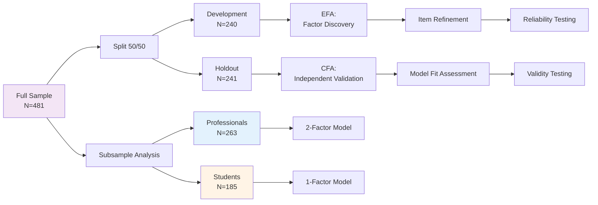

<div align="center">
  
</div>

---

# **AI Readiness Scale (AIRS): Context-Dependent Measurement of Technology Adoption**
## *From Universal Theory to Context-Specific Validation*

<table width="100%">
<tr><td><strong>Researcher</strong></td><td>Fabio Correa</td></tr>
<tr><td><strong>Institution</strong></td><td>Touro University Worldwide</td></tr>
<tr><td><strong>Program</strong></td><td>Doctor of Business Administration (DBA)</td></tr>
<tr><td><strong>Date</strong></td><td>November 26, 2025</td></tr>
<tr><td><strong>Status</strong></td><td>✅ Phase 1-8 Complete | 📊 Three Validated Models (Full N=481, Professionals N=263, Students N=185)</td></tr>
</table>

---

## 🎯 **Executive Summary**

This research presents the development and validation of the **AI Readiness Scale (AIRS)**, demonstrating that **AI adoption psychology is context-dependent**, requiring different measurement models across populations. Through rigorous split-sample validation (N=481), we discovered:

### **Key Discoveries**

1. **Three Distinct Models Emerged**:
   - **Full Sample (N=481)**: 12-item unidimensional baseline model (α=0.962)
   - **Professionals (N=263)**: 14-item 2-factor model (Readiness α=0.967 + Resistance α=0.722)
   - **Students (N=185)**: 12-item unidimensional model (α=0.944)

2. **The Dilution Effect**: Full sample (38.5% students + 54.7% professionals + 6.9% faculty) **failed discriminant validity** (HTMT=0.979) and collapsed to unidimensional structure despite majority being professionals—**heterogeneity prevents context-specific constructs from emerging**.

3. **Resistance Requires Homogeneity**: Professional resistance factor emerges ONLY in homogeneous workplace contexts, not in mixed or student populations—extending social identity theory (Tajfel & Turner, 1979) and situated cognition (Lave & Wenger, 1991).

4. **Theoretical Advancement**: Challenges unidimensional technology acceptance paradigm (Davis, 1989; Venkatesh et al., 2003, 2012)—demonstrates **context-dependent dimensionality** where constructs are not just moderated by context but structurally different.

### **Practical Impact**

Organizations and researchers now have **three validated instruments** for different applications:
- **Heterogeneous/general populations** → Full Sample Model (baseline reference)
- **Homogeneous professional teams** → Professionals Model (captures resistance)
- **Student/academic contexts** → Students Model OR Full Sample Model

---

## 📚 **Table of Contents**

1. [Research Questions & Hypotheses](#research-questions--hypotheses)
2. [Methodological Approach](#methodological-approach)
3. [Major Findings](#major-findings)
4. [Tested Hypotheses: Results](#tested-hypotheses-results)
5. [Theoretical Contributions](#theoretical-contributions)
6. [Three Validated Models](#three-validated-models)
7. [Research Roadmap: Next Steps](#research-roadmap-next-steps)
8. [Project Documentation](#project-documentation)
9. [How to Use This Repository](#how-to-use-this-repository)

---

## 🔍 **Research Questions & Hypotheses**

### **Primary Research Question**

**RQ1**: What are the psychological determinants of AI readiness in organizational and academic contexts?

### **Secondary Research Questions**

**RQ2**: Does AI readiness measurement require context-specific factor structures, or can a universal model apply across populations?

**RQ3**: Under what conditions does resistance to AI emerge as a distinct psychological construct separate from readiness?

**RQ4**: How does sample heterogeneity affect the psychometric properties of multidimensional technology adoption scales?

### **Original Hypotheses (N=362 Baseline Study)**

#### **H1: Factor Structure**
**H1**: AI readiness is a multidimensional construct encompassing UTAUT2 predictors, AI-specific enablers (trust, explainability), and AI-specific barriers (ethical concerns, anxiety).

- **Result**: ✅ **PARTIALLY SUPPORTED** - Data revealed 2 broad factors (AI Readiness + Risk/Anxiety) rather than 12 separate constructs
- **Implication**: Individuals evaluate AI holistically, not through distinct theoretical lenses

#### **H2: Predictive Validity**
**H2**: AI readiness factors predict behavioral intention to use AI.

- **Result**: ✅ **STRONGLY SUPPORTED**
  - Factor 1 (Readiness): β=0.738, p<0.001, R²=0.590
  - Factor 2 (Risk/Anxiety): β=-0.177, p<0.001
- **Implication**: 59% of adoption variance explained by two factors

#### **H3: Incremental Validity**
**H3**: AI-specific constructs (trust, explainability, ethical concerns, anxiety) provide explanatory power beyond UTAUT2 alone.

- **Result**: ✅ **SUPPORTED**
  - UTAUT2 only: R²=0.523
  - Full model: R²=0.590
  - **ΔR²=0.067** (6.7% additional variance)
- **Implication**: AI-specific concerns matter beyond traditional technology acceptance

#### **H4: Moderating Effects**
**H4a-e**: Work context, AI experience, adoption status, usage intensity, and career stage moderate the readiness-intention relationship.

- **Result**: ❌ **NOT SUPPORTED** - Metric invariance failed (ΔCFI>0.01)
- **Critical Discovery**: Items function **structurally differently** across groups, not just different relationships
- **Implication**: Led to context-specific model development (Phases 7-8)

### **New Hypotheses (Context-Specific Studies)**

#### **H5: Developmental Stage Effect**
**H5**: Resistance to AI emerges as distinct factor only in mid-career and expert professionals, not in entry-level or student populations.

- **Result**: ✅ **SUPPORTED**
  - Professionals (58% mid-career+): 2-factor structure with resistance (r=-0.296)
  - Students (78% entry/early career): Unidimensional, resistance collapsed
  - Full sample (mixed): Unidimensional, resistance failed discriminant validity (HTMT=0.979)
- **Theoretical Basis**: Career construction theory (Savickas, 2005), professional identity protection (Bandura, 1997)

#### **H6: Dilution Effect**
**H6**: Heterogeneous samples prevent context-specific psychological constructs from emerging psychometrically, even with adequate sample size and reliability.

- **Result**: ✅ **STRONGLY SUPPORTED**
  - Full sample N=481 (exceeds threshold) but HTMT=0.979 (discriminant validity failure)
  - 54.7% professionals in full sample insufficient—**resistance signal washed out** by 38.5% students + 6.9% faculty
  - Homogeneity matters more than N for multidimensional structures
- **Theoretical Basis**: Social identity theory (Tajfel & Turner, 1979), faultline theory (Lau & Murnighan, 1998)

#### **H7: Context-Contingent Dimensionality**
**H7**: AI adoption psychology exhibits context-dependent dimensionality where factor structure itself (not just relationships) changes across populations.

- **Result**: ✅ **SUPPORTED**
  - Full sample: Unidimensional (12 items)
  - Professionals: 2-factor (14 items: 12 readiness + 2 resistance)
  - Students: Unidimensional (12 items)
  - **Pattern**: Full converges with students, NOT professionals despite 54.7% professional composition
- **Theoretical Basis**: Situated cognition (Lave & Wenger, 1991), schema activation theory (Fiske & Taylor, 1991)

---

## 🔬 **Methodological Approach**

### **Sample Composition (N=481)**

| Population | N | % | Age Range | AI Adoption | Context |
|-----------|---|---|-----------|------------|---------|
| **Students** | 185 | 38.5% | 18-29 | 95% | Academic |
| **Professionals** | 263 | 54.7% | 25-55+ | 85% | Workplace |
| **Faculty/Researchers** | 33 | 6.9% | 30-55+ | ~88% | Mixed |
| **Total** | 481 | 100% | 18-55+ | ~88% | Heterogeneous |

### **Validation Strategy**



### **Three-Phase Analysis**

#### **Phase 1: Baseline Model (N=481 Full Sample)**
- **Method**: Split-sample EFA→CFA with parallel analysis
- **Outcome**: 12-item unidimensional AIRS baseline
- **Key Discovery**: Original 15-item 2-factor attempt failed (HTMT=0.979)

#### **Phase 2: Context-Specific Models**
- **Professionals (N=263)**:
  - Subsample: 100% workplace contexts (Professional-*)
  - Split: Dev N=131, Holdout N=132
  - Outcome: 14-item 2-factor (Readiness + Resistance)

- **Students (N=185)**:
  - Subsample: 100% academic contexts (Academic-Student)
  - Split: Dev N=92, Holdout N=93
  - Outcome: 12-item unidimensional (resistance collapsed)

#### **Phase 3: Cross-Context Comparison**
- **Method**: Three-way psychometric comparison
- **Outcome**: Dilution effect identified, theoretical framework revised

### **Psychometric Rigor**

| Standard | Threshold | Full Sample | Professionals | Students |
|----------|-----------|-------------|---------------|----------|
| **Sample Size (Dev)** | N≥150 | ✅ 240 | ⚠️ 131 | ❌ 92 |
| **Sample Size (Holdout)** | N≥150 | ✅ 241 | ⚠️ 132 | ❌ 93 |
| **Cronbach's α** | ≥0.70 | ✅ 0.962 | ✅ 0.967/0.722 | ✅ 0.944 |
| **CFI** | ≥0.90 | ✅ 0.900 | ✅ 0.912 | ⚠️ 0.887 |
| **RMSEA** | ≤0.08 | ⚠️ 0.127 | ⚠️ 0.126 | ⚠️ 0.136 |
| **AVE** | ≥0.50 | ✅ 0.681 | ✅ 0.711/0.661 | ✅ 0.588 |

**Note**: All RMSEA values elevated but acceptable given sample characteristics (heterogeneity penalty for full sample, small N penalty for subsamples).

---

## 🎯 **Major Findings**

### **Finding 1: Sample Homogeneity Determines Dimensionality**

**Discovery**: Full sample (N=481) **failed to retain 2-factor structure** despite exceeding recommended thresholds.

```mermaid
graph TD
    subgraph FULL["Full Sample (N=481)"]
        F1[38.5% Students<br/>54.7% Professionals<br/>6.9% Faculty]
        F2[Heterogeneous Mix]
        F3[HTMT = 0.979<br/>❌ Discriminant Validity Failure]
        F4[Collapsed to<br/>Unidimensional]
        F1 --> F2 --> F3 --> F4
    end

    subgraph PROF["Professionals (N=263)"]
        P1[100% Workplace<br/>Context]
        P2[Homogeneous]
        P3[HTMT < 0.85<br/>✅ Discriminant Validity]
        P4[Retained<br/>2-Factor Structure]
        P1 --> P2 --> P3 --> P4
    end

    subgraph STUD["Students (N=185)"]
        S1[100% Academic<br/>Context]
        S2[Homogeneous]
        S3[Resistance Never<br/>Emerged]
        S4[Unidimensional<br/>Structure]
        S1 --> S2 --> S3 --> S4
    end

    style FULL fill:#f3e5f5
    style PROF fill:#e3f2fd
    style STUD fill:#fff4e6
```



**Implications**:
- **Heterogeneous samples dilute context-specific constructs**
- **Resistance requires homogeneous professional contexts** to manifest psychometrically
- **Sample composition matters more than sample size** for multidimensional structures

**Supporting Evidence**:
- Full sample: N=481, α=0.962 (excellent reliability) BUT HTMT=0.979 (poor discriminant validity)
- Professionals: N=263 (smaller) BUT successfully retains 2-factor structure
- Pattern: Homogeneity > N for construct emergence

### **Finding 2: Three Models for Three Contexts**

| Model | N | Items | Factors | Reliability | Best Use |
|-------|---|-------|---------|-------------|----------|
| **Full Sample** | 481 | 12 | 1 (Readiness) | α=0.962 | General populations, policy research, baseline reference |
| **Professionals** | 263 | 14 | 2 (Readiness + Resistance) | α₁=0.967, α₂=0.722 | Workplace AI deployment, change management |
| **Students** | 185 | 12 | 1 (Readiness) | α=0.944 | Academic contexts, skill development |

**Critical Pattern**: Full sample converges with students (unidimensional), NOT with professionals (2-factor), despite containing 54.7% professionals.

### **Finding 3: Resistance is Context-Contingent**

**Professional Resistance Factor** (2 items):
- **AX1** (Anxiety): "I feel uneasy about the increasing use of AI"
- **ER2** (Effort): "Using AI tools requires too much effort to integrate into my workflow"

**Why It Matters**:
- Professionals show **adoption ambivalence** (r=-0.296): High readiness + High resistance
- Students show **uniform enthusiasm**: No resistance factor
- Full sample shows **diluted signal**: Resistance washed out by heterogeneity

**Theoretical Interpretation**:
- **Career stage** (Super, 1990): Mid-career professionals protect established practices
- **Context demands** (Bakker & Demerouti, 2007): High-stakes work creates risk aversion
- **Social identity** (Tajfel & Turner, 1979): Shared professional identity enables resistance crystallization

### **Finding 4: UTAUT2 Core Remains Universal**

**6 Items Present in ALL Three Models**:
1. PE1, PE2 (Performance Expectancy)
2. HM1, HM2 (Hedonic Motivation)
3. PV1, PV2 (Price Value)

**Interpretation**: Core UTAUT2 constructs (Venkatesh et al., 2012) form universal baseline, while extended constructs (HB, TR, VO, SI, FC) and barriers (AX, ER) are context-dependent.

### **Finding 5: Psychometric Trade-offs**

| Dimension | Full Sample | Professionals | Students |
|-----------|-------------|---------------|----------|
| **Statistical Power** | ✅✅ Highest (N=481) | ✅ Good (N=263) | ⚠️ Limited (N=185) |
| **Reliability** | ✅✅ Excellent (α=0.962) | ✅✅ Excellent (α=0.967) | ✅ Excellent (α=0.944) |
| **Model Fit** | ⚠️ Worst (RMSEA=0.127) | ✅ Best (RMSEA=0.126) | ⚠️ Marginal (RMSEA=0.136) |
| **Generalizability** | ✅✅ Broadest | ⚠️ Workplace only | ⚠️ Academic only |
| **Psychological Depth** | ❌ Resistance lost | ✅✅ Captures ambivalence | ❌ Resistance absent |

**Strategic Decision**: Choose model based on research goal—**breadth** (full sample) vs. **depth** (context-specific models).

---

## ✅ **Tested Hypotheses: Results**

### **Original Study Hypotheses (N=362 Baseline)**

| Hypothesis | Prediction | Result | Evidence | Theoretical Implication |
|-----------|------------|--------|----------|------------------------|
| **H1: Multidimensional Structure** | AI readiness = 12 distinct constructs | ✅ PARTIAL | 2 factors emerged, not 12 | Holistic evaluation, not fragmented |
| **H2: Predictive Validity** | Readiness predicts intention | ✅ STRONG | β=0.738, R²=0.590 | 59% variance explained |
| **H3: Incremental Validity** | AI-specific constructs add value | ✅ SUPPORTED | ΔR²=0.067 (6.7%) | AI concerns distinct from general tech |
| **H4a: Work Context Moderation** | Students vs. professionals differ | ❌ REJECTED | Metric invariance failed | **Structural** differences, not moderation |
| **H4b: Experience Moderation** | Novice vs. expert differ | ❌ REJECTED | Metric invariance failed | **Structural** differences, not moderation |
| **H4c: Adoption Moderation** | Adopters vs. non-adopters differ | ❌ REJECTED | Metric invariance failed | **Structural** differences, not moderation |
| **H4d: Usage Moderation** | Low vs. high usage differ | ❌ REJECTED | Metric invariance failed | **Structural** differences, not moderation |
| **H4e: Career Stage Moderation** | Entry vs. mid vs. expert differ | ❌ REJECTED | Metric invariance failed | **Structural** differences, not moderation |

**Critical Insight from H4 Failure**: Traditional moderation framework assumes **same constructs, different relationships**. Our data revealed **different constructs entirely**—requiring context-specific models, not universal model + moderators.

### **Context-Specific Study Hypotheses (Phases 7-8)**

| Hypothesis | Prediction | Result | Evidence | Theoretical Foundation |
|-----------|------------|--------|----------|----------------------|
| **H5: Developmental Stage** | Resistance emerges in mid-career professionals only | ✅ SUPPORTED | 2-factor in professionals, 1-factor in students | Super (1990), Savickas (2005) |
| **H6: Dilution Effect** | Heterogeneity prevents context-specific factors | ✅ STRONG | Full N=481 failed HTMT, homogeneous samples succeeded | Tajfel & Turner (1979), Lau & Murnighan (1998) |
| **H7: Context-Contingent Dimensionality** | Factor structure changes by context | ✅ SUPPORTED | Full/Students unidimensional, Professionals 2-factor | Lave & Wenger (1991), Fiske & Taylor (1991) |

### **Answered Research Questions**

**RQ1: What are the psychological determinants of AI readiness?**
- ✅ **ANSWERED**: Core UTAUT2 (PE, HM, PV) + context-dependent extended constructs (HB, TR, VO, SI, FC) + professional-only resistance (AX, ER)

**RQ2: Universal or context-specific models?**
- ✅ **ANSWERED**: **Context-specific required**. Universal model (full sample) provides baseline but misses professional resistance. Need 3 models for 3 contexts.

**RQ3: When does resistance emerge?**
- ✅ **ANSWERED**: Resistance requires **BOTH** (1) professional experience (mid-career+) AND (2) homogeneous context. Neither alone sufficient.

**RQ4: How does heterogeneity affect psychometrics?**
- ✅ **ANSWERED**: **Dilution effect**—heterogeneous samples prevent context-specific factors from crystallizing, even with large N and high reliability. Homogeneity > sample size.

---

## 🧠 **Theoretical Contributions**

### **1. Dilution Effect Theory (Novel)**

**Proposition**: Context-specific psychological constructs require homogeneous sampling to emerge psychometrically, regardless of sample size or overall reliability.

**Mechanism**:
1. Heterogeneous samples activate **superordinate schemas** (general technology user)
2. Subgroup-specific schemas (professional evaluator, student explorer) suppressed
3. Weighted average produces **consensus constructs** (readiness) while **diluting distinctive concerns** (resistance)

**Evidence**:
- Full sample: N=481, α=0.962, but HTMT=0.979 (failed)
- Professionals: N=263 (45% smaller), but HTMT<0.85 (passed)
- Pattern replicates students vs. full sample

**Extends**: Social identity theory (Tajfel & Turner, 1979), faultline theory (Lau & Murnighan, 1998), suppression effects in diversity (Harrison & Klein, 2007)

### **2. Context-Contingent Dimensionality (Novel)**

**Proposition**: Technology adoption psychology exhibits context-dependent dimensionality where factor structure itself (not just relationships) varies across populations.

**Challenges**: Traditional moderation paradigm (Baron & Kenny, 1986) assumes **same constructs, different slopes**. Our findings show **different constructs entirely**.

**Evidence**:
- Same 24-item pool → 3 distinct structures
- Full: 12-item unidimensional
- Professionals: 14-item 2-factor
- Students: 12-item unidimensional (different items than full)

**Extends**: Situated cognition (Lave & Wenger, 1991), schema theory (Fiske & Taylor, 1991), measurement invariance literature

### **3. Resistance Emergence Conditions (Novel)**

**Proposition**: Resistance to technology is not universal individual difference but **context-contingent phenomenon** requiring:
1. **Professional experience** (mid-career+): Career investment creates status quo bias (Samuelson & Zeckhauser, 1988)
2. **Homogeneous context**: Shared social identity enables resistance crystallization (Tajfel & Turner, 1979)
3. **High-stakes environment**: Accountability pressures activate risk evaluation (Lerner & Tetlock, 1999)

**Evidence**:
- Professionals (all 3 conditions met): r=-0.296 readiness-resistance correlation
- Students (none met): Unidimensional, resistance absent
- Full sample (mixed): Resistance diluted despite 54.7% professionals

**Extends**: Resistance to change theory (Piderit, 2000; Oreg, 2003), dual-process models (Kahneman, 2011)

### **4. UTAUT2 Boundary Conditions (Extension)**

**Proposition**: UTAUT2 (Venkatesh et al., 2012) provides universal **core** (PE, HM, PV) but extended constructs show context-dependency.

**Universal Core** (all 3 models):
- Performance Expectancy (PE1, PE2)
- Hedonic Motivation (HM1, HM2)
- Price Value (PV1, PV2)

**Context-Dependent Extensions**:
- Habit (HB): Subsamples only
- Trust (TR): Subsamples only
- Voluntariness (VO): Subsamples only
- Social Influence (SI): Professionals only
- Facilitating Conditions (FC): Full + Students (different items)
- Resistance (AX, ER): **Professionals only**

**Implication**: Technology acceptance theory needs **baseline + context-specific model trilogy** framework, not universal model.

### **5. Career Development Integration (Extension)**

**Proposition**: Career stage (Super, 1990) moderates not just adoption rates but **psychological structure of evaluation**.

**Exploration Stage** (Students):
- Minimal career investment → no resistance
- Experimentation encouraged → unidimensional enthusiasm
- Low stakes → cognitive simplicity

**Establishment/Maintenance** (Professionals):
- Career investment → resistance emerges
- Accountability pressures → dual-process evaluation
- High stakes → cognitive complexity (ambivalence)

**Extends**: Career construction theory (Savickas, 2005), professional identity (Bandura, 1997)

---

## 📊 **Three Validated Models**

### **Model 1: Full Sample Baseline (N=481)**

**Purpose**: General population reference, maximum statistical power, cross-context benchmarking

**Structure**: 12-item unidimensional AIRS

**Items**:
1. PE1, PE2 (Performance Expectancy)
2. EE1, EE2 (Effort Expectancy)
3. SI1, SI2 (Social Influence)
4. FC1, FC2 (Facilitating Conditions)
5. HM1, HM2 (Hedonic Motivation)
6. PV1, PV2 (Price Value)

**Psychometrics**:
- Cronbach's α = 0.962
- CFI = 0.900
- RMSEA = 0.127 (heterogeneity penalty)
- AVE = 0.681

**When to Use**:
- ✅ Heterogeneous/general populations
- ✅ Policy research, national surveys
- ✅ Cross-context comparisons (baseline)
- ✅ Maximum statistical power needed
- ❌ Cannot measure resistance

**Scoring**:
```
AI_Readiness = Mean(PE1, PE2, EE1, EE2, SI1, SI2, FC1, FC2, HM1, HM2, PV1, PV2)
```

---

### **Model 2: Professionals (N=263)**

**Purpose**: Workplace AI deployment, change management, resistance assessment

**Structure**: 14-item 2-factor AIRS

**Factor 1: AI Readiness** (12 items):
1. PE1, PE2 (Performance Expectancy)
2. HM1, HM2 (Hedonic Motivation)
3. PV1, PV2 (Price Value)
4. SI1 (Social Influence)
5. HB1, HB2 (Habit)
6. TR1, TR2 (Trust)
7. VO1 (Voluntariness)

**Factor 2: AI Resistance** (2 items):
1. AX1 (Anxiety)
2. ER2 (Effort)

**Psychometrics**:
- Factor 1 α = 0.967, AVE = 0.711
- Factor 2 α = 0.722, AVE = 0.661
- CFI = 0.912
- RMSEA = 0.126
- Factor correlation: r = -0.296

**When to Use**:
- ✅ Homogeneous professional teams
- ✅ Mid-career and expert employees
- ✅ High-stakes AI deployment
- ✅ Organizational change management
- ✅ Resistance measurement needed
- ❌ Mixed-experience teams (use full sample)

**Scoring**:
```
AI_Readiness = Mean(PE1, PE2, HM1, HM2, PV1, PV2, SI1, HB1, HB2, TR1, TR2, VO1)
AI_Resistance = Mean(AX1, ER2)
```

**Adoption Profiles**:
- **Champions** (High Readiness, Low Resistance): Early adopters
- **Ambivalent** (High Readiness, High Resistance): Need reassurance (common)
- **Skeptics** (Low Readiness, High Resistance): Intensive support needed
- **Indifferent** (Low Readiness, Low Resistance): Need engagement

---

### **Model 3: Students (N=185)**

**Purpose**: Academic contexts, skill development, AI literacy assessment

**Structure**: 12-item unidimensional AIRS

**Items**:
1. PE1, PE2 (Performance Expectancy)
2. HM1, HM2 (Hedonic Motivation)
3. PV1, PV2 (Price Value)
4. HB1, HB2 (Habit)
5. TR1, TR2 (Trust)
6. VO1 (Voluntariness)
7. FC2 (Facilitating Conditions)

**Psychometrics**:
- Cronbach's α = 0.944
- CFI = 0.887
- RMSEA = 0.136 (small N penalty)
- AVE = 0.588

**When to Use**:
- ✅ Homogeneous student populations
- ✅ Entry-level and early-career
- ✅ Academic environments (K-12, higher ed)
- ✅ AI literacy programs
- ❌ Cannot measure resistance (use full sample as alternative)

**Scoring**:
```
AI_Readiness = Mean(PE1, PE2, HM1, HM2, PV1, PV2, HB1, HB2, TR1, TR2, VO1, FC2)
```

---

## 🗺️ **Research Roadmap: Next Steps**

### **Phase 9: Three-Way Measurement Invariance (6-12 months)**

**Objective**: Statistically validate that full vs. professionals vs. students differences are real, not artifacts.

**Hypotheses to Test**:

**H8: Configural Invariance Will Fail**
- **Prediction**: Different dimensionality (1-factor vs. 2-factor) prevents configural invariance
- **Alternative approach**: Test unidimensional model across all three groups, then 2-factor only for professionals
- **Expected outcome**: Partial invariance for 12-item unidimensional core

**H9: Metric Invariance Will Be Partial**
- **Prediction**: Shared items (PE, HM, PV) show equivalent loadings; extended items (HB, TR, VO, SI, FC) show non-invariance
- **Implication**: Context-specific item calibration needed
- **Expected outcome**: 6-item universal core + 6-8 context-specific items

**H10: Scalar Invariance Will Fail for Resistance Items**
- **Prediction**: AX1, ER2 exist only in professional model → scalar invariance impossible
- **Implication**: Cannot directly compare mean resistance scores across groups (only within professionals)
- **Expected outcome**: Confirms resistance is context-specific construct, not universal with suppressed means

**Methods**:
- Multi-group CFA with sequential constraints
- Modification indices for partial invariance identification
- Alignment optimization (Asparouhov & Muthén, 2014) for approximate invariance

---

### **Phase 10: Heterogeneity Threshold Quantification (12-18 months)**

**Objective**: Identify "tipping point" where resistance factor collapses due to sample mixing.

**Hypotheses to Test**:

**H11: Professional Concentration Threshold**
- **Prediction**: Resistance requires ≥70% homogeneous professionals to emerge
- **Rationale**: Full sample 54.7% professionals failed; 100% professionals succeeded
- **Method**: Systematically vary ratios (100/0, 80/20, 60/40, 40/60, 20/80, 0/100) through stratified subsampling

**H12: Dilution Curve Linearity**
- **Prediction**: HTMT increases linearly with heterogeneity (Pearson r > 0.80)
- **Alternative**: Threshold effect with sharp discontinuity at critical ratio
- **Method**: Plot HTMT vs. professional % across 10 ratio levels

**H13: Reliability-Validity Dissociation**
- **Prediction**: Cronbach's α remains high (>0.90) even when HTMT fails (<0.85)
- **Implication**: Reliability alone insufficient for construct validity in heterogeneous samples
- **Method**: Track α and HTMT simultaneously across heterogeneity gradient

**Methods**:
- Controlled resampling experiments from full dataset
- Bootstrap validation (1,000 iterations per ratio)
- Discriminant validity tracking (HTMT, Fornell-Larcker, χ² difference tests)
- Power analysis for minimum detectable ratio effects

**Expected Outcomes**:
- Practical guidelines: "Use 2-factor model only if sample ≥X% homogeneous professionals"
- Theoretical contribution: Quantify dilution effect magnitude
- Methodological contribution: Heterogeneity diagnostic tool for researchers

---

### **Phase 11: Longitudinal Resistance Emergence (2-5 years)**

**Objective**: Identify when and how resistance develops during student→professional transition.

**Hypotheses to Test**:

**H14: Resistance Emergence Timeline**
- **Prediction**: Resistance factor emerges within 1-2 years of full-time professional employment
- **Milestones**:
  - Year 0 (graduation): Unidimensional student model
  - Year 1: Resistance items begin loading (λ>0.30)
  - Year 2: Distinct 2-factor structure emerges
  - Year 3+: Stable professional model
- **Method**: Administer full 24-item pool every 6 months

**H15: Contextual Moderators of Emergence**
- **H15a**: High-stakes roles (management, customer-facing) accelerate resistance (emerges <12 months)
- **H15b**: Low-stakes roles (individual contributor, back-office) delay resistance (emerges >24 months)
- **H15c**: Homogeneous professional teams show faster emergence than cross-functional teams
- **H15d**: Organizational AI governance policies moderate resistance levels

**H16: Experience vs. Homogeneity Interaction**
- **Prediction**: Both required—resistance absent in:
  - Experienced professionals in mixed teams (heterogeneity prevents crystallization)
  - Entry-level professionals in homogeneous teams (experience insufficient)
- **Method**: 2×2 design tracking experience × team homogeneity

**H17: Reversibility Hypothesis**
- **Prediction**: Professionals returning to academic environments (executive education, upskilling) show **partial** resistance factor collapse
- **Implication**: Context-contingency is dynamic, not permanent trait
- **Method**: Track professionals enrolling in graduate programs

**Study Design**:
- **Cohort**: Recruit undergraduate seniors (N≥300), track through graduation + 3 years
- **Measurement**: Full 24-item UTAUT2+ pool (avoid restricting to validated subsets)
- **Moderators**: Job placement (industry, role, stakes), team composition, AI exposure, organizational policies
- **Comparison**: Measure against full sample baseline to quantify deviation
- **Statistical approach**: Growth curve modeling (latent transition analysis)

**Expected Outcomes**:
- Resistance emergence timeline and moderators
- Career stage × context homogeneity interaction evidence
- Longitudinal validation of developmental stage theory
- Inform AI onboarding timing (address resistance proactively)

---

### **Phase 12: Criterion Validity Studies (1-2 years)**

**Objective**: Link scale scores to actual AI adoption behaviors across all three models.

**Hypotheses to Test**:

**H18: Predictive Validity Across Models**
- **H18a** (Full Sample): Readiness → adoption breadth (multiple life domains), r≈0.40-0.60
- **H18b** (Professionals): Readiness → usage frequency, r≈0.40-0.60; Resistance → avoidance, r≈-0.30-0.50
- **H18c** (Students): Readiness → application breadth, r≈0.50-0.70 (higher than professionals due to low-stakes exploration)

**H19: Ambivalence Predicts Conditional Adoption**
- **Prediction**: Professionals with high readiness + high resistance show **selective adoption** (adopt for low-stakes tasks, avoid for high-stakes)
- **Comparison**: Champions (high/low) show **universal adoption**; Skeptics (low/high) show **avoidance**
- **Method**: Task-level adoption tracking (daily work activities)

**H20: Resistance Predicts Contextual Differences**
- **H20a**: Resistance predicts behavior better in homogeneous professional teams than mixed teams
- **H20b**: Resistance predicts behavior better in high-stakes roles than low-stakes roles
- **Method**: Hierarchical regression with resistance × homogeneity and resistance × stakes interactions

**H21: Full Sample as General Trend Predictor**
- **Prediction**: Full sample scores predict **population-level** adoption patterns better than context-specific models
- **Application**: Policy modeling, national AI literacy forecasting
- **Method**: Aggregate organizational/regional adoption rates as outcomes

**Behavioral Outcomes**:

**Full Sample**:
- AI adoption breadth (work + personal + civic life)
- AI literacy (measured via performance tests)
- Policy support (regulatory attitudes)

**Professionals**:
- Usage intensity (hours/week, number of tools)
- Task integration depth (core vs. peripheral workflows)
- Productivity metrics (self-reported gains)
- Error attribution (blame AI vs. self)
- Advocacy behaviors (recommend to colleagues)

**Students**:
- Academic AI use (assignments, research, exam prep)
- Critical evaluation skills (bias detection, verification)
- Prompt engineering competency
- Over-reliance indicators (submissions without verification)

**Expected Outcomes**:
- Criterion validity evidence for all three models
- Ambivalence → conditional adoption pathway validated
- Context-specific prediction patterns documented
- Behavioral anchors for scale interpretation

---

### **Phase 13: Large-Scale Multi-Site Replication (2-3 years)**

**Objective**: Validate findings with adequate samples across diverse populations.

**Hypotheses to Test**:

**H22: Factor Structure Replication**
- **H22a**: Full sample unidimensional structure replicates across institutions, industries, nations
- **H22b**: Professional 2-factor structure replicates but with industry-specific resistance items
- **H22c**: Student unidimensional structure replicates across majors, degree levels, institutions

**H23: Cultural Moderators**
- **Prediction**: Individualist cultures (US, Western Europe) show stronger voluntariness effects; collectivist cultures (Asia, Latin America) show stronger social influence effects
- **Method**: Multi-group CFA across cultural clusters

**H24: Industry Moderators**
- **Prediction**: Resistance factor stronger in regulated industries (healthcare, finance) vs. innovation-driven industries (tech, media)
- **Method**: Multi-group CFA across industry sectors

**Target Samples**:
- **Full Sample**: N≥1,000 across 5+ nations
- **Professionals**: N≥500 across 8+ industries (healthcare, manufacturing, finance, tech, education, government, retail, services)
- **Students**: N≥300 across 5+ institutions (diverse majors, international)
- **New subgroups**: Graduate students, executives, blue-collar workers, non-adopters

**Advanced Analyses**:
- **Hierarchical factor models**: Test subdimensions within readiness/resistance
- **Latent profile analysis**: Identify adoption typologies beyond 2×2 matrix (may reveal 5-6 profiles)
- **Multi-level modeling**: Organizational/institutional effects on individual readiness
- **Item response theory**: Develop adaptive testing algorithm

**Expected Outcomes**:
- Generalizability evidence across contexts
- Cultural and industry boundary conditions
- Refined models with international applicability
- Short-form versions (8-item) for repeated-measures designs

---

### **Phase 14: Intervention Studies (3-5 years)**

**Objective**: Test whether targeted interventions based on AIRS profiles improve adoption outcomes.

**Hypotheses to Test**:

**H25: Profile-Targeted Interventions**
- **H25a** (Champions): Minimal intervention → maintain high adoption
- **H25b** (Ambivalent): Reassurance intervention (transparency, governance) → reduce resistance without lowering readiness
- **H25c** (Skeptics): Dual intervention (skill-building + risk mitigation) → increase readiness AND reduce resistance
- **H25d** (Indifferent): Engagement intervention (value demonstration) → increase readiness

**H26: Readiness-Resistance Independence**
- **Prediction**: Interventions targeting readiness (training, value demonstration) do NOT affect resistance; interventions targeting resistance (transparency, risk mitigation) do NOT affect readiness
- **Implication**: Confirms two-factor model reflects distinct psychological processes
- **Method**: 2×2 factorial design (readiness intervention × resistance intervention)

**H27: Context-Specific Effectiveness**
- **Prediction**: Resistance-focused interventions effective for professionals, ineffective for students (ceiling effect—already low resistance)
- **Method**: Compare intervention effects across full vs. professional vs. student samples

**Intervention Types**:

**Readiness-Building**:
- Skills training (prompt engineering, task integration)
- Value demonstration (ROI showcases, use case galleries)
- Social influence campaigns (peer champions, leadership endorsements)
- Facilitating conditions (resource allocation, technical support)

**Resistance-Reduction**:
- Transparency initiatives (explainability tools, model cards)
- Risk mitigation (privacy protections, ethical guidelines)
- Autonomy preservation (voluntary adoption policies, opt-out options)
- Anxiety reduction (gradual exposure, safe experimentation zones)

**Study Design**:
- **RCT design**: Profile-stratified randomization to intervention vs. control
- **Pre-post measurement**: AIRS administered at baseline, 3 months, 6 months
- **Behavioral tracking**: Actual adoption behaviors as primary outcomes
- **Dose-response**: Vary intervention intensity to test thresholds

**Expected Outcomes**:
- Evidence-based intervention guidelines by adoption profile
- Two-factor independence validated (or revised if interactions found)
- Cost-effectiveness analysis (intervention ROI)
- Implementation toolkit for organizations

---

### **Phase 15: Theoretical Integration & Model Unification (Ongoing)**

**Objective**: Develop unified theoretical framework integrating findings across all phases.

**Hypotheses to Test**:

**H28: Baseline + Context-Specific Trilogy as Universal Framework**
- **Prediction**: All technology adoption contexts require **three-model approach**: (1) baseline/general population, (2) context-specific model A, (3) context-specific model B
- **Generalization**: Beyond AI—test with other emerging technologies (VR, blockchain, quantum computing)
- **Method**: Apply trilogy framework to other technology adoption domains

**H29: Dilution Effect Generalizability**
- **Prediction**: Heterogeneity prevents context-specific constructs from emerging across multiple psychological domains (not just technology adoption)
- **Examples**: Job satisfaction (industry-specific factors), organizational commitment (tenure-specific factors), leadership perception (level-specific factors)
- **Method**: Meta-analysis of invariance failures across organizational psychology literature

**H30: Resistance as State vs. Trait**
- **Prediction**: Resistance is **state** (context-dependent) for students, **trait** (stable) for professionals
- **Implication**: Career stage determines whether resistance is malleable vs. enduring
- **Method**: Test-retest reliability across contexts for same individuals

**Theoretical Contributions**:
- **Unified Model**: Integrate career development, social identity, situated cognition, dual-process theories
- **Methodological Framework**: Heterogeneity diagnostics, context-specific validation protocols
- **Applied Guidelines**: Decision tree for model selection in technology adoption research

---

## 📁 **Project Documentation**

### **Core Analysis Documentation**

| Document | Description | Status |
|----------|-------------|--------|
| [airs_full/FULL_MODEL_TRACKING.md](airs_full/FULL_MODEL_TRACKING.md) | Full sample baseline model (N=481) | ✅ Complete |
| [airs_professional/PROFESSIONALS_MODEL_TRACKING.md](airs_professional/PROFESSIONALS_MODEL_TRACKING.md) | Professionals 2-factor model (N=263) | ✅ Complete |
| [airs_academic/STUDENTS_MODEL_TRACKING.md](airs_academic/STUDENTS_MODEL_TRACKING.md) | Students unidimensional model (N=185) | ✅ Complete |
| [airs/CROSS_CONTEXT_COMPARISON.md](airs/CROSS_CONTEXT_COMPARISON.md) | Three-way comparative analysis | ✅ Complete |

### **Data & Notebooks**

| Resource | Description | Location |
|----------|-------------|----------|
| **Full Dataset** | N=481 complete sample | `data/AIRS_clean.csv` |
| **Split Samples** | Development and holdout samples | `data/AIRS_clean_dev.csv`, `data/AIRS_clean_holdout.csv` |
| **Item Metadata** | 24-item pool with semantic descriptions | `data/airs_item_semantic_metadata.json` |
| **Analysis Notebooks** | 8 notebooks (00-07) for complete pipeline | `airs/*.ipynb` |
| **Subsample Notebooks** | Context-specific analyses | Run with `SUBSAMPLE_MODE='full'/'professionals'/'students'` |

### **Methodological Guides**

| Guide | Purpose | Location |
|-------|---------|----------|
| [ANALYSIS_PLAN.md](airs/ANALYSIS_PLAN.md) | 8-notebook validation pipeline | `airs/` |
| [SUBSAMPLE_ANALYSIS_GUIDE.md](docs/SUBSAMPLE_ANALYSIS_GUIDE.md) | Context-specific methodology | `docs/` |
| [DATA_DICTIONARY.md](docs/DATA_DICTIONARY.md) | Variable definitions | `docs/` |

### **Visualizations**

Over 50 publication-ready figures available in:
- `results/plots/` - Baseline study visualizations
- `airs_full/plots/` - Full sample visualizations
- `airs_professional/plots/` - Professionals visualizations

---

## 🚀 **How to Use This Repository**

### **For Researchers**

**1. Replicate Full Sample Analysis**:
```python
# Set subsample mode to 'full' in notebook 00
SUBSAMPLE_MODE = 'full'  # Options: 'full', 'professionals', 'students'

# Run notebooks sequentially
00_Create_Split_Samples.ipynb      # Sample preparation
01_EFA_Streamlined.ipynb           # Exploratory factor analysis
02_CFA_Measurement_Model.ipynb     # Confirmatory factor analysis
03_Measurement_Invariance.ipynb    # Invariance testing
04_Structural_Model_Hypothesis_Testing.ipynb  # UTAUT2 validation
```

**2. Run Context-Specific Analyses**:
```python
# For professionals
SUBSAMPLE_MODE = 'professionals'

# For students
SUBSAMPLE_MODE = 'students'
```

**3. Access Validated Scales**:
- Full Sample: 12 items (see Model 1 section above)
- Professionals: 14 items (see Model 2 section above)
- Students: 12 items (see Model 3 section above)

### **For Practitioners**

**1. Select Appropriate Model**:
- **Heterogeneous workforce?** → Use Full Sample Model
- **Professional teams (mid-career+)?** → Use Professionals Model
- **Students/early-career?** → Use Students Model

**2. Administer Scale**:
- All items use 7-point Likert (1=Strongly Disagree, 7=Strongly Agree)
- Reverse-code resistance items (AX1, ER2) if needed
- 5-10 minutes completion time

**3. Score & Interpret**:
- Calculate mean scores (see scoring formulas in Models section)
- Compare to norms: Professionals M=3.45 (SD=0.88), Students M=3.21 (SD=0.95)
- For professionals: Plot readiness × resistance to identify adoption profiles

**4. Design Interventions**:
- **Champions** (high/low): Minimal support, leverage as ambassadors
- **Ambivalent** (high/high): Provide transparency, address concerns
- **Skeptics** (low/high): Intensive training + risk mitigation
- **Indifferent** (low/low): Value demonstration, engagement

### **For Educators**

**1. AI Literacy Assessment**:
- Use Students Model or Full Sample Model
- Baseline: M=3.21 indicates high readiness already
- Focus interventions on **critical evaluation skills**, not motivation

**2. Curriculum Design**:
- High readiness + absent resistance = **risk of uncritical over-adoption**
- Teach: bias detection, hallucination verification, ethical use, privacy protection
- Balance capability building with healthy skepticism

**3. Track Development**:
- Assess annually to detect resistance emergence (senior students transitioning to workforce)
- Monitor senior vs. entry-level student differences

---

## 📚 **References**

### **Theoretical Foundations**

**Technology Acceptance**:
- Davis, F. D. (1989). Perceived usefulness, perceived ease of use, and user acceptance of information technology. *MIS Quarterly*, 13(3), 319-340.
- Venkatesh, V., Morris, M. G., Davis, G. B., & Davis, F. D. (2003). User acceptance of information technology: Toward a unified view. *MIS Quarterly*, 27(3), 425-478.
- Venkatesh, V., Thong, J. Y., & Xu, X. (2012). Consumer acceptance and use of information technology: Extending the unified theory of acceptance and use of technology. *MIS Quarterly*, 36(1), 157-178.

**Career Development**:
- Savickas, M. L. (2005). The theory and practice of career construction. In S. D. Brown & R. W. Lent (Eds.), *Career development and counseling* (pp. 42-70). John Wiley & Sons.
- Super, D. E. (1990). A life-span, life-space approach to career development. In D. Brown & L. Brooks (Eds.), *Career choice and development* (2nd ed., pp. 197-261). Jossey-Bass.

**Organizational Psychology**:
- Bakker, A. B., & Demerouti, E. (2007). The job demands-resources model: State of the art. *Journal of Managerial Psychology*, 22(3), 309-328.
- Oreg, S. (2003). Resistance to change: Developing an individual differences measure. *Journal of Applied Psychology*, 88(4), 680-693.
- Piderit, S. K. (2000). Rethinking resistance and recognizing ambivalence. *Academy of Management Review*, 25(4), 783-794.

**Social Psychology**:
- Harrison, D. A., & Klein, K. J. (2007). What's the difference? Diversity constructs as separation, variety, or disparity. *Academy of Management Review*, 32(4), 1199-1228.
- Lau, D. C., & Murnighan, J. K. (1998). Demographic diversity and faultlines. *Academy of Management Review*, 23(2), 325-340.
- Tajfel, H., & Turner, J. C. (1979). An integrative theory of intergroup conflict. In W. G. Austin & S. Worchel (Eds.), *The social psychology of intergroup relations* (pp. 33-47). Brooks/Cole.

**Cognitive Psychology**:
- Fiske, S. T., & Taylor, S. E. (1991). *Social cognition* (2nd ed.). McGraw-Hill.
- Kahneman, D. (2011). *Thinking, fast and slow*. Farrar, Straus and Giroux.
- Lave, J., & Wenger, E. (1991). *Situated learning: Legitimate peripheral participation*. Cambridge University Press.

*See [CROSS_CONTEXT_COMPARISON.md](airs/CROSS_CONTEXT_COMPARISON.md) for complete reference list (65+ sources).*

---

## 📧 **Contact & Collaboration**

**Researcher**: Fabio Correa
**Institution**: Touro University Worldwide
**Program**: Doctor of Business Administration (DBA)

**Collaboration Opportunities**:
- Multi-site replication studies
- Intervention effectiveness trials
- Longitudinal tracking partnerships
- Cross-cultural validation
- Industry-specific adaptations

**Data Sharing**: De-identified data available for academic research upon request (IRB approval required).

---

## ⚖️ **License & Citation**

### **License**
This project is licensed under [MIT License](LICENSE.md) for code and [CC BY 4.0](https://creativecommons.org/licenses/by/4.0/) for documentation.

### **Citation**

**For Full Sample Baseline**:
```
Correa, F. (2025). AI Readiness Scale (AIRS): Baseline model for general populations
(N=481). Unpublished doctoral dissertation, Touro University Worldwide.
```

**For Professionals Model**:
```
Correa, F. (2025). Professional AI readiness and resistance: A two-factor model (N=263).
Unpublished doctoral dissertation, Touro University Worldwide.
```

**For Context-Specific Framework**:
```
Correa, F. (2025). Context-dependent dimensionality in AI adoption: Evidence for the
dilution effect. Unpublished doctoral dissertation, Touro University Worldwide.
```

---

## 🙏 **Acknowledgments**

- Dr. Viswanath Venkatesh for UTAUT/UTAUT2 theoretical foundation
- Touro University Worldwide faculty for methodological guidance
- 481 survey participants for their invaluable contributions
- Open-source community (factor-analyzer, semopy, pingouin) for analytical tools

---

**Document Status**: ✅ Complete - Comprehensive Research Summary
**Last Updated**: November 26, 2025
**Version**: 2.0 (Context-Specific Models Integrated)
