<div align="center">
  
</div>

---

# **Dissertation Progress Report**

<table width="100%">
<tr><td><strong>To</strong></td><td>Dr. Karina Kasztelnik (Dissertation Chair), Dr. Venkatesh (Research Mentor)</td></tr>
<tr><td><strong>CC</strong></td><td>Dr. Jerome Jones (Committee Member), Dr. Donna Day (Committee Member)</td></tr>
<tr><td><strong>From</strong></td><td>Fabio Correa</td></tr>
<tr><td><strong>Date</strong></td><td>November 22, 2025 (Week 24 of 32)</td></tr>
<tr><td><strong>Institution</strong></td><td>Touro University Worldwide</td></tr>
<tr><td><strong>Program</strong></td><td>Doctor of Business Administration (DBA)</td></tr>
</table>

---


## 📋 Executive Summary

**⚠️ Data Collection Status**: Currently at **N=362 of target N=500**. All results are preliminary pending final sample completion.

**Progress Report** (Week 24 of 32):

- ✅ **Phase 1-3 Complete**: 12-item scale developed, validated via split-sample CFA, and measurement invariance tested
- ✅ **Measurement Model**: Good fit achieved (CFI=0.952, TLI=0.941, RMSEA=0.080), 2-factor structure confirmed
- ✅ **Psychometric Quality**: F1 excellent (α=0.924, CR=0.923, AVE=0.554), F2 adequate (α=0.691, CR=0.765, AVE=0.640)
- ✅ **Invariance Testing**: Configural invariance supported (CFI 0.922-0.946); metric/scalar not supported (requires separate-group models for H4)
- ⏭️ **Next**: Phase 4 (Structural Models H1-H3) → Phase 5 (Mediation H5) → Phase 6 (Multi-Group H4)

**Research Foundation**: This study extends **Dr. Venkatesh's UTAUT2 framework** (Venkatesh et al., 2012) by integrating four AI-specific constructs to develop a diagnostic instrument for organizational AI readiness assessment.

**Detailed Results**: See `docs/AIRS_empirical_model_phase2_mermaid.md` for complete psychometric statistics and `airs/ANALYSIS_PLAN.md` for methodology.

### 🎯 Committee Highlights

**For Dr. Kasztelnik (Chair)**:
- ✅ On schedule (Week 24/32), Phases 1-3 complete with good measurement model fit and invariance testing
- ✅ Phase 3 Finding: Configural invariance supported; metric/scalar not supported (constructs function differently across contexts - theoretically meaningful)
- ⏭️ Next: Phase 4 structural modeling (H1-H3 hypothesis testing with nested model comparisons)
- 📊 Detailed statistics: `docs/AIRS_empirical_model_phase2_mermaid.md` and `airs/03_Measurement_Invariance.ipynb`

**For Dr. Venkatesh (Mentor)**:
- 🙏 Study extends your UTAUT2 framework with AI-specific constructs
- 🔄 Reintroduced Voluntariness of Use (from UTAUT 2003) for enterprise context
- 🔍 Key test ahead: Nested model comparison for incremental validity (H3: ΔR² ≥ 0.10)
- 💡 Novel contribution: Mediation pathways through trust and anxiety mechanisms

---

## 🎯 Theoretical Framework: Building on UTAUT2 Excellence

### Honoring the UTAUT2 Foundation

This dissertation builds directly on **Dr. Venkatesh's UTAUT2 framework** (Venkatesh et al., 2012), which synthesized decades of technology acceptance research into eight robust predictors of behavioral intention. UTAUT2 represents the gold standard for understanding technology adoption and has been cited over 18,000 times, validating its theoretical rigor and practical utility.

**UTAUT2 Core Constructs (8)**:

1. **Performance Expectancy (PE)**: Perceived productivity gains from AI use
2. **Effort Expectancy (EE)**: Perceived ease of learning and using AI systems
3. **Social Influence (SI)**: Perception that important others support AI adoption
4. **Facilitating Conditions (FC)**: Organizational and technical resources supporting AI use
5. **Hedonic Motivation (HM)**: Enjoyment and intrinsic pleasure from AI interaction
6. **Price Value (PV)**: Cost-benefit perception of AI implementation
7. **Habit (HB)**: Degree to which AI use has become automatic
8. **Voluntariness of Use (VO)**: Extent to which AI adoption is discretionary vs. mandated

#### Clarification: Voluntariness of Use in UTAUT and UTAUT2

**Role in Original UTAUT (2003)**:
In the original UTAUT model, Voluntariness of Use was defined as "the degree to which use of the technology is perceived as being voluntary rather than mandatory" (Venkatesh et al., 2003). It functioned as a **moderator** (not a direct predictor) of the relationship between social influence and behavioral intention. In mandatory contexts, social influence affected intention more strongly; in voluntary contexts, the effect was weaker.

**Change in UTAUT2 (2012)**:
UTAUT2 removed Voluntariness of Use as a moderator because the framework was designed for consumer contexts where technology use is almost always voluntary. Social influence operates differently in consumer decision-making, reducing the need for voluntariness as a moderating variable (Venkatesh et al., 2012). As a result, VO is conceptually present in the background of UTAUT2 but not explicitly included.

**Reintroduction for Enterprise AI Research**:

Given this study's focus on enterprise AI adoption, VO becomes relevant again because:

- Enterprise environments often have mandatory platforms, mandatory AI tools, or strong managerial expectations
- Employees may differ dramatically in readiness depending on whether AI use feels forced versus self-initiated
- Many modern UTAUT extensions reintroduce voluntariness when studying organizational AI adoption because it influences perceived autonomy, psychological reactance, motivation, satisfaction, and resistance behaviors

This reintroduction aligns directly with the study's exploration of AI anxiety and ethical risk as potential barriers to adoption in organizational contexts.

### AI-Specific Extensions

Given AI's distinctive characteristics—algorithmic opacity, autonomous decision-making, and ethical implications—this study extends UTAUT2 with four constructs grounded in emergent AI adoption literature:

**AI-Specific Constructs (4)**:

1. **Trust in AI (TR)**: Confidence in AI system reliability, benevolence, and integrity (Langer et al., 2023)
2. **Explainability (EX)**: Perceived transparency and interpretability of AI decisions (Shin, 2021)
3. **Ethical Risk (ER)**: Concerns about bias, privacy violations, and fairness (Hagendorff, 2020)
4. **AI Anxiety (AX)**: Apprehension and fear toward AI capabilities (Johnson & Marakas, 2000)

**Integrated Framework**: 12 constructs (7 UTAUT2 + VO + 4 AI-specific) → Behavioral Intention → AI Adoption

### Research Design & Methodology

**Sample**: N = 362 (current) of target N = 500 knowledge workers (faculty, students, professionals) recruited through academic networks and professional associations. Target sample size will exceed recommended requirements for structural equation modeling (N > 200) and enable robust split-sample validation. **Data collection ongoing**.

**Split-Sample Strategy**: To prevent overfitting and ensure generalizability, the sample was stratified 50/50 by Work_Context (Academic/Professional) and AI_Adoption status:

- **Development Sample (N=181)**: Scale development, exploratory factor analysis, item selection
- **Holdout Sample (N=181)**: Independent CFA validation (complete), hypothesis testing (pending)

**Analytical Approach**: Six-phase sequential validation following psychometric best practices (Hair et al., 2010; Hu & Bentler, 1999):

1. **Phase 1 (✅ Complete)**: Exploratory factor analysis, reliability assessment, item selection
2. **Phase 2 (✅ Complete)**: Confirmatory factor analysis on independent holdout sample
3. **Phase 3 (✅ Complete)**: Measurement invariance testing across groups
4. **Phase 4 (⏭️ Next)**: Structural model comparison (UTAUT2 vs. AIRS)
5. **Phase 5 (Pending)**: Mediation and moderation analysis
6. **Phase 6 (Pending)**: Comprehensive results integration

---

## 📊 Empirical Model: 2-Factor Structure (Phase 3: Post-Invariance Testing)

**Full Sample N=362 • Model Fit: GOOD • CFI=0.952, TLI=0.941, RMSEA=0.080**
*Development N=181 (EFA) • Holdout N=181 (CFA) • Full N=362 (Invariance) • α = 0.845 (12-item) / 0.924 (F1)*

```mermaid
graph LR
    %% Styling
    classDef facilitatorBox fill:#d1fae5,stroke:#059669,stroke-width:3px,color:#065f46
    classDef barrierBox fill:#fecaca,stroke:#dc2626,stroke-width:3px,color:#991b1b
    classDef outcomeBox fill:#bfdbfe,stroke:#1e40af,stroke-width:4px,color:#1e3a8a
    classDef moderatorBox fill:#f1f5f9,stroke:#94a3b8,stroke-width:2px,color:#475569
    classDef invarianceBox fill:#fef3c7,stroke:#f59e0b,stroke-width:3px,color:#92400e

    %% Moderators (Left) - Updated with Invariance Status
    subgraph MOD["Contextual Moderators<br/>(Configural ✓ | Metric ✗ | Scalar ✗)"]
        M1["Role<br/>(Student/Professional)<br/>CFI=0.945"]
        M2["AI Usage Frequency<br/>(Low/High)<br/>CFI=0.922"]
        M3["AI Adoption Status<br/>(Non-Adopter/Adopter)<br/>CFI=0.946"]
        M1 --- M2 --- M3
    end

    %% Factor 1: Mixed Readiness (Center-Top)
    subgraph F1["Factor 1: AI Readiness (10 items, λ=0.519-0.898)<br/>α=0.924 • CR=0.923 • AVE=0.554 • EXCELLENT"]
        U2["<b>UTAUT2 Core (7)</b><br/>PE2: 0.849<br/>EE1†: 0.519<br/>SI1‡: 0.828<br/>FC1‡: 0.605<br/>HM2: 0.898<br/>PV2: 0.879<br/>HB2: 0.827"]
        VOR["<b>VO Reintroduced (1)</b><br/>VO1*: 0.858<br/>(from UTAUT 2003)"]
        AIE["<b>AI Enablers (2)</b><br/>TR2: 0.852<br/>EX1‡: 0.559"]
        U2 ~~~ VOR ~~~ AIE
    end

    %% Factor 2: Risk/Anxiety (Center-Bottom)
    subgraph F2["Factor 2: Risk/Anxiety<br/>(2 items, λ=0.699-0.943)<br/>α=0.691 • CR=0.765 • AVE=0.640 • ADEQUATE"]
        ER2["Perceived Ethical Risk (ER2) 0.699"]
        AX1["AI-Related Anxiety (AX1) 0.943"]
        ER2 --- AX1
    end

    %% Outcome (Right)
    BI["<b>Behavioral Intention<br/>(AI Readiness)</b><br/><br/>CFA Model Fit:<br/>χ²=122.55 (df=52)<br/>CFI=0.952<br/>TLI=0.941<br/>RMSEA=0.080<br/>χ²/df=2.36"]

    %% Relationships
    MOD -.->|"moderates (H4)<br/>separate-group models"| F1
    MOD -.->|"moderates (H4)<br/>separate-group models"| F2
    F1 -->|"+ enables (H1, H2)"| BI
    F2 -->|"− inhibits (H2)"| BI
    F1 -.->|"r = 0.338<br/>(moderate positive)"| F2

    %% Apply styles
    class U2,VOR,AIE facilitatorBox
    class ER2,AX1 barrierBox
    class BI outcomeBox
    class M1,M2,M3 invarianceBox

    %% Hide internal connections
    linkStyle 0,1,2 stroke:none
```



**Key Findings**:

- **CFA Model Fit**: GOOD (CFI=0.952, TLI=0.941, RMSEA=0.080, χ²/df=2.36)
- **Factor 1 (AI Readiness)**: 10 items, EXCELLENT reliability (α=0.924, CR=0.923, AVE=0.554)
- **Factor 2 (Risk/Anxiety)**: 2 items, ADEQUATE reliability (α=0.691, CR=0.765, AVE=0.640)
- **Inter-factor Correlation**: r = 0.338 (moderate, supporting discriminant validity)
- **Discriminant Validity**: HTMT=0.527 < 0.85, Fornell-Larcker criterion met (√AVE F1=0.744, √AVE F2=0.800 > r=0.338)
- **Measurement Invariance**: Configural ✓ (CFI 0.922-0.946), Metric ✗ (ΔCFI 0.052-0.072), Scalar ✗ (ΔCFI 0.059-0.095)
- **\*VO1** (Voluntariness): Highest loading difference across usage groups (Δ=0.474) - autonomy sensitivity
- **†EE1**: Moderate differences across groups (0.10-0.20 range)
- **‡Non-Invariant Items** (EX1, SI1, FC1): Loading differences 0.278-0.481 reflect theoretically meaningful contextual differences
- **All loadings** ≥ 0.519, exceeding 0.50 threshold for adequate measurement

---

## ✅ Phase 1-3 Results: Scale Development, Validation, and Invariance Testing (Complete)

### Phase 1 & 2: Scale Development and CFA Validation

**12-Item Scale**: PE2, EE1, SI1, FC1, HM2, PV2, HB2, VO1, TR2, EX1, ER2, AX1

**Validation Summary**:
- ✅ 2-factor structure confirmed via parallel analysis (EFA) and validated on independent holdout sample (CFA)
- ✅ Good model fit achieved (CFI=0.952, TLI=0.941, RMSEA=0.080)
- ✅ Factor 1 (Mixed Readiness): Excellent psychometric properties (α=0.924, CR=0.923, AVE=0.554)
- ✅ Factor 2 (Risk/Anxiety): Adequate reliability after item refinement (α=0.691, CR=0.765, AVE=0.640)

**Interpretation**: The 12 theoretical constructs (7 UTAUT2 + VO + 4 AI-specific) converge empirically into 2 higher-order factors:
- **Factor 1**: General AI readiness (enablers/facilitators) - 10 items
- **Factor 2**: AI-related concerns (barriers/risks) - 2 items (ER2, AX1)

This dual-purpose design supports both **diagnostic assessment** (12-construct granularity) and **predictive modeling** (2-factor parsimony).

**Figure 1: CFA Comprehensive Validation Dashboard**


*Four-panel validation dashboard showing: (1) Factor loadings and reliability metrics, (2) Model fit indices with thresholds, (3) Discriminant validity assessment (HTMT and Fornell-Larcker criteria), and (4) Inter-factor correlation. All panels confirm excellent measurement model quality on independent holdout sample (N=181).*

### Phase 3: Measurement Invariance Testing (November 23, 2025)

**Groups Tested**: Role (Students vs. Professionals) | Usage (Low vs. High) | Adoption (Non-Adopters vs. Adopters)

**Key Findings**:
- ✅ **Configural Invariance SUPPORTED**: Same 2-factor structure across all groups (CFI=0.922-0.946)
- ❌ **Metric Invariance NOT SUPPORTED**: Factor loadings differ significantly (max differences: 0.414-0.481)
- ❌ **Scalar Invariance NOT SUPPORTED**: Item intercepts differ significantly (max differences: 0.487-0.639)

**Problematic Items**:
- **EX1** (Explainability): Students 0.349 vs. Professionals 0.830 (diff=0.481) - accountability matters more to professionals
- **VO1** (Voluntariness): Low users 1.116 vs. High users 0.642 (diff=0.474) - autonomy matters more to novices
- **SI1** (Social Influence): Students 0.705 vs. Professionals 0.983 (diff=0.278) - organizational norms stronger for professionals
- **FC1** (Facilitating Conditions): Students 0.440 vs. Professionals 0.825 (diff=0.385) - infrastructure access more relevant to professionals

**Interpretation**: Non-invariance reflects **theoretically meaningful contextual differences**, not measurement error. Constructs function differently depending on role, experience, and adoption status.

**Implications for H4 Moderation**:
- ✅ Use separate-group structural models (descriptive comparisons)
- ❌ Cannot use formal multi-group SEM with equality constraints
- ❌ Cannot compare mean scores directly across groups
- ✅ Frame moderation analysis as exploratory with group-specific parameter estimates

**Methodological Validation**: Thresholds and interpretations fact-checked against Chen (2007), Cheung & Rensvold (2002), Byrne et al. (1989), Vandenberg & Lance (2000). Non-invariance is common and acceptable when constructs genuinely differ across contexts.

**Figure 2: Measurement Invariance Decision Matrix**


*Heatmap showing invariance test outcomes across three demographic groupings (Role, Usage, Adoption). Green (√) indicates support, red (×) indicates lack of support. Configural invariance is universally supported (same factor structure), but metric and scalar invariance fail across all groups due to theoretically meaningful contextual differences in construct functioning.*

**Figure 3: Comprehensive Invariance Testing Dashboard**


*Four-panel comprehensive dashboard showing: (1) CFI comparison across invariance levels, (2) Maximum loading differences by item and group, (3) Sample distribution across demographic categories, and (4) Summary decision matrix. Dashboard provides complete invariance testing overview supporting separate-group moderation approach for Phase 6.*

**📊 Complete Statistics**: See `docs/AIRS_empirical_model_phase2_mermaid.md` for detailed psychometric results, and `airs/03_Measurement_Invariance.ipynb` for full invariance testing methodology and scholarly validation.

---

## 🔬 Research Questions & Hypotheses

**RQ1**: What is the psychometric structure of AI readiness? (✅ Complete)
- **Finding**: 2-factor structure (Mixed Readiness, Risk/Anxiety) validated via split-sample EFA/CFA

**RQ2**: Do UTAUT2 constructs predict behavioral intention to adopt AI? (⏭️ Phase 4)
- **H1**: 7 UTAUT2 + VO constructs significantly predict BI

**RQ3**: Do AI-specific constructs add explanatory power beyond UTAUT2? (⏭️ Phase 4)
- **H2**: 4 AI-specific constructs significantly predict BI beyond UTAUT2
- **H3**: AIRS model explains ΔR² ≥ 0.10 additional variance vs. UTAUT2 baseline

**RQ4**: What mediating mechanisms explain AI adoption relationships? (⏭️ Phase 5)

- **H5a**: Trust mediates the positive relationship between Explainability and BI
- **H5b**: Trust mediates the negative relationship between Ethical Risk and BI
- **H5c**: AI Anxiety mediates the negative relationship between Ethical Risk and BI
- **Phase 5**: Bootstrap mediation analysis (5000 iterations, 95% confidence intervals)

**RQ5**: Are relationships moderated by individual and contextual factors? (✅ Phase 3 Complete - Invariance Testing)

- **H4a-H4e**: Role (student/professional), AI usage frequency, and adoption status moderate predictor-BI relationships
- **Phase 3 Finding**: ✅ Configural invariance supported; ❌ Metric/scalar invariance NOT supported
- **Implication**: Constructs function differently across groups (theoretically meaningful contextual differences)
- **Phase 5 Approach**: Separate-group structural models (exploratory moderation analysis)
- **AX**: AI Anxiety - unease about AI autonomy and pace of change

**Outcome Variable**:

- **BI**: Behavioral Intention - readiness to adopt/increase AI use

### Empirical Structure (2 Factors)

**Factor 1: Mixed Readiness (10 items)**

- General AI readiness across UTAUT2 dimensions plus trust and explainability
- Items: PE2, EE1, SI1, FC1, HM2, PV2, HB2, VO1, TR2, EX1
- Reliability: α=0.924, CR=0.923, AVE=0.554 (EXCELLENT)

**Factor 2: Risk/Anxiety (2 items)**

- AI-related concerns and apprehension
- Items: ER2, AX1
- Reliability: α=0.691, CR=0.765, AVE=0.640 (ADEQUATE)

---

## 📅 Timeline & Next Steps (Weeks 24-32)

### Phase 2: Confirmatory Factor Analysis (✅ Complete)

**Validation**: 2-factor model confirmed on independent holdout sample (N=163)
- ✅ Good model fit achieved (all indices meet thresholds)
- ✅ Factor 1: Excellent psychometric properties
- ⚠️ Factor 2: Documented limitations (low reliability, 2 items)

**📊 Details**: See `docs/AIRS_empirical_model_phase2_mermaid.md` for complete results

---

### Phase 4: Structural Model & Hypothesis Testing (⏭️ Next Priority - Weeks 25-26)

**Objective**: Test competing theoretical models (UTAUT2 vs. AIRS) and evaluate hypotheses H1-H3

**Planned Analysis**:

1. **Model 1 - UTAUT2 Baseline**: 7 UTAUT2 + VO → BI
   - Extends Venkatesh et al. (2012) framework with VO reintroduced from UTAUT (2003)
   - Test H1: Do all seven UTAUT2 predictors + VO significantly predict BI?

2. **Model 2 - AIRS Extended**: 12 constructs (7 UTAUT2 + VO + 4 AI-specific) → BI

   - Test H2: Do AI-specific constructs significantly predict BI beyond UTAUT2?
   - Test H3: Does AIRS explain ≥10% additional variance? (ΔR² ≥ 0.10)
3. **Nested Model Comparison**: Chi-square difference test, AIC, BIC comparison

**Deliverables**:

- `04_Structural_Model_Hypothesis_Testing.ipynb`: Model comparison, path coefficients, R² values, hypothesis test outcomes
- APA-formatted results tables for dissertation Chapter 4

---

### Phase 5: Mediation Analysis (Week 28)

**Mediation Analysis (H5a-H5c)**:

- **H5a**: Does Trust mediate Explainability → BI?
- **H5b**: Does Trust mediate Ethical Risk → BI (negative pathway)?
- **H5c**: Does AI Anxiety mediate Ethical Risk → BI (negative pathway)?
- **Method**: Bootstrap mediation with 5,000 iterations, 95% bias-corrected confidence intervals

**Deliverables**:

- `05_Mediation_Analysis.ipynb`: Mediation pathways with indirect effects and confidence intervals
- Updated hypothesis outcomes (H5) with effect sizes

---

### Phase 6: Moderation Analysis (Weeks 29-30)

**Moderation Analysis (H4a-H4e)**:

- **Moderators**: Role (student/professional), AI usage frequency, adoption status
- **Method**: Separate-group structural models (exploratory comparisons)
- **Phase 3 Finding**: Metric/scalar non-invariance requires separate-group approach instead of formal multi-group SEM
- **Approach**: Estimate path coefficients separately for each group and compare magnitudes descriptively

**Deliverables**:

- `06_Moderation_Analysis.ipynb`: Separate-group results with path coefficient comparisons
- Updated hypothesis outcomes (H4) with group-specific estimates and effect sizes
- Discussion of theoretically meaningful contextual differences

---

### Phase 7: Comprehensive Results & Integration (Weeks 31-32)

**Objective**: Synthesize all findings into dissertation Chapter 4 (Results) and Chapter 5 (Discussion)

**Planned Activities**:

1. **Results Integration**:

   - Consolidated hypothesis test outcomes (H1-H5: 14 sub-hypotheses)
   - Model comparison summary (UTAUT2 vs. AIRS)
   - Mediation pathway diagrams with standardized coefficients
   - Moderation effect plots
2. **Diagnostic Tool Development**:

   - AIRS scoring protocol (12-item scale)
   - Mixed Readiness subscale (10 items) and Risk/Anxiety subscale (2 items)
   - Normative percentiles for organizational benchmarking
   - Documentation of F2 limitations and interpretation guidance
3. **Publication-Ready Outputs**:

   - APA-formatted tables (descriptive statistics, correlations, fit indices, path coefficients)
   - High-resolution figures (structural models, mediation diagrams, moderation plots)
   - Supplementary materials (scale items, descriptive statistics by demographics)

**Deliverables**:

- `07_Comprehensive_Results.ipynb`: Complete results integration
- Final progress report to committee with all hypothesis outcomes
- Draft dissertation Chapter 4 (Results)

---

## 🎯 Expected Contributions

### Theoretical Contributions

1. **Framework Extension**: Empirical validation of AI-specific constructs (Trust, Explainability, Ethical Risk, AI Anxiety) as meaningful extensions to UTAUT2, tested through nested model comparison
2. **Mediating Mechanisms**: Identification of psychological pathways (trust, anxiety) linking AI-specific concerns to adoption intentions, advancing understanding beyond direct effects
3. **Empirical Structure**: Documentation of how 12-construct theoretical framework converges into 2-factor empirical structure, informing future scale refinement and theory development

### Practical Contributions

1. **Diagnostic Instrument**: 12-item construct-balanced scale providing organizational assessment tool with 50% efficiency gain over preliminary 24-item version
2. **Dual-Purpose Design**: Scale supports both diagnostic application (identify specific strengths/weaknesses across 12 constructs) and predictive modeling (parsimonious 2-factor structure)
3. **Intervention Guidance**: Factor structure distinguishes "Facilitators" (leverage for change management) from "Barriers" (address for risk mitigation), enabling targeted interventions

### Methodological Contributions

1. **Split-Sample Rigor**: Demonstrates importance of independent validation samples in scale development to prevent overfitting and ensure generalizability
2. **Construct-Balanced Design**: Shows that selecting one best-loading item per construct maintains theoretical coverage while achieving measurement efficiency
3. **Data-Driven Factor Determination**: Validates use of parallel analysis over Kaiser criterion, resulting in more parsimonious and interpretable factor structure

---

## 🔬 Analysis Workflow (5 Phases)

### Phase 1: Scale Development ✅ COMPLETE

**Objectives**:

- Create stratified development/holdout split
- Develop construct-balanced 12-item scale
- Determine empirical factor structure
- Validate reliability and predictive validity

**Methods**:

- **Split Strategy**: Stratified 50/50 by Work_Context × AI_Adoption (random_state=42)
- **Item Selection**: Best loading item per construct from preliminary 4-factor EFA
- **Factor Determination**: Parallel analysis on 12-item set (data-driven, not theory-forced)
- **Estimator**: Minimum residual (minres) for ordinal data
- **Rotation**: Promax (oblique, allows factor correlation)

**Key Results**:

- **KMO**: 0.919 (sampling adequacy: Excellent)
- **Bartlett's Test**: p < .001 (factorability confirmed)
- **Optimal Factors**: 2 (Kaiser criterion=3, Parallel analysis=2)
- **Reliability**: Cronbach's α = 0.845 (12-item scale, Good)
- **F1 Reliability**: α = 0.911 (10 items, Excellent)
- **F2 Reliability**: α = 0.691 (2 items, Adequate after refinement)
- **Loadings**: All items ≥ 0.41 (range: 0.41-0.96)
- **Variance Explained**: 57.5% (2-factor model)

**Figure 4: Factor Determination - Scree Plot with Parallel Analysis**


*Scree plot showing eigenvalues for 12-item construct-balanced scale with parallel analysis comparison. Data eigenvalues (blue) exceed random eigenvalues (red) for first two factors only, supporting empirical 2-factor structure over theoretical 12-factor model. Kaiser criterion (eigenvalue > 1.0, dashed line) suggests 3 factors, but parallel analysis provides more conservative and psychometrically sound 2-factor solution.*

**Notebooks**: `00_Create_Split_Samples.ipynb`, `01_EFA_Construct_Balanced_12_Item.ipynb`

---

### Phase 2: CFA Validation ✅ COMPLETE

**Objectives**:

- Validate 2-factor structure on independent holdout sample
- Assess measurement model fit
- Calculate reliability and validity metrics
- Test discriminant validity between factors

**Methods**:

- **Sample**: Holdout N=181 (independent validation)
- **Estimator**: MLR for ordinal data
- **Model**: 2 correlated factors (F1: 10 items, F2: 2 items)

**Results**:

- **Fit Indices**: CFI=0.952, TLI=0.941, RMSEA=0.080, χ²/df=2.36 ✅ All thresholds met
- **Loadings**: All λ ≥ 0.519 ✅ Exceeds 0.50 threshold
- **F1 Reliability**: α=0.924, CR=0.923, AVE=0.554 ✅ Excellent
- **F2 Reliability**: α=0.691, CR=0.765, AVE=0.640 ✅ Adequate
- **Discriminant Validity**: HTMT=0.527 < 0.85 ✅ Fornell-Larcker criterion met

**Notebook**: `02_CFA_Measurement_Model.ipynb`

---

### Phase 3: Measurement Invariance ✅ COMPLETE

**Objectives**:
- Test measurement equivalence across demographic groups
- Determine appropriate approach for H4 moderation analysis
- Validate construct functioning across contexts

**Methods**:
- **Groups**: Role (Student/Professional), Usage (Low/High), Adoption (Non-Adopter/Adopter)
- **Tests**: Configural, metric, and scalar invariance
- **Criteria**: ΔCFI ≤ 0.010 (Chen, 2007), loading differences ≤ 0.20 threshold

**Results**:
- **Configural Invariance**: ✅ SUPPORTED (CFI=0.922-0.946) - Same 2-factor structure across all groups
- **Metric Invariance**: ❌ NOT SUPPORTED (ΔCFI=0.052-0.072, max loading diff=0.481)
- **Scalar Invariance**: ❌ NOT SUPPORTED (ΔCFI=0.059-0.095, max mean diff=0.639)
- **Key Finding**: Constructs function differently across contexts (theoretically meaningful, not measurement error)

**Problematic Items**:
- **EX1** (Explainability): Loading diff=0.481 (Students 0.349 vs. Professionals 0.830)
- **VO1** (Voluntariness): Loading diff=0.474 (Low users 1.116 vs. High users 0.642)
- **SI1** (Social Influence): Loading diff=0.278 (Students 0.705 vs. Professionals 0.983)
- **FC1** (Facilitating Conditions): Loading diff=0.385 (Students 0.440 vs. Professionals 0.825)

**Implications for Phase 5**:
- ✅ Use separate-group structural models for H4 moderation analysis
- ❌ Cannot use formal multi-group SEM with equality constraints
- ❌ Cannot compare mean scores directly across groups
- ✅ Frame moderation as exploratory with group-specific parameter estimates

**Notebook**: `03_Measurement_Invariance.ipynb`

---

### Phase 4-6: Hypothesis Testing (⏳ Pending)

**Phase 4**: Structural model comparison (UTAUT2 vs. AIRS) → Test H1-H3
**Phase 5**: Mediation (trust, anxiety pathways) → Test H5
**Phase 6**: Multi-group moderation analysis (separate-group models) → Test H4
**Phase 7**: Comprehensive results integration and dissertation Chapter 4 preparation

**📋 Methodology**: See `airs/ANALYSIS_PLAN.md` for complete analytical approach

### Psychometric Quality

| Metric                       | Result    | Threshold | Status                                   |
| ---------------------------- | --------- | --------- | ---------------------------------------- |
| **Cronbach's α**      | 0.901     | ≥ 0.70   | ✅ Excellent                             |
| **Variance Explained** | 58.1%     | —        | ✅ Adequate                              |
| **KMO**                | 0.910     | ≥ 0.60   | ✅ Excellent                             |
| **Factor Loadings**    | 0.41-0.98 | ≥ 0.50   | ✅ All adequate                          |
| **Inter-factor r**     | 0.17      | —        | ✅ Weak (supports discriminant validity) |

### Predictive Validity

| Model                     | R²   | Performance       |
| ------------------------- | ----- | ----------------- |
| **24-item model**   | 0.842 | Baseline (100%)   |
| **12-item model**   | 0.811 | 96.3% of baseline |
| **Efficiency gain** | —    | 50% fewer items   |

**Interpretation**: 12-item scale retains 96.3% of predictive power with 50% reduction in respondent burden—excellent efficiency for a diagnostic tool.

### Critical Insight: 2-Factor Structure

**Theoretical Framework**: 12 distinct constructs (7 UTAUT2 + VO + 4 AI-specific)

**Empirical Reality**: 2 higher-order dimensions

- **Factor 1 (Facilitators)**: Positive attitudes, enablers, trust (7 constructs)
- **Factor 2 (Barriers)**: Concerns, effort, influence, explainability gaps (5 constructs)

**Implication**: While 12 constructs provide diagnostic granularity (identify specific strengths/weaknesses), they converge empirically into two broad dimensions (readiness vs. resistance). This supports the scale's **dual purpose**:

1. **Diagnostic**: 12-item construct coverage for targeted interventions
2. **Predictive**: 2-factor parsimonious structure for adoption modeling

---

## 🔍 Key Analytical Decisions

### 1. Scale Design: Construct Coverage vs. Parsimony

**Decision**: 12-item construct-balanced scale (1 item per construct)

**Rationale**:

- **Dual Purpose**: Balance comprehensive diagnostic coverage with predictive efficiency
- **Diagnostic Value**: All 12 constructs represented for targeted interventions
- **Predictive Efficiency**: Minimal respondent burden while maintaining 96.3% predictive power
- **Practical Application**: Short enough for organizational deployment, granular enough for action

### 2. Factor Determination: Theory-Driven vs. Data-Driven

**Decision**: Accept 2-factor empirical structure (not 12-factor theoretical)

**Rationale**:

- **Parallel Analysis**: Empirically supports 2 factors (Kaiser=3, Parallel=2)
- **Theoretical Coherence**: 2 factors (Facilitators/Barriers) align with psychological approach-avoidance
- **Parsimony**: Simpler structure improves interpretability and model fit
- **Discriminant Validity**: Weak inter-factor correlation (r=0.17) supports 2-factor distinction
- **Future Testing**: Second-order factor model may reconcile 12 constructs with 2 higher-order dimensions

### 3. Item Selection Strategy

**Decision**: Best-loading item per construct from preliminary 4-factor EFA

**Rationale**:

- **Quality Over Quantity**: Select strongest indicator per construct
- **Balanced Representation**: Ensures all 12 theoretical constructs in final scale
- **Empirical Validation**: Items selected based on loadings, not a priori theory
- **Reduces Redundancy**: Eliminates weaker items while maintaining construct coverage

### 4. Voluntariness (VO) Treatment

**Decision**: Include VO as both predictor and potential moderator

**Rationale**:

- **Empirical Support**: VO1 loaded strongly (λ=0.72) on Factor 1 in EFA
- **UTAUT2 Precedent**: Venkatesh et al. (2012) supports VO as both predictor and moderator
- **Dual Role**: Direct effect on BI + moderates SI/FC effects (discretionary vs. mandated contexts)
- **Proposal Alignment**: Updated H1 to include VO as 8th UTAUT2 construct

### Methodological Transparency

**Reproducibility**:
- Split-sample validation (Development N=162, Holdout N=163)
- Random seed documented (seed=67 for final analysis)
- Complete methodology in analysis notebooks

**📊 Detailed Methods**: See `airs/ANALYSIS_PLAN.md` and analysis notebooks for complete procedures

---

## 🛠️ Technical Requirements

### Python Environment

```bash
Python 3.12.7
```

### Key Dependencies

```
pandas==2.2.3          # Data manipulation
numpy==2.1.2           # Numerical operations
semopy==2.3.13         # Structural equation modeling
factor-analyzer==0.5.1 # Exploratory factor analysis
pingouin==0.5.5        # Statistical tests
scikit-learn==1.5.2    # Machine learning utilities
matplotlib==3.9.2      # Plotting
seaborn==0.13.2        # Statistical visualization
jupyter==1.1.1         # Notebook interface
```

### Installation

```bash
# Clone repository
git clone https://github.com/fabioc-aloha/AIRS_Data_Analysis.git
cd AIRS_Data_Analysis

# Create virtual environment
python -m venv venv
.\venv\Scripts\Activate.ps1  # Windows PowerShell
source venv/bin/activate      # macOS/Linux

# Install dependencies
pip install -r requirements.txt

# Launch Jupyter
jupyter notebook notebooks/AIRS_Analysis_Python.ipynb
```

---

## 📖 Documentation Files

### Primary Documentation

- **`airs/ANALYSIS_PLAN.md`**: Comprehensive dissertation roadmap (v1.1) with Phase 1 complete, RQ/H tracking
- **`airs/CONSISTENCY_CHECK.md`**: Cross-document verification (proposal, analysis plan, code alignment)
- **`docs/AIRS DBA Project Proposal v4.md`**: Theoretical framework, hypotheses (H1-H5), methodology
- **`docs/DATA_DICTIONARY.md`**: Complete variable definitions, scales, measurement notes
- **`docs/AIRS Survey Instrument v5.md`**: Research questions, hypotheses, complete survey with item provenance
- **`EXPLORATORY_PHASE_LEARNINGS.md`**: Methodological insights from exploratory work (N=281) that informed Phase 1

### Phase 1 Analysis (✅ Complete)

- **`airs/01_EFA_Construct_Balanced_12_Item.ipynb`**: **Authoritative source** for 12-item scale development
  - Split-sample methodology (Development N=162, Holdout N=163)
  - 2-factor structure (Facilitators, Barriers)
  - Item selection (1 per 12 constructs)
  - Psychometric validation (α=0.901, R²=0.811)
  - Complete reproducibility documentation

### Archive - Exploratory Phase

- **`archive/notebooks_exploratory/`**: Exploratory notebooks (N=281, pre-dissertation)
  - Data-driven item selection and optimization
  - Single-sample validation (no split-sample design)
  - Informed dissertation methodology decisions
  - See `EXPLORATORY_PHASE_LEARNINGS.md` for insights synthesis

---

## 📚 Key Methodological References

### UTAUT2 Foundation

- **Venkatesh, V., Thong, J. Y. L., & Xu, X. (2012)**. Consumer acceptance and use of information technology: Extending the unified theory of acceptance and use of technology. *MIS Quarterly, 36*(1), 157-178.

  - Seminal framework establishing the seven UTAUT2 predictors (PE, EE, SI, FC, HM, PV, HB)
  - Over 18,000 citations validating theoretical robustness
- **Venkatesh, V., Morris, M. G., Davis, G. B., & Davis, F. D. (2003)**. User acceptance of information technology: Toward a unified view. *MIS Quarterly, 27*(3), 425-478.

  - Original UTAUT framework synthesizing eight prior models

### Psychometric Validation Standards

- **Hu, L. T., & Bentler, P. M. (1999)**. Cutoff criteria for fit indexes in covariance structure analysis: Conventional criteria versus new alternatives. *Psychological Methods, 4*(1), 1-24.

  - Established fit index thresholds (CFI ≥ 0.90, RMSEA ≤ 0.08) used in Phase 2 CFA
- **Fornell, C., & Larcker, D. F. (1981)**. Evaluating structural equation models with unobservable variables and measurement error. *Journal of Marketing Research, 18*(1), 39-50.

  - Convergent/discriminant validity criteria (AVE ≥ 0.50, √AVE > correlations)
- **Hair, J. F., Black, W. C., Babin, B. J., & Anderson, R. E. (2010)**. *Multivariate data analysis* (7th ed.). Pearson.

  - Comprehensive guide for SEM, sample size requirements, interpretation standards

### AI-Specific Constructs

- **Langer, M., Landers, R. N., & König, C. J. (2023)**. Trust in artificial intelligence: A five-stage model for understanding drivers of trust and beliefs. *Academy of Management Annals, 17*(1), 47-81.

  - Theoretical foundation for Trust in AI construct
- **Shin, D. (2021)**. The effects of explainability and causability on perception, trust, and acceptance: Implications for explainable AI. *International Journal of Human-Computer Studies, 146*, 102551.

  - Explainability effects on adoption outcomes
- **Hagendorff, T. (2020)**. The ethics of AI ethics: An evaluation of guidelines. *Minds and Machines, 30*(1), 99-120.

  - Ethical risk concerns in AI deployment

### Statistical Methods

- **Henseler, J., Ringle, C. M., & Sarstedt, M. (2015)**. A new criterion for assessing discriminant validity in variance-based structural equation modeling. *Journal of the Academy of Marketing Science, 43*(1), 115-135.
  - HTMT criterion for discriminant validity assessment

**Complete bibliography** with 40+ additional references available in `docs/AIRS DBA Project Proposal v4.md`

---

## 🔬 Methodological Quality

**Key Strengths**:
- Split-sample validation prevents overfitting (Development N=162, Holdout N=163)
- Data-driven factor determination via parallel analysis
- Construct-balanced design maintains theoretical coverage
- Full reproducibility (documented seeds, version control, complete notebooks)

---

## 💼 Practical Applications

### For Organizations

1. **Readiness Assessment**: Administer 12-item AIRS to employees before AI deployment
2. **Gap Identification**: Use construct-level scores to identify specific weaknesses (e.g., low Trust, high Anxiety)
3. **Targeted Interventions**:
   - **Low Facilitators**: Improve training (EE), demonstrate value (PE), build trust (TR)
   - **High Barriers**: Address ethical concerns (ER), provide explanations (EX), reduce anxiety (AX)
4. **Benchmarking**: Compare organizational scores to normative data from N=325 sample

### For Researchers

1. **Theoretical Extension**: Test AIRS in new contexts (healthcare AI, autonomous systems, creative AI)
2. **Longitudinal Studies**: Track AI readiness changes over time as technology matures
3. **Cross-Cultural Validation**: Assess measurement invariance across countries/cultures
4. **Outcome Prediction**: Use AIRS to predict actual AI adoption behavior, productivity gains, user satisfaction

### For Practitioners

1. **Change Management**: Identify resistance points before implementation
2. **Training Design**: Tailor content to address specific barriers (e.g., explainability workshops for low EX)
3. **Communication Strategy**: Frame AI benefits around high-scoring facilitators, address low-scoring barriers
4. **Risk Mitigation**: Monitor ethical risk and anxiety levels to prevent backlash

---

## 📂 Repository Access & Navigation

**Primary Analysis Folder**: `airs/`

- `00_Create_Split_Samples.ipynb` - Stratified split-sample creation (✅ Complete)
- `01_EFA_Construct_Balanced_12_Item_Model.ipynb` - **Phase 1 authoritative source** (✅ Complete)
- `02_CFA_Measurement_Model.ipynb` - Phase 2 CFA validation (⏭️ Next)
- `04_Structural_Model_Hypothesis_Testing.ipynb` - Phase 3 hypothesis testing (⏳ Pending)
- `05_Mediation_Analysis.ipynb` - Phase 4 mediation (⏳ Pending)
- `06_Moderation_Analysis.ipynb` - Phase 5 moderation (⏳ Pending)

**Key Documentation**:

- `docs/AIRS DBA Project Proposal v4.md` - Complete proposal with H1-H5, RQ1-RQ5
- `docs/DATA_DICTIONARY.md` - Variable definitions and measurement details
- `airs/ANALYSIS_PLAN.md` - Comprehensive dissertation roadmap (v1.1)
- `EXPLORATORY_PHASE_LEARNINGS.md` - Methodological insights from exploratory phase

**Data Files** (`data/`):

- `AIRS_clean.csv` - Full sample (N=325)
- `AIRS_clean_dev.csv` - Development sample (N=162)
- `AIRS_clean_holdout.csv` - Holdout sample (N=163)

---

## 📧 Contact Information

- **Student**: Fabio Correa
- **Email**: [fcorrea@student.touro.edu](mailto:fcorrea@student.touro.edu)
- **Institution**: Touro University Worldwide
- **Program**: Doctor of Business Administration (DBA)
- **Dissertation Chair**: Dr. Karina Kasztelnik
- **Repository**: [github.com/fabioc-aloha/AIRS_Data_Analysis](https://github.com/fabioc-aloha/AIRS_Data_Analysis)

---

## 🏆 Acknowledgments

- **Study Participants** (N=325): Faculty, students, and professionals who generously shared their AI adoption experiences
- **Dr. Venkatesh**: For developing the UTAUT2 framework that provides the theoretical foundation for this research
- **Dr. Karina Kasztelnik**: For dissertation guidance and oversight throughout this project
- **Open-Source Community**: Python developers of factor-analyzer, semopy, and pingouin packages enabling reproducible psychometric research

---

**Report Date**: November 22, 2025
