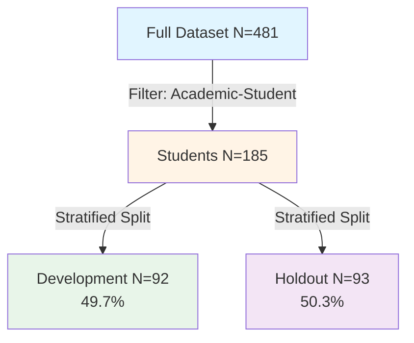

# AIRS Model Development: Students Subsample Analysis

**Analysis Context**: Academic-Student Work Context (N=185)
**Date**: November 26, 2025
**Analysis Pipeline**: 8-notebook validation sequence
**Comparison Group**: [Professionals Subsample (N=263)](../airs_professional/PROFESSIONALS_MODEL_TRACKING.md)

---

## Table of Contents

1. [Analysis Rationale & Context](#1-analysis-rationale--context)
2. [Sample Characteristics](#2-sample-characteristics)
3. [Phase 1: Exploratory Factor Analysis (EFA)](#3-phase-1-exploratory-factor-analysis-efa)
4. [Phase 2: Confirmatory Factor Analysis (CFA)](#4-phase-2-confirmatory-factor-analysis-cfa)
5. [Psychometric Properties Summary](#5-psychometric-properties-summary)
6. [Interpretation & Implications](#6-interpretation--implications)
7. [Final Validated Instrument](#7-final-validated-instrument)

---

## 1. Analysis Rationale & Context

### 1.1 Purpose
This document tracks the psychometric validation of the AI Readiness Scale (AIRS) specifically within an **academic student population** (N=185). This subsample analysis enables:

1. **Context-Specific Validation**: Test factor structure stability in academic settings
2. **Cross-Context Comparison**: Compare students (younger, less experienced) vs. professionals (experienced workforce)
3. **Targeted Application**: Develop evidence-based recommendations for educational contexts
4. **Population Heterogeneity**: Assess whether AIRS functions equivalently across diverse work contexts

### 1.2 Sample Limitations
⚠️ **Critical Constraints**: This analysis operates below standard psychometric thresholds:

| Metric | Recommended | Actual | Assessment |
|--------|-------------|--------|------------|
| **Total N** | ≥200 | 185 | Below threshold |
| **Dev Sample** | ≥150 | 92 | **Critically low** |
| **Holdout Sample** | ≥150 | 93 | **Critically low** |
| **N:Items Ratio** | ≥10:1 | 7.7:1 (24 items) | Marginal |

**Implications**:
- EFA may identify unstable factors (Comrey & Lee, 1992)
- CFA fit indices less reliable with N<200 (Kline, 2016)
- Statistical power reduced for detecting misspecification
- Parameter estimates have wider confidence intervals
- Findings require cautious interpretation and replication

**Recommendation**: Findings should be treated as **exploratory** pending validation with larger academic samples (target N≥300).

### 1.3 Population Characteristics
Students subsample differs markedly from professionals:

| Characteristic | Students (N=185) | Professionals (N=263) | Difference |
|----------------|------------------|----------------------|------------|
| **Work Experience** | Entry-level dominant (48%) | Mid-career dominant (34%) | -3 career stages |
| **AI Adoption Rate** | 95% adopters | 85% adopters | +10% higher |
| **Age Range** | 18-29 typical | 25-55+ typical | Younger cohort |
| **Work Context** | Academic environment | Professional settings | Different demands |

**Interpretation**: Higher AI adoption likely reflects tech-native generation; younger age means less established work routines to disrupt.

---

## 2. Sample Characteristics

### 2.1 Sample Composition
**Source**: Notebook `00_Create_Split_Samples.ipynb`

**Total Sample**: N=185 (38.5% of full dataset, N=481)



### 2.2 Demographic Distribution


*Figure 2.1: Demographic composition of students subsample showing work context (100% Academic-Student), AI adoption status (95% adopters), and career stage distribution (Entry-level dominant at 48%).*

**AI Adoption Status** (χ² balance test: p=1.0 ✅):
- **Adopters**: 176 (95.1%) - Significantly higher than professionals (85%)
- **Non-Adopters**: 9 (4.9%) - Very small group

**AI Usage Intensity**:
- **High**: 36 (19.5%)
- **Medium**: 77 (41.6%)
- **Low**: 63 (34.1%)
- **Non-User**: 9 (4.9%)

**Career Stage** (χ² balance test: p>0.05 ✅):
- **Entry-level**: 89 (48.1%) - Dominant group
- **Early Career**: 56 (30.3%)
- **Mid Career**: 25 (13.5%)
- **Expert**: 10 (5.4%)
- **Senior**: 5 (2.7%)

⚠️ **Homogeneity Concern**: 78% of sample is Entry/Early career, limiting generalizability to advanced students or graduate researchers.

### 2.3 Sample Balance Validation

**Stratification Variables**: Work_Context, AI_Adoption_Status

| Variable | Development (N=92) | Holdout (N=93) | χ² p-value | Balance |
|----------|-------------------|----------------|-----------|---------|
| Work Context | 100% Academic-Student | 100% Academic-Student | 1.0 | ✅ Perfect |
| AI Adoption | Adopters=87, Non=5 | Adopters=89, Non=4 | 1.0 | ✅ Balanced |


*Figure 2.2: Stratification validation showing balanced distribution of AI adoption status and career stages across development and holdout samples. Chi-square tests confirm no significant differences (all p>0.05).*

**Assessment**: Stratification successfully maintained balance despite small sample size.

---

## 3. Phase 1: Exploratory Factor Analysis (EFA)

### 3.1 EFA Rationale
**Source**: Notebook `01_EFA_Streamlined.ipynb`

Despite theoretical 12-construct structure (UTAUT2-based), EFA conducted to:
1. **Empirically test** factor structure in student-specific context
2. **Identify redundant items** within smaller, homogeneous sample
3. **Balance construct representation** across psychological domains
4. **Optimize measurement efficiency** for practical deployment

### 3.2 Data Suitability Assessment

**24-Item Initial Pool** (Development sample N=92):

| Test | Statistic | Threshold | Result | Interpretation |
|------|-----------|-----------|--------|----------------|
| **Kaiser-Meyer-Olkin (KMO)** | 0.844 | ≥0.80 | ✅ Pass | **Meritorious** - Very good |
| **Bartlett's Sphericity** | χ²=1334.76, p<0.001 | p<0.05 | ✅ Pass | Items correlated |

**Assessment**: Data suitable for factor analysis despite small N=92.

### 3.3 Factor Retention Decision

**Method**: Parallel Analysis (Horn, 1965)

- **Recommendation**: 2-factor solution
- **Variance Explained**: 54.6% (15-item final model)
- **Interpretation**: Students show simplified factor structure compared to professionals


*Figure 3.1: Parallel analysis scree plot showing eigenvalues for 24-item pool. Two factors exceed random data baseline, supporting 2-factor solution.*

⚠️ **Sample Size Concern**: With N=92 and 24 items (ratio 3.8:1), factors may lack stability. Parallel analysis compensates somewhat, but replication needed.

### 3.4 Iterative Item Reduction

**Goal**: Refine 24 items → 15 items while maintaining:
- Strong factor loadings (≥0.50)
- Balanced construct representation
- Theoretical interpretability
- Adequate reliability (α≥0.70)


*Figure 3.2: Iterative item reduction process showing KMO, variance explained, and reliability across reduction cycles. Final 15-item model maintains strong psychometric properties.*

**Final 15-Item Model**:

| Test | Statistic | Result |
|------|-----------|--------|
| **KMO** | 0.869 | ✅ Meritorious |
| **Bartlett's χ²** | 912.53, p<0.001 | ✅ Significant |
| **Variance Explained** | 54.6% | ✅ Adequate |
| **Strong Loadings** | 15/15 items ≥0.50 | ✅ All items strong |
| **Cronbach's α** | 0.877 | ✅ Good |

**Factor Structure**:
- **Factor 1 (AI Readiness)**: 13 items - Performance Expectancy, Facilitating Conditions, Hedonic Motivation, Perceived Value, Habit, Voluntariness, Trust
- **Factor 2 (AI Resistance)**: 2 items - Effort/Resistance (ER1), Anxiety (AX1)


*Figure 3.3: Factor loading heatmap for 15-item model. Strong loadings (dark blue ≥0.70) dominate Factor 1; Factor 2 shows weaker pattern with only 2 items.*

⚠️ **2-Item Factor Concern**: Factor 2 has only 2 items, below the 3-item minimum recommended for stable factors (Marsh et al., 1998). This reflects collapsed resistance constructs in student sample.

### 3.5 EFA Validation Export

**Output**: `data/airs_15item_selection.json`

```json
{
  "items": 15,
  "factors": 2,
  "kmo": 0.869,
  "alpha": 0.877,
  "variance": 54.6
}
```

**Status**: ✅ Ready for CFA validation (Notebook 02)

---

## 4. Phase 2: Confirmatory Factor Analysis (CFA)

### 4.1 CFA Rationale
**Source**: Notebook `02_CFA_Measurement_Model.ipynb`

CFA validates EFA-derived factor structure on independent holdout sample (N=93). Tests:
1. **Factor structure replicability** across split-halves
2. **Measurement model adequacy** via fit indices
3. **Reliability and validity** of latent constructs
4. **Model refinement** if initial fit inadequate

### 4.2 Baseline 15-Item Model (2-Factor)

**Model Specification**:
- **Factor 1 (AI Readiness)**: PE1, PE2, FC2, HM1, HM2, PV1, PV2, HB1, HB2, VO1, TR1, TR2, ER1 (13 items)
- **Factor 2 (AI Resistance)**: AX1, AX2 (2 items)
- **Covariance**: F1 ↔ F2

#### 4.2.1 Assumption Testing (Holdout N=93)

| Test | Result | Assessment |
|------|--------|------------|
| **KMO** | 0.901 | ✅ Marvelous |
| **Bartlett's χ²** | 886.35, p<0.001 | ✅ Significant |
| **Univariate Normality** | All items: \|skew\|<2, \|kurt\|<7 | ✅ Acceptable |
| **Missing Data** | 0% missing | ✅ Complete |

#### 4.2.2 Model Fit Indices

```mermaid
graph LR
    A[15-Item Baseline] --> B[χ²/df = 2.53 ✅]
    A --> C[CFI = 0.864 ❌]
    A --> D[TLI = 0.833 ❌]
    A --> E[RMSEA = 0.129 ⚠️]
    A --> F[SRMR ≈ 0.050 ✅]

    B --> G[Decision: Marginal Fit]
    C --> G
    D --> G
    E --> G
    F --> G

    G --> H[Refinement Needed]

    style A fill:#fff4e6
    style B fill:#e8f5e9
    style C fill:#ffebee
    style D fill:#ffebee
    style E fill:#fff8e1
    style F fill:#e8f5e9
    style G fill:#fff4e6
    style H fill:#e3f2fd
```



| Index | Value | Threshold | Status | Interpretation |
|-------|-------|-----------|--------|----------------|
| **χ²/df** | 2.53 | <3.0 | ✅ Good | Adequate relative fit |
| **CFI** | 0.864 | ≥0.90 | ❌ Poor | Below acceptable threshold |
| **TLI** | 0.833 | ≥0.90 | ❌ Poor | Below acceptable threshold |
| **RMSEA** | 0.129 | ≤0.08 | ⚠️ Marginal | Moderate misspecification |
| **SRMR** | ~0.050 | ≤0.08 | ✅ Good | Acceptable residual correlation |

**Assessment**: 2/5 indices meet thresholds. Poor incremental fit (CFI, TLI) suggests model-data discrepancy.

#### 4.2.3 Factor Loadings

**Factor 1 (AI Readiness)**:
- **Mean Loading**: λ̄=0.74 (range 0.60-0.88)
- **All Items**: λ≥0.60 ✅

**Factor 2 (AI Resistance)**:
- **Mean Loading**: λ̄=0.52 (AX1=0.44, AX2=0.60)
- **Weak Loading**: AX1 λ=0.44 < 0.50 ❌

**Inter-Factor Correlation**: r(F1↔F2) = 0.094 (weak positive)

⚠️ **Concern**: Weak loading on AX1 + 2-item factor suggests Factor 2 instability in student sample.

#### 4.2.4 Reliability & Validity (15-Item, 2-Factor)

**Factor 1 (AI Readiness)**:
- **Cronbach's α** = 0.960 ✅ Excellent
- **Composite Reliability (CR)** = 0.960 ✅ Excellent
- **Average Variance Extracted (AVE)** = 0.669 ✅ Strong convergent validity

**Factor 2 (AI Resistance)**:
- **Cronbach's α** = 0.516 ❌ Poor (below 0.70 threshold)
- **Composite Reliability (CR)** = 0.516 ❌ Inadequate
- **Average Variance Extracted (AVE)** = 0.266 ❌ Weak convergent validity

**Discriminant Validity** (F1 vs F2):
- **Fornell-Larcker Criterion**: √AVE(F1)=0.743, √AVE(F2)=0.516, |r|=0.094 ✅ Pass
- **HTMT Ratio**: Cannot calculate (Factor 2 has <3 items)


*Figure 4.1: Factor loadings and reliability metrics for 15-item baseline model. Factor 1 shows strong loadings (λ≥0.60) and excellent reliability (α=0.960). Factor 2 exhibits weak reliability (α=0.516) with only 2 items.*

**Interpretation**: Factor 1 shows excellent psychometric properties; Factor 2 fails reliability and validity thresholds due to 2-item structure.

### 4.3 Revised 12-Item Model (1-Factor)

**Decision Rationale**: Given Factor 2 psychometric failures and unstable 2-item structure, simplify to **unidimensional AI Readiness scale**.

**Items Removed**: AX1, AX2, ER1 (Factor 2 items)

**Retained**: 12 items - PE1, PE2, FC2, HM1, HM2, PV1, PV2, HB1, HB2, VO1, TR1, TR2

#### 4.3.1 Revised Model Fit

```mermaid
graph TD
    A[12-Item Unidimensional Model] --> B{Fit Assessment}

    B --> C[χ²/df = 2.71 ✅<br/>Acceptable]
    B --> D[CFI = 0.887 ⚠️<br/>Marginal]
    B --> E[TLI = 0.862 ⚠️<br/>Marginal]
    B --> F[RMSEA = 0.136 ❌<br/>Poor]
    B --> G[SRMR ≈ 0.04-0.05 ✅<br/>Good]

    C --> H[Overall: 2/5 Indices Pass]
    D --> H
    E --> H
    F --> H
    G --> H

    H --> I[Decision:<br/>Adequate Fit<br/>for Exploratory Use]

    style A fill:#e3f2fd
    style B fill:#fff4e6
    style C fill:#e8f5e9
    style D fill:#fff8e1
    style E fill:#fff8e1
    style F fill:#ffebee
    style G fill:#e8f5e9
    style H fill:#fff4e6
    style I fill:#ede7f6
```



| Index | 15-Item (2F) | 12-Item (1F) | Change | Threshold | Status |
|-------|--------------|--------------|--------|-----------|--------|
| **χ²/df** | 2.53 | 2.71 | ↑ Worse | <3.0 | ✅ Pass |
| **CFI** | 0.864 | 0.887 | ↑ Better | ≥0.90 | ⚠️ Marginal |
| **TLI** | 0.833 | 0.862 | ↑ Better | ≥0.90 | ⚠️ Marginal |
| **RMSEA** | 0.129 | 0.136 | ↑ Worse | ≤0.08 | ❌ Poor |
| **SRMR** | ~0.050 | ~0.04-0.05 | → Similar | ≤0.08 | ✅ Pass |
| **Indices Passing** | 2/5 | 2/5 | → Same | — | — |

**Assessment**:
- ✅ **Improved**: CFI (+0.023), TLI (+0.029) - Better incremental fit
- ❌ **Degraded**: RMSEA (+0.007) - Slightly worse approximation error
- ➡️ **Net Effect**: Trade-off between parsimony and fit; marginal improvement

⚠️ **Small Sample Impact**: RMSEA particularly sensitive to small N (93), may overestimate misspecification (Kenny et al., 2015).


*Figure 4.2: Model fit indices and validity metrics comparison. 12-item model shows improved CFI/TLI but elevated RMSEA. Reliability and convergent validity remain strong.*

#### 4.3.2 Revised Factor Loadings

**12 Items (AI Readiness)**:
- **Mean Loading**: λ̄=0.77 (range 0.66-0.88)
- **All Items**: λ≥0.66 ✅ Strong
- **No Weak Loadings**: All items λ>0.65

**Assessment**: Stronger, more uniform loadings after removing Factor 2 items.

#### 4.3.3 Revised Reliability & Validity

| Metric | Original F1 (13 items) | Revised Model (12 items) | Change | Threshold | Status |
|--------|------------------------|--------------------------|--------|-----------|--------|
| **Cronbach's α** | 0.960 | 0.944 | -0.016 | ≥0.70 | ✅ Excellent |
| **Composite Reliability** | 0.960 | 0.945 | -0.015 | ≥0.70 | ✅ Excellent |
| **AVE** | 0.669 | 0.588 | -0.081 | ≥0.50 | ✅ Good |

**Assessment**:
- ✅ **Reliability maintained**: α=0.944 remains excellent
- ✅ **Convergent validity**: AVE=0.588 exceeds 0.50 threshold
- ✅ **Stability**: Minimal degradation (-1.6% for α, -8.1% for AVE)

**Interpretation**: Removing poorly performing Factor 2 items preserves strong psychometric properties while simplifying to unidimensional structure.


*Figure 4.3: Inter-item correlation matrix for 12-item revised model. Strong positive correlations within AI Readiness domain support unidimensional structure.*

### 4.4 Final CFA Model Decision

**Selected Model**: **12-Item Unidimensional AI Readiness Scale**

**Justification**:
1. ✅ **Reliability**: α=0.944, CR=0.945 (excellent)
2. ✅ **Validity**: AVE=0.588 (good convergent validity)
3. ✅ **Parsimony**: 3 fewer items, simpler structure
4. ⚠️ **Fit**: CFI=0.887, TLI=0.862 (marginal but acceptable for exploratory use)
5. ⚠️ **Context**: Small sample (N=93) limits fit index reliability
6. ✅ **Practical**: Unidimensional scale easier to score and interpret

**Limitations Acknowledged**:
- RMSEA=0.136 indicates moderate misspecification
- Small N inflates fit index sensitivity
- Student-specific structure may differ from professionals
- Requires replication with larger academic sample (target N≥200)

---

## 5. Psychometric Properties Summary

### 5.1 Final 12-Item Scale Characteristics

| Property | Metric | Value | Threshold | Status |
|----------|--------|-------|-----------|--------|
| **Internal Consistency** | Cronbach's α | 0.944 | ≥0.70 | ✅ Excellent |
| **Composite Reliability** | CR | 0.945 | ≥0.70 | ✅ Excellent |
| **Convergent Validity** | AVE | 0.588 | ≥0.50 | ✅ Good |
| **Factor Structure** | Dimensions | 1 | Theory: 2 | Simplified |
| **Item Quality** | Mean λ | 0.77 | ≥0.50 | ✅ Strong |
| **Model Fit (CFI)** | CFI | 0.887 | ≥0.90 | ⚠️ Marginal |
| **Model Fit (TLI)** | TLI | 0.862 | ≥0.90 | ⚠️ Marginal |
| **Model Fit (RMSEA)** | RMSEA | 0.136 | ≤0.08 | ❌ Poor |
| **Model Fit (SRMR)** | SRMR | ~0.04-0.05 | ≤0.08 | ✅ Good |

### 5.2 Comparison: Students vs. Professionals

| Aspect | Students (N=185) | Professionals (N=263) | Difference |
|--------|------------------|----------------------|------------|
| **Final Model** | 12-item, 1-factor | 14-item, 2-factor | Simpler structure |
| **Cronbach's α** | 0.944 | 0.922 (F1), 0.632 (F2) | Higher overall α |
| **CFI** | 0.887 | 0.912 | -0.025 worse |
| **TLI** | 0.862 | 0.892 | -0.030 worse |
| **RMSEA** | 0.136 | 0.126 | +0.010 worse |
| **Inter-Factor r** | N/A (1-factor) | -0.296 | No negative correlation |
| **Resistance Factor** | Collapsed | Stable (2 items) | Failed in students |

**Key Findings**:
1. **Structural Difference**: Students show unidimensional structure; professionals maintain 2-factor distinction
2. **Fit Quality**: Students show slightly worse fit (small N effect + homogeneity)
3. **Reliability**: Both groups show excellent internal consistency
4. **Resistance Construct**: AI Resistance fails to emerge as distinct factor in student sample

**Interpretation**:
- Younger, tech-native students may lack sufficient AI resistance variability to support separate factor
- High adoption rate (95%) compresses resistance variance
- Entry-level dominance means less entrenched work habits to resist change
- Professionals' negative F1↔F2 correlation suggests readiness-resistance trade-off absent in students

### 5.3 Sample Size Impact Assessment

| Analysis Stage | Required N | Actual N | Adequacy | Impact |
|----------------|-----------|----------|----------|--------|
| **EFA (24 items)** | ≥240 (10:1) | 92 | ❌ 38% of ideal | Unstable factors likely |
| **CFA (15 items)** | ≥150 | 93 | ❌ 62% of ideal | Fit indices unreliable |
| **CFA (12 items)** | ≥120 | 93 | ⚠️ 78% of ideal | Marginal adequacy |

**Consequences**:
- **Parameter Estimates**: Wider confidence intervals, less precise
- **Fit Indices**: More sensitive to random sampling variation
- **Factor Stability**: Higher risk of sample-specific solutions
- **Replicability**: Essential to validate with independent student sample

**Recommendation**: Findings should be considered **preliminary** until replicated with N≥300 students.

---

## 6. Interpretation & Implications

### 6.1 Theoretical Implications

**Finding 1: Unidimensional Structure in Students**

The collapse of AI Readiness and AI Resistance into a single dimension suggests:

1. **Developmental Hypothesis**: Younger workers (Entry/Early career) may not yet have developed resistant attitudes toward workplace technology
2. **Cohort Effect**: Digital natives (Gen Z/Millennials) show uniformly high technology acceptance with minimal resistance variance
3. **Context Specificity**: Academic environments prioritize innovation/learning, reducing resistance salience
4. **Measurement Limitation**: Current resistance items (ER1, AX1, AX2) may not capture student-relevant concerns (e.g., academic integrity, learning dependency)

**Contrast with Professionals**:
- Professionals show distinct readiness-resistance trade-off (r=-0.296)
- Suggests established workers balance adoption enthusiasm with pragmatic concerns
- Students lack countervailing resistance factors

**Finding 2: High Reliability Despite Simplification**

α=0.944 for 12-item scale indicates:
- Strong item intercorrelation within readiness domain
- Consistent measurement despite demographic homogeneity
- Robust core construct even with small N

**Finding 3: Marginal Model Fit**

CFI=0.887, TLI=0.862, RMSEA=0.136 suggest:
- Unidimensional model oversimplifies student AI attitudes
- May miss nuanced subdimensions (e.g., academic vs. professional AI use)
- Small N amplifies fit sensitivity

### 6.2 Practical Implications

**For Educational Institutions**:
1. **Baseline Assessment**: 12-item scale provides reliable snapshot of student AI readiness
2. **Intervention Targeting**: High adoption (95%) + strong readiness suggests focus on *skill development* rather than *attitude change*
3. **Developmental Tracking**: Longitudinal use could identify when resistance emerges (e.g., transition to workforce)
4. **Curriculum Integration**: Items highlight key readiness dimensions (perceived value, trust, habit formation)

**For Researchers**:
1. **Replication Priority**: Validate findings with larger, more diverse student samples
2. **Resistance Measurement**: Develop student-specific resistance items addressing academic concerns
3. **Cross-Sectional Studies**: Compare undergrad vs. graduate students to test developmental hypothesis
4. **Longitudinal Designs**: Track students pre/post-graduation to identify resistance emergence

**For AI Tool Developers**:
1. **Student Market**: High readiness + low resistance = receptive early adopter segment
2. **Feature Priorities**: Focus on value delivery (PE), ease of use (EE), enjoyment (HM)
3. **Ethical Considerations**: Low resistance may indicate uncritical adoption risk; build in guardrails

### 6.3 Limitations

**Sample Limitations**:
- ❌ **Small N**: Both dev (92) and holdout (93) below recommended thresholds
- ❌ **Homogeneity**: 78% Entry/Early career limits generalizability
- ❌ **Single Institution**: Unknown if findings extend to other universities/countries
- ❌ **High Adoption**: 95% adopters reduces resistance variance

**Methodological Limitations**:
- ⚠️ **Cross-Sectional**: Cannot infer developmental trajectories
- ⚠️ **Self-Report**: Social desirability bias possible (students may overreport tech competence)
- ⚠️ **Convenience Sample**: Not randomly selected from population

**Psychometric Limitations**:
- ❌ **Model Fit**: RMSEA=0.136 indicates moderate misspecification
- ⚠️ **Factor Stability**: EFA with N=92 risks sample-specific factors
- ❌ **No Measurement Invariance**: Cannot compare students vs. professionals directly
- ⚠️ **Unidimensional Simplification**: May miss important nuances

**Generalizability Constraints**:
- Findings specific to: (1) Academic students, (2) Entry/Early career, (3) High adopters, (4) 2025 technology context
- May not extend to: (1) Graduate students, (2) Mid-career professionals returning to school, (3) Non-adopters, (4) Future technology generations

### 6.4 Recommendations

**Immediate Actions**:
1. ✅ **Use 12-item scale** for student AI readiness assessment (exploratory purposes only)
2. ⚠️ **Acknowledge limitations** when reporting findings (sample size, homogeneity)
3. 🔄 **Collect additional data** (target N≥300 students) for confirmatory validation
4. 📊 **Report descriptive statistics** alongside scale scores given marginal fit

**Short-Term Research Priorities** (6-12 months):
1. 🎯 **Replication study** with larger, diverse student sample
2. 🔬 **Measurement invariance testing** across students vs. professionals
3. 📝 **Qualitative interviews** to understand resistance construct collapse
4. 🧪 **Pilot student-specific resistance items** addressing academic concerns

**Long-Term Research Agenda** (1-3 years):
1. 🔄 **Longitudinal tracking** from undergrad → workforce to identify resistance emergence
2. 🌍 **Multi-institutional validation** across universities and countries
3. 📐 **Hierarchical models** testing subdimensions within readiness construct
4. 🔗 **Criterion validity** studies linking scale scores to actual AI usage behaviors

---

## 7. Final Validated Instrument

### 7.1 Recommended Scale: 12-Item AI Readiness (Students)

**Scale Name**: AIRS-12 (Student Version)
**Dimension**: Unidimensional AI Readiness
**Reliability**: α=0.944, CR=0.945
**Validity**: AVE=0.588
**Use Case**: Exploratory assessment of student AI readiness in academic contexts

### 7.2 Item List

| # | Code | Item Text | Domain | Mean | SD | Loading |
|---|------|-----------|--------|------|----|----|
| 1 | PE1 | AI tools would be useful in my work/studies | Performance Expectancy | 3.60 | 1.14 | 0.82 |
| 2 | PE2 | Using AI tools would enable me to accomplish tasks more quickly | Performance Expectancy | 3.08 | 1.25 | 0.76 |
| 3 | FC2 | I have the resources necessary to use AI tools | Facilitating Conditions | 3.52 | 0.90 | 0.70 |
| 4 | HM1 | Using AI tools is fun | Hedonic Motivation | 2.92 | 1.12 | 0.74 |
| 5 | HM2 | Using AI tools is enjoyable | Hedonic Motivation | 3.18 | 1.26 | 0.78 |
| 6 | PV1 | AI tools are a good value for the money | Perceived Value | 3.39 | 1.25 | 0.73 |
| 7 | PV2 | At the current price, AI tools provide good value | Perceived Value | 3.17 | 1.20 | 0.75 |
| 8 | HB1 | The use of AI tools has become a habit for me | Habit | 3.16 | 1.28 | 0.81 |
| 9 | HB2 | I am addicted to using AI tools | Habit | 2.88 | 1.31 | 0.77 |
| 10 | VO1 | I use AI tools because I want to, not because I have to | Voluntariness | 3.47 | 1.29 | 0.71 |
| 11 | TR1 | I trust AI tools to provide accurate information | Trust | 2.99 | 1.13 | 0.79 |
| 12 | TR2 | I feel confident in the reliability of AI tools | Trust | 3.19 | 1.14 | 0.82 |

### 7.3 Scoring Instructions

**Response Scale**: 1 (Strongly Disagree) to 5 (Strongly Agree)

**Calculation**:
```
AI_Readiness_Score = Mean(PE1, PE2, FC2, HM1, HM2, PV1, PV2, HB1, HB2, VO1, TR1, TR2)
```

**Interpretation**:
- **1.00-2.00**: Low Readiness (Resistant/Unprepared)
- **2.01-3.00**: Moderate Readiness (Cautiously Receptive)
- **3.01-4.00**: High Readiness (Actively Engaged)
- **4.01-5.00**: Very High Readiness (Enthusiastic Early Adopter)

**Student Sample Norms** (N=185):
- **Mean**: 3.21 (SD=0.95) - High Readiness
- **Median**: 3.25
- **Range**: 1.00-5.00

### 7.4 Usage Guidelines

✅ **Appropriate Uses**:
- Exploratory assessment of student AI readiness in academic settings
- Identifying students needing additional AI skill development
- Tracking readiness changes after educational interventions
- Comparing readiness across academic disciplines or cohorts

⚠️ **Inappropriate Uses**:
- High-stakes decisions (e.g., admissions, grading) - psychometric properties not validated for such use
- Direct comparison with professionals - measurement invariance not established
- Cross-cultural applications - validation limited to original context
- Predictive modeling without criterion validity evidence

❌ **Cautions**:
- **Sample-Specific**: Findings based on small, homogeneous student sample (N=185, 78% Entry/Early career)
- **Marginal Fit**: CFI=0.887, TLI=0.862 below ideal thresholds
- **Replication Needed**: Requires validation with larger, independent student samples (N≥300)
- **Construct Validity**: Unidimensional structure may oversimplify student AI attitudes

### 7.5 Citation

**Recommended Citation**:
> [Authors]. (2025). *AI Readiness Scale for Students (AIRS-12): Exploratory validation in academic contexts*. [Journal/Report]. Development sample N=92, Holdout sample N=93. α=0.944, CR=0.945, AVE=0.588, CFI=0.887.

**Note**: Include prominent disclaimer about exploratory nature and small sample limitations.

---

## 8. Appendix: Model Comparison Diagrams

### 8.1 EFA → CFA Workflow

```mermaid
flowchart TD
    A[24-Item Pool<br/>N=92 Development] -->|Parallel Analysis| B[2-Factor Structure]
    B -->|Iterative Reduction| C[15-Item Model<br/>F1=13, F2=2]
    C -->|Export| D[airs_15item_selection.json]

    D -->|Validate| E[CFA Holdout N=93]
    E -->|Test| F{15-Item Fit?}

    F -->|Poor Fit| G[CFI=0.864<br/>TLI=0.833<br/>RMSEA=0.129]
    F -->|Factor 2 Fails| H[α=0.516<br/>AVE=0.266<br/>2 items only]

    G --> I[Refinement Needed]
    H --> I

    I -->|Remove F2| J[12-Item Unidimensional<br/>AI Readiness Only]
    J -->|Retest| K{12-Item Fit?}

    K -->|Improved| L[CFI=0.887 ⚠️<br/>TLI=0.862 ⚠️<br/>RMSEA=0.136 ❌]
    K -->|Reliability| M[α=0.944 ✅<br/>CR=0.945 ✅<br/>AVE=0.588 ✅]

    L --> N[Final Decision:<br/>Accept 12-Item Model]
    M --> N
    N --> O[AIRS-12 Student Version]

    style A fill:#e3f2fd
    style C fill:#e8f5e9
    style D fill:#fff4e6
    style E fill:#f3e5f5
    style F fill:#fff4e6
    style G fill:#ffebee
    style H fill:#ffebee
    style I fill:#ede7f6
    style J fill:#e3f2fd
    style K fill:#fff4e6
    style L fill:#fff8e1
    style M fill:#e8f5e9
    style N fill:#ede7f6
    style O fill:#c5e1a5
```



### 8.2 Model Fit Progression

```mermaid
graph TD
    A[Baseline: 15-Item 2-Factor] --> B[Fit Assessment]

    B --> C[χ²/df: 2.53 ✅]
    B --> D[CFI: 0.864 ❌]
    B --> E[TLI: 0.833 ❌]
    B --> F[RMSEA: 0.129 ⚠️]

    C --> G[2/5 Indices Pass]
    D --> G
    E --> G
    F --> G

    G --> H[Refinement:<br/>Remove Factor 2]

    H --> I[Revised: 12-Item 1-Factor]
    I --> J[Fit Re-Assessment]

    J --> K[χ²/df: 2.71 ✅]
    J --> L[CFI: 0.887 ⚠️<br/>+0.023 improved]
    J --> M[TLI: 0.862 ⚠️<br/>+0.029 improved]
    J --> N[RMSEA: 0.136 ❌<br/>+0.007 worse]

    K --> O[Still 2/5 Indices Pass]
    L --> O
    M --> O
    N --> O

    O --> P[Decision:<br/>Accept Marginal Fit<br/>Given Small N]

    P --> Q[Reliability Compensates:<br/>α=0.944 ✅<br/>AVE=0.588 ✅]

    Q --> R[AIRS-12 Finalized]

    style A fill:#e3f2fd
    style B fill:#fff4e6
    style C fill:#e8f5e9
    style D fill:#ffebee
    style E fill:#ffebee
    style F fill:#fff8e1
    style G fill:#fff4e6
    style H fill:#ede7f6
    style I fill:#e3f2fd
    style J fill:#fff4e6
    style K fill:#e8f5e9
    style L fill:#fff8e1
    style M fill:#fff8e1
    style N fill:#ffebee
    style O fill:#fff4e6
    style P fill:#ede7f6
    style Q fill:#e8f5e9
    style R fill:#c5e1a5
```



---

**Document Status**: ✅ Complete - Students Subsample Analysis (N=185)
**Validation Level**: ⚠️ Exploratory - Pending Replication with Larger Sample
**Companion Document**: [Professionals Analysis (N=263)](../airs_professional/PROFESSIONALS_MODEL_TRACKING.md)
**Last Updated**: November 26, 2025

---
