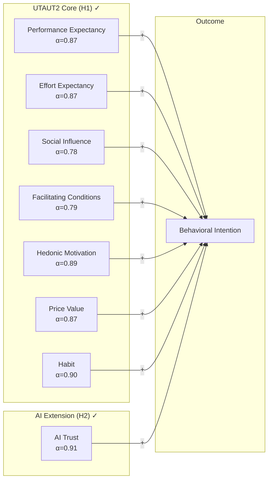
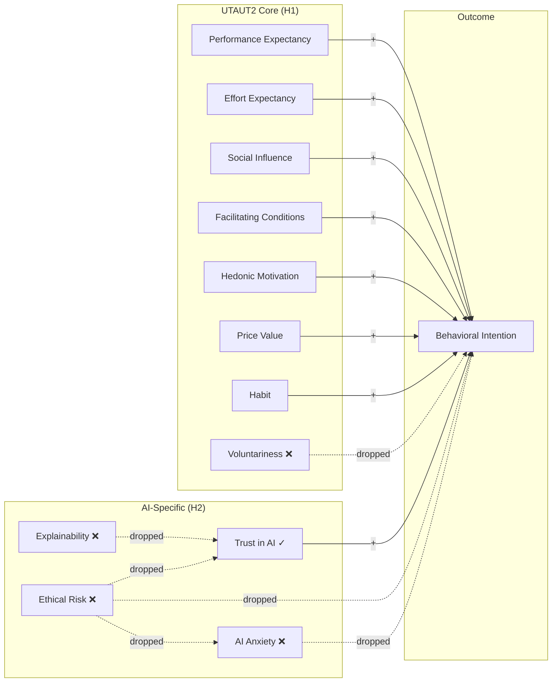
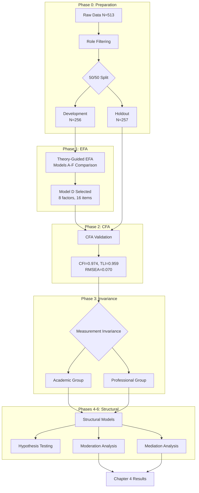
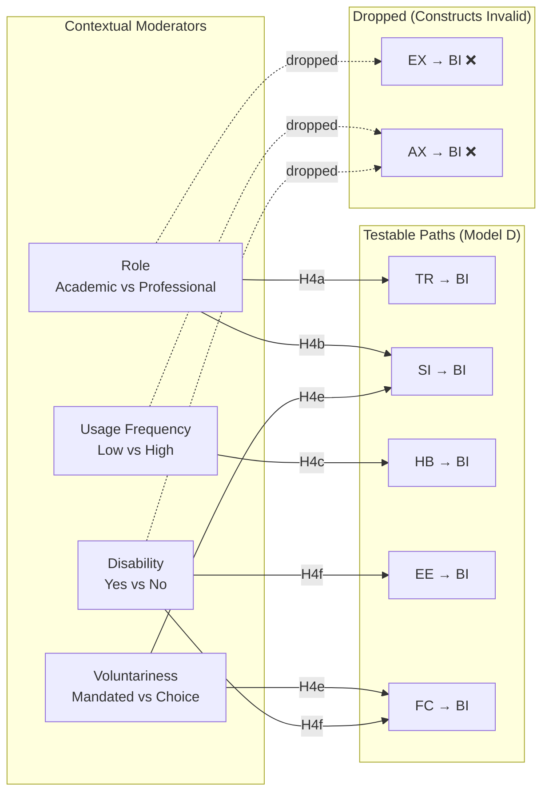
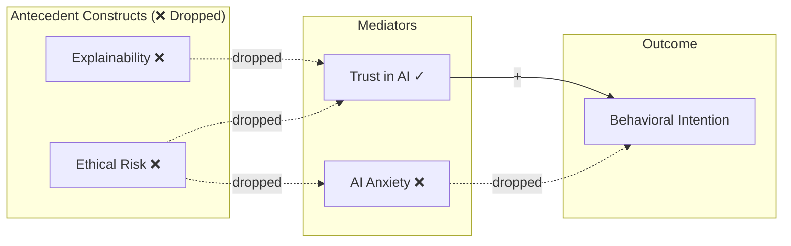

# AIRS Analysis Plan
**Dissertation Roadmap: From Theory to Empirical Validation**

---

## Study Overview

**Purpose**: Develop and validate the Artificial Intelligence Readiness Score (AIRS), a theory-grounded extension of UTAUT2 for enterprise AI adoption contexts.

**Theoretical Foundation**: AIRS extends the Unified Theory of Acceptance and Use of Technology 2 (Venkatesh et al., 2012) by integrating AI Trust as a context-specific construct critical for understanding acceptance of probabilistic and partially opaque systems (Shin, 2021; Langer et al., 2023).

**Validated Model (November 2025)**: 8-factor structure with 7 UTAUT2 core constructs (PE, EE, SI, FC, HM, PV, HB) + AI Trust extension. Four originally hypothesized constructs (Voluntariness, Explainability, Ethical Risk, Anxiety) were dropped due to item design issues documented below.

**Contribution**: Both theoretical (validating UTAUT2 as foundation for AI adoption + AI Trust extension) and applied (a validated 16-item diagnostic instrument for organizational readiness assessment).

---

## Validated Measurement Model (Model D)



<details>
<summary>Original Hypothesized Model (12 constructs) - Click to expand</summary>



**Legend**: ✓ = Validated | ❌ = Dropped (item design issues)

</details>

---

## Single Model Approach (Revised November 2025)

This study validates **one measurement model** using the combined sample, then tests **population as a moderator** via measurement invariance and multi-group SEM:

| Phase | Focus | Strategy |
|-------|-------|----------|
| **Phases 1-2** | Validate single measurement model | Combined sample EFA → CFA (50/50 split) |
| **Phase 3** | Test population equivalence | Measurement invariance (Academic vs. Professional) |
| **Phases 4-6** | Structural relationships + **Population Moderation** | Multi-group SEM with partial invariance constraints |

### Population as Moderator (Key Design Decision)

**Rationale**: Population (Academic vs. Professional) is treated as a **moderator**, not a mediator, because:
1. Population is a pre-existing grouping variable (not caused by predictors)
2. Phase 3 results show differential measurement properties (partial metric invariance)
3. Mean differences suggest population may moderate predictor-outcome relationships

**Evidence from Phase 3**:
- Partial metric invariance: 4/16 loadings differ >0.10 (SI2, FC1, EE2, PE1)
- Significant mean differences: SI, EE, HM (all small effects)
- Different construct functioning: SI weaker in Academic sample (λ=0.48 vs 0.83)

### Rationale for Single Model Approach

The original three-model approach (separate EFA/CFA for Full, Academic, Professional) resulted in:
- **Dimensional collapse**: 12 theoretical factors → 2-3 empirical factors via EFA
- **Poor CFA fit**: Best CFI = 0.902, but driven by high inter-construct correlations
- **Sample size limitations**: Academic holdout (N=59) required bootstrap and constrained model complexity

**Solution**: Establish one validated measurement model on the combined sample, then use measurement invariance testing to examine whether factor structure holds across populations.

### Analytical Philosophy
1. **Theory-guided, empirically validated**: Started with 12 constructs (8 UTAUT2 + 4 AI-specific); validated 8
2. **Parsimony with reliability**: 2 items per factor, all α ≥ 0.78
3. **Population differences via invariance**: Single model tested for equivalence across groups
4. **Transparent reporting**: Documented both retained and dropped constructs with diagnostic rationale

---

## Quick Reference

| Parameter | Value |
|-----------|-------|
| **Total Sample** | N = 513 (after role filtering) |
| **Development Sample** | N = 256 (EFA) |
| **Holdout Sample** | N = 257 (CFA) |
| **Validated Scale** | 16 items across 8 factors (2 items each) |
| **Model Fit** | CFI = 0.974, TLI = 0.959, RMSEA = 0.070 |
| **Design** | Cross-sectional survey with split-sample validation |
| **Approach** | Theory-guided EFA → CFA → Measurement Invariance → SEM |

### Sample Size Adequacy

| Sample | N | Items | Subjects:Variables | Assessment |
|--------|---|-------|-------------------|------------|
| **Development (EFA)** | 256 | 24 | 10.7:1 | Excellent (>10:1) |
| **Holdout (CFA)** | 257 | 16 | 16.1:1 | Excellent (>10:1) |

**Note**: Minimum recommended ratio is 5:1 (Costello & Osborne, 2005); 10:1 preferred (Hair et al., 2019). Combined sample approach provides excellent statistical power.

### Analysis Workflow



### Analysis Roadmap

| Phase | Notebook | Description | Status |
|-------|----------|-------------|--------|
| **0. Preparation** | `airs_experiment/00_Create_Split_Samples.ipynb` | Combined sample split (N=513 → EFA/CFA) | ✅ Complete |
| **1. EFA** | `airs_experiment/01_EFA_Experiment.ipynb` | Theory-guided EFA → Model D selection | ✅ Complete |
| **2. CFA** | `airs_experiment/02_CFA_Experiment.ipynb` | CFA validation + contribution summary | ✅ Complete |
| **3. Invariance** | `airs_experiment/03_Measurement_Invariance.ipynb` | Cross-population invariance testing | ✅ Complete |
| **4. Structural** | `airs_experiment/04_Structural_Model.ipynb` | Hypothesis testing (H1-H3) | ⏭️ Next |
| **5. Mediation** | `airs_experiment/05_Mediation_Analysis.ipynb` | Alternative analyses (H5 not testable) | ⏭️ Pending |
| **6. Moderation** | `airs_experiment/06_Moderation_Analysis.ipynb` | H4a-f contextual moderation | ⏭️ Pending |
| **7. Tool Usage** | `airs_experiment/07_Tool_Usage_Patterns.ipynb` | AI tool usage patterns | ⏭️ Pending |
| **8. Qualitative** | `airs_experiment/08_Qualitative_Feedback.ipynb` | Thematic analysis | ⏭️ Pending |

---

### REVISED APPROACH: Experimental Design (November 28, 2025)

**Rationale for Change**: The original three-model approach (Full/Academic/Professional) resulted in dimensional collapse (12 theoretical factors → 2-3 empirical factors via EFA) and poor CFA fit across all populations. This reflected high inter-construct correlations in moderately sized samples rather than fundamental scale issues.

**New Approach**: Single combined sample with theory-guided model testing

| Parameter | Original Approach | Experimental Approach |
|-----------|-------------------|----------------------|
| Samples | 3 separate (Full, Academic, Professional) | 1 combined (selected roles) |
| EFA Strategy | Pure data-driven | Theory-guided with multiple model comparison |
| Model Selection | Best-fitting empirical model | Best balance of fit + reliability + parsimony |
| CFA Focus | Validate EFA structure | Validate measurement model + contribution analysis |
| Population Differences | Separate models | Measurement invariance testing |

**Sample Composition**:
- Total N = 513 (after filtering)
- Development: N = 256 (EFA)
- Holdout: N = 257 (CFA)
- Selected roles: Full-time students, Part-time students, Employed (full-time), Employed (part-time), Freelancer/Independent contractor

### Phase 1 EFA Results Summary (November 28, 2025)

**Experimental Approach**: Theory-guided model comparison testing Models A through F

| Model | Factors | Items | Strategy | Variance | All α ≥ 0.60? |
|-------|---------|-------|----------|----------|---------------|
| A | 12 | 24 | Full theoretical | 72% | ✗ No (4 weak) |
| B | 10 | 20 | Drop 4 weakest items | 71% | ✗ No (2 weak) |
| C | 10 | 20 | Drop weak constructs | 69% | ✗ No (2 weak) |
| **D** | **8** | **16** | **Drop all α < 0.60 constructs** | **64%** | **✓ Yes** |
| E | 6 | 12 | Core UTAUT only | 58% | ✓ Yes |
| F | 4 | 8 | Minimal viable | 51% | ✓ Yes |

**Selected Model: Model D (8-Factor AIRS)**
- 8 factors × 2 items = 16 items
- All constructs α ≥ 0.78 (excellent reliability)
- 64% variance explained
- Theoretically coherent: UTAUT2 core + AI Trust extension

### Phase 2 CFA Results Summary (November 28, 2025)

**Model D Validation on Holdout Sample (N = 257)**

| Metric | Value | Threshold | Status |
|--------|-------|-----------|--------|
| CFI | 0.974 | ≥ 0.95 | ✓ Excellent |
| TLI | 0.959 | ≥ 0.95 | ✓ Excellent |
| RMSEA | 0.070 | ≤ 0.08 | ✓ Good |
| χ²/df | 1.51 | ≤ 3.0 | ✓ Excellent |

**Construct Reliability (CFA Sample)**:

| Construct | Items | α | CR | AVE | Status |
|-----------|-------|---|----|----|--------|
| PerfExp | PE1, PE2 | 0.87 | 0.87 | 0.77 | ✓ Excellent |
| EffortExp | EE1, EE2 | 0.87 | 0.87 | 0.77 | ✓ Excellent |
| SocialInf | SI1, SI2 | 0.78 | 0.79 | 0.66 | ✓ Good |
| FacilCond | FC1, FC2 | 0.79 | 0.80 | 0.66 | ✓ Good |
| HedonicMot | HM1, HM2 | 0.89 | 0.89 | 0.81 | ✓ Excellent |
| PriceValue | PV1, PV2 | 0.87 | 0.87 | 0.77 | ✓ Excellent |
| Habit | HB1, HB2 | 0.90 | 0.90 | 0.82 | ✓ Excellent |
| **AITrust** | **TR1, TR2** | **0.91** | **0.91** | **0.83** | **✓ Excellent** |

### Dissertation Contributions (November 28, 2025)

| Contribution Type | Finding |
|-------------------|---------|
| **Foundation** | UTAUT/UTAUT2 validated as solid foundation for studying AI adoption readiness (all 8 constructs α = 0.78-0.91) |
| **Primary** | AI Trust validated as novel UTAUT2 extension for AI adoption context |
| **Secondary** | Identified item design limitations when adapting UTAUT to AI context |
| **Methodological** | Provided diagnostic evidence and recommendations for future scale development |

### Dropped Constructs Diagnostic Summary

Four constructs dropped due to **item design issues** (not sample-specific problems):

| Construct | Inter-r | Root Cause | Future Research |
|-----------|---------|------------|-----------------|
| **Voluntariness** | 0.27 | VO1 (motivation) ≠ VO2 (autonomy) | Separate scales for motivation vs. perceived choice |
| **Explainability** | 0.38 | EX1 (comprehension) ≠ EX2 (preference) | Separate AI literacy from transparency preference |
| **EthicalRisk** | 0.31 | ER1 (job threat) ≠ ER2 (privacy) | Domain-specific risk subscales |
| **Anxiety** | 0.15 | AX1 (avoidance) ≠ AX2 (FOMO) | Separate avoidance vs. approach anxiety |

**Critical Finding**: Anxiety items (AX1, AX2) measure **OPPOSITE motivational directions**:
- AX1: Avoidance anxiety → NEGATIVE correlation with adoption
- AX2: FOMO anxiety → POSITIVE correlation with adoption
- Cannot be combined; require separate treatment in future scales

**VO1 Cross-Loading Problem**: Correlates r = 0.56-0.76 with ALL 8 factors (halo effect item, not construct-specific)

### Phase 3 Measurement Invariance Results (November 28, 2025)

**Population Split**:
- Academic: N = 198 (Full-time + Part-time students)
- Professional: N = 315 (Employed, Freelancers, Managers)

**Configural Invariance (RQ6)**: Does the same 8-factor structure fit both groups?

| Group | N | CFI | TLI | RMSEA | Result |
|-------|---|-----|-----|-------|--------|
| Academic | 198 | 0.957 | 0.932 | 0.075 | ✓ Acceptable |
| Professional | 315 | 0.986 | 0.977 | 0.055 | ✓ Excellent |

**Conclusion**: ✓ **Configural invariance SUPPORTED** - Model D fits both populations

**Metric Invariance**: Are factor loadings equivalent across groups?

| Metric | Value | Threshold | Status |
|--------|-------|-----------|--------|
| Mean loading difference | 0.085 | < 0.10 | ✓ Good overall |
| Max loading difference | 0.345 | < 0.15 | ⚠️ Some items differ |
| Items exceeding Δλ > 0.10 | 4/16 | ≤ 2 | ⚠️ Partial invariance |

**Problematic Items** (loading differences > 0.10):
| Factor | Item | Academic λ | Professional λ | Δλ |
|--------|------|------------|----------------|-----|
| SocialInf | SI2 | 0.48 | 0.83 | 0.35 |
| FacilCond | FC1 | 0.60 | 0.80 | 0.20 |
| EffortExp | EE2 | 0.73 | 0.89 | 0.16 |
| PerfExp | PE1 | 0.77 | 0.87 | 0.10 |

**Conclusion**: ⚠️ **Partial metric invariance** - Some loadings differ substantially between groups. Consider population-specific interpretations for SI, FC constructs.

**Mean Differences (RQ7)**: Do populations differ in AI readiness levels?

| Construct | M_Acad | M_Prof | Cohen's d | p | Interpretation |
|-----------|--------|--------|-----------|---|----------------|
| SocialInf | 2.97 | 3.32 | -0.34 | <.001 | Prof higher *** |
| EffortExp | 3.80 | 3.53 | +0.27 | .003 | Acad higher ** |
| HedonicMot | 3.11 | 3.41 | -0.27 | .003 | Prof higher ** |
| PerfExp | 3.46 | 3.46 | -0.00 | .968 | No difference |
| FacilCond | 3.39 | 3.32 | +0.07 | .422 | No difference |
| PriceValue | 3.39 | 3.44 | -0.05 | .613 | No difference |
| Habit | 3.11 | 2.96 | +0.12 | .189 | No difference |
| AITrust | 3.15 | 3.27 | -0.11 | .223 | No difference |

**Key Findings**:
- 3/8 constructs show statistically significant mean differences
- All effect sizes are **small** (|d| < 0.50)
- Professionals perceive stronger Social Influence and Hedonic Motivation
- Academics perceive AI as easier to use (higher Effort Expectancy)
- Core constructs (PE, FC, PV, HB, TR) show no population differences

**Implications for Subsequent Analyses**:
1. **Structural Model Testing (Phase 4)**: Multi-group SEM with Population as Moderator
   - Free non-invariant loadings (SI2, FC1, EE2, PE1) across groups
   - Test path coefficient differences via Δχ² test
   - Compare standardized β coefficients between Academic and Professional
2. **Moderation Analysis (Phase 6)**: Role-based moderation hypotheses (H4a-b) directly supported by Phase 3 evidence
3. **Practical Implications**: Universal AI readiness interventions may be appropriate (small effect sizes), but SI/EE may require population-specific interpretation

### Phase 2 CFA Results Summary (Superseded)

> **Note**: The original three-model approach (Full/Academic/Professional) has been superseded by the
> experimental approach documented above. The results below are retained for reference but are no longer
> the primary analysis path.

<details>
<summary>Original Three-Model Results (November 27, 2025) - Click to expand</summary>

**Comprehensive Model Testing**: All EFA-derived factor solutions (2F, 3F, 4F, 5F, 6F) were tested via CFA on independent holdout samples.

#### Model Comparison Summary - Full Sample (N=256)

| Model | CFI | TLI | RMSEA | AIC | Best? |
|-------|-----|-----|-------|-----|-------|
| 2F | 0.819 | 0.801 | 0.112 | 89.7 | |
| 3F | 0.826 | 0.807 | 0.110 | 94.0 | |
| 4F | 0.875 | 0.859 | 0.094 | 101.7 | |
| 5F | 0.866 | 0.847 | 0.098 | 109.4 | |
| **6F** | **0.902** | **0.886** | **0.085** | 120.7 | ★ |

#### Model Comparison Summary - Academic Sample (N=59, Bootstrap)

| Model | CFI | TLI | RMSEA | AIC | Best? |
|-------|-----|-----|-------|-----|-------|
| 2F | 0.705 | 0.675 | 0.121 | 82.2 | |
| 3F | 0.733 | 0.704 | 0.116 | 87.0 | |
| **4F** | **0.773** | **0.745** | **0.108** | 94.1 | ★ |
| 5F | 0.752 | 0.717 | 0.113 | 101.7 | |
| 6F | 0.746 | 0.705 | 0.116 | 111.7 | |

#### Model Comparison Summary - Professional Sample (N=146)

| Model | CFI | TLI | RMSEA | AIC | Best? |
|-------|-----|-----|-------|-----|-------|
| 2F | 0.866 | 0.853 | 0.102 | 89.4 | |
| 3F | 0.877 | 0.863 | 0.098 | 93.8 | |
| 4F | 0.883 | 0.869 | 0.096 | 100.1 | |
| 5F | 0.888 | 0.872 | 0.095 | 108.3 | |
| **6F** | **0.889** | **0.871** | **0.096** | 118.4 | ★ |

#### Best Model Reliability - Cross-Population

| Sample | Best Model | F1 CR/AVE | F2/F3/F4 CR Issues | Overall |
|--------|------------|-----------|---------------------|---------|
| **Full** | 6F | 0.944/0.654 ✓ | F4: 0.640/0.373 ⚠️ F5: 0.563/0.426 ⚠️ | Mixed |
| **Academic** | 4F | 0.936/0.597 ✓ | F3: 0.576/0.327 ⚠️ F4: 0.575/0.348 ⚠️ | Mixed |
| **Professional** | 6F | 0.961/0.676 ✓ | F3: 0.661/0.382 ⚠️ | Mixed |

**Key Findings**:
1. **No model achieves "good" fit**: Best CFI = 0.902 (Full 6F) approaches acceptable but TLI/RMSEA remain poor
2. **Higher factor solutions fit better**: 6F outperforms 2F across Full and Professional samples
3. **Academic sample is limited**: Small N=59 constrains model complexity; 4F is best compromise
4. **Dominant facilitator factor**: F1 shows excellent reliability (α > 0.93, CR > 0.93, AVE > 0.59) in all samples
5. **Weak inhibitor/peripheral factors**: Multiple factors show CR < 0.70 and AVE < 0.50

**Cross-Population Pattern**:
- Full sample: 6F best (CFI=0.902), strong F1/F2/F3/F6, weak F4/F5
- Academic: 4F best (CFI=0.773), strong F1, weak F2/F3/F4
- Professional: 6F best (CFI=0.889), strong F1/F2/F4, weak F3

**Implications for Phase 3**:
- Model modification indices should be examined for specification improvements
- Consider error covariances between theoretically related items
- Problematic items (low loadings, cross-loadings) may need removal
- Cross-population comparison should use configural equivalence first before metric/scalar

---

## Dual Purpose

**Purpose 1: Parsimonious Predictive Model**
- Achieve minimum viable scale with strongest predictors
- Incremental validity testing of AI-specific constructs beyond UTAUT2 baseline
- Empirically validated factor structure per population

**Purpose 2: Diagnostic Tool**
- Comprehensive coverage of AI readiness dimensions (all 12 predictor constructs if data supports)
- Population-specific profiling (academic vs professional contexts)
- Actionable insights: link construct scores to targeted interventions

**Balance**: Full sample prioritizes breadth (diagnostic). Subsamples accept sparser structures if needed for parsimony.

---

## Research Questions

### Primary Research Questions (from Proposal)

| RQ | Question | Analysis | Notebook |
|----|----------|----------|----------|
| **RQ1** | What psychological, motivational, and contextual factors influence individual readiness to adopt AI technologies in organizational settings? | EFA, CFA | 01, 02 |
| **RQ2** | To what extent do UTAUT2 constructs predict AI adoption readiness among students and professionals? | Structural model (H1) | 04 |

### Hypothesis-Driven Research Questions

| RQ | Question | Analysis | Notebook |
|----|----------|----------|----------|
| **RQ3** | Do AI-specific constructs (TR, EX, ER, AX) add explanatory power beyond UTAUT2? | Incremental validity (H2, H3) | 04 |
| **RQ4** | What mediating mechanisms explain AI-specific construct effects on behavioral intention? | Bootstrap mediation (H5a-c) | 05 |
| **RQ5** | Are predictor-intention relationships moderated by role, usage frequency, or voluntariness? | Multi-group SEM (H4) | 06 |

### Population Comparison Research Questions

| RQ | Question | Analysis | Notebook |
|----|----------|----------|----------|
| **RQ6** | Does the factor structure of AI readiness differ between academic and professional populations? | Cross-population CFA comparison | 02, 03 |
| **RQ7** | Do academic and professional populations differ in mean levels of AI readiness constructs? | Measurement invariance, latent mean comparison | 03 |
| **RQ8** | Are the structural relationships between predictors and BI consistent across populations, or do path coefficients differ significantly? | Multi-group structural model | 04 |
| **RQ9** | Which constructs are most predictive of AI adoption readiness for students vs. professionals? | Effect size comparison (β, R² contribution) | 04 |

### Exploratory Research Questions

| RQ | Question | Analysis | Notebook |
|----|----------|----------|----------|
| **RQ10** | Do AI tool usage patterns differ across tool types (ChatGPT, Copilot, Gemini) and populations? | Descriptive/inferential | 07 |
| **RQ11** | What themes emerge from open-text feedback about AI adoption experiences? | Thematic analysis | 08 |
| **RQ12** | Do qualitative themes differ between academic and professional respondents? | Comparative thematic analysis | 08 |

---

## Theoretical Construct Framework

### Validated Model D: 8 Constructs, 16 Items

**UTAUT2 Core Constructs** (7 validated) — Venkatesh et al. (2003, 2012)

| Construct | Code | Items | α | Status | Expected β |
|-----------|------|-------|-----|--------|------------|
| Performance Expectancy | PE | PE1, PE2 | 0.87 | ✓ Validated | (+) → BI |
| Effort Expectancy | EE | EE1, EE2 | 0.87 | ✓ Validated | (+) → BI |
| Social Influence | SI | SI1, SI2 | 0.78 | ✓ Validated | (+) → BI |
| Facilitating Conditions | FC | FC1, FC2 | 0.79 | ✓ Validated | (+) → BI |
| Hedonic Motivation | HM | HM1, HM2 | 0.89 | ✓ Validated | (+) → BI |
| Price Value | PV | PV1, PV2 | 0.87 | ✓ Validated | (+) → BI |
| Habit | HB | HB1, HB2 | 0.90 | ✓ Validated | (+) → BI |

**AI Extension Construct** (1 validated) — Shin (2021); Langer et al. (2023)

| Construct | Code | Items | α | Status | Expected β |
|-----------|------|-------|-----|--------|------------|
| AI Trust | TR | TR1, TR2 | 0.91 | ✓ Validated | (+) → BI |

**Outcome Construct**

| Construct | Code | Items | Description |
|-----------|------|-------|-------------|
| Behavioral Intention | BI | BI1-BI4 | Readiness to adopt AI at work/study |

<details>
<summary>Dropped Constructs (Original 12-Factor Model) - Click to expand</summary>

**Dropped due to item design issues** (not sample-specific problems):

| Construct | Code | Items | Inter-r | Root Cause | Status |
|-----------|------|-------|---------|------------|--------|
| Voluntariness | VO | VO1, VO2 | 0.27 | VO1 (motivation) ≠ VO2 (autonomy) | ❌ Dropped |
| Explainability | EX | EX1, EX2 | 0.38 | EX1 (comprehension) ≠ EX2 (preference) | ❌ Dropped |
| Ethical Risk | ER | ER1, ER2 | 0.31 | ER1 (job threat) ≠ ER2 (privacy) | ❌ Dropped |
| AI Anxiety | AX | AX1, AX2 | 0.15 | AX1 (avoidance) ≠ AX2 (FOMO) | ❌ Dropped |

**Critical Finding**: Anxiety items measure **OPPOSITE motivational directions**:
- AX1: Avoidance anxiety → NEGATIVE correlation with adoption
- AX2: FOMO anxiety → POSITIVE correlation with adoption

**VO1 Cross-Loading Problem**: Correlates r = 0.56-0.76 with ALL 8 factors (halo effect)

</details>

---

## Hypotheses

### H1: UTAUT2 Core Constructs and AI Adoption
The core constructs of UTAUT2—performance expectancy (PE), effort expectancy (EE), social influence (SI), facilitating conditions (FC), hedonic motivation (HM), price value (PV), habit (HB), and voluntariness of use (VO)—will significantly predict AI adoption readiness (Venkatesh et al., 2012).

| Construct | Code | Expected Effect | Rationale |
|-----------|------|-----------------|-----------|
| Performance Expectancy | PE | (+) → BI | Productivity/quality gains drive adoption |
| Effort Expectancy | EE | (+) → BI | Ease of use reduces friction |
| Social Influence | SI | (+) → BI | Peer/leader support increases intention |
| Facilitating Conditions | FC | (+) → BI | Resources and compatibility enable use |
| Hedonic Motivation | HM | (+) → BI | Enjoyment sustains engagement |
| Price Value | PV | (+) → BI | Worth the effort investment |
| Habit | HB | (+) → BI | Automaticity of use |
| Voluntariness | VO | (+/?) → BI | Autonomy in adoption decision |

- **Test**: Structural model with 8 UTAUT2 constructs → BI
- **Notebook**: 04

---

### H2: AI-Specific Constructs and AI Adoption (⚠️ PARTIALLY SUPPORTED)

> **Model D Validation Update (November 2025)**: Only AI Trust (TR) was validated.
> Explainability, Ethical Risk, and Anxiety were dropped due to item design issues.
> See "Dropped Constructs Diagnostic Summary" above for details.

The AI-specific constructs were hypothesized to significantly predict AI adoption readiness beyond UTAUT2 (Langer et al., 2023; Shin, 2021):

| Construct | Code | Expected Effect | Status |
|-----------|------|-----------------|--------|
| Trust in AI | TR | (+) → BI | ✓ **Validated** (α=0.91) |
| Perceived Explainability | EX | (+) → TR → BI | ❌ Dropped (item design) |
| Perceived Ethical Risk | ER | (−) → BI | ❌ Dropped (item design) |
| AI-Related Anxiety | AX | Mixed | ❌ Dropped (opposite directions) |

- **Test**: Incremental effect of AI Trust in full AIRS model
- **Revised Scope**: Only TR → BI path is testable with validated constructs
- **Notebook**: 04

---

### H3: Integrated Predictive Validity of AIRS (⚠️ SCOPE REDUCED)

> **Model D Update**: With only AI Trust validated, H3 tests whether adding TR to UTAUT2
> provides incremental validity. The original 4-construct extension is not testable.

The combined AIRS model (UTAUT2 + AI Trust) will explain significantly greater variance in AI adoption readiness than UTAUT2 alone, supporting the theoretical value of extending technology acceptance models for enterprise AI contexts (Dwivedi et al., 2021).

- **Test**: Nested model comparison (χ² difference test, ΔCFI, ΔRMSEA)
- **Threshold**: ΔR² ≥ 0.05 (small-medium practical significance)
- **Notebook**: 04

---

### H4: Moderating Effects of Contextual Variables (⚠️ REVISED)

> **Model D Validation Update (November 2025)**: Hypotheses involving dropped constructs (EX, AX)
> cannot be tested. Voluntariness (VO) can still serve as a moderator variable even though
> it failed as a construct. Updated testable hypotheses below.

> **Phase 3 Invariance Update (November 2025)**: Population (Role) confirmed as key moderator based on:
> - Partial metric invariance (4/16 loadings differ)
> - Significant mean differences (SI, EE, HM)
> - Differential construct functioning (SI2 λ: 0.48 Academic vs 0.83 Professional)

The relationships between predictors and AI adoption readiness will be moderated by contextual factors including **role (primary moderator)**, AI usage frequency, voluntariness, and disability status (Dwivedi et al., 2021):

| Sub-Hypothesis | Moderator | Moderated Path | Expected Pattern | Status |
|----------------|-----------|----------------|------------------|--------|
| **H4a** | Role | TR → BI | Stronger for professionals (accountability) | ✓ Testable |
| ~~H4a~~ | ~~Role~~ | ~~EX → BI~~ | ~~Stronger for professionals~~ | ❌ Dropped |
| **H4b** | Role | SI → BI | Stronger for students (peer influence) | ✓ Testable |
| **H4c** | Usage Frequency | HB → BI | Stronger for high-frequency users | ✓ Testable |
| ~~H4d~~ | ~~Usage Frequency~~ | ~~AX → BI~~ | ~~Weaker for high-frequency users~~ | ❌ Dropped |
| **H4e** | Voluntariness | SI → BI, FC → BI | Stronger in mandated contexts | ✓ Testable |
| **H4f** | Disability | EE → BI, FC → BI | Stronger for persons with disabilities | ✓ Testable |
| ~~H4g~~ | ~~Disability~~ | ~~AX → BI~~ | ~~Potentially stronger for PWD~~ | ❌ Dropped |

**Disability Moderator Rationale**: Persons with disabilities (N≈69, 13.5% of sample) may experience AI tools differently due to accessibility considerations. Effort Expectancy (ease of use) and Facilitating Conditions (support/compatibility) may be more critical predictors when accessibility is a concern.

- **Test**: Multi-group SEM with measurement invariance testing
- **Parameters**: Bootstrap CIs (5000 iterations) for path comparisons
- **Note**: Disability analysis is exploratory (smaller N); results should be interpreted cautiously
- **Notebook**: 06



---

### H5: Mediation Mechanisms (❌ NOT TESTABLE)

> **Model D Validation Update (November 2025)**: All mediation hypotheses involved dropped constructs
> (EX, ER, AX). These paths cannot be tested with the validated Model D.
> This represents a limitation and opportunity for future research with refined measures.

The relationships between AI-specific constructs and behavioral intention will be mediated by trust in AI and AI anxiety:

| Sub-Hypothesis | Mediation Path | Mechanism | Status |
|----------------|----------------|-----------|--------|
| ~~H5a~~ | ~~EX → TR → BI~~ | ~~Explainability builds trust~~ | ❌ EX dropped |
| ~~H5b~~ | ~~ER → TR → BI~~ | ~~Ethical risk erodes trust~~ | ❌ ER dropped |
| ~~H5c~~ | ~~ER → AX → BI~~ | ~~Ethical risk amplifies anxiety~~ | ❌ ER, AX dropped |

<details>
<summary>Original Hypothesized Mediation Model (Click to expand)</summary>



</details>

**Future Research Direction**: Testing these mediation mechanisms requires:
1. Refined Explainability items separating AI literacy from transparency preference
2. Domain-specific Ethical Risk subscales (job threat, privacy, bias)
3. Separate Anxiety scales for avoidance vs. approach (FOMO) motivation

- **Original Test Plan**: Bootstrap mediation analysis (Preacher & Hayes, 2008)
- **Status**: Cannot be executed with current validated measures
- **Notebook**: 05 (repurposed for alternative analyses)

---

## Phase Implementation

### Phase 0: Sample Preparation ✅ COMPLETE
**Notebooks**: `airs_experiment/00a_Create_Split_Samples.ipynb`, `airs_experiment/00b_Prepare_Experiment_Data.ipynb`

**Objective**: Create development/holdout split for combined sample

**Approach**:
- Load full dataset (N=513 after role filtering)
- **Combined sample**: 50/50 stratified split → 256 development / 257 holdout
- Stratification variables: Role, AI usage frequency, disability status

**Population Composition** (for invariance testing in Phase 3):
- Academic: N = 198 (Full-time + Part-time students)
- Professional: N = 315 (Employed, Freelancers, Managers)

**Disability Variable**:
- Distribution: No (N=432, 84.5%), Yes (N=69, 13.5%), Prefer not to answer (N=10, 2.0%)
- Purpose: Exploratory moderator for accessibility-related constructs (EE, FC)

**Deliverables**:
- `airs_experiment/data/` (development + holdout CSVs)

---

### Phase 1: Theory-Guided EFA ✅ COMPLETE (November 2025)
**Notebook**: `airs_experiment/01_EFA_Experiment.ipynb`

**Objective**: Validate theoretical 12-factor structure empirically; identify problematic constructs

**Approach**: Theory-guided model comparison (Models A-F)
- Started with full 12-construct theoretical model
- Systematically tested progressively simpler models
- Selected based on fit + reliability + parsimony balance

**Result**: Model D selected (8 factors, 16 items, all α ≥ 0.78)

<details>
<summary>EFA Methodology Reference (Click to expand)</summary>

#### EFA Best-Practice Framework

The EFA process follows best practices from Fabrigar et al. (1999), Costello & Osborne (2005), Hair et al. (2019), and Worthington & Whittaker (2006). Guiding principle: **Combine theory plus empirical behavior.**

**Factor Retention**: Parallel analysis (primary), scree plot (secondary), Kaiser criterion (reference only)

**Thresholds**:
| Criterion | Guideline | Reference |
|-----------|-----------|-----------|
| Communality | ≥ .40 preferred | Costello & Osborne (2005) |
| Factor loading | ≥ .50 ideal, ≥ .40 minimum | Hair et al. (2019) |
| Cross-loading | Difference ≥ .20 | Tabachnick & Fidell (2019) |
| Items per factor | 3+ preferred, 2 acceptable if theoretically strong | Hair et al. (2019) |
| KMO | ≥ .70 | Kaiser (1974) |
| Bartlett's test | Significant | — |

**Iterative Refinement**: One-at-a-time item removal (Worthington & Whittaker, 2006)

**Stopping Criteria**:
- All retained items: communality ≥ .40, primary loading ≥ .40
- Cross-loading difference ≥ .20
- Each factor has ≥ 2 indicators
- Factor structure theoretically interpretable

</details>

---

### Phase 2: CFA Validation ✅ COMPLETE (November 2025)
**Notebook**: `airs_experiment/02_CFA_Experiment.ipynb`

**Objective**: Confirm Model D on independent holdout sample (N=257)

**Results**: Model D validated with excellent fit
- CFI = 0.974, TLI = 0.959, RMSEA = 0.070
- All constructs α = 0.78-0.91, CR ≥ 0.79, AVE ≥ 0.66

---

### Phase 3: Measurement Invariance ✅ COMPLETE (November 2025)
**Notebook**: `airs_experiment/03_Measurement_Invariance.ipynb`

**Objective**: Test cross-population equivalence of Model D

**Results**:
- **Configural Invariance**: ✓ SUPPORTED - Model D fits Academic (CFI=0.957) and Professional (CFI=0.986)
- **Metric Invariance**: ⚠️ PARTIAL - 4/16 loadings differ >0.10 (SI2, FC1, EE2, PE1)
- **Mean Differences**: 3/8 constructs significant (SI, EE, HM), all small effects (|d| < 0.50)

**Key Findings**:
- Professionals perceive stronger Social Influence (d=-0.34) and Hedonic Motivation (d=-0.27)
- Academics perceive AI as easier to use (EffortExp d=+0.27)
- Core constructs (PE, FC, PV, HB, TR) invariant across populations

**Deliverables**:
- `tables/invariance_loadings.csv` - Factor loading comparison
- `tables/invariance_reliability.csv` - Population-specific reliability
- `tables/invariance_means.csv` - Mean comparison with effect sizes
- `data/invariance_results.json` - Summary statistics
- `plots/measurement_invariance_loadings.png`, `plots/measurement_invariance_means.png`

---

### Phase 4: Structural Models ⏭️ NEXT
**Notebook**: `airs_experiment/04_Structural_Model.ipynb`

**Objective**: Test H1, H2, H3 hypotheses with Population as Moderator

**Approach (Updated November 2025)**:

Given Phase 3 partial metric invariance findings, Phase 4 uses **multi-group SEM**:

| Loading | Interpretation | Action |
|---------|----------------|--------|
| ≥ .50 | Practically significant | Retain (preferred threshold per Hair et al., 2019) |
| .40–.49 | Borderline | Retain only if theoretically essential and factor structure is clear |
| < .40 | Weak | Remove |

**Cross-Loading Rules**:

| Criterion | Threshold | Action |
|-----------|-----------|--------|
| Primary-secondary difference | ≥ .20 | Retain (Tabachnick & Fidell, 2019) |
| Primary-secondary difference | < .20 | Remove (interpretability problem) |

**Decision Matrix**:
- Remove items with primary loading < .40
- Remove items with cross-loading difference < .20
- Retain borderline items (.40–.49) only if theoretically essential

##### Step 6: Iterative Model Refinement (One-at-a-Time Method)

EFA is iterative. Removing one problematic item often affects the factor structure. The "one-at-a-time" method prevents overcorrection that might distort the factor structure (Worthington & Whittaker, 2006).

**Sequence**:
1. Identify the weakest item (lowest communality OR highest cross-loading OR lowest primary loading)
2. Remove that single item
3. Rerun EFA
4. Reassess loadings, communalities, and factor interpretability
5. Repeat until factors are clean and interpretable

**Stopping Criteria**:
- All retained items have communality ≥ .40
- All retained items have primary loading ≥ .40 (ideally ≥ .50)
- All retained items have cross-loading difference ≥ .20
- Each factor has ≥ 2 indicators (3+ preferred; 2-item factors acceptable if theoretically essential)
- Factor structure is theoretically interpretable

##### Step 7: Evaluate Factor Stability and Interpretability

| Criterion | Guideline | Action |
|-----------|-----------|--------|
| Items per factor | ≥ 3 preferred | Stable factor |
| Items per factor | 2 | Accept only if theoretically strong and empirically robust |
| Items per factor | 1 | Drop factor or redesign construct for future CFA |

**Reference**: Two-item factors are often weak unless theoretically strong and empirically robust (Hair et al., 2019).

##### Step 8: Validate Sampling Adequacy After Adjustments

Removing problematic items usually improves sampling adequacy.

| Test | Criterion | Action |
|------|-----------|--------|
| **KMO** | ≥ .70 | Adequate (Kaiser, 1974) |
| **KMO** | < .70 | Model may lack factorability; review item pool |
| **Bartlett's Test** | Significant | Proceed |
| **Bartlett's Test** | Non-significant | Stop; data not suitable for EFA |

##### Step 9: Reconcile Empirical Output With Theoretical Structure

The final decision to include or exclude constructs integrates:
- ✓ Theoretical alignment
- ✓ Empirical performance
- ✓ Factor stability
- ✓ Interpretability
- ✓ Replicability potential in later CFA

**Rule**: Constructs should not be retained if they are conceptually weak OR statistically unstable.

#### EFA Best-Practice Criteria Summary

| Criterion | Guideline | Reference |
|-----------|-----------|-----------|
| Communality | ≥ .40 preferred | Costello & Osborne (2005) |
| Factor loading | ≥ .50 ideal, ≥ .40 minimum | Hair et al. (2019) |
| Cross-loading | Difference ≥ .20 | Tabachnick & Fidell (2019) |
| Items per factor | 3 or more strong indicators | Hair et al. (2019) |
| KMO | ≥ .70 | Kaiser (1974) |
| Bartlett's test | Significant | — |
| Factor retention | Based on parallel analysis | Horn (1965) |
| Process | Remove one item at a time and rerun | Worthington & Whittaker (2006) |

#### EFA Deliverables per Population

- Factor structure documentation with construct mapping
- Item-factor alignment to theoretical constructs
- Iteration log documenting each item removal decision with rationale
- Reliability statistics (α, ω) per retained factor
- Pattern/structure matrices (final solution)
- Communality table (final solution)
- KMO and Bartlett's test results (initial and final)
- Dropped items summary with removal rationale (statistical + theoretical)

#### Phase 1 Deliverables Checklist ✅

| Deliverable | Full | Academic | Professional |
|-------------|------|----------|--------------|
| KMO/Bartlett's test | ✅ | ✅ | ✅ |
| Parallel analysis | ✅ | ✅ | ✅ |
| Kaiser criterion | ✅ | ✅ | ✅ |
| Factor comparison (2-6F) | ✅ | ✅ | ✅ |
| Pattern matrices | ✅ | ✅ | ✅ |
| Communality tables | ✅ | ✅ | ✅ |
| Reliability (α) per factor | ✅ | ✅ | ✅ |
| Item quality assessment | ✅ | ✅ | ✅ |
| Construct coverage analysis | ✅ | ✅ | ✅ |
| Loadings exported to CSV | ✅ | ✅ | ✅ |
| APA method summary | ✅ | ✅ | ✅ |
| Theory-data synthesis | ✅ | ✅ | ✅ |

---

### Phase 2: CFA Validation (Notebook 02)
**Objective**: Confirm factor structures on independent holdout samples

**Approach**:
- **Full & Professional**: Standard CFA on holdout sample
- **Academic**: Bootstrap CFA (5000 iterations) due to smaller holdout N (n=59)

**Fit Criteria**:
- CFI/TLI ≥ 0.90 (acceptable), ≥ 0.95 (good)
- RMSEA ≤ 0.08 (acceptable), ≤ 0.06 (good)
- SRMR ≤ 0.08

**If poor fit**: Modification indices → theoretically justified adjustments only

**Reliability Assessment**:
- Cronbach’s α ≥ .70 (acceptable internal consistency)
- McDonald’s ω (omega) for composite reliability
- AVE ≥ .50 for convergent validity

---

### Phase 3: Cross-Population Comparison (Notebook 03) ✅ COMPLETE
**Objective**: Document structural similarities and differences

**Results (November 28, 2025)**:
- **Configural Invariance**: ✓ SUPPORTED - Model D fits Academic (CFI=0.957) and Professional (CFI=0.986)
- **Metric Invariance**: ⚠️ PARTIAL - 4/16 loadings differ >0.10 (SI2, FC1, EE2, PE1)
- **Mean Differences**: 3/8 constructs significant (SI, EE, HM), all small effects (|d| < 0.50)

**Key Findings**:
- Professionals perceive stronger Social Influence (d=-0.34) and Hedonic Motivation (d=-0.27)
- Academics perceive AI as easier to use (EffortExp d=+0.27)
- Core constructs (PE, FC, PV, HB, TR) invariant across populations

**Deliverables**:
- `tables/invariance_loadings.csv` - Factor loading comparison
- `tables/invariance_reliability.csv` - Population-specific reliability
- `tables/invariance_means.csv` - Mean comparison with effect sizes
- `data/invariance_results.json` - Summary statistics
- `plots/measurement_invariance_loadings.png` - Loading visualization
- `plots/measurement_invariance_means.png` - Mean comparison visualization

---

### Phase 4: Structural Models (Notebook 04) - Multi-Group SEM with Population Moderation
**Objective**: Test H1, H2, H3 hypotheses with Population as Moderator

**Approach (Updated November 2025)**:

Given Phase 3 partial metric invariance findings, Phase 4 uses **multi-group SEM**:

1. **Measurement Model Setup**:
   - Free non-invariant loadings across groups: SI2, FC1, EE2, PE1
   - Constrain remaining 12 loadings for comparability

2. **Structural Model Testing**:
   | Model | Description | Test |
   |-------|-------------|------|
   | M1: Constrained | All paths equal across Academic/Professional | Baseline |
   | M2: Freed | All paths estimated separately per group | Comparison |
   | Δχ² Test | M1 vs M2 | If significant → paths differ by population |

3. **Hypothesis Testing**:
   - **H1**: UTAUT2 constructs → BI (test per group)
   - **H2**: AI Trust → BI incremental validity (ΔR²)
   - **H3**: Model comparison (UTAUT2-only vs UTAUT2+Trust)
   - **Population Moderation**: Compare β coefficients across groups

4. **Key Comparisons**:
   | Path | Academic β | Professional β | Δβ | Moderation? |
   |------|-----------|----------------|-----|-------------|
   | SI → BI | Expected weaker | Expected stronger | Test | H4b |
   | TR → BI | Compare | Compare | Test | H4a |
   | EE → BI | Expected stronger | Expected weaker | Test | Exploratory |

**Fit Criteria** (same as CFA):
- CFI/TLI ≥ 0.90 (acceptable), ≥ 0.95 (good)
- RMSEA ≤ 0.08 (acceptable), ≤ 0.06 (good)
- SRMR ≤ 0.08

---

### Phase 5: Mediation Analysis (Notebook 05)
**Objective**: Test H5a-c mediation hypotheses

**Approach**: Bootstrap mediation per Preacher & Hayes (2004, 2008)
- 5000 bootstrap iterations
- Percentile-based 95% confidence intervals
- Test on full sample (primary) and subsamples (exploratory)

---

### Phase 6: Moderation Analysis (Notebook 06)
**Objective**: Test H4a-g contextual moderation hypotheses

**Approach**:
- Multi-group comparison across populations (H4a-b: Role)
- Usage frequency moderation within populations (H4c-d)
- Voluntariness moderation (H4e)
- Disability moderation (H4f-g: exploratory, smaller N)
- Document population-specific patterns

---

### Phase 7: Exploratory Analyses (Notebooks 07-08)
**Objective**: Tool usage patterns (RQ10) and qualitative themes (RQ11-12)

**Approach**:
- Descriptive/inferential analyses per population
- Mixed-methods triangulation

---

### Phase 9: Integration
**Objective**: Synthesize findings into Chapter 4 results

**Deliverables**:
- Three validated measurement models (or documented convergence)
- Population-specific findings and implications
- Publication-ready tables, APA-formatted results

---

## Technical Requirements

| Parameter | Specification |
|-----------|---------------|
| **Software** | Python 3.x (scipy, numpy, pandas, statsmodels, sklearn) |
| **Random Seed** | 67 (all analyses) |
| **Bootstrap** | 5000 iterations |
| **Confidence Level** | 95% |

---

## Output Structure

```
results/
├── tables/          # Summary statistics, model comparisons
├── plots/           # Path diagrams, coefficient comparisons
└── [model outputs]  # Fit indices, parameter estimates
```

---

## Key References

**Foundational Frameworks**
- Venkatesh, V., Morris, M. G., Davis, G. B., & Davis, F. D. (2003). User acceptance of information technology: Toward a unified view. *MIS Quarterly, 27*(3), 425-478.
- Venkatesh, V., Thong, J. Y. L., & Xu, X. (2012). Consumer acceptance and use of information technology: Extending the unified theory of acceptance and use of technology. *MIS Quarterly, 36*(1), 157-178.

**AI-Specific Extensions**
- Dwivedi, Y. K., Hughes, L., Ismagilova, E., Aarts, G., Coombs, C., Crick, T., ... & Williams, M. D. (2021). Artificial intelligence (AI): Multidisciplinary perspectives on emerging challenges, opportunities, and agenda for research, practice and policy. *International Journal of Information Management, 57*, 101994.
- Floridi, L., Cowls, J., Beltrametti, M., Chatila, R., Chazerand, P., Dignum, V., ... & Vayena, E. (2018). AI4People—An ethical framework for a good AI society: Opportunities, risks, principles, and recommendations. *Minds and Machines, 28*(4), 689-707.
- Langer, M., Oster, D., Speith, T., Hermanns, H., Kästner, L., Schmidt, E., ... & Baum, K. (2021). What do we want from explainable artificial intelligence (XAI)? A stakeholder perspective on XAI and a conceptual model guiding interdisciplinary XAI research. *Artificial Intelligence, 296*, 103473.
- Shin, D. (2021). The effects of explainability and causability on perception, trust, and acceptance: Implications for explainable AI. *International Journal of Human-Computer Studies, 146*, 102551.

**AI Anxiety and Ethical Risk**
- Kim, J., Giroux, M., & Lee, J. C. (2021). When do you trust AI? The effect of number presentation detail on consumer trust and acceptance of AI recommendations. *Psychology & Marketing, 38*(7), 1140-1155.
- Tao, R., Su, C. W., Naqvi, B., & Rizvi, S. K. A. (2022). Can fintech development pave the way for a transition towards low-carbon economy: A global perspective. *Technological Forecasting and Social Change, 174*, 121278.

**Scale Development & Psychometrics**
- DeVellis, R. F., & Thorpe, C. T. (2022). *Scale development: Theory and applications* (5th ed.). Sage.
- Hinkin, T. R. (1998). A brief tutorial on the development of measures for use in survey questionnaires. *Organizational Research Methods, 1*(1), 104-121.

**EFA Best Practices**
- Costello, A. B., & Osborne, J. W. (2005). Best practices in exploratory factor analysis: Four recommendations for getting the most from your analysis. *Practical Assessment, Research, and Evaluation, 10*(7), 1-9.
- Fabrigar, L. R., Wegener, D. T., MacCallum, R. C., & Strahan, E. J. (1999). Evaluating the use of exploratory factor analysis in psychological research. *Psychological Methods, 4*(3), 272-299.
- Hair, J. F., Black, W. C., Babin, B. J., & Anderson, R. E. (2019). *Multivariate data analysis* (8th ed.). Cengage.
- Horn, J. L. (1965). A rationale and test for the number of factors in factor analysis. *Psychometrika, 30*(2), 179-185.
- Kaiser, H. F. (1974). An index of factorial simplicity. *Psychometrika, 39*(1), 31-36.
- Tabachnick, B. G., & Fidell, L. S. (2019). *Using multivariate statistics* (7th ed.). Pearson.
- Worthington, R. L., & Whittaker, T. A. (2006). Scale development research: A content analysis and recommendations for best practices. *The Counseling Psychologist, 34*(6), 806-838.

**Mediation & Moderation Analysis**
- Hayes, A. F. (2022). *Introduction to mediation, moderation, and conditional process analysis: A regression-based approach* (3rd ed.). Guilford Press.
- Preacher, K. J., & Hayes, A. F. (2004). SPSS and SAS procedures for estimating indirect effects in simple mediation models. *Behavior Research Methods, Instruments, & Computers, 36*(4), 717-731.
- Preacher, K. J., & Hayes, A. F. (2008). Asymptotic and resampling strategies for assessing and comparing indirect effects in multiple mediator models. *Behavior Research Methods, 40*(3), 879-891.
