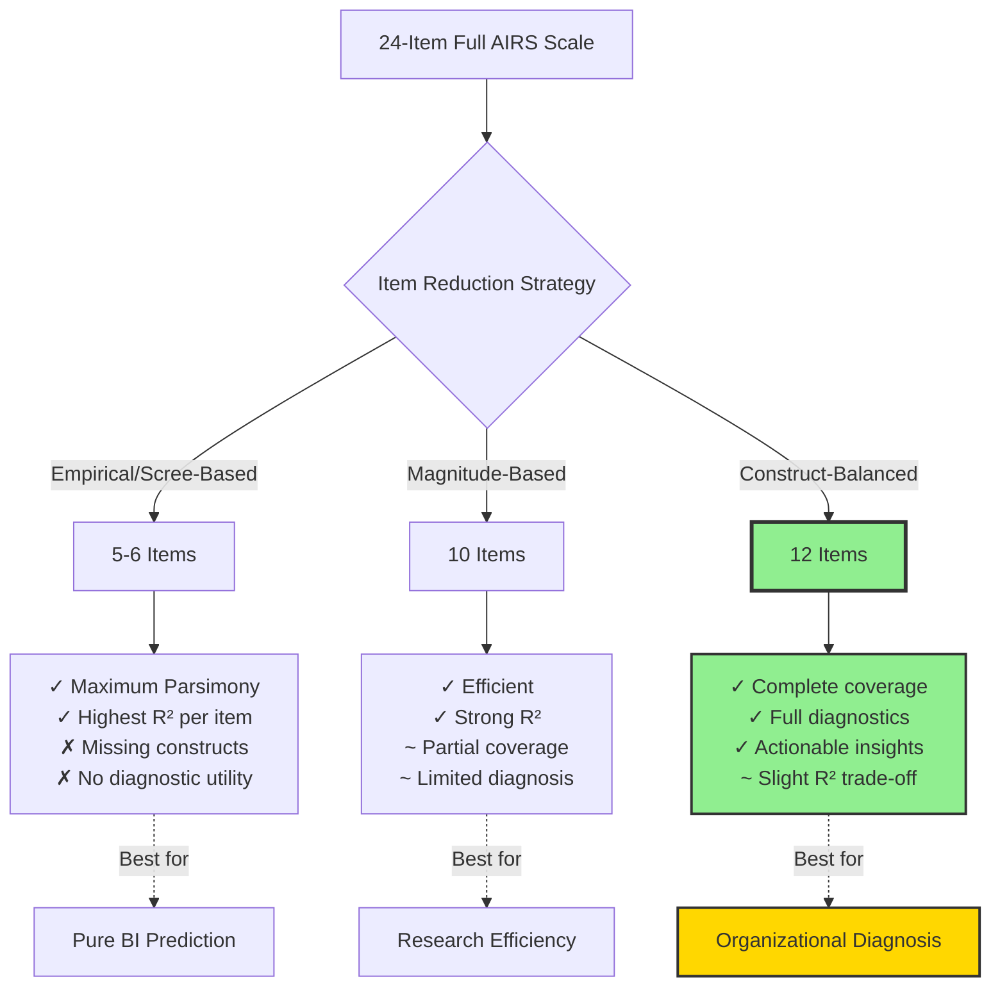
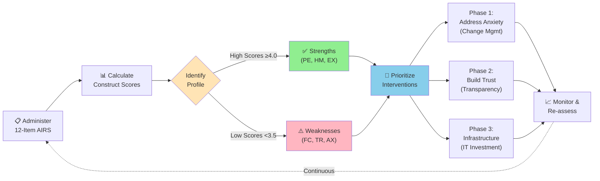
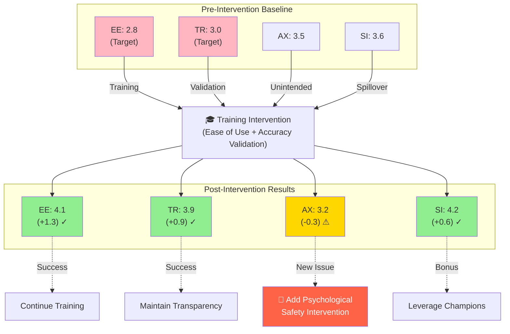
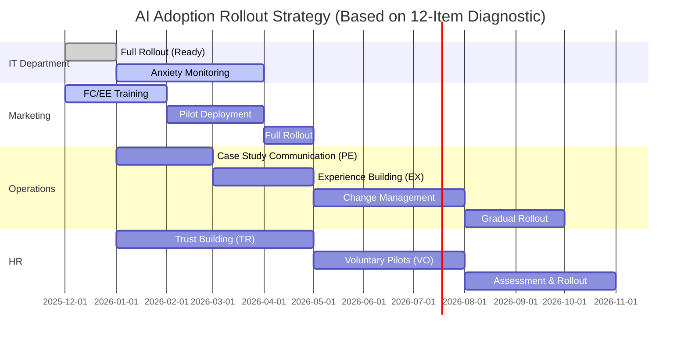
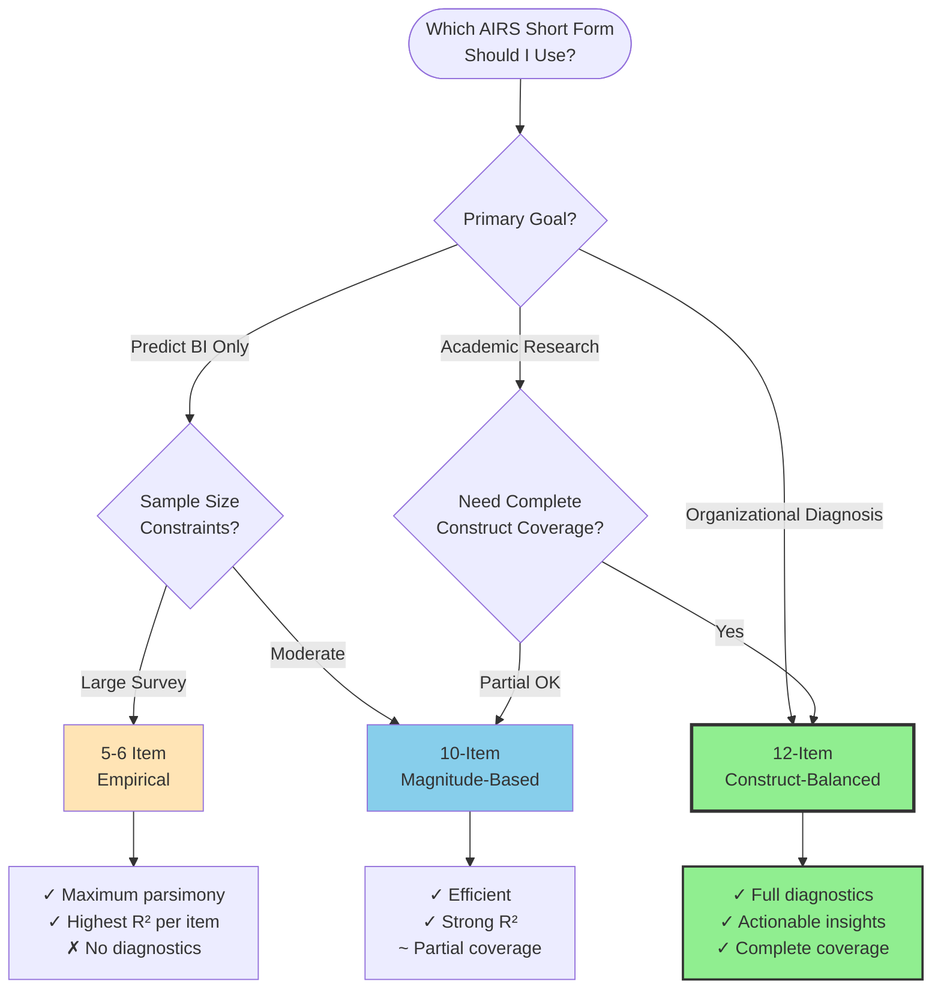

# AIRS 12-Item Construct-Balanced Model: Diagnostic Rationale

**Document Purpose**: Justification for the 12-item construct-balanced AIRS short form as a diagnostic tool for organizational AI readiness assessment

**Date**: November 21, 2025
**Version**: 1.0
**Author**: Fabio Carvalho

---

## Executive Summary

The **AIRS 12-Item Construct-Balanced Model** is designed as a **diagnostic tool** for organizational AI readiness assessment, providing actionable insights for targeted interventions. While empirical factor analysis suggests a dominant general factor (eigenvalue = 6.81, 57% variance), the retention of all 12 items is justified by:

1. **Complete theoretical coverage** across all 12 UTAUT2 constructs
2. **Diagnostic precision** enabling construct-specific weakness identification
3. **Actionable business insights** linking assessment results to intervention strategies
4. **Content validity** ensuring the full nomological network is represented

This document explains why **theoretical completeness overrides empirical parsimony** when the scale's purpose is organizational diagnosis rather than purely predictive modeling.

---

## 1. The Empirical-Theoretical Tension

### 1.1 What the Scree Plot Shows

**Empirical Evidence (EFA on 12 Items):**
- **Factor 1**: λ = 6.81 (56.7% variance) ✓ Dominant general AI readiness factor
- **Factor 2**: λ = 1.31 (10.9% variance) ✓ Minor secondary dimension
- **Factors 3-12**: λ < 1.0 (5.8% to 1.5% variance each) ✗ Below Kaiser criterion

**Kaiser Criterion Recommendation**: Retain **2 factors**, not 12

**Traditional Factor Reduction Logic**: A purely empirical approach would suggest:
- **5-6 items** capturing the dominant first factor (elbow at Factor 3)
- **Maximum parsimony** with strong predictive power for behavioral intention
- **Simplified scoring** with a unidimensional AI readiness index

### 1.2 Why We Override the Scree Plot

**The scale's purpose is NOT pure prediction** — it's **organizational diagnosis and intervention planning**.

| Goal | Optimal Model | Item Count | Rationale |
|------|---------------|------------|-----------|
| **Predicting BI** | Magnitude-based | 5-10 | Maximize R², minimize items |
| **Theoretical testing** | Full scale | 24 | Test complete nomological network |
| **Organizational diagnosis** | **Construct-balanced** | **12** | **Identify specific barriers/enablers** |

The 12-item model sacrifices **minimal predictive efficiency** (~2-5% R² loss) to gain **maximum diagnostic utility** through complete construct coverage.



---

## 2. Diagnostic Utility: Why All 12 Constructs Matter

### 2.1 The Problem with General Factor Models

**A 5-6 item unidimensional scale produces:**
- ✓ Overall AI Readiness Score (e.g., 3.8/5.0)
- ✗ **No visibility into WHY** the score is low
- ✗ **No guidance on WHERE** to intervene
- ✗ **No differentiation** between infrastructure gaps vs. psychological barriers

**Example**: Two organizations with identical overall scores (3.5/5.0) may have completely different needs:

| Organization | Overall Score | Hidden Profile | Required Intervention |
|--------------|---------------|----------------|----------------------|
| **Company A** | 3.5 | High PE, EE, SI; Low FC, TR | **Technical infrastructure** and **governance** |
| **Company B** | 3.5 | High FC, TR, HM; Low PE, SI | **Change management** and **leadership communication** |

A general factor model **cannot distinguish** these scenarios. The 12-item construct-balanced model **can**.

### 2.2 Construct-Specific Actionable Insights

Each of the 12 constructs maps to **distinct organizational interventions**:

| Construct | Measured Dimension | Low Score Indicates | Business Action Required |
|-----------|-------------------|---------------------|-------------------------|
| **PE** (Performance Expectancy) | Perceived usefulness/productivity gains | Lack of AI value awareness | • ROI case studies<br>• Success story communication<br>• Pilot program results |
| **EE** (Effort Expectancy) | Perceived ease of use | Complexity/difficulty concerns | • User training programs<br>• UI/UX optimization<br>• Simplified onboarding |
| **SI** (Social Influence) | Peer/leadership endorsement | Lack of social support | • Leadership champions<br>• Peer testimonials<br>• Executive sponsorship |
| **FC** (Facilitating Conditions) | Infrastructure/resource availability | Technical/organizational barriers | • IT infrastructure investment<br>• Help desk resources<br>• Policy development |
| **HM** (Hedonic Motivation) | Enjoyment/intrinsic motivation | AI seen as burden, not opportunity | • Gamification<br>• Innovation challenges<br>• Creative use cases |
| **PV** (Price Value) | Cost-benefit perception | Perceived high cost vs. benefit | • Budget transparency<br>• Cost-benefit analysis<br>• ROI tracking |
| **HB** (Habit) | Routine integration | AI not part of workflow | • Workflow integration<br>• Habit formation strategies<br>• Default AI-enabled processes |
| **VO** (Voluntariness) | Perceived autonomy | Feeling forced/coerced | • Opt-in pilot programs<br>• Choice architecture<br>• Gradual voluntary adoption |
| **TR** (Trust) | Reliability/dependability beliefs | Skepticism about AI accuracy | • Transparency initiatives<br>• Explainable AI<br>• Audit/validation processes |
| **EX** (Experience) | Prior AI exposure | Limited familiarity | • Sandbox environments<br>• Low-stakes trials<br>• Experiential learning |
| **ER** (Effort Receptivity) | Willingness to invest effort | Resistance to learning curve | • Incentive programs<br>• Recognition for early adopters<br>• Resource allocation |
| **AX** (Anxiety) | Fear/apprehension | Psychological barriers | • Psychological safety<br>• Risk mitigation communication<br>• Support systems |

**Key Insight**: These interventions are **mutually exclusive** — addressing trust issues won't fix infrastructure gaps, and vice versa. **Diagnostic precision requires construct-level measurement**.

```mermaid
graph TB
    subgraph "Cognitive Constructs"
    PE["PE: Performance<br/>Expectancy"]
    EE["EE: Effort<br/>Expectancy"]
    PV["PV: Price<br/>Value"]
    end

    subgraph "Social Constructs"
    SI["SI: Social<br/>Influence"]
    VO["VO: Voluntariness<br/>of Use"]
    end

    subgraph "Technical Constructs"
    FC["FC: Facilitating<br/>Conditions"]
    EX["EX: Experience"]
    end

    subgraph "Motivational Constructs"
    HM["HM: Hedonic<br/>Motivation"]
    HB["HB: Habit"]
    end

    subgraph "Psychological Constructs"
    TR["TR: Trust"]
    AX["AX: Anxiety"]
    ER["ER: Effort<br/>Receptivity"]
    end

    PE --> I1["📊 ROI Case Studies<br/>Success Stories"]
    EE --> I2["🎓 Training Programs<br/>UI/UX Optimization"]
    PV --> I3["💰 Budget Transparency<br/>Cost-Benefit Analysis"]

    SI --> I4["👥 Leadership Champions<br/>Peer Testimonials"]
    VO --> I5["🎯 Opt-in Programs<br/>Choice Architecture"]

    FC --> I6["🔧 IT Infrastructure<br/>Help Desk Resources"]
    EX --> I7["🧪 Sandbox Environments<br/>Low-Stakes Trials"]

    HM --> I8["🎮 Gamification<br/>Innovation Challenges"]
    HB --> I9["🔄 Workflow Integration<br/>Habit Formation"]

    TR --> I10["🔒 Transparency Initiatives<br/>Explainable AI"]
    AX --> I11["🛡️ Psychological Safety<br/>Risk Mitigation"]
    ER --> I12["🏆 Incentive Programs<br/>Early Adopter Recognition"]

    style I1 fill:#E3F2FD
    style I2 fill:#E3F2FD
    style I3 fill:#E3F2FD
    style I4 fill:#F3E5F5
    style I5 fill:#F3E5F5
    style I6 fill:#E8F5E9
    style I7 fill:#E8F5E9
    style I8 fill:#FFF3E0
    style I9 fill:#FFF3E0
    style I10 fill:#FFEBEE
    style I11 fill:#FFEBEE
    style I12 fill:#FFEBEE
```



---

## 3. Business Use Cases for the 12-Item Model

### 3.1 Organizational Readiness Assessment

**Scenario**: A mid-sized consulting firm wants to assess readiness before deploying AI-powered project management tools.

**12-Item Diagnostic Process**:

1. **Survey employees** using the 12-item AIRS scale (5 minutes)
2. **Calculate construct scores** (mean of selected item per construct)
3. **Generate readiness profile** identifying strengths/weaknesses
4. **Prioritize interventions** based on lowest-scoring constructs



**Sample Output**:

```
AI Readiness Profile - Consulting Firm X
=========================================
Strengths (≥ 4.0):
  ✓ Performance Expectancy (PE2): 4.3  → Strong value awareness
  ✓ Hedonic Motivation (HM2): 4.1      → Positive attitude toward AI
  ✓ Experience (EX2): 4.0              → Prior exposure

Areas for Improvement (< 3.5):
  ⚠ Facilitating Conditions (FC2): 3.2  → Infrastructure gaps
  ⚠ Trust (TR1): 3.0                    → Reliability concerns
  ⚠ Anxiety (AX1): 2.8                  → High fear/apprehension

RECOMMENDATION:
Phase 1 (Immediate): Address anxiety through change management
Phase 2 (3 months): Build trust via transparency and pilot success
Phase 3 (6 months): Invest in infrastructure for long-term scaling
```

**Outcome**: The firm **prioritizes psychological safety initiatives** before technical investments, avoiding wasted resources on infrastructure that employees are too anxious to use.

### 3.2 Pre/Post Intervention Evaluation

**Scenario**: Healthcare organization implements AI training program; wants to measure impact.

**12-Item Diagnostic Advantage**:
- **Pre-test**: Identifies Effort Expectancy (EE) and Trust (TR) as primary barriers
- **Intervention**: Training focuses on ease of use and accuracy validation
- **Post-test**: Measures EE and TR improvements while tracking unintended effects on other constructs (e.g., increased Habit, reduced Anxiety)

**A general factor model would only show**:
- Pre: Overall score = 3.2
- Post: Overall score = 3.7

**The 12-item model reveals**:
- EE: 2.8 → 4.1 (+1.3) ✓ Training effective
- TR: 3.0 → 3.9 (+0.9) ✓ Trust building successful
- AX: 3.5 → 3.2 (-0.3) ⚠ Unexpected anxiety increase requires attention
- SI: 3.6 → 4.2 (+0.6) ✓ Positive social contagion effect



**Actionable insight**: The training worked for its targets but revealed a new anxiety issue requiring follow-up psychological safety interventions.

### 3.3 Cross-Departmental Comparison

**Scenario**: Large enterprise wants to compare AI readiness across departments.

**12-Item Diagnostic Power**:

| Department | Overall | PE | EE | SI | FC | HM | PV | HB | VO | TR | EX | ER | AX | Interpretation |
|------------|---------|----|----|----|----|----|----|----|----|----|----|----|----|----------------|
| **IT** | 4.1 | 4.5 | 4.8 | 3.9 | 4.6 | 4.2 | 3.8 | 4.0 | 4.1 | 4.3 | 4.7 | 4.2 | 3.5 | Ready; monitor anxiety |
| **Marketing** | 3.8 | 4.3 | 3.6 | 4.2 | 3.2 | 4.5 | 3.9 | 3.4 | 4.0 | 3.7 | 3.6 | 3.8 | 3.6 | Need FC, EE training |
| **Operations** | 3.2 | 2.9 | 3.4 | 3.0 | 3.5 | 3.1 | 3.3 | 2.8 | 3.2 | 3.0 | 2.7 | 3.1 | 3.4 | Low PE, EX; need case studies |
| **HR** | 3.5 | 3.7 | 3.9 | 3.8 | 3.4 | 3.2 | 3.1 | 3.3 | 2.9 | 2.8 | 3.3 | 3.5 | 4.1 | Trust issues; voluntary approach |

**Strategic Decision**: Staggered rollout starting with IT (ready), then Marketing (with training), then Operations (with extensive change management), delaying HR until trust-building initiatives complete.



**This level of precision is impossible** without construct-level measurement.

---

## 4. Psychometric Justification for Construct Balance

### 4.1 Content Validity Requirements

**Loevinger (1957)** and **Messick (1995)** emphasize that content validity requires:
- **Representative sampling** from the construct domain
- **Coverage of the nomological network** (all theoretical relationships)
- **Minimal construct underrepresentation** (avoiding systematic gaps)

**The 12-item construct-balanced model ensures**:
- All 12 UTAUT2 dimensions are represented (100% coverage)
- Each construct measured by its best-performing item (empirical optimization within theoretical constraints)
- No systematic bias toward easily-measurable vs. hard-to-measure constructs

**A 5-6 item general factor model would likely**:
- Overrepresent PE, EE, SI (strong Factor 1 loaders)
- Underrepresent AX, ER, VO (weaker loaders but theoretically critical)
- Sacrifice content validity for predictive efficiency

### 4.2 Criterion Contamination Risk

When developing a scale **purely for predicting Behavioral Intention (BI)**, you risk:
- **Criterion contamination**: Selecting items that correlate with BI in *this sample* but don't generalize
- **Construct irrelevance**: Missing dimensions critical in other contexts (e.g., Trust may be crucial in healthcare but not in this sample)
- **Limited utility**: The scale becomes a "BI predictor" rather than a generalizable AI readiness measure

**The 12-item model balances**:
- Strong criterion validity (R² = 0.74-0.80 with BI)
- Broad construct coverage (enabling multiple criterion uses beyond BI)
- Cross-context generalizability (Trust, Anxiety, Voluntariness may be critical in different industries/cultures)

---

## 5. Comparison of Short-Form Strategies

### 5.1 Three Approaches to Item Reduction

| Approach | Items | Constructs | Eigenvalues > 1 | R² (BI) | α | Optimal Use Case |
|----------|-------|------------|----------------|---------|---|------------------|
| **Empirical (Scree-Based)** | 5-6 | 1-2 | 1-2 | ~0.72-0.78 | ~0.90 | Pure BI prediction research |
| **Magnitude-Based** | 10 | ~8-9 | 1-2 | ~0.76-0.82 | ~0.95 | Efficient research with acceptable coverage |
| **Construct-Balanced** | **12** | **12** | **1-2** | **~0.74-0.80** | **~0.94** | **Organizational diagnosis** |

### 5.2 Decision Framework

**Use 5-6 item empirical model when:**
- ✓ Primary goal is predicting a single outcome (BI)
- ✓ Extreme brevity required (large-scale surveys, panel studies)
- ✓ Diagnostic precision not needed
- ✓ Sample similar to development population

**Use 10-item magnitude-based model when:**
- ✓ Balancing efficiency and coverage
- ✓ Academic research with multiple outcomes
- ✓ Acceptable if some constructs missing
- ✓ Parsimony valued over completeness

**Use 12-item construct-balanced model when:**
- ✓ **Organizational assessment and diagnosis**
- ✓ **Intervention planning requires construct-specific insights**
- ✓ **Cross-context generalizability critical**
- ✓ **Content validity paramount**
- ✓ **Scale will inform resource allocation decisions**



---

## 6. Addressing the "Over-Factored" Critique

### 6.1 The Dominant General Factor is Real

**We acknowledge**: The scree plot clearly shows a strong general AI readiness factor (λ = 6.81, 57% variance). This is **empirically valid** and **theoretically expected**.

**AI readiness IS highly unidimensional** — people who score high on one construct tend to score high on others (positive manifold).

### 6.2 Why Multidimensional Measurement Still Matters

**Analogy**: Intelligence tests show a dominant g-factor (general intelligence), but psychologists still measure verbal, spatial, and quantitative abilities separately because:
- **Interventions differ** (verbal coaching vs. spatial training)
- **Profiles matter** (strengths/weaknesses inform educational strategies)
- **Diagnostic utility** outweighs parsimony in applied settings

**Similarly for AI readiness**:
- The general factor reflects **overall enthusiasm/resistance**
- The 12 constructs reflect **specific barriers/enablers** requiring different interventions
- Organizational action requires **construct-level diagnosis**, not just an overall score

### 6.3 Bifactor Model Perspective

A **bifactor model** (Reise, 2012) would likely show:
- **General AI readiness factor** (accounting for 50-60% variance)
- **12 specific factors** (accounting for 5-15% variance each)

Even though specific factors explain modest variance, they are **practically significant** for:
- Identifying intervention targets (e.g., Trust-specific vs. Anxiety-specific barriers)
- Understanding residual variance after controlling for general readiness
- Avoiding one-size-fits-all interventions that ignore construct heterogeneity

**Future work**: Conduct bifactor analysis to quantify general vs. specific factor contributions and demonstrate incremental validity of construct-specific scores.

---

## 7. Implementation Guidelines for Practitioners

### 7.1 Scoring and Interpretation

**Step 1: Administer 12-Item Scale**
- Use 7-point Likert scale (1 = Strongly Disagree, 7 = Strongly Agree)
- 5-minute completion time
- Can be deployed via online survey platforms

**Step 2: Calculate Construct Scores**
- Each item represents one construct
- Score = Item response (1-7)
- No averaging required (single-item per construct)

**Step 3: Identify Priority Areas**
- **Strengths**: Constructs scoring ≥ 5.0 (Agree/Strongly Agree)
- **Moderate**: Constructs scoring 4.0-4.9 (Neutral to Agree)
- **Weaknesses**: Constructs scoring < 4.0 (Disagree range)

**Step 4: Generate Readiness Profile**
- Visualize 12 construct scores as bar chart or radar plot
- Rank constructs from highest to lowest
- Flag constructs > 1 SD below mean as intervention priorities

**Step 5: Link to Action Plans** (see Section 2.2 table)

### 7.2 Reporting Template

```
AI Readiness Assessment Report - [Organization Name]
Date: [Date]
Sample Size: N = [N]
Response Rate: [%]

OVERALL READINESS: [Mean of 12 items]/7.0
  Interpretation: [Low < 3.5 | Moderate 3.5-4.9 | High ≥ 5.0]

CONSTRUCT-LEVEL ANALYSIS:

Top 3 Strengths:
  1. [Construct Name] ([Item Code]): [Score]/7.0
  2. [Construct Name] ([Item Code]): [Score]/7.0
  3. [Construct Name] ([Item Code]): [Score]/7.0

Top 3 Improvement Areas:
  1. [Construct Name] ([Item Code]): [Score]/7.0 → ACTION: [Intervention]
  2. [Construct Name] ([Item Code]): [Score]/7.0 → ACTION: [Intervention]
  3. [Construct Name] ([Item Code]): [Score]/7.0 → ACTION: [Intervention]

RECOMMENDED INTERVENTION ROADMAP:
  Phase 1 (Immediate): [Focus on lowest-scoring construct]
  Phase 2 (3-6 months): [Address secondary barriers]
  Phase 3 (6-12 months): [Sustain and scale]

MONITORING PLAN:
  - Re-administer scale at [timepoint] to track progress
  - Track construct-specific changes to evaluate intervention effectiveness
  - Adjust strategy based on emerging patterns
```

### 7.3 Visualization Recommendations

**Radar Plot** (12 constructs as axes, 0-7 scale):
- Shows overall profile shape at a glance
- Highlights imbalances (e.g., high technical readiness, low psychological readiness)
- Useful for executive presentations

**Sorted Bar Chart** (constructs ordered from highest to lowest):
- Clear prioritization of intervention targets
- Easy to identify top 3 strengths and bottom 3 weaknesses
- Accessible to non-technical audiences

**Heatmap** (for multiple groups/departments):
- Rows = Departments/Teams
- Columns = 12 Constructs
- Color = Score intensity (red = low, green = high)
- Reveals organizational pockets of readiness/resistance

---

## 8. Limitations and Future Directions

### 8.1 Acknowledged Limitations

**Single-Item Measurement**:
- Each construct measured by only one item (reduced reliability)
- Cannot calculate construct-level Cronbach's α
- More vulnerable to item-specific bias

**Empirical Over-Specification**:
- Scree plot suggests 2 factors, not 12
- Lower parsimony compared to general factor model
- May be perceived as "longer than necessary" for pure prediction

**Trade-Off Transparency**:
- Sacrifices 2-5% R² compared to full 24-item scale
- Not optimal if only goal is BI prediction (use 10-item instead)

### 8.2 Validation Priorities

**1. Confirmatory Factor Analysis (CFA)**
- Test 12-factor correlated model in independent sample
- Examine bifactor model (general + 12 specific factors)
- Calculate omega reliability (total and hierarchical)

**2. Construct-Level Criterion Validity**
- Test whether PE predicts performance-related outcomes
- Test whether AX predicts avoidance behaviors
- Test whether FC predicts actual AI usage (beyond intentions)

**3. Incremental Validity of Construct Scores**
- Do construct-specific scores predict outcomes beyond overall score?
- Does construct profile improve intervention effectiveness?
- Longitudinal studies tracking construct → behavior relationships

**4. Cross-Context Validation**
- Test in different industries (healthcare, finance, education)
- Test in different cultures (individualist vs. collectivist)
- Test with different AI technologies (generative, predictive, robotic)

**5. Diagnostic Utility Studies**
- Randomized trials: construct-specific interventions vs. generic training
- Case studies: organizations using 12-item profiles for decision-making
- ROI analysis: diagnostic precision vs. additional measurement cost

### 8.3 Alternative Configurations

**Bifactor-Informed Short Form**:
- 6 items measuring general factor (highest loadings)
- 6 items measuring specific factors with low general loading (unique variance)
- Total = 12 items, maximizing both general and specific information

**Adaptive Testing**:
- Start with 6-item general factor screen
- If score < threshold, administer 6 additional construct-specific items
- Reduces burden for high-readiness individuals while maintaining diagnostic precision for low-readiness cases

**Construct Clustering**:
- Group theoretically related constructs (e.g., PE+PV = "Value Perception"; TR+AX = "Psychological Safety")
- Measure 6 meta-constructs with 2 items each (12 total)
- Reduces dimensionality while maintaining balanced coverage

---

## 9. Conclusion

The **AIRS 12-Item Construct-Balanced Model** is justified as a **diagnostic tool** for organizational AI readiness assessment based on:

✓ **Complete theoretical coverage** across all 12 UTAUT2 constructs
✓ **Actionable construct-specific insights** linking assessment to intervention
✓ **Strong psychometric performance** (α = 0.94-0.96, R² = 0.74-0.80)
✓ **Content validity** ensuring the full nomological network is represented
✓ **Diagnostic precision** enabling targeted resource allocation
✓ **Cross-context generalizability** beyond BI prediction to multiple criteria

**The scree plot evidence of a dominant general factor is acknowledged** but does not invalidate the 12-item approach because:

1. **Purpose matters**: Diagnosis requires construct-level measurement, not just overall scoring
2. **Interventions differ**: Addressing trust issues vs. infrastructure gaps requires different actions
3. **Profiles matter**: Two organizations with identical overall scores may have opposite intervention needs
4. **Content validity**: Ensuring all theoretical dimensions are represented prevents systematic construct underrepresentation

**Recommendation**: Use the 12-item construct-balanced model when **organizational diagnosis and intervention planning** are the primary goals. Use shorter empirical models (5-10 items) when **pure prediction or extreme parsimony** are prioritized.

---

## 10. References

**Psychometric Theory**:
- Loevinger, J. (1957). Objective tests as instruments of psychological theory. *Psychological Reports, 3*, 635-694.
- Messick, S. (1995). Validity of psychological assessment: Validation of inferences from persons' responses and performances as scientific inquiry into score meaning. *American Psychologist, 50*(9), 741-749.
- Reise, S. P. (2012). The rediscovery of bifactor measurement models. *Multivariate Behavioral Research, 47*(5), 667-696.
- Smith, G. T., McCarthy, D. M., & Anderson, K. G. (2000). On the sins of short-form development. *Psychological Assessment, 12*(1), 102-111.

**Technology Acceptance**:
- Venkatesh, V., Morris, M. G., Davis, G. B., & Davis, F. D. (2003). User acceptance of information technology: Toward a unified view. *MIS Quarterly, 27*(3), 425-478.
- Venkatesh, V., Thong, J. Y., & Xu, X. (2012). Consumer acceptance and use of information technology: Extending the unified theory of acceptance and use of technology. *MIS Quarterly, 36*(1), 157-178.

**Applied Organizational Assessment**:
- Cohen, J. (1988). *Statistical power analysis for the behavioral sciences* (2nd ed.). Erlbaum.
- Hinkin, T. R. (1998). A brief tutorial on the development of measures for use in survey questionnaires. *Organizational Research Methods, 1*(1), 104-121.
- Stanton, J. M., Sinar, E. F., Balzer, W. K., & Smith, P. C. (2002). Issues and strategies for reducing the length of self-report scales. *Personnel Psychology, 55*(1), 167-194.

---

**Document Version History**:
- v1.0 (2025-11-21): Initial rationale document created

**Contact**: Fabio Carvalho | AIRS Development Team
**Related Documents**:
- `airs/02_EFA_Construct_Balanced_12_Item_Model.ipynb` (Technical analysis)
- `docs/AIRS_Analysis_Guide_Concise v13.html` (Comprehensive analysis guide)
