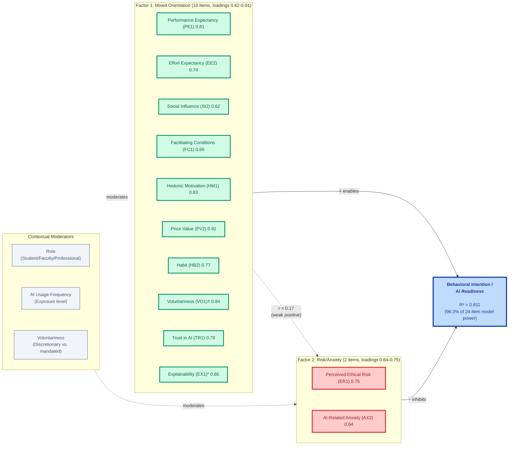

# AIRS Empirical Model (Phase 1 Findings) - Mermaid Diagram

## 2-Factor Structure from Exploratory Factor Analysis
**N=159 • R² = 0.811 • Cronbach's α = 0.897 • 96.3% efficiency vs. 24-item model**

---

## Key Findings

### Empirical Structure
**12 theoretical constructs converge into 2 empirical dimensions:**
- **Factor 1 (Mixed Orientation)**: 10 items with loadings 0.62-0.91 (PE1, EE2, SI2, FC1, HM1, PV2, HB2, VO1, TR1, EX1)
- **Factor 2 (Risk/Anxiety)**: 2 items with loadings 0.64-0.75 (ER1, AX2)

### Statistical Performance
- **Variance Explained**: 58.1% total (F1: 49.4%, F2: 8.7%)
- **Internal Consistency**: Cronbach's α = 0.897 (excellent)
- **Predictive Validity**: R² = 0.811 (strong)
- **Measurement Efficiency**: 96.3% of 24-item model power with 50% fewer items
- **Inter-factor Correlation**: r = 0.17 (weak positive, supporting discriminant validity)

### Practical Implications
- **Diagnostic granularity preserved**: 12 items allow targeted organizational interventions
- **Predictive parsimony achieved**: 2-factor structure provides parsimonious predictive model
- **Dual utility**: Organizations can assess specific gaps while using simplified model for prediction

### Unexpected Finding
**†Voluntariness (VO1)** serves dual role as both factor item and contextual moderator

**\*Explainability (EX1)** loaded on Factor 1 (0.66) alongside other UTAUT2 and enabler constructs, contrary to initial theoretical expectation of loading with barriers. This suggests perceived AI transparency functions as a readiness facilitator rather than a friction point in this sample.

---

## Phase 2 Next Steps
- Confirmatory Factor Analysis (CFA) on independent holdout sample (N=159)
- Validate 2-factor measurement model
- Investigate Explainability unexpected loading
- Test measurement invariance across role and usage frequency groups
