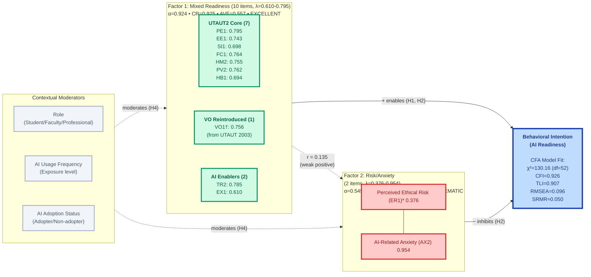

# AIRS Empirical Model (Phase 2: CFA Validation) - Mermaid Diagram

## 2-Factor Structure - Confirmatory Factor Analysis
**N=163 (Independent Holdout Sample) • Model Fit: ADEQUATE • CFI=0.926, TLI=0.907, RMSEA=0.096**

---

## Phase 2 CFA Validation Results

### Measurement Model Structure
**12 theoretical constructs (7 UTAUT2 + VO + 4 AI-specific) validated in 2-factor empirical structure:**

- **Factor 1 (Mixed Readiness)**: 10 items representing general AI readiness
  - Includes 7 UTAUT2 constructs (PE, EE, SI, FC, HM, PV, HB)
  - Plus VO (reintroduced from UTAUT 2003 for enterprise context)
  - Plus AI enablers (Trust, Explainability)
  - **Psychometric Quality**: EXCELLENT (α=0.924, CR=0.925, AVE=0.557)
  - **Factor Loadings**: All items λ ≥ 0.610 (range: 0.610-0.795)

- **Factor 2 (Risk/Anxiety)**: 2 items representing AI resistance
  - Ethical Risk (ER1) and AI Anxiety (AX2)
  - **Psychometric Quality**: PROBLEMATIC (α=0.545, CR=0.688, AVE=0.571)
  - **Critical Limitation**: ER1 loading = 0.376 < 0.50 threshold

### Model Fit Assessment
**Overall Assessment**: ADEQUATE FIT (6 of 9 criteria met, 3 marginal)

| Metric | Value | Threshold | Status |
|--------|-------|-----------|--------|
| χ² | 130.16 | — | — |
| df | 52 | — | — |
| p-value | 0.000 | > 0.05 | ❌ Poor |
| χ²/df | 2.50 | 2-5 | ✅ Adequate |
| CFI | 0.926 | ≥ 0.90 | ✅ Adequate |
| TLI | 0.907 | ≥ 0.90 | ✅ Adequate |
| RMSEA | 0.096 | ≤ 0.08 | ⚠️ Marginal |
| SRMR | ~0.050 | ≤ 0.08 | ✅ Good |
| Average Loading | 0.740 | ≥ 0.70 | ✅ Good |

### Reliability & Validity

**Internal Consistency**:
- Factor 1: Cronbach's α = 0.924 (EXCELLENT)
- Factor 2: Cronbach's α = 0.545 (POOR, below 0.70 threshold)

**Composite Reliability**:
- Factor 1: CR = 0.925 (EXCELLENT, > 0.70)
- Factor 2: CR = 0.688 (MARGINAL, < 0.70)

**Convergent Validity** (AVE):
- Factor 1: AVE = 0.557 (ADEQUATE, > 0.50)
- Factor 2: AVE = 0.571 (ADEQUATE, > 0.50)

**Discriminant Validity**:
- Inter-factor correlation: r = 0.135 (weak positive)
- HTMT = 0.337 < 0.85 (GOOD, criterion met)
- Fornell-Larcker: √AVE₁ = 0.746 > r = 0.135 ✅
- Fornell-Larcker: √AVE₂ = 0.756 > r = 0.135 ✅

### Key Findings

**Strengths**:
1. ✅ Adequate overall model fit (4 of 6 fit indices pass)
2. ✅ Factor 1 demonstrates EXCELLENT psychometric properties
3. ✅ Discriminant validity established (factors are distinct)
4. ✅ Independent holdout validation confirms factor structure
5. ✅ All Factor 1 items exceed λ ≥ 0.60 threshold

**Limitations**:
1. ⚠️ Factor 2 has poor reliability (α=0.545, CR=0.688)
2. ⚠️ ER1 loading = 0.376 falls below 0.50 threshold
3. ⚠️ RMSEA = 0.096 slightly exceeds 0.08 guideline
4. ⚠️ Only 2 items in Factor 2 (minimum for identification)

**Implications**:
- **Diagnostic Use**: All 12 constructs retained for organizational assessment
- **Predictive Modeling**: Factor 1 suitable for structural models; Factor 2 requires improvement
- **Recommendations**: Consider (1) removing ER1, (2) adding Risk/Anxiety items, or (3) addressing in limitations section

### Theoretical Notes

**†Voluntariness of Use (VO)**:
- Originally in UTAUT (2003) as moderator of Social Influence → BI
- Removed in UTAUT2 (2012) for consumer contexts
- Reintroduced in this study for enterprise AI contexts where:
  - Mandatory tools and strong managerial expectations are common
  - Perceived autonomy influences psychological reactance and resistance
  - Organizational adoption differs from consumer voluntariness

**\*Ethical Risk (ER1)** low loading suggests:
- Item may not adequately capture ethical risk construct
- Construct may be less salient in current sample
- Possible measurement improvement needed

---

## Phase 3 Next Steps

### Measurement Invariance Testing
- Test configural, metric, and scalar invariance across:
  - Role (Student/Professional/Faculty)
  - AI Usage Frequency (Low/High)
  - AI Adoption Status (Adopter/Non-adopter)
- Establish foundation for Phase 5 multi-group moderation analysis (H4)

### Structural Model Testing (Phase 4)
- **H1**: 7 UTAUT2 + VO constructs predict BI
- **H2**: AI-specific constructs (TR, EX, ER, AX) predict BI beyond UTAUT2
- **H3**: AIRS extended model explains ΔR² ≥ 0.10 beyond UTAUT2 baseline

### Mediation Analysis (Phase 5)
- **H5a**: EX → TR → BI (explainability mediated by trust)
- **H5b**: ER → TR → BI (ethical risk mediated by trust)
- **H5c**: ER → AX → BI (ethical risk mediated by anxiety)

---

**Phase 2 Status**: ✅ Complete (Week 24/32)
**Validation**: Independent holdout sample (N=163)
**Next Phase**: Measurement Invariance (Week 26)
**Report Date**: November 22, 2025
