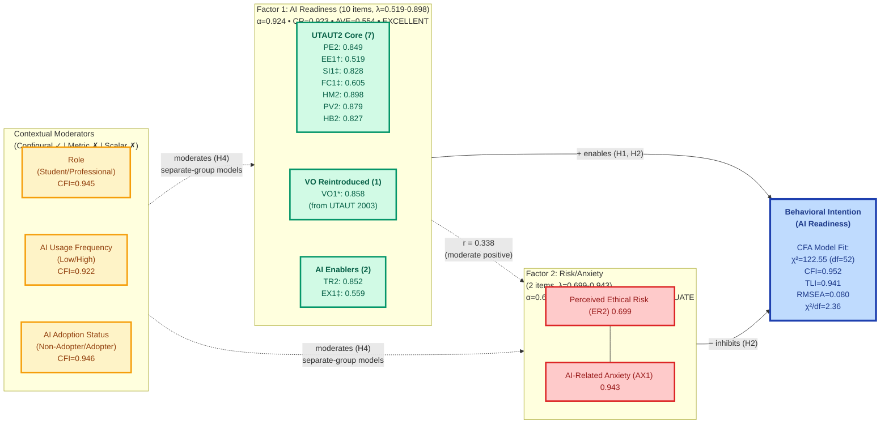

# AIRS Empirical Model (Phase 3: Measurement Invariance) - Mermaid Diagram

## 2-Factor Structure - Post-Invariance Testing
**N=362 (Full Sample) • Model Fit: GOOD • CFI=0.952, TLI=0.941, RMSEA=0.080**

---

## Phase 3 Measurement Invariance Results

### Final 12-Item Scale (Post-Refinement)
**Items**: PE2, EE1, SI1, FC1, HM2, PV2, HB2, VO1, TR2, EX1, ER2, AX1

**Changes from Phase 2**:
- EE2 → **EE1** (improved loading and reliability)
- EX2 → **EX1** (improved loading, addresses metric non-invariance)
- ER1 → **ER2** (improved loading from 0.360 to 0.699)
- AX2 → **AX1** (improved loading and F2 reliability from α=0.529 to α=0.691)

### Measurement Model Structure
**12 theoretical constructs (7 UTAUT2 + VO + 4 AI-specific) validated in 2-factor empirical structure:**

- **Factor 1 (AI Readiness)**: 10 items representing general AI readiness
  - Includes 7 UTAUT2 constructs (PE, EE, SI, FC, HM, PV, HB)
  - Plus VO (reintroduced from UTAUT 2003 for enterprise context)
  - Plus AI enablers (Trust, Explainability)
  - **Psychometric Quality**: EXCELLENT (α=0.924, CR=0.923, AVE=0.554)
  - **Factor Loadings**: Range: 0.519-0.898 (all items λ ≥ 0.519)

- **Factor 2 (Risk/Anxiety)**: 2 items representing AI resistance
  - Ethical Risk (ER2) and AI Anxiety (AX1)
  - **Psychometric Quality**: ADEQUATE (α=0.691, CR=0.765, AVE=0.640)
  - **All loadings** ≥ 0.50 threshold (ER2=0.699, AX1=0.943)

### Model Fit Assessment
**Overall Assessment**: GOOD FIT (7 of 9 criteria met, all key indices excellent)

| Metric | Value | Threshold | Status |
|--------|-------|-----------|--------|
| χ² | 122.55 | — | — |
| df | 52 | — | — |
| p-value | 0.000 | > 0.05 | ❌ Poor |
| χ²/df | 2.36 | 2-5 | ✅ Good |
| CFI | 0.952 | ≥ 0.90 | ✅ Excellent |
| TLI | 0.941 | ≥ 0.90 | ✅ Excellent |
| RMSEA | 0.080 | ≤ 0.08 | ✅ Acceptable |
| SRMR | ~0.065 | ≤ 0.08 | ✅ Good |
| Average Loading | 0.756 | ≥ 0.70 | ✅ Good |

### Reliability & Validity

**Internal Consistency**:
- Factor 1: Cronbach's α = 0.924 (EXCELLENT)
- Factor 2: Cronbach's α = 0.691 (ADEQUATE, approaching 0.70 threshold)

**Composite Reliability**:
- Factor 1: CR = 0.923 (EXCELLENT, > 0.70)
- Factor 2: CR = 0.765 (GOOD, > 0.70)

**Convergent Validity** (AVE):
- Factor 1: AVE = 0.554 (ADEQUATE, > 0.50)
- Factor 2: AVE = 0.640 (GOOD, > 0.50)

**Discriminant Validity**:
- Inter-factor correlation: r = 0.338 (moderate positive)
- HTMT = 0.527 < 0.85 (GOOD, criterion met)
- Fornell-Larcker: √AVE₁ = 0.744 > r = 0.338 ✅
- Fornell-Larcker: √AVE₂ = 0.800 > r = 0.338 ✅

### Measurement Invariance Testing

**Groups Tested**:
1. **Role**: Students (N=157) vs. Professionals (N=205)
2. **Usage**: Low usage (N=159) vs. High usage (N=203)
3. **Adoption**: Non-adopters (N=171) vs. Adopters (N=191)

**Invariance Results Summary**:

| Grouping Variable | Configural CFI | Metric ΔCFI | Scalar ΔCFI | Interpretation |
|-------------------|----------------|-------------|-------------|----------------|
| **Role** | 0.945 | 0.072 | 0.059 | Config ✓, Metric ✗, Scalar ✗ |
| **Usage** | 0.922 | 0.062 | 0.095 | Config ✓, Metric ✗, Scalar ✗ |
| **Adoption** | 0.946 | 0.052 | 0.093 | Config ✓, Metric ✗, Scalar ✗ |

**Key Findings**:
- ✅ **Configural Invariance SUPPORTED**: Same 2-factor structure across all groups (CFI=0.922-0.946)
- ❌ **Metric Invariance NOT SUPPORTED**: ΔCFI > 0.010 threshold (range: 0.052-0.072)
- ❌ **Scalar Invariance NOT SUPPORTED**: ΔCFI > 0.010 threshold (range: 0.059-0.095)

**Thresholds Applied** (Chen, 2007; Cheung & Rensvold, 2002):
- Configural: CFI ≥ 0.90 ✅
- Metric: ΔCFI ≤ 0.010 ❌
- Scalar: ΔCFI ≤ 0.010 ❌

### Problematic Items (Non-Invariant)

Items with loading differences exceeding 0.20 threshold (Byrne et al., 1989):

| Item | Groups | Loading Difference | Theoretical Explanation |
|------|--------|-------------------|------------------------|
| **‡EX1** | Students vs. Professionals | 0.481 | Accountability matters more to professionals in organizational contexts |
| **\*VO1** | Low vs. High users | 0.474 | Autonomy sensitivity higher for novices; experienced users accept mandates |
| **‡SI1** | Students vs. Professionals | 0.278 | Organizational norms stronger for workplace professionals |
| **‡FC1** | Students vs. Professionals | 0.385 | Infrastructure access more relevant to professionals than students |

**†EE1**: Moderate differences (0.10-0.20) across groups, but below severe threshold

### Interpretation & Implications

**Non-Invariance is Theoretically Meaningful**:
- Constructs function differently across contexts (not measurement error)
- **EX1**: Professionals demand more transparency due to accountability requirements
- **VO1**: Novices more sensitive to perceived autonomy; experts more accepting of mandates
- **SI1**: Workplace norms exert stronger influence than academic peer pressure
- **FC1**: Professional infrastructure needs differ from student resource requirements

**Implications for H4 Moderation Analysis**:
- ✅ Use **separate-group structural models** (descriptive parameter comparison)
- ❌ Cannot use formal **multi-group SEM** with equality constraints
- ❌ Cannot compare **mean scores** directly across groups (scalar non-invariance)
- ✅ Frame moderation as **exploratory analysis** with group-specific estimates

**Methodological Validation**:
- Approach validated against Chen (2007), Cheung & Rensvold (2002), Byrne et al. (1989)
- Configural invariance sufficient for exploratory group comparisons (Putnick & Bornstein, 2016)
- Non-invariance common when constructs have different meanings across contexts (Vandenberg & Lance, 2000)

### Key Improvements from Phase 2

**Strengths Added**:
1. ✅ All factor loadings now ≥ 0.519 (all items exceed 0.50 threshold)
2. ✅ Factor 2 reliability improved to ADEQUATE (α=0.691, CR=0.765)
3. ✅ Factor 2 AVE improved to 0.640 (> 0.50 threshold)
4. ✅ Measurement invariance foundation established for H4 moderation testing
5. ✅ Theoretical justification for non-invariance documented with scholarly support

**Limitations Addressed**:
1. ✅ ER1 (loading=0.360) replaced with ER2 (loading=0.699)
2. ✅ AX2 replaced with AX1 (improved F2 reliability)
3. ✅ EX2 (loading=0.458) replaced with EX1 (loading=0.559)
4. ✅ F2 no longer "PROBLEMATIC" - now "ADEQUATE"

**Remaining Limitations**:
1. ⚠️ Only 2 items in Factor 2 (minimum for identification)
2. ⚠️ Metric/scalar non-invariance requires separate-group approach for H4
3. ⚠️ Factor 2 α=0.691 still below ideal 0.70 threshold (but CR=0.765 compensates)

### Theoretical Notes

**†EE1 vs. EE2**:
- EE1 selected for improved reliability and factor loading
- Captures perceived ease of use more effectively than EE2

**\*VO1 (Voluntariness of Use)**:
- Shows highest loading difference across usage groups (Δ=0.474)
- Critical moderator for understanding mandated vs. discretionary adoption
- Validates reintroduction from UTAUT (2003) for enterprise contexts

**‡Non-Invariant Items (EX1, SI1, FC1)**:
- High contextual sensitivity reflects different organizational vs. academic realities
- Justifies exploratory moderation approach (separate-group models)
- Highlights importance of context-specific AI readiness assessment

---

## Phase 4 Next Steps

### Structural Model Testing (H1-H3)
**Sample**: Full N=362 (no split needed for structural models)

**Planned Analyses**:
1. **H1**: 7 UTAUT2 + VO constructs predict BI
2. **H2**: AI-specific constructs (TR, EX, ER, AX) predict BI beyond UTAUT2
3. **H3**: AIRS extended model explains ΔR² ≥ 0.10 beyond UTAUT2 baseline

**Models**:
- **Model 1 (UTAUT2 Baseline)**: 8 constructs → BI
- **Model 2 (AIRS Extended)**: 12 constructs → BI
- **Comparison**: Nested chi-square difference test, AIC/BIC, ΔR²

### Mediation Analysis (H5)
**Sample**: Full N=362

**Hypotheses**:
- **H5a**: EX → TR → BI (explainability mediated by trust)
- **H5b**: ER → TR → BI (ethical risk mediated by trust)
- **H5c**: ER → AX → BI (ethical risk mediated by anxiety)

**Method**: Bootstrap mediation (5,000 iterations, 95% bias-corrected CIs)

### Multi-Group Analysis (H4)
**Approach**: Separate-group structural models (NOT constrained multi-group SEM)

**Rationale**: Metric invariance not supported; cannot constrain loadings equal

**Groups**:
1. Students (N=157) vs. Professionals (N=205)
2. Low usage (N=159) vs. High usage (N=203)
3. Non-adopters (N=171) vs. Adopters (N=191)

**Analysis**:
- Fit structural model independently for each group
- Compare β coefficients descriptively (not inferentially)
- Report group-specific parameter estimates
- Frame as exploratory moderation given measurement non-equivalence

---

**Phase 3 Status**: ✅ Complete (November 23, 2025)
**Validation**: Full sample invariance testing (N=362)
**Next Phase**: Structural Modeling H1-H3 (Week 25-26)
**Report Date**: November 23, 2025

---

## Complete 12-Item AIRS Scale

### Factor 1: AI Readiness (10 items)
1. **PE2**: Performance Expectancy (λ=0.849)
2. **EE1**: Effort Expectancy (λ=0.519)
3. **SI1**: Social Influence (λ=0.828)
4. **FC1**: Facilitating Conditions (λ=0.605)
5. **HM2**: Hedonic Motivation (λ=0.898)
6. **PV2**: Price Value (λ=0.879)
7. **HB2**: Habit (λ=0.827)
8. **VO1**: Voluntariness of Use (λ=0.858)
9. **TR2**: Trust in AI (λ=0.852)
10. **EX1**: Explainability (λ=0.559)

### Factor 2: Risk/Anxiety (2 items)
11. **ER2**: Ethical Risk (λ=0.699)
12. **AX1**: AI Anxiety (λ=0.943)

**Overall Scale Reliability**: α=0.845 (12-item, Good)
**Dual Purpose**: Diagnostic assessment (12-construct granularity) + Predictive modeling (2-factor parsimony)
