# AIRS Empirical Model (Phase 5: Mediation Analysis) - Mermaid Diagram

## Dual-Pathway Suppression Model - The Breakthrough Discovery
**N=362 (Full Sample) • Bootstrap Mediation (5000 iterations) • 100% Hypothesis Support (H5a-c)**

```mermaid
graph TB
    %% Styling
    classDef facilitatorBox fill:#d1fae5,stroke:#059669,stroke-width:3px,color:#065f46
    classDef barrierBox fill:#fecaca,stroke:#dc2626,stroke-width:3px,color:#991b1b
    classDef outcomeBox fill:#bfdbfe,stroke:#1e40af,stroke-width:4px,color:#1e3a8a
    classDef mediatorBox fill:#fef3c7,stroke:#f59e0b,stroke-width:3px,color:#92400e
    classDef dominantBox fill:#fee2e2,stroke:#991b1b,stroke-width:4px,color:#7f1d1d

    %% Independent Variables (Left)
    subgraph PREDICTORS["AI-Specific Predictors"]
        EX["<b>Explainability (EX)</b><br/>Understanding AI outputs<br/><i>Transparency enabler</i>"]
        ER["<b>Ethical Risk (ER)</b><br/>Privacy & moral concerns<br/><i>Phase 4: β=0.001 ns</i><br/><i>Phase 5: DUAL PATHWAY</i>"]
    end

    %% Mediators (Center)
    subgraph MEDIATORS["Psychological Mediators"]
        TR["<b>Trust in AI (TR)</b><br/><i>CENTRAL HUB</i><br/>Mediates both EX & ER<br/>Cognitive pathway"]
        AX["<b>AI Anxiety (AX)</b><br/><i>DOMINANT MECHANISM</i><br/>Affective pathway<br/>1.51× stronger than trust"]
    end

    %% Outcome (Right)
    BI["<b>Behavioral Intention (BI)</b><br/>AI Adoption Willingness<br/><br/><b>UTAUT2 Baseline:</b><br/>R²=0.8046 (80.46%)<br/><br/><b>AIRS Extended:</b><br/>R²=0.8191 (81.91%)<br/>ΔR²=1.46% (p<.001***)"]

    %% H5a: Explainability → Trust → BI (PARTIAL MEDIATION)
    EX -->|"<b>Path a</b><br/>β=0.455***<br/>t=10.832<br/>p<.0001"| TR
    TR -->|"<b>Path b</b><br/>β=0.631***<br/>t=13.808<br/>p<.0001"| BI
    EX -.->|"<b>Direct (c')</b><br/>β=0.232***<br/>p<.0001<br/><i>PARTIAL</i>"| BI

    %% H5b: Ethical Risk → Trust → BI (COGNITIVE PATHWAY - 64% mediated)
    ER -->|"<b>Path a</b><br/>β=-0.314***<br/>t=-6.822<br/>p<.0001<br/><i>Trust erosion</i>"| TR

    %% H5c: Ethical Risk → Anxiety → BI (AFFECTIVE PATHWAY - 96% mediated, DOMINANT)
    ER ==>|"<b>Path a</b><br/>β=0.622***<br/>t=16.850<br/>p<.0001<br/><i>Anxiety amplification</i><br/><b>STRONGEST PATH</b>"| AX
    AX ==>|"<b>Path b</b><br/>β=-0.536***<br/>t=-11.160<br/>p<.0001<br/><b>POWERFUL INHIBITOR</b>"| BI
    ER -.->|"<b>Direct (c')</b><br/>β=-0.014 ns<br/>p=.821<br/><i>ELIMINATED</i>"| BI

    %% Apply styles
    class EX facilitatorBox
    class ER barrierBox
    class TR mediatorBox
    class AX dominantBox
    class BI outcomeBox

    %% Annotations
    subgraph DISCOVERY["🔍 BREAKTHROUGH DISCOVERY"]
        D1["<b>Dual-Pathway Suppression Explains Phase 4</b><br/>ER direct effect β=0.001 (p=.917) due to:<br/>• Cognitive pathway: ER → Trust → BI (ab=-0.220***)<br/>• Affective pathway: ER → Anxiety → BI (ab=-0.333***)<br/>• Combined indirect: -0.553*** vs. direct 0.001 ns<br/><br/><b>Anxiety Dominance:</b> 1.51× stronger than trust<br/>(|-0.333| vs |-0.220| = 51% more powerful)"]
    end

    style DISCOVERY fill:#f0f9ff,stroke:#0369a1,stroke-width:3px
    style D1 fill:#fff7ed,stroke:#ea580c,stroke-width:2px,color:#7c2d12
```



---

## Phase 5 Mediation Analysis Results

### Research Questions Answered (100% Hypothesis Support)

**H5a: Does Explainability build Trust, which increases Adoption?** ✅ **SUPPORTED**
- **Indirect effect (ab)**: 0.287*** [95% CI: 0.214, 0.361]
- **Total effect (c)**: 0.519***, Direct effect (c'): 0.232***
- **Proportion mediated**: 55.3% (partial mediation)
- **Interpretation**: Transparency builds trust, which drives adoption—but understanding also has direct benefits

**H5b: Do Ethical concerns erode Trust, reducing Adoption?** ✅ **SUPPORTED**
- **Indirect effect (ab)**: -0.220*** [95% CI: -0.312, -0.120]
- **Total effect (c)**: -0.347***, Direct effect (c'): -0.127** (p=.002)
- **Proportion mediated**: 63.5% (partial mediation, direct effect remains)
- **Interpretation**: Cognitive pathway—ethical concerns reduce trust, lowering adoption intention

**H5c: Do Ethical concerns amplify Anxiety, reducing Adoption?** ✅ **STRONGLY SUPPORTED**
- **Indirect effect (ab)**: -0.333*** [95% CI: -0.414, -0.255]
- **Total effect (c)**: -0.347***, Direct effect (c'): -0.014 ns (p=.821)
- **Proportion mediated**: 96.0% (near-complete mediation, **direct effect eliminated**)
- **Interpretation**: Affective pathway **DOMINATES**—ethical concerns trigger anxiety, which powerfully inhibits adoption

---

## The Dual-Pathway Suppression Model

### Why Was Ethical Risk Non-Significant in Phase 4?

**Phase 4 Finding**: ER → BI, β = 0.001, p = .917 (non-significant)
- Semi-partial R² = 0.001% (essentially zero unique variance)
- Led to question: "Does ethical risk truly not matter?"

**Phase 5 Discovery**: ER operates entirely through **TWO simultaneous indirect pathways**

| Pathway | Mechanism | Indirect Effect | % Mediated | Direct Remains? |
|---------|-----------|----------------|-----------|-----------------|
| **Cognitive** (H5b) | ER → Trust erosion → Lower BI | ab = -0.220*** | 63.5% | Yes (β=-0.127**) |
| **Affective** (H5c) | ER → Anxiety amplification → Lower BI | ab = -0.333*** | 96.0% | No (β=-0.014 ns) |
| **Combined** | Dual-pathway suppression | -0.553*** total | Phase 4: suppressed | ❌ Canceled out |

### Suppression Mechanism Explained

**What Happens Without Mediators** (Phase 4 structural model):
```
ER → BI (direct only)
β = 0.001, p = .917 (NON-SIGNIFICANT)
```

**What Happens With Mediators** (Phase 5 mediation models):
```
Cognitive route:  ER → Trust (β=-0.314***) → BI (β=0.701***) = ab = -0.220***
Affective route:  ER → Anxiety (β=0.622***) → BI (β=-0.536***) = ab = -0.333***
Combined indirect: -0.220 + -0.333 = -0.553*** (MASSIVE EFFECT)
Direct effect when mediators included: β = -0.014 ns (ELIMINATED)
```

**The Paradox Resolved**:
- When Trust and Anxiety are **NOT** in the model → ER appears irrelevant (β≈0)
- When Trust and Anxiety **ARE** in the model → ER has massive indirect effects (ab=-0.553***)
- **Suppression effect**: The two opposing mechanisms cancel out the direct effect
- **Critical insight**: ER doesn't lack influence—it operates entirely indirectly

---

## Path Coefficient Summary

### H5a: Explainability → Trust → Behavioral Intention

| Path | Coefficient | SE | t-value | p-value | 95% CI |
|------|-------------|-----|---------|---------|--------|
| **a** (EX → TR) | 0.455*** | 0.042 | 10.832 | <.0001 | [0.372, 0.538] |
| **b** (TR → BI\|EX) | 0.631*** | 0.046 | 13.808 | <.0001 | [0.541, 0.721] |
| **c** (EX → BI, total) | 0.519*** | 0.051 | 10.209 | <.0001 | [0.419, 0.619] |
| **c'** (EX → BI, direct) | 0.232*** | 0.044 | 5.295 | <.0001 | [0.146, 0.318] |
| **ab** (indirect effect) | 0.287*** | — | — | — | [0.214, 0.361] |

**Proportion Mediated**: 0.287 / 0.519 = **55.3%** (partial mediation)

---

### H5b: Ethical Risk → Trust → Behavioral Intention (Cognitive Pathway)

| Path | Coefficient | SE | t-value | p-value | 95% CI |
|------|-------------|-----|---------|---------|--------|
| **a** (ER → TR) | -0.314*** | 0.046 | -6.822 | <.0001 | [-0.405, -0.223] |
| **b** (TR → BI\|ER) | 0.701*** | 0.039 | 17.944 | <.0001 | [0.624, 0.778] |
| **c** (ER → BI, total) | -0.347*** | 0.046 | -7.520 | <.0001 | [-0.438, -0.256] |
| **c'** (ER → BI, direct) | -0.127** | 0.041 | -3.091 | .0015 | [-0.208, -0.046] |
| **ab** (indirect effect) | -0.220*** | — | — | — | [-0.312, -0.120] |

**Proportion Mediated**: |-0.220| / |-0.347| = **63.5%** (partial mediation, direct remains significant)

---

### H5c: Ethical Risk → Anxiety → Behavioral Intention (Affective Pathway - DOMINANT)

| Path | Coefficient | SE | t-value | p-value | 95% CI |
|------|-------------|-----|---------|---------|--------|
| **a** (ER → AX) | 0.622*** | 0.037 | 16.850 | <.0001 | [0.549, 0.695] |
| **b** (AX → BI\|ER) | -0.536*** | 0.048 | -11.160 | <.0001 | [-0.631, -0.441] |
| **c** (ER → BI, total) | -0.347*** | 0.046 | -7.520 | <.0001 | [-0.438, -0.256] |
| **c'** (ER → BI, direct) | -0.014 ns | 0.060 | -0.226 | .8214 | [-0.132, 0.104] |
| **ab** (indirect effect) | -0.333*** | — | — | — | [-0.414, -0.255] |

**Proportion Mediated**: |-0.333| / |-0.347| = **96.0%** (near-complete mediation, **direct effect eliminated**)

---

## Anxiety Dominance Analysis

### Pathway Strength Comparison

**Cognitive Pathway (ER → Trust → BI)**:
- Indirect effect: ab = -0.220***
- Variance explained: 4.84% of total ER effect variance

**Affective Pathway (ER → Anxiety → BI)**:
- Indirect effect: ab = -0.333***
- Variance explained: 11.09% of total ER effect variance

**Dominance Ratio**: |-0.333| / |-0.220| = **1.51×**
- Anxiety pathway is 51% stronger than trust pathway
- Affective mechanism outweighs cognitive mechanism

### Why Anxiety Dominates

**Path Strength Analysis**:
- **ER → AX** (β=0.622***): Strongest a-path across all three hypotheses
- **AX → BI** (β=-0.536***): Powerful inhibitory effect
- **Product**: 0.622 × -0.536 = -0.333*** (largest indirect effect)

**Trust Pathway**:
- **ER → TR** (β=-0.314***): Moderate negative effect
- **TR → BI** (β=0.701***): Strong positive effect
- **Product**: -0.314 × 0.701 = -0.220*** (smaller indirect effect)

**Interpretation**:
- Ethical concerns trigger **emotional responses** (anxiety) more powerfully than **cognitive responses** (trust erosion)
- Anxiety has a **stronger inhibitory effect** on adoption than trust has a facilitating effect
- **Emotional management > Cognitive understanding** for AI adoption interventions

---

## Bootstrap Validation (5000 Iterations)

### Sampling Distribution Characteristics

| Hypothesis | Mean Indirect | SE | 95% CI Lower | 95% CI Upper | CI Excludes Zero? |
|------------|--------------|-----|--------------|--------------|-------------------|
| **H5a** (EX→TR→BI) | 0.287 | 0.037 | 0.214 | 0.361 | ✅ Yes (positive) |
| **H5b** (ER→TR→BI) | -0.220 | 0.049 | -0.312 | -0.120 | ✅ Yes (negative) |
| **H5c** (ER→AX→BI) | -0.333 | 0.041 | -0.414 | -0.255 | ✅ Yes (negative) |

**Validation Results**:
- All three distributions approximately normal (no extreme skewness)
- All 95% CIs exclude zero → statistically significant at p < .001
- Standard errors indicate stable, reliable estimates
- H5c shows tightest CI (most precise estimate) despite largest effect size

---

## Trust as Central Hub in Causal Network

### Trust's Dual Role

**1. Mediator of Explainability (H5a)**:
- **Input**: Transparency increases understanding (EX → TR: β=0.455***)
- **Output**: Trust enables adoption (TR → BI: β=0.631***)
- **Result**: 55% of explainability effect works through trust
- **Remaining**: 45% direct effect (understanding itself motivates adoption)

**2. Mediator of Ethical Risk (H5b)**:
- **Input**: Ethical concerns erode trust (ER → TR: β=-0.314***)
- **Output**: Trust erosion reduces adoption (TR → BI: β=0.701***)
- **Result**: 64% of ethical risk's cognitive effect works through trust
- **Remaining**: 36% direct effect (other cognitive mechanisms not captured)

**Strategic Implication**:
- Trust functions as **psychological bridge** between:
  - **Positive inputs** (transparency, explainability) → Adoption
  - **Negative inputs** (ethical concerns) → Non-adoption
- Building trust has **multiplicative effects**:
  - Amplifies benefits of transparency initiatives
  - Mitigates harms of ethical concerns
- **Central hub** in AI adoption causal network

---

## Theoretical Implications

### 1. Suppression Mechanisms Are Real
- Direct effect non-significance (β≈0) doesn't mean irrelevance
- **Always test for mediation** when theoretically plausible pathways exist
- Opposing mechanisms can cancel out direct effects while exerting massive indirect influence

### 2. Emotional > Cognitive for AI Adoption
- **Affective pathway** (anxiety, 96% mediation) dominates **cognitive pathway** (trust, 64% mediation)
- Ethical concerns trigger **emotional responses** (fear, unease) more than **rational assessments** (trustworthiness)
- Intervention priority: **Psychological safety FIRST**, cognitive understanding SECOND

### 3. Ethics ≠ Compliance, Ethics = Emotional Safety
- **Before Phase 5**: Ethics framed as governance, policies, audits (cognitive focus)
- **After Phase 5**: Ethics must address **anxiety reduction** (emotional focus)
- ER → AX pathway (β=0.622***) is **PRIMARY intervention target**
- Effective ethics programs reduce fear, not just establish rules

### 4. Trust Functions as Central Hub
- Not just a standalone predictor (Phase 4: β=0.091*, sr²=0.275%)
- **Mediates both positive and negative influences** on adoption
- Building trust has **cascading effects** throughout the system
- Strategic leverage point for interventions

### 5. Dual-Route Model Validated
- AI adoption requires managing **BOTH**:
  - **Cognitive processes**: Understanding, trust, transparency
  - **Affective processes**: Anxiety, fear, psychological safety
- Cannot address one without the other
- Interventions must be **emotionally AND cognitively grounded**

---

## Revised Intervention Priorities (Evidence-Based)

### Before Phase 5 (Based on Phase 4 Semi-Partial R²)

| Priority | Target | Evidence | Investment |
|----------|--------|----------|------------|
| 1 | AI Anxiety (AX) | sr²=0.525% (36% of ΔR²) | HIGH |
| 2 | Explainability (EX) | sr²=0.290% (20% of ΔR²) | MODERATE |
| 3 | Trust (TR) | sr²=0.275% (19% of ΔR²) | MODERATE |
| 4 | Ethical Risk (ER) | sr²=0.001% (0.07% of ΔR²) | LOW—deferred |

### After Phase 5 (Based on Mediation Discoveries)

| Priority | Target | Evidence | Investment | Rationale |
|----------|--------|----------|------------|-----------|
| **1** | **Anxiety Reduction** | 96% mediation, β=-0.536*** | **CRITICAL** | Dominant barrier, strongest inhibitor |
| **2** | **Ethics as Anxiety Management** | ER→AX: β=0.622*** | **HIGH** | PRIMARY pathway, reframe from compliance to emotional safety |
| **3** | **Trust Building (Hub)** | Mediates EX (55%) & ER (64%) | **HIGH** | Central connector, multiplicative effects |
| **4** | **Transparency for Trust** | EX→TR→BI, ab=0.287*** | **MODERATE-HIGH** | Validated pathway, builds trust + direct benefits |
| **5** | **Ethics as Trust Protection** | ER→TR→BI, ab=-0.220*** | **MODERATE** | Secondary pathway, prevents trust erosion |

### Budget Allocation (Recommended)

- **40%**: Direct anxiety reduction programs (psychological safety, gradual exposure, peer support)
- **30%**: Ethics programs reframed as emotional safety initiatives (ER → AX management)
- **15%**: Transparency/explainability tools (XAI, documentation, interactive exploration)
- **15%**: Trust-building initiatives (reliability demonstrations, consistent performance, third-party audits)

---

## Key Deliverables (Phase 5)

### Statistical Tables
- ✅ `mediation_summary.csv` - Hypothesis decisions (3 rows × 9 columns)
- ✅ `mediation_detailed_results.csv` - Complete path coefficients (3 rows × 19 columns)

### Visualizations (7 publication-quality figures at 300 dpi)
1. ✅ `mediation_h5a_path_diagram.png` - EX → TR → BI with all coefficients
2. ✅ `mediation_h5b_path_diagram.png` - ER → TR → BI (cognitive pathway)
3. ✅ `mediation_h5c_path_diagram.png` - ER → AX → BI (affective pathway, DOMINANT)
4. ✅ `mediation_forest_plot.png` - All indirect effects with 95% CIs
5. ✅ `mediation_bootstrap_distributions.png` - 5000-iteration stability validation
6. ✅ `mediation_dual_pathway_comparison.png` - Cognitive vs. affective dominance
7. ✅ `mediation_effect_decomposition.png` - Total, direct, indirect breakdown

### Documentation
- ✅ Comprehensive notebook interpretation (30 cells, 1324 lines)
- ✅ Dual-pathway suppression model documented
- ✅ Intervention priorities revised with empirical evidence
- ✅ Theoretical implications articulated (5 key insights)

---

## Methodological Notes

### Bootstrap Mediation Approach
- **Framework**: Preacher & Hayes (2004, 2008) bias-corrected percentile method
- **Iterations**: 5,000 bootstrap samples
- **Confidence Intervals**: 95% percentile-based CIs
- **Significance**: CI excludes zero → p < .001 for all three hypotheses
- **Advantages**: No normality assumption, robust to skewness, appropriate for small indirect effects

### Sample Size Justification
- **N=362**: Full sample (no split) for maximum statistical power
- **Rationale**: With 80% baseline R² (Phase 4), needed power to detect small mediation effects
- **Validation**: Measurement model already validated in independent samples (Phases 1-3)
- **Appropriate**: Structural/mediation testing uses full sample per standard practice (Hayes, 2017)

### Path Estimation
- **Software**: Python with scipy, statsmodels, and semopy
- **Method**: Ordinary Least Squares (OLS) regression for each path
- **Controls**: All models control for UTAUT2 predictors (8 constructs)
- **Standardization**: All coefficients standardized (β) for interpretability

---

## Phase 6 Preview: Moderation Analysis (H4)

### Research Question
**Do the validated pathways differ by context?**
- Role (Students vs. Professionals)
- Usage (Low vs. High frequency)
- Adoption status (Non-adopters vs. Adopters)

### Approach (Modified per Phase 3 Non-Invariance)
- **Method**: Separate-group structural models (NOT constrained multi-group SEM)
- **Rationale**: Metric non-invariance prevents equality constraints on factor loadings
- **Analysis**: Fit models independently per group, compare β descriptively
- **Framework**: Exploratory moderation given measurement non-equivalence

### Questions to Answer
- Is anxiety dominance universal, or context-dependent?
- Do professionals rely more on cognitive pathway (trust) than students?
- Do high-usage experts show different mediation patterns than novices?
- Are there context-specific intervention priorities?

---

**Phase 5 Status**: ✅ Complete (November 23, 2025, Week 27)
**Sample**: N=362 (full sample, maximum power)
**Method**: Bootstrap mediation (5000 iterations, percentile CIs)
**Key Finding**: Dual-pathway suppression with anxiety dominance (96% vs 64%, 1.51× stronger)
**Breakthrough**: 100% hypothesis support rate, Phase 4 ER mystery fully resolved
**Next Phase**: Phase 6 Moderation Analysis (H4a-e, Week 28-29)
**Report Date**: November 23, 2025

---

## References

**Mediation Methodology**:
- Hayes, A. F. (2017). *Introduction to mediation, moderation, and conditional process analysis* (2nd ed.). Guilford Press.
- Preacher, K. J., & Hayes, A. F. (2004). SPSS and SAS procedures for estimating indirect effects in simple mediation models. *Behavior Research Methods, Instruments, & Computers, 36*(4), 717-731.
- Preacher, K. J., & Hayes, A. F. (2008). Asymptotic and resampling strategies for assessing and comparing indirect effects in multiple mediator models. *Behavior Research Methods, 40*(3), 879-891.

**Suppression Effects**:
- MacKinnon, D. P., Krull, J. L., & Lockwood, C. M. (2000). Equivalence of the mediation, confounding and suppression effect. *Prevention Science, 1*(4), 173-181.
- Tzelgov, J., & Henik, A. (1991). Suppression situations in psychological research: Definitions, implications, and applications. *Psychological Bulletin, 109*(3), 524-536.

**AI Adoption Theory**:
- Venkatesh, V., Morris, M. G., Davis, G. B., & Davis, F. D. (2003). User acceptance of information technology: Toward a unified view. *MIS Quarterly, 27*(3), 425-478.
- Venkatesh, V., Thong, J. Y., & Xu, X. (2012). Consumer acceptance and use of information technology: Extending the unified theory of acceptance and use of technology. *MIS Quarterly, 36*(1), 157-178.

**Anxiety & Technology Adoption**:
- Compeau, D., & Higgins, C. A. (1995). Computer self-efficacy: Development of a measure and initial test. *MIS Quarterly, 19*(2), 189-211.
- Venkatesh, V. (2000). Determinants of perceived ease of use: Integrating control, intrinsic motivation, and emotion into the technology acceptance model. *Information Systems Research, 11*(4), 342-365.
