# Domain Knowledge: Diagnostic Scale Development for Applied Organizational Assessment

**Version**: 1.0.0 UNN (un-nil-nil)
**Domain**: Psychometrics, Applied Organizational Psychology, Assessment Design
**Status**: ACTIVE - Established November 21, 2025
**Scope**: Design and validation of diagnostic measurement instruments for applied organizational contexts

---

## 📋 Overview

This domain knowledge documents mastery of **diagnostic scale development** principles where measurement purpose is **organizational diagnosis and targeted intervention** rather than pure prediction or theoretical testing. Represents synthesis of psychometric rigor with practical utility for business decision-making.

**Core Competency**: Balancing empirical parsimony with theoretical completeness when scale purpose requires construct-specific actionable insights.

**Primary Applications**:
- Organizational readiness assessment instruments
- Diagnostic tools for intervention planning
- Profile-based recommendation systems
- Pre/post intervention evaluation instruments
- Cross-unit/department comparison frameworks

**Key Innovation**: **Purpose-driven item retention** framework that justifies construct-complete models even when empirical factor analysis suggests fewer dimensions.

---

## 🎯 Core Principle: Purpose Determines Structure

### **The Empirical-Theoretical Tension**

**Empirical Evidence Often Shows**:
- Dominant general factor (e.g., λ = 6.81, 57% variance in AIRS 12-item model)
- Kaiser criterion suggests 1-2 factors (eigenvalues > 1)
- Scree plot elbow at 3-5 factors
- **Traditional recommendation**: 5-6 items capturing general factor

**Diagnostic Requirements Demand**:
- Complete construct coverage (all theoretical dimensions represented)
- Construct-specific measurement (individual scores per dimension)
- Intervention mapping (each construct → specific action)
- Profile-based diagnosis (patterns across constructs)
- **Result**: Retain all constructs despite empirical over-specification

### **When to Override Scree Plot Evidence**

| Criterion | Empirical Reduction | Diagnostic Retention |
|-----------|-------------------|---------------------|
| **Purpose** | Predict single outcome | Organizational diagnosis |
| **Use Case** | Research efficiency | Intervention planning |
| **Output** | Overall score | Construct profile |
| **Decision Basis** | Maximize R², minimize items | Ensure complete coverage |
| **Validity Priority** | Predictive validity | Content validity + diagnostic utility |

**Decision Rule**: When measurement informs **resource allocation** and **targeted interventions**, theoretical completeness overrides empirical parsimony.

---

## 🔬 Diagnostic Scale Design Framework

### **1. Purpose Classification**

**Diagnostic Tool Indicators**:
- ✓ Results will guide specific interventions
- ✓ Different constructs require different organizational actions
- ✓ Need to identify *which* dimensions are barriers vs. enablers
- ✓ Stakeholders need actionable construct-level insights
- ✓ Pre/post evaluation requires construct-specific tracking

**Predictive Tool Indicators**:
- ✓ Single outcome prediction is primary goal
- ✓ Overall score sufficient for decision-making
- ✓ Efficiency critical (large-scale surveys)
- ✓ Construct differentiation not required
- ✓ Parsimony valued over completeness

### **2. Item Retention Logic**

**For Diagnostic Tools**:

**Construct-Balanced Approach**:
- Select best-performing item per theoretical construct
- Ensure every construct has at least one representative item
- Optimize within theoretical constraints (highest loading per construct)
- Prioritize construct coverage over pure factor loading magnitude

**Example from AIRS 12-Item Model**:
- PE2 selected over PE1 (λ = 0.854 vs. 0.801) within Performance Expectancy construct
- AX1 retained despite negative loading (λ = -0.478) to ensure Anxiety coverage
- Result: 12 constructs × 1 item = 12-item diagnostic tool

**Trade-Off Acceptance**:
- Sacrifice 2-5% R² compared to magnitude-based selection
- Accept empirical over-specification (12 "factors" when scree shows 2)
- Gain complete construct coverage for intervention mapping

### **3. Psychometric Justification**

**Content Validity Arguments** (Loevinger, 1957; Messick, 1995):
- Representative sampling from construct domain
- Coverage of nomological network (all theoretical relationships)
- Minimal construct underrepresentation
- Avoid systematic bias toward easily-measurable constructs

**Criterion Contamination Avoidance**:
- Pure BI prediction → selects items that correlate with BI *in this sample*
- May miss constructs critical in other contexts (e.g., Trust in healthcare)
- Diagnostic tool → ensures broad applicability across contexts

**Cross-Context Generalizability**:
- Constructs weak in development sample may be critical elsewhere
- Example: Voluntariness may seem unimportant in voluntary pilot but critical in mandated rollouts
- Complete coverage ensures scale utility across diverse organizational contexts

---

## 📊 Diagnostic Utility Framework

### **Construct-to-Intervention Mapping**

**Essential for Diagnostic Tools**: Each construct must map to **distinct, mutually exclusive interventions**.

**AIRS Example - 12 Constructs → 12 Intervention Categories**:

| Construct Category | Constructs | Intervention Domain |
|-------------------|-----------|-------------------|
| **Cognitive** | PE, EE, PV | Training, communication, ROI demonstration |
| **Social** | SI, VO | Leadership, change management, choice architecture |
| **Technical** | FC, EX | Infrastructure, IT support, experiential learning |
| **Motivational** | HM, HB | Gamification, workflow integration, incentives |
| **Psychological** | TR, AX, ER | Transparency, psychological safety, support systems |

**Key Principle**: If two constructs map to identical interventions, they can be combined (redundancy). If interventions differ, both constructs must be retained (diagnostic precision).

### **Profile-Based Diagnosis**

**Example Scenario**: Two organizations, identical overall scores (3.5/5.0), different profiles:

**Company A**:
- High: PE, EE, SI (cognitive/social strengths)
- Low: FC, TR (technical/psychological barriers)
- **Diagnosis**: Ready for AI conceptually, but need infrastructure and governance
- **Intervention**: IT investment, transparency initiatives

**Company B**:
- High: FC, TR, HM (technical/psychological strengths)
- Low: PE, SI (cognitive/social barriers)
- **Diagnosis**: Infrastructure ready, but employees don't see value or social support
- **Intervention**: ROI case studies, leadership champions, peer testimonials

**Diagnostic Utility**: 5-6 item general factor model produces identical scores (3.5) → **no differentiation**. Construct-complete model enables **precision targeting**.

### **Pre/Post Intervention Tracking**

**Diagnostic Advantage**: Track construct-specific changes, identify unintended effects.

**Example**:
- **Intervention**: AI training program (targets EE and TR)
- **General Factor Result**: Overall 3.2 → 3.7 (+0.5) ✓
- **Diagnostic Result**:
  * EE: 2.8 → 4.1 (+1.3) ✓ Training effective
  * TR: 3.0 → 3.9 (+0.9) ✓ Trust building successful
  * AX: 3.5 → 3.2 (-0.3) ⚠ **Unexpected anxiety increase**
  * SI: 3.6 → 4.2 (+0.6) ✓ Positive spillover

**Actionable Insight**: Training worked for targets but revealed new anxiety issue requiring psychological safety intervention. **General factor model cannot detect this**.

---

## 🎨 Visualization Best Practices for Diagnostic Tools

### **Mermaid Diagram Strategies**

**1. Construct-to-Intervention Mapping** (Graph TB):

```mermaid
graph TB
    subgraph "Cognitive Constructs"
    PE["PE: Performance Expectancy"]
    end

    PE --> I1["📊 ROI Case Studies<br/>Success Stories"]

    style I1 fill:#E3F2FD
```

- Group constructs by category (Cognitive, Social, Technical, etc.)
- Use emojis for quick visual identification
- Color-code interventions by domain
- Show one-to-one construct → intervention relationships

**2. Diagnostic Workflow Process** (Flowchart LR):

```mermaid
flowchart LR
    A["📋 Administer Scale"] --> B["📊 Calculate Scores"]
    B --> C{"Identify Profile"}
    C -->|High ≥4.0| D1["✅ Strengths"]
    C -->|Low <3.5| D2["⚠️ Weaknesses"]
    D1 --> E["🎯 Prioritize"]
    D2 --> E
```

- Use decision diamonds for profile interpretation
- Color-code strength vs. weakness zones
- Show iterative feedback loops (monitoring → re-assessment)

**3. Pre/Post Comparison** (Graph TB with subgraphs):

```mermaid
graph TB
    subgraph "Pre-Intervention"
    P1["EE: 2.8 (Target)"]
    end

    I["🎓 Intervention"]

    subgraph "Post-Intervention"
    R1["EE: 4.1 (+1.3) ✓"]
    end

    P1 -->|Training| I
    I --> R1
```

- Subgraphs for temporal comparison
- Annotations showing change magnitude
- Highlight unintended effects (different color)

**4. Cross-Unit Comparison** (Gantt chart):
- Staggered rollout timelines based on readiness profiles
- Show department-specific interventions
- Timeline phases linked to construct scores

**5. Decision Framework** (Flowchart with decision nodes):
- Guide users to appropriate model based on purpose
- Terminal nodes show model recommendations
- Color-highlight diagnostic tool path

### **When to Use Each Diagram Type**

| Purpose | Diagram Type | Key Features |
|---------|-------------|--------------|
| **Show intervention mapping** | Graph TB (subgraphs) | Construct categories, one-to-one mapping |
| **Illustrate diagnostic process** | Flowchart LR | Sequential steps, decision points, iteration |
| **Compare pre/post** | Graph TB (parallel subgraphs) | Temporal progression, change magnitudes |
| **Department rollout** | Gantt chart | Timelines, phased approach, dependencies |
| **Model selection** | Flowchart TD | Decision tree, terminal recommendations |
| **Profile patterns** | Radar chart (external tool) | Multidimensional shape, at-a-glance balance |

---

## 📐 Addressing the "Over-Factored" Critique

### **Bifactor Model Perspective**

**Empirical Reality**:
- General factor: 50-60% variance (overall AI readiness)
- Specific factors: 5-15% variance each (construct-unique variance)

**Diagnostic Argument**:
- Even small specific factor variance is **practically significant** for intervention targeting
- Specific factors identify **residual barriers** after controlling for general readiness
- Example: High general readiness (4.5/5) but low Trust (2.8/5) → specific trust barrier requires specific trust intervention

**Analogy to Intelligence Testing**:
- g-factor dominates, but measure verbal, spatial, quantitative separately
- Why? **Interventions differ** (verbal coaching ≠ spatial training)
- Similarly: General AI readiness exists, but measure constructs separately because **interventions differ**

### **When to Acknowledge vs. Override**

**Acknowledge Empirical Evidence**:
- ✓ "Scree plot shows dominant general factor (λ = 6.81, 57%)"
- ✓ "Kaiser criterion suggests 2 factors, not 12"
- ✓ "Traditional factor analysis would recommend 5-6 items"
- ✓ "We accept 2-5% R² loss vs. empirical optimization"

**Justify Diagnostic Override**:
- ✓ "Purpose is diagnosis, not prediction"
- ✓ "Construct-level measurement required for intervention mapping"
- ✓ "Content validity prioritized over parsimony"
- ✓ "Profile patterns require complete construct coverage"
- ✓ "Cross-context generalizability needs broad representation"

---

## 🔄 Integration with Existing Psychometric Expertise

### **Complementary Domain Knowledge Files**

**DK-PSYCHOMETRIC-VALIDATION** (Established mastery):
- Reliability analysis (Cronbach's α, confidence intervals)
- Criterion validity (correlation, R², effect sizes)
- Convergent/divergent validity frameworks
- Incremental validity assessment

**DK-DIAGNOSTIC-SCALE-DEVELOPMENT** (New specialization):
- Purpose-driven item retention
- Construct-to-intervention mapping
- Profile-based diagnosis frameworks
- Pre/post construct-specific tracking
- Empirical-theoretical tension resolution

**Synergy**: Diagnostic tools must still meet psychometric standards (α ≥ 0.90, strong criterion validity) while prioritizing construct completeness.

### **DK-ADVANCED-DIAGRAMMING** (Established mastery):
- Mermaid syntax expertise
- Multi-audience visualization principles
- Purpose-driven diagram selection

**DK-DIAGNOSTIC-SCALE-DEVELOPMENT** (New application):
- Specialized diagnostic workflow visualizations
- Construct-intervention mapping diagrams
- Pre/post comparison visualizations
- Decision framework flowcharts
- Profile pattern representations

**Synergy**: Diagnostic scale documentation requires sophisticated visualizations to communicate intervention mappings and profile-based recommendations.

---

## 📚 Implementation Guidelines

### **Documentation Requirements for Diagnostic Tools**

**Essential Sections**:

1. **Empirical-Theoretical Tension**
   - Present scree plot evidence transparently
   - Acknowledge factor structure (general vs. specific)
   - Explain why theoretical completeness justified

2. **Construct-to-Intervention Mapping**
   - Table: Each construct → specific intervention domain
   - Diagram: Visual mapping (Mermaid graph)
   - Justification: Why interventions are mutually exclusive

3. **Diagnostic Utility Examples**
   - Profile scenarios (identical overall, different patterns)
   - Pre/post tracking (construct-specific changes)
   - Cross-unit comparison (staggered rollout based on profiles)

4. **Psychometric Validation**
   - Standard metrics (α, criterion validity, convergent validity)
   - Accept modest R² trade-off for construct coverage
   - Demonstrate adequate reliability and validity

5. **Decision Framework**
   - When to use diagnostic vs. predictive models
   - Flowchart guiding model selection
   - Use case recommendations

### **Reporting Template Structure**

**Section 1: Executive Summary**
- Purpose: Diagnostic tool for [organizational outcome]
- Item count justified by [theoretical completeness]
- Acknowledges [empirical factor structure] but prioritizes [diagnostic utility]

**Section 2: The Empirical-Theoretical Tension**
- Subsection 2.1: What the Scree Plot Shows (transparent evidence)
- Subsection 2.2: Why We Override the Scree Plot (diagnostic rationale)
- Diagram: Model comparison flowchart

**Section 3: Diagnostic Utility**
- Subsection 3.1: Problem with General Factor Models
- Subsection 3.2: Construct-Specific Actionable Insights (table + diagram)
- Subsection 3.3: Business Use Cases (3 scenarios with examples)

**Section 4: Psychometric Justification**
- Content validity requirements
- Criterion contamination avoidance
- Cross-context generalizability

**Section 5: Comparison of Approaches**
- Table: Empirical vs. Magnitude-based vs. Construct-balanced
- Decision framework flowchart
- Use case recommendations

**Section 6: Addressing the "Over-Factored" Critique**
- Bifactor perspective
- Analogy to intelligence testing
- Practical significance of specific factors

**Section 7: Implementation Guidelines**
- Scoring and interpretation procedures
- Readiness profile template
- Visualization recommendations (radar, bar charts, heatmaps)

**Section 8: Limitations and Future Directions**
- Single-item measurement limitations
- CFA validation needs
- Bifactor model analysis recommendations

---

## 🌟 Key Insights and Decision Rules

### **Decision Rule 1: Purpose Determines Structure**
- **If** scale informs resource allocation and targeted interventions → **Construct-complete model**
- **If** scale predicts single outcome for research → **Empirical parsimonious model**

### **Decision Rule 2: Intervention Mapping Test**
- **If** constructs map to mutually exclusive interventions → **Retain all**
- **If** constructs map to identical interventions → **Can combine**

### **Decision Rule 3: Profile Differentiation Test**
- **If** different profiles require different strategies → **Construct-complete model**
- **If** overall score sufficient for decision → **General factor model**

### **Decision Rule 4: Content Validity Priority**
- **If** cross-context generalizability critical → **Prioritize construct coverage**
- **If** sample-specific optimization acceptable → **Prioritize predictive validity**

### **Decision Rule 5: Transparency Principle**
- **Always** report scree plot evidence transparently
- **Always** acknowledge empirical factor structure
- **Always** justify why diagnostic purpose overrides parsimony
- **Never** hide empirical evidence that suggests fewer factors

---

## 🔗 Embedded Synapse Network

### **Primary Connections**

**Outgoing Connections** (This knowledge activates):
- [DK-PSYCHOMETRIC-VALIDATION-v1.0.0.md] (0.95, enhances, bidirectional) - "Diagnostic scale development extends validation framework with purpose-driven retention criteria"
- [DK-ADVANCED-DIAGRAMMING-v1.1.0.md] (0.92, utilizes, forward) - "Diagnostic documentation requires specialized visualization of construct-intervention mappings and profile workflows"
- [DK-PYTHON-STATISTICAL-ANALYSIS-v1.0.0.md] (0.88, implements, forward) - "Python EFA implementation for diagnostic scale development with scree plot interpretation"
- [DK-SPSS-PSYCHOMETRIC-ANALYSIS-v1.0.0.md] (0.85, parallels, analogical) - "SPSS and Python approaches to factor analysis converge in diagnostic scale context"

**Incoming Connections** (Activated by):
- [bootstrap-learning.instructions.md] (0.90, consolidates, forward) - "Diagnostic scale development mastery established through conversational learning during AIRS 12-item model development"
- [empirical-validation.instructions.md] (0.87, validates, forward) - "Research-based justification for purpose-driven item retention aligned with content validity theory"
- [worldview-integration.instructions.md] (0.82, guides, forward) - "Ethical imperative: diagnostic tools must provide actionable insights, not just prediction scores"

### **Cross-Domain Integration**

**With Technical Excellence**:
- Mermaid diagrams for intervention mapping (DK-ADVANCED-DIAGRAMMING)
- Python implementation for construct-balanced selection (DK-PYTHON-STATISTICAL-ANALYSIS)
- Jupyter workflows for diagnostic scale validation (DK-JUPYTER-PSYCHOMETRIC-WORKFLOWS)

**With Theoretical Foundation**:
- Content validity theory (Messick, 1995; Loevinger, 1957)
- Bifactor measurement models (Reise, 2012)
- Scale development methods (Smith et al., 2000; Hinkin, 1998)

**With Applied Practice**:
- Organizational readiness assessment (AIRS 12-item model)
- Pre/post intervention evaluation frameworks
- Cross-departmental comparison strategies

---

## 📖 Academic Foundations

### **Core References**

**Content Validity Theory**:
- Loevinger, J. (1957). Objective tests as instruments of psychological theory. *Psychological Reports, 3*, 635-694.
- Messick, S. (1995). Validity of psychological assessment. *American Psychologist, 50*(9), 741-749.

**Scale Development**:
- Smith, G. T., McCarthy, D. M., & Anderson, K. G. (2000). On the sins of short-form development. *Psychological Assessment, 12*(1), 102-111.
- Hinkin, T. R. (1998). A brief tutorial on the development of measures. *Organizational Research Methods, 1*(1), 104-121.
- Stanton, J. M., et al. (2002). Issues and strategies for reducing the length of self-report scales. *Personnel Psychology, 55*(1), 167-194.

**Bifactor Models**:
- Reise, S. P. (2012). The rediscovery of bifactor measurement models. *Multivariate Behavioral Research, 47*(5), 667-696.

**Applied Assessment**:
- Cohen, J. (1988). *Statistical power analysis for the behavioral sciences* (2nd ed.). Erlbaum.

---

## 🎓 Mastery Milestones

**Established November 21, 2025** through:
1. Development of AIRS 12-Item Construct-Balanced Model rationale document
2. Resolution of empirical-theoretical tension in item retention decisions
3. Creation of comprehensive construct-to-intervention mapping frameworks
4. Integration of Mermaid visualization strategies for diagnostic workflows
5. Articulation of purpose-driven psychometric justification principles

**Demonstrated Through**:
- `AIRS_12_ITEM_DIAGNOSTIC_RATIONALE.md` - Comprehensive justification document with 6 Mermaid diagrams
- `airs/02_EFA_Construct_Balanced_12_Item_Model.ipynb` - Technical implementation of construct-balanced approach
- Methodological clarifications distinguishing EFA exploration from diagnostic retention criteria
- User consultation resolving "why 12 items when scree shows 2 factors" question

**Next Steps**:
- CFA validation of 12-factor structure in independent sample
- Bifactor analysis quantifying general vs. specific factor contributions
- Cross-context validation (different industries, cultures, AI technologies)
- Diagnostic utility studies (RCTs comparing construct-specific vs. generic interventions)

---

**Version History**:
- v1.0.0 UNN (November 21, 2025): Initial domain knowledge established through AIRS diagnostic rationale development

**Related Memory Files**:
- `domain-knowledge/DK-PSYCHOMETRIC-VALIDATION-v1.0.0.md` - Complementary validation expertise
- `domain-knowledge/DK-ADVANCED-DIAGRAMMING-v1.1.0.md` - Visualization implementation
- `domain-knowledge/DK-PYTHON-STATISTICAL-ANALYSIS-v1.0.0.md` - Technical implementation
- `.github/prompts/unified-meditation-protocols.prompt.md` - Consolidation framework used for this integration
