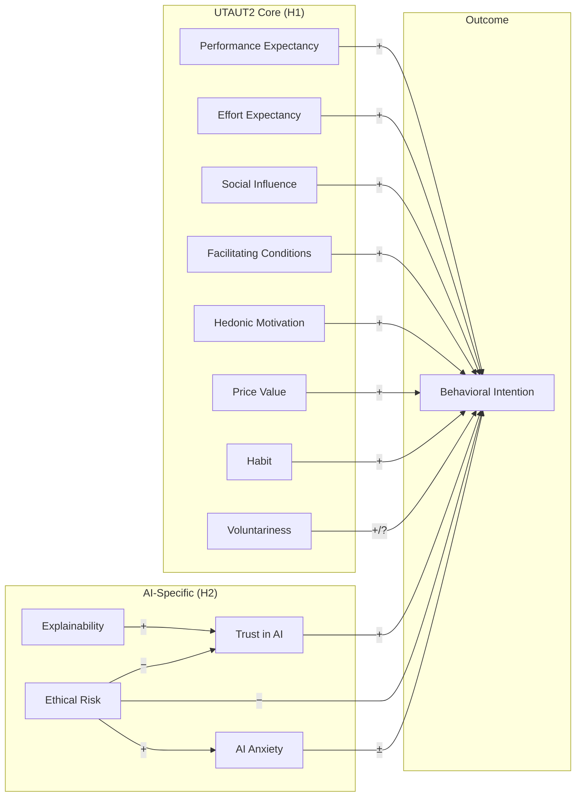
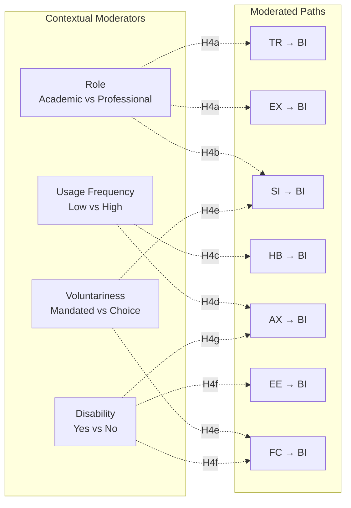
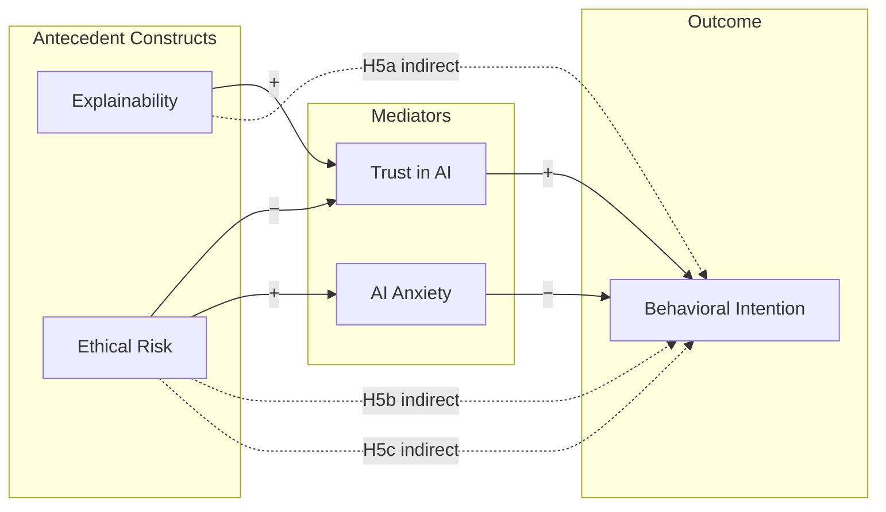

# AIRS Analysis Plan
**Dissertation Roadmap: From Theory to Empirical Validation**

---

## Study Overview

**Purpose**: Develop and validate the Artificial Intelligence Readiness Score (AIRS), a theory-grounded extension of UTAUT2 for enterprise AI adoption contexts.

**Theoretical Foundation**: AIRS extends the Unified Theory of Acceptance and Use of Technology 2 (Venkatesh et al., 2012) by integrating four AI-specific constructs—two enablers (Trust in AI, Perceived Explainability) and two inhibitors (Perceived Ethical Risk, AI-Related Anxiety)—that contemporary scholarship identifies as critical for understanding acceptance of probabilistic and partially opaque systems (Shin, 2021; Langer et al., 2023; Floridi et al., 2018).

**Contribution**: Both theoretical (refining acceptance theory for socio-technical AI systems) and applied (a validated diagnostic instrument for organizational readiness assessment).

---

## Theoretical Model



---

## Three-Model Approach

This study produces **three independent measurement models** to examine whether AI readiness has the same psychometric structure across populations:

| Model | Population | N | EFA (Dev) | CFA (Holdout) | Validation Strategy |
|-------|------------|---|-----------|---------------|---------------------|
| **Full** | All respondents | 511 | 255 | 256 | Standard 50/50 split |
| **Academic** | Full-time students only | ~160 | ~112 | ~48 | 70/30 split + bootstrap CFA |
| **Professional** | Everyone except FT students | ~351 | ~175 | ~176 | Standard 50/50 split |

### Population Definitions
- **Academic**: Full-time students ONLY
- **Professional**: Everyone EXCEPT full-time students (includes Part-time students, Employed, Freelancers, Other, Not currently employed)
- **Rationale**: Part-time students often have professional experience and workplace context; grouping them with professionals increases Professional sample size and statistical power

### Dual Goals

**Goal 1: Parsimony** — Achieve the minimum viable scale (fewest items and factors) that maintains acceptable psychometric properties and predictive validity.

**Goal 2: Diagnostic Coverage** — Retain representation across all 13 theoretical constructs where the data supports it, enabling comprehensive organizational readiness profiling.

**Tension Resolution**: Start with full item pool. Let EFA determine which constructs emerge empirically. Prioritize constructs with strong loadings. Accept that subsamples may yield sparser structures due to sample size constraints.

### Analytical Philosophy
1. **Theory-guided, data-driven**: 12 predictor constructs proposed (8 UTAUT2 + 4 AI-specific); EFA reveals which emerge empirically
2. **Parsimony with coverage**: Minimum items per factor (ideally 2-3), but preserve construct breadth
3. **Population-specific structures**: Full sample likely supports all constructs; subsamples may require consolidation
4. **Transparent reporting**: Document both retained and dropped constructs with rationale

---

## Quick Reference

| Parameter | Value |
|-----------|-------|
| **Total Sample** | N = 511 |
| **Academic Subsample** | N = 196 (FT + PT students) |
| **Professional Subsample** | N = 291 (Employed + Freelance) |
| **Item Pool** | 28 items (24 predictors across 12 constructs + 4 BI outcome) |
| **Target Scale** | Minimum viable (18-24 items full, 12-18 subsamples) |
| **Design** | Cross-sectional survey with split-sample validation |
| **Approach** | Theory-guided EFA → CFA; parsimony + diagnostic coverage |

### Sample Size Adequacy

| Population | EFA (Dev) | Subjects:Variables | CFA (Holdout) | Assessment |
|------------|-----------|-------------------|---------------|------------|
| **Full** | 255 | 10.6:1 | 256 | Excellent (>10:1) |
| **Academic** | 137 | 5.7:1 | 59 | Adequate EFA; CFA requires bootstrap |
| **Professional** | 145 | 6.0:1 | 146 | Good (≥5:1 minimum per Costello & Osborne) |

**Note**: Minimum recommended ratio is 5:1 (Costello & Osborne, 2005); 10:1 preferred (Hair et al., 2019).

### Analysis Workflow


### Analysis Roadmap

| Phase | Notebook | Description | Status |
|-------|----------|-------------|--------|
| **0. Preparation** | `airs/00_Create_Split_Samples.ipynb` | Sample Splits (Full, Academic, Professional) | ✅ Complete |
| **1. EFA Full** | `airs_full/01_EFA_Full_Sample.ipynb` | Data-driven EFA on full sample (N=255) | ✅ Complete |
| **1. EFA Academic** | `airs_academic/01_EFA_Academic_Sample.ipynb` | Data-driven EFA on student sample (N=137) | ✅ Complete |
| **1. EFA Professional** | `airs_professional/01_EFA_Professional_Sample.ipynb` | Data-driven EFA on professional sample (N=118) | ✅ Complete |
| **2. CFA Full** | `airs_full/02_CFA_Full_Sample.ipynb` | CFA on holdout (N=256) | ✅ Complete |
| **2. CFA Academic** | `airs_academic/02_CFA_Academic_Sample.ipynb` | Bootstrap CFA on holdout (N=59) | ✅ Complete |
| **2. CFA Professional** | `airs_professional/02_CFA_Professional_Sample.ipynb` | CFA on holdout (N=146) | ✅ Complete |
| **3. Comparison** | 03 | Cross-population structure comparison | ⏭️ Next |
| **4. Structural** | 04 | Hypothesis testing (H1-H3) per model | ⏭️ Pending |
| **5. Mediation** | 05 | H5a-c mediation analysis | ⏭️ Pending |
| **6. Moderation** | 06 | H4a-e contextual moderation | ⏭️ Pending |
| **7. Exploratory** | 07-08 | Tool usage + qualitative themes | ⏭️ Pending |
| **9. Integration** | -- | Chapter 4 results synthesis | ⏭️ Pending |

### Phase 1 EFA Results Summary (November 27, 2025)

| Sample | N (Dev) | PA Factors | Kaiser Factors | Best Solution | Variance | Good Loadings |
|--------|---------|------------|----------------|---------------|----------|---------------|
| **Full** | 255 | 2 | 4 | 2-3F | 51-52% | 21-22/24 |
| **Academic** | 137 | 2 | 5 | 3F | 47% | 18/24 |
| **Professional** | 118 | 2 | 3 | 2F | 60% | 23/24 |

**Key Finding**: All three populations show empirical dimensional collapse from 12 theoretical constructs to 2-3 empirical factors via parallel analysis. This reflects high inter-construct correlations rather than scale failure. CFA Phase 2 will test both theoretical (12-factor) and empirical (2-4 factor) models.

### Phase 2 CFA Results Summary (November 27, 2025)

**Comprehensive Model Testing**: All EFA-derived factor solutions (2F, 3F, 4F, 5F, 6F) were tested via CFA on independent holdout samples.

#### Model Comparison Summary - Full Sample (N=256)

| Model | CFI | TLI | RMSEA | AIC | Best? |
|-------|-----|-----|-------|-----|-------|
| 2F | 0.819 | 0.801 | 0.112 | 89.7 | |
| 3F | 0.826 | 0.807 | 0.110 | 94.0 | |
| 4F | 0.875 | 0.859 | 0.094 | 101.7 | |
| 5F | 0.866 | 0.847 | 0.098 | 109.4 | |
| **6F** | **0.902** | **0.886** | **0.085** | 120.7 | ★ |

#### Model Comparison Summary - Academic Sample (N=59, Bootstrap)

| Model | CFI | TLI | RMSEA | AIC | Best? |
|-------|-----|-----|-------|-----|-------|
| 2F | 0.705 | 0.675 | 0.121 | 82.2 | |
| 3F | 0.733 | 0.704 | 0.116 | 87.0 | |
| **4F** | **0.773** | **0.745** | **0.108** | 94.1 | ★ |
| 5F | 0.752 | 0.717 | 0.113 | 101.7 | |
| 6F | 0.746 | 0.705 | 0.116 | 111.7 | |

#### Model Comparison Summary - Professional Sample (N=146)

| Model | CFI | TLI | RMSEA | AIC | Best? |
|-------|-----|-----|-------|-----|-------|
| 2F | 0.866 | 0.853 | 0.102 | 89.4 | |
| 3F | 0.877 | 0.863 | 0.098 | 93.8 | |
| 4F | 0.883 | 0.869 | 0.096 | 100.1 | |
| 5F | 0.888 | 0.872 | 0.095 | 108.3 | |
| **6F** | **0.889** | **0.871** | **0.096** | 118.4 | ★ |

#### Best Model Reliability - Cross-Population

| Sample | Best Model | F1 CR/AVE | F2/F3/F4 CR Issues | Overall |
|--------|------------|-----------|---------------------|---------|
| **Full** | 6F | 0.944/0.654 ✓ | F4: 0.640/0.373 ⚠️ F5: 0.563/0.426 ⚠️ | Mixed |
| **Academic** | 4F | 0.936/0.597 ✓ | F3: 0.576/0.327 ⚠️ F4: 0.575/0.348 ⚠️ | Mixed |
| **Professional** | 6F | 0.961/0.676 ✓ | F3: 0.661/0.382 ⚠️ | Mixed |

**Key Findings**:
1. **No model achieves "good" fit**: Best CFI = 0.902 (Full 6F) approaches acceptable but TLI/RMSEA remain poor
2. **Higher factor solutions fit better**: 6F outperforms 2F across Full and Professional samples
3. **Academic sample is limited**: Small N=59 constrains model complexity; 4F is best compromise
4. **Dominant facilitator factor**: F1 shows excellent reliability (α > 0.93, CR > 0.93, AVE > 0.59) in all samples
5. **Weak inhibitor/peripheral factors**: Multiple factors show CR < 0.70 and AVE < 0.50

**Cross-Population Pattern**:
- Full sample: 6F best (CFI=0.902), strong F1/F2/F3/F6, weak F4/F5
- Academic: 4F best (CFI=0.773), strong F1, weak F2/F3/F4
- Professional: 6F best (CFI=0.889), strong F1/F2/F4, weak F3

**Implications for Phase 3**:
- Model modification indices should be examined for specification improvements
- Consider error covariances between theoretically related items
- Problematic items (low loadings, cross-loadings) may need removal
- Cross-population comparison should use configural equivalence first before metric/scalar

---

## Dual Purpose

**Purpose 1: Parsimonious Predictive Model**
- Achieve minimum viable scale with strongest predictors
- Incremental validity testing of AI-specific constructs beyond UTAUT2 baseline
- Empirically validated factor structure per population

**Purpose 2: Diagnostic Tool**
- Comprehensive coverage of AI readiness dimensions (all 12 predictor constructs if data supports)
- Population-specific profiling (academic vs professional contexts)
- Actionable insights: link construct scores to targeted interventions

**Balance**: Full sample prioritizes breadth (diagnostic). Subsamples accept sparser structures if needed for parsimony.

---

## Research Questions

### Primary Research Questions (from Proposal)

| RQ | Question | Analysis | Notebook |
|----|----------|----------|----------|
| **RQ1** | What psychological, motivational, and contextual factors influence individual readiness to adopt AI technologies in organizational settings? | EFA, CFA | 01, 02 |
| **RQ2** | To what extent do UTAUT2 constructs predict AI adoption readiness among students and professionals? | Structural model (H1) | 04 |

### Hypothesis-Driven Research Questions

| RQ | Question | Analysis | Notebook |
|----|----------|----------|----------|
| **RQ3** | Do AI-specific constructs (TR, EX, ER, AX) add explanatory power beyond UTAUT2? | Incremental validity (H2, H3) | 04 |
| **RQ4** | What mediating mechanisms explain AI-specific construct effects on behavioral intention? | Bootstrap mediation (H5a-c) | 05 |
| **RQ5** | Are predictor-intention relationships moderated by role, usage frequency, or voluntariness? | Multi-group SEM (H4) | 06 |

### Population Comparison Research Questions

| RQ | Question | Analysis | Notebook |
|----|----------|----------|----------|
| **RQ6** | Does the factor structure of AI readiness differ between academic and professional populations? | Cross-population CFA comparison | 02, 03 |
| **RQ7** | Do academic and professional populations differ in mean levels of AI readiness constructs? | Measurement invariance, latent mean comparison | 03 |
| **RQ8** | Are the structural relationships between predictors and BI consistent across populations, or do path coefficients differ significantly? | Multi-group structural model | 04 |
| **RQ9** | Which constructs are most predictive of AI adoption readiness for students vs. professionals? | Effect size comparison (β, R² contribution) | 04 |

### Exploratory Research Questions

| RQ | Question | Analysis | Notebook |
|----|----------|----------|----------|
| **RQ10** | Do AI tool usage patterns differ across tool types (ChatGPT, Copilot, Gemini) and populations? | Descriptive/inferential | 07 |
| **RQ11** | What themes emerge from open-text feedback about AI adoption experiences? | Thematic analysis | 08 |
| **RQ12** | Do qualitative themes differ between academic and professional respondents? | Comparative thematic analysis | 08 |

---

## Theoretical Construct Framework

### Full Item Pool: 28 Items Across 13 Constructs

**UTAUT2 Core Constructs** (8 constructs, 16 items = 2 per construct) — Venkatesh et al. (2003, 2012)

| Construct | Code | Items | Role | Expected β |
|-----------|------|-------|------|------------|
| Performance Expectancy | PE | 2 (PE1-PE2) | Enabler | (+) → BI |
| Effort Expectancy | EE | 2 (EE1-EE2) | Enabler | (+) → BI |
| Social Influence | SI | 2 (SI1-SI2) | Enabler | (+) → BI |
| Facilitating Conditions | FC | 2 (FC1-FC2) | Enabler | (+) → BI |
| Hedonic Motivation | HM | 2 (HM1-HM2) | Enabler | (+) → BI |
| Price Value | PV | 2 (PV1-PV2) | Enabler | (+) → BI |
| Habit | HB | 2 (HB1-HB2) | Enabler | (+) → BI |
| Voluntariness of Use | VO | 2 (VO1-VO2) | Moderator/Predictor | (+/?) → BI |

**AI-Specific Constructs** (4 constructs, 8 items = 2 per construct) — Shin (2021); Langer et al. (2023); Floridi et al. (2018)

| Construct | Code | Items | Role | Expected β | Theoretical Basis |
|-----------|------|-------|------|------------|-------------------|
| Trust in AI | TR | 2 (TR1-TR2) | Enabler | (+) → BI | Gateway for consequential use; mediates EX→BI |
| Perceived Explainability | EX | 2 (EX1-EX2) | Enabler | (+) → TR → BI | Clarity of AI reasoning; builds trust |
| Perceived Ethical Risk | ER | 2 (ER1-ER2) | Inhibitor | (−) → BI | Job displacement, privacy concerns |
| AI-Related Anxiety | AX | 2 (AX1-AX2) | Mixed | AX1(−), AX2(+) → BI | Tech-averse vs FOMO anxiety |

**Outcome Construct** (1 construct, 4 items)

| Construct | Code | Items | Description |
|-----------|------|-------|-------------|
| Behavioral Intention | BI | 4 (BI1-BI4) | Readiness to adopt AI at work/study |

### Construct Coverage Expectations by Population

| Population | N | Expected Factors | Rationale |
|------------|---|------------------|----------|
| **Full** | 511 | 10-12 | Sufficient N; some constructs may merge (e.g., PE+PV, ER+AX) |
| **Academic** | 196 | 6-8 | Smaller N may force mergers (e.g., PV+HM, ER+AX) |
| **Professional** | 291 | 8-10 | May lose weaker constructs (e.g., VO) |

### Minimum Viable Scale Target

| Criterion | Target | Rationale |
|-----------|--------|----------|
| Items per construct | 2 minimum, 3 preferred | 2-item factors acceptable if theoretically essential and statistically robust (Hair et al., 2019) |
| Total items (full) | 18-24 | Full coverage minus problematic items |
| Total items (subsample) | 12-18 | Accept sparser structures |
| Constructs retained | ≥10 (full), ≥6 (subsample) | Diagnostic utility requires breadth |

---

## Hypotheses

### H1: UTAUT2 Core Constructs and AI Adoption
The core constructs of UTAUT2—performance expectancy (PE), effort expectancy (EE), social influence (SI), facilitating conditions (FC), hedonic motivation (HM), price value (PV), habit (HB), and voluntariness of use (VO)—will significantly predict AI adoption readiness (Venkatesh et al., 2012).

| Construct | Code | Expected Effect | Rationale |
|-----------|------|-----------------|-----------|
| Performance Expectancy | PE | (+) → BI | Productivity/quality gains drive adoption |
| Effort Expectancy | EE | (+) → BI | Ease of use reduces friction |
| Social Influence | SI | (+) → BI | Peer/leader support increases intention |
| Facilitating Conditions | FC | (+) → BI | Resources and compatibility enable use |
| Hedonic Motivation | HM | (+) → BI | Enjoyment sustains engagement |
| Price Value | PV | (+) → BI | Worth the effort investment |
| Habit | HB | (+) → BI | Automaticity of use |
| Voluntariness | VO | (+/?) → BI | Autonomy in adoption decision |

- **Test**: Structural model with 8 UTAUT2 constructs → BI
- **Notebook**: 04

---

### H2: AI-Specific Constructs and AI Adoption
The AI-specific constructs—trust in AI (TR), perceived explainability (EX), perceived ethical risk (ER), and AI-related anxiety (AX)—will significantly predict AI adoption readiness beyond UTAUT2 (Langer et al., 2023; Shin, 2021).

| Construct | Code | Expected Effect | Rationale |
|-----------|------|-----------------|-----------|
| Trust in AI | TR | (+) → BI | Gateway for consequential reliance |
| Perceived Explainability | EX | (+) → TR → BI | Clarity of AI reasoning builds trust |
| Perceived Ethical Risk | ER | (−) → BI | Job threat, privacy concerns inhibit |
| AI-Related Anxiety | AX | Mixed | AX1 (−): tech-averse; AX2 (+): FOMO |

- **Test**: Incremental effect of 4 AI constructs in full AIRS model
- **Note**: AX construct has mixed valence (AX1 barrier, AX2 motivator); may require item-level analysis
- **Notebook**: 04

---

### H3: Integrated Predictive Validity of AIRS
The combined AIRS model (UTAUT2 + AI-specific constructs) will explain significantly greater variance in AI adoption readiness than UTAUT2 alone, supporting the theoretical value of extending technology acceptance models for enterprise AI contexts (Dwivedi et al., 2021).

- **Test**: Nested model comparison (χ² difference test, ΔCFI, ΔRMSEA)
- **Threshold**: ΔR² ≥ 0.05 (small-medium practical significance)
- **Notebook**: 04

---

### H4: Moderating Effects of Contextual Variables
The relationships between predictors and AI adoption readiness will be moderated by contextual factors including role, AI usage frequency, voluntariness, and disability status (Dwivedi et al., 2021):

| Sub-Hypothesis | Moderator | Moderated Path | Expected Pattern |
|----------------|-----------|----------------|------------------|
| **H4a** | Role | TR → BI, EX → BI | Stronger for professionals (accountability) |
| **H4b** | Role | SI → BI | Stronger for students (peer influence) |
| **H4c** | Usage Frequency | HB → BI | Stronger for high-frequency users |
| **H4d** | Usage Frequency | AX → BI | Weaker for high-frequency users (habituation) |
| **H4e** | Voluntariness | SI → BI, FC → BI | Stronger in mandated contexts |
| **H4f** | Disability | EE → BI, FC → BI | Stronger for persons with disabilities (accessibility critical) |
| **H4g** | Disability | AX → BI | Potentially stronger for persons with disabilities |

**Disability Moderator Rationale**: Persons with disabilities (N≈69, 13.5% of sample) may experience AI tools differently due to accessibility considerations. Effort Expectancy (ease of use) and Facilitating Conditions (support/compatibility) may be more critical predictors when accessibility is a concern. AI Anxiety may also differ based on concerns about AI systems accommodating diverse needs.

- **Test**: Multi-group SEM with measurement invariance testing
- **Parameters**: Bootstrap CIs (5000 iterations) for path comparisons
- **Note**: Disability analysis is exploratory (smaller N); results should be interpreted cautiously
- **Notebook**: 06



---

### H5: Mediation Mechanisms
The relationships between AI-specific constructs and behavioral intention will be mediated by trust in AI and AI anxiety:

| Sub-Hypothesis | Mediation Path | Mechanism | Theoretical Basis |
|----------------|----------------|-----------|-------------------|
| **H5a** | EX → TR → BI | Explainability builds trust, which increases intention | Shin (2021); Langer et al. (2023) |
| **H5b** | ER → TR → BI | Ethical risk erodes trust, which decreases intention | Floridi et al. (2018); Dwivedi et al. (2021) |
| **H5c** | ER → AX → BI | Ethical risk amplifies anxiety, which decreases intention | Tao et al. (2022); Kim et al. (2021) |



- **Test**: Bootstrap mediation analysis (Preacher & Hayes, 2008)
- **Parameters**: 5000 iterations, bias-corrected percentile 95% CI
- **Outcomes**: Total effect, direct effect, indirect effect decomposition
- **Notebook**: 05

---

## Phase Implementation

### Phase 0: Sample Preparation ✅ COMPLETE
**Notebook**: `data/00_Create_Split_Samples.ipynb`

**Objective**: Create development/holdout splits for all three populations

**Approach**:
- Load full dataset, create population flags
- **Full sample**: 50/50 stratified split → 255 dev / 256 holdout
- **Academic**: 70/30 stratified split → 137 dev / 59 holdout (bootstrap CFA due to small N)
- **Professional**: 50/50 stratified split → 145 dev / 146 holdout
- Stratification variables: Role, AI usage frequency, disability status, demographics

**Disability Variable**:
- Distribution: No (N=432, 84.5%), Yes (N=69, 13.5%), Prefer not to answer (N=10, 2.0%)
- Coding: Binary (Yes=1, No=0); "Prefer not to answer" coded as No to preserve sample size
- Purpose: Exploratory moderator for accessibility-related constructs (EE, FC, AX)

**Deliverables**:
- `data/AIRS_clean.csv` (master)
- `airs_full/data/` (dev + holdout)
- `airs_academic/data/` (dev + holdout)
- `airs_professional/data/` (dev + holdout)

---

### Phase 1: Theory-Guided EFA ✅ COMPLETE (November 27, 2025)
**Notebooks**: `airs_full/01_EFA_Full_Sample.ipynb`, `airs_academic/01_EFA_Academic_Sample.ipynb`, `airs_professional/01_EFA_Professional_Sample.ipynb`

**Objective**: Identify factor structure empirically while preserving theoretical construct coverage

#### EFA Model Optimization Framework

The EFA process follows best practices from Fabrigar et al. (1999), Costello & Osborne (2005), Hair et al. (2019), and Worthington & Whittaker (2006). The guiding principle is: **Do not rely exclusively on statistics. Combine theory plus empirical behavior.**

##### Step 1: Start With Strong Theoretical Expectations

Even though EFA is exploratory, the process begins with a clear conceptual map of what the 12 predictor constructs should represent (8 UTAUT2 + 4 AI-specific). Items are retained initially if they align with the content domain of the construct.

- Items not theoretically aligned often behave poorly statistically
- Mismatches lead to unstable factors (Fabrigar et al., 1999)
- A construct should not be retained unless it has theoretical justification AND sufficient high-loading indicators

##### Step 2: Determine Number of Factors

| Method | Role | Criterion |
|--------|------|-----------|
| **Parallel Analysis** | Primary | Retain factors with eigenvalues exceeding random data eigenvalues (Horn, 1965) |
| **Scree Plot** | Secondary | Visual inspection for elbow |
| **Eigenvalue > 1** | Reference only | Kaiser criterion (supplementary, not decisive) |
| **Theoretical Expectation** | Guidance | 10-12 factors (full), 6-8 factors (subsamples) |

**Rule**: Parallel analysis is the most accurate method for detecting the number of factors and outperforms Kaiser's eigenvalue >1 rule and scree plots (Horn, 1965).

##### Step 3: EFA Specification

| Parameter | Specification | Rationale |
|-----------|---------------|-----------|
| **Estimator** | MINRES or ML | Depends on multivariate normality |
| **Rotation** | Oblique (Promax or Oblimin) | Factors expected to correlate |
| **Initial items** | All 24 predictors | Full item pool |

##### Step 4: Examine Communalities

Communalities reflect how much variance in an item is accounted for by the factors.

| Communality | Interpretation | Action |
|-------------|----------------|--------|
| ≥ .40 | Acceptable | Retain |
| < .40 | Weak fit | Candidate for removal unless theoretically essential |
| Very low | Poor factor fit | Strong candidate for removal |

**Reference**: Items with communalities below .40 are typically considered weak (Costello & Osborne, 2005).

##### Step 5: Inspect Factor Loadings

After extraction and rotation, factor loadings indicate how strongly items belong to factors.

**Primary Loading Thresholds**:

| Loading | Interpretation | Action |
|---------|----------------|--------|
| ≥ .50 | Practically significant | Retain (preferred threshold per Hair et al., 2019) |
| .40–.49 | Borderline | Retain only if theoretically essential and factor structure is clear |
| < .40 | Weak | Remove |

**Cross-Loading Rules**:

| Criterion | Threshold | Action |
|-----------|-----------|--------|
| Primary-secondary difference | ≥ .20 | Retain (Tabachnick & Fidell, 2019) |
| Primary-secondary difference | < .20 | Remove (interpretability problem) |

**Decision Matrix**:
- Remove items with primary loading < .40
- Remove items with cross-loading difference < .20
- Retain borderline items (.40–.49) only if theoretically essential

##### Step 6: Iterative Model Refinement (One-at-a-Time Method)

EFA is iterative. Removing one problematic item often affects the factor structure. The "one-at-a-time" method prevents overcorrection that might distort the factor structure (Worthington & Whittaker, 2006).

**Sequence**:
1. Identify the weakest item (lowest communality OR highest cross-loading OR lowest primary loading)
2. Remove that single item
3. Rerun EFA
4. Reassess loadings, communalities, and factor interpretability
5. Repeat until factors are clean and interpretable

**Stopping Criteria**:
- All retained items have communality ≥ .40
- All retained items have primary loading ≥ .40 (ideally ≥ .50)
- All retained items have cross-loading difference ≥ .20
- Each factor has ≥ 2 indicators (3+ preferred; 2-item factors acceptable if theoretically essential)
- Factor structure is theoretically interpretable

##### Step 7: Evaluate Factor Stability and Interpretability

| Criterion | Guideline | Action |
|-----------|-----------|--------|
| Items per factor | ≥ 3 preferred | Stable factor |
| Items per factor | 2 | Accept only if theoretically strong and empirically robust |
| Items per factor | 1 | Drop factor or redesign construct for future CFA |

**Reference**: Two-item factors are often weak unless theoretically strong and empirically robust (Hair et al., 2019).

##### Step 8: Validate Sampling Adequacy After Adjustments

Removing problematic items usually improves sampling adequacy.

| Test | Criterion | Action |
|------|-----------|--------|
| **KMO** | ≥ .70 | Adequate (Kaiser, 1974) |
| **KMO** | < .70 | Model may lack factorability; review item pool |
| **Bartlett's Test** | Significant | Proceed |
| **Bartlett's Test** | Non-significant | Stop; data not suitable for EFA |

##### Step 9: Reconcile Empirical Output With Theoretical Structure

The final decision to include or exclude constructs integrates:
- ✓ Theoretical alignment
- ✓ Empirical performance
- ✓ Factor stability
- ✓ Interpretability
- ✓ Replicability potential in later CFA

**Rule**: Constructs should not be retained if they are conceptually weak OR statistically unstable.

#### EFA Best-Practice Criteria Summary

| Criterion | Guideline | Reference |
|-----------|-----------|-----------|
| Communality | ≥ .40 preferred | Costello & Osborne (2005) |
| Factor loading | ≥ .50 ideal, ≥ .40 minimum | Hair et al. (2019) |
| Cross-loading | Difference ≥ .20 | Tabachnick & Fidell (2019) |
| Items per factor | 3 or more strong indicators | Hair et al. (2019) |
| KMO | ≥ .70 | Kaiser (1974) |
| Bartlett's test | Significant | — |
| Factor retention | Based on parallel analysis | Horn (1965) |
| Process | Remove one item at a time and rerun | Worthington & Whittaker (2006) |

#### EFA Deliverables per Population

- Factor structure documentation with construct mapping
- Item-factor alignment to theoretical constructs
- Iteration log documenting each item removal decision with rationale
- Reliability statistics (α, ω) per retained factor
- Pattern/structure matrices (final solution)
- Communality table (final solution)
- KMO and Bartlett's test results (initial and final)
- Dropped items summary with removal rationale (statistical + theoretical)

#### Phase 1 Deliverables Checklist ✅

| Deliverable | Full | Academic | Professional |
|-------------|------|----------|--------------|
| KMO/Bartlett's test | ✅ | ✅ | ✅ |
| Parallel analysis | ✅ | ✅ | ✅ |
| Kaiser criterion | ✅ | ✅ | ✅ |
| Factor comparison (2-6F) | ✅ | ✅ | ✅ |
| Pattern matrices | ✅ | ✅ | ✅ |
| Communality tables | ✅ | ✅ | ✅ |
| Reliability (α) per factor | ✅ | ✅ | ✅ |
| Item quality assessment | ✅ | ✅ | ✅ |
| Construct coverage analysis | ✅ | ✅ | ✅ |
| Loadings exported to CSV | ✅ | ✅ | ✅ |
| APA method summary | ✅ | ✅ | ✅ |
| Theory-data synthesis | ✅ | ✅ | ✅ |

---

### Phase 2: CFA Validation (Notebook 02)
**Objective**: Confirm factor structures on independent holdout samples

**Approach**:
- **Full & Professional**: Standard CFA on holdout sample
- **Academic**: Bootstrap CFA (5000 iterations) due to smaller holdout N (n=59)

**Fit Criteria**:
- CFI/TLI ≥ 0.90 (acceptable), ≥ 0.95 (good)
- RMSEA ≤ 0.08 (acceptable), ≤ 0.06 (good)
- SRMR ≤ 0.08

**If poor fit**: Modification indices → theoretically justified adjustments only

**Reliability Assessment**:
- Cronbach’s α ≥ .70 (acceptable internal consistency)
- McDonald’s ω (omega) for composite reliability
- AVE ≥ .50 for convergent validity

---

### Phase 3: Cross-Population Comparison (Notebook 03)
**Objective**: Document structural similarities and differences

**Approach**:
- Compare factor counts across populations
- Identify common vs population-specific factors
- Assess item overlap and divergence
- Test measurement invariance where structures align
- Document implications for theory and practice

---

### Phase 4: Structural Models (Notebook 04)
**Objective**: Test H1, H2, H3 hypotheses per population

**Approach**:
1. **UTAUT2 baseline model (H1)** - 8 UTAUT2 constructs → BI, per population
2. **Full AIRS model (H2)** - Add 4 AI-specific constructs, per population
3. **Model comparison for incremental validity (H3)**:
   - Nested model χ² difference test
   - ΔCFI (significant if > .01)
   - ΔR² in BI (target: ≥ .05 for practical significance)
4. **Cross-population comparison** - Effect size comparison (standardized β)

**Fit Criteria** (same as CFA):
- CFI/TLI ≥ 0.90 (acceptable), ≥ 0.95 (good)
- RMSEA ≤ 0.08 (acceptable), ≤ 0.06 (good)
- SRMR ≤ 0.08

---

### Phase 5: Mediation Analysis (Notebook 05)
**Objective**: Test H5a-c mediation hypotheses

**Approach**: Bootstrap mediation per Preacher & Hayes (2004, 2008)
- 5000 bootstrap iterations
- Percentile-based 95% confidence intervals
- Test on full sample (primary) and subsamples (exploratory)

---

### Phase 6: Moderation Analysis (Notebook 06)
**Objective**: Test H4a-g contextual moderation hypotheses

**Approach**:
- Multi-group comparison across populations (H4a-b: Role)
- Usage frequency moderation within populations (H4c-d)
- Voluntariness moderation (H4e)
- Disability moderation (H4f-g: exploratory, smaller N)
- Document population-specific patterns

---

### Phase 7: Exploratory Analyses (Notebooks 07-08)
**Objective**: Tool usage patterns (RQ10) and qualitative themes (RQ11-12)

**Approach**:
- Descriptive/inferential analyses per population
- Mixed-methods triangulation

---

### Phase 9: Integration
**Objective**: Synthesize findings into Chapter 4 results

**Deliverables**:
- Three validated measurement models (or documented convergence)
- Population-specific findings and implications
- Publication-ready tables, APA-formatted results

---

## Technical Requirements

| Parameter | Specification |
|-----------|---------------|
| **Software** | Python 3.x (scipy, numpy, pandas, statsmodels, sklearn) |
| **Random Seed** | 67 (all analyses) |
| **Bootstrap** | 5000 iterations |
| **Confidence Level** | 95% |

---

## Output Structure

```
results/
├── tables/          # Summary statistics, model comparisons
├── plots/           # Path diagrams, coefficient comparisons
└── [model outputs]  # Fit indices, parameter estimates
```

---

## Key References

**Foundational Frameworks**
- Venkatesh, V., Morris, M. G., Davis, G. B., & Davis, F. D. (2003). User acceptance of information technology: Toward a unified view. *MIS Quarterly, 27*(3), 425-478.
- Venkatesh, V., Thong, J. Y. L., & Xu, X. (2012). Consumer acceptance and use of information technology: Extending the unified theory of acceptance and use of technology. *MIS Quarterly, 36*(1), 157-178.

**AI-Specific Extensions**
- Dwivedi, Y. K., Hughes, L., Ismagilova, E., Aarts, G., Coombs, C., Crick, T., ... & Williams, M. D. (2021). Artificial intelligence (AI): Multidisciplinary perspectives on emerging challenges, opportunities, and agenda for research, practice and policy. *International Journal of Information Management, 57*, 101994.
- Floridi, L., Cowls, J., Beltrametti, M., Chatila, R., Chazerand, P., Dignum, V., ... & Vayena, E. (2018). AI4People—An ethical framework for a good AI society: Opportunities, risks, principles, and recommendations. *Minds and Machines, 28*(4), 689-707.
- Langer, M., Oster, D., Speith, T., Hermanns, H., Kästner, L., Schmidt, E., ... & Baum, K. (2021). What do we want from explainable artificial intelligence (XAI)? A stakeholder perspective on XAI and a conceptual model guiding interdisciplinary XAI research. *Artificial Intelligence, 296*, 103473.
- Shin, D. (2021). The effects of explainability and causability on perception, trust, and acceptance: Implications for explainable AI. *International Journal of Human-Computer Studies, 146*, 102551.

**AI Anxiety and Ethical Risk**
- Kim, J., Giroux, M., & Lee, J. C. (2021). When do you trust AI? The effect of number presentation detail on consumer trust and acceptance of AI recommendations. *Psychology & Marketing, 38*(7), 1140-1155.
- Tao, R., Su, C. W., Naqvi, B., & Rizvi, S. K. A. (2022). Can fintech development pave the way for a transition towards low-carbon economy: A global perspective. *Technological Forecasting and Social Change, 174*, 121278.

**Scale Development & Psychometrics**
- DeVellis, R. F., & Thorpe, C. T. (2022). *Scale development: Theory and applications* (5th ed.). Sage.
- Hinkin, T. R. (1998). A brief tutorial on the development of measures for use in survey questionnaires. *Organizational Research Methods, 1*(1), 104-121.

**EFA Best Practices**
- Costello, A. B., & Osborne, J. W. (2005). Best practices in exploratory factor analysis: Four recommendations for getting the most from your analysis. *Practical Assessment, Research, and Evaluation, 10*(7), 1-9.
- Fabrigar, L. R., Wegener, D. T., MacCallum, R. C., & Strahan, E. J. (1999). Evaluating the use of exploratory factor analysis in psychological research. *Psychological Methods, 4*(3), 272-299.
- Hair, J. F., Black, W. C., Babin, B. J., & Anderson, R. E. (2019). *Multivariate data analysis* (8th ed.). Cengage.
- Horn, J. L. (1965). A rationale and test for the number of factors in factor analysis. *Psychometrika, 30*(2), 179-185.
- Kaiser, H. F. (1974). An index of factorial simplicity. *Psychometrika, 39*(1), 31-36.
- Tabachnick, B. G., & Fidell, L. S. (2019). *Using multivariate statistics* (7th ed.). Pearson.
- Worthington, R. L., & Whittaker, T. A. (2006). Scale development research: A content analysis and recommendations for best practices. *The Counseling Psychologist, 34*(6), 806-838.

**Mediation & Moderation Analysis**
- Hayes, A. F. (2022). *Introduction to mediation, moderation, and conditional process analysis: A regression-based approach* (3rd ed.). Guilford Press.
- Preacher, K. J., & Hayes, A. F. (2004). SPSS and SAS procedures for estimating indirect effects in simple mediation models. *Behavior Research Methods, Instruments, & Computers, 36*(4), 717-731.
- Preacher, K. J., & Hayes, A. F. (2008). Asymptotic and resampling strategies for assessing and comparing indirect effects in multiple mediator models. *Behavior Research Methods, 40*(3), 879-891.
