# AIRS Analysis Plan
**Dissertation Roadmap: From Theory to Empirical Validation**

---

## Study Overview

**Purpose**: Develop and validate the Artificial Intelligence Readiness Score (AIRS), a theory-grounded extension of UTAUT2 for enterprise AI adoption contexts.

**Theoretical Foundation**: AIRS extends the Unified Theory of Acceptance and Use of Technology 2 (Venkatesh et al., 2012) by integrating four AI-specific constructs—two enablers (Trust in AI, Perceived Explainability) and two inhibitors (Perceived Ethical Risk, AI-Related Anxiety)—that contemporary scholarship identifies as critical for understanding acceptance of probabilistic and partially opaque systems (Shin, 2021; Langer et al., 2023; Floridi et al., 2018).

**Contribution**: Both theoretical (refining acceptance theory for socio-technical AI systems) and applied (a validated diagnostic instrument for organizational readiness assessment).

---

## Theoretical Model


---

## Three-Model Approach

This study produces **three independent measurement models** to examine whether AI readiness has the same psychometric structure across populations:

| Model | Population | Expected N | EFA Split | CFA Split | Validation Strategy |
|-------|------------|------------|-----------|-----------|---------------------|
| **Full** | All respondents | ~509 | ~254 | ~254 | Standard 50/50 split |
| **Academic** | Students (FT + PT) | ~194 | ~136 | ~58 | 70/30 split + bootstrap CFA |
| **Professional** | Employed + Freelance | ~274 | ~137 | ~137 | Standard 50/50 split |

### Population Definitions
- **Academic**: Full-time students + Part-time students
- **Professional**: Employed (IC, Manager, Executive) + Freelancers
- **Excluded from subsamples**: "Other" and "Not currently employed" (included in Full only)

### Dual Goals

**Goal 1: Parsimony** — Achieve the minimum viable scale (fewest items and factors) that maintains acceptable psychometric properties and predictive validity.

**Goal 2: Diagnostic Coverage** — Retain representation across all 13 theoretical constructs where the data supports it, enabling comprehensive organizational readiness profiling.

**Tension Resolution**: Start with full item pool. Let EFA determine which constructs emerge empirically. Prioritize constructs with strong loadings. Accept that subsamples may yield sparser structures due to sample size constraints.

### Analytical Philosophy
1. **Theory-guided, data-driven**: 13 constructs proposed; EFA reveals which emerge empirically
2. **Parsimony with coverage**: Minimum items per factor (ideally 2-3), but preserve construct breadth
3. **Population-specific structures**: Full sample likely supports all constructs; subsamples may require consolidation
4. **Transparent reporting**: Document both retained and dropped constructs with rationale

---

## Quick Reference

| Parameter | Value |
|-----------|-------|
| **Total Sample** | N ≈ 509 (data collection ongoing) |
| **Academic Subsample** | N ≈ 194 (FT + PT students) |
| **Professional Subsample** | N ≈ 274 (Employed + Freelance) |
| **Item Pool** | 28 items (24 predictors across 12 constructs + 4 BI outcome) |
| **Target Scale** | Minimum viable (16-24 items full, 12-18 subsamples) |
| **Design** | Cross-sectional survey with split-sample validation |
| **Approach** | Theory-guided EFA → CFA; parsimony + diagnostic coverage |

### Analysis Workflow


### Analysis Roadmap

| Phase | Notebook | Description | Status |
|-------|----------|-------------|--------|
| **0. Preparation** | 00 | Sample Splits (Full, Academic, Professional) | 🔄 Restart |
| **1. EFA Full** | 01-Full | Data-driven EFA on full sample | ⏭️ Pending |
| **1. EFA Academic** | 01-Academic | Data-driven EFA on student sample | ⏭️ Pending |
| **1. EFA Professional** | 01-Professional | Data-driven EFA on professional sample | ⏭️ Pending |
| **2. CFA Validation** | 02 | Confirm structures on holdout samples | ⏭️ Pending |
| **3. Comparison** | 03 | Cross-population structure comparison | ⏭️ Pending |
| **4. Structural** | 04 | Hypothesis testing (H1-H3) per model | ⏭️ Pending |
| **5. Mediation** | 05 | H5a-c mediation analysis | ⏭️ Pending |
| **6. Moderation** | 06 | H4a-e contextual moderation | ⏭️ Pending |
| **7. Exploratory** | 07-08 | Tool usage + qualitative themes | ⏭️ Pending |
| **9. Integration** | -- | Chapter 4 results synthesis | ⏭️ Pending |

---

## Dual Purpose

**Purpose 1: Parsimonious Predictive Model**
- Achieve minimum viable scale with strongest predictors
- Incremental validity testing of AI-specific constructs beyond UTAUT2 baseline
- Empirically validated factor structure per population

**Purpose 2: Diagnostic Tool**
- Comprehensive coverage of AI readiness dimensions (all 13 constructs if data supports)
- Population-specific profiling (academic vs professional contexts)
- Actionable insights: link construct scores to targeted interventions

**Balance**: Full sample prioritizes breadth (diagnostic). Subsamples accept sparser structures if needed for parsimony.

---

## Research Questions

### Primary Research Questions (from Proposal)

| RQ | Question | Analysis | Notebook |
|----|----------|----------|----------|
| **RQ1** | What psychological, motivational, and contextual factors influence individual readiness to adopt AI technologies in organizational settings? | EFA, CFA | 01, 02 |
| **RQ2** | To what extent do UTAUT2 constructs predict AI adoption readiness among students and professionals? | Structural model (H1) | 04 |

### Hypothesis-Driven Research Questions

| RQ | Question | Analysis | Notebook |
|----|----------|----------|----------|
| **RQ3** | Do AI-specific constructs (TR, EX, ER, AX) add explanatory power beyond UTAUT2? | Incremental validity (H2, H3) | 04 |
| **RQ4** | What mediating mechanisms explain AI-specific construct effects on behavioral intention? | Bootstrap mediation (H5a-c) | 05 |
| **RQ5** | Are predictor-intention relationships moderated by role, usage frequency, or voluntariness? | Multi-group SEM (H4) | 06 |

### Population Comparison Research Questions

| RQ | Question | Analysis | Notebook |
|----|----------|----------|----------|
| **RQ6** | Does the factor structure of AI readiness differ between academic and professional populations? | Cross-population CFA comparison | 02, 03 |
| **RQ7** | Do academic and professional populations differ in mean levels of AI readiness constructs? | Measurement invariance, latent mean comparison | 03 |
| **RQ8** | Are the structural relationships between predictors and BI consistent across populations, or do path coefficients differ significantly? | Multi-group structural model | 04 |
| **RQ9** | Which constructs are most predictive of AI adoption readiness for students vs. professionals? | Effect size comparison (β, R² contribution) | 04 |

### Exploratory Research Questions

| RQ | Question | Analysis | Notebook |
|----|----------|----------|----------|
| **RQ10** | Do AI tool usage patterns differ across tool types (ChatGPT, Copilot, Gemini) and populations? | Descriptive/inferential | 07 |
| **RQ11** | What themes emerge from open-text feedback about AI adoption experiences? | Thematic analysis | 08 |
| **RQ12** | Do qualitative themes differ between academic and professional respondents? | Comparative thematic analysis | 08 |

---

## Theoretical Construct Framework

### Full Item Pool: 28 Items Across 13 Constructs

**UTAUT2 Core Constructs** (8 constructs, 16 items = 2 per construct) — Venkatesh et al. (2003, 2012)

| Construct | Code | Items | Role | Expected β |
|-----------|------|-------|------|------------|
| Performance Expectancy | PE | 2 (PE1-PE2) | Enabler | (+) → BI |
| Effort Expectancy | EE | 2 (EE1-EE2) | Enabler | (+) → BI |
| Social Influence | SI | 2 (SI1-SI2) | Enabler | (+) → BI |
| Facilitating Conditions | FC | 2 (FC1-FC2) | Enabler | (+) → BI |
| Hedonic Motivation | HM | 2 (HM1-HM2) | Enabler | (+) → BI |
| Price Value | PV | 2 (PV1-PV2) | Enabler | (+) → BI |
| Habit | HB | 2 (HB1-HB2) | Enabler | (+) → BI |
| Voluntariness of Use | VO | 2 (VO1-VO2) | Moderator/Predictor | (+/?) → BI |

**AI-Specific Constructs** (4 constructs, 8 items = 2 per construct) — Shin (2021); Langer et al. (2023); Floridi et al. (2018)

| Construct | Code | Items | Role | Expected β | Theoretical Basis |
|-----------|------|-------|------|------------|-------------------|
| Trust in AI | TR | 2 (TR1-TR2) | Enabler | (+) → BI | Gateway for consequential use; mediates EX→BI |
| Perceived Explainability | EX | 2 (EX1-EX2) | Enabler | (+) → TR → BI | Clarity of AI reasoning; builds trust |
| Perceived Ethical Risk | ER | 2 (ER1-ER2) | Inhibitor | (−) → BI | Job displacement, privacy concerns |
| AI-Related Anxiety | AX | 2 (AX1-AX2) | Mixed | AX1(−), AX2(+) → BI | Tech-averse vs FOMO anxiety |

**Outcome Construct** (1 construct, 4 items)

| Construct | Code | Items | Description |
|-----------|------|-------|-------------|
| Behavioral Intention | BI | 4 (BI1-BI4) | Readiness to adopt AI at work/study |

### Construct Coverage Expectations by Population

| Population | N | Expected Factors | Rationale |
|------------|---|------------------|----------|
| **Full** | ~509 | 10-12 | Sufficient N; some constructs may merge (e.g., PE+PV, ER+AX) |
| **Academic** | ~194 | 6-8 | Smaller N may force mergers (e.g., PV+HM, ER+AX) |
| **Professional** | ~274 | 8-10 | May lose weaker constructs (e.g., VO) |

### Minimum Viable Scale Target

| Criterion | Target | Rationale |
|-----------|--------|----------|
| Items per construct | 2 (minimum identification) | Already at minimum; no further reduction possible |
| Total items (full) | 20-24 | Full coverage minus problematic items |
| Total items (subsample) | 14-18 | Accept sparser structures |
| Constructs retained | ≥10 (full), ≥6 (subsample) | Diagnostic utility requires breadth |

---

## Hypotheses

### H1: UTAUT2 Core Constructs and AI Adoption
The core constructs of UTAUT2—performance expectancy (PE), effort expectancy (EE), social influence (SI), facilitating conditions (FC), hedonic motivation (HM), price value (PV), habit (HB), and voluntariness of use (VO)—will significantly predict AI adoption readiness (Venkatesh et al., 2012).

| Construct | Code | Expected Effect | Rationale |
|-----------|------|-----------------|-----------|
| Performance Expectancy | PE | (+) → BI | Productivity/quality gains drive adoption |
| Effort Expectancy | EE | (+) → BI | Ease of use reduces friction |
| Social Influence | SI | (+) → BI | Peer/leader support increases intention |
| Facilitating Conditions | FC | (+) → BI | Resources and compatibility enable use |
| Hedonic Motivation | HM | (+) → BI | Enjoyment sustains engagement |
| Price Value | PV | (+) → BI | Worth the effort investment |
| Habit | HB | (+) → BI | Automaticity of use |
| Voluntariness | VO | (+/?) → BI | Autonomy in adoption decision |

- **Test**: Structural model with 8 UTAUT2 constructs → BI
- **Notebook**: 04

---

### H2: AI-Specific Constructs and AI Adoption
The AI-specific constructs—trust in AI (TR), perceived explainability (EX), perceived ethical risk (ER), and AI-related anxiety (AX)—will significantly predict AI adoption readiness beyond UTAUT2 (Langer et al., 2023; Shin, 2021).

| Construct | Code | Expected Effect | Rationale |
|-----------|------|-----------------|-----------|
| Trust in AI | TR | (+) → BI | Gateway for consequential reliance |
| Perceived Explainability | EX | (+) → TR → BI | Clarity of AI reasoning builds trust |
| Perceived Ethical Risk | ER | (−) → BI | Job threat, privacy concerns inhibit |
| AI-Related Anxiety | AX | Mixed | AX1 (−): tech-averse; AX2 (+): FOMO |

- **Test**: Incremental effect of 4 AI constructs in full AIRS model
- **Note**: AX construct has mixed valence (AX1 barrier, AX2 motivator); may require item-level analysis
- **Notebook**: 04

---

### H3: Integrated Predictive Validity of AIRS
The combined AIRS model (UTAUT2 + AI-specific constructs) will explain significantly greater variance in AI adoption readiness than UTAUT2 alone, supporting the theoretical value of extending technology acceptance models for enterprise AI contexts (Dwivedi et al., 2021).

- **Test**: Nested model comparison (χ² difference test, ΔCFI, ΔRMSEA)
- **Threshold**: ΔR² ≥ 0.05 (small-medium practical significance)
- **Notebook**: 04

---

### H4: Moderating Effects of Contextual Variables
The relationships between predictors and AI adoption readiness will be moderated by contextual factors including role, AI usage frequency, voluntariness, and disability status (Dwivedi et al., 2021):

| Sub-Hypothesis | Moderator | Moderated Path | Expected Pattern |
|----------------|-----------|----------------|------------------|
| **H4a** | Role | TR → BI, EX → BI | Stronger for professionals (accountability) |
| **H4b** | Role | SI → BI | Stronger for students (peer influence) |
| **H4c** | Usage Frequency | HB → BI | Stronger for high-frequency users |
| **H4d** | Usage Frequency | AX → BI | Weaker for high-frequency users (habituation) |
| **H4e** | Voluntariness | SI → BI, FC → BI | Stronger in mandated contexts |
| **H4f** | Disability | EE → BI, FC → BI | Stronger for persons with disabilities (accessibility critical) |
| **H4g** | Disability | AX → BI | Potentially stronger for persons with disabilities |

**Disability Moderator Rationale**: Persons with disabilities (N≈69, 13.5% of sample) may experience AI tools differently due to accessibility considerations. Effort Expectancy (ease of use) and Facilitating Conditions (support/compatibility) may be more critical predictors when accessibility is a concern. AI Anxiety may also differ based on concerns about AI systems accommodating diverse needs.

- **Test**: Multi-group SEM with measurement invariance testing
- **Parameters**: Bootstrap CIs (5000 iterations) for path comparisons
- **Note**: Disability analysis is exploratory (smaller N); results should be interpreted cautiously
- **Notebook**: 06

```mermaid
flowchart LR
    subgraph Moderators["Contextual Moderators"]
        ROLE[Role<br/>Academic vs Professional]
        USAGE[Usage Frequency<br/>Low vs High]
        VOL[Voluntariness<br/>Mandated vs Choice]
        DIS[Disability<br/>Yes vs No]
    end

    subgraph Paths["Moderated Paths"]
        TR_BI[TR → BI]
        SI_BI[SI → BI]
        HB_BI[HB → BI]
        AX_BI[AX → BI]
        EE_BI[EE → BI]
        FC_BI[FC → BI]
    end

    ROLE -.->|H4a| TR_BI
    ROLE -.->|H4b| SI_BI
    USAGE -.->|H4c| HB_BI
    USAGE -.->|H4d| AX_BI
    VOL -.->|H4e| SI_BI
    VOL -.->|H4e| FC_BI
    DIS -.->|H4f| EE_BI
    DIS -.->|H4f| FC_BI
    DIS -.->|H4g| AX_BI
```



---

### H5: Mediation Mechanisms
The relationships between AI-specific constructs and behavioral intention will be mediated by trust in AI and AI anxiety:

| Sub-Hypothesis | Mediation Path | Mechanism | Theoretical Basis |
|----------------|----------------|-----------|-------------------|
| **H5a** | EX → TR → BI | Explainability builds trust, which increases intention | Shin (2021); Langer et al. (2023) |
| **H5b** | ER → TR → BI | Ethical risk erodes trust, which decreases intention | Floridi et al. (2018); Dwivedi et al. (2021) |
| **H5c** | ER → AX → BI | Ethical risk amplifies anxiety, which decreases intention | Tao et al. (2020/2021); Kim et al. (2025) |

```mermaid
flowchart LR
    subgraph Antecedents["Antecedent Constructs"]
        EX[Explainability]
        ER[Ethical Risk]
    end

    subgraph Mediators["Mediators"]
        TR[Trust in AI]
        AX[AI Anxiety]
    end

    subgraph Outcome["Outcome"]
        BI[Behavioral Intention]
    end

    EX -->|+| TR
    TR -->|+| BI
    EX -.->|H5a: Indirect| BI

    ER -->|−| TR
    TR -->|+| BI
    ER -.->|H5b: Indirect| BI

    ER -->|+| AX
    AX -->|−| BI
    ER -.->|H5c: Indirect| BI
```



- **Test**: Bootstrap mediation analysis (Preacher & Hayes, 2008)
- **Parameters**: 5000 iterations, bias-corrected percentile 95% CI
- **Outcomes**: Total effect, direct effect, indirect effect decomposition
- **Notebook**: 05

---

## Phase Implementation

### Phase 0: Sample Preparation (Notebook 00)
**Objective**: Create development/holdout splits for all three populations

**Approach**:
- Load full dataset, create population flags
- **Full sample**: 50/50 stratified split → ~254 dev / ~254 holdout
- **Academic**: 70/30 stratified split → ~136 dev / ~58 holdout (bootstrap CFA due to small N)
- **Professional**: 50/50 stratified split → ~137 dev / ~137 holdout
- Stratification variables: Role, AI usage frequency, disability status, demographics

**Disability Variable**:
- Distribution: No (N=430, 84.5%), Yes (N=69, 13.5%), Prefer not to answer (N=10, 2.0%)
- Coding: Binary (Yes=1, No=0); "Prefer not to answer" → exclude from moderation analysis or code as No
- Purpose: Exploratory moderator for accessibility-related constructs (EE, FC, AX)

**Deliverables**:
- `data/AIRS_clean.csv` (master)
- `airs_full/data/` (dev + holdout)
- `airs_academic/data/` (dev + holdout)
- `airs_professional/data/` (dev + holdout)

---

### Phase 1: Theory-Guided EFA (Notebooks 01-Full, 01-Academic, 01-Professional)
**Objective**: Identify factor structure empirically while preserving theoretical construct coverage

**Approach** (per population):
1. **Factor count determination**:
   - Parallel analysis (primary criterion)
   - Scree plot inspection
   - Eigenvalue > 1 (secondary)
   - Theoretical expectation: 10-12 factors (full), 6-8 factors (subsamples)
2. **EFA specification**:
   - Estimator: MINRES or ML (depending on normality)
   - Rotation: Oblique (Promax or Oblimin) — factors expected to correlate
   - All 24 predictor items included initially
3. **Item retention criteria**:
   - Primary loading ≥ 0.50
   - Cross-loading < 0.32 (or difference > 0.20)
   - Communality ≥ 0.40
   - No Heywood cases
4. **Construct coverage check**:
   - After item removal, verify each theoretical construct has ≥2 items
   - If construct lost entirely, document and justify
   - Prioritize parsimony but preserve diagnostic breadth
5. **Iterative refinement**: Remove problematic items, re-run until clean structure

**Deliverables per population**:
- Factor structure documentation with construct mapping
- Item-factor alignment to theoretical constructs
- Reliability statistics (α, ω) per retained factor
- Pattern/structure matrices
- Dropped items with rationale

---

### Phase 2: CFA Validation (Notebook 02)
**Objective**: Confirm factor structures on independent holdout samples

**Approach**:
- **Full & Professional**: Standard CFA on holdout sample
- **Academic**: Bootstrap CFA (1000 iterations) due to smaller holdout N

**Fit Criteria**:
- CFI/TLI ≥ 0.90 (acceptable), ≥ 0.95 (good)
- RMSEA ≤ 0.08 (acceptable), ≤ 0.06 (good)
- SRMR ≤ 0.08

**If poor fit**: Modification indices → theoretically justified adjustments only

---

### Phase 3: Cross-Population Comparison (Notebook 03)
**Objective**: Document structural similarities and differences

**Approach**:
- Compare factor counts across populations
- Identify common vs population-specific factors
- Assess item overlap and divergence
- Test measurement invariance where structures align
- Document implications for theory and practice

---

### Phase 4: Structural Models (Notebook 04)
**Objective**: Test H1, H2, H3 hypotheses per population

**Approach**:
1. UTAUT2 baseline model (H1) - per population
2. Full AIRS model with AI-specific constructs (H2) - per population
3. Model comparison for incremental validity (H3)
4. Compare effect sizes across populations

---

### Phase 5: Mediation Analysis (Notebook 05)
**Objective**: Test H5a-c mediation hypotheses

**Approach**: Bootstrap mediation per Preacher & Hayes (2004, 2008)
- 5000 bootstrap iterations
- Percentile-based 95% confidence intervals
- Test on full sample (primary) and subsamples (exploratory)

---

### Phase 6: Moderation Analysis (Notebook 06)
**Objective**: Test H4a-e contextual moderation hypotheses

**Approach**:
- Multi-group comparison across populations
- Usage frequency moderation within populations
- Document population-specific patterns

---

### Phase 7: Exploratory Analyses (Notebooks 07-08)
**Objective**: Tool usage patterns (RQ6) and qualitative themes (RQ10)

**Approach**:
- Descriptive/inferential analyses per population
- Mixed-methods triangulation

---

### Phase 9: Integration
**Objective**: Synthesize findings into Chapter 4 results

**Deliverables**:
- Three validated measurement models (or documented convergence)
- Population-specific findings and implications
- Publication-ready tables, APA-formatted results

---

## Technical Requirements

| Parameter | Specification |
|-----------|---------------|
| **Software** | Python 3.x (scipy, numpy, pandas, statsmodels, sklearn) |
| **Random Seed** | 67 (all analyses) |
| **Bootstrap** | 5000 iterations |
| **Confidence Level** | 95% |

---

## Output Structure

```
results/
├── tables/          # Summary statistics, model comparisons
├── plots/           # Path diagrams, coefficient comparisons
└── [model outputs]  # Fit indices, parameter estimates
```

---

## Key References

**Foundational Frameworks**
- Venkatesh, V., Thong, J. Y. L., & Xu, X. (2012). Consumer acceptance and use of information technology: Extending the unified theory of acceptance and use of technology. *MIS Quarterly, 36*(1), 157-178.
- Venkatesh, V., Morris, M. G., Davis, G. B., & Davis, F. D. (2003). User acceptance of information technology: Toward a unified view. *MIS Quarterly, 27*(3), 425-478.

**AI-Specific Extensions**
- Shin, D. (2021). The effects of explainability and causability on perception, trust, and acceptance. *Technological Forecasting and Social Change, 166*, 120678.
- Langer, M., et al. (2023). Trust in artificial intelligence: A review and research agenda. *Computers in Human Behavior, 139*, 107510.
- Floridi, L., et al. (2018). AI4People—An ethical framework for a good AI society. *Minds and Machines, 28*(4), 689-707.
- Dwivedi, Y. K., et al. (2021). Artificial intelligence: Multidisciplinary perspectives on emerging challenges. *International Journal of Information Management, 57*, 101994.

**Methodology**
- Preacher, K. J., & Hayes, A. F. (2008). Asymptotic and resampling strategies for assessing and comparing indirect effects. *Behavior Research Methods, 40*(3), 879-891.
- Hinkin, T. R. (1998). A brief tutorial on the development of measures for use in survey questionnaires. *Organizational Research Methods, 1*(1), 104-121.
- DeVellis, R. F. (2017). *Scale development: Theory and applications* (4th ed.). Sage.
