# AIRS Analysis Plan
**Dissertation Roadmap: From Theory to Empirical Validation**

---

## Study Overview

**Purpose**: Develop and validate the Artificial Intelligence Readiness Score (AIRS), a theory-grounded extension of UTAUT2 for enterprise AI adoption contexts.

**Theoretical Foundation**: AIRS extends the Unified Theory of Acceptance and Use of Technology 2 (Venkatesh et al., 2012) by integrating AI Trust as a context-specific construct critical for understanding acceptance of probabilistic and partially opaque systems (Shin, 2021; Langer et al., 2023).

**Validated Model (November 2025)**: 8-factor structure with 7 UTAUT2 core constructs (PE, EE, SI, FC, HM, PV, HB) + AI Trust extension. Four originally hypothesized constructs (Voluntariness, Explainability, Ethical Risk, Anxiety) were dropped due to item design issues documented below.

**Contribution**: Both theoretical (validating UTAUT2 as foundation for AI adoption + AI Trust extension) and applied (a validated 16-item diagnostic instrument for organizational readiness assessment).

---

## Validated Measurement Model (Model D)

```mermaid
flowchart LR
    subgraph UTAUT2["UTAUT2 Core (H1) ✓"]
        PE[Performance Expectancy<br/>α=0.87]
        EE[Effort Expectancy<br/>α=0.87]
        SI[Social Influence<br/>α=0.78]
        FC[Facilitating Conditions<br/>α=0.79]
        HM[Hedonic Motivation<br/>α=0.89]
        PV[Price Value<br/>α=0.87]
        HB[Habit<br/>α=0.90]
    end

    subgraph AI["AI Extension (H2) ✓"]
        TR[AI Trust<br/>α=0.91]
    end

    subgraph Outcome["Outcome"]
        BI[Behavioral Intention]
    end

    %% UTAUT2 direct effects
    PE -->|+| BI
    EE -->|+| BI
    SI -->|+| BI
    FC -->|+| BI
    HM -->|+| BI
    PV -->|+| BI
    HB -->|+| BI

    %% AI Trust direct effect
    TR -->|+| BI
```



<details>
<summary>Original Hypothesized Model (12 constructs) - Click to expand</summary>



```mermaid
flowchart LR
    subgraph UTAUT2["UTAUT2 Core (H1)"]
        PE[Performance Expectancy]
        EE[Effort Expectancy]
        SI[Social Influence]
        FC[Facilitating Conditions]
        HM[Hedonic Motivation]
        PV[Price Value]
        HB[Habit]
        VO[Voluntariness ❌]
    end

    subgraph AI["AI-Specific (H2)"]
        TR[Trust in AI ✓]
        EX[Explainability ❌]
        ER[Ethical Risk ❌]
        AX[AI Anxiety ❌]
    end

    subgraph Outcome["Outcome"]
        BI[Behavioral Intention]
    end

    %% UTAUT2 direct effects
    PE -->|+| BI
    EE -->|+| BI
    SI -->|+| BI
    FC -->|+| BI
    HM -->|+| BI
    PV -->|+| BI
    HB -->|+| BI
    VO -.->|dropped| BI

    %% AI-specific direct effects
    TR -->|+| BI
    ER -.->|dropped| BI
    AX -.->|dropped| BI

    %% Mediation paths (not testable - constructs dropped)
    EX -.->|dropped| TR
    ER -.->|dropped| TR
    ER -.->|dropped| AX
```

**Legend**: ✓ = Validated | ❌ = Dropped (item design issues)

</details>

---

## Single Model Approach (Revised November 2025)

This study validates **one measurement model** using the combined sample, then tests **population as a moderator** via measurement invariance and multi-group SEM:

| Phase | Focus | Strategy |
|-------|-------|----------|
| **Phases 1-2** | Validate single measurement model | Combined sample EFA → CFA (50/50 split) |
| **Phase 3** | Test population equivalence | Measurement invariance (Academic vs. Professional) |
| **Phases 4-6** | Structural relationships + **Population Moderation** | Multi-group SEM with partial invariance constraints |

### Population as Moderator (Key Design Decision)

**Rationale**: Population (Academic vs. Professional) is treated as a **moderator**, not a mediator, because:
1. Population is a pre-existing grouping variable (not caused by predictors)
2. Phase 3 results show differential measurement properties (partial metric invariance)
3. Mean differences suggest population may moderate predictor-outcome relationships

**Evidence from Phase 3**:
- Partial metric invariance: 4/16 loadings differ >0.10 (SI2, FC1, EE2, PE1)
- Significant mean differences: SI, EE, HM (all small effects)
- Different construct functioning: SI weaker in Academic sample (λ=0.48 vs 0.83)

### Rationale for Single Model Approach

The original three-model approach (separate EFA/CFA for Full, Academic, Professional) resulted in:
- **Dimensional collapse**: 12 theoretical factors → 2-3 empirical factors via EFA
- **Poor CFA fit**: Best CFI = 0.902, but driven by high inter-construct correlations
- **Sample size limitations**: Academic holdout (N=59) required bootstrap and constrained model complexity

**Solution**: Establish one validated measurement model on the combined sample, then use measurement invariance testing to examine whether factor structure holds across populations.

### Analytical Philosophy
1. **Theory-guided, empirically validated**: Started with 12 constructs (8 UTAUT2 + 4 AI-specific); validated 8
2. **Parsimony with reliability**: 2 items per factor, all α ≥ 0.78
3. **Population differences via invariance**: Single model tested for equivalence across groups
4. **Transparent reporting**: Documented both retained and dropped constructs with diagnostic rationale

---

## Quick Reference

| Parameter | Value |
|-----------|-------|
| **Total Sample** | N = 523 (final dataset) |
| **Development Sample** | N = 261 (EFA) |
| **Holdout Sample** | N = 262 (CFA) |
| **Validated Scale** | 16 items across 8 factors (2 items each) |
| **Model Fit** | CFI = 0.974, TLI = 0.959, RMSEA = 0.070 |
| **Design** | Cross-sectional survey with split-sample validation |
| **Approach** | Theory-guided EFA → CFA → Measurement Invariance → SEM |

### Sample Size Adequacy

| Sample | N | Items | Subjects:Variables | Assessment |
|--------|---|-------|-------------------|------------|
| **Development (EFA)** | 261 | 24 | 10.9:1 | Excellent (>10:1) |
| **Holdout (CFA)** | 262 | 16 | 16.4:1 | Excellent (>10:1) |

**Note**: Minimum recommended ratio is 5:1 (Costello & Osborne, 2005); 10:1 preferred (Hair et al., 2019). Combined sample approach provides excellent statistical power.

### Analysis Workflow


### Analysis Roadmap

| Phase | Notebook | Description | Status |
|-------|----------|-------------|--------|
| **0. Preparation** | `airs_experiment/00_Create_Split_Samples.ipynb` | Combined sample split (N=523 → EFA/CFA) | ✅ Complete |
| **1. EFA** | `airs_experiment/01_EFA_Experiment.ipynb` | Theory-guided EFA → Model D selection | ✅ Complete |
| **2. CFA** | `airs_experiment/02_CFA_Experiment.ipynb` | CFA validation + contribution summary | ✅ Complete |
| **3. Invariance** | `airs_experiment/03_Measurement_Invariance.ipynb` | Cross-population invariance testing | ✅ Complete |
| **4. Structural** | `airs_experiment/04_Structural_Model.ipynb` | Hypothesis testing (H1-H4) with multi-group SEM | ✅ Complete |
| **5. Mediation** | `airs_experiment/05_Mediation_Analysis.ipynb` | Alternative analyses (H5 not testable) | ✅ Complete |
| **6. Moderation** | `airs_experiment/06_Moderation_Analysis.ipynb` | H4c-f + demographic moderators | ✅ Complete |
| **7. Tool Usage** | `airs_experiment/07_Tool_Usage_Patterns.ipynb` | AI tool usage patterns (RQ10) | ✅ Complete |
| **8. Qualitative** | `airs_experiment/08_Qualitative_Feedback.ipynb` | Thematic analysis (RQ11-12) | ✅ Complete |
| **9. Comprehensive Review** | `airs_experiment/09_Comprehensive_Review.ipynb` | Gap analysis: Education, Industry, Experience, Disability, Tool preferences, User typology | ✅ Complete |
| **10. Final Synthesis** | `airs_experiment/10_Final_Synthesis.ipynb` | Chapter 4 integration, APA tables, narrative | ✅ Complete |

---

## Thesis Documentation Status (December 2025)

### Chapter Status

| Chapter | File | Status | Description |
|---------|------|--------|-------------|
| **1. Introduction** | `thesis/chapters/01_introduction.md` | 🔲 Outline Only | Background, problem statement, RQs defined; content needs writing |
| **2. Literature Review** | `thesis/chapters/02_literature_review.md` | 🔲 Outline Only | Section structure defined; content needs writing |
| **3. Methodology** | `thesis/chapters/03_methodology.md` | ✅ **Complete** | ~3,800 words; comprehensive methods documentation |
| **4. Results** | `thesis/chapters/04_results.md` | ✅ **Complete** | ~3,200 words; 10 tables; all statistics integrated |
| **5. Discussion** | `thesis/chapters/05_discussion.md` | 🔶 Partial | Structure defined; interpretation sections need writing |

### Supporting Materials Status

| Material | Location | Status | Count |
|----------|----------|--------|-------|
| **Summary Tables** | `thesis/tables/` | ✅ Complete | 9 tables (4.1-4.9) |
| **Bibliography** | `thesis/references/bibliography.bib` | ✅ Complete | 60+ references, 13 sections |
| **Figures** | `thesis/figures/` | 🔲 Empty | Pending export from notebooks |
| **Appendices** | `thesis/appendices/` | 🔲 Empty | Pending (survey instrument, SPSS syntax, etc.) |

### Remaining Thesis Work

**High Priority (Essential for Submission):**
1. 🔲 Write Chapter 1: Introduction (~2,500 words)
2. 🔲 Write Chapter 2: Literature Review (~5,000-8,000 words)
3. 🔲 Complete Chapter 5: Discussion (~3,000 words)
4. 🔲 Export publication-quality figures from notebooks
5. 🔲 Create appendices (survey instrument, supplementary tables)

**Medium Priority (Polish):**
6. 🔲 Abstract and executive summary
7. 🔲 Table of contents, list of figures, list of tables
8. 🔲 Acknowledgments and declaration

**Phase 6 Revisit Key Finding**: Experience moderation yielded 2 significant effects:
- **PE × Experience (p=.013)**: Performance Expectancy stronger for experienced professionals
- **HM × Experience (p=.009)**: Hedonic Motivation stronger for experienced professionals

---

## Phase Results Summary

### Phase 1 EFA Results (November 2025)

**Approach**: Theory-guided model comparison testing Models A through F

| Model | Factors | Items | Strategy | Variance | All α ≥ 0.60? |
|-------|---------|-------|----------|----------|---------------|
| A | 12 | 24 | Full theoretical | 72% | ✗ No (4 weak) |
| B | 10 | 20 | Drop 4 weakest items | 71% | ✗ No (2 weak) |
| C | 10 | 20 | Drop weak constructs | 69% | ✗ No (2 weak) |
| **D** | **8** | **16** | **Drop all α < 0.60 constructs** | **64%** | **✓ Yes** |
| E | 6 | 12 | Core UTAUT only | 58% | ✓ Yes |
| F | 4 | 8 | Minimal viable | 51% | ✓ Yes |

**Selected Model: Model D (8-Factor AIRS)**
- 8 factors × 2 items = 16 items
- All constructs α ≥ 0.78 (excellent reliability)
- 64% variance explained
- Theoretically coherent: UTAUT2 core + AI Trust extension

### Phase 2 CFA Results (November 2025)

**Model D Validation on Holdout Sample (N = 257)**

| Metric | Value | Threshold | Status |
|--------|-------|-----------|--------|
| CFI | 0.974 | ≥ 0.95 | ✓ Excellent |
| TLI | 0.959 | ≥ 0.95 | ✓ Excellent |
| RMSEA | 0.070 | ≤ 0.08 | ✓ Good |
| χ²/df | 1.51 | ≤ 3.0 | ✓ Excellent |

**Construct Reliability (CFA Sample)**:

| Construct | Items | α | CR | AVE | Status |
|-----------|-------|---|----|----|--------|
| PerfExp | PE1, PE2 | 0.87 | 0.87 | 0.77 | ✓ Excellent |
| EffortExp | EE1, EE2 | 0.87 | 0.87 | 0.77 | ✓ Excellent |
| SocialInf | SI1, SI2 | 0.78 | 0.79 | 0.66 | ✓ Good |
| FacilCond | FC1, FC2 | 0.79 | 0.80 | 0.66 | ✓ Good |
| HedonicMot | HM1, HM2 | 0.89 | 0.89 | 0.81 | ✓ Excellent |
| PriceValue | PV1, PV2 | 0.87 | 0.87 | 0.77 | ✓ Excellent |
| Habit | HB1, HB2 | 0.90 | 0.90 | 0.82 | ✓ Excellent |
| **AITrust** | **TR1, TR2** | **0.91** | **0.91** | **0.83** | **✓ Excellent** |

### Phase 3 Measurement Invariance Results (November 2025)

**Population Split**:
- Academic: N = 198 (Full-time + Part-time students)
- Professional: N = 315 (Employed, Freelancers, Managers)

**Configural Invariance (RQ6)**: Does the same 8-factor structure fit both groups?

| Group | N | CFI | TLI | RMSEA | Result |
|-------|---|-----|-----|-------|--------|
| Academic | 198 | 0.957 | 0.932 | 0.075 | ✓ Acceptable |
| Professional | 315 | 0.986 | 0.977 | 0.055 | ✓ Excellent |

**Conclusion**: ✓ **Configural invariance SUPPORTED** - Model D fits both populations

**Metric Invariance**: Are factor loadings equivalent across groups?

| Metric | Value | Threshold | Status |
|--------|-------|-----------|--------|
| Mean loading difference | 0.085 | < 0.10 | ✓ Good overall |
| Max loading difference | 0.345 | < 0.15 | ⚠️ Some items differ |
| Items exceeding Δλ > 0.10 | 4/16 | ≤ 2 | ⚠️ Partial invariance |

**Non-Invariant Items** (loading differences > 0.10):

| Factor | Item | Academic λ | Professional λ | Δλ |
|--------|------|------------|----------------|-----|
| SocialInf | SI2 | 0.48 | 0.83 | 0.35 |
| FacilCond | FC1 | 0.60 | 0.80 | 0.20 |
| EffortExp | EE2 | 0.73 | 0.89 | 0.16 |
| PerfExp | PE1 | 0.77 | 0.87 | 0.10 |

**Conclusion**: ⚠️ **Partial metric invariance** - Some loadings differ substantially between groups

**Mean Differences (RQ7)**: Do populations differ in AI readiness levels?

| Construct | M_Acad | M_Prof | Cohen's d | p | Interpretation |
|-----------|--------|--------|-----------|---|----------------|
| SocialInf | 2.97 | 3.32 | -0.34 | <.001 | Prof higher *** |
| EffortExp | 3.80 | 3.53 | +0.27 | .003 | Acad higher ** |
| HedonicMot | 3.11 | 3.41 | -0.27 | .003 | Prof higher ** |
| PerfExp | 3.46 | 3.46 | -0.00 | .968 | No difference |
| FacilCond | 3.39 | 3.32 | +0.07 | .422 | No difference |
| PriceValue | 3.39 | 3.44 | -0.05 | .613 | No difference |
| Habit | 3.11 | 2.96 | +0.12 | .189 | No difference |
| AITrust | 3.15 | 3.27 | -0.11 | .223 | No difference |

**Key Findings**:
- 3/8 constructs show statistically significant mean differences
- All effect sizes are **small** (|d| < 0.50)
- Professionals perceive stronger Social Influence and Hedonic Motivation
- Academics perceive AI as easier to use (higher Effort Expectancy)
- Core constructs (PE, FC, PV, HB, TR) show no population differences

### Phase 4 Structural Model Results (November 2025)

**Full Sample Structural Model Fit (N = 513)**

| Metric | Value | Threshold | Status |
|--------|-------|-----------|--------|
| CFI | 0.976 | ≥ 0.95 | ✓ Excellent |
| TLI | 0.965 | ≥ 0.95 | ✓ Excellent |
| RMSEA | 0.058 | ≤ 0.08 | ✓ Good |
| R² (BI) | 0.558 | — | 55.8% variance explained |

**Hypothesis Testing Summary**

| Hypothesis | Test | Result | Evidence |
|------------|------|--------|----------|
| **H1** | UTAUT2 → BI | ⚠️ PARTIALLY SUPPORTED | 3/7 paths significant |
| **H2** | AI Trust → BI | ✓ SUPPORTED | β = 0.112, p = .048 |
| **H3** | AIRS > UTAUT2 | ✗ NOT SUPPORTED | ΔAIC = +2.01 (parsimony favors UTAUT2) |
| **H4** | Population Moderation | ✗ NOT SUPPORTED | No significant path differences |

**H1: UTAUT2 Structural Paths (Full Sample)**

| Path | β | SE | p | Result |
|------|---|----|---|--------|
| PV → BI | 0.499 | 0.132 | <.001 | ✓ Supported *** |
| HM → BI | 0.203 | 0.106 | .049 | ✓ Supported * |
| SI → BI | 0.145 | 0.066 | .024 | ✓ Supported * |
| TR → BI | 0.112 | 0.055 | .048 | ✓ Supported * |
| FC → BI | 0.057 | 0.080 | .375 | ✗ Not significant |
| HB → BI | -0.010 | 0.044 | .837 | ✗ Not significant |
| PE → BI | 0.010 | 0.115 | .924 | ✗ Not significant |
| EE → BI | -0.009 | 0.063 | .858 | ✗ Not significant |

**Key Finding**: Price Value (β=0.499) is the dominant predictor, followed by Hedonic Motivation (β=0.203), Social Influence (β=0.145), and AI Trust (β=0.112).

**H4: Multi-Group Analysis (Academic vs. Professional)**

| Group | N | CFI | RMSEA | R² (BI) |
|-------|---|-----|-------|--------|
| Academic | 198 | 0.957 | 0.075 | 0.603 |
| Professional | 315 | 0.986 | 0.055 | 0.532 |

No significant moderation effects detected. Path coefficients do not differ significantly between populations, though Academic sample shows slightly higher variance explained (60.3% vs 53.2%).

**Deliverables**:
- `tables/structural_paths_full_sample.csv` - Path coefficients and significance
- `tables/structural_paths_group_comparison.csv` - Multi-group comparison
- `data/structural_model_results.json` - Summary statistics
- `plots/structural_paths_comparison.png` - Visual comparison

### Phase 5 Mediation Analysis Results (November 2025)

**Model Comparison (Alternative Analyses)**

| Model | AIC | CFI | RMSEA | Predictors |
|-------|-----|-----|-------|------------|
| UTAUT Core | 128.91 | 0.975 | 0.065 | PE, EE, SI, FC |
| Parsimonious | 129.05 | 0.979 | 0.059 | PV, HM, SI, TR |
| UTAUT2-Only | 135.04 | 0.979 | 0.061 | 7 UTAUT2 constructs |
| Full AIRS | 137.05 | 0.979 | 0.061 | 8 constructs |

**Key Finding**: Parsimonious model (4 significant predictors: PV, HM, SI, TR) achieves equivalent fit with fewer parameters. AI Trust contributes unique variance despite parsimony argument.

**H5 Mediation**: Not testable (EX, ER, AX dropped due to item design issues)

**Deliverables**:
- `data/phase5_alternative_analyses.json` - Model comparison results
- `tables/alternative_model_comparison.csv` - AIC/BIC comparison
- `tables/mediation_exploration.csv` - Mediation test results

### Phase 6 Moderation Analysis Results (November 2025)

**Contextual Moderation Hypotheses (H4c-f)**

Tested using multi-group SEM with z-tests for path coefficient differences:

| Hypothesis | Path | Moderator | z | p | Supported | Reliable |
|------------|------|-----------|---|---|-----------|----------|
| **H4c** | HB → BI | Usage Frequency | -2.17 | .030 | **No*** | ✅ Yes |
| **H4e** | SI → BI | Voluntariness | 0.51 | .614 | No | ⚠️ Caution |
| **H4e** | FC → BI | Voluntariness | -0.33 | .739 | No | ⚠️ Caution |
| **H4f** | EE → BI | Disability | -0.03 | .979 | No | ❌ Unreliable |
| **H4f** | FC → BI | Disability | 0.07 | .942 | No | ❌ Unreliable |

**Note**: *H4c significant in OPPOSITE direction (HB→BI weaker for high-frequency users)

**Key Findings**:
1. **H4c (Usage Frequency)**: RELIABLE but OPPOSITE effect
   - Low usage (N=101): β=0.10, NS
   - High usage (N=300): β=-0.20, p=.025
   - High-frequency users may have moved beyond habit-driven adoption

2. **H4e (Voluntariness)**: UNRELIABLE due to model instability
   - Mandated group N=70 (below minimum)
   - SE > 1.0 in voluntary group indicates non-convergence

3. **H4f (Disability)**: UNRELIABLE due to severe non-convergence
   - Disability group N=69 (below minimum)
   - SE up to 28.96 indicates model failure

**Methodological Note**: Multi-group SEM requires N≥100-200 per group for stable estimates (Kline, 2016). Only H4c had adequate sample sizes for reliable inference.

#### Phase 6 Revisit: Demographic Moderation (November 28, 2025)

Following Phase 9 gap analysis, tested demographic moderators using regression-based interaction approach (due to subgroup size constraints):

| Moderator | Predictor | Main Effect | Interaction | p | Significant |
|-----------|-----------|-------------|-------------|---|-------------|
| **Industry** | PE → BI | 0.783 | -0.037 | .655 | No |
| | EE → BI | 0.614 | 0.037 | .739 | No |
| | TR → BI | 0.727 | 0.030 | .698 | No |
| | HM → BI | 0.804 | -0.060 | .413 | No |
| **Education** | PE → BI | 0.744 | 0.072 | .229 | No |
| | EE → BI | 0.584 | 0.096 | .242 | No |
| | TR → BI | 0.683 | 0.099 | .069 | Marginal† |
| | HM → BI | 0.793 | 0.007 | .890 | No |
| **Experience** | PE → BI | 0.706 | 0.148 | **.013** | **Yes*** |
| | EE → BI | 0.573 | 0.173 | .053 | Marginal† |
| | TR → BI | 0.699 | 0.078 | .173 | No |
| | HM → BI | 0.725 | 0.136 | **.009** | **Yes*** |

**Key Discovery - Experience Moderation**:
- **PE × Experience (p=.013)**: Performance Expectancy has stronger effect on BI for experienced professionals (4+ years)
- **HM × Experience (p=.009)**: Hedonic Motivation has stronger effect on BI for experienced professionals
- **Interpretation**: "Usefulness" and "enjoyment" matter MORE to veterans who already understand AI capabilities

**Sample Sizes**:
- Industry: Tech/Finance (n=91) vs Other (n=422)
- Education: Higher/Bachelor's+ (n=253) vs Lower (n=260)
- Experience: Early Career/<4 years (n=192) vs Experienced/4+ years (n=321)

**Deliverables**:
- `data/moderation_analysis_results.json` - Full moderation results with reliability flags
- `data/moderation_results_updated.json` - Updated with demographic moderation
- `tables/moderation_summary.csv` - Summary table with z-tests

---

## Dissertation Contributions (November 2025)

| Contribution Type | Finding |
|-------------------|---------|
| **Foundation** | UTAUT/UTAUT2 validated as solid foundation for studying AI adoption readiness (all 8 constructs α = 0.78-0.91) |
| **Primary** | AI Trust validated as novel UTAUT2 extension for AI adoption context |
| **Secondary** | Identified item design limitations when adapting UTAUT to AI context |
| **Methodological** | Provided diagnostic evidence and recommendations for future scale development |

### Dropped Constructs Diagnostic Summary

Four constructs dropped due to **item design issues** (not sample-specific problems):

| Construct | Inter-r | Root Cause | Future Research |
|-----------|---------|------------|-----------------|
| **Voluntariness** | 0.27 | VO1 (motivation) ≠ VO2 (autonomy) | Separate scales for motivation vs. perceived choice |
| **Explainability** | 0.38 | EX1 (comprehension) ≠ EX2 (preference) | Separate AI literacy from transparency preference |
| **EthicalRisk** | 0.31 | ER1 (job threat) ≠ ER2 (privacy) | Domain-specific risk subscales |
| **Anxiety** | 0.15 | AX1 (avoidance) ≠ AX2 (FOMO) | Separate avoidance vs. approach anxiety |

**Critical Finding**: Anxiety items (AX1, AX2) measure **OPPOSITE motivational directions**:
- AX1: Avoidance anxiety → NEGATIVE correlation with adoption
- AX2: FOMO anxiety → POSITIVE correlation with adoption
- Cannot be combined; require separate treatment in future scales

**VO1 Cross-Loading Problem**: Correlates r = 0.56-0.76 with ALL 8 factors (halo effect item, not construct-specific)

---

## Research Questions

### Primary Research Questions (from Proposal)

| RQ | Question | Analysis | Notebook |
|----|----------|----------|----------|
| **RQ1** | What psychological, motivational, and contextual factors influence individual readiness to adopt AI technologies in organizational settings? | EFA, CFA | 01, 02 |
| **RQ2** | To what extent do UTAUT2 constructs predict AI adoption readiness among students and professionals? | Structural model (H1) | 04 |

### Hypothesis-Driven Research Questions

| RQ | Question | Analysis | Notebook |
|----|----------|----------|----------|
| **RQ3** | Does AI Trust add explanatory power beyond UTAUT2? | Incremental validity (H2, H3) | 04 |
| **RQ4** | ~~What mediating mechanisms explain AI-specific construct effects?~~ | ~~Bootstrap mediation~~ | ❌ Not testable |
| **RQ5** | Are predictor-intention relationships moderated by role, usage frequency, or voluntariness? | Multi-group SEM (H4) | 04, 06 |

### Population Comparison Research Questions

| RQ | Question | Analysis | Notebook |
|----|----------|----------|----------|
| **RQ6** | Does the factor structure of AI readiness differ between academic and professional populations? | Cross-population CFA comparison | 03 |
| **RQ7** | Do academic and professional populations differ in mean levels of AI readiness constructs? | Measurement invariance, latent mean comparison | 03 |
| **RQ8** | Are the structural relationships between predictors and BI consistent across populations? | Multi-group structural model | 04 |
| **RQ9** | Which constructs are most predictive of AI adoption readiness for students vs. professionals? | Effect size comparison (β, R² contribution) | 04 |

### Exploratory Research Questions

| RQ | Question | Analysis | Notebook |
|----|----------|----------|----------|
| **RQ10** | Do AI tool usage patterns differ across tool types (ChatGPT, Copilot, Gemini) and populations? | Descriptive/inferential | 07 |
| **RQ11** | What themes emerge from open-text feedback about AI adoption experiences? | Thematic analysis | 08 |
| **RQ12** | Do qualitative themes differ between academic and professional respondents? | Comparative thematic analysis | 08 |

---

## Theoretical Construct Framework

### Validated Model D: 8 Constructs, 16 Items

**UTAUT2 Core Constructs** (7 validated) — Venkatesh et al. (2003, 2012)

| Construct | Code | Items | α | Status | Expected β |
|-----------|------|-------|-----|--------|------------|
| Performance Expectancy | PE | PE1, PE2 | 0.87 | ✓ Validated | (+) → BI |
| Effort Expectancy | EE | EE1, EE2 | 0.87 | ✓ Validated | (+) → BI |
| Social Influence | SI | SI1, SI2 | 0.78 | ✓ Validated | (+) → BI |
| Facilitating Conditions | FC | FC1, FC2 | 0.79 | ✓ Validated | (+) → BI |
| Hedonic Motivation | HM | HM1, HM2 | 0.89 | ✓ Validated | (+) → BI |
| Price Value | PV | PV1, PV2 | 0.87 | ✓ Validated | (+) → BI |
| Habit | HB | HB1, HB2 | 0.90 | ✓ Validated | (+) → BI |

**AI Extension Construct** (1 validated) — Shin (2021); Langer et al. (2023)

| Construct | Code | Items | α | Status | Expected β |
|-----------|------|-------|-----|--------|------------|
| AI Trust | TR | TR1, TR2 | 0.91 | ✓ Validated | (+) → BI |

**Outcome Construct**

| Construct | Code | Items | Description |
|-----------|------|-------|-------------|
| Behavioral Intention | BI | BI1-BI4 | Readiness to adopt AI at work/study |

<details>
<summary>Dropped Constructs (Original 12-Factor Model) - Click to expand</summary>

**Dropped due to item design issues** (not sample-specific problems):

| Construct | Code | Items | Inter-r | Root Cause | Status |
|-----------|------|-------|---------|------------|--------|
| Voluntariness | VO | VO1, VO2 | 0.27 | VO1 (motivation) ≠ VO2 (autonomy) | ❌ Dropped |
| Explainability | EX | EX1, EX2 | 0.38 | EX1 (comprehension) ≠ EX2 (preference) | ❌ Dropped |
| Ethical Risk | ER | ER1, ER2 | 0.31 | ER1 (job threat) ≠ ER2 (privacy) | ❌ Dropped |
| AI Anxiety | AX | AX1, AX2 | 0.15 | AX1 (avoidance) ≠ AX2 (FOMO) | ❌ Dropped |

**Critical Finding**: Anxiety items measure **OPPOSITE motivational directions**:
- AX1: Avoidance anxiety → NEGATIVE correlation with adoption
- AX2: FOMO anxiety → POSITIVE correlation with adoption

**VO1 Cross-Loading Problem**: Correlates r = 0.56-0.76 with ALL 8 factors (halo effect)

</details>

---

## Hypotheses

### H1: UTAUT2 Core Constructs and AI Adoption (⚠️ PARTIALLY SUPPORTED)

The core constructs of UTAUT2—performance expectancy (PE), effort expectancy (EE), social influence (SI), facilitating conditions (FC), hedonic motivation (HM), price value (PV), and habit (HB)—will significantly predict AI adoption readiness (Venkatesh et al., 2012).

> **Phase 4 Results (November 2025)**: 3 of 7 UTAUT2 paths significant. Price Value (β=0.499***), Hedonic Motivation (β=0.203***), and Social Influence (β=0.145**) predict Behavioral Intention. PE, EE, FC, HB not significant.

| Construct | Code | Expected Effect | Rationale |
| Performance Expectancy | PE | (+) → BI | Productivity/quality gains drive adoption |
| Effort Expectancy | EE | (+) → BI | Ease of use reduces friction |
| Social Influence | SI | (+) → BI | Peer/leader support increases intention |
| Facilitating Conditions | FC | (+) → BI | Resources and compatibility enable use |
| Hedonic Motivation | HM | (+) → BI | Enjoyment sustains engagement |
| Price Value | PV | (+) → BI | Worth the effort investment |
| Habit | HB | (+) → BI | Automaticity of use |

- **Test**: Structural model with 7 validated UTAUT2 constructs → BI
- **Notebook**: 04

---

### H2: AI Trust and AI Adoption (✓ SUPPORTED)

> **Model D Validation Update (November 2025)**: Only AI Trust (TR) was validated.
> Explainability, Ethical Risk, and Anxiety were dropped due to item design issues.
>
> **Phase 4 Results (November 2025)**: AI Trust significantly predicts Behavioral Intention (β = 0.112, p = .048), supporting H2.

| Construct | Code | Expected Effect | Status |
|-----------|------|-----------------|--------|
| Trust in AI | TR | (+) → BI | ✓ **Supported** (β=0.112*) |
| ~~Perceived Explainability~~ | ~~EX~~ | ~~(+) → TR → BI~~ | ❌ Dropped |
| ~~Perceived Ethical Risk~~ | ~~ER~~ | ~~(−) → BI~~ | ❌ Dropped |
| ~~AI-Related Anxiety~~ | ~~AX~~ | ~~Mixed~~ | ❌ Dropped |

- **Test**: Incremental effect of AI Trust in full AIRS model
- **Result**: TR → BI significant (β = 0.112, p = .048)
- **Notebook**: 04

---

### H3: Integrated Predictive Validity of AIRS (✗ NOT SUPPORTED)

> **Model D Update**: With only AI Trust validated, H3 tests whether adding TR to UTAUT2
> provides incremental validity.
>
> **Phase 4 Results (November 2025)**: UTAUT2+Trust model does not provide sufficient improvement over UTAUT2-only. ΔAIC = +2.01 favors the simpler model.

The combined AIRS model (UTAUT2 + AI Trust) will explain significantly greater variance in AI adoption readiness than UTAUT2 alone (Dwivedi et al., 2021).

- **Test**: Nested model comparison (AIC, BIC)
- **Result**: ΔAIC = +2.01 (parsimony favors UTAUT2-only model)
- **Interpretation**: While TR → BI is significant (H2 supported), the incremental R² contribution is minimal
- **Notebook**: 04

---

### H4: Moderating Effects of Contextual Variables (✗ NOT SUPPORTED - Population)

> **Phase 3 Invariance Update (November 2025)**: Population (Role) confirmed as key moderator based on:
> - Partial metric invariance (4/16 loadings differ)
> - Significant mean differences (SI, EE, HM)
> - Differential construct functioning (SI2 λ: 0.48 Academic vs 0.83 Professional)
>
> **Phase 4 Results (November 2025)**: Multi-group SEM found no significant moderation by population. Path coefficients do not differ significantly between Academic and Professional groups, despite measurement differences.

| Sub-Hypothesis | Moderator | Moderated Path | Expected Pattern | Status |
| **H4a** | Role | TR → BI | Stronger for professionals (accountability) | ✗ Not supported |
| **H4b** | Role | SI → BI | Stronger for students (peer influence) | ✗ Not supported |
| **H4c** | Usage Frequency | HB → BI | Stronger for high-frequency users | ✓ Testable |
| **H4e** | Voluntariness | SI → BI, FC → BI | Stronger in mandated contexts | ✓ Testable |
| **H4f** | Disability | EE → BI, FC → BI | Stronger for persons with disabilities | ✓ Testable |
| ~~H4d~~ | ~~Usage Frequency~~ | ~~AX → BI~~ | ~~Weaker for high-frequency users~~ | ❌ Dropped |
| ~~H4g~~ | ~~Disability~~ | ~~AX → BI~~ | ~~Potentially stronger for PWD~~ | ❌ Dropped |

**Disability Moderator Rationale**: Persons with disabilities (N≈69, 13.5% of sample) may experience AI tools differently due to accessibility considerations.

- **Test**: Multi-group SEM with measurement invariance testing
- **Parameters**: Bootstrap CIs (5000 iterations) for path comparisons
- **Note**: Disability analysis is exploratory (smaller N)
- **Notebook**: 04, 06

---

### H5: Mediation Mechanisms (❌ NOT TESTABLE)

> **Model D Validation Update (November 2025)**: All mediation hypotheses involved dropped constructs
> (EX, ER, AX). These paths cannot be tested with the validated Model D.

| Sub-Hypothesis | Mediation Path | Status |
|----------------|----------------|--------|
| ~~H5a~~ | ~~EX → TR → BI~~ | ❌ EX dropped |
| ~~H5b~~ | ~~ER → TR → BI~~ | ❌ ER dropped |
| ~~H5c~~ | ~~ER → AX → BI~~ | ❌ ER, AX dropped |

**Future Research Direction**: Testing these mediation mechanisms requires refined measures with unidimensional item sets.

---

## Phase Implementation

### Phase 0: Sample Preparation ✅ COMPLETE
**Notebooks**: `airs_experiment/00a_Create_Split_Samples.ipynb`, `airs_experiment/00b_Prepare_Experiment_Data.ipynb`

**Objective**: Create development/holdout split for combined sample

**Approach**:
- Load full dataset (N=513 after role filtering)
- **Combined sample**: 50/50 stratified split → 256 development / 257 holdout
- Stratification variables: Role, AI usage frequency, disability status

**Population Composition** (for invariance testing in Phase 3):
- Academic: N = 198 (Full-time + Part-time students)
- Professional: N = 315 (Employed, Freelancers, Managers)

**Disability Variable**:
- Distribution: No (N=432, 84.5%), Yes (N=69, 13.5%), Prefer not to answer (N=10, 2.0%)
- Purpose: Exploratory moderator for accessibility-related constructs (EE, FC)

**Deliverables**:
- `airs_experiment/data/` (development + holdout CSVs)

---

### Phase 1: Theory-Guided EFA ✅ COMPLETE (November 2025)
**Notebook**: `airs_experiment/01_EFA_Experiment.ipynb`

**Objective**: Validate theoretical 12-factor structure empirically; identify problematic constructs

**Approach**: Theory-guided model comparison (Models A-F)
- Started with full 12-construct theoretical model
- Systematically tested progressively simpler models
- Selected based on fit + reliability + parsimony balance

**Result**: Model D selected (8 factors, 16 items, all α ≥ 0.78)

<details>
<summary>EFA Methodology Reference (Click to expand)</summary>

#### EFA Best-Practice Framework

The EFA process follows best practices from Fabrigar et al. (1999), Costello & Osborne (2005), Hair et al. (2019), and Worthington & Whittaker (2006). Guiding principle: **Combine theory plus empirical behavior.**

**Factor Retention**: Parallel analysis (primary), scree plot (secondary), Kaiser criterion (reference only)

**Thresholds**:
| Criterion | Guideline | Reference |
|-----------|-----------|-----------|
| Communality | ≥ .40 preferred | Costello & Osborne (2005) |
| Factor loading | ≥ .50 ideal, ≥ .40 minimum | Hair et al. (2019) |
| Cross-loading | Difference ≥ .20 | Tabachnick & Fidell (2019) |
| Items per factor | 3+ preferred, 2 acceptable if theoretically strong | Hair et al. (2019) |
| KMO | ≥ .70 | Kaiser (1974) |
| Bartlett's test | Significant | — |

**Iterative Refinement**: One-at-a-time item removal (Worthington & Whittaker, 2006)

**Stopping Criteria**:
- All retained items: communality ≥ .40, primary loading ≥ .40
- Cross-loading difference ≥ .20
- Each factor has ≥ 2 indicators
- Factor structure theoretically interpretable

</details>

---

### Phase 2: CFA Validation ✅ COMPLETE (November 2025)
**Notebook**: `airs_experiment/02_CFA_Experiment.ipynb`

**Objective**: Confirm Model D on independent holdout sample (N=257)

**Results**: Model D validated with excellent fit
- CFI = 0.974, TLI = 0.959, RMSEA = 0.070
- All constructs α = 0.78-0.91, CR ≥ 0.79, AVE ≥ 0.66

---

### Phase 3: Measurement Invariance ✅ COMPLETE (November 2025)
**Notebook**: `airs_experiment/03_Measurement_Invariance.ipynb`

**Objective**: Test cross-population equivalence of Model D

**Results**:
- **Configural Invariance**: ✓ SUPPORTED - Model D fits Academic (CFI=0.957) and Professional (CFI=0.986)
- **Metric Invariance**: ⚠️ PARTIAL - 4/16 loadings differ >0.10 (SI2, FC1, EE2, PE1)
- **Mean Differences**: 3/8 constructs significant (SI, EE, HM), all small effects (|d| < 0.50)

**Key Findings**:
- Professionals perceive stronger Social Influence (d=-0.34) and Hedonic Motivation (d=-0.27)
- Academics perceive AI as easier to use (EffortExp d=+0.27)
- Core constructs (PE, FC, PV, HB, TR) invariant across populations

**Deliverables**:
- `tables/invariance_loadings.csv` - Factor loading comparison
- `tables/invariance_reliability.csv` - Population-specific reliability
- `tables/invariance_means.csv` - Mean comparison with effect sizes
- `data/invariance_results.json` - Summary statistics
- `plots/measurement_invariance_loadings.png`, `plots/measurement_invariance_means.png`

---

### Phase 4: Structural Models ✅ COMPLETE (November 2025)
**Notebook**: `airs_experiment/04_Structural_Model.ipynb`

**Objective**: Test H1, H2, H3, H4 hypotheses with Population as Moderator

**Approach**: Multi-group SEM with separate models for Academic (N=198) and Professional (N=315) populations.

**Results Summary**:

| Hypothesis | Result | Key Evidence |
|------------|--------|--------------|
| H1: UTAUT2 → BI | ⚠️ Partially Supported | 3/7 paths significant (PV, HM, SI) |
| H2: TR → BI | ✓ Supported | β = 0.112, p = .048 |
| H3: AIRS > UTAUT2 | ✗ Not Supported | ΔAIC = +2.01 |
| H4: Population Moderation | ✗ Not Supported | No significant path differences |

**Full Sample Model Fit**: CFI = 0.976, TLI = 0.965, RMSEA = 0.058, R² = 0.558

**Significant Predictors** (Full Sample):
| Path | β | p | Rank |
|------|---|---|------|
| PV → BI | 0.499 | <.001 | 1st |
| HM → BI | 0.203 | <.001 | 2nd |
| SI → BI | 0.145 | .002 | 3rd |
| TR → BI | 0.112 | .048 | 4th |

**Key Finding**: Price Value is the dominant predictor of AI adoption readiness, explaining the largest portion of variance. AI Trust provides significant but modest incremental contribution.

**Deliverables**:
- `tables/structural_paths_full_sample.csv`
- `tables/structural_paths_group_comparison.csv`
- `data/structural_model_results.json`
- `plots/structural_paths_comparison.png`

---

### Phase 5: Alternative Analyses ✅ COMPLETE (November 2025)
**Notebook**: `airs_experiment/05_Mediation_Analysis.ipynb`

**Note**: Original H5 mediation hypotheses are not testable (EX, ER, AX dropped). Notebook repurposed for:
- Model comparison: UTAUT2-only vs UTAUT2+Trust (H3 replication)
- Mediation exploration: EffortExp → AITrust → BI
- Alternative model configurations

**Results**:
- **Model Comparison**: Δχ²(1) = 3.49, p = .062; ΔAIC = +2.01 (parsimony favors UTAUT2-only)
- **Mediation Test**: EffortExp → AITrust → BI indirect effect CI [-0.02, 0.47] includes zero → No mediation
- **Best Model (AIC)**: UTAUT Core (4 predictors) AIC = 128.9

**Deliverables**:
- `tables/alternative_model_comparison.csv`
- `tables/utaut2_vs_trust_comparison.csv`
- `tables/mediation_exploration.csv`
- `data/phase5_alternative_analyses.json`
- `plots/model_comparison_alternatives.png`

---

### Phase 6: Moderation Analysis ✅ COMPLETE
**Notebook**: `airs_experiment/06_Moderation_Analysis.ipynb`

**Objective**: Test H4c, H4e, H4f contextual moderation hypotheses

**Note**: H4a-b (Population/Role moderation) were tested in Phase 4 and found NOT SUPPORTED.

**Approach**:
- Multi-group SEM with z-tests for path coefficient differences
- Usage frequency moderation (H4c): Low vs High usage groups
- Voluntariness moderation (H4e): Mandated vs Voluntary groups (using VO1/VO2 items)
- Disability moderation (H4f): No Disability vs Disability groups

**Key Results**:
| Hypothesis | Path | Moderator | z | p | Supported | Reliable |
|------------|------|-----------|---|---|-----------|----------|
| H4c | HB → BI | Usage Frequency | -2.17 | .030 | **No*** | ✅ Yes |
| H4e | SI → BI | Voluntariness | 0.51 | .614 | No | ⚠️ Caution |
| H4e | FC → BI | Voluntariness | -0.33 | .739 | No | ⚠️ Caution |
| H4f | EE → BI | Disability | -0.03 | .979 | No | ❌ Unreliable |
| H4f | FC → BI | Disability | 0.07 | .942 | No | ❌ Unreliable |

*H4c showed OPPOSITE effect: HB→BI is WEAKER (not stronger) for high-frequency users

**APA Conclusions**:
- **H4c (Usage Frequency)**: Contrary to hypothesis, HB→BI was significantly weaker for high-frequency users (β = -0.20, *p* = .025) compared to low-frequency users (β = 0.10, *p* = .336), *z* = -2.17, *p* = .030. This suggests frequent users may have moved beyond habit-driven use toward deliberate, utility-based adoption decisions.
- **H4e (Voluntariness)**: No significant moderation detected for SI→BI (*z* = 0.51, *p* = .614) or FC→BI (*z* = -0.33, *p* = .739). Results unreliable due to model instability (SE > 1.0).
- **H4f (Disability)**: No significant moderation detected. Results **unreliable and should not be used for inference** due to severe non-convergence (SE up to 28.96) from insufficient sample size (*n* = 69).

**Methodological Notes**:
- ⚠️ **H4e/H4f Model Convergence Issues**: Small subgroup sizes (Mandated N=70, Disability N=69) resulted in unstable SEM estimates with extremely large standard errors (up to SE=28.96 for disability group)
- Multi-group SEM typically requires N≥100-200 per group for stable estimates (Kline, 2016)
- **Only H4c results are reliable** for inference; H4e and H4f should be interpreted with extreme caution

**Outputs**:
- `data/moderation_analysis_results.json`
- `tables/moderation_summary.csv`

---

### Phase 7: Tool Usage Patterns ✅ COMPLETE
**Notebook**: `airs_experiment/07_Tool_Usage_Patterns.ipynb`

**Objective**: Analyze AI tool usage patterns (RQ10a-d)

**Results**:

| RQ | Question | Key Finding |
|----|----------|-------------|
| RQ10a | Usage frequency distribution | ChatGPT dominates (64% active users, M=3.01) |
| RQ10b | Population differences | Students prefer ChatGPT (d=0.40); Professionals use Copilot more |
| RQ10c | Construct correlations | All ρ=0.45-0.70 (p<.01); Total usage predicts BI (ρ=0.70) |
| RQ10d | Multi-tool vs single-tool | 54% multi-tool users; Large effects (η²=0.24-0.34) |

**Criterion Validity Evidence**: Strong correlations between usage and AIRS constructs validate instrument's predictive power.

**Outputs**:
- `results/phase7_tool_usage_results.json`
- `plots/07_usage_frequency_distribution.png`
- `plots/07_population_comparison.png`
- `plots/07_usage_construct_correlations.png`
- `plots/07_user_type_analysis.png`

---

### Phase 8: Qualitative Analysis ✅ COMPLETE
**Notebook**: `airs_experiment/08_Qualitative_Feedback.ipynb`

**Objective**: Thematic analysis of open-ended feedback (RQ11-12)

**Data**: Open_Feedback column - N=365 non-null responses

**Approach**:
- Thematic analysis of open-ended responses
- Population comparison (Academic vs Professional)
- Mixed-methods triangulation with quantitative findings

---

### Phase 9: Comprehensive Review ✅ COMPLETE
**Objective**: Maximize data value by analyzing untapped demographic and contextual variables

**Gap Analyses Completed**:
1. Education-level differences (F=5.61, p=.004)
2. Industry comparisons (F=6.12, p<.001)
3. Experience effects (r=.12, p=.006, inverted-U pattern)
4. Disability/accessibility (t=3.10, p=.002, d=0.40)
5. Tool-specific predictors (ChatGPT vs MS Copilot)
6. User typology via cluster analysis (4 segments)

**Deliverables**:
- 6 visualization figures
- JSON results export
- User segmentation framework

---

## Phase 9 Insights: Integration & Future Research

### ✅ Completed Revisit Actions (November 28, 2025)

| Insight | Target Notebook | Integration Action | Result |
|---------|-----------------|-------------------|--------|
| **Industry as moderator** | `06_Moderation_Analysis` | Add industry moderation tests (Tech/IT vs Other) | ✅ **No effect** (all p > .40) |
| **Education effect** | `06_Moderation_Analysis` | Add education-level moderation | ✅ **No effect** (Trust marginal p=.069) |
| **Experience as moderator** | `06_Moderation_Analysis` | Test experience group moderation | ✅ **SIGNIFICANT!** PE × Exp (p=.013), HM × Exp (p=.009) |

### Novel Contribution: Experience Moderation

The Phase 6 revisit yielded unexpected significant findings:

| Interaction | β | p | Interpretation |
|-------------|---|---|----------------|
| **PE × Experience** | 0.148 | .013* | Performance expectancy → BI is stronger for experienced professionals |
| **HM × Experience** | 0.136 | .009** | Hedonic motivation → BI is stronger for experienced professionals |
| **EE × Experience** | 0.173 | .053† | Effort expectancy effect marginally stronger (approaching significance) |

**Theoretical Implications**: Career stage shapes AI adoption motivations. As professionals gain experience:
- Clearer mental models make performance benefits more salient
- "Joy of use" becomes a differentiating factor after utility is established
- This extends UTAUT2 literature with career development considerations

### Insights for Practical Implications (Dissertation Chapter 5)

| Finding | Practical Implication |
|---------|----------------------|
| **User Typology (4 segments)** | Tailored intervention strategies for AI adoption programs |
| **ChatGPT vs Copilot differences** | Interface design affects adoption; consumer-style UX recommended |
| **Industry variation** | Sector-specific AI readiness benchmarks needed |
| **Experience moderation** | Target experienced professionals with performance/enjoyment messaging |
| **Mid-career peak** | Target 4-10 year experience range for AI champions |

### Insights for Future Research (Limitations & Directions)

| Finding | Future Research Direction |
|---------|--------------------------|
| **Disability & AI Anxiety (d=0.40)** | Dedicated study on inclusive AI design and accessibility |
| **Tool preference profiles** | Longitudinal study tracking tool switching behavior |
| **User typology stability** | Cross-validation in independent samples |
| **Education-readiness link** | Investigate mediators (digital literacy, exposure) |
| **Experience moderation** | Replicate in other technology contexts beyond AI |
| **Dropped constructs (VO, EX, ER, AX)** | Item redesign and revalidation studies |

### Remediation Priorities

**High Priority** (Should incorporate before dissertation submission):
1. ✅ ~~Add industry moderation to Phase 6~~ - Complete (no effect found)
2. ✅ ~~Add education moderation to Phase 6~~ - Complete (no effect found)
3. ✅ ~~Add experience moderation to Phase 6~~ - Complete (**SIGNIFICANT findings!**)
4. ✅ ~~Document user typology in Chapter 4 results~~ - Complete (Phase 10)
5. ✅ ~~Document experience moderation novel contribution~~ - Complete (Phase 10)

**Medium Priority** (Strengthen findings):
6. ✅ ~~Cross-tabulate typology with qualitative themes~~ - Complete (1 significant association: Positive Experience)

**Future Work** (Post-dissertation):
7. ⬜ Disability-focused AI adoption study
8. ⬜ Longitudinal tool preference tracking
9. ⬜ Dropped construct item redesign

---

### Phase 10: Final Synthesis (✅ Complete - November 28, 2025)
**Objective**: Integrate all findings into Chapter 4 results narrative

**Summary**:
- Loaded 9 phase result files for comprehensive synthesis
- Generated hypothesis summary table (17 hypotheses evaluated)
- Compiled 7 novel findings with unique contributions

**Hypothesis Testing Summary**:
| Status | Count | Hypotheses |
|--------|-------|------------|
| ✓ Supported | 4 | H1c (SI→BI, β=0.145, p=.024), H1e (HM→BI, β=0.203, p=.049), H1f (PV→BI, β=0.499, p<.001), H2 (TR→BI, β=0.112, p=.048) |
| ✗ Not Supported | 10 | H1a (PE), H1b (EE), H1d (FC), H1g (HB), H3, H4a, H4b, H4c, H4d, H4e-f |
| — Not Testable | 3 | H5a, H5b, H5c (dropped constructs) |

**Key Novel Findings**:
1. **Price Value as Strongest Predictor**: PV→BI (β=0.499, p<.001) strongest effect in full sample, followed by HM (β=0.203), SI (β=0.145), TR (β=0.112)
2. **Experience Moderation**: PE×Exp (p=.013), HM×Exp (p=.009) - performance expectancy and hedonic motivation stronger for experienced professionals
3. **User Typology Discovery**: 4 distinct AI user types via cluster analysis
4. **Habit Effect Reversal**: HB→BI negative for high-frequency users (opposite to UTAUT2 prediction)
5. **Population Mean Differences**: Professionals higher SI (+0.35), Academics higher EE (+0.27)
6. **Qualitative Themes**: 6 themes identified with population differences (AI_quality, productivity significant)
7. **Typology × Theme Association**: AI Enthusiasts express more Positive Experience themes (57% vs 40%, χ²=9.55, p=.023)

**Deliverables**:
- `data/final_synthesis.json` - Comprehensive synthesis with all findings
- `plots/hypothesis_summary.png` - Hypothesis testing results visualization
- `plots/structural_paths.png` - Structural path coefficients visualization
- `plots/10_typology_theme_crosstab.png` - User typology × theme heatmap
- `tables/10_typology_theme_crosstab.csv` - Cross-tabulation results

---

## Technical Requirements

| Parameter | Specification |
|-----------|---------------|
| **Software** | Python 3.x (scipy, numpy, pandas, semopy, pingouin) |
| **Random Seed** | 67 (all analyses) |
| **Bootstrap** | 5000 iterations |
| **Confidence Level** | 95% |

---

## Output Structure

```
airs_experiment/
├── data/           # Development/holdout CSVs
├── tables/         # Summary statistics, model comparisons
├── plots/          # Path diagrams, coefficient comparisons
└── [notebooks]     # Analysis notebooks 00a-08
```

---

## Key References

**Foundational Frameworks**
- Venkatesh, V., Morris, M. G., Davis, G. B., & Davis, F. D. (2003). User acceptance of information technology: Toward a unified view. *MIS Quarterly, 27*(3), 425-478.
- Venkatesh, V., Thong, J. Y. L., & Xu, X. (2012). Consumer acceptance and use of information technology: Extending the unified theory of acceptance and use of technology. *MIS Quarterly, 36*(1), 157-178.

**AI-Specific Extensions**
- Dwivedi, Y. K., Hughes, L., Ismagilova, E., et al. (2021). Artificial intelligence (AI): Multidisciplinary perspectives on emerging challenges, opportunities, and agenda for research, practice and policy. *International Journal of Information Management, 57*, 101994.
- Langer, M., Oster, D., Speith, T., et al. (2021). What do we want from explainable artificial intelligence (XAI)? *Artificial Intelligence, 296*, 103473.
- Shin, D. (2021). The effects of explainability and causability on perception, trust, and acceptance: Implications for explainable AI. *International Journal of Human-Computer Studies, 146*, 102551.

**Scale Development & Psychometrics**
- DeVellis, R. F., & Thorpe, C. T. (2022). *Scale development: Theory and applications* (5th ed.). Sage.
- Hair, J. F., Black, W. C., Babin, B. J., & Anderson, R. E. (2019). *Multivariate data analysis* (8th ed.). Cengage.

**EFA Best Practices**
- Costello, A. B., & Osborne, J. W. (2005). Best practices in exploratory factor analysis. *Practical Assessment, Research, and Evaluation, 10*(7), 1-9.
- Fabrigar, L. R., Wegener, D. T., MacCallum, R. C., & Strahan, E. J. (1999). Evaluating the use of exploratory factor analysis in psychological research. *Psychological Methods, 4*(3), 272-299.
- Tabachnick, B. G., & Fidell, L. S. (2019). *Using multivariate statistics* (7th ed.). Pearson.
- Worthington, R. L., & Whittaker, T. A. (2006). Scale development research. *The Counseling Psychologist, 34*(6), 806-838.

**Mediation & Moderation Analysis**
- Hayes, A. F. (2022). *Introduction to mediation, moderation, and conditional process analysis* (3rd ed.). Guilford Press.
- Preacher, K. J., & Hayes, A. F. (2008). Asymptotic and resampling strategies for assessing and comparing indirect effects in multiple mediator models. *Behavior Research Methods, 40*(3), 879-891.
