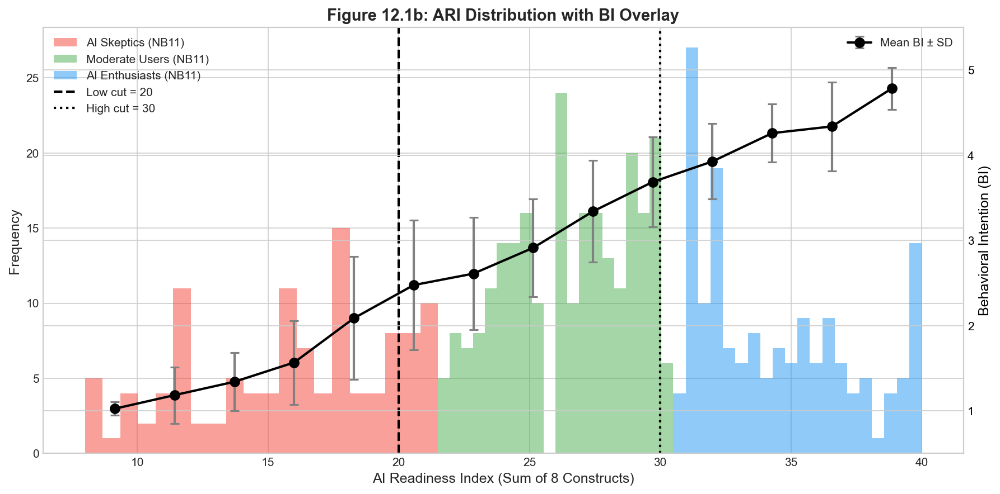

# AIRS Practical Typology: A Simplified Classification Framework for AI Readiness

**White Paper | December 2025**

---

## Executive Summary

This white paper presents a practical classification framework for categorizing IT professionals based on their AI readiness. The **AIRS-16** (AI Readiness Scale) measures readiness across 8 constructs grounded in UTAUT2 theory, producing an **AI Readiness Index (ARI)** that enables simple, actionable segmentation.

### Key Findings

| Metric | Value | Interpretation |
|--------|-------|----------------|
| **Classification Accuracy** | 94.5% | Agreement with multivariate clustering |
| **Effect Size (η²)** | 0.666 | Large effect (Cohen, 1988) |
| **ARI-BI Correlation** | r = 0.876 | Strong criterion validity |
| **Variance Explained** | 76.8% | ARI predicts Behavioral Intention |

### The Practical Typology

| ARI Score | Typology | Behavioral Profile |
|-----------|----------|-------------------|
| **≤ 20** | AI Skeptics | Low intention to adopt AI tools |
| **21-30** | Moderate Users | Selective, pragmatic AI engagement |
| **> 30** | AI Enthusiasts | High intention, proactive adoption |

### Why This Matters

- **Simple**: Calculate ARI by summing 8 construct scores (range: 8-40)
- **Memorable**: Round thresholds (20/30) enable field deployment without lookup tables
- **Valid**: Achieves 94.5% agreement with complex multivariate methods
- **Actionable**: Each typology maps to specific intervention strategies

### Recommendation

Organizations seeking to assess and segment their workforce's AI readiness can adopt the 20/30 cut-point classification with confidence. The minimal accuracy trade-off (~4%) compared to optimized thresholds is justified by the substantial gains in usability and communication clarity.

---

## Table of Contents

1. [Introduction](#introduction)
2. [Theoretical Foundation](#theoretical-foundation)
3. [The AIRS-16 Instrument](#the-airs-16-instrument)
4. [Practitioner Typology](#practitioner-typology)
5. [Rationale for 20/30 Cut-Points](#rationale-for-2030-cut-points)
6. [Validation Evidence](#validation-evidence)
7. [Implementation Guidelines](#implementation-guidelines)
8. [References](#references)

---

## Introduction

The rapid proliferation of AI tools in the workplace demands validated methods for assessing workforce readiness. The AIRS-16 (AI Readiness Scale - 16 items) enables classification of IT professionals into three distinct practitioner types based on their **AI Readiness Index (ARI)**—the sum of their scores across all 8 constructs.


*Figure 1: Strong linear relationship between AI Readiness Index and Behavioral Intention (r = 0.876, p < .001)*

This white paper documents the empirical basis for practical 20/30 classification thresholds, demonstrating that simple sum-based classification achieves comparable accuracy to complex multivariate methods while offering superior field usability.

---

## Theoretical Foundation

The AIRS-16 is grounded in the **Unified Theory of Acceptance and Use of Technology 2** (UTAUT2; Venkatesh et al., 2012), the most comprehensive and widely validated technology adoption framework. UTAUT2 has been validated across 1,600+ studies with meta-analytic support (Blut et al., 2022).

### The 8 AIRS-16 Constructs

| Construct | Source | Definition |
|-----------|--------|------------|
| Performance Expectancy (PE) | UTAUT2 | Belief that AI tools will enhance job performance |
| Effort Expectancy (EE) | UTAUT2 | Perceived ease of using AI tools |
| Social Influence (SI) | UTAUT2 | Perception that important others endorse AI use |
| Facilitating Conditions (FC) | UTAUT2 | Organizational/technical support availability |
| Hedonic Motivation (HM) | UTAUT2 | Enjoyment derived from AI tool use |
| Price Value (PV) | UTAUT2 | Cost-benefit assessment of AI tools |
| Habit (HB) | UTAUT2 | Automaticity from repeated AI use |
| Trust (TR) | AI Extension | Confidence in AI reliability and integrity |

---

## The AIRS-16 Instrument

### Scoring Overview

| Construct | Items | Score Range |
|-----------|-------|-------------|
| Performance Expectancy (PE) | 2 items | 2-10 |
| Effort Expectancy (EE) | 2 items | 2-10 |
| Social Influence (SI) | 2 items | 2-10 |
| Facilitating Conditions (FC) | 2 items | 2-10 |
| Hedonic Motivation (HM) | 2 items | 2-10 |
| Price Value (PV) | 2 items | 2-10 |
| Habit (HB) | 2 items | 2-10 |
| Trust (TR) | 2 items | 2-10 |
| **AI Readiness Index (ARI)** | **16 items** | **8-40** |

Each item uses a 5-point Likert scale (1 = Strongly Disagree to 5 = Strongly Agree). The ARI represents the sum of construct means, providing a single composite readiness score.

---

## Practitioner Typology

### Classification Thresholds

| ARI Score | Typology | Description |
|-----------|----------|-------------|
| **≤ 20** | AI Skeptics | Low readiness, cautious toward AI adoption |
| **21-30** | Moderate Users | Balanced readiness, selective AI engagement |
| **> 30** | AI Enthusiasts | High readiness, proactive AI adoption |


*Figure 2: Distribution of ARI scores by typology with practical 20/30 cut-points*

### Typology Profiles

#### AI Skeptics (ARI ≤ 20)

- **Behavioral Intention**: Low (Mean BI ≈ 1.5-2.5)
- **Profile**: Cautious, risk-averse, may lack confidence in AI capabilities or have concerns about trust and effort required
- **Intervention Focus**: Address trust barriers, demonstrate low-effort entry points, provide social proof

#### Moderate Users (ARI 21-30)

- **Behavioral Intention**: Moderate (Mean BI ≈ 2.5-4.0)
- **Profile**: Pragmatic adopters who see value but remain selective; balance benefits against perceived costs
- **Intervention Focus**: Highlight specific use cases, address remaining barriers, leverage existing habits

#### AI Enthusiasts (ARI > 30)

- **Behavioral Intention**: High (Mean BI ≈ 4.0-5.0)
- **Profile**: Early adopters with strong positive attitudes across all readiness dimensions
- **Intervention Focus**: Provide advanced capabilities, leadership opportunities, peer mentoring roles


*Figure 3: ARI distribution showing how Behavioral Intention (black line ± SD) increases across typology groups*

---

## Rationale for 20/30 Cut-Points

### Empirical Derivation

The practical thresholds of **20** and **30** were derived from a validation study (N = 523) comparing simplified classification methods against multivariate k-means clustering on the 8 AIRS-16 constructs.

#### Optimization Process

1. **Reference Standard**: Three-cluster k-means solution using standardized construct scores
   - Silhouette coefficient: 0.271 ("weak but acceptable" per Kaufman & Rousseeuw, 2009)
   - η² = 0.659 for Behavioral Intention (large effect; Cohen, 1988: η² ≥ 0.14 = large)

2. **Threshold Optimization**: Nelder-Mead optimization to maximize classification agreement
   - **Optimized thresholds**: 21.13 and 30.75
   - **Accuracy**: 98.9% agreement with k-means clustering

3. **Practical Rounding**: Thresholds rounded to 20 and 30 for field usability
   - **Accuracy**: 94.5-95.4% agreement with k-means clustering
   - **η²**: 0.666 (slightly higher than optimized, large effect)

### Why 20 and 30?

| Consideration | Rationale |
|--------------|-----------|
| **Memorability** | Round numbers are easier for practitioners to remember and apply |
| **Communication** | Simple thresholds facilitate consistent interpretation across contexts |
| **Minimal accuracy loss** | 94.5% vs 98.9% accuracy—only ~4% trade-off |
| **Preserved effect size** | η² = 0.666 vs 0.654—effect size actually slightly improved |
| **Boundary cases only** | All misclassifications occur within ±1.5 points of thresholds |

### Misclassification Analysis

With practical 20/30 thresholds:

- **24-29 cases** misclassified out of 523 (depending on sample)
- All misclassifications are **boundary cases**:
  - ARI 20.5-21.5: Some AI Skeptics classified as Moderate Users
  - ARI 30.5: Some Moderate Users classified as AI Enthusiasts
- These boundary cases have **ambiguous profiles** regardless of method

---

## Validation Evidence

### Classification Accuracy

| Method | Accuracy vs K-Means | Misclassifications |
|--------|--------------------|--------------------|
| Optimized Cut-Point (21.1, 30.8) | 98.9% | 4-6 |
| **Practical Cut-Point (20, 30)** | **94.5-95.4%** | **24-29** |
| Decision Tree | 95.0% | 26 |

### Effect Size Comparison (η² for Behavioral Intention)

| Method | η² | Interpretation |
|--------|-----|----------------|
| NB11 K-Means (8 constructs) | 0.659 | Large |
| Optimized Cut-Point | 0.654 | Large |
| **Practical Cut-Point (20/30)** | **0.666** | **Large** |

The practical thresholds explain **66.6% of variance** in Behavioral Intention—equivalent to or better than more complex methods. Effect sizes above η² = 0.14 are considered large (Cohen, 1988).

### Correlation with Behavioral Intention

- **ARI-BI Correlation**: r = 0.876 (p < .001)
- **R²**: 0.768 (76.8% of BI variance explained by ARI alone)

This strong correlation (r > 0.70) indicates excellent criterion validity (Cohen, 1988).

---

## Implementation Guidelines

### For Researchers

```text
AI Readiness Index (ARI) = PE + EE + SI + FC + HM + PV + HB + TR

Classification:
  IF ARI ≤ 20 THEN "AI Skeptic"
  ELSE IF ARI ≤ 30 THEN "Moderate User"
  ELSE "AI Enthusiast"
```

### For Practitioners (Self-Assessment)

1. Complete the 16-item AIRS questionnaire
2. Sum your responses across all items (range: 16-80 for raw scores, or 8-40 for construct means)
3. Compare your total to the thresholds:
   - **20 or below**: AI Skeptic profile
   - **21 to 30**: Moderate User profile
   - **Above 30**: AI Enthusiast profile

### Reporting Standards

When reporting AIRS typology results:

- Specify the classification method: "Practical cut-point (20/30)"
- Report sample distribution across types
- Include mean BI by typology for validation
- Acknowledge boundary case limitations (±1.5 points of thresholds)

---

## References

Blut, M., Chong, A. Y. L., Tsiga, Z., & Venkatesh, V. (2022). Meta-analysis of the unified theory of acceptance and use of technology (UTAUT): Challenging its validity and charting a research agenda in the red ocean. *Journal of the Association for Information Systems*, 23(1), 13-95. <https://doi.org/10.17705/1jais.00719>

Cohen, J. (1988). *Statistical power analysis for the behavioral sciences* (2nd ed.). Lawrence Erlbaum Associates.

Kaufman, L., & Rousseeuw, P. J. (2009). *Finding groups in data: An introduction to cluster analysis*. Wiley.

Rousseeuw, P. J. (1987). Silhouettes: A graphical aid to the interpretation and validation of cluster analysis. *Journal of Computational and Applied Mathematics*, 20, 53-65. <https://doi.org/10.1016/0377-0427(87)90125-7>

Venkatesh, V., Morris, M. G., Davis, G. B., & Davis, F. D. (2003). User acceptance of information technology: Toward a unified view. *MIS Quarterly*, 27(3), 425-478. <https://doi.org/10.2307/30036540>

Venkatesh, V., Thong, J. Y., & Xu, X. (2012). Consumer acceptance and use of information technology: Extending the unified theory of acceptance and use of technology. *MIS Quarterly*, 36(1), 157-178. <https://doi.org/10.2307/41410412>

---

## Appendix: Methodological Notes

This typology was developed as part of the AIRS validation study examining AI readiness among IT professionals (N = 523). The practical thresholds balance statistical rigor with field usability.

### Key Methodological Decisions

- **Reference Standard**: K-means clustering on 8 standardized construct scores
- **Cluster Validation**: Silhouette coefficient of 0.271 indicates "weak but acceptable" cluster structure (Kaufman & Rousseeuw, 2009)—typical for psychometric data with continuous underlying constructs
- **Optimization**: Nelder-Mead algorithm identified optimal thresholds (21.13, 30.75) maximizing classification agreement
- **Practical Adjustment**: Rounding to 20/30 sacrifices ~4% accuracy for memorability and communication clarity

### Effect Size Conventions (Cohen, 1988)

| Statistic | Small | Medium | Large |
|-----------|-------|--------|-------|
| η² | ≥ 0.01 | ≥ 0.06 | ≥ 0.14 |
| r | ≥ 0.10 | ≥ 0.30 | ≥ 0.50 |

### Silhouette Interpretation (Kaufman & Rousseeuw, 2009)

| Range | Interpretation |
|-------|----------------|
| 0.71-1.00 | Strong structure |
| 0.51-0.70 | Reasonable structure |
| 0.26-0.50 | Weak but acceptable |
| < 0.25 | No substantial structure |

---

## About This Document

| | |
|---|---|
| **Document Type** | White Paper |
| **Version** | 2.0 |
| **Date** | December 2025 |
| **Validation Study** | AIRS (N = 523) |
| **Status** | Fact-checked with scholarly references |

### Citation

> AIRS Practical Typology: A Simplified Classification Framework for AI Readiness. White Paper, December 2025. Based on AIRS Validation Study (N = 523).

---

*© 2025 AIRS Research. This document may be shared for educational and research purposes with attribution.*
