# AIRS User Typology: Four AI Adoption Profiles

This document presents the four-cluster typology discovered through K-means cluster analysis (k=4, N=523) in the AIRS research project.

## Clustering Methodology

### Constructs Used in Clustering (6 of 13 Measured)

The typology was derived using **6 constructs**:

| Construct | Abbr. | Role in Clustering | Items |
|-----------|-------|-------------------|-------|
| Performance Expectancy | PE | Predictor | PE1, PE2 |
| Effort Expectancy | EE | Predictor | EE1, EE2 |
| Trust in AI | TR | Predictor | TR1, TR2 |
| Habit | HB | Predictor | HB1, HB2 |
| AI Anxiety | AX | Differentiator | AX1, AX2 |
| Behavioral Intention | BI | Outcome | BI1-BI4 |

### Why These 6 Constructs?

**Included:**

- **PE, EE, TR, HB**: Core psychological drivers of AI adoption (from UTAUT2)
- **AX**: Critical differentiator—separates Anxious Avoiders from Moderate Users
- **BI**: Outcome variable—measures adoption intention

**Excluded from clustering** (but in AIRS-16 validated scale):

- **SI (Social Influence)**: Environmental/contextual, not individual trait
- **FC (Facilitating Conditions)**: Organizational factor, not psychological
- **HM (Hedonic Motivation)**: Less discriminating for workplace contexts
- **PV (Price Value)**: More relevant for consumer than organizational adoption

### Important Caveats

| Construct | Status | Note |
|-----------|--------|------|
| **AX** | Dropped from AIRS-16 | α = .301 (inadequate reliability), but retained in clustering for theoretical value |
| **BI** | Outcome variable | Not part of AIRS predictor scale; measured separately with 4 items |

---

## Typology Overview


## Cluster Profiles

```mermaid
flowchart TB
    subgraph TYPOLOGY["🧠 AIRS USER TYPOLOGY (N=523)"]
        direction TB

        subgraph ENT["🚀 AI ENTHUSIASTS"]
            E_PCT["16% (n=84)"]
            E_PROFILE["High PE (+1.42σ) | High Trust (+1.37σ)<br/>Low Anxiety (-0.86σ) | High BI (+1.32σ)"]
            E_CHAR["Early adopters, high engagement"]
            E_STRAT["Strategy: Recruit as champions"]
        end

        subgraph CAU["🔍 CAUTIOUS ADOPTERS"]
            C_PCT["30% (n=157)"]
            C_PROFILE["High PE (+1.16σ) | Mod Trust (+0.86σ)<br/>Elevated Anxiety (+0.84σ) | Mod BI (+0.88σ)"]
            C_CHAR["See potential, need evidence"]
            C_STRAT["Strategy: Provide proof points"]
        end

        subgraph MOD["⚖️ MODERATE USERS"]
            M_PCT["37% (n=191)"]
            M_PROFILE["Avg PE (+0.26σ) | Neutral Trust (+0.01σ)<br/>Moderate Anxiety (+0.42σ) | Neutral BI (-0.07σ)"]
            M_CHAR["Pragmatic fence-sitters"]
            M_STRAT["Strategy: Reduce friction, social proof"]
        end

        subgraph ANX["😰 ANXIOUS AVOIDERS"]
            A_PCT["17% (n=91)"]
            A_PROFILE["Low PE (-1.16σ) | Low Trust (-1.49σ)<br/>High Anxiety (+0.76σ) | Low BI (-1.53σ)"]
            A_CHAR["Trust barriers block adoption"]
            A_STRAT["Strategy: Trust-first approach"]
        end
    end

    style ENT fill:#D1FAE5,stroke:#059669,stroke-width:2px
    style CAU fill:#FEF3C7,stroke:#D97706,stroke-width:2px
    style MOD fill:#EDE9FE,stroke:#6366F1,stroke-width:2px
    style ANX fill:#FEE2E2,stroke:#DC2626,stroke-width:2px
```



## Psychological Dimensions Comparison


## Strategic Resource Allocation


## Intervention Decision Flow

```mermaid
flowchart LR
    START([Assess User]) --> Q1{High Anxiety?}

    Q1 -->|No| Q2{High BI?}
    Q1 -->|Yes| Q3{High BI?}

    Q2 -->|Yes| ENT[🚀 Enthusiast<br/>Champion Program]
    Q2 -->|No| MOD[⚖️ Moderate<br/>Social Proof + Friction Reduction]

    Q3 -->|Yes| CAU[🔍 Cautious<br/>Evidence + Pilot Programs]
    Q3 -->|No| ANX[😰 Anxious<br/>Trust-First Intervention]

    ENT --> OUT1([Beta Access<br/>Advocacy Platform])
    CAU --> OUT2([Case Studies<br/>ROI Calculator])
    MOD --> OUT3([Simple Onboarding<br/>Peer Testimonials])
    ANX --> OUT4([Human Support<br/>Gradual Exposure])

    style ENT fill:#D1FAE5,stroke:#059669
    style CAU fill:#FEF3C7,stroke:#D97706
    style MOD fill:#EDE9FE,stroke:#6366F1
    style ANX fill:#FEE2E2,stroke:#DC2626
```



## Key Insight: Movable Segments

```mermaid
block-beta
    columns 3

    block:movable:2
        columns 2
        CAU["🔍 Cautious Adopters\n30%"]:1
        MOD["⚖️ Moderate Users\n37%"]:1
    end

    block:fixed:1
        columns 1
        ENT["🚀 Enthusiasts\n16%"]
        ANX["😰 Avoiders\n17%"]
    end

    style movable fill:#F0FDF4,stroke:#059669,stroke-width:3px
    style CAU fill:#FEF3C7,stroke:#D97706
    style MOD fill:#EDE9FE,stroke:#6366F1
    style ENT fill:#D1FAE5,stroke:#059669
    style ANX fill:#FEE2E2,stroke:#DC2626
```



**67% of the population (Cautious + Moderate)** represents the highest-ROI intervention targets:

- **Cautious Adopters**: High interest but need reassurance → Medium effort, high return
- **Moderate Users**: Follow the crowd → Medium effort, leverage social influence

---

## Summary Table

| Segment | n | % | Key Driver | Primary Barrier | Effort |
|---------|---|---|------------|-----------------|--------|
| 🚀 Enthusiasts | 84 | 16% | Already sold | None | Low |
| 🔍 Cautious | 157 | 30% | Proof of value | Anxiety + uncertainty | Medium |
| ⚖️ Moderate | 191 | 37% | Social proof | Inertia | Medium |
| 😰 Anxious | 91 | 17% | Nothing yet | Deep distrust | High |

---

## Determining Typology from Scale Responses

To classify new respondents into one of the four typologies, use one of the methods below.

---

### Method 1: Full 6-Construct Classification (Recommended)

This method uses all 6 constructs from the original clustering. Requires the **AIRS-16 scale** (for PE, EE, TR, HB) plus **supplementary items** (for AX and BI).

#### Step 1: Calculate Construct Means

| Construct | Items | Calculation |
|-----------|-------|-------------|
| **PE** (Performance Expectancy) | PE1, PE2 | Mean of 2 items |
| **EE** (Effort Expectancy) | EE1, EE2 | Mean of 2 items |
| **TR** (Trust in AI) | TR1, TR2 | Mean of 2 items |
| **HB** (Habit) | HB1, HB2 | Mean of 2 items |
| **AX** (AI Anxiety)* | AX1, AX2 | Mean of 2 items |
| **BI** (Behavioral Intention)* | BI1, BI2, BI3, BI4 | Mean of 4 items |

*\*Not in AIRS-16 predictor scale but required for original clustering*

#### Step 2: Standardize Scores (Z-Scores)

$$z = \frac{(\text{raw\_score} - \text{population\_mean})}{\text{population\_sd}}$$

**Population Parameters** (from N=523, calculated from item means):

| Construct | Mean (M) | SD |
|-----------|----------|-----|
| PE | 3.48 | 1.15 |
| EE | 3.72 | 0.97 |
| TR | 3.26 | 1.09 |
| HB | 3.06 | 1.20 |
| AX | 3.38 | 0.90 |
| BI | 2.95 | 1.16 |

*Note: SDs are approximate. For precise classification, use the centroids directly.*

#### Step 3: Calculate Distance to Centroids

**Cluster Centroids** (standardized z-scores from Table 4.6):

| Cluster | PE (z) | EE (z) | TR (z) | HB (z) | AX (z) | BI (z) |
|---------|--------|--------|--------|--------|--------|--------|
| 🚀 AI Enthusiasts | +1.42 | +1.45 | +1.37 | +1.03 | -0.86 | +1.32 |
| 🔍 Cautious Adopters | +1.16 | +1.14 | +0.86 | +1.01 | +0.84 | +0.88 |
| ⚖️ Moderate Users | +0.26 | +0.42 | +0.01 | -0.42 | +0.42 | -0.07 |
| 😰 Anxious Avoiders | -1.16 | -0.48 | -1.49 | -1.69 | +0.76 | -1.53 |

**Distance Formula** (Euclidean):

$$d = \sqrt{\sum_{i=1}^{6}(z_i - c_i)^2}$$

**Assign to the cluster with the smallest distance.**

---

### Method 2: Reduced 4-Construct Classification (AIRS-16 Only)

If you only have responses to the **validated AIRS-16 scale** (without AX and BI items), use this reduced approach with the 4 overlapping constructs.

**⚠️ Limitation**: Missing AX and BI reduces discriminant power between clusters.

#### Reduced Centroids (PE, EE, TR, HB only)

| Cluster | PE (z) | EE (z) | TR (z) | HB (z) |
|---------|--------|--------|--------|--------|
| 🚀 AI Enthusiasts | +1.42 | +1.45 | +1.37 | +1.03 |
| 🔍 Cautious Adopters | +1.16 | +1.14 | +0.86 | +1.01 |
| ⚖️ Moderate Users | +0.26 | +0.42 | +0.01 | -0.42 |
| 😰 Anxious Avoiders | -1.16 | -0.48 | -1.49 | -1.69 |

**Population Parameters** (AIRS-16 constructs only):

| Construct | Mean (M) | SD |
|-----------|----------|-----|
| PE | 3.48 | 1.15 |
| EE | 3.72 | 0.97 |
| TR | 3.26 | 1.09 |
| HB | 3.06 | 1.20 |

**⚠️ Classification Limitations** (without AX and BI):

- **Enthusiasts vs. Cautious Adopters**: Both have high PE, EE, TR, HB—only AX differentiates them
- **Moderate Users vs. Anxious Avoiders**: Both have moderate-to-low scores—AX and BI differentiate them

**Recommendation**: For accurate typology classification, administer the supplementary AX and BI items alongside AIRS-16.

---

### Method 3: Decision Rules (Quick Heuristic)

For rapid screening when precise classification isn't required. Requires PE, TR, HB, and AX.

```mermaid
flowchart TD
    START([Calculate PE, EE, TR, HB means<br/>+ supplementary AX, BI]) --> Q1{PE ≥ 4.0 AND<br/>TR ≥ 4.0?}

    Q1 -->|Yes| Q2{AX < 3.0?}
    Q1 -->|No| Q3{TR < 2.5?}

    Q2 -->|Yes| ENT[🚀 AI ENTHUSIAST<br/>High readiness, Low anxiety]
    Q2 -->|No| CAU[🔍 CAUTIOUS ADOPTER<br/>High readiness, High anxiety]

    Q3 -->|Yes| ANX[😰 ANXIOUS AVOIDER<br/>Low trust, Low readiness]
    Q3 -->|No| MOD[⚖️ MODERATE USER<br/>Average profile]

    style ENT fill:#D1FAE5,stroke:#059669,stroke-width:2px
    style CAU fill:#FEF3C7,stroke:#D97706,stroke-width:2px
    style MOD fill:#EDE9FE,stroke:#6366F1,stroke-width:2px
    style ANX fill:#FEE2E2,stroke:#DC2626,stroke-width:2px
```



#### Decision Rules Table

| Rule | Condition | Classification |
|------|-----------|----------------|
| 1 | PE ≥ 4.0 AND TR ≥ 4.0 AND AX < 3.0 | 🚀 **AI Enthusiast** |
| 2 | PE ≥ 4.0 AND TR ≥ 4.0 AND AX ≥ 3.0 | 🔍 **Cautious Adopter** |
| 3 | TR < 2.5 AND HB < 2.0 | 😰 **Anxious Avoider** |
| 4 | Otherwise | ⚖️ **Moderate User** |

*Note: Decision rules are approximations (~70-75% accuracy). For research purposes, use centroid-based classification.*

---

### Method 4: Python Implementation

Programmatic classification using Euclidean distance to cluster centroids.

```python
import numpy as np

# ============================================================
# FULL CLASSIFICATION (6 constructs: PE, EE, TR, HB, AX, BI)
# ============================================================

CENTROIDS_FULL = {
    'AI Enthusiast': np.array([1.42, 1.45, 1.37, 1.03, -0.86, 1.32]),
    'Cautious Adopter': np.array([1.16, 1.14, 0.86, 1.01, 0.84, 0.88]),
    'Moderate User': np.array([0.26, 0.42, 0.01, -0.42, 0.42, -0.07]),
    'Anxious Avoider': np.array([-1.16, -0.48, -1.49, -1.69, 0.76, -1.53])
}

# Population parameters: PE, EE, TR, HB, AX, BI
POP_MEANS_FULL = np.array([3.48, 3.72, 3.26, 3.06, 3.38, 2.95])
POP_SDS_FULL = np.array([1.15, 0.97, 1.09, 1.20, 0.90, 1.16])

def classify_typology_full(pe, ee, tr, hb, ax, bi):
    """
    Classify respondent into one of 4 typologies using all 6 constructs.

    Args:
        pe: Performance Expectancy mean (1-5 scale)
        ee: Effort Expectancy mean (1-5 scale)
        tr: Trust in AI mean (1-5 scale)
        hb: Habit mean (1-5 scale)
        ax: AI Anxiety mean (1-5 scale)
        bi: Behavioral Intention mean (1-5 scale)

    Returns:
        tuple: (typology_name, distances_dict)
    """
    raw_scores = np.array([pe, ee, tr, hb, ax, bi])
    z_scores = (raw_scores - POP_MEANS_FULL) / POP_SDS_FULL

    distances = {name: np.sqrt(np.sum((z_scores - c) ** 2))
                 for name, c in CENTROIDS_FULL.items()}

    return min(distances, key=distances.get), distances


# ============================================================
# REDUCED CLASSIFICATION (4 constructs: PE, EE, TR, HB)
# Use when AX and BI items are not available
# ============================================================

CENTROIDS_AIRS16 = {
    'AI Enthusiast': np.array([1.42, 1.45, 1.37, 1.03]),
    'Cautious Adopter': np.array([1.16, 1.14, 0.86, 1.01]),
    'Moderate User': np.array([0.26, 0.42, 0.01, -0.42]),
    'Anxious Avoider': np.array([-1.16, -0.48, -1.49, -1.69])
}

POP_MEANS_AIRS16 = np.array([3.48, 3.72, 3.26, 3.06])
POP_SDS_AIRS16 = np.array([1.15, 0.97, 1.09, 1.20])

def classify_typology_airs16(pe, ee, tr, hb):
    """
    Classify respondent using only 4 constructs (when AX/BI unavailable).

    ⚠️ Reduced precision: Cannot differentiate by anxiety level.

    Args:
        pe: Performance Expectancy mean (1-5 scale)
        ee: Effort Expectancy mean (1-5 scale)
        tr: Trust in AI mean (1-5 scale)
        hb: Habit mean (1-5 scale)

    Returns:
        tuple: (typology_name, distances_dict, warning)
    """
    raw_scores = np.array([pe, ee, tr, hb])
    z_scores = (raw_scores - POP_MEANS_AIRS16) / POP_SDS_AIRS16

    distances = {name: np.sqrt(np.sum((z_scores - c) ** 2))
                 for name, c in CENTROIDS_AIRS16.items()}

    typology = min(distances, key=distances.get)

    # Check if Enthusiast/Cautious distinction is ambiguous
    warning = None
    if typology in ['AI Enthusiast', 'Cautious Adopter']:
        diff = abs(distances['AI Enthusiast'] - distances['Cautious Adopter'])
        if diff < 0.5:
            warning = "Ambiguous: Add AX items to distinguish Enthusiast vs Cautious"

    return typology, distances, warning


# Example usage
print("=== Full Classification (with AX, BI) ===")
result, dists = classify_typology_full(
    pe=4.25, ee=4.00, tr=4.50, hb=3.75, ax=2.25, bi=4.33
)
print(f"Typology: {result}")

print("\n=== AIRS-16 Only ===")
result, dists, warn = classify_typology_airs16(pe=4.25, ee=4.00, tr=4.50, hb=3.75)
print(f"Typology: {result}")
if warn:
    print(f"⚠️ {warn}")
```

---

### Classification Method Comparison

| Method | Constructs | Precision | Best Use Case |
|--------|------------|-----------|---------------|
| **Full 6-Construct** | PE, EE, TR, HB, AX, BI | Highest | Research studies with full instrument |
| **Reduced 4-Construct** | PE, EE, TR, HB | Moderate | Screening with AIRS-16 only |
| **Decision Rules** | PE, TR, AX, HB | Approximate | Quick field classification |

**Recommendation**: For accurate typology assignment, collect all 6 constructs. Administer the 6 supplementary items (AX1, AX2, BI1, BI2, BI3, BI4) alongside the AIRS-16 scale.

---

## Source & Methodology

- **Data Source**: AIRS Research Project, Phase 9 Comprehensive Review ([09_Comprehensive_Review.ipynb](../airs_experiment/09_Comprehensive_Review.ipynb))
- **Method**: K-means cluster analysis (k=4) on standardized construct scores
- **Sample**: N=523 respondents
- **Constructs**: 6 (PE, EE, TR, HB, AX, BI) from UTAUT2 + AI-specific extensions
- **Centroids**: See [Table_4.6_User_Typology.md](tables/Table_4.6_User_Typology.md)
