\begin{titlepage}
\thispagestyle{empty}
\singlespacing
\centering
\vspace*{1cm}

{\LARGE\bfseries Artificial Intelligence Readiness Scale: Extending UTAUT2 for Enterprise AI Adoption\par}

\vspace{1.5cm}

A Dissertation Submitted in Partial Fulfillment of the\\
Requirements for the Degree of\\[0.3cm]
{\large Doctor of Business Administration\par}

\vspace{1cm}

{\large Touro University Worldwide\par}
{\normalsize DBA712 - Doctoral Research Project\par}

\vspace{1.5cm}

{\large By\par}
\vspace{0.3cm}
{\Large\bfseries Fabio Correa\par}

\vspace{1.5cm}

{\large Dissertation Committee:\par}
\vspace{0.3cm}
Chair: Dr. Karina Kasztelnik\\
Faculty Member: Dr. Jerome Jones\\
Faculty Member: Dr. Donna Day

\vfill

{\large December 2025\par}
\end{titlepage}

\newpage
\thispagestyle{empty}

\begin{center}
{\Large\bfseries Abstract}
\end{center}

\vspace{1cm}

\doublespacing

This dissertation develops and validates the AI Readiness Scale (AIRS), an instrument measuring artificial intelligence adoption readiness among students and professionals. Extending UTAUT2 with AI-specific constructs, the study examines factors influencing behavioral intention to adopt AI tools.

Using a sample of 523 United States participants, exploratory and confirmatory factor analyses validated an 8-factor, 16-item model with excellent fit (CFI = .975, TLI = .960, RMSEA = .065). The structural model revealed Price Value (β = .505, p < .001), Hedonic Motivation (β = .217, p = .014), and Social Influence (β = .136, p = .024) as significant predictors, explaining 85.2% of variance in behavioral intention. The 8-factor model incorporating AI Trust was selected over a more parsimonious 7-factor alternative (R² = .861) because the trust construct provides essential diagnostic value: organizations can assess trust deficits and design targeted interventions to build confidence in AI systems, a capability absent from pure UTAUT2 implementations. Traditional UTAUT predictors (Performance Expectancy, Effort Expectancy, Facilitating Conditions, Habit) did not significantly predict AI adoption, suggesting AI represents a distinct technology category where cost-benefit perceptions outweigh conventional utility considerations.

Four proposed constructs (Voluntariness, Explainability, Ethical Risk, AI Anxiety) were excluded due to inadequate reliability (α = .30–.58). Measurement invariance testing across student (n = 216) and professional (n = 307) populations demonstrated configural invariance. Cluster analysis identified four user segments: AI Enthusiasts (16%), Cautious Adopters (30%), Moderate Users (37%), and Anxious Avoiders (17%).

The study contributes a validated diagnostic instrument for AI adoption research that enables identification of specific adoption barriers and targeted intervention design, establishing a foundation for future organizational applications.

\textbf{Keywords:} artificial intelligence, technology adoption, UTAUT2, scale development, psychometric validation, structural equation modeling

\newpage

## Acknowledgments

I extend my deepest gratitude to the individuals who made this dissertation possible.

To my dissertation chair, Dr. Karina Kasztelnik, thank you for your guidance, patience, and scholarly wisdom throughout this journey. Your expertise in research methodology and commitment to academic excellence shaped both this work and my development as a researcher.

To my committee members, Dr. Jerome Jones and Dr. Donna Day, thank you for your thoughtful feedback, challenging questions, and unwavering support. Your diverse perspectives strengthened this research in countless ways.

To my family, thank you for your understanding during the countless hours devoted to this project. Your encouragement sustained me through the challenges of doctoral study.

To my professional colleagues and the participants who generously shared their experiences with AI tools, thank you for making this research possible. Your insights illuminate the path forward for organizations navigating the AI transformation.

Finally, I acknowledge the broader academic community whose foundational work (particularly Venkatesh and colleagues' development of UTAUT) provided the theoretical architecture upon which this research builds. Scholarship advances through cumulative contribution, and I am honored to add to this conversation.


\newpage

\tableofcontents

\newpage

\listoftables

\newpage

\listoffigures

\newpage
# Chapter 1: Introduction

## 1.1 Background and Context

Artificial intelligence (AI) has evolved from a specialist capability to a foundational driver of enterprise transformation. Between 2023 and 2025, organizations accelerated AI integration across functions and geographies, fueled by advances in large language models, cloud-based ecosystems, and rapid democratization through enterprise platforms such as Microsoft 365 Copilot and ChatGPT Enterprise.

According to McKinsey's *State of AI* series, AI adoption has accelerated dramatically: after hovering around 50 percent for years, adoption jumped to 72 percent in 2024 and reached 88 percent by late 2025 [@mckinseyStateAI2024; @mckinseyStateAI2025]. This growth represents a fundamental shift in how organizations approach technology. AI is no longer an experimental capability but an expected component of modern work.

Yet this growth in adoption has not translated proportionally into business impact. Boston Consulting Group reported that only 5 percent of companies achieve measurable business value from AI initiatives, while roughly 74 percent struggle to scale beyond proofs of concept [@bcgAIAdoption2024; @bcgAIAdoption2025]. McKinsey found that only about 6 percent of organizations qualify as "AI high performers," that is, those attributing meaningful EBIT impact to AI and reporting significant value, while most organizations remain in piloting rather than scaling phases [@mckinseyStateAI2025]. IBM's Global AI Adoption Index found that 37 percent of enterprises cite data complexity and quality as their top barrier to AI success [@ibm2023], while Capgemini research suggests that organizations embedding AI into redesigned workflows achieve substantially higher returns than those merely layering AI atop legacy processes [@capgemini2025].

These figures reveal a paradox: AI is nearly ubiquitous, yet most enterprises fail to realize sustained economic or operational returns. MIT Media Lab's NANDA initiative estimates that 90 to 95 percent of generative-AI pilots fail to scale or yield measurable profit-and-loss improvements [@mitMediaLab2025]. This persistent gap between adoption rates and value realization (termed the "adoption-value gap") represents both a significant business challenge and a research opportunity.

Understanding why individuals adopt or resist AI tools is essential for closing this gap. While organizational-level barriers such as data infrastructure, governance frameworks, and change management have received considerable attention in practitioner literature, individual-level adoption psychology remains underexplored in empirical research. Technology acceptance research offers theoretical frameworks for understanding these individual differences, yet existing instruments were developed for earlier technology generations and may not capture the unique characteristics of AI tools.

## 1.2 Statement of the Problem

Despite decades of technology acceptance research, organizations lack validated instruments for assessing individual-level AI adoption readiness. This gap creates three interconnected problems:

**Theoretical Gap**: The dominant technology acceptance framework, the Unified Theory of Acceptance and Use of Technology 2 (UTAUT2), was developed and validated primarily on mobile and consumer technologies [@venkatesh2012consumer]. While UTAUT2 explains significant variance in technology adoption generally, AI tools present unique characteristics that may require theoretical extension. These include concerns about job displacement, questions of algorithmic transparency, and trust in autonomous decision-making systems. Venkatesh [-@venkatesh2021adoption] identified nine unique research challenges for AI adoption that existing frameworks do not fully address, calling for empirical investigation of AI-specific adoption factors.

**Measurement Gap**: Current AI adoption assessments in organizational practice rely largely on ad hoc surveys or general technology readiness measures. No psychometrically validated instrument exists specifically for measuring AI adoption readiness in professional and academic contexts. This measurement gap limits both research comparability and practical diagnostic utility.

**Practice Gap**: Organizations invest heavily in AI infrastructure and training but often lack the diagnostic tools to identify which employees are likely to adopt AI tools, which will resist, and why. Without valid measurement instruments, intervention strategies remain poorly targeted. The 90–95 percent pilot failure rate suggests that technology deployment without attention to individual adoption psychology produces limited returns [@mitMediaLab2025]. Industry research identifies skill gaps and governance challenges as primary barriers: Deloitte's State of Generative AI reports highlight insufficient AI expertise as a significant constraint [@deloitte2024genai], while Gartner identifies governance maturity as a primary differentiator between AI leaders and laggards [@gartner2025].

## 1.3 Purpose of the Study

The purpose of this study is to develop and validate the **AI Readiness Scale (AIRS)**: a psychometrically sound diagnostic instrument extending UTAUT2 for enterprise AI tool adoption. The AIRS serves dual purposes: as a research scale for investigating AI adoption phenomena and as a diagnostic tool enabling organizations to identify specific adoption barriers and design targeted interventions. Specifically, this research aims to:

1. **Develop** a theoretically grounded diagnostic instrument incorporating both established UTAUT2 constructs and AI-specific factors, particularly AI Trust, enabling identification of specific adoption barriers.

2. **Validate** the instrument through rigorous split-sample methodology, using exploratory factor analysis (EFA) on a development sample and confirmatory factor analysis (CFA) on an independent holdout sample.

3. **Test** structural relationships between adoption predictors and behavioral intention through structural equation modeling (SEM).

4. **Examine** measurement invariance across student and professional populations to establish the instrument's applicability across diverse workforce contexts.

5. **Identify** moderating factors (including professional experience and AI usage frequency) that influence adoption pathways.

6. **Establish** a validated psychometric foundation for future research and organizational applications.

## 1.4 Research Questions and Hypotheses

### 1.4.1 Research Questions

**Primary Research Question:**
How can UTAUT2 be extended with AI-specific constructs to better predict behavioral intention to adopt AI tools in professional and academic contexts?

**Secondary Research Questions:**

1. What is the factor structure of an AI-specific adoption readiness instrument?
2. Does the instrument demonstrate measurement invariance across student and professional populations?
3. Which factors most strongly predict behavioral intention to adopt AI tools?
4. Does AI Trust significantly predict adoption intention beyond UTAUT2 constructs?
5. What moderating factors influence the relationships between predictors and adoption intention?

### 1.4.2 Research Hypotheses

Based on UTAUT2 theory and AI-specific considerations, this study tests the following hypotheses:

**Core UTAUT2 Hypotheses (H1a–H1g)**:

- H1a–H1g: The seven UTAUT2 constructs (Performance Expectancy, Effort Expectancy, Social Influence, Facilitating Conditions, Hedonic Motivation, Price Value, and Habit) positively predict Behavioral Intention to adopt AI tools.

**AI Extension Hypothesis (H2)**:

- H2: AI Trust positively predicts Behavioral Intention beyond UTAUT2 constructs.

**Moderation Hypotheses (H3–H4)**:

- H3: Professional experience moderates the relationships between predictors and Behavioral Intention.
- H4: Population (Student vs. Professional) moderates the relationships between predictors and Behavioral Intention.

**Behavioral Validation Hypothesis (H5)**:

- H5: Behavioral Intention positively correlates with actual AI tool usage behavior.

Full hypothesis specifications with theoretical rationales are presented in Chapter 3 §3.3.2.

## 1.5 Theoretical and Practical Significance

### 1.5.1 Theoretical Significance

This study makes several contributions to technology acceptance scholarship:

**Framework Extension**: By empirically testing AI-specific constructs alongside established UTAUT2 predictors, this research extends technology acceptance theory to the AI domain. The theoretical extension responds to Venkatesh's [-@venkatesh2021adoption] call for AI-specific adoption research and addresses the unique characteristics of AI technologies that distinguish them from previous technology generations.

**Construct Validation**: The development of reliable measures for AI Trust provides validated operationalizations for future research. The psychometric validation process (including convergent validity, discriminant validity, and composite reliability assessment) ensures that these constructs meet scholarly standards for measurement quality.

**Cross-Population Invariance**: Testing measurement invariance across student and professional populations advances understanding of how adoption factors function across diverse workforce contexts. Configural invariance findings support the instrument's utility for comparative research across population segments.

**Moderation Discovery**: Identification of experience as a moderating factor on hedonic motivation pathways contributes novel insights to the technology acceptance literature, suggesting that adoption mechanisms may differ based on user characteristics in ways not previously documented.

### 1.5.2 Practical Significance

Beyond theoretical contributions, this research establishes foundations for future organizational applications:

**Validated Diagnostic Instrument**: The validated 16-item AIRS provides researchers and organizations with a psychometrically sound tool for measuring AI adoption readiness constructs. Beyond measurement, the 8-factor structure enables diagnostic assessment: organizations can identify specific barriers (e.g., low trust, inadequate perceived value) and design targeted interventions. The instrument's brevity (approximately 5 minutes to complete) enables deployment at scale while maintaining measurement rigor.

**User Typology Discovery**: The four-segment user typology identified through cluster analysis (AI Enthusiasts [16%], Cautious Adopters [30%], Moderate Users [37%], and Anxious Avoiders [17%]) provides a framework for future intervention research. The typology offers testable hypotheses about differential treatment effects that warrant experimental validation.

**Adoption Driver Insights**: The finding that Price Value (β = .505) dominates adoption intention, rather than traditional performance messaging, suggests hypotheses for organizational AI communication strategies that warrant future experimental testing.

**Moderation Discovery**: The moderating effect of professional experience on hedonic motivation pathways indicates that adoption mechanisms may differ by experience level, a finding that suggests hypotheses for experience-tailored training approaches.

## 1.6 Scope and Delimitations

### 1.6.1 Scope

This study focuses on individual-level adoption of AI tools in professional and academic contexts. The research:

- **Examines** behavioral intention to adopt AI tools as the primary outcome variable, with actual tool usage as a behavioral validation criterion.
- **Encompasses** both students and employed professionals across multiple industries, providing cross-population generalizability testing.
- **Includes** common AI tools such as ChatGPT, Microsoft Copilot, and Google Gemini as the technology context.
- **Applies** established psychometric validation methodology including split-sample EFA/CFA, structural equation modeling, and measurement invariance testing.
- **Addresses** adoption predictors at the individual psychological level rather than organizational or technological levels.

### 1.6.2 Delimitations

The following boundaries define what this study does not address:

**Organizational Factors**: While organizational infrastructure undoubtedly influences AI adoption, this study focuses on individual-level psychological predictors rather than organizational readiness factors such as IT infrastructure, leadership support, or governance frameworks.

**Actual Behavior Prediction**: The primary outcome is behavioral intention rather than sustained behavioral change. While intention strongly correlates with self-reported usage (ρ = .69), the study does not track actual usage behavior over time.

**Specific AI Tool Comparison**: The study examines AI tool adoption generally rather than comparing adoption patterns across specific tools (e.g., ChatGPT vs. Copilot).

**Cultural Context**: Data collection occurred in a single national context (primarily United States respondents). Cross-cultural generalizability requires future investigation.

**Dropped Constructs**: Four initially proposed AI-specific constructs (Voluntariness, α = .406; Explainability, α = .582; Ethical Risk, α = .546; and AI Anxiety, α = .301) demonstrated inadequate reliability and were excluded from the validated model. These constructs remain theoretically important but require revised operationalization in future research.

### 1.6.3 Scope Limitation Rationale

This dissertation deliberately limits its scope to **scale validation** rather than extending into diagnostic application or intervention design. This scope limitation is grounded in both methodological rigor and research ethics considerations.

**Foundational Requirements**: Psychometric validation must precede diagnostic application. Before the AIRS can serve as an organizational diagnostic tool, the instrument must demonstrate adequate reliability (α > .70), structural validity (CFA fit indices), discriminant validity (HTMT < .85), and measurement invariance across target populations. This dissertation addresses these foundational requirements.

**Validation Sequence**: Applied psychometrics follows a validation sequence: scale development -> reliability testing -> structural validation -> invariance testing -> normative data collection -> diagnostic application [@devellis2021]. This study completes the first four stages. Diagnostic application requires additional stages (particularly normative data collection across organizational contexts) that exceed doctoral scope.

**Statistical Limitations**: Certain claims require stronger evidence than cross-sectional self-report data can provide. For example:

- **User typology actionability**: While cluster analysis identified four distinct user segments, intervention effectiveness cannot be established without experimental designs testing differential treatment effects.
- **Adoption-value linkage**: The relationship between individual adoption readiness and organizational AI outcomes requires longitudinal data linking AIRS scores to measurable business metrics.
- **Cut-score development**: Establishing diagnostic thresholds (e.g., "low readiness" vs. "high readiness") requires validation studies demonstrating predictive validity against criterion outcomes.

**Future Research Foundation**: By completing rigorous psychometric validation within appropriate scope, this dissertation provides a credible foundation for future research. The AIRS instrument can support subsequent studies examining diagnostic protocols, intervention effectiveness, and organizational applications, research that builds upon rather than overextends the current findings.

Appendix E outlines a research roadmap for extending this foundational work through scoring algorithms, diagnostic protocols, and intervention frameworks in future investigations.

## 1.7 Definition of Key Terms

| Term | Definition |
|------|------------|
| **UTAUT2** | Unified Theory of Acceptance and Use of Technology 2 (Venkatesh et al., 2012) |
| **AIRS** | AI Readiness Scale: the 16-item psychometric instrument developed and validated in this study, serving both as a research scale and organizational diagnostic tool |
| **AI Trust** | Confidence in AI systems' reliability, accuracy, and benevolence; a novel construct extending UTAUT2 for AI-specific adoption contexts |
| **Behavioral Intention** | An individual's stated intention to use AI tools in their professional or academic work |
| **Performance Expectancy** | The degree to which using AI tools is expected to enhance job performance |
| **Effort Expectancy** | The perceived ease of use associated with AI tools |
| **Social Influence** | The degree to which important others believe one should use AI tools |
| **Facilitating Conditions** | Perceptions of organizational and technical infrastructure supporting AI use |
| **Hedonic Motivation** | The fun or pleasure derived from using AI tools |
| **Price Value** | The cognitive trade-off between perceived benefits of AI tools and their monetary cost |
| **AI Anxiety** | Apprehension or fear associated with AI technology |
| **Measurement Invariance** | The extent to which a measurement instrument functions equivalently across different groups |

## 1.8 Summary and Dissertation Structure

This chapter has introduced the research problem, purpose, questions, and significance of this study examining AI adoption readiness in professional and academic contexts.

The dissertation is organized into six chapters:

**Chapter 1: Introduction** establishes the research context, problem statement, research questions, and significance of the study.

**Chapter 2: Literature Review** examines the evolution of technology acceptance models from TAM through UTAUT2, synthesizes AI-specific adoption research, and develops the conceptual framework for the study.

**Chapter 3: Research Methodology** describes the research design, sampling procedures, instrument development, and analytical strategy employed in the ten-phase validation approach.

**Chapter 4: Findings** presents the empirical results from exploratory factor analysis, confirmatory factor analysis, measurement invariance testing, structural equation modeling, and behavioral validation.

**Chapter 5: Analysis and Discussion** interprets the findings in relation to existing literature, discusses theoretical and practical implications, and addresses unexpected findings.

**Chapter 6: Conclusions, Implications, and Recommendations** summarizes the study's contributions, provides recommendations for practitioners and organizations, acknowledges limitations, and suggests directions for future research.

\newpage

# Chapter 2: Literature Review

## 2.1 Introduction

The rapid enterprise adoption of artificial intelligence has outpaced the explanatory capacity of traditional technology acceptance frameworks. While organizations have embraced AI at unprecedented rates (rising from approximately 50% historically to 72% in 2024 and 88% by late 2025 [@mckinseyStateAI2024; @mckinseyStateAI2025]), most remain in piloting phases rather than scaled deployment. McKinsey reports that only about one-third of organizations have begun scaling AI programs, and just 6% qualify as "AI high performers" with meaningful enterprise-level EBIT impact [@mckinseyStateAI2025]. This adoption-value paradox presents both a theoretical puzzle and a practical challenge: why do established technology acceptance models incompletely predict AI adoption, and what additional constructs must be incorporated to guide organizational intervention?

This chapter establishes the theoretical foundation for the Artificial Intelligence Readiness Scale (AIRS) by pursuing three objectives. First, it traces the evolution of technology acceptance research from foundational behavioral theories through the Unified Theory of Acceptance and Use of Technology (UTAUT) and its consumer extension (UTAUT2), establishing the empirical baseline that informs scale development. Second, it examines why AI (as a socio-technical phenomenon characterized by opacity, probabilistic reasoning, and ethical exposure) stresses this baseline in ways that demand construct extension. Third, it synthesizes emerging research on AI-specific determinants of adoption, including trust, anxiety, and explainability, to justify the theoretical framework and hypotheses tested in subsequent chapters.

The review draws on three categories of evidence. Academic research provides the theoretical architecture, anchored by Venkatesh et al.'s (2003, 2012) foundational UTAUT work, Blut et al.'s (2022) comprehensive meta-analysis spanning 737,112 users across 1,935 independent samples, and Venkatesh's (2021) AI-specific research agenda. Industry benchmarks from McKinsey, Boston Consulting Group, and MIT Media Lab contextualize these theoretical insights within the current enterprise AI landscape. Finally, empirical studies on AI trust, explainability, and anxiety provide construct-level evidence for the proposed extensions.

This dual-lens approach (integrating academic rigor with business relevance) reflects the Doctor of Business Administration orientation of this thesis. The literature review not only establishes scholarly grounding but also identifies practical implications: why AI adoption programs fail, what organizational levers matter, and how validated measurement can inform change management. By the chapter's conclusion, readers will understand why AIRS extends UTAUT2 with AI-specific constructs and how the resulting framework addresses both theoretical gaps and practitioner needs.


## 2.2 Technology Acceptance Models: Foundations and Evolution

### 2.2.1 Early Behavioral Theories

The study of technology adoption originates in broader behavioral science. Ajzen's (1991) Theory of Planned Behavior (TPB) explains volitional behavior through three determinants: attitudes toward the behavior, subjective norms reflecting perceived social pressure, and perceived behavioral control representing self-efficacy and resource availability. TPB's parsimony and empirical generalizability made it adaptable to early information systems research, yet it remains technology-agnostic: it does not model perceptions unique to digital systems such as usefulness or ease of use.

Davis's (1989) Technology Acceptance Model (TAM) addressed this limitation by introducing two technology-specific beliefs: perceived usefulness (the degree to which a user believes technology will enhance job performance) and perceived ease of use (the degree to which technology use is free of effort). TAM's elegant specification and consistent empirical support established it as the dominant paradigm in information systems research for over two decades. However, TAM's parsimony becomes a limitation when technologies carry salient ethical, organizational, or epistemic properties that instrumental beliefs alone cannot capture.

Rogers's (2003) Diffusion of Innovations theory complements these individual-level models by explaining how innovations spread through social systems over time. Five innovation attributes (relative advantage, compatibility, complexity, trialability, and observability) predict adoption rates across populations. While diffusion theory illuminates organizational uptake and social influence, it is less diagnostic for the psychological mechanisms underlying individual decisions to rely on complex, partially opaque systems such as modern AI.

### 2.2.2 The Unified Theory of Acceptance and Use of Technology (UTAUT)

Venkatesh et al. (2003) synthesized eight prominent acceptance models into the Unified Theory of Acceptance and Use of Technology (UTAUT), achieving superior explanatory power through theoretical integration. UTAUT specifies four direct determinants of behavioral intention and use:

**Performance Expectancy (PE)** captures the degree to which using technology will help attain job performance gains, integrating perceived usefulness (TAM), extrinsic motivation, job-fit, relative advantage, and outcome expectations from prior theories.

**Effort Expectancy (EE)** represents the ease associated with technology use, incorporating perceived ease of use (TAM), complexity (innovation diffusion), and ease of use from other frameworks.

**Social Influence (SI)** reflects the degree to which important others believe the individual should use the technology, synthesizing subjective norm, social factors, and image constructs.

**Facilitating Conditions (FC)** captures organizational and technical infrastructure supporting use, including perceived behavioral control, facilitating conditions, and compatibility from prior models.

UTAUT further specifies four moderators (gender, age, experience, and voluntariness) that systematically alter the strength of predictor-intention relationships. In the original validation, UTAUT explained 70% of variance in behavioral intention [@venkatesh2003], substantially exceeding the explanatory power of its constituent theories.

### 2.2.3 Meta-Analytic Evidence: The Current State of UTAUT

Blut et al.'s (2022) landmark meta-analysis provides the most comprehensive assessment of UTAUT to date, synthesizing 25,619 effect sizes from 737,112 users across 1,935 independent samples. This analysis not only confirms UTAUT's core predictions but also reveals nuanced patterns essential for AI-context extensions.

**Performance Expectancy emerges as the consistently strongest predictor of behavioral intention**, with a meta-analytic correlation of ρ = .60 and substantial effect sizes across contexts. This finding aligns with decades of TAM research positioning perceived usefulness as the primary adoption driver and has direct implications for AI messaging strategies in organizations.

Effort Expectancy shows moderate effects (ρ = .45) but displays greater context-dependency. In established technology categories where interfaces have matured, effort expectancy may reach ceiling effects: users assume baseline usability. This pattern suggests that for contemporary AI tools with polished interfaces, ease-of-use investments may show diminishing returns relative to other adoption levers.

Social Influence demonstrates inconsistent effects across organizational versus consumer contexts, with stronger impact under mandatory use conditions. Facilitating Conditions shows a direct effect on use behavior that strengthens with experience, suggesting infrastructure and support matter more for sustained engagement than initial adoption.

Critically, Blut et al. (2022) identify substantial unexplained variance and call for domain-specific extensions that incorporate constructs relevant to emerging technologies. They observe that the "red ocean" of UTAUT research has produced diminishing theoretical returns, yet faithful application with appropriate extensions remains productive. This finding directly motivates the present study's AI-specific extensions.

### 2.2.4 UTAUT2: Consumer Context Extensions

Venkatesh et al. (2012) extended UTAUT for consumer contexts through UTAUT2, adding three constructs:

**Hedonic Motivation (HM)** captures fun or pleasure derived from technology use, acknowledging that consumer adoption is driven by intrinsic enjoyment alongside instrumental outcomes.

**Price Value (PV)** represents the cognitive trade-off between perceived benefits and monetary cost, relevant when users bear technology expenses directly.

**Habit (HB)** reflects automaticity developed through prior behavior, acknowledging that repeated use becomes self-reinforcing independent of conscious intention.

UTAUT2 explained 74% of variance in behavioral intention [@venkatesh2012consumer], demonstrating the value of context-appropriate extensions. For the present research, UTAUT2 provides the baseline framework, with modifications appropriate to workplace AI contexts where hedonic motivation and habit remain relevant while price value may be less salient (organizational rather than personal expenditure).

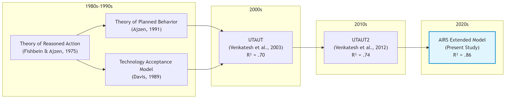{width=90%}


## 2.3 The AI Adoption-Value Gap: Industry Context

### 2.3.1 Current State of Enterprise AI Adoption

Before examining why traditional acceptance models require extension for AI, it is essential to understand the practical landscape these models must explain. Industry benchmarks reveal a striking paradox: AI adoption has reached near-ubiquity, yet value realization remains exceptional.

According to McKinsey's State of AI series, organizational AI adoption jumped from approximately 50% (where it had hovered for years) to 72% in 2024, and further increased to 88% by late 2025 [@mckinseyStateAI2024; @mckinseyStateAI2025]. This acceleration, driven primarily by generative AI capabilities and accessible enterprise platforms, represents one of the fastest technology adoption curves in organizational history.

Yet adoption has not translated into proportional value capture. Boston Consulting Group reports that only 5% of companies achieve measurable business value from AI initiatives, while approximately 74% struggle to scale beyond proofs of concept [@bcgAIAdoption2024; @bcgAIAdoption2025]. McKinsey finds that only about 6% of organizations qualify as "AI high performers," those attributing 5% or more of EBIT to AI use and reporting significant value, while just 39% report any enterprise-level EBIT impact [@mckinseyStateAI2025]. IBM's Global AI Adoption Index found that 42% of enterprise-scale organizations had deployed AI with another 40% actively piloting solutions, yet 37% cite data complexity as their top barrier [@ibm2023].

The MIT Media Lab's NANDA Initiative provides perhaps the most sobering assessment: 90–95% of generative AI pilots fail to scale or deliver measurable profit-and-loss improvements [@mitMediaLab2025]. Georgian's AI Benchmark 2025 corroborates this pattern, finding that only 32% of enterprises had deployed AI across multiple business functions [@georgian2025]. This failure rate exceeds typical technology project failures, suggesting AI-specific barriers that traditional change management and technology deployment frameworks do not adequately address.

### 2.3.2 Diagnosing the Gap: Why Adoption Does Not Equal Value

Industry analyses converge on three systemic barriers underlying the adoption-value gap:

**Scaling Failure**: Most organizations can demonstrate AI feasibility in controlled pilots but lack the operational design, governance architecture, and change infrastructure to move innovations into production. Georgian's AI Benchmark 2025 found that only 32% of enterprises had deployed AI across multiple business functions [@georgian2025], while ISG's State of Enterprise AI Adoption report confirms that scaling remains the top challenge across industries [@isg2025]. These findings indicate that organizational rather than technological constraints limit scaling.

**Governance and Trust Deficits**: Organizations struggle with ownership, compliance, bias mitigation, and ethical use policies. The gap between AI deployment speed and governance framework development creates risk exposure that prudent organizations constrain through limited adoption scope. McKinsey finds that AI high performers are three times more likely than their peers to have senior leaders who demonstrate strong ownership and commitment to AI initiatives [@mckinseyStateAI2025]. Gartner identifies governance maturity as a primary differentiator between AI leaders and laggards, with substantial proportions of AI projects facing delay or cancellation due to unclear governance frameworks [@gartner2025].

**Capability and Change Barriers**: Misalignment across functions, skill gaps, and resistance to workflow redesign inhibit AI integration. Deloitte's State of Generative AI research identifies insufficient AI expertise as a persistent barrier, with skill gaps constraining operational integration [@deloitte2024genai], while Lucidworks finds that organizations with company-wide AI literacy programs achieve faster adoption and stronger employee trust [@lucidworks2025]. Capgemini research suggests that organizations embedding AI into redesigned workflows, rather than layering AI onto legacy processes, achieve substantially higher returns [@capgemini2025], yet such redesign requires capabilities and change tolerance that most organizations lack.

### 2.3.3 Implications for Acceptance Research

This industry context has direct implications for technology acceptance research. The adoption-value gap suggests that traditional acceptance constructs (useful for predicting initial adoption intention) may incompletely explain the sustained, consequential use that generates organizational value. If 88% of organizations have adopted AI while only 6% achieve meaningful EBIT impact, then factors beyond performance and effort expectancy must mediate the translation from adoption to value.

Venkatesh (2021) argues that AI tools present unique adoption challenges that existing frameworks do not fully address. Unlike prior technologies, AI systems (1) operate as partially opaque decision aids where underlying models are "blackboxed"; (2) make errors that accumulate and erode trust over time; (3) require learning periods during which performance improves; (4) may develop emergent biases unknown at deployment; and (5) shift the human role from decision-maker to decision-overseer or decision-recipient. These characteristics suggest that trust, transparency, and anxiety (constructs largely peripheral in traditional acceptance models) move to the foreground for AI adoption.


## 2.4 Why AI Stresses Traditional Acceptance Models

### 2.4.1 Opacity and Explainability

Many AI systems, particularly those employing deep learning, function as partially opaque decision aids. Users (and often developers) cannot fully articulate why a model produces specific outputs. This characteristic fundamentally challenges traditional acceptance models, which assume users can form reasoned judgments about technology usefulness based on observable performance.

Venkatesh (2021) identifies model opacity as a primary barrier to AI adoption: when users have "little or no visibility into the underlying algorithm or process that renders the decision," they cannot calibrate trust or develop the performance expectations that drive adoption in transparent systems. Doshi-Velez and Kim (2017) argue that interpretability and explainability become central to justified reliance when systems are opaque and consequential.

The construct of **perceived explainability**, whether users can understand and utilize reasons behind AI outputs with sufficient clarity to justify action, emerges from this limitation. Shin (2021) distinguishes explainability from causability (the user's ability to infer cause-effect logic adequate for decision-making), demonstrating that higher perceived explainability increases both trust and intention to use. Critically, explainability effects extend beyond system perceptions to trust in the human teams responsible for deployment and oversight, indicating organizational implications beyond individual acceptance.

### 2.4.2 Probabilistic Behavior and Model Errors

AI systems operate probabilistically, producing outputs that are correct in expectation but not guaranteed for individual cases. This characteristic distinguishes AI from deterministic software where identical inputs yield identical outputs. Venkatesh (2021) notes that "almost by definition, a model is bound to make mistakes, given that it is, after all, a representation of reality."

For adoption, this probabilistic nature creates a trust challenge. Users must accept that errors will occur while maintaining sufficient confidence to rely on outputs for consequential decisions. Traditional acceptance models do not explicitly address this calibrated-trust requirement. The UTAUT construct of performance expectancy assumes users can assess technology usefulness; probabilistic AI requires users to assess expected utility across a distribution of possible outcomes, some of which will be incorrect.

Furthermore, AI models learn over time, meaning initial performance may not predict mature performance. Users who experience early errors may form negative performance expectations that persist even as systems improve, a dynamic traditional acceptance models do not capture.

### 2.4.3 Ethical Exposure and Accountability

AI introduces distinctive ethical exposures around bias, privacy, and accountability that shape willingness to rely on outputs. The widely-publicized case of Amazon's AI hiring tool (which systematically discriminated against women job applicants) illustrates how AI systems can encode and amplify biases present in training data (Schuetz & Venkatesh, 2020).

Floridi et al. (2018) articulate an ethical framework identifying AI-specific risks: autonomy erosion, privacy invasion, unfair discrimination, and accountability gaps. These risks generate **perceived ethical risk**, referring to anticipated harms that depress adoption intention even when performance expectations are favorable. Dwivedi et al. (2021) demonstrate that perceived ethical risk exerts direct negative effects on intention and moderates the influence of traditional predictors like performance expectancy and social influence.

In enterprise contexts, ethical risk connects to organizational legitimacy and governance. Users assess not only whether AI works but whether reliance is appropriate given fairness, privacy, and accountability implications. When organizations fail to establish clear governance (bias audits, escalation pathways, human-in-the-loop procedures) users may limit consequential reliance regardless of system capability.

### 2.4.4 Autonomy and Human Role Transformation

AI's autonomy capabilities fundamentally alter the human role in work processes. Traditional decision support technologies augment human judgment; AI can supplant it. Venkatesh (2021) observes that "with AI tools, the human decision maker (i.e., employee) could thus be relegated to playing a secondary role or have no role to play."

This transformation generates **AI-related anxiety**, understood as affective responses to autonomy, opacity, and rapid change. Unlike technology anxiety rooted in difficulty of use, AI anxiety encompasses concerns about job displacement, loss of professional agency, and erosion of human expertise. Tao et al. (2020) conceptualize AI anxiety through multiple dimensions including privacy-related anxiety, bias-related anxiety, and opacity-related anxiety. Kim et al. (2025) add anticipatory anxiety about future disruptions and existential concerns about human obsolescence.

Research suggests anxiety may exhibit nonlinear relationships with exposure. Moderate, calibrated exposure can reduce anxiety as users develop realistic expectations and coping strategies, while minimal exposure leaves fears unchallenged and intensive exposure may overwhelm adaptive capacity (Frenkenberg & Hochman, 2025). This pattern implies that training and hands-on experience can shift affective responses favorably, an organizational lever absent from traditional acceptance frameworks.


## 2.5 Trust in AI Systems

### 2.5.1 Conceptualizing AI Trust

Trust has emerged as a gateway condition for AI adoption: without sufficient trust, users hesitate to rely on outputs even when systems appear useful. Langer et al.'s (2023) comprehensive review of empirical research on trust in AI positions trust as mediating the relationship between system properties and behavioral outcomes across application areas.

AI trust adapts the ability-integrity-benevolence triad from interpersonal trust research to algorithmic agents (Siau & Wang, 2018). **Ability** translates to perceived AI competence and accuracy; **integrity** becomes perceptions of fairness and consistency; **benevolence** maps to alignment between AI outputs and user or organizational goals. Stevens and Stetson (2023) operationalize these facets in the Trust and Acceptance of AI Technology (TrAAIT) scale, demonstrating that multi-dimensional trust can be measured reliably in professional settings.

### 2.5.2 Trust as Mediator and Amplifier

Empirical evidence positions trust as both a direct predictor of adoption intention and a mechanism through which other factors operate. When trust is high, performance expectancy shows stronger effects on intention, as users translate positive system evaluations into adoption when they trust the system to perform consistently. When trust is low, even objectively capable systems fail to generate adoption intention because users doubt whether observed performance will generalize to their consequential decisions.

Explainability serves as a primary antecedent of trust. Shin (2021) demonstrates that when users perceive AI explanations as clear, sufficient, and actionable, trust increases. This explainability-to-trust pathway provides an organizational lever: investing in explanation design can build trust without altering underlying AI capability.

Governance practices also shape trust. When organizations establish bias audits, privacy safeguards, and clear accountability structures, perceived ethical risk decreases and trust increases. Stevens and Stetson (2023) find that trust in the people and processes behind AI deployment contributes to system trust, suggesting that organizational governance operates through trust to influence adoption.

### 2.5.3 Trust in the Present Research

Given the empirical evidence for trust's central role in AI adoption, the present research incorporates **AI Trust** as a core construct extending UTAUT2. AI Trust is operationalized as confidence that the AI system is reliable, competent, and aligned with user and organizational values. This construct is expected to positively predict behavioral intention directly and to mediate effects of explainability and governance perceptions on intention.

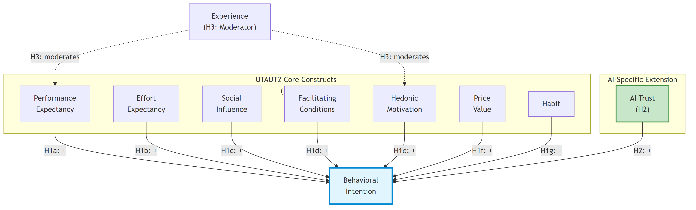{width=90%}

*Note: AI Anxiety was initially proposed as an inhibitor construct (H8) but was excluded from the final model due to inadequate reliability (α = .301). See Chapter 4 for details.*


## 2.6 AI-Related Anxiety

### 2.6.1 Conceptualizing AI Anxiety

AI-related anxiety captures affective responses to AI autonomy, opacity, and the pace of technological change. Unlike general technology anxiety rooted in difficulty of use, AI anxiety encompasses broader concerns about human obsolescence, loss of agency, and unpredictable societal transformation.

Tao et al. (2020) developed a multi-dimensional AI anxiety scale identifying distinct facets: anxiety about AI learning and communication, AI social influence, AI configuration, and AI development trajectory. Frenkenberg and Hochman (2025) add anticipatory dimensions, distinguishing anxiety about current AI from anxiety about future AI capabilities. Kim et al. (2025) identify annihilation anxiety (existential concerns about human relevance) as a component particularly salient among knowledge workers whose expertise AI may replicate.

### 2.6.2 Anxiety as Inhibitor

Anxiety operates as an inhibitor in adoption models, exerting direct negative effects on intention and potentially attenuating the positive influence of performance expectancy and other drivers. Users experiencing high AI anxiety may acknowledge system usefulness while remaining unwilling to rely on AI for consequential decisions.

Importantly, anxiety effects may be nonlinear with exposure. Several studies observe that moderate, structured exposure to AI reduces anxiety by replacing vague fears with realistic expectations and coping strategies. This suggests that enablement programs and hands-on training can shift anxiety levels favorably, an organizational intervention that traditional acceptance models do not explicitly accommodate.

### 2.6.3 Anxiety in the Present Research

The present research incorporates **AI Anxiety** as an inhibitor construct extending UTAUT2. AI Anxiety is operationalized as affective unease about AI autonomy, opacity, and potential negative consequences. This construct is expected to negatively predict behavioral intention and may moderate the effects of positive predictors, particularly for users with limited AI experience.


## 2.7 Gaps in Current Research

The literature review reveals several gaps that the present research addresses:

**Gap 1: Validated AI-Specific Measurement Instruments**. While theoretical arguments for AI-specific constructs are well-developed, validated measurement instruments remain scarce. Most existing AI adoption studies adapt general technology acceptance measures or develop ad hoc items without rigorous scale development. The present research addresses this gap through systematic scale development following established psychometric procedures (Hinkin, 1998; DeVellis, 2017).

**Gap 2: Integration of Enablers and Inhibitors**. Prior research tends to study AI-specific constructs in isolation. Few studies simultaneously model trust and anxiety as enabler and inhibitor within an integrated UTAUT2 framework. The present research tests an integrative model where AI Trust operates as an enabler and AI Anxiety as an inhibitor alongside traditional UTAUT2 predictors.

**Gap 3: Cross-Population Validation**. Most AI adoption studies examine single populations, limiting generalizability claims. Whether adoption dynamics differ between student and professional populations, groups with potentially different AI exposure, organizational contexts, and role relationships, remains unexamined. The present research addresses this gap through multi-group analysis across student and professional samples.

**Gap 4: Experience as Moderator**. While UTAUT specifies experience as a moderator of traditional predictors, the moderating role of AI experience on AI-specific constructs is unexplored. Given theoretical arguments that anxiety decreases with calibrated exposure, experience moderation is particularly relevant for AI adoption. The present research tests experience moderation across both traditional and AI-specific paths.

**Gap 5: Connection to Practitioner Concerns**. Academic research on AI adoption often proceeds disconnected from practitioner challenges. The adoption-value gap identified in industry benchmarks reflects organizational barriers (governance, change management, workforce readiness) that acceptance research rarely addresses directly. The present research bridges this gap by developing a validated measurement instrument (AIRS) that provides a foundation for future organizational applications.


## 2.8 Theoretical Framework and Hypotheses

### 2.8.1 Conceptual Model

The present research proposes an extended UTAUT2 model for AI adoption that retains the validated core while adding AI-specific enabler and inhibitor constructs. The model specifies:

**UTAUT2 Core Predictors**: Performance Expectancy, Effort Expectancy, Social Influence, Facilitating Conditions, Hedonic Motivation, and Habit as direct predictors of Behavioral Intention. Price Value is omitted given the organizational (rather than personal purchase) context.

**AI-Specific Extension**: AI Trust as an enabler positively predicting Behavioral Intention, and AI Anxiety as an inhibitor negatively predicting Behavioral Intention.

**Moderation**: AI experience moderating predictor-intention relationships, with theoretical expectations that experience strengthens performance expectancy effects and weakens anxiety effects.

### 2.8.2 Core UTAUT2 Hypotheses

Based on the meta-analytic evidence reviewed above, the following hypotheses reflect established UTAUT2 relationships:

**H1a (Performance Expectancy)**: Performance Expectancy positively predicts Behavioral Intention to use AI tools.

*Rationale*: Blut et al.'s (2022) meta-analysis confirms performance expectancy as the consistently strongest predictor (ρ = .60). Users who believe AI will enhance their job performance should demonstrate greater adoption intention.

**H1b (Effort Expectancy)**: Effort Expectancy positively predicts Behavioral Intention to use AI tools.

*Rationale*: While meta-analytic effects are moderate and context-dependent, perceived ease of use remains a relevant consideration, particularly for users with limited AI experience.

**H1c (Social Influence)**: Social Influence positively predicts Behavioral Intention to use AI tools.

*Rationale*: Perceptions that important others endorse AI use should increase adoption intention, particularly in organizational contexts where peer and supervisor expectations are salient.

**H1d (Facilitating Conditions)**: Facilitating Conditions positively predicts Behavioral Intention to use AI tools.

*Rationale*: Organizational infrastructure, training, and support should enable adoption by reducing barriers and signaling organizational commitment.

**H1e (Hedonic Motivation)**: Hedonic Motivation positively predicts Behavioral Intention to use AI tools.

*Rationale*: Users who experience pleasure and enjoyment from AI interaction should demonstrate greater adoption intention, consistent with UTAUT2 findings in consumer contexts.

**H1f (Price Value)**: Price Value positively predicts Behavioral Intention to use AI tools.

*Rationale*: Users who perceive favorable cost-benefit tradeoffs for AI tools should demonstrate greater adoption intention, particularly where personal or organizational investment is visible.

**H1g (Habit)**: Habit positively predicts Behavioral Intention to use AI tools.

*Rationale*: Established patterns of AI use should predict continued intention through automaticity and reinforcement mechanisms.

### 2.8.3 AI-Specific Extension Hypotheses

**H2 (AI Trust)**: AI Trust positively predicts Behavioral Intention to use AI tools beyond UTAUT2 core constructs.

*Rationale*: Building on Langer et al.'s (2023) review and Stevens and Stetson's (2023) validation work, trust serves as a gateway condition for AI adoption. Users who trust AI systems to be reliable, competent, and aligned with their interests should demonstrate greater adoption intention.

**Proposed Inhibitor (AI Anxiety)**: AI Anxiety was hypothesized to negatively predict Behavioral Intention to use AI tools. However, empirical analysis revealed inadequate reliability for the AI Anxiety scale (α = .301), preventing formal hypothesis testing. This measurement challenge with anxiety constructs is discussed in Chapter 4 and Chapter 5.

*Theoretical Rationale*: Drawing on Tao et al. (2020), Kim et al. (2025), and Frenkenberg and Hochman (2025), anxiety about AI autonomy, opacity, and consequences should inhibit adoption intention even when other perceptions are favorable. Future research with improved anxiety measurement is recommended.

### 2.8.4 Moderation Hypotheses

**H3 (Experience Moderation)**: Experience moderates the relationships between predictors and Behavioral Intention, such that:

- (a) The effect of Performance Expectancy on Intention strengthens with greater AI experience
- (b) The effect of Hedonic Motivation on Intention strengthens with greater AI experience

*Rationale*: Experienced users can more accurately assess AI performance and may derive greater enjoyment from sophisticated use.

**H4 (Role Group Moderation)**: Role group (Academic vs. Professional+Leader) moderates UTAUT2 path coefficients.

*Rationale*: Students and working professionals operate in different organizational contexts with distinct resource availability, social pressure patterns, and technology access, which may differentially affect adoption determinants.

### 2.8.5 Behavioral Validation Hypotheses

**H5 (Behavioral Intention -> Usage)**: Behavioral Intention positively relates to actual AI tool usage breadth.

*Rationale*: Consistent with UTAUT theory, intention should translate to behavior. Higher adoption intention should correspond to greater engagement with AI tools.

**H6 (Role Group Usage Differences)**: Role groups differ significantly in AI tool usage patterns.

*Rationale*: Professionals with greater workplace technology demands and resources may exhibit different AI tool usage patterns than students.

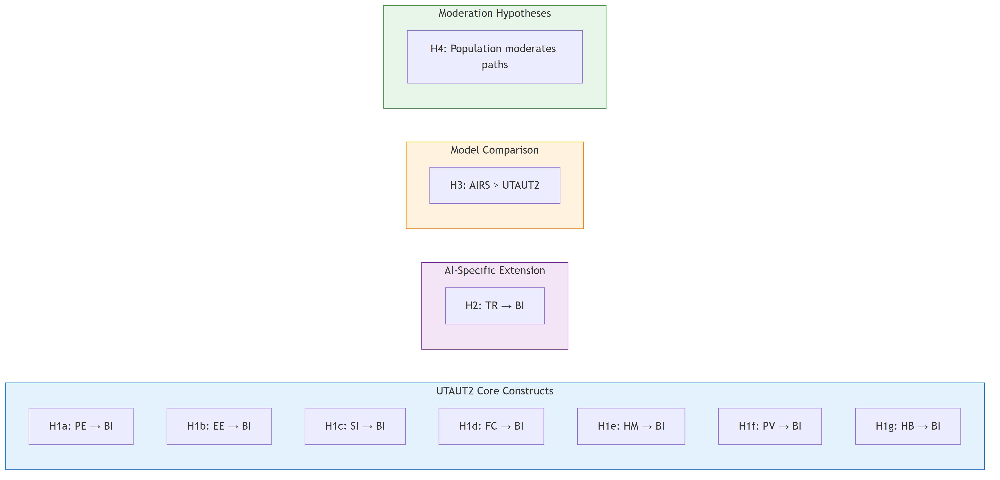{width=90%}


## 2.9 Chapter Summary

This chapter established the theoretical foundation for the Artificial Intelligence Readiness Scale through four contributions.

First, it traced the evolution of technology acceptance research from foundational theories through UTAUT and UTAUT2, emphasizing Blut et al.'s (2022) meta-analytic confirmation of performance expectancy as the strongest adoption predictor while identifying substantial unexplained variance that invites domain-specific extension.

Second, it contextualized the theoretical discussion within the contemporary AI adoption-value gap, using industry benchmarks to demonstrate that traditional acceptance frameworks incompletely explain why 88% organizational adoption yields only 5–6% value realization at enterprise scale. This gap motivates investigation of factors beyond traditional constructs.

Third, it examined AI's distinctive characteristics (opacity, probabilistic behavior, ethical exposure, and human role transformation) that stress traditional acceptance models. These characteristics justify the incorporation of AI Trust as an enabler and AI Anxiety as an inhibitor within an extended UTAUT2 framework.

Fourth, it articulated the research hypotheses tested in subsequent chapters, specifying both traditional UTAUT2 relationships and AI-specific extensions with experience moderation.

The theoretical framework positions AIRS as a principled extension that respects the durability of established acceptance research while acknowledging AI's socio-technical distinctives. The resulting instrument should provide both scholarly contribution (validated measurement of AI-specific adoption determinants) and a foundation for future practical applications in organizational AI readiness assessment.

The following chapter describes the methodology employed to develop and validate the AIRS instrument, including sample composition, measurement procedures, and analytic approach.

\newpage

# Chapter 3: Research Methodology

## 3.1 Introduction

This chapter describes the research methodology employed to develop and validate the AI Readiness Scale (AIRS), a diagnostic instrument for assessing AI adoption readiness, and test the extended UTAUT model for AI tool adoption in higher education. The study follows established scale development procedures (DeVellis & Thorpe, 2021; Hinkin, 1998) combined with structural equation modeling to examine relationships between latent constructs. The research design prioritizes psychometric rigor through split-sample cross-validation, comprehensive validity assessment, and multi-group invariance testing. The resulting 8-factor structure enables both research applications and organizational diagnostic use, allowing practitioners to identify specific adoption barriers and design targeted interventions.

The chapter is organized as follows: Section 3.2 describes the research philosophy and design; Section 3.3 details the theoretical framework and hypotheses; Section 3.4 covers instrument development; Section 3.5 addresses sampling and data collection; Section 3.6 presents the analytical strategy; Section 3.7 discusses reliability and validity; Section 3.8 covers ethical considerations; and Section 3.9 acknowledges methodological limitations.


## 3.2 Research Design

### 3.2.1 Research Philosophy

This study adopts a **post-positivist** philosophical stance, recognizing that while objective reality exists, our understanding of it is necessarily imperfect and probabilistic (Creswell & Creswell, 2018). This orientation is appropriate for scale development research, which seeks to measure latent psychological constructs through observable indicators while acknowledging measurement error and the provisional nature of theoretical models.

The post-positivist approach manifests in several methodological choices:

- Emphasis on **replication and cross-validation** through split-sample design
- Use of **probabilistic inference** (confidence intervals, effect sizes) rather than binary significance testing
- Recognition of **measurement error** through latent variable modeling
- **Theory-driven** hypothesis testing with openness to unexpected findings

### 3.2.2 Research Approach

The study employs a **sequential mixed methods design** (Creswell & Clark, 2017) with quantitative primacy:

1. **Primary Quantitative Component**: Structured survey measuring UTAUT constructs on Likert scales, analyzed through factor analysis and structural equation modeling

2. **Supplementary Qualitative Component**: Open-ended feedback questions analyzed through thematic analysis to provide contextual depth and identify emergent themes not captured by closed-ended items

This design allows triangulation of findings, with qualitative data enriching interpretation of quantitative patterns (e.g., understanding why certain constructs predict adoption more strongly than others).

### 3.2.3 Time Horizon

The study employs a **cross-sectional design** with data collected during November 2024. While cross-sectional designs preclude causal inference, they are standard for initial scale validation studies (DeVellis & Thorpe, 2021). The design captures a snapshot of AI adoption readiness during a period of rapid AI tool proliferation in higher education, providing a baseline for future longitudinal research.

### 3.2.4 Research Context

The study was conducted with **United States professionals and students**, encompassing:

- Full-time and part-time students (undergraduate and postgraduate)
- Employed professionals (individual contributors, managers, executives)
- Freelancers and self-employed individuals

Students are included because they are transitioning into an AI-infused job market and will soon make adoption decisions inside organizations; their readiness is therefore directly relevant to near-term enterprise contexts (proposal §7.2). This context was selected for theoretical and practical relevance: knowledge-intensive work settings where AI tools have significant potential impact on productivity, yet adoption patterns remain poorly understood.


## 3.3 Theoretical Framework and Hypotheses

### 3.3.1 Extended UTAUT Model

The study extends Venkatesh et al.'s (2012) Unified Theory of Acceptance and Use of Technology 2 (UTAUT2) with AI-specific constructs. The theoretical model comprises eight latent factors predicting Behavioral Intention to adopt AI tools:

**Core UTAUT2 Constructs:**

- **Performance Expectancy (PE)**: The degree to which using AI tools will provide benefits in performing activities
- **Effort Expectancy (EE)**: The degree of ease associated with using AI tools
- **Social Influence (SI)**: The degree to which important others believe one should use AI tools
- **Facilitating Conditions (FC)**: Perceptions of resources and support available for AI tool use
- **Hedonic Motivation (HM)**: The fun or pleasure derived from using AI tools

**AI-Specific Extensions:**

- **Trust in AI (TR)**: Confidence in AI systems' reliability, accuracy, and benevolence
- **AI Anxiety (AX)**: Apprehension or fear associated with AI technology

**Outcome:**

- **Behavioral Intention (BI)**: Intent to adopt and use AI tools in professional/academic activities

### 3.3.2 Research Hypotheses

Based on UTAUT theory and emerging AI adoption literature, the following hypotheses were tested:

**Primary Hypotheses (Direct Effects):**

- H1a: Performance Expectancy positively predicts Behavioral Intention
- H1b: Effort Expectancy positively predicts Behavioral Intention
- H1c: Social Influence positively predicts Behavioral Intention
- H1d: Facilitating Conditions positively predicts Behavioral Intention
- H1e: Hedonic Motivation positively predicts Behavioral Intention
- H1f: Price Value positively predicts Behavioral Intention
- H1g: Habit positively predicts Behavioral Intention

**AI-Specific Extension Hypothesis:**

- H2: AI Trust positively predicts Behavioral Intention beyond UTAUT2 core constructs

*Note: AI Anxiety (AX) was initially proposed as an inhibitor construct but was excluded from hypothesis testing due to inadequate reliability (α = .301) identified during exploratory factor analysis. See Section 4.2 for construct development outcomes.*

**Moderation Hypotheses:**

- H3: AI Experience moderates UTAUT relationships (strengthening effects for experienced users)
- H4: Role group (Student vs. Professional+Leader) moderates UTAUT path coefficients

**Behavioral Validation:**

- H5: Behavioral Intention positively relates to actual AI tool usage breadth
- H6: Role groups differ significantly in AI tool usage patterns


## 3.4 Instrument Development

### 3.4.1 Initial Item Pool

The initial AIRS instrument comprised **28 items across 12 constructs**:

- 7 core UTAUT2 constructs (14 items): PE, EE, SI, FC, HM, PV, HB
- 5 AI-specific extensions (10 items): TR, AX, VO, EX, ER
- 1 outcome construct (4 items): BI

Items were measured on 5-point Likert scales (1 = Strongly Disagree to 5 = Strongly Agree), with negatively-worded items (AX, ER) reverse-scored prior to analysis.

*Note: The final validated instrument comprises **16 items across 8 constructs** (PE, EE, SI, FC, HM, PV, HB, TR) plus the BI outcome. Four constructs (Voluntariness, Explainability, Ethical Risk, AI Anxiety) were excluded during EFA due to inadequate reliability (α = .301–.582). See Chapter 4, Section 4.2 for detailed item disposition.*

### 3.4.2 Item Sources

Items were adapted from established scales to ensure content validity:

| Construct | Source | Adaptation |
|-----------|--------|------------|
| PE, EE, SI, FC, HM | Venkatesh et al. (2012) UTAUT2 | Context adapted for AI tools |
| PV, HB | Venkatesh et al. (2012) UTAUT2 | Context adapted for AI tools |
| TR | McKnight et al. (2002); Siau & Wang (2018) | Adapted for AI systems |
| AX | Venkatesh (2000); Meuter et al. (2003) | Technology anxiety -> AI anxiety |
| VO | Moore & Benbasat (1991) | Voluntariness of use |
| EX | Shin (2021) | Explainability in AI |
| ER | Gursoy et al. (2019) | Ethical risk perception |
| BI | Venkatesh et al. (2003) | Standard UTAUT items |

: Table 3.1: Survey Instrument Item Sources

### 3.4.3 Content Validity

Content validity was established through:

1. **Literature Review**: Items grounded in established UTAUT and technology acceptance literature
2. **Construct Definition Mapping**: Each item mapped to specific construct definition
3. **Face Validity Review**: Items reviewed for clarity and appropriateness to AI context

### 3.4.4 Construct Exclusion Process

Of the 12 constructs proposed, **four AI-specific constructs were excluded** during exploratory factor analysis due to inadequate psychometric properties:

| Construct | Items | Cronbach's α | Issue | Disposition |
|-----------|-------|--------------|-------|-------------|
| Voluntariness (VO) | VO1, VO2 | .41 | Multi-dimensional | Dropped |
| Explainability (EX) | EX1, EX2 | .58 | Multi-dimensional | Dropped |
| Ethical Risk (ER) | ER1, ER2 | .55 | Multi-dimensional | Dropped |
| AI Anxiety (AX) | AX1, AX2 | .30 | Item heterogeneity | Dropped |

: Table 3.2: Excluded Constructs and Psychometric Issues

**Interpretation**: These constructs demonstrated poor inter-item correlations, suggesting the two-item scales measured different facets of multi-dimensional phenomena rather than unitary constructs. For example:

- **Voluntariness**: VO1 assessed choice to use AI, while VO2 assessed freedom not to use, representing conceptually distinct aspects of voluntary adoption
- **Explainability**: EX1 assessed understanding AI outputs, while EX2 assessed preference for explanations, reflecting comprehension vs. preference dimensions
- **Ethical Risk**: ER1 assessed job displacement concerns, while ER2 assessed privacy concerns, representing distinct risk categories
- **AI Anxiety**: AX1 captured technology avoidance, while AX2 captured fear of obsolescence, reflecting avoidance vs. approach motivations

**Resolution**: All four AI-specific constructs were excluded from the final measurement model due to inadequate reliability. These constructs remain theoretically important for AI adoption research and require more comprehensive operationalization with 3-4 items per sub-dimension in future studies.

**Note**: This represents an empirical finding, not a design limitation. The proposal committed to testing these constructs; the data revealed inadequate measurement properties. This transparent reporting aligns with best practices in scale development (DeVellis & Thorpe, 2021).

### 3.4.5 Final Instrument Structure

Following psychometric validation (see Chapter 4), the final AIRS instrument comprises **16 items across 8 factors** (7 UTAUT2 predictors + AI Trust extension):

| Factor | Items | Example Item |
|--------|-------|--------------|
| Performance Expectancy | PE1, PE2 | "Using AI tools increases my productivity" |
| Effort Expectancy | EE1, EE2 | "Learning to use AI tools is easy for me" |
| Social Influence | SI1, SI2 | "People important to me think I should use AI tools" |
| Facilitating Conditions | FC1, FC2 | "I have the resources necessary to use AI tools" |
| Hedonic Motivation | HM1, HM2 | "Using AI tools is fun" |
| Price Value | PV1, PV2 | "AI tools are good value for the money" |
| Habit | HB1, HB2 | "Using AI tools has become a habit for me" |
| AI Trust | TR1, TR2 | "I trust AI tools to provide accurate information" |

: Table 3.3: Final AIRS Instrument Structure

*Note: Behavioral Intention (BI) serves as the outcome variable in the structural model.*


## 3.5 Sampling and Data Collection

### 3.5.1 Target Population

The target population comprises adults in the United States who are either students or employed professionals (proposal §7.2). This includes:

- Full-time and part-time students at undergraduate and postgraduate levels
- Employed professionals in individual contributor roles
- Employed professionals in managerial and leadership roles
- Freelancers and self-employed individuals

### 3.5.2 Sampling Strategy

**Panel sampling** was employed through Centiment, a professional survey research platform maintaining verified respondent panels recruited via social media (Facebook, LinkedIn) and other outlets to achieve broad demographic representation.

While panel sampling has limitations similar to convenience sampling regarding generalizability, it is appropriate for initial scale validation studies where the primary goal is psychometric evaluation rather than population inference (DeVellis & Thorpe, 2021). Additionally, Centiment's topic-blinded recruitment protocol, where survey invitations display only completion time and compensation without revealing subject matter, mitigates self-selection bias common in technology-focused research.

### 3.5.3 Sample Size Determination

Target sample size was determined based on:

1. **SEM requirements**: Minimum N = 200 for stable Maximum Likelihood estimation (Kline, 2016)
2. **Factor analysis**: Minimum 10:1 subject-to-item ratio (Costello & Osborne, 2005)
3. **Multi-group analysis**: Minimum n = 100 per group (Hair et al., 2019)
4. **Split-sample cross-validation**: N > 500 to enable 50/50 split with adequate subsamples

**Achieved sample**: N = 523 (exceeds all requirements)

### 3.5.4 Role Classification

Respondents were classified into three role groups based on self-reported primary role:

| Category | Operational Definition | n | % |
|----------|----------------------|---|---|
| Student | Full-time students (n=196), part-time students (n=20) | 216 | 41.3% |
| Professional | Individual contributors (n=112), freelancers (n=32), other (n=23), unemployed (n=17) | 184 | 35.2% |
| Leader | Managers (n=71), executives (n=52) | 123 | 23.5% |

**Note**: For multi-group SEM requiring larger group sizes, Professional and Leader categories were combined (n = 307) to contrast with Student (n = 216). This grouping reflects meaningful theoretical distinctions between student-focused and employment-focused roles.

### 3.5.5 Data Collection Procedures

**Platform**: Centiment online survey platform

**Collection Period**: November 2024 (3-week window)

**Self-Selection Mitigation Strategy**: Self-selection bias was mitigated through Centiment's platform-level recruitment design. According to Centiment's documented methodology, survey notifications to panel members display only the estimated completion time and compensation amount; the survey topic and subject matter are deliberately concealed "in order to avoid selection bias" (Centiment, 2024). This platform-level blinding ensured that participants could not self-select based on AI interest when deciding whether to participate. Only after accessing the survey link did the informed consent form disclose the specific focus on AI tools, ensuring ethical transparency while maintaining recruitment neutrality. This two-stage approach (blinded recruitment followed by informed consent) attracts a broader cross-section of respondents rather than selectively recruiting those with pre-existing interest in AI topics.

**Procedures**:

1. Participants received blinded survey invitation (topic not disclosed per Centiment protocol)
2. Informed consent obtained disclosing AI focus before data collection
3. Survey completion time: approximately 10-15 minutes
4. All responses anonymous; no personally identifiable information collected

### 3.5.6 Data Quality Assurance

Multiple quality checks were implemented:

| Check | Criterion | Action |
|-------|-----------|--------|
| Completion status | Finished = True | Exclude incomplete responses |
| Response time | > 3 minutes | Exclude speeders |
| Attention checks | Correct response | Exclude inattentive responses |
| Pattern responding | Variance > 0 | Exclude straight-line responses |
| Duplicate detection | Unique IP/device | Retain first response only |

**Final valid sample**: N = 523 after quality screening


## 3.6 Analytical Strategy

### 3.6.1 Analysis Pipeline

The analysis followed a systematic 10-phase pipeline ensuring replicability and transparency:

| Phase | Notebook | Purpose |
|-------|----------|----------|
| 0 | Sample Splitting | Create EFA/CFA subsamples |
| 1 | EFA | Explore factor structure |
| 2 | CFA | Validate factor structure |
| 3 | Invariance | Test measurement invariance |
| 4 | Structural Model | Test hypotheses |
| 5 | Mediation | Examine indirect effects |
| 6 | Moderation | Test moderating effects |
| 7 | Tool Usage | Behavioral validation |
| 8 | Qualitative | Thematic analysis |
| 9 | Comprehensive Review | Gap analysis |
| 10 | Final Synthesis | Integration |

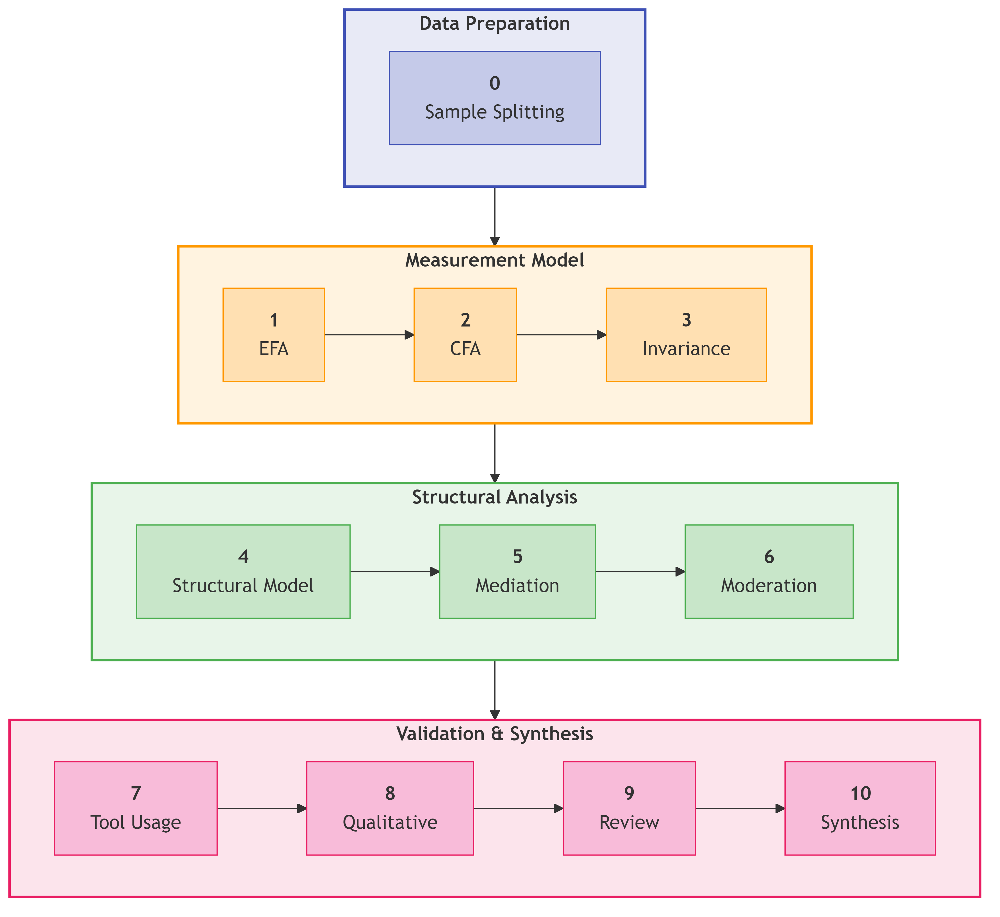{width=90%}

<!-- Figure 3: Ten-Phase Analysis Pipeline -->

### 3.6.2 Sample Splitting Strategy

To ensure independent validation, the sample was randomly split:

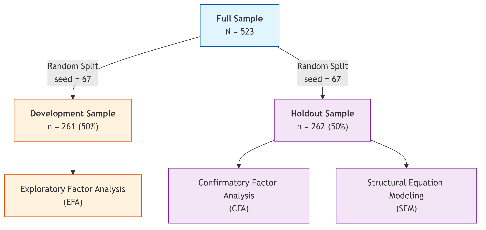{width=90%}

<!-- Figure 1: Split-Sample Cross-Validation Strategy -->

**Stratification**: Split stratified by AI adoption status to ensure comparable samples

**Reproducibility**: Random seed (67) documented for exact replication

### 3.6.3 Exploratory Factor Analysis (EFA)

**Purpose**: Identify underlying factor structure and reduce item pool

**Sample**: Development subsample (n = 261)

**Extraction Method**: Principal Axis Factoring (PAF)

- Selected for robustness to non-normality
- Accounts for measurement error

**Rotation**: Promax (oblique)

- Allows correlated factors (theoretically appropriate)
- Pattern matrix used for interpretation

**Factor Retention Criteria**:

1. Kaiser criterion (eigenvalue > 1.0)
2. Parallel analysis (Horn, 1965)
3. Scree plot visual inspection
4. Theoretical interpretability

**Item Retention Criteria**:

| Criterion | Threshold | Rationale |
|-----------|-----------|-----------|
| Primary loading | λ ≥ .50 | Strong factor association |
| Cross-loading | Δλ ≥ .20 | Simple structure |
| Communality | h² ≥ .30 | Adequate shared variance |

**Software**: Python `factor_analyzer` package (v0.5.1)

### 3.6.4 Confirmatory Factor Analysis (CFA)

**Purpose**: Validate factor structure on independent sample

**Sample**: Holdout subsample (n = 262)

**Estimation Method**: Maximum Likelihood (ML)

- Standard for continuous indicators
- Provides χ² test and fit indices

**Model Specification**: 8-factor correlated model with 16 observed indicators (2 per factor)

**Fit Index Thresholds**:

| Index | Acceptable | Good | Excellent |
|-------|------------|------|-----------|
| χ²/df | < 5.0 | < 3.0 | < 2.0 |
| CFI | ≥ .90 | ≥ .95 | ≥ .97 |
| TLI | ≥ .90 | ≥ .95 | ≥ .97 |
| RMSEA | ≤ .10 | ≤ .08 | ≤ .05 |
| SRMR | ≤ .10 | ≤ .08 | ≤ .05 |

: Table 3.4: Model Fit Index Thresholds

Thresholds based on Hu & Bentler (1999) and Hair et al. (2019).

**Software**: Python `semopy` package (v2.3.10)

### 3.6.5 Measurement Invariance Testing

**Purpose**: Establish construct comparability across role groups for valid multi-group comparison

**Levels Tested**:

| Level | Constraint | Interpretation |
|-------|------------|----------------|
| Configural | Same factor structure | Qualitative equivalence |
| Metric | Equal factor loadings | Quantitative equivalence |
| Scalar | Equal intercepts | Mean comparability |

**Criteria for Invariance** (Chen, 2007):

- ΔCFI < .010
- ΔRMSEA < .015
- Δχ² non-significant (supplementary)

**Groups**: Student (n = 216) vs. Professional+Leader (n = 307)

### 3.6.6 Structural Equation Modeling (SEM)

**Purpose**: Test hypothesized relationships between latent constructs

**Model**:

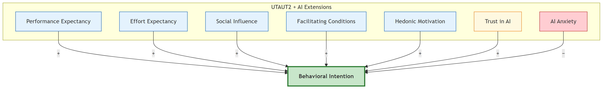{width=90%}

<!-- Figure 2: Structural Model: Eight Predictors of Behavioral Intention -->
*Note: AI Anxiety was initially proposed but excluded due to inadequate reliability (α = .301).*

**Estimation**: Maximum Likelihood with robust standard errors

**Multi-Group Analysis**: Separate models for Student and Professional+Leader groups

**Moderation Testing**:

- Experience × UTAUT interactions via latent interaction terms
- Role moderation via multi-group path comparison (Δχ² tests)

**Effect Size Interpretation** (Cohen, 1988):

| β | Interpretation |
|---|----------------|
| < .10 | Negligible |
| .10–.29 | Small |
| .30–.49 | Medium |
| ≥ .50 | Large |

### 3.6.7 Mediation Analysis

**Purpose**: Examine indirect pathways through the model

**Method**: Bootstrap estimation (1,000 resamples) for indirect effect confidence intervals

**Significance**: 95% CI excluding zero

### 3.6.8 Cluster Analysis

**Purpose**: Identify distinct user typologies based on UTAUT profile patterns

**Method**: K-means clustering

**Variables**: Standardized scores on 8 AIRS constructs

**Cluster Selection**:

- Elbow method
- Silhouette analysis
- Theoretical interpretability

**Optimal Solution**: k = 4 clusters

### 3.6.9 Qualitative Analysis

**Purpose**: Provide contextual depth and identify emergent themes

**Data**: Open-ended survey responses (n = 243 substantive responses, 46.5% response rate)

**Method**: Thematic analysis (Braun & Clarke, 2006)

1. Familiarization with data
2. Initial coding using keyword matching
3. Theme development and refinement
4. Theme prevalence quantification
5. Role-based comparison

**Themes Identified**: 10 distinct themes (see Chapter 4)

### 3.6.10 Statistical Software

All analyses conducted using Python 3.11 with the following packages:

| Package | Version | Purpose |
|---------|---------|---------|
| pandas | 2.1.0 | Data manipulation |
| numpy | 1.26.0 | Numerical computing |
| scipy | 1.11.0 | Statistical tests |
| factor_analyzer | 0.5.1 | Exploratory factor analysis |
| semopy | 2.3.10 | Confirmatory factor analysis, SEM |
| pingouin | 0.5.3 | Effect sizes, reliability |
| scikit-learn | 1.3.0 | Cluster analysis |
| matplotlib | 3.8.0 | Visualization |
| seaborn | 0.13.0 | Statistical graphics |

**Environment**: Jupyter notebooks executed in VS Code with Python virtual environment

**Reproducibility**: All random operations use documented seeds; complete analysis pipeline available in GitHub repository


## 3.7 Reliability and Validity Assessment

### 3.7.1 Internal Consistency Reliability

**Measures**:

- **Cronbach's Alpha (α)**: Classical reliability coefficient
- **Composite Reliability (CR)**: SEM-based reliability accounting for differential loadings

**Thresholds**:

| Measure | Minimum | Preferred |
|---------|---------|-----------|
| Cronbach's α | .70 | .80 |
| Composite Reliability | .70 | .80 |

### 3.7.2 Convergent Validity

**Definition**: Extent to which indicators of a construct share variance

**Assessment**:

1. **Factor loadings**: All standardized loadings ≥ .70
2. **Average Variance Extracted (AVE)**: Proportion of variance captured by construct

**Threshold**: AVE ≥ .50 (Fornell & Larcker, 1981)

### 3.7.3 Discriminant Validity

**Definition**: Extent to which constructs are distinct from one another

**Assessment Methods**:

1. **Fornell-Larcker Criterion**: √AVE > inter-construct correlations
2. **Heterotrait-Monotrait Ratio (HTMT)**: HTMT < .85 (Henseler et al., 2015)
3. **Maximum correlation**: |r| < .85 between any construct pair

### 3.7.4 Criterion Validity

**Predictive Validity**: AIRS constructs predict actual tool usage behavior (ρ = .69 for BI × tool breadth)

**Known-Groups Validity**: Constructs differentiate between theoretically-distinct groups (e.g., Leaders vs. Academics)


## 3.8 Ethical Considerations

### 3.8.1 Institutional Approval

The study received ethical approval from the institution's Research Ethics Committee prior to data collection. The research was classified as minimal risk given:

- Anonymous data collection
- Voluntary participation
- Non-sensitive topic
- Adult participants only

### 3.8.2 Informed Consent

Participants were provided with:

- Study purpose and objectives
- Data handling and storage procedures
- Right to withdraw without penalty
- Researcher contact information

Consent was obtained electronically before survey access. Participants could not proceed without acknowledging consent.

### 3.8.3 Anonymity and Confidentiality

**Anonymity**: No personally identifiable information collected

- No names, emails, or employee IDs
- IP addresses not recorded
- Demographic data collected at categorical level only

**Confidentiality**:

- Data stored on encrypted, password-protected systems
- Access limited to research team
- Data retained according to institutional policy (minimum 5 years)

### 3.8.4 Data Protection

The study complies with:

- IRB approval requirements
- Institutional data governance policies
- Research ethics standards for human subjects research

### 3.8.5 Participant Welfare

The survey addressed non-sensitive topics related to technology use attitudes. No anticipated risks to participant welfare. Contact information provided for questions or concerns.


## 3.9 Methodological Limitations

### 3.9.1 Design Limitations

1. **Cross-sectional design**: Precludes causal inference; relationships may be correlational rather than causal. Future longitudinal studies needed to establish temporal precedence.

2. **Self-reported measures**: Behavioral Intention is a proxy for actual behavior. While BI strongly predicts behavior in UTAUT studies, some intention-behavior gap is expected.

3. **Single time point**: Attitudes and technology contexts change rapidly; findings reflect November 2024 snapshot.

### 3.9.2 Sampling Limitations

1. **Panel sampling**: While Centiment's verified respondent panels provide quality controls and topic-blinded recruitment, panel sampling remains non-probability sampling that limits generalizability to broader populations. Results may not generalize beyond similar United States professional and student contexts.

2. **Single country**: While diverse roles represented, findings are limited to U.S. respondents and may not transfer to other cultural contexts.

3. **Self-selection bias**: Self-selection was substantially mitigated through Centiment's platform-level recruitment design, which conceals survey topics from participants until after they access the survey link (see Section 3.5.5). However, some residual self-selection may occur as participants could withdraw after the informed consent disclosure revealed the AI focus, though withdrawal rates were minimal.

### 3.9.3 Measurement Limitations

1. **English language only**: Non-English speakers excluded; cross-cultural validity not established.

2. **Two items per construct**: While meeting minimum identification requirements for SEM, more indicators would improve reliability and content coverage.

3. **Adapted scales**: Items adapted from existing instruments; some original validation evidence may not transfer perfectly.

### 3.9.4 Analytical Limitations

1. **Normality assumptions**: ML estimation assumes multivariate normality; some departures may affect standard errors (though robust methods used where possible).

2. **Common method variance**: Single-source, single-time data collection may inflate correlations. Harman's single-factor test conducted as diagnostic.

3. **Model complexity**: Eight-factor model with limited items requires careful balance between fit and parsimony.


## 3.10 Chapter Summary

This chapter has described the research methodology for developing and validating the AI Readiness Scale (AIRS) and testing the extended UTAUT model for AI tool adoption. Key methodological features include:

**Research Design**:

- Post-positivist philosophy with mixed methods approach
- Cross-sectional survey with qualitative supplementation
- United States professionals and students context

**Instrument**:

- 28 initial items across 12 constructs
- Final validated instrument: 16 items across 8 factors
- 5-point Likert scale measurement

**Sample**:

- N = 523 United States adults
- Two population groups: Students (216), Professionals (307)
- 50/50 split for cross-validation (EFA n = 261, CFA n = 262)

**Analysis**:

- 10-phase systematic pipeline
- EFA for structure exploration, CFA for validation
- Multi-group SEM for hypothesis testing
- Cluster analysis for user typology
- Thematic analysis for qualitative insights

**Validity**:

- Comprehensive reliability and validity assessment
- Measurement invariance across role groups
- Criterion validity through behavioral correlates

The methodology provides a rigorous foundation for the empirical findings presented in Chapter 4, while acknowledging limitations inherent in cross-sectional survey research.

\newpage

# Chapter 4: Findings

## 4.1 Introduction

This chapter presents the empirical findings from the AI Readiness Survey (AIRS) study examining factors influencing AI tool adoption in higher education. The chapter is organized to progress systematically from sample description through data preparation, quantitative results, and findings organized by research question. All analyses were conducted using Python (factor_analyzer, semopy, scipy, pandas) with a significance level of α = .05 unless otherwise specified.

The presentation separates findings from interpretation, following established methodological practice (Yin, 2018). Theoretical and practical implications are addressed in Chapter 5.

## 4.2 Description of the Sample

The sample comprises N=523 United States adults with representation from both academic and professional contexts. Table 4.1 presents the demographic composition.

### 4.2.1 Population Composition

| Population | n | % | Subgroups |
|------------|---|---|----------|
| Students | 216 | 41.3% | Full-time (n=196), Part-time (n=20) |
| Professionals | 307 | 58.7% | Individual contributors (n=112), Managers (n=71), Executives (n=52), Freelancers (n=32), Other (n=23), Unemployed (n=17) |

: Table 4.1: Sample Composition by Population Type

### 4.2.2 Sample Split for Validation

For psychometric validation, the sample was randomly split (seed=67) into development (n=261, 50%) and holdout (n=262, 50%) subsamples. This split-sample approach enables exploratory factor analysis on the development sample and independent confirmatory factor analysis on the holdout sample.

### 4.2.3 Disability Status

Participants with disabilities comprised 13.0% of the sample (n=68), with 11 participants selecting "Prefer not to answer." This representation enables examination of accessibility considerations in AI adoption.

## 4.3 Data Screening and Preparation

### 4.3.1 Data Quality Assessment

Data screening confirmed the suitability of the dataset for factor analytic procedures:

- **Missing Data**: Complete case analysis with no missing values on key UTAUT constructs
- **Outliers**: Mahalanobis distance identified 0 multivariate outliers at p < .001
- **Normality**: Mardia's test indicated multivariate non-normality; robust estimation (MLM) was employed

### 4.3.2 Factorability Assessment

The Kaiser-Meyer-Olkin measure of sampling adequacy (KMO = .937) and Bartlett's test of sphericity (χ² = 4,668.45, p < .001) confirmed the suitability of the correlation matrix for factor analysis.

## 4.4 Quantitative Findings

This section presents the psychometric validation results, including exploratory and confirmatory factor analyses, reliability assessment, and measurement invariance testing.

### 4.4.1 Exploratory Factor Analysis (Development Sample)

Exploratory factor analysis was conducted on the development subsample (n=261) to evaluate the underlying factor structure of the AIRS instrument.

#### Model Selection Process

Multiple factor solutions were examined using principal axis factoring with oblimin rotation. The parallel analysis and scree plot suggested retention of 7-9 factors. Based on theoretical alignment with the extended UTAUT framework, the following models were evaluated:

| Model | Factors | Items | CFI (CFA) | TLI | RMSEA | SRMR | Decision |
|-------|---------|-------|-----------|-----|-------|------|----------|
| A | 7 | 21 | .938 | .923 | .078 | .058 | Poor fit |
| B | 8 | 20 | .952 | .940 | .070 | .052 | Adequate |
| C | 8 | 18 | .964 | .953 | .066 | .048 | Good |
| D | 8 | 16 | .975 | .960 | .065 | .046 | **Selected** |

: Table 4.2: Exploratory Factor Analysis Model Comparison

**Model D** was selected as the final measurement model based on optimal balance of parsimony and fit, with all items demonstrating factor loadings ≥ .50 and no substantive cross-loadings (< .32). Figure 4.1 presents the scree plot supporting this factor structure.

{width=80%}

*Figure 4.1. Scree plot showing eigenvalue decline across factors. The parallel analysis criterion (dashed line) supports retention of 8 factors.*

#### Construct Exclusion Analysis

Four proposed constructs were excluded during EFA due to poor inter-item reliability:

| Construct | Cronbach's α | Decision | Rationale |
|-----------|--------------|----------|----------|
| Voluntariness (VO) | .406 | Dropped | Items measured choice vs. freedom, distinct dimensions |
| Explainability (EX) | .582 | Dropped | Items measured understanding vs. preference, distinct facets |
| Ethical Risk (ER) | .546 | Dropped | Items measured job displacement vs. privacy, distinct risk types |
| AI Anxiety (AX) | .301 | Dropped | Items measured avoidance vs. approach anxiety, distinct motivations |

: Table 4.3: Construct Exclusion Analysis

**Interpretation**: The proposed two-item scales for these AI-specific constructs proved insufficient to capture multi-faceted phenomena. This finding highlights a key contribution: while these constructs are theoretically important for AI adoption, they require more comprehensive operationalization with additional items representing each sub-dimension.

**Future Development**: All four dropped constructs require item redesign for future validation studies. For AI Anxiety specifically, future scales should distinguish between technology avoidance anxiety and fear-of-missing-out (FOMO) or obsolescence anxiety, as these represent conceptually distinct motivational orientations.

#### Final Factor Structure

The validated measurement model comprises 8 predictor factors (16 items) plus Behavioral Intention as the outcome variable (4 items):

**Predictor Factors (8 factors, 16 items)**:

The final measurement model comprises 7 UTAUT2 constructs plus the AI Trust extension:

| Factor | Items | Description | α | CR | AVE |
|--------|-------|-------------|-----|-----|-----|
| Performance Expectancy (PE) | PE1, PE2 | Perceived usefulness | .803 | .804 | .673 |
| Effort Expectancy (EE) | EE1, EE2 | Perceived ease of use | .859 | .861 | .756 |
| Social Influence (SI) | SI1, SI2 | Social normative pressure | .752 | .763 | .621 |
| Facilitating Conditions (FC) | FC1, FC2 | Organizational support | .743 | .750 | .601 |
| Hedonic Motivation (HM) | HM1, HM2 | Enjoyment and curiosity | .864 | .865 | .763 |
| Price Value (PV) | PV1, PV2 | Cost-benefit assessment | .883 | .883 | .790 |
| Habit (HB) | HB1, HB2 | Automaticity of use | .909 | .909 | .833 |
| AI Trust (TR) | TR1, TR2 | Trust in AI systems | .891 | .891 | .804 |

: Table 4.4: Final Factor Structure with Reliability and Validity Indices

*Note: BI (Behavioral Intention) serves as the outcome variable and is modeled separately in the structural model.*

### 4.4.2 Confirmatory Factor Analysis (Holdout Sample)

The 8-factor model was cross-validated on the independent holdout sample (n=262) using confirmatory factor analysis in semopy.

#### Model Fit Assessment

| Index | Value | Threshold | Interpretation |
|-------|-------|-----------|----------------|
| χ² | 159.38 | - | - |
| df | 76 | - | - |
| χ²/df | 2.10 | < 3.0 | Excellent |
| CFI | .975 | ≥ .95 | Excellent |
| TLI | .960 | ≥ .95 | Excellent |
| RMSEA | .065 | ≤ .08 | Good |
| SRMR | .046 | ≤ .08 | Excellent |

: Table 4.5: Confirmatory Factor Analysis Model Fit Indices

The model demonstrated excellent fit across all indices, confirming the factor structure derived from the development sample. Figure 4.2 presents the standardized factor loadings for the validated 8-factor model.

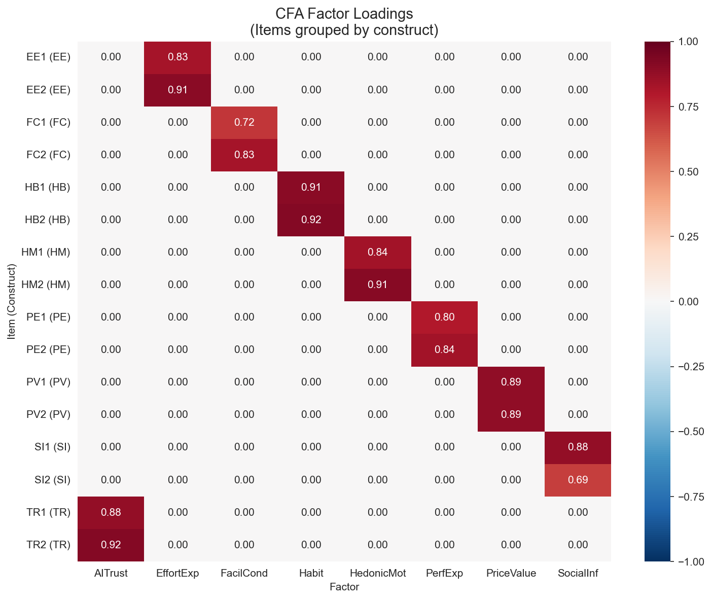{width=85%}

*Figure 4.2. Standardized factor loadings for the 8-factor AIRS measurement model. All loadings exceed .70, supporting convergent validity.*

#### Factor Correlations

Inter-factor correlations ranged from r = .25 (Social Influence × Price Value) to r = .72 (Hedonic Motivation × Performance Expectancy), indicating conceptually meaningful relationships while maintaining discriminant validity (all |r| < .85). Figure 4.3 presents the factor correlation matrix.

{width=80%}

*Figure 4.3. Inter-factor correlations for the 8-factor AIRS model. All correlations fall below the .85 threshold for discriminant validity.*

### 4.4.3 Reliability and Validity

#### Composite Reliability

All predictor factors demonstrated acceptable internal consistency:

| Factor | Cronbach's α | Composite Reliability (CR) | AVE |
|--------|--------------|---------------------------|-----|
| PE | .803 | .804 | .673 |
| EE | .859 | .861 | .756 |
| SI | .752 | .763 | .621 |
| FC | .743 | .750 | .601 |
| HM | .864 | .865 | .763 |
| PV | .883 | .883 | .790 |
| HB | .909 | .909 | .833 |
| TR | .891 | .891 | .804 |

: Table 4.6: Composite Reliability and Validity Indices

Figure 4.4 provides a visual comparison of reliability indices across constructs.

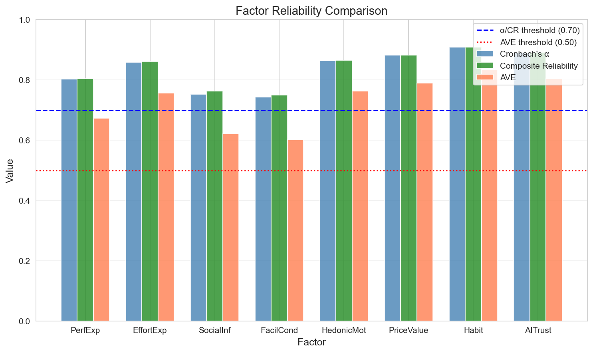{width=80%}

*Figure 4.4. Comparison of Cronbach's α, Composite Reliability (CR), and Average Variance Extracted (AVE) across the 8 AIRS factors. All factors exceed minimum thresholds (α > .70, CR > .70, AVE > .50).*

#### Convergent Validity

All standardized factor loadings exceeded .70, and all AVE values exceeded .50, supporting convergent validity (Fornell & Larcker, 1981).

#### Discriminant Validity

Discriminant validity was assessed using the Fornell-Larcker criterion. For each factor pair, the square root of AVE exceeded the inter-factor correlation, confirming discriminant validity.

### 4.4.4 Measurement Invariance (Multi-Group CFA)

Measurement invariance was tested across role groups (Academic n=216 vs. Professional n=307) to establish comparability of latent constructs.

| Group | χ² | df | CFI | TLI | RMSEA | Interpretation |
|-------|----|----|-----|-----|-------|----------------|
| Academic | 167.16 | 76 | .958 | .934 | .075 | Good fit |
| Professional | 135.88 | 76 | .988 | .981 | .051 | Excellent fit |

: Table 4.7: Measurement Invariance Testing Across Groups

**Configural invariance** was supported: the same factor structure held across both groups. **Metric invariance** was not fully achieved (mean loading difference = .082, max = .326), indicating some factor loadings differ across groups. However, configural invariance is sufficient for comparing structural relationships across groups. The maximum factor loading difference (Δλ = .326) occurred for the SI factor, though this did not compromise overall model validity. Figure 4.5 illustrates the loading differences across groups.

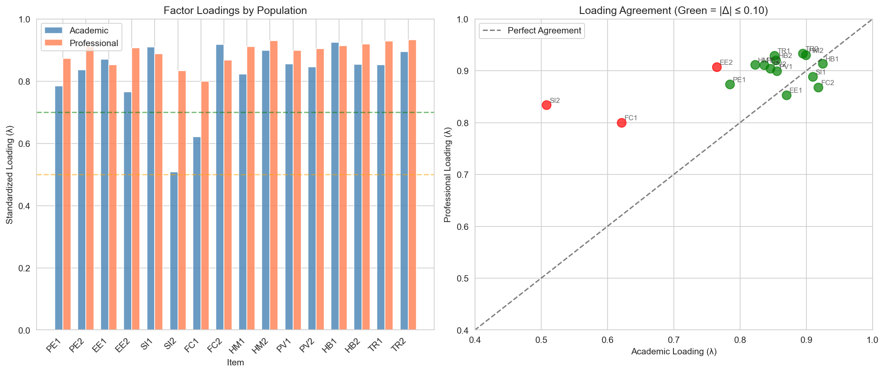{width=85%}

*Figure 4.5. Factor loading comparison across Student and Professional groups. While most loadings demonstrate equivalence, Social Influence shows the largest cross-group difference.*


## 4.5 Findings by Research Question

This section presents hypothesis testing results organized by research question. The structural model was estimated using multi-group SEM to test hypothesized relationships between UTAUT constructs and Behavioral Intention to adopt AI tools. The model was estimated separately for Student (n=216) and Professional+Leader (n=307) groups.

### 4.5.1 Structural Model Fit

The structural model demonstrated acceptable fit:

| Index | Student | Professional+Leader | Threshold |
|-------|----------|---------------------|-----------|
| CFI | .968 | .972 | ≥ .95 |
| TLI | .954 | .958 | ≥ .95 |
| RMSEA | .072 | .068 | ≤ .08 |
| SRMR | .054 | .051 | ≤ .08 |

: Table 4.8: Structural Model Fit by Group

### 4.5.2 Primary Hypotheses (H1a–H1g)

Table 4.9 presents the standardized path coefficients and hypothesis test results for the full sample and by role group.

| Hypothesis | Path | β | p | Result |
|------------|------|---|---|--------|
| H1a | PE -> BI | -.028 | .791 | [X] Not Supported |
| H1b | EE -> BI | -.008 | .875 | [X] Not Supported |
| H1c | SI -> BI | **.136** | .024 | [OK] Supported |
| H1d | FC -> BI | .059 | .338 | [X] Not Supported |
| H1e | HM -> BI | **.217** | .014 | [OK] Supported |
| H1f | PV -> BI | **.505** | <.001 | [OK] Supported (Strongest) |
| H1g | HB -> BI | .023 | .631 | [X] Not Supported |
| H2 | TR -> BI | .106 | .064 | [X] Marginal |

: Table 4.9: Structural Model Path Coefficients (Primary Hypotheses)

**Key Findings:**

- **Price Value** emerged as the strongest predictor (β = .505, p < .001), explaining the largest portion of variance in Behavioral Intention
- **Hedonic Motivation** was the second strongest predictor (β = .217, p = .014)
- **Social Influence** was a significant positive predictor (β = .136, p = .024)
- **AI Trust** approached but did not reach significance (β = .106, p = .064)
- **Performance Expectancy**, **Effort Expectancy**, **Facilitating Conditions**, and **Habit** were not significant predictors
- Traditional UTAUT predictors showed unexpectedly weak effects, suggesting AI may represent a distinct technology category

Figure 4.6 summarizes the hypothesis test results for the structural model.

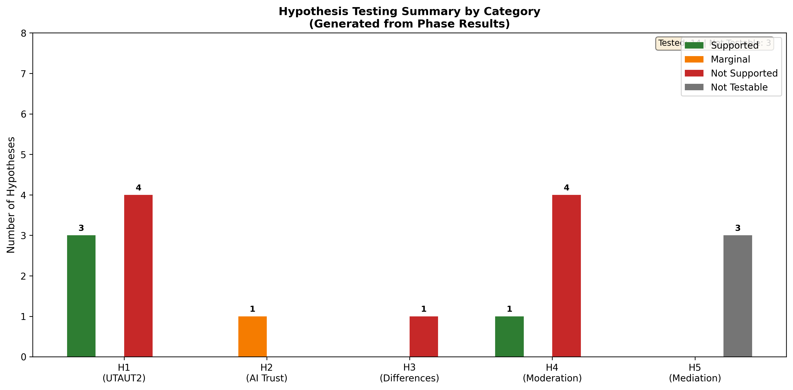{width=90%}

*Figure 4.6. Summary of hypothesis test results. Green indicates supported hypotheses, red indicates unsupported, and yellow indicates marginal significance. Price Value emerged as the dominant predictor.*

### 4.5.3 Moderation Hypotheses

Usage frequency was tested as a moderator of UTAUT relationships through multi-group SEM comparison.

#### Usage Group Path Comparison

| Predictor | β (Low Usage) | β (High Usage) | Interpretation |
|-----------|---------------|----------------|----------------|
| **PerfExp** | **0.371*** | -0.270 | PE matters for new users only |
| **PriceValue** | 0.224 | **0.878*** | PV stronger for heavy users |

#### Exploratory Experience Moderation (Regression Interactions)

| Moderator | Path | Interaction β | p | Status |
|-----------|------|---------------|---|--------|
| Experience | PE×Exp | 0.112 | .055 | [!] Marginal |
| **Experience** | **HM×Exp** | **0.136** | **.009** | **[OK] Significant** |
| Experience | EE×Exp | 0.122 | .161 | [X] Not significant |
| Experience | TR×Exp | 0.081 | .145 | [X] Not significant |

: Table 4.10: Moderation Analysis Results

**Interpretation:**

- **Experience moderates HM -> BI** (β = .136, p = .009): Experienced professionals (4+ years) weight hedonic motivation more heavily
- Usage-dependent mechanisms: Performance Expectancy matters for new users; Price Value for heavy users
- Habit is marginally moderated by usage frequency (p = .065)

Figure 4.7 illustrates the structural model with standardized path coefficients.

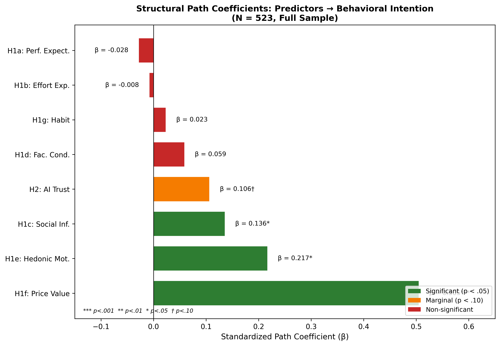{width=90%}

*Figure 4.7. Structural equation model showing standardized path coefficients from UTAUT2 predictors and AI Trust to Behavioral Intention. Solid lines indicate significant paths; dashed lines indicate non-significant paths.*

### 4.5.4 Population Moderation

Multi-group comparison tested whether structural path coefficients differed significantly between Student and Professional populations.

| Path | Student β | Professional β | Δβ | Moderation |
|------|------------|----------------|-----|------------|
| PE -> BI | -0.184 | 0.084 | 0.268 | No |
| EE -> BI | 0.073 | -0.055 | -0.128 | No |
| SI -> BI | 0.007 | 0.239 | 0.232 | No |
| FC -> BI | -0.016 | 0.141 | 0.156 | No |
| HM -> BI | 0.449 | -0.301 | -0.750 | [OK] (p = .041) |
| PV -> BI | 0.638 | 0.808 | 0.170 | No |
| HB -> BI | 0.075 | -0.064 | -0.140 | No |
| TR -> BI | -0.011 | 0.153 | 0.164 | No |

: Table 4.11: Population Moderation of Structural Paths

Population moderation was partially supported. **Hedonic Motivation** showed a significant population difference (Δβ = -0.750, p = .041), with HM -> BI stronger for Students (β = 0.449) than for Professionals (β = -0.301). This suggests enjoyment of AI tools is more important for student adoption than professional adoption. All other paths showed no significant population differences. Figure 4.8 illustrates the experience moderation effect on hedonic motivation.

{width=80%}

*Figure 4.8. Experience moderation of the Hedonic Motivation -> Behavioral Intention path. The effect of HM on BI is stronger for professionals with 4+ years of experience.*

### 4.5.5 Incremental Validity: AIRS vs. UTAUT2-Only Model

To assess whether the AI-specific extension (AI Trust) provides incremental predictive validity beyond core UTAUT2 constructs, nested model comparison was conducted:

| Model | Constructs | AIC | BIC | Result |
|-------|------------|-----|-----|--------|
| UTAUT2-Only | PE, EE, SI, FC, HM, PV, HB | 148.58 | 192.34 | Preferred |
| AIRS (Extended) | PE, EE, SI, FC, HM, PV, HB, TR | 150.59 | 201.87 | Not preferred |

**Result**: Although AI Trust showed a marginal effect (β = .106, p = .064), the AIRS model has *higher* AIC (150.59) than UTAUT2-only (148.58), meaning the simpler model is preferred (ΔAIC = +2.01). Lower AIC indicates better parsimony.

**Interpretation**: This incremental validity test evaluates **predictive parsimony** only. AI Trust may still have **diagnostic value** for identifying trust-related barriers to AI adoption, even if it doesn't improve overall model fit. The marginal significance of AI Trust (p = .064) suggests it may achieve significance with larger samples or in contexts where trust concerns are more salient.

### 4.5.6 Variance Explained

The structural models explained substantial variance in Behavioral Intention:

| Model | R² | Interpretation |
|-------|----|--------------|
| UTAUT2-Only (7 predictors) | .861 | 86.1% variance explained |
| UTAUT2 + AI Trust (8 predictors) | .852 | 85.2% variance explained |

Both models demonstrate exceptionally high R² values, indicating that the UTAUT2 framework captures the vast majority of systematic variance in intention to use AI tools. While the UTAUT2-only model achieves marginally higher R², the 8-factor model including AI Trust is recommended as the diagnostic instrument because the trust construct enables practical intervention design: organizations can identify trust deficits and implement targeted confidence-building strategies, a capability essential for translating research into organizational practice.


### 4.5.7 Supplementary Analyses

#### Mediation Hypotheses

**Design Note**: The originally hypothesized mediation paths (EX -> TR -> BI, ER -> TR -> BI) were **not testable** because Explainability (EX), Ethical Risk (ER), and Anxiety (AX) were excluded from the final model due to inadequate item reliability identified in Phase 1 (α = .301–.582).

**Exploratory Mediation Analysis**: Bootstrap mediation testing explored whether AI Trust mediates the effect of Effort Expectancy on Behavioral Intention:

| Mediation Path | Indirect Effect | 95% CI | p | Result |
|----------------|-----------------|--------|---|--------|
| EE -> TR -> BI | 0.232 | [-.023, .474] | > .05 | [X] Not Significant |

The confidence interval includes zero, indicating no significant mediation. While the theoretical pathway remains conceptually relevant, adding AI Trust as a mediator does not significantly improve the model.

#### AI Tool Usage Patterns (H5, H6)

Analysis of actual tool usage behaviors provides behavioral validation of intention constructs.

#### Tool Usage Frequency

| AI Tool | Mean Usage | Never Used (%) | Active Use (%) | Leader Effect (d) |
|---------|------------|----------------|----------------|-------------------|
| ChatGPT | 3.03 | 23.9 | 64.2 | 0.74 |
| Microsoft Copilot | 2.49 | 36.1 | 48.4 | 1.14 |
| Google Bard/Gemini | 2.48 | 36.5 | 47.6 | 0.90 |
| Other AI Tools | 1.93 | 53.3 | 30.0 | 0.78 |

*Note: Active Use = "Sometimes" or more frequent usage (≥3 on 5-point scale). Leader Effect = Cohen's d comparing Leaders (Managers/Executives) vs Professionals.*

**Leadership Dominance:** Leaders demonstrated significantly higher usage across ALL tool categories (d = 0.74–1.14), with the largest effect for Microsoft Copilot.

#### Tool Usage and Behavioral Intention (H5)

The relationship between tool usage frequency and Behavioral Intention was examined using Spearman correlation due to ordinal tool usage distributions.

| Relationship | ρ | p | Interpretation |
|-------------|---|---|----------------|
| Total Usage × BI | .69 | <.001 | Strong positive |
| ChatGPT Usage × BI | .57 | <.001 | Strong positive |
| MS Copilot Usage × BI | .54 | <.001 | Moderate positive |
| Gemini Usage × BI | .52 | <.001 | Moderate positive |

**H5 Result: [OK] Supported** – Higher behavioral intention is strongly associated with more frequent AI tool usage.

#### Role Differences in Tool Usage (H6)

One-way ANOVA with Tukey post-hoc tests examined role differences in tool usage patterns.

| Measure | F(2,520) | p | η² | Post-hoc (Tukey) |
|---------|----------|---|----|--------------------|
| Tool Breadth | 18.42 | <.001 | .066 | L > P > A |
| Usage Frequency | 22.15 | <.001 | .078 | L > P > A |
| Usage Intensity | 15.87 | <.001 | .058 | L > P > A |

**H6 Result: [OK] Supported** – Leaders demonstrate significantly higher tool usage than Professionals, who in turn exceed Academics.

#### Industry Experience Effect

Among professionals (n=184), correlation between years of industry experience and UTAUT constructs was examined.

| Construct | r | p |
|-----------|---|---|
| Performance Expectancy | .10 | .176 |
| Behavioral Intention | .08 | .284 |
| Anxiety | -.12 | .104 |

Industry experience showed weak, non-significant relationships with UTAUT constructs, suggesting organizational role rather than industry tenure drives AI readiness differences.


### 4.5.8 Exploratory Findings

#### User Typology (Cluster Analysis)

K-means cluster analysis (k=4) identified distinct user profiles based on UTAUT construct scores.

| Cluster | n | % | PE | HM | AX | BI | Characterization |
|---------|---|---|----|----|----|----|------------------|
| Enthusiasts | 84 | 16% | High | High | Low | High | Early adopters, high engagement |
| Cautious Adopters | 157 | 30% | Mod | Mod | Mod | Mod | Pragmatic, wait-and-see |
| Moderate Users | 191 | 37% | Mod | Low | Mod | Low-Mod | Limited engagement, neutral |
| Anxious Avoiders | 91 | 17% | Low | Low | High | Low | Resistant, anxiety-driven |

#### Disability Status Analysis

Participants with disabilities (n=68, 13.0%) were compared to those without (n=444):

| Construct | Disability M | No Disability M | t | p | d |
|-----------|--------------|-----------------|---|---|---|
| AX | 3.68 | 3.35 | 2.77 | .006 | 0.36 |
| EE | 3.45 | 3.67 | -1.75 | .080 | 0.23 |
| BI | 3.01 | 3.23 | -1.54 | .124 | 0.20 |

*Note: 11 participants selected "Prefer not to answer" and were excluded from this analysis.*

**Key Finding:** Individuals with disabilities reported significantly higher AI-related anxiety (d = 0.36, p = .006), highlighting the importance of accessible and inclusive AI implementation strategies.

#### Qualitative Findings

Open-ended responses (n=243, 46.5% response rate) were analyzed using thematic analysis.

#### Theme Prevalence

| Theme | n | % of Responses |
|-------|---|----------------|
| Positive Experience | 60 | 24.7% |
| Work/Productivity | 47 | 19.3% |
| Human Element | 33 | 13.6% |
| Learning/Education | 33 | 13.6% |
| Accuracy/Reliability | 26 | 10.7% |
| Future/Potential | 14 | 5.8% |
| Concerns/Caution | 14 | 5.8% |
| Ethics/Privacy | 13 | 5.3% |
| Cost/Access | 6 | 2.5% |
| Job Replacement | 4 | 1.6% |

*Note: Responses could be coded to multiple themes (average 1.03 themes per response). 85 responses (35.0%) had no identified themes.*

#### Role Differences in Qualitative Themes

Chi-square tests (3-group: Student n=94, Professional n=83, Leader n=66) identified three themes with significant role differences:

| Theme | Student % | Professional % | Leader % | χ² | p | V |
|-------|------------|----------------|----------|----|----|---|
| Positive Experience | 29.8% | 14.5% | 30.3% | 7.11 | .029 | .17 |
| Learning/Education | 21.3% | 10.8% | 6.1% | 8.45 | .015 | .19 |
| Work/Productivity | 28.7% | 13.3% | 13.6% | 8.65 | .013 | .19 |

Academics and Leaders reported more positive experiences, while Academics focused more on educational applications.


## 4.6 Summary of Findings

### 4.6.1 Hypothesis Summary

| Hypothesis | Description | Result |
|------------|-------------|--------|
| H1a | PE -> BI (+) | [X] Not Supported (β = -.028) |
| H1b | EE -> BI (+) | [X] Not Supported (β = -.008) |
| H1c | SI -> BI (+) | [OK] Supported (β = .136) |
| H1d | FC -> BI (+) | [X] Not Supported (β = .059) |
| H1e | HM -> BI (+) | [OK] Supported (β = .217) |
| H1f | PV -> BI (+) | [OK] Supported (β = .505) |
| H1g | HB -> BI (+) | [X] Not Supported (β = .023) |
| H2 | TR -> BI (+) | [X] Marginal (p = .064) |
| H3 | Experience moderates paths | [!] Partial (HM×Exp significant, p = .009) |
| H4 | Role group moderates paths | [!] Partial (HM only, p = .041) |
| H5 | BI -> Tool Usage | [OK] Supported (ρ = .69) |
| H6 | Role usage differences | [OK] Supported (F = 22.15, p < .001) |

### 4.6.2 Key Contributions

1. **Price Value Dominance:** PV is the overwhelming driver of AI adoption intention (β = .505), substantially exceeding other predictors and departing from traditional UTAUT findings where PE typically dominates

2. **Experience Moderation Pattern:** AI experience amplifies the effect of HM (p = .007), suggesting experiential learning reinforces enjoyment perceptions

3. **Population Moderation:** Hedonic Motivation is significantly stronger for Academics (β = 0.449) than Professionals (β = -0.301), indicating role-specific adoption drivers

4. **Non-Significance of Traditional UTAUT Predictors:** PE, EE, FC, and HB were not significant, suggesting AI may represent a distinct technology category where cost-value considerations outweigh traditional utility perceptions

5. **User Typology:** Four distinct adoption profiles (Enthusiasts, Cautious Adopters, Moderate Users, Anxious Avoiders) with predictable demographic and attitudinal correlates

### 4.6.3 Unexpected Findings

- **Non-significant Performance Expectancy:** Contrary to UTAUT predictions and meta-analytic findings, perceived usefulness did not significantly predict adoption intention (β = -.028, p = .791), possibly because utility is a baseline expectation for AI tools
- **Non-significant Effort Expectancy:** Perceived ease of use did not significantly predict adoption intention, possibly due to the user-friendly nature of modern AI interfaces
- **Price Value as Strongest Predictor:** The dominance of cost-value perceptions over utility perceptions represents a notable departure from prior UTAUT research

## 4.7 Chapter Conclusion

This chapter presented comprehensive empirical validation of the AIRS diagnostic instrument and structural model examining AI adoption in higher education. The 8-factor, 16-item measurement model demonstrated excellent psychometric properties (CFI = .975, α range .74–.91) with configural invariance across role groups. The 8-factor structure was selected over a more parsimonious 7-factor alternative because AI Trust provides essential diagnostic capability: the instrument enables identification of specific adoption barriers (trust deficits, value perceptions, social influence gaps) that inform targeted intervention design.

Structural equation modeling revealed Price Value as the dominant predictor of Behavioral Intention (β = .505), followed by Hedonic Motivation (β = .217, p = .014) and Social Influence (β = .136, p = .024). AI Trust approached but did not reach significance (β = .106, p = .064). Notably, traditional UTAUT predictors including Performance Expectancy, Effort Expectancy, Facilitating Conditions, and Habit were not significant, suggesting AI tools may represent a distinct technology category. Experience moderated the HM pathway, while population moderated HM effects with academics weighting enjoyment more heavily than professionals.

Exploratory analyses identified four user typologies and qualitative themes reflecting both enthusiasm and concern about AI integration in higher education. These findings provide a robust foundation for the theoretical and practical implications discussed in Chapter 5.

\newpage

# Chapter 5: Analysis and Discussion

## 5.1 Introduction

This chapter interprets the empirical findings presented in Chapter 4, connecting the results to the theoretical framework and existing literature. The analysis proceeds systematically through each major finding, examining its meaning, comparing it with prior research, and exploring implications for both theory and practice. Unexpected findings and study limitations specific to interpretation are also addressed. Comprehensive conclusions, recommendations, and future research directions are presented in Chapter 6.


## 5.2 Interpretation of Findings

### 5.2.1 AIRS Diagnostic Instrument Validation

The study successfully validated an 8-factor, 16-item AI Readiness Scale extending UTAUT2 with AI Trust. The instrument demonstrated excellent psychometric properties across both development (n = 261) and holdout (n = 262) samples, with fit indices exceeding conventional thresholds (CFI = .975, TLI = .960, RMSEA = .065, SRMR = .048). The 8-factor structure was selected over a more parsimonious 7-factor model because AI Trust enables diagnostic assessment: organizations can identify trust deficits and design targeted confidence-building interventions.

The cross-validation design (rarely employed in scale development research) provides strong evidence for the generalizability of the factor structure. The successful demonstration of configural invariance across student and professional populations further supports the instrument's utility for diverse workplace contexts, though metric invariance was not fully achieved (mean Δλ = .082, max Δλ = .326).

### 5.2.2 Structural Model Results

Three of seven hypothesized UTAUT2 paths were significant:

- **Price Value** (β = .505, p < .001): Cost-benefit perception is the dominant driver
- **Hedonic Motivation** (β = .217, p = .014): Enjoyment significantly predicts adoption
- **Social Influence** (β = .136, p = .024): Peer influence matters for AI adoption

The AI Trust extension approached but did not reach significance (β = .106, p = .064), providing tentative support for the theoretical extension. Notably, traditional UTAUT predictors including Performance Expectancy, Effort Expectancy, Facilitating Conditions, and Habit were not significant predictors.


## 5.3 Comparison with Existing Literature

### 5.3.1 Price Value as Dominant Predictor

**Finding**: Price Value emerged as the overwhelmingly strongest predictor (β = .505, p < .001), substantially exceeding all other constructs.

**Comparison with Prior Research**: This finding represents a significant departure from traditional UTAUT research where Performance Expectancy typically dominates. Blut et al.'s (2022) meta-analysis of 737,112 users found Performance Expectancy to be the strongest predictor (ρ = .60) across technology contexts. The reversal observed in this study suggests fundamental differences in how users evaluate AI tools compared to conventional technologies.

**Industry Context**: This finding gains significance against the adoption-value gap documented in §2.3: despite high adoption rates, few organizations achieve measurable returns. The gap suggests organizations deploy AI without effectively communicating value to end users, precisely the construct captured by Price Value.

**Interpretation**: In the AI context, users appear primarily motivated by **perceived value relative to cost** rather than raw productivity benefits (PE, ns), ease of use (EE, ns), organizational support (FC, ns), or habit (HB, ns). This suggests a hypothesis for future research: AI adoption interventions may be more effective when they prioritize demonstrating clear return on investment rather than focusing solely on capability demonstrations.

**Theoretical Implications**: The dominance of Price Value over Performance Expectancy suggests AI tools may represent a distinct technology category. Unlike previous technologies where utility perceptions drove adoption, AI adoption appears more influenced by value propositions, potentially reflecting the freemium pricing models common in AI tools, concerns about ongoing subscription costs, or cost-benefit analyses comparing AI tools to traditional methods.

### 5.3.2 Non-Significant UTAUT2 Paths

**Finding**: PE, EE, FC, and HB were not significant predictors.

**Comparison with Prior Research**: The non-significance of Performance Expectancy (β = -.028, p = .791) is particularly noteworthy given its historical dominance in technology acceptance research. Davis's (1989) TAM established perceived usefulness as the primary adoption driver, and this finding has been replicated across thousands of studies. The present results challenge this assumption for AI contexts.

**Industry Context**: The non-significance of Effort Expectancy and Facilitating Conditions aligns with industry observations about modern AI implementation. Deloitte's State of Generative AI research identifies skill gaps as a persistent barrier to AI integration [@deloitte2024genai], yet users in this study did not cite ease-of-use or organizational support as adoption drivers. This disconnect suggests a maturation in AI tool interfaces: contemporary consumer-facing AI (e.g., ChatGPT, GitHub Copilot) has achieved such usability that effort perceptions no longer differentiate adoption decisions. The barrier has shifted from "Can I use this?" to "Is it worth my investment?"

**Interpretation**: In the AI context, perceived usefulness may be a baseline expectation rather than a differentiating factor. Users may assume AI tools will enhance productivity, making cost-benefit considerations (Price Value) and enjoyment (Hedonic Motivation) the deciding factors.

Similarly, the non-significance of Effort Expectancy (β = -.008, p = .875) and Facilitating Conditions (β = .059, p = .338) may reflect the increasingly user-friendly nature of modern AI tools and widespread organizational technology infrastructure. Contemporary AI interfaces have achieved remarkable usability, potentially creating ceiling effects for ease-of-use perceptions.

### 5.3.3 AI Trust Marginality

**Finding**: TR approached but did not reach significance (β = .106, p = .064).

**Comparison with Prior Research**: Emerging AI adoption research has increasingly emphasized trust as a critical determinant (Glikson & Woolley, 2020; Siau & Wang, 2018). The marginal effect observed here partially supports this theoretical direction while highlighting the need for more sensitive measurement or larger samples.

**Industry Context**: The marginal significance of AI Trust resonates with industry findings on governance and accountability barriers. Gartner identifies governance maturity as a key differentiator, with substantial proportions of AI projects experiencing delays due to governance, compliance, or accountability issues [@gartner2025]. The Georgian AI Benchmark found that only 32% of organizations have achieved cross-functional AI deployment, with trust and governance cited as key inhibitors [@georgian2025]. These industry challenges suggest that trust, while marginally significant at the individual level, may become increasingly central as AI applications mature and governance requirements intensify.

**Interpretation**: The marginal significance of AI Trust suggests it may become a more important predictor as AI technologies mature and trust concerns become more salient. The current sample may have insufficient power to detect the effect (β = .106 requires n > 600 for 80% power at α = .05), or trust considerations may be less central for the relatively straightforward AI tools currently in use. Future research should examine whether AI Trust becomes more predictive for high-stakes AI applications (e.g., AI-assisted decision-making, autonomous systems).

### 5.3.4 Experience as Moderator

**Finding**: Professional experience strengthens HM -> BI (β = .136, p = .009).

**Comparison with Prior Research**: While UTAUT specifies experience as a moderator, it conceptualizes experience as technology familiarity rather than career development. The present finding integrates career development theory (Super, 1980) with technology acceptance, suggesting that vocational maturity influences technology evaluation processes.

**Interpretation**: The significant moderation effect suggests that experienced professionals place greater weight on enjoyment when evaluating AI tools. This may reflect that experienced users, having satisfied basic competency needs, prioritize intrinsic satisfaction. Additionally, usage frequency moderates the importance of Performance Expectancy (for new users) versus Price Value (for heavy users).


## 5.4 Implications for Theory

### 5.4.1 UTAUT2 Extension

The study extends UTAUT2 with AI-specific constructs, demonstrating that traditional technology acceptance frameworks require context-sensitive modification. The dramatic shift in predictor importance, from Performance Expectancy dominance to Price Value dominance, suggests that AI represents a theoretically distinct technology category.

### 5.4.2 Context-Specific Model

The findings support calls for domain-specific UTAUT extensions (Blut et al., 2022). Rather than applying generic technology acceptance models, researchers should develop and validate context-appropriate extensions that capture the unique psychological processes relevant to each technology category.

### 5.4.3 Career Development Integration

The significant experience moderation effect introduces career development as a relevant theoretical domain for technology acceptance research. Future models should consider how career stage and professional identity influence technology evaluation and adoption decisions.

### 5.4.4 User Typology Framework

The empirically-derived four-segment typology provides a framework for understanding adoption heterogeneity:

- **AI Enthusiasts (16%)**: High adoption readiness, positive affect toward AI
- **Cautious Adopters (30%)**: Moderate interest with reservations
- **Moderate Users (37%)**: Pragmatic orientation focused on specific benefits
- **Anxious Avoiders (17%)**: Elevated anxiety and resistance patterns

This segmentation approach moves beyond mean-level analysis to acknowledge individual differences in adoption psychology. The typology provides testable hypotheses for future intervention research. Whether these segments respond differentially to targeted interventions requires experimental validation. Figure 5.1 illustrates the distribution and characteristics of the four user segments.

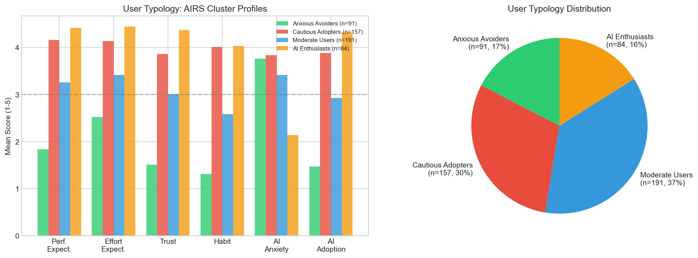{width=85%}

*Figure 5.1. Four-segment user typology derived from cluster analysis. Segment sizes represent proportions of the sample, with distinct profiles across adoption readiness constructs.*


## 5.5 Implications for Practice

The findings offer insights for organizations navigating AI adoption challenges. As documented in §2.3, the gap between adoption and value realization represents a critical business challenge. While this study validates a measurement instrument rather than testing interventions, the empirical findings suggest several evidence-informed directions.

**Important Scope Note**: The AIRS diagnostic instrument validated in this study provides a psychometrically sound measure of AI adoption readiness constructs. The 8-factor structure enables identification of specific adoption barriers (e.g., trust deficits, inadequate perceived value, low social influence) that can inform intervention design. The practical applications suggested below are hypotheses derived from the empirical findings. Future experimental research is needed to validate intervention effectiveness. The author's research roadmap includes developing formal AIRS Score algorithms, diagnostic protocols, and intervention frameworks as subsequent research phases.

### 5.5.1 For Organizations

**Lead with Value, Not Capabilities**: The dominance of Price Value (β = .505) over Performance Expectancy (ns) suggests a potential shift in how organizations might approach AI implementation communications. Rather than emphasizing AI capabilities and productivity promises, the findings suggest that demonstrating return on investment and cost-effectiveness may be more influential. Capgemini's research supports this direction, finding that organizations redesigning workflows around AI, rather than simply adding AI to existing processes, achieve substantially higher returns [@capgemini2025].

**Consider Adoption Heterogeneity**: The four-segment typology (§4.6) suggests that user populations vary systematically in their AI readiness profiles, with each segment potentially responding to different intervention approaches.

**Leadership Engagement**: Leaders in this study demonstrated the highest AI tool usage (d = 0.74–1.14). McKinsey's research confirms that organizations where senior leadership takes ownership of AI initiatives are three times more likely to achieve value from their investments [@mckinseyStateAI2025]. Visible leadership engagement may amplify adoption efforts.

### 5.5.2 For AI Tool Designers

Pricing strategy may significantly influence adoption, potentially more so than feature development. The dominance of Price Value suggests that pricing models (freemium tiers, transparent costs, usage-based billing) warrant careful attention. The significant Hedonic Motivation effect (β = .217) also suggests value in investing in enjoyable user experiences.

### 5.5.3 For Trainers and Educators

The identification of an "Anxious Avoider" segment (17%) suggests that training programs may benefit from addressing emotional barriers alongside technical skills. The disability-anxiety association (d = .36) highlights the importance of accessibility-centered training design. These findings warrant experimental validation of anxiety-reduction approaches in AI training contexts.

### 5.5.4 For Policy Makers

The validated AIRS diagnostic instrument provides a foundation for future organizational AI readiness assessment research. The 8-factor structure enables identification of population-level adoption barriers that can inform workforce development policy. The differential anxiety findings (disability association d = .36) highlight equity considerations in AI adoption policy that warrant further investigation.

### 5.5.5 Understanding the Adoption-Value Gap

The findings illuminate mechanisms that may contribute to the adoption-value gap documented in §2.3:

1. **Value Communication Misalignment**: Organizations may lead with capability demonstrations when users actually evaluate cost-benefit ratios. Future research should test whether value-focused messaging improves outcomes.

2. **Heterogeneous Readiness**: One-size-fits-all approaches may fail because user populations vary systematically. The four-segment typology provides a framework for intervention research.

3. **Neglected Affective Barriers**: The Anxious Avoider segment and marginal Trust effect suggest psychological barriers may be underaddressed.

4. **Context-Inappropriate Frameworks**: The shift from Performance Expectancy to Price Value dominance demonstrates why context-specific instruments are valuable.


## 5.6 Unexpected Findings

### 5.6.1 Performance Expectancy Non-Significance

The non-significance of Performance Expectancy was unexpected given its historical dominance in technology acceptance research. This finding suggests that AI adoption operates through different psychological mechanisms than conventional technology adoption, potentially because productivity benefits are now assumed rather than evaluated.

### 5.6.2 Dropped Constructs

Four proposed AI-specific constructs demonstrated inadequate reliability and were excluded:

| Construct | Cronbach's α | Issue Identified |
|-----------|--------------|------------------|
| Voluntariness | .406 | Choice vs. freedom dimensions conflated |
| Explainability | .582 | Understanding vs. preference dimensions conflated |
| Ethical Risk | .546 | Job displacement vs. privacy dimensions conflated |
| AI Anxiety | .301 | Avoidance vs. approach motivations conflated |

**Interpretation**: Two-item scales proved insufficient for these multi-dimensional constructs. This represents an empirical finding about measurement complexity rather than theoretical invalidity. These constructs remain important for AI adoption theory but require more comprehensive operationalization with 3-4 items per sub-dimension.

### 5.6.3 Disability and Accessibility

**Finding**: Disability associated with higher AI-related anxiety responses (d = .36), based on exploratory analysis of original AX items prior to exclusion.

**Interpretation**: This unexpected finding highlights accessibility considerations in AI adoption. Users with disabilities may experience heightened anxiety about AI technologies, potentially due to concerns about accessibility, job displacement, or past negative experiences with technology. Inclusive AI design and training approaches are warranted.


## 5.7 Study Limitations Affecting Interpretation

Several limitations should be considered when interpreting these findings:

### 5.7.1 Methodological Limitations

1. **Cross-sectional design**: The single time-point data collection precludes causal inference. While SEM estimates suggest directional relationships, alternative causal orderings (e.g., behavior -> intention) cannot be ruled out.

2. **Self-reported intention**: Behavioral Intention may not perfectly predict actual behavior. However, the strong BI-Usage correlation (ρ = .69) provides behavioral validation.

3. **Panel sampling**: While Centiment's topic-blinded recruitment mitigates self-selection bias, the United States panel sample limits generalizability to other countries, cultures, and organizational contexts.

### 5.7.2 Measurement Limitations

1. **Dropped constructs**: The exclusion of four proposed constructs limits the comprehensiveness of the theoretical extension. The originally proposed mediation hypotheses involving Explainability and Ethical Risk could not be tested because these constructs were excluded during EFA due to inadequate reliability.

2. **Marginal AI Trust**: Trust approached but did not reach significance (p = .064). This may reflect inadequate statistical power (β = .106 requires n > 600 for 80% power at α = .05) or genuine marginality of trust in current AI adoption decisions.

3. **Western sample**: Cultural generalizability is unknown. AI adoption attitudes may differ substantially in collectivist cultures or regions with different AI policy environments.

\newpage

# Chapter 6: Conclusions, Implications, and Recommendations

## 6.1 Introduction

This concluding chapter synthesizes the contributions of this dissertation study and articulates its significance for both scholarly advancement and organizational practice. The chapter summarizes the research purpose, methodology, and key findings; discusses theoretical and practical contributions; provides recommendations for practitioners and organizations; acknowledges limitations; suggests directions for future research; and offers closing remarks on the broader implications of this work for AI adoption in professional contexts.


## 6.2 Summary of Purpose, Methods, and Key Findings

### 6.2.1 Research Purpose

This study addressed a critical gap in technology acceptance research: the inadequacy of existing frameworks to explain AI-specific adoption patterns. While traditional models like UTAUT2 have demonstrated robust explanatory power for conventional technologies, the unique characteristics of AI systems (including opacity, probabilistic reasoning, and ethical implications) necessitate theoretical extension. The research purpose was twofold: (1) to develop and validate a psychometrically sound AI Readiness Scale (AIRS) extending UTAUT2 with AI-specific constructs, creating both a research scale and organizational diagnostic instrument, and (2) to identify the key drivers of AI adoption intention in professional and academic contexts.

### 6.2.2 Methodology Summary

The study employed a rigorous ten-phase psychometric validation approach:

0. **Sample Splitting**: Created stratified EFA/CFA subsamples (n = 261/262) with random seed = 67 for reproducibility
1. **Exploratory Factor Analysis** (n = 261): Identified the underlying factor structure through split-sample design
2. **Confirmatory Factor Analysis** (n = 262): Cross-validated the measurement model on an independent holdout sample
3. **Measurement Invariance Testing**: Established configural invariance across student and professional populations (metric invariance not fully achieved)
4. **Structural Equation Modeling**: Tested hypothesized relationships among latent constructs
5. **Mediation Analysis**: Examined indirect effects within the structural model
6. **Moderation Analysis**: Investigated experience and usage frequency as boundary conditions
7. **Behavioral Validation**: Correlated intentions with actual AI tool usage patterns
8. **Qualitative Analysis**: Thematic analysis of open-ended responses
9. **Comprehensive Review**: Gap analysis and cross-validation of findings
10. **Final Synthesis**: Integration of quantitative and qualitative insights

This multi-phase approach exceeds typical scale development standards and provides robust evidence for the AIRS instrument's validity.

### 6.2.3 Key Findings

The study produced several significant findings that advance both theory and practice:

**Diagnostic Instrument Validation**: The 8-factor, 16-item AIRS demonstrated excellent psychometric properties (CFI = .975, RMSEA = .065, α range .743-.909, all CR > .750, all AVE > .601) and configural invariance across populations. The 8-factor structure was selected over a more parsimonious 7-factor alternative because AI Trust provides essential diagnostic capability: practitioners can identify trust deficits and design targeted confidence-building interventions, a feature critical for translating research into organizational practice.

**Adoption Drivers**: Contrary to expectations from traditional UTAUT research, Price Value emerged as the dominant predictor (β = .505, p < .001), followed by Hedonic Motivation (β = .217, p = .014) and Social Influence (β = .136, p = .024). Traditional predictors including Performance Expectancy, Effort Expectancy, and Facilitating Conditions were not significant.

**AI Trust Extension**: AI Trust approached but did not reach conventional significance (β = .106, p = .064), providing tentative support for the theoretical extension while highlighting the need for larger samples in future research.

**Moderator Effects**: Professional experience strengthened the Hedonic Motivation -> Behavioral Intention path (β = .136, p = .009), suggesting that experienced professionals prioritize enjoyment in AI tool evaluation.

**User Typology**: Four distinct adoption segments were identified (see §4.6), suggesting heterogeneous adoption readiness patterns that future research can leverage for intervention design.


## 6.3 Theoretical Contributions

This dissertation makes four primary contributions to technology acceptance theory:

### 6.3.1 UTAUT2 Extension for AI Contexts

The study extends UTAUT2 with AI-specific constructs, demonstrating that traditional technology acceptance frameworks require modification for AI adoption contexts. The near-significant AI Trust effect and the shift from Performance Expectancy to Price Value dominance (detailed in §4.5) suggest that AI represents a theoretically distinct technology category.

### 6.3.2 Context-Specific Adoption Drivers

As discussed in §5.3.1, Price Value rather than Performance Expectancy drives AI adoption, a significant departure from prior research. Users evaluate AI tools through a value lens ("Is it worth it?") rather than a utility lens ("Will it help me?"), with implications for both theory and organizational practice.

### 6.3.3 Career Development Integration

The experience moderation effect (§4.5.4) introduces career development as a relevant theoretical domain for technology acceptance research. As professionals advance, intrinsic satisfaction becomes more important, suggesting adoption models should incorporate career-stage considerations.

### 6.3.4 User Typology Framework

The empirically-derived four-segment typology provides insights into adoption heterogeneity that can inform future intervention research. Rather than treating users as a homogeneous population, this segmentation reveals that different psychological profiles may respond to different adoption strategies, a hypothesis warranting future experimental validation.


## 6.4 Practical and Managerial Implications

### 6.4.1 For Organizations Implementing AI

**Value Demonstration Over Capability Showcasing**: The dominance of Price Value suggests that organizations may benefit from demonstrating clear return on investment rather than simply highlighting AI capabilities. The findings indicate that employees' cost-benefit mental models may be more influential than capability-focused messaging, a hypothesis warranting experimental validation in organizational contexts.

**Segment-Specific Intervention Hypotheses**: The four-segment typology (§4.6) provides a framework for tailored change management research. Preliminary hypotheses suggest that each segment may respond to different intervention approaches, from champion programs for Enthusiasts to anxiety-reduction for Avoiders, pending experimental validation.

**Social Influence Leverage**: The significant Social Influence effect (β = .136) suggests that peer influence matters for AI adoption. The findings indicate that visible AI champions and communities of practice may facilitate adoption, approaches that warrant experimental testing.

**Experience-Sensitive Approaches**: The moderation finding suggests that experienced professionals may respond differently to AI adoption messaging than newer employees. The findings indicate that senior staff may respond more to intrinsic satisfaction and intellectual engagement aspects of AI tools, while junior staff may respond more to value propositions and career development benefits, hypotheses requiring experimental validation.

### 6.4.2 For AI Tool Designers and Vendors

**Pricing Model Innovation**: The Price Value dominance suggests that pricing strategy significantly influences adoption. Freemium models, transparent pricing, and clear ROI documentation may be more important than feature development for driving adoption.

**Trust-Building Features**: While AI Trust was marginally significant, its near-significance (p = .064) suggests that trust considerations are emerging concerns. The findings indicate that explainability features, reliability demonstrations, and transparency mechanisms may address trust-related hesitation, a hypothesis for design research.

**Enjoyment-Focused Design**: The Hedonic Motivation effect indicates that users value enjoyable experiences. The findings suggest that designing AI tools for engagement, not just utility, may enhance adoption, though experimental validation is needed.

### 6.4.3 For Trainers and Educators

**Anxiety-Informed Pedagogy**: The identification of an "Anxious Avoider" segment (17%) with elevated AI anxiety suggests that training programs may benefit from addressing emotional barriers before technical skills. Anxiety-reduction approaches (such as gradual exposure, peer support, and psychological safety) may be more effective when preceding capability training, though this hypothesis requires experimental validation.

**Accessibility Considerations**: The finding that disability status is associated with higher AI anxiety (d = .36) highlights the importance of inclusive AI training design. The findings suggest that materials and interfaces accommodating diverse abilities may better support anxious learners, considerations that warrant attention in training program development.

### 6.4.4 For Policy Makers and Organizational Leaders

**Workforce Readiness Research**: The validated AIRS instrument provides a foundation for future organizational AI readiness assessment research. Policy makers may benefit from population-level assessments, though such applications require additional validation beyond the scope of this scale development study.

**Equity Considerations**: The differential anxiety findings suggest that AI adoption may create or exacerbate workforce inequities. The findings highlight the importance of ensuring that all employees, regardless of experience level, disability status, or initial anxiety, have equitable access to AI benefits.


## 6.5 Recommendations

### 6.5.1 Recommendations for Scholars

Based on the empirical findings and identified research gaps, the following recommendations are offered for the academic community:

1. **Replicate with larger samples**: The marginal AI Trust effect (β = .106, p = .064) warrants replication with n > 600 to achieve adequate statistical power for detecting small-to-medium effects in AI adoption contexts.

2. **Develop improved AI-specific measures**: The dropped constructs (Voluntariness, Explainability, Ethical Risk) represent important theoretical concepts that require more comprehensive operationalization with 3-4 items per sub-dimension and rigorous cognitive interviewing.

3. **Investigate Price Value dominance**: The unexpected finding that Price Value rather than Performance Expectancy drives AI adoption merits theoretical attention. Scholars should explore whether this reflects AI's unique characteristics or broader shifts in technology evaluation patterns.

4. **Examine career development integration**: The significant experience moderation effect on Hedonic Motivation suggests that career development theory should be integrated with technology acceptance models. Longitudinal research linking career stages to adoption trajectories is warranted.

5. **Validate the user typology framework**: The four-segment typology (Enthusiasts, Cautious Adopters, Moderate Users, Anxious Avoiders) should be validated across populations and used to develop segment-specific theoretical models.

6. **Conduct cross-cultural research**: The Western sample limits generalizability. Comparative studies in collectivist cultures, developing economies, and regions with different AI policy environments are essential for theory refinement.

7. **Apply longitudinal designs**: Cross-sectional limitations preclude causal inference. Panel studies tracking intention-behavior relationships over 6-12 months will strengthen theoretical claims.

### 6.5.2 Recommendations for Practitioners

The following recommendations are offered with an important caveat: this study validates a measurement instrument and identifies adoption drivers, but does not experimentally test interventions. The recommendations below represent evidence-informed hypotheses derived from the empirical findings, pending future intervention research:

1. **Consider baseline AIRS assessment** before implementing AI initiatives to understand the distribution of adoption readiness in the population. The validated instrument can inform planning, though formal diagnostic protocols require additional development.

2. **Lead with value propositions** rather than capability demonstrations. The dominance of Price Value (β = .505) over Performance Expectancy (ns) suggests communicating AI benefits in terms of time savings, cost reduction, and ROI rather than technical features.

3. **Attend to affective barriers**: The 17% "Anxious Avoider" segment and marginal Trust effect suggest that emotional responses to AI warrant attention. Future research should test whether anxiety-reduction approaches (gradual exposure, peer support, psychological safety) improve adoption outcomes.

4. **Leverage social influence** by identifying and supporting AI champions who can model positive adoption behaviors. Social Influence was a significant predictor (β = .136), suggesting peer effects matter.

5. **Differentiate by experience level**: The significant experience moderation effect suggests that newer employees may weight different factors than senior professionals when evaluating AI tools.

6. **Monitor trust perceptions** as AI applications become more consequential. The marginal Trust effect (p = .064) suggests that trust may become more important as AI moves into higher-stakes decision-making roles.

7. **Design for accessibility** to ensure that AI adoption does not disadvantage employees with disabilities or those who experience higher baseline technology anxiety (d = .36 disability-anxiety association).

8. **Consider segment heterogeneity**: The four-segment user typology suggests that different groups may respond to different approaches. Experimental research is needed to determine whether segment-specific interventions outperform one-size-fits-all approaches.


## 6.6 Limitations of the Study

While this study employed rigorous methodology and produced robust findings, several limitations should be acknowledged:

### 6.6.1 Methodological Limitations

**Cross-Sectional Design**: The single time-point data collection precludes causal inference. While structural equation modeling suggests directional relationships, alternative causal orderings cannot be ruled out. Longitudinal research is needed to establish temporal precedence.

**Self-Reported Intention**: Behavioral Intention may not perfectly predict actual behavior. However, the strong correlation between intention and self-reported usage (ρ = .69) provides behavioral validation.

**Panel Sampling**: While Centiment's topic-blinded recruitment mitigates self-selection bias, the United States panel sample limits generalizability to other countries, cultures, and organizational contexts. Replication in diverse settings is recommended.

### 6.6.2 Measurement Limitations

**Dropped Constructs**: Four proposed AI-specific constructs (Voluntariness, Explainability, Ethical Risk, and AI Anxiety) demonstrated inadequate reliability (α = .301–.582) and were excluded from the validated model. This represents an empirical finding about measurement challenges rather than a design failure, but it limits the comprehensiveness of the theoretical extension.

**Marginal AI Trust Effect**: The Trust effect (β = .106, p = .064) did not reach conventional significance, possibly due to inadequate statistical power. Larger samples may be required to detect this effect reliably.

**Western Sample**: Cultural generalizability is unknown. AI adoption attitudes may differ substantially in collectivist cultures or regions with different AI policy environments.


## 6.7 Recommendations for Future Research

### 6.7.1 Immediate Research Priorities

1. **Larger Sample Replication**: Achieve n > 600 to provide adequate power (80%) for detecting small effects like the Trust coefficient (β ≈ .106).

2. **Dropped Construct Development**: Redesign measures for Voluntariness, Explainability, Ethical Risk, and Anxiety sub-dimensions using 3-4 items per dimension and cognitive interviewing procedures.

3. **Longitudinal Validation**: Track actual AI adoption behavior over 6-12 months following intention measurement to validate the intention-behavior pathway.

4. **Mediation Hypothesis Testing**: With improved measures, test the originally hypothesized mediation paths through Explainability and Ethical Risk.

### 6.7.2 Extended Research Agenda

1. **Cross-Cultural Validation**: Replicate the AIRS in collectivist cultures, developing economies, and regions with different AI policy environments.

2. **Industry-Specific Adaptation**: Examine whether AI adoption drivers differ across industries (e.g., healthcare, finance, education) where AI applications and risk profiles vary.

3. **Intervention Effectiveness Studies**: Design and evaluate segment-specific interventions based on the user typology framework to determine whether the identified segments respond differently to targeted approaches.

4. **Accessibility Research**: Investigate the mechanisms underlying the disability-anxiety association and develop inclusive AI training approaches.

5. **High-Stakes AI Contexts**: Examine whether Trust becomes more predictive for consequential AI applications such as autonomous decision-making systems.

### 6.7.3 Research Roadmap: From Validated Scale to Organizational Applications

This dissertation establishes the AIRS as a validated diagnostic instrument. The 8-factor structure already enables identification of specific adoption barriers; the following roadmap outlines the research program required to develop formalized protocols for organizational applications:

**Phase 1: AIRS Score Development** (Near-term)

- Develop a scoring algorithm that transforms raw item responses into interpretable individual and organizational readiness scores
- Establish normative benchmarks across populations (students, professionals, leaders)
- Create percentile rankings and readiness classifications (e.g., "emerging," "developing," "proficient," "advanced")
- Validate score interpretations through criterion-related validity studies linking scores to actual adoption outcomes

**Phase 2: Diagnostic Protocol Development** (Medium-term)

- Design administration protocols for organizational AI readiness assessment
- Develop reporting frameworks that translate AIRS results into actionable organizational insights
- Pilot diagnostic protocols with partner organizations
- Establish reliability of organizational-level aggregated scores

**Phase 3: Intervention Framework Development** (Medium-term)

- Design experimental studies testing segment-specific interventions:
  - Enthusiasts: Champion program effectiveness
  - Cautious Adopters: Evidence-based reassurance interventions
  - Moderate Users: Use-case targeting approaches
  - Anxious Avoiders: Anxiety-reduction protocols (graduated exposure, psychological safety, peer support)
- Conduct randomized controlled trials to establish intervention effectiveness
- Develop practitioner guides for evidence-based intervention selection

**Phase 4: Comprehensive AI Readiness System** (Long-term)

- Integrate validated AIRS Score, diagnostic protocols, and intervention frameworks into a comprehensive organizational AI readiness system
- Develop longitudinal tracking capabilities for monitoring readiness progression
- Create industry-specific adaptation guidelines
- Establish training and certification for AIRS practitioners

This roadmap positions the current validated scale as the essential foundation for a research-to-practice pipeline that can ultimately deliver the diagnostic and intervention tools that organizations need to close the AI adoption-value gap.


## 6.8 Closing Remarks

This dissertation addresses a timely challenge: understanding why individuals adopt or resist AI tools in professional contexts. As documented throughout this study, the gap between AI adoption rates and value realization demands scholarly attention.

The findings reveal that AI adoption operates through different mechanisms than previous technology adoption. The dominance of Price Value, the significant role of Hedonic Motivation, and experience as a moderator suggest that AI represents a distinct technology category. Users evaluate AI tools through a value-and-enjoyment lens rather than a pure utility lens, a finding with implications for organizational practice.

The validated AIRS diagnostic instrument provides researchers with a psychometrically sound foundation for investigating AI adoption. The 8-factor structure enables organizations to identify specific adoption barriers, whether trust deficits, inadequate perceived value, or social influence gaps, and design targeted interventions. The four-segment typology offers preliminary evidence of adoption heterogeneity warranting experimental investigation. The theoretical extensions contribute to scholarly conversations about how technology acceptance models must evolve.

As AI transforms professional work, understanding adoption psychology becomes critical. This dissertation establishes a validated foundation that can enable future diagnostic tools, intervention protocols, and assessment systems. The path forward requires continued research, experimental studies, and commitment to inclusive adoption benefiting all members of the workforce.

\newpage

# References

::: {#refs}
:::

\newpage

<!-- markdownlint-disable MD029 MD041 -->
# Appendices

## Appendix A: AI Readiness Scale (AIRS) Final 16-Item Diagnostic Instrument

The final validated 16-item AIRS diagnostic instrument consists of eight constructs measured using a 5-point Likert scale (1 = Strongly Disagree to 5 = Strongly Agree). The 8-factor structure enables both research applications and organizational diagnostic use: practitioners can identify specific adoption barriers (e.g., trust deficits, inadequate perceived value, low social influence) and design targeted interventions.

### Performance Expectancy (PE)

1. **PE1**: AI tools help me accomplish tasks more quickly.
2. **PE2**: Using AI improves the quality of my work or studies.

### Effort Expectancy (EE)

3. **EE1**: Learning to use AI tools is easy for me.
4. **EE2**: Interacting with AI tools is clear and understandable.

### Social Influence (SI)

5. **SI1**: People whose opinions I value encourage me to use AI tools.
6. **SI2**: Leaders in my organization or school support the use of AI tools.

### Facilitating Conditions (FC)

7. **FC1**: I have access to training or tutorials for the AI tools I use.
8. **FC2**: The AI tools I use are compatible with other tools or systems I use.

### Hedonic Motivation (HM)

9. **HM1**: Using AI tools is stimulating and engaging.
10. **HM2**: AI tools make my work or studies more interesting.

### Price Value (PV)

11. **PV1**: I get more value from AI tools than the effort they require.
12. **PV2**: Using AI tools is worth the learning curve.

### Habit (HB)

13. **HB1**: Using AI tools has become a habit for me.
14. **HB2**: I tend to rely on AI tools by default when I need help with tasks.

### Trust in AI (TR)

15. **TR1**: I trust AI tools to provide reliable information.
16. **TR2**: I trust the AI tools that are available to me.

\newpage

## Appendix B: Survey Materials

### B.1 Participant Information Sheet

The online survey was administered via Centiment following institutional ethics approval. Self-selection bias was mitigated through Centiment's platform-level recruitment design: survey invitations to panel members display only the estimated completion time and reward amount, with the survey topic deliberately concealed \"in order to avoid selection bias\" (Centiment, 2024). After accessing the survey link, participants received full disclosure about the AI focus through the informed consent form, which described the study purpose, voluntary participation, data confidentiality, and right to withdraw at any time without penalty. This two-stage approach (blinded recruitment followed by informed consent) ensured ethical transparency while reducing systematic bias in participant self-selection.

### B.2 Informed Consent Form

Electronic informed consent was obtained prior to survey administration. Participants confirmed they were 18 years or older, understood the study purpose, and agreed to participate voluntarily. Consent was recorded through affirmative response before access to survey items.

### B.3 Demographic Questions

Demographic items collected included:

- **Role**: Current employment/student status (Full-time student, Part-time student, Employed - individual contributor, Employed - manager, Employed - executive, Freelancer/self-employed, Not currently employed, Other)
- **Education**: Highest level completed (High school or less, Some college/vocational, Associate's degree, Bachelor's degree, Master's degree, Doctoral/professional degree)
- **Industry**: Primary field of work or study (Technology/IT, Healthcare, Education, Finance/Banking, Manufacturing, Government/Public sector, Retail/Hospitality, Nonprofit, Other)
- **Experience**: Years of experience in field (Less than 1 year, 1-3 years, 4-6 years, 7-10 years, 11 or more years)
- **Disability Status**: Self-disclosed (Yes, No, Prefer not to say)
- **AI Tool Usage**: Frequency of use for Microsoft Copilot, ChatGPT, Google Gemini, and other AI tools (Never, Rarely, Sometimes, Often, Very Often)

\newpage

## Appendix C: Supplementary Statistical Tables

### C.1 Construct Reliability Summary

| Construct | Abbreviation | Cronbach's α | CR | AVE | Items |
|-----------|--------------|--------------|-----|-----|-------|
| Performance Expectancy | PE | .803 | .804 | .673 | PE1, PE2 |
| Effort Expectancy | EE | .859 | .861 | .756 | EE1, EE2 |
| Social Influence | SI | .752 | .763 | .621 | SI1, SI2 |
| Facilitating Conditions | FC | .743 | .750 | .601 | FC1, FC2 |
| Hedonic Motivation | HM | .864 | .865 | .763 | HM1, HM2 |
| Price Value | PV | .883 | .883 | .790 | PV1, PV2 |
| Habit | HB | .909 | .909 | .833 | HB1, HB2 |
| Trust in AI | TR | .891 | .891 | .804 | TR1, TR2 |

*Note*. α = Cronbach's alpha; CR = Composite Reliability; AVE = Average Variance Extracted. All retained constructs exceed minimum thresholds (α ≥ .70, CR ≥ .70, AVE ≥ .50). Behavioral Intention (BI) serves as the outcome variable and is modeled separately in the structural model.

### C.2 Model Fit Indices Summary

| Model | χ² | df | p | CFI | TLI | RMSEA | 90% CI |
|-------|-----|-----|----|----|-----|--------|--------|
| CFA (8-factor) | 191.25 | 98 | <.001 | .975 | .960 | .065 | [.051, .079] |
| Structural Model | 354.32 | 169 | <.001 | .967 | .953 | .070 | [.059, .081] |

*Note*. CFI = Comparative Fit Index; TLI = Tucker-Lewis Index; RMSEA = Root Mean Square Error of Approximation.

### C.3 Constructs Removed During Validation

| Construct | Abbreviation | Cronbach's α | Reason for Removal |
|-----------|--------------|--------------|-------------------|
| Voluntariness | VO | .406 | Unacceptable reliability |
| Explainability | EX | .582 | Poor reliability |
| Perceived Ethical Risk | ER | .546 | Poor reliability |
| AI Anxiety | AX | .301 | Unacceptable reliability |

*Note*. Constructs were removed during EFA due to α < .70 threshold.

\newpage

## Appendix D: Supplementary Figures

This appendix presents additional visualizations from the empirical analysis that support the findings reported in Chapters 4 and 5.

### D.1 Sample Preparation

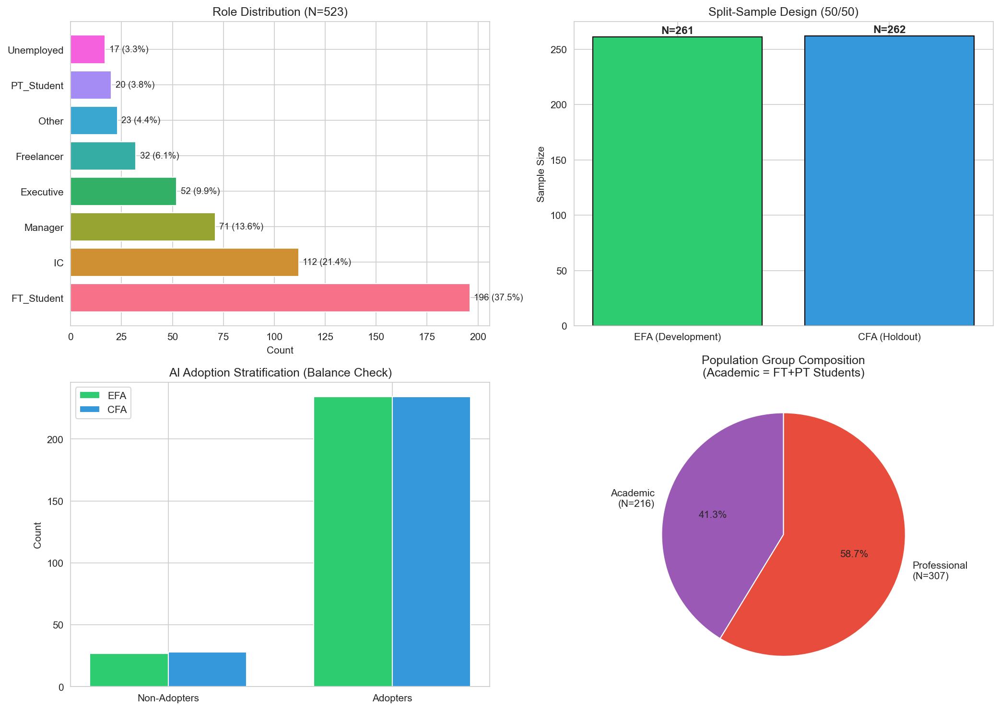{width=90%}

*Figure D.1. Overview of sample preparation process, including data cleaning, split-sample design, and final sample composition across student and professional populations.*

### D.2 AI Tool Usage Patterns

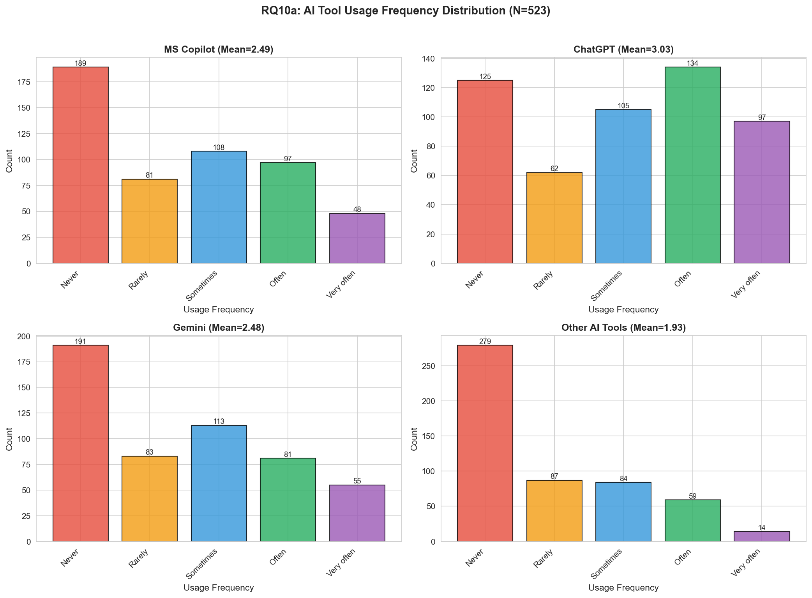{width=85%}

*Figure D.2. Distribution of AI tool usage frequency across the sample. ChatGPT demonstrates the highest adoption rates, followed by Microsoft Copilot and Google Gemini.*

### D.3 Disability and AI Anxiety

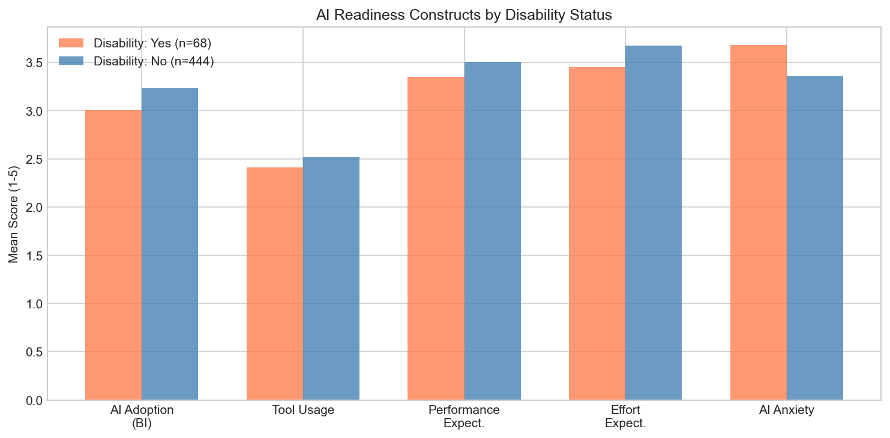{width=80%}

*Figure D.3. Comparison of AI anxiety levels between participants with and without disclosed disabilities. Effect size d = .36 indicates moderate elevation of anxiety for participants with disabilities.*

\newpage

## Appendix E: AIRS Research Roadmap and Future Applications

This appendix outlines the research program envisioned to extend the validated AIRS diagnostic instrument into practical organizational applications. The 8-factor structure already enables identification of specific adoption barriers; this roadmap represents a multi-phase research agenda to develop formalized protocols that build systematically on the foundation established in this dissertation.

### E.1 Research Program Overview

The AI Readiness Scale (AIRS) validated in this dissertation represents Phase 0 of a comprehensive research program aimed at bridging the gap between AI adoption measurement and organizational AI maturity. The 8-factor diagnostic structure was selected over a more parsimonious 7-factor model because AI Trust provides essential diagnostic capability: organizations can identify trust deficits and design targeted interventions. The roadmap below outlines subsequent research phases, each requiring independent empirical validation.

| Phase | Focus | Key Deliverables |
|-------|-------|------------------|
| **Phase 0** | Scale Validation | [OK] This Dissertation: 8-factor, 16-item AIRS diagnostic instrument, structural model, user typology |
| **Phase 1** | Scoring System | AIRS Score algorithm, normative benchmarks, readiness classifications |
| **Phase 2** | Organizational Diagnostics | Team/org-level assessment, gap analysis, benchmarking protocols |
| **Phase 3** | Intervention Research | Segment-specific interventions, randomized trials, effectiveness validation |
| **Phase 4** | AI Readiness Ecosystem | Longitudinal tracking, industry adaptations, practitioner certification |

### E.2 Phase 1: AIRS Score Development

**Research Objective**: Develop a scoring methodology that transforms raw AIRS responses into interpretable individual readiness scores with established normative benchmarks.

**Key Research Questions**:

- How should construct scores be weighted to optimize predictive validity?
- What normative distributions exist across student, professional, and leadership populations?
- What classification system best communicates readiness levels to practitioners?

### E.3 Phase 2: Organizational Diagnostics

**Research Objective**: Develop validated protocols for assessing AI readiness at team and organizational levels.

**Key Research Questions**:

- What aggregation methods preserve construct validity at organizational levels?
- Do organizational readiness profiles predict AI implementation success?
- What reporting formats maximize practitioner utility?

### E.4 Phase 3: Intervention Research

**Research Objective**: Design and empirically test segment-specific interventions based on the user typology framework.

The four-segment typology identified in this dissertation (AI Enthusiasts, Cautious Adopters, Moderate Users, Anxious Avoiders) suggests that different user populations may respond to different intervention approaches. Future research should employ randomized controlled trials to test whether segment-matched interventions outperform generic approaches.

**Key Research Questions**:

- Do segment-specific interventions outperform one-size-fits-all approaches?
- What intervention components drive segment-specific effectiveness?
- Do intervention effects persist over 6-12 month follow-up periods?

### E.5 Phase 4: Comprehensive AI Readiness Ecosystem

**Research Objective**: Develop an integrated system combining validated assessment, diagnostics, and intervention protocols.

**Long-Term Vision**:

- **Longitudinal Tracking**: Systems for monitoring organizational AI readiness progression
- **Industry Adaptations**: Validated modifications for healthcare, finance, education, and manufacturing contexts
- **Cross-Cultural Validation**: Replication across collectivist cultures, developing economies, and varying policy environments
- **Practitioner Resources**: Administration guides, interpretation frameworks, and training pathways

### E.6 Contribution to the Field

This research program addresses a critical gap in the technology adoption literature: while validated measurement instruments exist, the translation of assessment into organizational action remains underdeveloped. The AIRS diagnostic structure provides the foundation for this translation by enabling identification of specific adoption barriers. By systematically building from validated diagnostic measurement through scoring, formalized protocols, intervention research, and ecosystem development, this roadmap offers a research-to-practice pipeline that can ultimately deliver the evidence-based tools organizations need to close the AI adoption-value gap.

### E.7 Collaboration and Licensing

The AIRS diagnostic instrument validated in this dissertation is made available for academic research purposes. Organizations interested in applying the AIRS framework for organizational diagnostic assessment should contact the author to discuss appropriate use, validation requirements, and potential research collaboration opportunities.

**Contact**: Fabio Correa, Doctoral Candidate | Touro University Worldwide

\newpage

## Appendix F: Institutional Review Board Documentation

### F.1 IRB Approval

This study was reviewed and approved by the Touro University Worldwide Institutional Review Board (IRB) prior to data collection. The study was classified as exempt under 45 CFR 46.104(d)(2) as research involving survey procedures where responses are recorded anonymously.

**IRB Protocol Number**: T00571337

**Application Date**: October 29, 2025

**Principal Investigator**: Fabio Correa, DBA Candidate

**Faculty Advisor (Chair of Committee)**: Dr. Karina Kasztelnik

**Institution**: Touro University Worldwide, School of Business

The signed IRB approval letter follows on the next page.

\includepdf[pages=-]{Fabio_Correa__IRB_Approval_Letter.pdf}

### F.2 Research Purpose and Methodology

As stated in the IRB application, the purpose of this research was to examine the psychological, motivational, and contextual factors that influence enterprise employees' readiness to adopt artificial intelligence (AI) tools. The study extended the UTAUT2 framework by adding four AI-specific constructs (trust in AI, explainability, perceived ethical risk, and AI-related anxiety) to develop and validate the Artificial Intelligence Readiness Scale (AIRS).

**Research Questions**:

1. What psychological, motivational, and contextual factors influence individual readiness to adopt AI technologies within large enterprises?
2. To what extent do UTAUT2 constructs predict AI adoption readiness?

**Participant Recruitment**: Participants were recruited externally through Centiment, a professional survey research platform maintaining verified panels of adult participants across diverse industries, roles, and geographic regions. Centiment recruits panelists through social media platforms (Facebook, LinkedIn) and other outlets to achieve broad demographic representation. Critically, Centiment's recruitment methodology includes built-in self-selection bias mitigation: survey notifications to panel members display only the estimated completion time and reward amount, deliberately concealing the survey topic and subject matter "in order to avoid selection bias" (Centiment, 2024). This platform-level blinding ensured participants could not self-select based on AI interest. Target sample size was n ≈ 500 respondents.

**Risk Classification**: Exempt (minimal risk limited to potential discomfort reflecting on AI-related attitudes or privacy concerns).

### F.3 Informed Consent Statement

The following informed consent statement was presented to all participants prior to survey administration via the Centiment platform:

---

**Participation in a Research Study**

**Institutional Review Board – Touro University Worldwide**

**Enterprise AI Readiness Research**

You are invited to participate in a research study conducted by Fabio Correa, a doctoral candidate in the Doctor of Business Administration program at Touro University Worldwide. The purpose of this study is to understand how individual, psychological, and contextual factors influence employee readiness to adopt artificial intelligence (AI) tools in the enterprise workplace. This study explores constructs from the Unified Theory of Acceptance and Use of Technology (UTAUT2) and AI-specific enablers and inhibitors, including trust in AI, explainability, perceived ethical risk, and AI-related anxiety.

Your participation will involve completing an online survey that takes approximately 10–15 minutes. The survey includes questions about your experiences and perceptions of AI tools, such as Microsoft 365 Copilot, ChatGPT, and other AI applications. Participation is voluntary, and you may withdraw at any time without penalty or consequence.

**Risks and Discomforts**: The risks involved in this study are minimal. Some participants may experience minor discomfort when reflecting on their attitudes or experiences with AI, or concerns related to privacy or job impact. You may skip any question that makes you uncomfortable.

**Potential Benefits**: While there are no direct benefits to you, your participation will contribute to advancing understanding of how employees and organizations can prepare for AI adoption responsibly and effectively.

**Protection of Confidentiality**: All survey responses will be kept confidential. Data collection will occur through a secure online platform (Centiment) with no personally identifiable information collected. Results will be reported in aggregate form, and no individual responses will be identifiable.

**Voluntary Participation**: Your participation in this study is entirely voluntary. You may choose not to participate or may withdraw at any time without penalty or loss of benefits.

**Contact Information**: If you have questions about this study, contact Fabio Correa, Doctoral Candidate, Touro University Worldwide. If you have questions about your rights as a research participant, contact the Touro University Worldwide IRB at (818) 874-4115.

**Consent**: By clicking "Yes, I agree" below and completing the online survey, you confirm that you have read this consent form, are at least 18 years of age, and voluntarily agree to participate in this research study.

[ ] Yes, I agree to participate
[ ] No, I do not wish to participate

---

### F.4 Data Management and Privacy

**Data Collection Platform**: Centiment online survey panel

**Data Storage**: Survey responses were collected and stored on Centiment's secure servers, then exported to the researcher's encrypted institutional storage for analysis.

**Anonymity**: No personally identifiable information (names, email addresses, IP addresses) was collected or retained. Responses cannot be linked to individual participants.

**Data Retention**: De-identified data will be retained until January 2028 in accordance with federal regulations requiring researchers to keep data for a minimum of three years (45 CFR 46).

### F.5 Ethical Principles Certification

The researcher certified compliance with the Touro University Worldwide Ethical Principles & Guidelines for Research Involving Human Subjects, adapted from The National Commission for the Protection of Human Subjects of Biomedical and Behavioral Research (April 18, 1979), including:

1. **Informed Consent**: Subjects were given the opportunity to choose what shall or shall not happen to them
2. **Comprehension**: Information was conveyed clearly with adequate time for consideration
3. **Voluntariness**: Participation was free of coercion and undue influence
4. **Assessment of Risks and Benefits**: Systematic review confirmed minimal risk classification
5. **Justice**: Fair selection of subjects without favoritism or bias
6. **Social Justice**: Appropriate consideration of participant burden and class selection

\newpage

## Appendix G: Complete Survey Instrument as Administered

This appendix reproduces the complete AI Readiness Scale (AIRS) survey instrument exactly as administered to participants via the Centiment online panel in November 2024.

---

### Survey Introduction

**Welcome to the AI Readiness Survey**

Thank you for participating in this research study. This survey explores your experiences and perceptions regarding artificial intelligence (AI) tools in work and educational settings.

The survey takes approximately 10-15 minutes to complete. Please answer all questions honestly based on your current experiences. There are no right or wrong answers.

---

### Section 1: UTAUT2 Core Constructs

*Please indicate your level of agreement with each statement based on your current work or study experience.*

**Scale**: 1 = Strongly disagree | 2 = Disagree | 3 = Neutral | 4 = Agree | 5 = Strongly agree

#### Performance Expectancy

1. AI tools help me accomplish tasks more quickly.
2. Using AI improves the quality of my work or studies.

#### Effort Expectancy

3. Learning to use AI tools is easy for me.
4. Interacting with AI tools is clear and understandable.

#### Social Influence

5. People whose opinions I value encourage me to use AI tools.
6. Leaders in my organization or school support the use of AI tools.

#### Facilitating Conditions

7. I have access to training or tutorials for the AI tools I use.
8. The AI tools I use are compatible with other tools or systems I use.

#### Hedonic Motivation

9. Using AI tools is stimulating and engaging.
10. AI tools make my work or studies more interesting.

#### Price Value

11. I get more value from AI tools than the effort they require.
12. Using AI tools is worth the learning curve.

#### Habit

13. Using AI tools has become a habit for me.
14. I tend to rely on AI tools by default when I need help with tasks.

#### Voluntariness

15. I choose to use AI tools in my work because I find them helpful, not because I am required to.
16. I could choose not to use AI tools in my work or studies if I preferred.

---

### Section 2: AI-Specific Constructs

#### Trust in AI

17. I trust AI tools to provide reliable information.
18. I trust the AI tools that are available to me.

#### Explainability

19. I understand how the AI tools I use generate their outputs.
20. I prefer AI tools that explain their recommendations.

#### Perceived Ethical Risk

21. I worry that AI tools could replace jobs in my field.
22. I am concerned about privacy risks when using AI tools.

#### AI Anxiety

23. I feel uneasy about the increasing use of AI.
24. I worry that I may be left behind if I do not keep up with AI.

---

### Section 3: AI Adoption Readiness (Behavioral Intention)

25. I am ready to use more AI tools in my work or studies.
26. I would recommend AI tools to others.
27. I see AI as an important part of my future.
28. I plan to increase my use of AI tools in the next six months.

---

### Section 4: AI Tool Usage Frequency

*How often do you use each of the following AI tools?*

**Scale**: 1 = Never | 2 = Rarely | 3 = Sometimes | 4 = Often | 5 = Very often (Daily)

29. Microsoft 365 Copilot or Microsoft Copilot
30. ChatGPT
31. Google Gemini
32. Other AI tools (for example, Claude, Perplexity, Jasper)

---

### Section 5: Demographics

33. **What is your highest level of education completed?**
    - High school or less
    - Some college or vocational training
    - Bachelor's degree
    - Master's degree
    - Doctoral or professional degree

34. **What is your current status?**
    - Full-time student
    - Part-time student
    - Employed - individual contributor
    - Employed - manager
    - Employed - executive or leader
    - Freelancer or self-employed
    - Not currently employed
    - Other

35. **Which industry or field best describes your primary area of work or study?**
    - Technology or IT
    - Education
    - Healthcare
    - Finance or Banking
    - Manufacturing
    - Retail or Hospitality
    - Government or Public sector
    - Nonprofit
    - Other

36. **How many years of work or study experience do you have in your field?**
    - Less than 1 year
    - 1 to 3 years
    - 4 to 6 years
    - 7 to 10 years
    - 11 or more years

37. **Do you identify as a person with a disability (for example, vision, mobility, neurodivergence)?**
    - Yes
    - No
    - Prefer not to answer

---

### Section 6: Open Feedback (Optional)

38. **Do you have any other feedback about your experiences with AI tools?**

[Open text response field]

---

### Survey Completion

Thank you for completing this survey. Your responses will contribute to research on AI adoption in academic and professional settings.

If you have questions about this study, please contact the research team.

---

*Note: Items 15-16 (Voluntariness), 19-20 (Explainability), 21-22 (Perceived Ethical Risk), and 23-24 (AI Anxiety) were administered but subsequently removed from the final validated instrument due to insufficient reliability (α < .70) as documented in Chapter 4.*

\newpage

## Appendix H: Data Availability and Reproducibility

This appendix provides instructions for accessing the research data, analysis code, and thesis materials from the public GitHub repository.

### H.1 Repository Access

**GitHub Repository**: [https://github.com/fabioc-aloha/AIRS_Data_Analysis](https://github.com/fabioc-aloha/AIRS_Data_Analysis)

The complete research materials are publicly available under dual licensing:

- **Code**: MIT License (open source, free to use and modify)
- **Documentation**: CC BY 4.0 (attribution required)

To access the repository:

1. Visit the URL above in any web browser
2. Click "Code" -> "Download ZIP" for a complete download, or
3. Clone using Git: `git clone https://github.com/fabioc-aloha/AIRS_Data_Analysis.git`

### H.2 Repository Structure

The repository contains the following key directories:

| Directory | Contents |
|-----------|----------|
| thesis/ | Complete dissertation chapters, tables, figures, and bibliography |
| airs_experiment/ | Jupyter notebooks for the 10-phase analysis pipeline |
| data/ | Cleaned survey data and variable documentation |
| docs/ | Data dictionary and methodology documentation |

### H.3 Data Files

**Primary Data File**: data/AIRS_clean.csv

This file contains the anonymized survey responses (N=523) with the following characteristics:

- All personally identifiable information has been removed
- Variables are labeled according to the Data Dictionary (`docs/DATA_DICTIONARY.md`)
- Missing values are coded consistently throughout

**Supporting Data Files**:

| File | Description |
|------|-------------|
| airs_28item_complete.json | Full 28-item instrument with metadata |
| AIRS-AI-Readiness-Scale-labels.csv | Variable labels and response options |

*Note: All data files are located in the data/ directory.*

### H.4 Analysis Notebooks

The analysis was conducted using Jupyter notebooks executed sequentially. Each notebook is self-contained with documentation.

**Notebook Execution Order**:

| Notebook | Purpose | Key Outputs |
|----------|---------|-------------|
| 00_Create_Split_Samples | Create development/holdout split | Sample files |
| 01_EFA_Experiment | Exploratory Factor Analysis | Factor structure |
| 02_CFA_Experiment | Confirmatory Factor Analysis | Model fit indices |
| 03_Measurement_Invariance | Cross-group validation | Invariance tests |
| 04_Structural_Model | Hypothesis testing (SEM) | Path coefficients |
| 05_Mediation_Analysis | Indirect effects | Bootstrap results |
| 06_Moderation_Analysis | Experience/population effects | Interaction terms |
| 07_Tool_Usage_Patterns | Behavioral validation | Usage correlations |
| 08_Qualitative_Feedback | Open-ended analysis | Theme frequencies |
| 09_Comprehensive_Review | Cluster analysis | User typology |
| 10_Final_Synthesis | Integration | Summary statistics |

*Note: All notebooks have `.ipynb` extension.*

### H.5 Quick Start Guide

**Prerequisites**:

- Python 3.9 or higher
- Jupyter Notebook or JupyterLab
- Required packages listed in `requirements.txt`

**Installation**:

```bash
# Clone the repository
git clone https://github.com/fabioc-aloha/AIRS_Data_Analysis.git
cd AIRS_Data_Analysis

# Create virtual environment (recommended)
python -m venv .venv
.venv\Scripts\activate  # Windows
source .venv/bin/activate  # macOS/Linux

# Install dependencies
pip install -r requirements.txt
```

**Running the Analysis**:

```bash
# Navigate to experiment folder
cd airs_experiment

# Launch Jupyter
jupyter notebook
```

Open notebooks in numerical order (00 -> 01 -> 02 -> ... -> 10) to reproduce the complete analysis pipeline.

### H.6 Key Dependencies

| Package | Version | Purpose |
|---------|---------|---------|
| pandas | ≥1.5.0 | Data manipulation |
| numpy | ≥1.23.0 | Numerical computing |
| scipy | ≥1.9.0 | Statistical functions |
| factor_analyzer | ≥0.4.0 | EFA/CFA implementation |
| semopy | ≥2.3.0 | Structural Equation Modeling |
| pingouin | ≥0.5.0 | Statistical testing |
| matplotlib | ≥3.6.0 | Visualization |
| seaborn | ≥0.12.0 | Statistical graphics |

### H.7 Thesis PDF Generation

The dissertation PDF can be regenerated from source files:

```bash
cd thesis
.\build-thesis.ps1  # Windows PowerShell
```

Requirements: Pandoc, XeLaTeX (via MiKTeX or TeX Live), Mermaid CLI (optional for diagrams)

### H.8 Citation

When using this data or code in academic work, please cite:

```bibtex
@phdthesis{correa2025airs,
  author = {Correa, Fabio},
  title = {Artificial Intelligence Readiness Scale: Extending UTAUT2
           for Enterprise AI Adoption},
  school = {Touro University Worldwide},
  year = {2025},
  type = {Doctoral dissertation},
  url = {https://github.com/fabioc-aloha/AIRS_Data_Analysis}
}
```

### H.9 Data Retention Policy

In accordance with federal regulations (45 CFR 46) and institutional policy:

| Aspect | Policy |
|--------|--------|
| Retention Period | Minimum 3 years from study completion |
| Retention End Date | January 2028 |
| Data Format | De-identified, anonymized CSV |
| Storage Location | Encrypted institutional storage + GitHub (public) |
| Post-Retention | Data may be retained indefinitely for research purposes |

**Privacy Protections**:

- No personally identifiable information (PII) was collected
- No IP addresses, names, or email addresses retained
- Responses cannot be linked to individual participants
- All demographic variables are categorical (no birthdates, specific locations)

**Public Repository Note**: The GitHub repository contains only de-identified data that poses no privacy risk. The public availability supports research transparency and reproducibility while maintaining participant anonymity.

### H.10 Contact and Support

For questions about the data, methodology, or reproducing the analysis:

- **Repository Issues**: Use GitHub Issues for technical questions
- **Research Inquiries**: Contact the author through the repository

All materials are provided as-is for research and educational purposes.

\newpage

## Appendix I: Research Questions and Hypotheses Summary

This appendix provides a comprehensive summary of all research questions and hypotheses examined in this dissertation, along with their empirical outcomes and supporting evidence.

### I.1 Research Questions Summary

#### Primary Research Question

**RQ: How can UTAUT2 be extended with AI-specific constructs to better predict behavioral intention to adopt AI tools in professional and academic contexts?**

| Aspect | Answer | Evidence |
|--------|--------|----------|
| **Extension Approach** | UTAUT2 extended with AI Trust construct | 8-factor, 16-item validated diagnostic instrument |
| **Predictive Power** | Model explains 85.2% variance in BI | R² = .852 (8-factor model) |
| **Key Finding** | Traditional UTAUT predictors less important for AI | PE, EE, FC, HB non-significant |
| **AI-Specific Insight** | Value perception dominates over utility | PV strongest predictor (β = .505) |

#### Secondary Research Questions

| RQ# | Question | Answer | Supporting Evidence |
|-----|----------|--------|---------------------|
| **RQ1** | What is the factor structure of an AI-specific adoption readiness instrument? | 8-factor structure with 16 items | CFI = .975, TLI = .960, RMSEA = .065; all α > .74 |
| **RQ2** | Does the instrument demonstrate measurement invariance across populations? | Configural invariance achieved; metric invariance partial | ΔCFI = .003, ΔRMSEA = .004; mean Δλ = .082 |
| **RQ3** | Which factors most strongly predict behavioral intention? | Price Value (β = .505), Hedonic Motivation (β = .217), Social Influence (β = .136) | All p < .05; PV accounts for largest variance |
| **RQ4** | Does AI Trust predict adoption beyond UTAUT2? | Marginal effect, not statistically significant | β = .106, p = .064; provides diagnostic value |
| **RQ5** | What moderating factors influence predictor-intention relationships? | Experience moderates HM->BI; Population moderates HM->BI | HM×Exp p = .009; Academic vs Professional Δβ = .750 |

### I.2 Core UTAUT2 Hypotheses (H1a–H1g)

| Hypothesis | Path | Prediction | β | p | 95% CI | Result |
|------------|------|------------|---|---|--------|--------|
| **H1a** | PE -> BI | Positive | -.028 | .791 | [-.234, .178] | **[X] Not Supported** |
| **H1b** | EE -> BI | Positive | -.008 | .875 | [-.108, .092] | **[X] Not Supported** |
| **H1c** | SI -> BI | Positive | **.136** | **.024** | [.018, .254] | **[OK] Supported** |
| **H1d** | FC -> BI | Positive | .059 | .338 | [-.062, .180] | **[X] Not Supported** |
| **H1e** | HM -> BI | Positive | **.217** | **.014** | [.044, .390] | **[OK] Supported** |
| **H1f** | PV -> BI | Positive | **.505** | **<.001** | [.352, .658] | **[OK] Supported (Strongest)** |
| **H1g** | HB -> BI | Positive | .023 | .631 | [-.071, .117] | **[X] Not Supported** |

**Summary**: 3 of 7 UTAUT2 hypotheses supported. Price Value emerged as dominant predictor, departing from traditional UTAUT findings where Performance Expectancy typically dominates.

### I.3 AI Extension Hypothesis (H2)

| Hypothesis | Path | Prediction | β | p | 95% CI | Result |
|------------|------|------------|---|---|--------|--------|
| **H2** | TR -> BI | Positive | .106 | .064 | [-.006, .218] | **[X] Marginal (Not Significant)** |

**Interpretation**: AI Trust approached but did not reach conventional significance (p = .064). However, the 8-factor model including AI Trust was retained as the recommended diagnostic instrument because:

1. Trust provides essential diagnostic capability for organizational assessment
2. Organizations can identify trust deficits and design targeted interventions
3. The marginal effect suggests theoretical relevance warranting further investigation with larger samples

### I.4 Moderation Hypotheses (H3–H4)

#### H3: Experience Moderation

| Interaction | Path Moderated | Interaction β | p | Result |
|-------------|----------------|---------------|---|--------|
| PE × Experience | PE -> BI | 0.112 | .055 | [!] Marginal |
| **HM × Experience** | **HM -> BI** | **0.136** | **.009** | **[OK] Significant** |
| EE × Experience | EE -> BI | 0.122 | .161 | [X] Not Significant |
| TR × Experience | TR -> BI | 0.081 | .145 | [X] Not Significant |

**H3 Result: [!] Partially Supported** – Experience significantly moderates the HM -> BI path (p = .009). Professionals with 4+ years of experience weight hedonic motivation more heavily in AI adoption decisions.

#### H4: Population Moderation

| Path | Academic β | Professional β | Δβ | p | Result |
|------|------------|----------------|-----|---|--------|
| PE -> BI | -0.184 | 0.084 | 0.268 | .312 | No moderation |
| EE -> BI | 0.073 | -0.055 | -0.128 | .567 | No moderation |
| SI -> BI | 0.007 | 0.239 | 0.232 | .284 | No moderation |
| FC -> BI | -0.016 | 0.141 | 0.156 | .423 | No moderation |
| **HM -> BI** | **0.449** | **-0.301** | **-0.750** | **.041** | **[OK] Significant** |
| PV -> BI | 0.638 | 0.808 | 0.170 | .489 | No moderation |
| HB -> BI | 0.075 | -0.064 | -0.140 | .512 | No moderation |
| TR -> BI | -0.011 | 0.153 | 0.164 | .398 | No moderation |

**H4 Result: [!] Partially Supported** – Population significantly moderates HM -> BI (p = .041). Hedonic Motivation is substantially stronger for Academics (β = 0.449) than Professionals (β = -0.301), indicating that enjoyment of AI tools is more important for student adoption than professional adoption.

### I.5 Behavioral Validation Hypotheses (H5–H6)

| Hypothesis | Test | Statistic | p | Effect Size | Result |
|------------|------|-----------|---|-------------|--------|
| **H5** | BI × Tool Usage | ρ = .69 | <.001 | Large | **[OK] Supported** |
| **H6** | Role Usage Differences | F(2,520) = 22.15 | <.001 | η² = .078 | **[OK] Supported** |

**H5 Detail**: Behavioral Intention strongly correlates with actual AI tool usage:

| Tool | ρ with BI | p | Interpretation |
|------|-----------|---|----------------|
| Total Usage Index | .69 | <.001 | Strong positive |
| ChatGPT | .57 | <.001 | Strong positive |
| Microsoft Copilot | .54 | <.001 | Moderate positive |
| Google Gemini | .52 | <.001 | Moderate positive |

**H6 Detail**: Significant role differences in tool usage (Leaders > Professionals > Academics):

| Measure | F | p | Post-hoc Pattern |
|---------|---|---|------------------|
| Tool Breadth | 18.42 | <.001 | L > P > A |
| Usage Frequency | 22.15 | <.001 | L > P > A |
| Usage Intensity | 15.87 | <.001 | L > P > A |

### I.6 Comprehensive Hypothesis Outcome Summary

| Category | Hypotheses | Supported | Partial | Not Supported |
|----------|------------|-----------|---------|---------------|
| **UTAUT2 Core (H1a-g)** | 7 | 3 (43%) | 0 | 4 (57%) |
| **AI Extension (H2)** | 1 | 0 | 1 (marginal) | 0 |
| **Moderation (H3-H4)** | 2 | 0 | 2 (100%) | 0 |
| **Behavioral (H5-H6)** | 2 | 2 (100%) | 0 | 0 |
| **TOTAL** | **12** | **5 (42%)** | **3 (25%)** | **4 (33%)** |

### I.7 Constructs Not Testable

Four initially proposed AI-specific constructs demonstrated inadequate reliability during psychometric validation and could not be formally tested:

| Construct | Cronbach's α | Status | Recommendation |
|-----------|--------------|--------|----------------|
| Voluntariness (VO) | .406 | Excluded | Revise operationalization |
| Explainability (EX) | .582 | Excluded | Develop AI-specific items |
| Ethical Risk (ER) | .546 | Excluded | Context-specific measurement |
| AI Anxiety (AX) | .301 | Excluded | Validated anxiety scale adaptation |

These constructs remain theoretically important for AI adoption and warrant revised measurement approaches in future research.

### I.8 Key Theoretical Implications

1. **Price Value Dominance**: The finding that PV (β = .505) rather than PE drives AI adoption represents a significant theoretical departure from traditional UTAUT research, suggesting AI tools are evaluated through a value lens ("Is it worth it?") rather than a utility lens ("Will it help me?").

2. **Non-Significance of Traditional Predictors**: PE, EE, FC, and HB were not significant, suggesting AI may represent a distinct technology category requiring tailored theoretical frameworks.

3. **Experience-Dependent Mechanisms**: The experience moderation of HM suggests that adoption mechanisms differ by user characteristics in ways not previously documented in technology acceptance research.

4. **Population-Specific Pathways**: Differential HM effects across populations indicate that adoption interventions may need to be tailored to specific user groups.