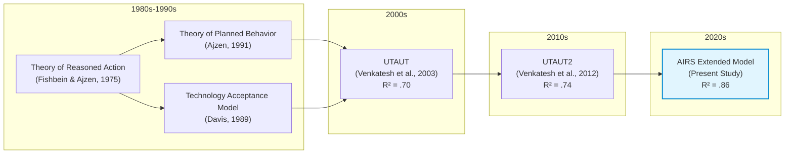
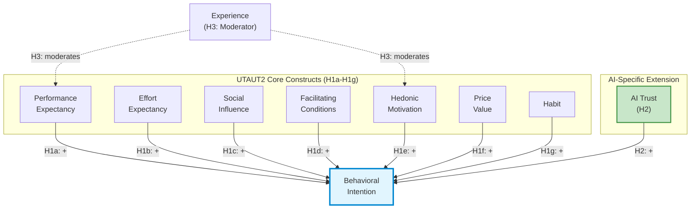
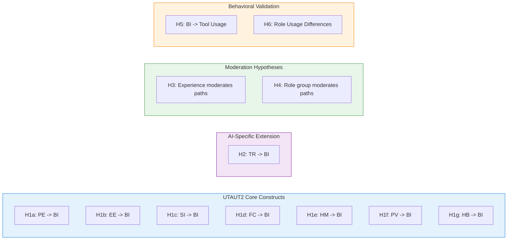

# Chapter 2: Literature Review

## 2.1 Introduction

The rapid enterprise adoption of artificial intelligence has outpaced the explanatory capacity of traditional technology acceptance frameworks. While organizations have embraced AI at unprecedented rates (rising from approximately 50% historically to 72% in 2024 and 88% by late 2025 [@mckinseyStateAI2024; @mckinseyStateAI2025]), most remain in piloting phases rather than scaled deployment. McKinsey reports that only about one-third of organizations have begun scaling AI programs, and just 6% qualify as "AI high performers" with meaningful enterprise-level EBIT impact [@mckinseyStateAI2025]. This adoption-value paradox presents both a theoretical puzzle and a practical challenge: why do established technology acceptance models incompletely predict AI adoption, and what additional constructs must be incorporated to guide organizational intervention?

This chapter establishes the theoretical foundation for the Artificial Intelligence Readiness Scale (AIRS) by pursuing three objectives. First, it traces the evolution of technology acceptance research from foundational behavioral theories through the Unified Theory of Acceptance and Use of Technology (UTAUT) and its consumer extension (UTAUT2), establishing the empirical baseline that informs scale development. Second, it examines why AI (as a socio-technical phenomenon characterized by opacity, probabilistic reasoning, and ethical exposure) stresses this baseline in ways that demand construct extension. Third, it synthesizes emerging research on AI-specific determinants of adoption, including trust, anxiety, and explainability, to justify the theoretical framework and hypotheses tested in subsequent chapters.

The review draws on three categories of evidence. Academic research provides the theoretical architecture, anchored by Venkatesh et al.'s (2003, 2012) foundational UTAUT work, Blut et al.'s (2022) comprehensive meta-analysis spanning 737,112 users across 1,935 independent samples, and Venkatesh's (2021) AI-specific research agenda. Industry benchmarks from McKinsey, Boston Consulting Group, and MIT Media Lab contextualize these theoretical insights within the current enterprise AI landscape. Finally, empirical studies on AI trust, explainability, and anxiety provide construct-level evidence for the proposed extensions.

This dual-lens approach (integrating academic rigor with business relevance) reflects the Doctor of Business Administration orientation of this thesis. The literature review not only establishes scholarly grounding but also identifies practical implications: why AI adoption programs fail, what organizational levers matter, and how validated measurement can inform change management. By the chapter's conclusion, readers will understand why AIRS extends UTAUT2 with AI-specific constructs and how the resulting framework addresses both theoretical gaps and practitioner needs.

## 2.2 Technology Acceptance Models: Foundations and Evolution

### 2.2.1 Early Behavioral Theories

The study of technology adoption originates in broader behavioral science. Ajzen's (1991) Theory of Planned Behavior (TPB) explains volitional behavior through three determinants: attitudes toward the behavior, subjective norms reflecting perceived social pressure, and perceived behavioral control representing self-efficacy and resource availability. TPB's parsimony and empirical generalizability made it adaptable to early information systems research, yet it remains technology-agnostic: it does not model perceptions unique to digital systems such as usefulness or ease of use.

Davis's (1989) Technology Acceptance Model (TAM) addressed this limitation by introducing two technology-specific beliefs: perceived usefulness (the degree to which a user believes technology will enhance job performance) and perceived ease of use (the degree to which technology use is free of effort). TAM's elegant specification and consistent empirical support established it as the dominant paradigm in information systems research for over two decades. However, TAM's parsimony becomes a limitation when technologies carry salient ethical, organizational, or epistemic properties that instrumental beliefs alone cannot capture.

Rogers's (2003) Diffusion of Innovations theory complements these individual-level models by explaining how innovations spread through social systems over time. Five innovation attributes (relative advantage, compatibility, complexity, trialability, and observability) predict adoption rates across populations. While diffusion theory illuminates organizational uptake and social influence, it is less diagnostic for the psychological mechanisms underlying individual decisions to rely on complex, partially opaque systems such as modern AI.

### 2.2.2 The Unified Theory of Acceptance and Use of Technology (UTAUT)

Venkatesh et al. (2003) synthesized eight prominent acceptance models into the Unified Theory of Acceptance and Use of Technology (UTAUT), achieving superior explanatory power through theoretical integration. UTAUT specifies four direct determinants of behavioral intention and use:

**Performance Expectancy (PE)** captures the degree to which using technology will help attain job performance gains, integrating perceived usefulness (TAM), extrinsic motivation, job-fit, relative advantage, and outcome expectations from prior theories.

**Effort Expectancy (EE)** represents the ease associated with technology use, incorporating perceived ease of use (TAM), complexity (innovation diffusion), and ease of use from other frameworks.

**Social Influence (SI)** reflects the degree to which important others believe the individual should use the technology, synthesizing subjective norm, social factors, and image constructs.

**Facilitating Conditions (FC)** captures organizational and technical infrastructure supporting use, including perceived behavioral control, facilitating conditions, and compatibility from prior models.

UTAUT further specifies four moderators (gender, age, experience, and voluntariness) that systematically alter the strength of predictor-intention relationships. In the original validation, UTAUT explained 70% of variance in behavioral intention [@venkatesh2003], substantially exceeding the explanatory power of its constituent theories.

### 2.2.3 Meta-Analytic Evidence: The Current State of UTAUT

Blut et al.'s (2022) landmark meta-analysis provides the most comprehensive assessment of UTAUT to date, synthesizing 25,619 effect sizes from 737,112 users across 1,935 independent samples. This analysis not only confirms UTAUT's core predictions but also reveals nuanced patterns essential for AI-context extensions.

**Performance Expectancy emerges as the consistently strongest predictor of behavioral intention**, with a meta-analytic correlation of ρ = .60 and substantial effect sizes across contexts. This finding aligns with decades of TAM research positioning perceived usefulness as the primary adoption driver and has direct implications for AI messaging strategies in organizations.

Effort Expectancy shows moderate effects (ρ = .45) but displays greater context-dependency. In established technology categories where interfaces have matured, effort expectancy may reach ceiling effects: users assume baseline usability. This pattern suggests that for contemporary AI tools with polished interfaces, ease-of-use investments may show diminishing returns relative to other adoption levers.

Social Influence demonstrates inconsistent effects across organizational versus consumer contexts, with stronger impact under mandatory use conditions. Facilitating Conditions shows a direct effect on use behavior that strengthens with experience, suggesting infrastructure and support matter more for sustained engagement than initial adoption.

Critically, Blut et al. (2022) identify substantial unexplained variance and call for domain-specific extensions that incorporate constructs relevant to emerging technologies. They observe that the "red ocean" of UTAUT research has produced diminishing theoretical returns, yet faithful application with appropriate extensions remains productive. This finding directly motivates the present study's AI-specific extensions.

### 2.2.4 UTAUT2: Consumer Context Extensions

Venkatesh et al. (2012) extended UTAUT for consumer contexts through UTAUT2, adding three constructs:

**Hedonic Motivation (HM)** captures fun or pleasure derived from technology use, acknowledging that consumer adoption is driven by intrinsic enjoyment alongside instrumental outcomes.

**Price Value (PV)** represents the cognitive trade-off between perceived benefits and monetary cost, relevant when users bear technology expenses directly.

**Habit (HB)** reflects automaticity developed through prior behavior, acknowledging that repeated use becomes self-reinforcing independent of conscious intention.

UTAUT2 explained 74% of variance in behavioral intention [@venkatesh2012consumer], demonstrating the value of context-appropriate extensions. For the present research, UTAUT2 provides the baseline framework, with modifications appropriate to workplace AI contexts where hedonic motivation and habit remain relevant while price value may be less salient (organizational rather than personal expenditure).

*Figure 2.1. Evolution of Technology Acceptance Models from TRA (1975) through UTAUT2 (2012) to the AIRS extension (this study). Source: Compiled by Author*

## 2.3 The AI Adoption-Value Gap: Industry Context

### 2.3.1 Current State of Enterprise AI Adoption

Before examining why traditional acceptance models require extension for AI, it is essential to understand the practical landscape these models must explain. Industry benchmarks reveal a striking paradox: AI adoption has reached near-ubiquity, yet value realization remains exceptional.

According to McKinsey's State of AI series, organizational AI adoption jumped from approximately 50% (where it had hovered for years) to 72% in 2024, and further increased to 88% by late 2025 [@mckinseyStateAI2024; @mckinseyStateAI2025]. This acceleration, driven primarily by generative AI capabilities and accessible enterprise platforms, represents one of the fastest technology adoption curves in organizational history.

Yet adoption has not translated into proportional value capture. Boston Consulting Group reports that only 5% of companies achieve measurable business value from AI initiatives, while approximately 74% struggle to scale beyond proofs of concept [@bcgAIAdoption2024; @bcgAIAdoption2025]. McKinsey finds that only about 6% of organizations qualify as "AI high performers," those attributing 5% or more of EBIT to AI use and reporting significant value, while just 39% report any enterprise-level EBIT impact [@mckinseyStateAI2025]. IBM's Global AI Adoption Index found that 42% of enterprise-scale organizations had deployed AI with another 40% actively piloting solutions, yet 37% cite data complexity as their top barrier [@ibm2023].

The MIT Media Lab's NANDA Initiative provides perhaps the most sobering assessment: 90–95% of generative AI pilots fail to scale or deliver measurable profit-and-loss improvements [@mitMediaLab2025]. Georgian's AI Benchmark 2025 corroborates this pattern, finding that only 32% of enterprises had deployed AI across multiple business functions [@georgian2025]. This failure rate exceeds typical technology project failures, suggesting AI-specific barriers that traditional change management and technology deployment frameworks do not adequately address.

### 2.3.2 Diagnosing the Gap: Why Adoption Does Not Equal Value

Industry analyses converge on three systemic barriers underlying the adoption-value gap:

**Scaling Failure**: Most organizations can demonstrate AI feasibility in controlled pilots but lack the operational design, governance architecture, and change infrastructure to move innovations into production. Georgian's AI Benchmark 2025 found that only 32% of enterprises had deployed AI across multiple business functions [@georgian2025], while ISG's State of Enterprise AI Adoption report confirms that scaling remains the top challenge across industries [@isg2025]. These findings indicate that organizational rather than technological constraints limit scaling.

**Governance and Trust Deficits**: Organizations struggle with ownership, compliance, bias mitigation, and ethical use policies. The gap between AI deployment speed and governance framework development creates risk exposure that prudent organizations constrain through limited adoption scope. McKinsey finds that AI high performers are three times more likely than their peers to have senior leaders who demonstrate strong ownership and commitment to AI initiatives [@mckinseyStateAI2025]. Gartner identifies governance maturity as a primary differentiator between AI leaders and laggards, with substantial proportions of AI projects facing delay or cancellation due to unclear governance frameworks [@gartner2025].

**Capability and Change Barriers**: Misalignment across functions, skill gaps, and resistance to workflow redesign inhibit AI integration. Deloitte's State of Generative AI research identifies insufficient AI expertise as a persistent barrier, with skill gaps constraining operational integration [@deloitte2024genai], while Lucidworks finds that organizations with company-wide AI literacy programs achieve faster adoption and stronger employee trust [@lucidworks2025]. Capgemini research suggests that organizations embedding AI into redesigned workflows, rather than layering AI onto legacy processes, achieve substantially higher returns [@capgemini2025], yet such redesign requires capabilities and change tolerance that most organizations lack.

### 2.3.3 Implications for Acceptance Research

This industry context has direct implications for technology acceptance research. The adoption-value gap suggests that traditional acceptance constructs (useful for predicting initial adoption intention) may incompletely explain the sustained, consequential use that generates organizational value. If 88% of organizations have adopted AI while only 6% achieve meaningful EBIT impact, then factors beyond performance and effort expectancy must mediate the translation from adoption to value.

Venkatesh (2021) argues that AI tools present unique adoption challenges that existing frameworks do not fully address. Unlike prior technologies, AI systems (1) operate as partially opaque decision aids where underlying models are "blackboxed"; (2) make errors that accumulate and erode trust over time; (3) require learning periods during which performance improves; (4) may develop emergent biases unknown at deployment; and (5) shift the human role from decision-maker to decision-overseer or decision-recipient. These characteristics suggest that trust, transparency, and anxiety (constructs largely peripheral in traditional acceptance models) move to the foreground for AI adoption.

## 2.4 Why AI Stresses Traditional Acceptance Models

### 2.4.1 Opacity and Explainability

Many AI systems, particularly those employing deep learning, function as partially opaque decision aids. Users (and often developers) cannot fully articulate why a model produces specific outputs. This characteristic fundamentally challenges traditional acceptance models, which assume users can form reasoned judgments about technology usefulness based on observable performance.

Venkatesh (2021) identifies model opacity as a primary barrier to AI adoption: when users have "little or no visibility into the underlying algorithm or process that renders the decision," they cannot calibrate trust or develop the performance expectations that drive adoption in transparent systems. Doshi-Velez and Kim (2017) argue that interpretability and explainability become central to justified reliance when systems are opaque and consequential.

The construct of **perceived explainability**, whether users can understand and utilize reasons behind AI outputs with sufficient clarity to justify action, emerges from this limitation. Shin (2021) distinguishes explainability from causability (the user's ability to infer cause-effect logic adequate for decision-making), demonstrating that higher perceived explainability increases both trust and intention to use. Critically, explainability effects extend beyond system perceptions to trust in the human teams responsible for deployment and oversight, indicating organizational implications beyond individual acceptance.

### 2.4.2 Probabilistic Behavior and Model Errors

AI systems operate probabilistically, producing outputs that are correct in expectation but not guaranteed for individual cases. This characteristic distinguishes AI from deterministic software where identical inputs yield identical outputs. Venkatesh (2021) notes that "almost by definition, a model is bound to make mistakes, given that it is, after all, a representation of reality."

For adoption, this probabilistic nature creates a trust challenge. Users must accept that errors will occur while maintaining sufficient confidence to rely on outputs for consequential decisions. Traditional acceptance models do not explicitly address this calibrated-trust requirement. The UTAUT construct of performance expectancy assumes users can assess technology usefulness; probabilistic AI requires users to assess expected utility across a distribution of possible outcomes, some of which will be incorrect.

Furthermore, AI models learn over time, meaning initial performance may not predict mature performance. Users who experience early errors may form negative performance expectations that persist even as systems improve, a dynamic traditional acceptance models do not capture.

### 2.4.3 Ethical Exposure and Accountability

AI introduces distinctive ethical exposures around bias, privacy, and accountability that shape willingness to rely on outputs. The widely-publicized case of Amazon's AI hiring tool (which systematically discriminated against women job applicants) illustrates how AI systems can encode and amplify biases present in training data (Schuetz & Venkatesh, 2020).

Floridi et al. (2018) articulate an ethical framework identifying AI-specific risks: autonomy erosion, privacy invasion, unfair discrimination, and accountability gaps. These risks generate **perceived ethical risk**, referring to anticipated harms that depress adoption intention even when performance expectations are favorable. Dwivedi et al. (2021) demonstrate that perceived ethical risk exerts direct negative effects on intention and moderates the influence of traditional predictors like performance expectancy and social influence.

In enterprise contexts, ethical risk connects to organizational legitimacy and governance. Users assess not only whether AI works but whether reliance is appropriate given fairness, privacy, and accountability implications. When organizations fail to establish clear governance (bias audits, escalation pathways, human-in-the-loop procedures) users may limit consequential reliance regardless of system capability.

### 2.4.4 Autonomy and Human Role Transformation

AI's autonomy capabilities fundamentally alter the human role in work processes. Traditional decision support technologies augment human judgment; AI can supplant it. Venkatesh (2021) observes that "with AI tools, the human decision maker (i.e., employee) could thus be relegated to playing a secondary role or have no role to play."

This transformation generates **AI-related anxiety**, understood as affective responses to autonomy, opacity, and rapid change. Unlike technology anxiety rooted in difficulty of use, AI anxiety encompasses concerns about job displacement, loss of professional agency, and erosion of human expertise. Tao et al. (2020) conceptualize AI anxiety through multiple dimensions including privacy-related anxiety, bias-related anxiety, and opacity-related anxiety. Kim et al. (2025) add anticipatory anxiety about future disruptions and existential concerns about human obsolescence.

Research suggests anxiety may exhibit nonlinear relationships with exposure. Moderate, calibrated exposure can reduce anxiety as users develop realistic expectations and coping strategies, while minimal exposure leaves fears unchallenged and intensive exposure may overwhelm adaptive capacity (Frenkenberg & Hochman, 2025). This pattern implies that training and hands-on experience can shift affective responses favorably, an organizational lever absent from traditional acceptance frameworks.

## 2.5 Trust in AI Systems

### 2.5.1 Conceptualizing AI Trust

Trust has emerged as a gateway condition for AI adoption: without sufficient trust, users hesitate to rely on outputs even when systems appear useful. Langer et al.'s (2023) comprehensive review of empirical research on trust in AI positions trust as mediating the relationship between system properties and behavioral outcomes across application areas.

AI trust adapts the ability-integrity-benevolence triad from interpersonal trust research to algorithmic agents (Siau & Wang, 2018). **Ability** translates to perceived AI competence and accuracy; **integrity** becomes perceptions of fairness and consistency; **benevolence** maps to alignment between AI outputs and user or organizational goals. Stevens and Stetson (2023) operationalize these facets in the Trust and Acceptance of AI Technology (TrAAIT) scale, demonstrating that multi-dimensional trust can be measured reliably in professional settings.

### 2.5.2 Trust as Mediator and Amplifier

Empirical evidence positions trust as both a direct predictor of adoption intention and a mechanism through which other factors operate. When trust is high, performance expectancy shows stronger effects on intention, as users translate positive system evaluations into adoption when they trust the system to perform consistently. When trust is low, even objectively capable systems fail to generate adoption intention because users doubt whether observed performance will generalize to their consequential decisions.

Explainability serves as a primary antecedent of trust. Shin (2021) demonstrates that when users perceive AI explanations as clear, sufficient, and actionable, trust increases. This explainability-to-trust pathway provides an organizational lever: investing in explanation design can build trust without altering underlying AI capability.

Governance practices also shape trust. When organizations establish bias audits, privacy safeguards, and clear accountability structures, perceived ethical risk decreases and trust increases. Stevens and Stetson (2023) find that trust in the people and processes behind AI deployment contributes to system trust, suggesting that organizational governance operates through trust to influence adoption.

### 2.5.3 Trust in the Present Research

Given the empirical evidence for trust's central role in AI adoption, the present research incorporates **AI Trust** as a core construct extending UTAUT2. AI Trust is operationalized as confidence that the AI system is reliable, competent, and aligned with user and organizational values. This construct is expected to positively predict behavioral intention directly and to mediate effects of explainability and governance perceptions on intention.

*Figure 2.2. AIRS Conceptual Model showing Extended UTAUT2 framework for AI Adoption with AI Trust extension. Source: Compiled by Author*

*Note: AI Anxiety was initially proposed as an inhibitor construct (H8) but was excluded from the final model due to inadequate reliability (α = .301). See Chapter 4 for details.*

## 2.6 AI-Related Anxiety

### 2.6.1 Conceptualizing AI Anxiety

AI-related anxiety captures affective responses to AI autonomy, opacity, and the pace of technological change. Unlike general technology anxiety rooted in difficulty of use, AI anxiety encompasses broader concerns about human obsolescence, loss of agency, and unpredictable societal transformation.

Tao et al. (2020) developed a multi-dimensional AI anxiety scale identifying distinct facets: anxiety about AI learning and communication, AI social influence, AI configuration, and AI development trajectory. Frenkenberg and Hochman (2025) add anticipatory dimensions, distinguishing anxiety about current AI from anxiety about future AI capabilities. Kim et al. (2025) identify annihilation anxiety (existential concerns about human relevance) as a component particularly salient among knowledge workers whose expertise AI may replicate.

### 2.6.2 Anxiety as Inhibitor

Anxiety operates as an inhibitor in adoption models, exerting direct negative effects on intention and potentially attenuating the positive influence of performance expectancy and other drivers. Users experiencing high AI anxiety may acknowledge system usefulness while remaining unwilling to rely on AI for consequential decisions.

Importantly, anxiety effects may be nonlinear with exposure. Several studies observe that moderate, structured exposure to AI reduces anxiety by replacing vague fears with realistic expectations and coping strategies. This suggests that enablement programs and hands-on training can shift anxiety levels favorably, an organizational intervention that traditional acceptance models do not explicitly accommodate.

### 2.6.3 Anxiety in the Present Research

The present research incorporates **AI Anxiety** as an inhibitor construct extending UTAUT2. AI Anxiety is operationalized as affective unease about AI autonomy, opacity, and potential negative consequences. This construct is expected to negatively predict behavioral intention and may moderate the effects of positive predictors, particularly for users with limited AI experience.

## 2.7 Gaps in Current Research

The literature review reveals several gaps that the present research addresses:

**Gap 1: Validated AI-Specific Measurement Instruments**. While theoretical arguments for AI-specific constructs are well-developed, validated measurement instruments remain scarce. Most existing AI adoption studies adapt general technology acceptance measures or develop ad hoc items without rigorous scale development. The present research addresses this gap through systematic scale development following established psychometric procedures (Hinkin, 1998; DeVellis, 2017).

**Gap 2: Integration of Enablers and Inhibitors**. Prior research tends to study AI-specific constructs in isolation. Few studies simultaneously model trust and anxiety as enabler and inhibitor within an integrated UTAUT2 framework. The present research tests an integrative model where AI Trust operates as an enabler and AI Anxiety as an inhibitor alongside traditional UTAUT2 predictors.

**Gap 3: Cross-Population Validation**. Most AI adoption studies examine single populations, limiting generalizability claims. Whether adoption dynamics differ between student and professional populations, groups with potentially different AI exposure, organizational contexts, and role relationships, remains unexamined. The present research addresses this gap through multi-group analysis across student and professional samples.

**Gap 4: Experience as Moderator**. While UTAUT specifies experience as a moderator of traditional predictors, the moderating role of AI experience on AI-specific constructs is unexplored. Given theoretical arguments that anxiety decreases with calibrated exposure, experience moderation is particularly relevant for AI adoption. The present research tests experience moderation across both traditional and AI-specific paths.

**Gap 5: Connection to Practitioner Concerns**. Academic research on AI adoption often proceeds disconnected from practitioner challenges. The adoption-value gap identified in industry benchmarks reflects organizational barriers (governance, change management, workforce readiness) that acceptance research rarely addresses directly. The present research bridges this gap by developing a validated measurement instrument (AIRS) that provides a foundation for future organizational applications.

## 2.8 Theoretical Framework and Hypotheses

### 2.8.1 Conceptual Model

The present research proposes an extended UTAUT2 model for AI adoption that retains the validated core while adding AI-specific enabler and inhibitor constructs. The model specifies:

**UTAUT2 Core Predictors**: Performance Expectancy, Effort Expectancy, Social Influence, Facilitating Conditions, Hedonic Motivation, and Habit as direct predictors of Behavioral Intention. Price Value is omitted given the organizational (rather than personal purchase) context.

**AI-Specific Extension**: AI Trust as an enabler positively predicting Behavioral Intention, and AI Anxiety as an inhibitor negatively predicting Behavioral Intention.

**Moderation**: AI experience moderating predictor-intention relationships, with theoretical expectations that experience strengthens performance expectancy effects and weakens anxiety effects.

### 2.8.2 Core UTAUT2 Hypotheses

Based on the meta-analytic evidence reviewed above, the following hypotheses reflect established UTAUT2 relationships:

**H1a (Performance Expectancy)**: Performance Expectancy positively predicts Behavioral Intention to use AI tools.

*Rationale*: Blut et al.'s (2022) meta-analysis confirms performance expectancy as the consistently strongest predictor (ρ = .60). Users who believe AI will enhance their job performance should demonstrate greater adoption intention.

**H1b (Effort Expectancy)**: Effort Expectancy positively predicts Behavioral Intention to use AI tools.

*Rationale*: While meta-analytic effects are moderate and context-dependent, perceived ease of use remains a relevant consideration, particularly for users with limited AI experience.

**H1c (Social Influence)**: Social Influence positively predicts Behavioral Intention to use AI tools.

*Rationale*: Perceptions that important others endorse AI use should increase adoption intention, particularly in organizational contexts where peer and supervisor expectations are salient.

**H1d (Facilitating Conditions)**: Facilitating Conditions positively predicts Behavioral Intention to use AI tools.

*Rationale*: Organizational infrastructure, training, and support should enable adoption by reducing barriers and signaling organizational commitment.

**H1e (Hedonic Motivation)**: Hedonic Motivation positively predicts Behavioral Intention to use AI tools.

*Rationale*: Users who experience pleasure and enjoyment from AI interaction should demonstrate greater adoption intention, consistent with UTAUT2 findings in consumer contexts.

**H1f (Price Value)**: Price Value positively predicts Behavioral Intention to use AI tools.

*Rationale*: Users who perceive favorable cost-benefit tradeoffs for AI tools should demonstrate greater adoption intention, particularly where personal or organizational investment is visible.

**H1g (Habit)**: Habit positively predicts Behavioral Intention to use AI tools.

*Rationale*: Established patterns of AI use should predict continued intention through automaticity and reinforcement mechanisms.

### 2.8.3 AI-Specific Extension Hypotheses

**H2 (AI Trust)**: AI Trust positively predicts Behavioral Intention to use AI tools beyond UTAUT2 core constructs.

*Rationale*: Building on Langer et al.'s (2023) review and Stevens and Stetson's (2023) validation work, trust serves as a gateway condition for AI adoption. Users who trust AI systems to be reliable, competent, and aligned with their interests should demonstrate greater adoption intention.

**Proposed Inhibitor (AI Anxiety)**: AI Anxiety was hypothesized to negatively predict Behavioral Intention to use AI tools. However, empirical analysis revealed inadequate reliability for the AI Anxiety scale (α = .301), preventing formal hypothesis testing. This measurement challenge with anxiety constructs is discussed in Chapter 4 and Chapter 5.

*Theoretical Rationale*: Drawing on Tao et al. (2020), Kim et al. (2025), and Frenkenberg and Hochman (2025), anxiety about AI autonomy, opacity, and consequences should inhibit adoption intention even when other perceptions are favorable. Future research with improved anxiety measurement is recommended.

### 2.8.4 Moderation Hypotheses

**H3 (Experience Moderation)**: Experience moderates the relationships between predictors and Behavioral Intention, such that:

- (a) The effect of Performance Expectancy on Intention strengthens with greater AI experience
- (b) The effect of Hedonic Motivation on Intention strengthens with greater AI experience

*Rationale*: Experienced users can more accurately assess AI performance and may derive greater enjoyment from sophisticated use.

**H4 (Role Group Moderation)**: Role group (Academic vs. Professional+Leader) moderates UTAUT2 path coefficients.

*Rationale*: Students and working professionals operate in different organizational contexts with distinct resource availability, social pressure patterns, and technology access, which may differentially affect adoption determinants.

### 2.8.5 Behavioral Validation Hypotheses

**H5 (Behavioral Intention -> Usage)**: Behavioral Intention positively relates to actual AI tool usage breadth.

*Rationale*: Consistent with UTAUT theory, intention should translate to behavior. Higher adoption intention should correspond to greater engagement with AI tools.

**H6 (Role Group Usage Differences)**: Role groups differ significantly in AI tool usage patterns.

*Rationale*: Professionals with greater workplace technology demands and resources may exhibit different AI tool usage patterns than students.

*Figure 2.3. Research Hypotheses Summary showing UTAUT2 core constructs, AI-specific extension, moderation hypotheses, and behavioral validation. Source: Compiled by Author*

## 2.9 Chapter Summary

This chapter established the theoretical foundation for the Artificial Intelligence Readiness Scale through four contributions.

First, it traced the evolution of technology acceptance research from foundational theories through UTAUT and UTAUT2, emphasizing Blut et al.'s (2022) meta-analytic confirmation of performance expectancy as the strongest adoption predictor while identifying substantial unexplained variance that invites domain-specific extension.

Second, it contextualized the theoretical discussion within the contemporary AI adoption-value gap, using industry benchmarks to demonstrate that traditional acceptance frameworks incompletely explain why 88% organizational adoption yields only 5–6% value realization at enterprise scale. This gap motivates investigation of factors beyond traditional constructs.

Third, it examined AI's distinctive characteristics (opacity, probabilistic behavior, ethical exposure, and human role transformation) that stress traditional acceptance models. These characteristics justify the incorporation of AI Trust as an enabler and AI Anxiety as an inhibitor within an extended UTAUT2 framework.

Fourth, it articulated the research hypotheses tested in subsequent chapters, specifying both traditional UTAUT2 relationships and AI-specific extensions with experience moderation.

The theoretical framework positions AIRS as a principled extension that respects the durability of established acceptance research while acknowledging AI's socio-technical distinctives. The resulting instrument should provide both scholarly contribution (validated measurement of AI-specific adoption determinants) and a foundation for future practical applications in organizational AI readiness assessment.

The following chapter describes the methodology employed to develop and validate the AIRS instrument, including sample composition, measurement procedures, and analytic approach.
