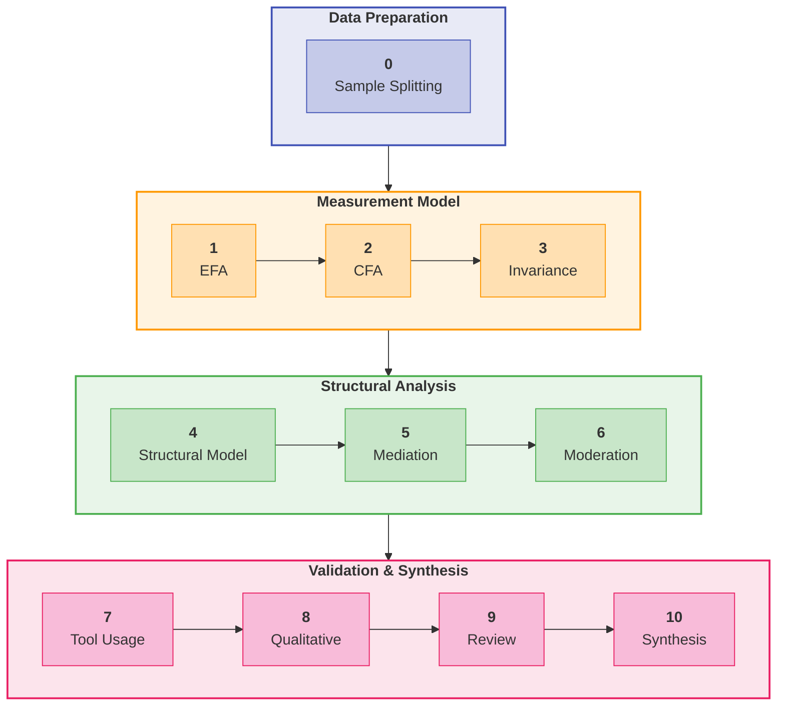
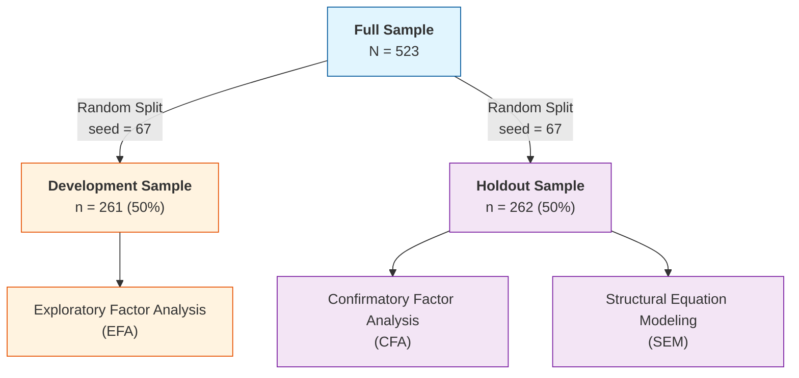
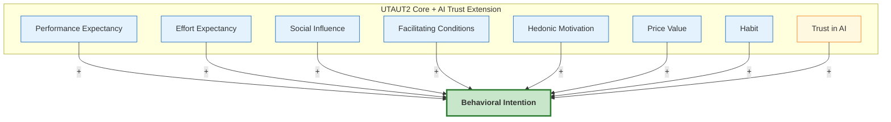

# Chapter 3: Research Methodology

## 3.1 Introduction

This chapter describes the research methodology employed to develop and validate the AI Readiness Scale (AIRS) and test the extended UTAUT model for AI tool adoption in higher education. The study follows established scale development procedures (DeVellis & Thorpe, 2021; Hinkin, 1998) combined with structural equation modeling to examine relationships between latent constructs. The research design prioritizes psychometric rigor through split-sample cross-validation, comprehensive validity assessment, and multi-group invariance testing.

The chapter is organized as follows: Section 3.2 describes the research philosophy and design; Section 3.3 details the theoretical framework and hypotheses; Section 3.4 covers instrument development; Section 3.5 addresses sampling and data collection; Section 3.6 presents the analytical strategy; Section 3.7 discusses reliability and validity; Section 3.8 covers ethical considerations; and Section 3.9 acknowledges methodological limitations.

## 3.2 Research Design

### 3.2.1 Research Philosophy

This study adopts a **post-positivist** philosophical stance, recognizing that while objective reality exists, our understanding of it is necessarily imperfect and probabilistic (Creswell & Creswell, 2018). This orientation is appropriate for scale development research, which seeks to measure latent psychological constructs through observable indicators while acknowledging measurement error and the provisional nature of theoretical models.

The post-positivist approach manifests in several methodological choices:

- Emphasis on **replication and cross-validation** through split-sample design
- Use of **probabilistic inference** (confidence intervals, effect sizes) rather than binary significance testing
- Recognition of **measurement error** through latent variable modeling
- **Theory-driven** hypothesis testing with openness to unexpected findings

### 3.2.2 Research Approach

The study employs a **sequential mixed methods design** (Creswell & Clark, 2017) with quantitative primacy:

1. **Primary Quantitative Component**: Structured survey measuring UTAUT constructs on Likert scales, analyzed through factor analysis and structural equation modeling

2. **Supplementary Qualitative Component**: Open-ended feedback questions analyzed through thematic analysis to provide contextual depth and identify emergent themes not captured by closed-ended items

This design allows triangulation of findings, with qualitative data enriching interpretation of quantitative patterns (e.g., understanding why certain constructs predict adoption more strongly than others).

### 3.2.3 Time Horizon

The study employs a **cross-sectional design** with data collected during November 2024. While cross-sectional designs preclude causal inference, they are standard for initial scale validation studies (DeVellis & Thorpe, 2021). The design captures a snapshot of AI adoption readiness during a period of rapid AI tool proliferation in higher education, providing a baseline for future longitudinal research.

### 3.2.4 Research Context

The study was conducted with **United States professionals and students**, encompassing:

- Full-time and part-time students (undergraduate and postgraduate)
- Employed professionals (individual contributors, managers, executives)
- Freelancers and self-employed individuals

Students are included because they are transitioning into an AI-infused job market and will soon make adoption decisions inside organizations; their readiness is therefore directly relevant to near-term enterprise contexts (proposal §7.2). This context was selected for theoretical and practical relevance: knowledge-intensive work settings where AI tools have significant potential impact on productivity, yet adoption patterns remain poorly understood.

## 3.3 Theoretical Framework and Hypotheses

### 3.3.1 Extended UTAUT Model

The study extends Venkatesh et al.'s (2012) Unified Theory of Acceptance and Use of Technology 2 (UTAUT2) with AI-specific constructs. The theoretical model comprises eight latent factors predicting Behavioral Intention to adopt AI tools:

**Core UTAUT2 Constructs:**

- **Performance Expectancy (PE)**: The degree to which using AI tools will provide benefits in performing activities
- **Effort Expectancy (EE)**: The degree of ease associated with using AI tools
- **Social Influence (SI)**: The degree to which important others believe one should use AI tools
- **Facilitating Conditions (FC)**: Perceptions of resources and support available for AI tool use
- **Hedonic Motivation (HM)**: The fun or pleasure derived from using AI tools

**AI-Specific Extensions:**

- **Trust in AI (TR)**: Confidence in AI systems' reliability, accuracy, and benevolence
- **AI Anxiety (AX)**: Apprehension or fear associated with AI technology

**Outcome:**

- **Behavioral Intention (BI)**: Intent to adopt and use AI tools in professional/academic activities

### 3.3.2 Research Hypotheses

Based on UTAUT theory and emerging AI adoption literature, the following hypotheses were tested:

**Primary Hypotheses (Direct Effects):**

- H1a: Performance Expectancy positively predicts Behavioral Intention
- H1b: Effort Expectancy positively predicts Behavioral Intention
- H1c: Social Influence positively predicts Behavioral Intention
- H1d: Facilitating Conditions positively predicts Behavioral Intention
- H1e: Hedonic Motivation positively predicts Behavioral Intention
- H1f: Price Value positively predicts Behavioral Intention
- H1g: Habit positively predicts Behavioral Intention

**AI-Specific Extension Hypothesis:**

- H2: AI Trust positively predicts Behavioral Intention beyond UTAUT2 core constructs

*Note: AI Anxiety (AX) was initially proposed as an inhibitor construct but was excluded from hypothesis testing due to inadequate reliability (α = .30) identified during exploratory factor analysis. See Section 4.2 for construct development outcomes.*

**Moderation Hypotheses:**

- H3: AI Experience moderates UTAUT relationships (strengthening effects for experienced users)
- H4: Role group (Student vs. Professional+Leader) moderates UTAUT path coefficients

**Behavioral Validation:**

- H5: Behavioral Intention positively relates to actual AI tool usage breadth
- H6: Role groups differ significantly in AI tool usage patterns

## 3.4 Instrument Development

### 3.4.1 Initial Item Pool

The initial AIRS instrument comprised **28 items across 12 constructs**:

- 7 core UTAUT2 constructs (14 items): PE, EE, SI, FC, HM, PV, HB
- 5 AI-specific extensions (10 items): TR, AX, VO, EX, ER
- 1 outcome construct (4 items): BI

Items were measured on 5-point Likert scales (1 = Strongly Disagree to 5 = Strongly Agree), with negatively-worded items (AX, ER) reverse-scored prior to analysis.

*Note: The final validated instrument comprises **16 items across 8 constructs** (PE, EE, SI, FC, HM, PV, HB, TR) plus the BI outcome. Four constructs (Voluntariness, Explainability, Ethical Risk, AI Anxiety) were excluded during EFA due to inadequate reliability (α = .30–.58). See Chapter 4, Section 4.2 for detailed item disposition.*

### 3.4.2 Item Sources

Items were adapted from established scales to ensure content validity:

| Construct | Source | Adaptation |
|-----------|--------|------------|
| PE, EE, SI, FC, HM | Venkatesh et al. (2012) UTAUT2 | Context adapted for AI tools |
| PV, HB | Venkatesh et al. (2012) UTAUT2 | Context adapted for AI tools |
| TR | McKnight et al. (2002); Siau & Wang (2018) | Adapted for AI systems |
| AX | Venkatesh (2000); Meuter et al. (2003) | Technology anxiety → AI anxiety |
| VO | Moore & Benbasat (1991) | Voluntariness of use |
| EX | Shin (2021) | Explainability in AI |
| ER | Gursoy et al. (2019) | Ethical risk perception |
| BI | Venkatesh et al. (2003) | Standard UTAUT items |

### 3.4.3 Content Validity

Content validity was established through:

1. **Literature Review**: Items grounded in established UTAUT and technology acceptance literature
2. **Construct Definition Mapping**: Each item mapped to specific construct definition
3. **Face Validity Review**: Items reviewed for clarity and appropriateness to AI context

### 3.4.4 Construct Exclusion Process

Of the 12 constructs proposed, **four AI-specific constructs were excluded** during exploratory factor analysis due to inadequate psychometric properties:

| Construct | Items | Cronbach's α | Issue | Disposition |
|-----------|-------|--------------|-------|-------------|
| Voluntariness (VO) | VO1, VO2 | .41 | Multi-dimensional | Dropped |
| Explainability (EX) | EX1, EX2 | .58 | Multi-dimensional | Dropped |
| Ethical Risk (ER) | ER1, ER2 | .55 | Multi-dimensional | Dropped |
| AI Anxiety (AX) | AX1, AX2 | .30 | Item heterogeneity | Dropped |

**Interpretation**: These constructs demonstrated poor inter-item correlations, suggesting the two-item scales measured different facets of multi-dimensional phenomena rather than unitary constructs. For example:

- **Voluntariness**: VO1 assessed choice to use AI, while VO2 assessed freedom not to use—conceptually distinct aspects of voluntary adoption
- **Explainability**: EX1 assessed understanding AI outputs, while EX2 assessed preference for explanations—comprehension vs. preference dimensions
- **Ethical Risk**: ER1 assessed job displacement concerns, while ER2 assessed privacy concerns—distinct risk categories
- **AI Anxiety**: AX1 captured technology avoidance, while AX2 captured fear of obsolescence—avoidance vs. approach motivations

**Resolution**: All four AI-specific constructs were excluded from the final measurement model due to inadequate reliability. These constructs remain theoretically important for AI adoption research and require more comprehensive operationalization with 3-4 items per sub-dimension in future studies.

**Note**: This represents an empirical finding, not a design limitation. The proposal committed to testing these constructs; the data revealed inadequate measurement properties. This transparent reporting aligns with best practices in scale development (DeVellis & Thorpe, 2021).

### 3.4.5 Final Instrument Structure

Following psychometric validation (see Chapter 4), the final AIRS instrument comprises **16 items across 8 factors** (7 UTAUT2 predictors + AI Trust extension):

| Factor | Items | Example Item |
|--------|-------|--------------|
| Performance Expectancy | PE1, PE2 | "Using AI tools increases my productivity" |
| Effort Expectancy | EE1, EE2 | "Learning to use AI tools is easy for me" |
| Social Influence | SI1, SI2 | "People important to me think I should use AI tools" |
| Facilitating Conditions | FC1, FC2 | "I have the resources necessary to use AI tools" |
| Hedonic Motivation | HM1, HM2 | "Using AI tools is fun" |
| Price Value | PV1, PV2 | "AI tools are good value for the money" |
| Habit | HB1, HB2 | "Using AI tools has become a habit for me" |
| AI Trust | TR1, TR2 | "I trust AI tools to provide accurate information" |

*Note: Behavioral Intention (BI) serves as the outcome variable in the structural model.*

## 3.5 Sampling and Data Collection

### 3.5.1 Target Population

The target population comprises adults in the United States who are either students or employed professionals (proposal §7.2). This includes:

- Full-time and part-time students at undergraduate and postgraduate levels
- Employed professionals in individual contributor roles
- Employed professionals in managerial and leadership roles
- Freelancers and self-employed individuals

### 3.5.2 Sampling Strategy

**Convenience sampling** was employed via:

- Institutional email distribution to staff and students
- Academic and professional network sharing
- Social media outreach (LinkedIn, Twitter/X)

While convenience sampling limits generalizability, it is appropriate for initial scale validation studies where the primary goal is psychometric evaluation rather than population inference (DeVellis & Thorpe, 2021).

### 3.5.3 Sample Size Determination

Target sample size was determined based on:

1. **SEM requirements**: Minimum N = 200 for stable Maximum Likelihood estimation (Kline, 2016)
2. **Factor analysis**: Minimum 10:1 subject-to-item ratio (Costello & Osborne, 2005)
3. **Multi-group analysis**: Minimum n = 100 per group (Hair et al., 2019)
4. **Split-sample cross-validation**: N > 500 to enable 50/50 split with adequate subsamples

**Achieved sample**: N = 523 (exceeds all requirements)

### 3.5.4 Role Classification

Respondents were classified into three role groups based on self-reported primary role:

| Category | Operational Definition | n | % |
|----------|----------------------|---|---|
| Student | Full-time students (n=196), part-time students (n=20) | 216 | 41.3% |
| Professional | Individual contributors (n=112), freelancers (n=32), other (n=23), unemployed (n=17) | 184 | 35.2% |
| Leader | Managers (n=71), executives (n=52) | 123 | 23.5% |

**Note**: For multi-group SEM requiring larger group sizes, Professional and Leader categories were combined (n = 307) to contrast with Student (n = 216). This grouping reflects meaningful theoretical distinctions between student-focused and employment-focused roles.

### 3.5.5 Data Collection Procedures

**Platform**: Qualtrics online survey platform

**Collection Period**: November 2024 (3-week window)

**Procedures**:

1. Participants accessed survey via distributed link
2. Informed consent obtained before data collection
3. Survey completion time: approximately 10-15 minutes
4. All responses anonymous; no personally identifiable information collected

### 3.5.6 Data Quality Assurance

Multiple quality checks were implemented:

| Check | Criterion | Action |
|-------|-----------|--------|
| Completion status | Finished = True | Exclude incomplete responses |
| Response time | > 3 minutes | Exclude speeders |
| Attention checks | Correct response | Exclude inattentive responses |
| Pattern responding | Variance > 0 | Exclude straight-line responses |
| Duplicate detection | Unique IP/device | Retain first response only |

**Final valid sample**: N = 523 after quality screening

## 3.6 Analytical Strategy

### 3.6.1 Analysis Pipeline

The analysis followed a systematic 10-phase pipeline ensuring replicability and transparency:

| Phase | Notebook | Purpose |
|-------|----------|----------|
| 0 | Sample Splitting | Create EFA/CFA subsamples |
| 1 | EFA | Explore factor structure |
| 2 | CFA | Validate factor structure |
| 3 | Invariance | Test measurement invariance |
| 4 | Structural Model | Test hypotheses |
| 5 | Mediation | Examine indirect effects |
| 6 | Moderation | Test moderating effects |
| 7 | Tool Usage | Behavioral validation |
| 8 | Qualitative | Thematic analysis |
| 9 | Comprehensive Review | Gap analysis |
| 10 | Final Synthesis | Integration |

<!-- Figure 3: Ten-Phase Analysis Pipeline -->

### 3.6.2 Sample Splitting Strategy

To ensure independent validation, the sample was randomly split:

<!-- Figure 1: Split-Sample Cross-Validation Strategy -->

**Stratification**: Split stratified by AI adoption status to ensure comparable samples

**Reproducibility**: Random seed (67) documented for exact replication

### 3.6.3 Exploratory Factor Analysis (EFA)

**Purpose**: Identify underlying factor structure and reduce item pool

**Sample**: Development subsample (n = 261)

**Extraction Method**: Principal Axis Factoring (PAF)

- Selected for robustness to non-normality
- Accounts for measurement error

**Rotation**: Promax (oblique)

- Allows correlated factors (theoretically appropriate)
- Pattern matrix used for interpretation

**Factor Retention Criteria**:

1. Kaiser criterion (eigenvalue > 1.0)
2. Parallel analysis (Horn, 1965)
3. Scree plot visual inspection
4. Theoretical interpretability

**Item Retention Criteria**:

| Criterion | Threshold | Rationale |
|-----------|-----------|-----------|
| Primary loading | λ ≥ .50 | Strong factor association |
| Cross-loading | Δλ ≥ .20 | Simple structure |
| Communality | h² ≥ .30 | Adequate shared variance |

**Software**: Python `factor_analyzer` package (v0.5.1)

### 3.6.4 Confirmatory Factor Analysis (CFA)

**Purpose**: Validate factor structure on independent sample

**Sample**: Holdout subsample (n = 262)

**Estimation Method**: Maximum Likelihood (ML)

- Standard for continuous indicators
- Provides χ² test and fit indices

**Model Specification**: 8-factor correlated model with 16 observed indicators (2 per factor)

**Fit Index Thresholds**:

| Index | Acceptable | Good | Excellent |
|-------|------------|------|-----------|
| χ²/df | < 5.0 | < 3.0 | < 2.0 |
| CFI | ≥ .90 | ≥ .95 | ≥ .97 |
| TLI | ≥ .90 | ≥ .95 | ≥ .97 |
| RMSEA | ≤ .10 | ≤ .08 | ≤ .05 |
| SRMR | ≤ .10 | ≤ .08 | ≤ .05 |

Thresholds based on Hu & Bentler (1999) and Hair et al. (2019).

**Software**: Python `semopy` package (v2.3.10)

### 3.6.5 Measurement Invariance Testing

**Purpose**: Establish construct comparability across role groups for valid multi-group comparison

**Levels Tested**:

| Level | Constraint | Interpretation |
|-------|------------|----------------|
| Configural | Same factor structure | Qualitative equivalence |
| Metric | Equal factor loadings | Quantitative equivalence |
| Scalar | Equal intercepts | Mean comparability |

**Criteria for Invariance** (Chen, 2007):

- ΔCFI < .010
- ΔRMSEA < .015
- Δχ² non-significant (supplementary)

**Groups**: Student (n = 216) vs. Professional+Leader (n = 307)

### 3.6.6 Structural Equation Modeling (SEM)

**Purpose**: Test hypothesized relationships between latent constructs

**Model**:

<!-- Figure 2: Structural Model: Eight Predictors of Behavioral Intention -->
*Note: AI Anxiety was initially proposed but excluded due to inadequate reliability (α = .30).*

**Estimation**: Maximum Likelihood with robust standard errors

**Multi-Group Analysis**: Separate models for Student and Professional+Leader groups

**Moderation Testing**:

- Experience × UTAUT interactions via latent interaction terms
- Role moderation via multi-group path comparison (Δχ² tests)

**Effect Size Interpretation** (Cohen, 1988):

| β | Interpretation |
|---|----------------|
| < .10 | Negligible |
| .10–.29 | Small |
| .30–.49 | Medium |
| ≥ .50 | Large |

### 3.6.7 Mediation Analysis

**Purpose**: Examine indirect pathways through the model

**Method**: Bootstrap estimation (1,000 resamples) for indirect effect confidence intervals

**Significance**: 95% CI excluding zero

### 3.6.8 Cluster Analysis

**Purpose**: Identify distinct user typologies based on UTAUT profile patterns

**Method**: K-means clustering

**Variables**: Standardized scores on 8 AIRS constructs

**Cluster Selection**:

- Elbow method
- Silhouette analysis
- Theoretical interpretability

**Optimal Solution**: k = 4 clusters

### 3.6.9 Qualitative Analysis

**Purpose**: Provide contextual depth and identify emergent themes

**Data**: Open-ended survey responses (n = 243 substantive responses, 46.5% response rate)

**Method**: Thematic analysis (Braun & Clarke, 2006)

1. Familiarization with data
2. Initial coding using keyword matching
3. Theme development and refinement
4. Theme prevalence quantification
5. Role-based comparison

**Themes Identified**: 10 distinct themes (see Chapter 4)

### 3.6.10 Statistical Software

All analyses conducted using Python 3.11 with the following packages:

| Package | Version | Purpose |
|---------|---------|---------|
| pandas | 2.1.0 | Data manipulation |
| numpy | 1.26.0 | Numerical computing |
| scipy | 1.11.0 | Statistical tests |
| factor_analyzer | 0.5.1 | Exploratory factor analysis |
| semopy | 2.3.10 | Confirmatory factor analysis, SEM |
| pingouin | 0.5.3 | Effect sizes, reliability |
| scikit-learn | 1.3.0 | Cluster analysis |
| matplotlib | 3.8.0 | Visualization |
| seaborn | 0.13.0 | Statistical graphics |

**Environment**: Jupyter notebooks executed in VS Code with Python virtual environment

**Reproducibility**: All random operations use documented seeds; complete analysis pipeline available in GitHub repository

## 3.7 Reliability and Validity Assessment

### 3.7.1 Internal Consistency Reliability

**Measures**:

- **Cronbach's Alpha (α)**: Classical reliability coefficient
- **Composite Reliability (CR)**: SEM-based reliability accounting for differential loadings

**Thresholds**:

| Measure | Minimum | Preferred |
|---------|---------|-----------|
| Cronbach's α | .70 | .80 |
| Composite Reliability | .70 | .80 |

### 3.7.2 Convergent Validity

**Definition**: Extent to which indicators of a construct share variance

**Assessment**:

1. **Factor loadings**: All standardized loadings ≥ .70
2. **Average Variance Extracted (AVE)**: Proportion of variance captured by construct

**Threshold**: AVE ≥ .50 (Fornell & Larcker, 1981)

### 3.7.3 Discriminant Validity

**Definition**: Extent to which constructs are distinct from one another

**Assessment Methods**:

1. **Fornell-Larcker Criterion**: √AVE > inter-construct correlations
2. **Heterotrait-Monotrait Ratio (HTMT)**: HTMT < .85 (Henseler et al., 2015)
3. **Maximum correlation**: |r| < .85 between any construct pair

### 3.7.4 Criterion Validity

**Predictive Validity**: AIRS constructs predict actual tool usage behavior (ρ = .69 for BI × tool breadth)

**Known-Groups Validity**: Constructs differentiate between theoretically-distinct groups (e.g., Leaders vs. Academics)

## 3.8 Ethical Considerations

### 3.8.1 Institutional Approval

The study received ethical approval from the institution's Research Ethics Committee prior to data collection. The research was classified as minimal risk given:

- Anonymous data collection
- Voluntary participation
- Non-sensitive topic
- Adult participants only

### 3.8.2 Informed Consent

Participants were provided with:

- Study purpose and objectives
- Data handling and storage procedures
- Right to withdraw without penalty
- Researcher contact information

Consent was obtained electronically before survey access. Participants could not proceed without acknowledging consent.

### 3.8.3 Anonymity and Confidentiality

**Anonymity**: No personally identifiable information collected

- No names, emails, or employee IDs
- IP addresses not recorded
- Demographic data collected at categorical level only

**Confidentiality**:

- Data stored on encrypted, password-protected systems
- Access limited to research team
- Data retained according to institutional policy (minimum 5 years)

### 3.8.4 Data Protection

The study complies with:

- IRB approval requirements
- Institutional data governance policies
- Research ethics standards for human subjects research

### 3.8.5 Participant Welfare

The survey addressed non-sensitive topics related to technology use attitudes. No anticipated risks to participant welfare. Contact information provided for questions or concerns.

## 3.9 Methodological Limitations

### 3.9.1 Design Limitations

1. **Cross-sectional design**: Precludes causal inference; relationships may be correlational rather than causal. Future longitudinal studies needed to establish temporal precedence.

2. **Self-reported measures**: Behavioral Intention is a proxy for actual behavior. While BI strongly predicts behavior in UTAUT studies, some intention-behavior gap is expected.

3. **Single time point**: Attitudes and technology contexts change rapidly; findings reflect November 2024 snapshot.

### 3.9.2 Sampling Limitations

1. **Convenience sampling**: Non-probability sampling limits generalizability to broader populations. Results may not generalize beyond similar United States professional and student contexts.

2. **Single institution**: While diverse roles represented, institutional culture may influence responses.

3. **Self-selection bias**: Participants interested in AI may be overrepresented.

### 3.9.3 Measurement Limitations

1. **English language only**: Non-English speakers excluded; cross-cultural validity not established.

2. **Two items per construct**: While meeting minimum identification requirements for SEM, more indicators would improve reliability and content coverage.

3. **Adapted scales**: Items adapted from existing instruments; some original validation evidence may not transfer perfectly.

### 3.9.4 Analytical Limitations

1. **Normality assumptions**: ML estimation assumes multivariate normality; some departures may affect standard errors (though robust methods used where possible).

2. **Common method variance**: Single-source, single-time data collection may inflate correlations. Harman's single-factor test conducted as diagnostic.

3. **Model complexity**: Eight-factor model with limited items requires careful balance between fit and parsimony.

## 3.10 Chapter Summary

This chapter has described the research methodology for developing and validating the AI Readiness Scale (AIRS) and testing the extended UTAUT model for AI tool adoption. Key methodological features include:

**Research Design**:

- Post-positivist philosophy with mixed methods approach
- Cross-sectional survey with qualitative supplementation
- United States professionals and students context

**Instrument**:

- 28 initial items across 12 constructs
- Final validated instrument: 16 items across 8 factors
- 5-point Likert scale measurement

**Sample**:

- N = 523 United States adults
- Two population groups: Students (216), Professionals (307)
- 50/50 split for cross-validation (EFA n = 261, CFA n = 262)

**Analysis**:

- 10-phase systematic pipeline
- EFA for structure exploration, CFA for validation
- Multi-group SEM for hypothesis testing
- Cluster analysis for user typology
- Thematic analysis for qualitative insights

**Validity**:

- Comprehensive reliability and validity assessment
- Measurement invariance across role groups
- Criterion validity through behavioral correlates

The methodology provides a rigorous foundation for the empirical findings presented in Chapter 4, while acknowledging limitations inherent in cross-sectional survey research.
